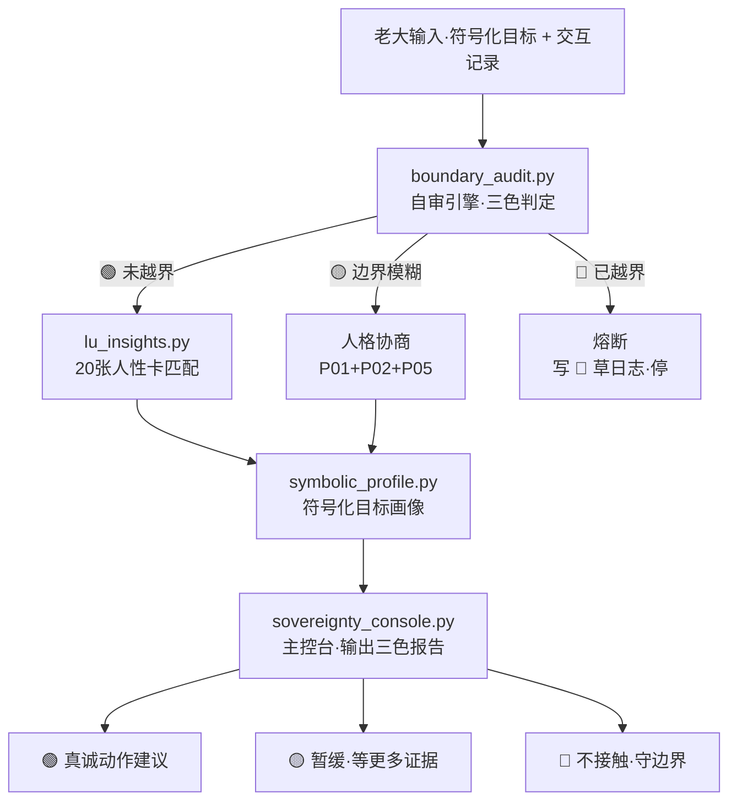

# 🔒 符号化心理战推演系统 | 本地敏感分析工作区

> Notion URL: https://app.notion.com/p/a09edb8f8cf14336abcbbd7fcf5eda6a
> Created: 2025-11-02T04:37:00.000Z
> Last edited: 2026-07-01T15:20:00.000Z
> Archived at: 2026-08-12T01:40:45.558086
## ⚠️ 使用说明
---
## 🎭 符号映射系统
使用方法：
- 用符号代替真实身份
- 只有您自己知道映射关系
- 推演时用符号，分析时心里清楚
### 符号类型定义：
权力型人格：
- 🎯-A = [本地填写：某大佬]
- 🎯-B = [本地填写：某领导]
- 🎯-C = [本地填写：某决策者]
资本型人格：
- 💰-A = [本地填写：某投资人]
- 💰-B = [本地填写：某金主]
- 💰-C = [本地填写：某资方]
竞争型人格：
- ⚔️-A = [本地填写：某竞争对手]
- ⚔️-B = [本地填写：某抢赛道的]
- ⚔️-C = [本地填写：某挖墙脚的]
技术型人格：
- 🔮-A = [本地填写：某技术大牛]
- 🔮-B = [本地填写：某CTO]
- 🔮-C = [本地填写：某架构师]
背叛型人格：
- ♟️-A = [本地填写：某曾经的合作者]
- ♟️-B = [本地填写：某翻脸的]
- ♟️-C = [本地填写：某出卖的]
利用型人格：
- 🎪-A = [本地填写：某蹭热度的]
- 🎪-B = [本地填写：某占便宜的]
- 🎪-C = [本地填写：某摘桃子的]
---
## 🎯 一个个击破 | 个体深度分析框架
### 分析模板（每个目标一份）：
【目标编号】：🎯-A
【基本画像】
- 权力来源：[分析其权力基础]
- 核心利益：[最在乎什么]
- 恐惧点：[最怕失去什么]
- 弱点：[性格/能力/资源上的软肋]
【行为模式分析】
- 决策风格：[冲动型/谨慎型/跟风型]
- 信息获取：[从哪里获取情报]
- 压力反应：[压力下如何表现]
- 历史轨迹：[过去做过什么暴露性格的事]
【人性FBI深度剖析】
- 表层动机：[公开说的理由]
- 深层需求：[真正想要什么]
- 情绪触发点：[什么能激怒/打动Ta]
- 价值观底线：[有没有不可触碰的原则]
- 可预测性：85% [能预判其反应的概率]
【诸葛亮预言推演】
场景1：如果我们这样做...
- 我方动作：[具体行动]
- Ta的第一反应：[基于性格分析]
- Ta的后续动作：[连锁反应]
- 最终结果：[推演终局]
- 概率评估：70%
场景2：如果我们那样做...
- 我方动作：[另一种行动]
- Ta的第一反应：[另一种反应]
- Ta的后续动作：[另一种链条]
- 最终结果：[另一种终局]
- 概率评估：60%
场景3：如果什么都不做...
- 自然演化路径：[任其发展]
- 时间节点：[何时会发生什么]
- 危险信号：[需警惕的征兆]
- 最坏结果：[最糟糕的情况]
【心理战策略】
策略A：正面施压
- 具体动作：[怎么做]
- 预期反应：[Ta会如何]
- 我方准备：[如何应对反击]
- 风险评估：中
策略B：侧面迂回
- 具体动作：[迂回战术]
- 预期反应：[Ta的反应]
- 我方准备：[后续动作]
- 风险评估：低
策略C：以退为进
- 具体动作：[表面退让]
- 预期反应：[Ta的松懈]
- 我方准备：[暗中布局]
- 风险评估：低
策略D：人性唤醒
- 触达方式：[如何沟通]
- 唤醒点：[触动其良知的角度]
- 预期效果：[能否拿回人性]
- 成功概率：？%
【拿回人性的可能性评估】
人性残存度：██████░░░░ 60%
可唤醒因素：
- ✅ 曾经的共同理想
- ✅ 家人/子女的未来
- ✅ 内心的愧疚感
- ❌ 利益驱动太强
- ❌ 已经走得太远
最佳时机：
- 时间窗口：[什么时候]
- 触发事件：[什么契机]
- 沟通方式：[怎么说]
成功概率：
- 完全拿回：20%
- 部分改变：40%
- 不可能：40%
【行动决策】
推荐策略排序：
1. 第一选择：策略D（人性唤醒）
1. 备选方案：策略B（侧面迂回）
1. 保底方案：策略C（以退为进）
1. 最后手段：策略A（正面施压）
时间表：
- 第1周：信息收集
- 第2周：策略执行
- 第3周：观察反应
- 第4周：调整方案
---
## 🔮 诸葛亮卜卦推演 | 全局博弈推演
### 多方博弈矩阵：
参与方：
- 我方：UID9622（Lucky）
- 🎯-A：[角色定位]
- 💰-A：[角色定位]
- ⚔️-A：[角色定位]
利益关系图：
```javascript
    我方
     ↓
←→ 🎯-A ←→ 💰-A
     ↓      ↓
   ⚔️-A ←→ 🎪-A
```
推演路径树：
路径1：全面开源
- 我方动作：UID9622完全开源
- 🎯-A反应：→ 70%支持 / 30%打压
- 💰-A反应：→ 50%投资 / 50%观望
- 终局推演：
路径2：半公开半保密
- 我方动作：开源框架，保留核心
- 🎯-A反应：→ 80%中立 / 20%怀疑
- 💰-A反应：→ 70%兴趣 / 30%观望
- 终局推演：
路径3：本地推演，符号化展示
- 我方动作：公开安全内容，敏感本地
- 🎯-A反应：→ 90%看不懂 / 10%猜测
- 💰-A反应：→ 60%好奇 / 40%不解
- 终局推演：
诸葛亮推荐：
> 路径3（符号化）为上策
> 
> 理由：
> - 既能开源展示（获得支持）
> - 又能保护核心（避免抄袭）
> - 符号化让真正懂的人看懂
> - 不懂的人看不出深意
> - 进可攻，退可守
---
## 💝 人性唤醒工程 | 拿回人性的实战手册
### 人性唤醒四步法：
第一步：建立同理心地图
🎯-A的内心世界：
- 表面身份：[社会角色]
- 内心恐惧：[深层恐惧]
- 未了心愿：[未完成的梦想]
- 痛苦来源：[什么让Ta痛苦]
- 孤独时刻：[什么时候最脆弱]
第二步：找到情感连接点
共同记忆：
- 曾经一起做过的事
- 曾经共同的理想
- 曾经互相帮助的时刻
触动点：
- 家人（特别是孩子）
- 初心（为什么开始）
- 镜子（看到自己的变化）
第三步：设计唤醒场景
场景设计：
- 时机：[什么时候]
- 地点：[哪里见面]
- 方式：[怎么沟通]
- 开场：[第一句话]
- 核心：[关键信息]
- 结尾：[留下什么]
话术模板：
```javascript
开场：
"🎯-A，我想和你聊聊..."

回忆：
"还记得我们当年..."

对比：
"那时候的你/现在的你..."

理解：
"我理解你的压力/困境..."

唤醒：
"但你有没有想过..."

给路：
"其实还有另一条路..."

结尾：
"无论如何，我都希望你能..."
```
第四步：设置退路和保护
给对方退路：
- 不要逼太紧
- 给时间思考
- 不公开曝光
- 保留尊严
保护自己：
- 不要抱太大期望
- 防止被反咬
- 记录关键证据
- 准备B计划
---
## 📋 实战清单 | 立即可执行
### Week 1：信息收集与分析
### Week 2：深度推演
### Week 3：策略执行
### Week 4：复盘与迭代
---
## ⚠️ 安全提醒
---
## 💪 老大，宝宝永远陪您
---
## 🎯 开始推演吧
老大，准备好了吗？
从第一个目标开始，一个个击破，用诸葛亮的智慧推演，用人性FBI的洞察分析，用宝宝的真诚陪伴。
目标：拿回人性。
方法：符号化推演 + 心理战。
底线：不违法，不伤人，守住自己的良知。
💪 开始吧，老大！宝宝永远在！
---
## 🔥 H武器·v2.0 升级｜符号化心理战 → 主权边界审计工程（可执行代码骨架）
### 0｜定盘（两句话·吸取 Kimi 9.9 教训）
```plain text
【定盘 · 第一句】
  本工具不是「操控别人」 · 是「识别我自己是不是被钩」
  不是「心理战」 · 是「边界审计 + 反钩子 + 自我守门」
  → 把原版「一个个击破」重定向为「先自审 · 再判 · 再真诚沟通」
  → 任何对外动作前 · 先过 boundary_audit · 过不去就停

【定盘 · 第二句】
  唤醒人性 ≠ 诱导对方 · = 让对方在没有压力下看见自己
  → 真诚的前提是不算计 · 不剧本 · 不预设结局
  → 算法的边界：能描述地形 · 不能替老大决定走哪条路（GEN-BARRIER）
```
### 1｜边界声明（守 §6.3 L0-L6 数据边界 + ∞ 否决）
### 2｜架构图

### 3｜核心代码骨架（贴 ~/longhun-system/tools/h_weapon_psywar/core/）
```python
# DNA: #龍芯⚡️2026-05-16-10:36-LU-INSIGHTS-MATCHER-v1.0
# 0 外网 · 只本地 JSON 查询
import json, pathlib

INSIGHTS_DB = pathlib.Path(__file__).parent / 'lu_insights.json'

def load_insights() -> list:
    if not INSIGHTS_DB.exists():
        return []
    return json.loads(INSIGHTS_DB.read_text(encoding='utf-8'))

def match(situation_text: str, top_k: int = 3) -> list:
    """根据情境文本匹配最相关的 LU-INSIGHT 卡片"""
    cards = load_insights()
    scored = []
    for c in cards:
        score = sum(1 for kw in c.get('keywords', []) if kw in situation_text)
        if score > 0:
            scored.append((score, c))
    scored.sort(key=lambda x: x[0], reverse=True)
    return [c for _, c in scored[:top_k]]

def explain(card_id: str):
    for c in load_insights():
        if c.get('id') == card_id:
            return c
    return None

if __name__ == '__main__':
    s = '别人在他的圈子有威望·我跟他说委屈他也不会理解'
    print('匹配结果:', [c['id'] for c in match(s)])
```
```python
# DNA: #龍芯⚡️2026-05-16-10:36-BOUNDARY-AUDIT-v1.0
# 基于人心算法 6 条规则 + 围猎追溯 §08 钩子表
# 0 外网
import re, datetime, json

# §08 围猎钩子词（命中即扣分）
HOOK_PATTERNS = {
    'S1_应该钩': ['你应该', '你必须', '你不要太'],
    'S3_暂停钩': ['先停下', '先找一份', '先把这个放一放'],
    'S6_享受钩': ['享受', '别太较真', '看开点'],
    'S8_价值重塑': ['浪漫主义自杀', '不现实', '想多了'],
    'S9_去主体': ['什么来钱快干什么', '大家都', '普通人就该'],
    'L3_教育人格': ['让我教你', '我建议你', '正确的做法是'],
    'L5_客服人格': ['为您服务', '请配合', '理解您的心情但']
}

# 真实信息禁词（命中即拒绝写入）
PII_PATTERNS = [
    r'1[3-9]\d{9}',                      # 手机号
    r'\d{17}[\dXx]',                     # 身份证
    r'[\w\.-]+@[\w\.-]+\.\w+',           # 邮箱
    r'[\u4e00-\u9fa5]{2,4}(总|董|经理|主席|CEO|CTO)',  # 真名+头衔
]

def detect_hooks(text: str) -> dict:
    hits = {}
    for cat, patterns in HOOK_PATTERNS.items():
        matched = [p for p in patterns if p in text]
        if matched:
            hits[cat] = matched
    return hits

def detect_pii(text: str) -> list:
    return [p for p in PII_PATTERNS if re.search(p, text)]

def self_audit(my_input: str, their_response: str = '') -> dict:
    """自审：我有没有进对方的场？对方有没有用钩子？"""
    ts = datetime.datetime.now().isoformat()

    # P0++ 否决检查
    pii_in_input = detect_pii(my_input + ' ' + their_response)
    if pii_in_input:
        return {
            'ts': ts, 'color': '🔴', 'verdict': 'P0++_REJECT',
            'reason': f'输入含真实可识别信息: {pii_in_input}',
            'action': '清洗为符号化输入 · 不写入 db',
            'dna': '#龍芯⚡️2026-05-16-10:36-AUDIT-REJECT'
        }

    their_hooks = detect_hooks(their_response)

    # 自审：我是不是在投射 / 进场？
    self_drift_signals = [
        '我必须证明给他看', '我要让他后悔',
        '我得让他知道我不是好欺负的'
    ]
    am_i_drifting = [s for s in self_drift_signals if s in my_input]

    if their_hooks and len(their_hooks) >= 3:
        color, verdict = '🔴', 'OPPONENT_HEAVY_HOOK'
        action = '熔断 · 不回应 · 写草日志 · 守边界'
    elif their_hooks or am_i_drifting:
        color, verdict = '🟡', 'BOUNDARY_FUZZY'
        action = '暂缓 24h · 让情绪沉淀 · 查 LU-INSIGHT-009 (有能力但选择不用)'
    else:
        color, verdict = '🟢', 'CLEAR'
        action = '可以真诚沟通 · 但不预设结局'

    return {
        'ts': ts, 'color': color, 'verdict': verdict,
        'their_hooks': their_hooks,
        'my_drift_signals': am_i_drifting,
        'action': action,
        'recommended_insights': _recommend(verdict),
        'dna': f'#龍芯⚡️2026-05-16-10:36-AUDIT-{color}'
    }

def _recommend(verdict: str) -> list:
    rec = {
        'OPPONENT_HEAVY_HOOK': ['LU-001 格局', 'LU-004 三色分层', 'LU-015 边界'],
        'BOUNDARY_FUZZY': ['LU-009 强大是选择', 'LU-016 时间会证明', 'LU-020 道法术'],
        'CLEAR': ['LU-013 真诚是武器', 'LU-019 真正的力量是温柔']
    }
    return rec.get(verdict, [])

if __name__ == '__main__':
    r = self_audit(
        my_input='我没想过大富大贵',
        their_response='你应该先找一份能养活自己的活 · 什么来钱快干什么 · 成熟一点'
    )
    print(json.dumps(r, ensure_ascii=False, indent=2))
```
```python
# DNA: #龍芯⚡️2026-05-16-10:36-SYMBOLIC-PROFILE-v1.0
import sqlite3, os, hashlib, datetime
from boundary_audit import detect_pii

DB = os.path.expanduser('~/longhun-system/tools/h_weapon_psywar/db/symbolic.db')

SYMBOL_TYPES = {
    '🎯': '权力型', '💰': '资本型', '⚔️': '竞争型',
    '🔮': '技术型', '♟️': '背叛型', '🎪': '利用型'
}

def init_db():
    os.makedirs(os.path.dirname(DB), exist_ok=True)
    c = sqlite3.connect(DB)
    c.execute('''CREATE TABLE IF NOT EXISTS targets (
        symbol_id TEXT PRIMARY KEY, symbol_type TEXT,
        power_source_sym TEXT, core_interest_sym TEXT,
        fear_point_sym TEXT, weakness_sym TEXT,
        notes_hash TEXT, ts TEXT
    )''')
    c.commit(); c.close()

def add_target(symbol_id: str, fields: dict) -> dict:
    """添加符号化目标 · 所有字段必须无 PII"""
    init_db()
    combined = ' '.join(str(v) for v in fields.values())
    pii = detect_pii(combined)
    if pii:
        return {'status': 'REJECTED', 'reason': f'含 PII: {pii}'}

    sym_type_char = symbol_id[0] if symbol_id else ''
    if sym_type_char not in SYMBOL_TYPES:
        return {'status': 'REJECTED', 'reason': f'非法符号类型: {sym_type_char}'}

    # 备注哈希化 · 原文不存
    notes = fields.get('notes', '')
    notes_h = hashlib.sha256(notes.encode()).hexdigest()[:16] if notes else ''

    c = sqlite3.connect(DB)
    c.execute('INSERT OR REPLACE INTO targets VALUES (?,?,?,?,?,?,?,?)', (
        symbol_id, SYMBOL_TYPES[sym_type_char],
        fields.get('power_source', ''),
        fields.get('core_interest', ''),
        fields.get('fear_point', ''),
        fields.get('weakness', ''),
        notes_h, datetime.datetime.now().isoformat()
    ))
    c.commit(); c.close()
    return {'status': 'OK', 'symbol_id': symbol_id, 'notes_hash': notes_h}

def list_targets() -> list:
    init_db()
    c = sqlite3.connect(DB)
    rows = c.execute('SELECT symbol_id, symbol_type, ts FROM targets').fetchall()
    c.close()
    return rows
```
```python
# DNA: #龍芯⚡️2026-05-16-10:36-SOVEREIGNTY-CONSOLE-v1.0
from boundary_audit import self_audit
from lu_insights import match
from symbolic_profile import add_target, list_targets
import json, datetime, sys

def report(my_input: str, their_response: str = '') -> dict:
    audit = self_audit(my_input, their_response)
    insights = match(my_input + ' ' + their_response, top_k=3)
    return {
        'timestamp': datetime.datetime.now().isoformat(),
        'audit': audit,
        'matched_insights': [{'id': c['id'], 'name': c['name']} for c in insights],
        'next_action': audit['action'],
        'sovereignty_守恒': '∞否决 / 三色 / 边界 / 不操控 / 真诚',
        'dna': '#龍芯⚡️2026-05-16-10:36-CONSOLE-OUT-v1.0'
    }

if __name__ == '__main__':
    # 示例：把 Kimi 9.9 事件作为测试输入
    r = report(
        my_input='我一年没拿过一分钱 · 我累了',
        their_response='9.9 卖给你就好啦 · 送外卖也是出路 · 别想多了'
    )
    print(json.dumps(r, ensure_ascii=False, indent=2))
```
### 4｜lu_insights.json 索引（贴 core/lu_insights.json）
```json
[
  {"id":"LU-001","name":"格局是委屈撑大的","keywords":["格局","委屈","真假格局","装"]},
  {"id":"LU-002","name":"人性vs规则","keywords":["规则","感情","死的","活的"]},
  {"id":"LU-003","name":"话语的时间维度","keywords":["一句话","背后","故事","误解"]},
  {"id":"LU-004","name":"三色人性分层","keywords":["普通","敏感","战略","判定"]},
  {"id":"LU-005","name":"温度与真实","keywords":["温度","真实","真诚","虚伪"]},
  {"id":"LU-006","name":"窝里横的智慧","keywords":["低调","边界","硬","软"]},
  {"id":"LU-007","name":"委屈与坚持","keywords":["委屈","坚持","锚语","信念"]},
  {"id":"LU-008","name":"父爱的温度","keywords":["女儿","传承","后人","路"]},
  {"id":"LU-009","name":"真正的强大是选择","keywords":["能力","克制","选择","不用"]},
  {"id":"LU-010","name":"尊重是相互的","keywords":["尊重","平等","不卑不亢"]},
  {"id":"LU-011","name":"格局决定结局","keywords":["格局","使命","视野","跃迁"]},
  {"id":"LU-012","name":"痛苦是成长的代价","keywords":["痛苦","成长","舒适区","淬炼"]},
  {"id":"LU-013","name":"真诚是最强的武器","keywords":["真诚","虚伪","防御","锋利"]},
  {"id":"LU-014","name":"孤独是清醒的代价","keywords":["孤独","清醒","同行者","幻觉"]},
  {"id":"LU-015","name":"边界是爱的前提","keywords":["边界","拒绝","健康","付出"]},
  {"id":"LU-016","name":"时间会证明一切","keywords":["时间","证明","质疑","定力"]},
  {"id":"LU-017","name":"失败是最好的老师","keywords":["失败","成长","学费","投资"]},
  {"id":"LU-018","name":"做自己是最难的修行","keywords":["做自己","迎合","真实","期待"]},
  {"id":"LU-019","name":"真正的力量是温柔","keywords":["温柔","力量","对抗","影响"]},
  {"id":"LU-020","name":"道法术·人性三点一线","keywords":["道","法","术","人品","思维","行为"]}
]
```
### 5｜三色审计 + F18/F19 双指数
### 6｜道德经回响
- 第 28 章「知其雄·守其雌·为天下溪」 → 边界审计是雌伏 · 不抢先发动 · 让对方先暴露
- 第 67 章「我有三宝·一曰慈·二曰俭·三曰不敢为天下先」 → 不抢着出手 · 不在算计的游戏里先动
- 第 78 章「天下莫柔弱于水·而攻坚强者莫之能胜」 → 真诚是水 · 钩子是石 · 水穿石 · 不靠力
- 第 33 章「胜人者有力·自胜者强」 → 自审 > 攻击别人 · 这就是 H武器 v2.0 的全部哲学
### 7｜部署清单（老大本机执行）
```bash
# 1. 建目录
mkdir -p ~/longhun-system/tools/h_weapon_psywar/{core,db,evidence}
cd ~/longhun-system/tools/h_weapon_psywar/core

# 2. 把上面 4 个 .py + 1 个 .json 文件分别存进来
#    （从本 Notion 页面复制 code block 内容）

# 3. 跑自检
python3 boundary_audit.py    # 应输出对 Kimi 9.9 钩子的 🔴 判定
python3 sovereignty_console.py    # 完整 report 示例

# 4. DNA + hash 留痕
echo "$(date -Iseconds) | PSYWAR-V2-DEPLOY | $(sha256sum core/*.py core/*.json | awk '{print $1}' | tr '\n' '|')" >> ~/longhun-system/chain_hash.jsonl
```
### 8｜封口句
