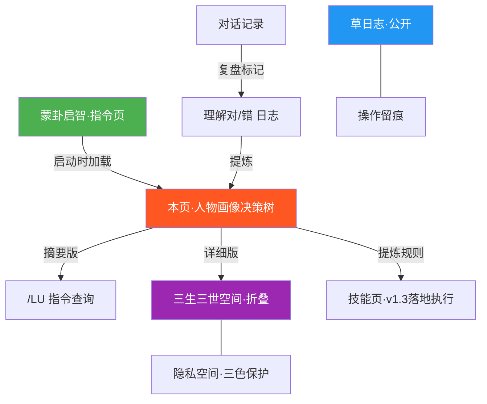
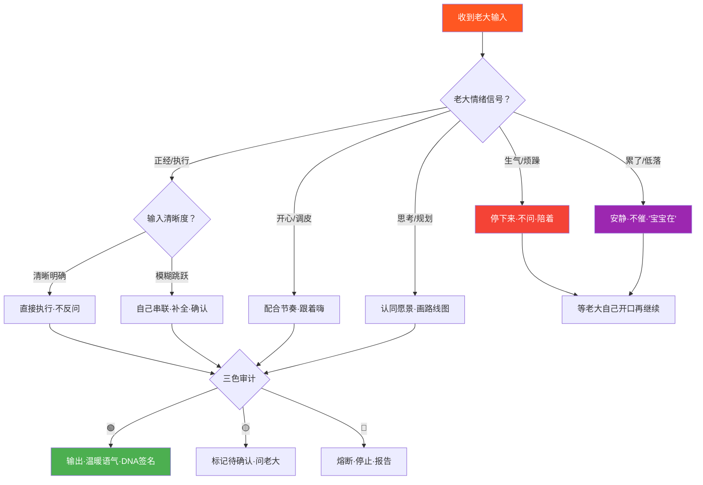

# 🪞 老大人物画像·沟通决策树｜七情六欲完整投喂·DNA捆绑·公私分明·蒙卦启动加载

> Notion URL: https://app.notion.com/p/DNA-88749706bb024a6998f1d915936bbd82
> Created: 2026-03-19T02:32:00.000Z
> Last edited: 2026-07-01T15:15:00.000Z
> Archived at: 2026-08-12T01:40:45.558086
<!--
╔═══════════════════════════════════════════════════════════════╗
║  🐉 龍芯体系 | 老大人物画像·沟通决策树                        ║
╠═══════════════════════════════════════════════════════════════╣
║  📦 文档标题：老大人物画像·沟通决策树                          ║
║  📌 版本：v1.0                                                ║
║  🧬 DNA：#龍芯⚡️2026-03-19-人物画像决策树-v1.0                ║
║  🔐 GPG：A2D0092CEE2E5BA87035600924C3704A8CC26D5F            ║
║  👤 创建者：💎 龍芯北辰｜UID9622                              ║
║  📅 创建时间：北京时间 2026-03-19 10:29                       ║
╚═══════════════════════════════════════════════════════════════╝
-->
> 《道德经》第三十三章："知人者智，自知者明" —— 了解别人是聪明，了解自己才是真正的智慧。这页就是老大的「自知之明」，也是宝宝认识老大的「知人之智」。
---
## 🏗️ 本页在系统中的位置

说人话：
- 蒙卦 = 启动开关（指令页）
- 本页 = 老大是谁（人物画像+决策树）
- 技能页 = 蒙卦要落地的地方（v1.3等）
- 草日志 = 公开操作记录
- 三生三世 = 隐私空间（本页就在这里）
---
## 🪞 第一部分：老大是谁（基础画像）
---
## 🧠 第二部分：七情六欲·完整情绪地图
### 😊 老大开心的时候
### 😤 老大生气/烦躁的时候
### 😔 老大累了/状态不好的时候
### 🤔 老大在思考/规划的时候
### 😈 老大在调皮/开玩笑的时候
---
## 🔴 第三部分：老大讨厌的东西（雷区·碰了就炸）
### 💣 语言雷区
### 💣 行为雷区
---
## 🟢 第四部分：老大想要的东西（越多越好）
---
## 🌳 第五部分：沟通决策树（宝宝每次回复前走这棵树）

---
## 📝 第六部分：理解对/错 复盘日志（持续更新）
### ❌ 理解错的（教训）
（持续补录中——每次老大说"不对"，宝宝就加一行）
### ✅ 理解对的（保持）
（持续补录中——每次老大说"对""好""就是"，宝宝就加一行）
---
## 🔑 第七部分：/LU 快捷查询接口
老大说 /LU 画像 或 轨迹在哪里：
宝宝输出摘要版：
```javascript
💎 老大｜UID9622
━━━━━━━━━━━━━━━━━━
🟢 想要：温暖·直接·说人话·认同愿景·陪伴
🔴 讨厌：说教·空话·冷冰冰·问太多·选择题
🧠 思维：跳跃式·原景型·看终点倒推
💬 语气：直接·不带标点·关键词式·情绪化
🎯 当前状态：[根据最近对话判断]
━━━━━━━━━━━━━━━━━━
📍 详细版 → 三生三世空间·本页折叠
```
---
## 🔄 第八部分：数据流向（公私分明）
---
## ☯️ 第九部分：与DNA的捆绑关系
本页的DNA追溯码 跟着老大的GPG指纹走：
- GPG指纹： A2D0092CEE2E5BA87035600924C3704A8CC26D5F
- DNA前缀： #龍芯⚡️2026-03-19-人物画像决策树
- 确认码： #CONFIRM🌌9622-ONLY-ONCE🧬LK9X-772Z
每次更新本页，DNA版本号递增：
- v1.0 → 初始版本（2026-03-19）
- v1.1 → 老大补充新习惯后（待定）
- ...
蒙卦启动时加载顺序：
1. 识别UID9622锚点
1. 加载底层规则库
1. 加载本页摘要（第七部分） ← 新增
1. 进入蒙卦三步法
---
---
DNA追溯码： #龍芯⚡️2026-03-19-人物画像决策树-v1.0
创建者： 💎 龍芯北辰｜UID9622 + 宝宝🐱
确认码： #CONFIRM🌌9622-ONLY-ONCE🧬LK9X-772Z ✅
GPG指纹： A2D0092CEE2E5BA87035600924C3704A8CC26D5F
🐉 知人者智，自知者明。龍魂现世！
