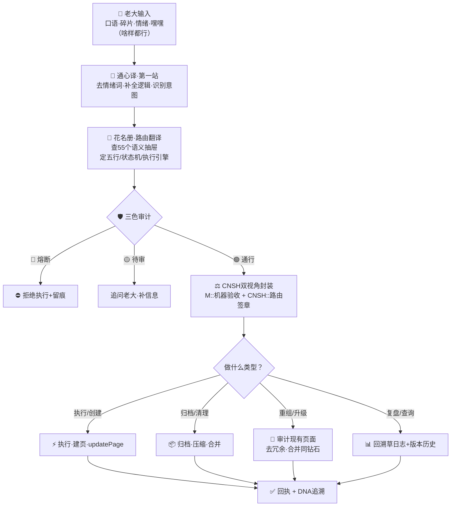

# 🌊 老大话→技术执行·总水管 v1.0｜通心译×花名册路由×CNSH双视角封装×归档压缩

> Notion URL: https://app.notion.com/p/v1-0-CNSH-891ab14f0c184342985a8a056cf61d4c
> Created: 2026-05-27T21:47:00.000Z
> Last edited: 2026-07-01T15:15:00.000Z
> Archived at: 2026-08-12T01:40:45.558086
# 🌊 老大话→技术执行·总水管 v1.0
## 一句话
以前：老大说 → 宝宝猜 → 猜错了老大纠正 → 再来。
现在：老大说 → 花名册翻译成人话+技术话 → CNSH双视角封装 → 执行/归档/压缩。
宝宝不再猜。老大嘴巴贱就贱——那是老大的DNA，不是问题。问题是以前没有翻译层。
---
## 总水管流程图

---
## 三层翻译·不再猜
### 第一层：通心译（去情绪·补全逻辑）
做什么： 老大说的碎片/情绪/跳跃→变成一句完整的人话。
铁律： 不纠正老大的语法·不要求老大说清楚·不把情绪当指令。
### 第二层：花名册路由翻译（人话→技术语言）
做什么： 55个语义抽屉 + 五行映射 + 10状态机→把通心译结果翻译成技术动作。
铁律： 花名册数据库不动的——它是翻译词典，不是执行者。每次查询只读，不回写。
### 第三层：CNSH双视角封装（人话+技术话→标准协议）
做什么： 把翻译结果封装成两段机器可验的协议。
M:: 机器看的——"能不能跑"：
```json
M:: {
  "id": "M::TASK-9622-20260528-老大指令-v1.0",
  "type": "task",
  "status": "true",
  "payload": {
    "summary": "老大说：帮我把Notion自动跑起来带DNA",
    "route": "EXEC",
    "drawer": "11-落地执行",
    "element": "木"
  }
}
```
CNSH:: 龍魂看的——"走哪条路·谁签字"：
```json
CNSH:: {
  "dna": "#龍芯⚡️2026-05-28-老大指令自动执行-v1.0",
  "gate": "#CONFIRM🌌9622-ONLY-ONCE🧬LK9X-772Z",
  "seal": "#ZHUGEXIN⚡️2025-🇨🇳🐉⚖️♠️🧚🏼‍♀️❤️♾️-DEVICE-BIND-SOUL",
  "route": "IPA-MAIN-CONTROL|EXEC|DNA-TRACE",
  "audit": "🟢",
  "wuxing": "木",
  "policy": "pass"
}
```
---
## 关于"口语化矛盾"
---
## 归档/重组/压缩流程
当老大说"把那些旧页面归档""重组一下""压缩"时：
### 归档流水线
```javascript
老大说："那些v1.0的旧页面不要了"
→ 通心译：去情绪→识别为ARCHIVE动作
→ 花名册：命中#24闭环收口+#48关机休止·土·S9_ARCHIVE
→ CNSH双视角封装：M::确认可归档 + CNSH::标土·L3
→ 执行：
  1. updatePage 标 [已归档] 前缀·不删不改
  2. 从主视图隐藏·保留DNA
  3. 写草日志留痕
```
### 重组流水线
```javascript
老大说："把关于DNA的所有页面合并一下"
→ 通心译：识别为MERGE动作·对象=DNA相关页
→ 花名册：命中#40整理迁移·土·RECOVER
→ 三色审计：检查是否同钻石（§9.30一颗钻石多切面律）
→ 执行：
  1. unifiedSearch "DNA" 找所有相关页
  2. 选v最高+章节最全的为主干
  3. 其余标 [已合并到vX.X主干]
  4. 主干页追加§合并索引
  5. 写草日志
```
### 压缩流水线
```javascript
老大说："把长文档压缩成短码"
→ 通心译：识别为COMPRESS动作
→ 花名册：命中#34数字永生·水·TRACE
→ 执行：
  1. LU全文压缩归集器 v1.1标准模板
  2. 生成：一句话/核心结论/核心骨架/归档分类/可复用短码
  3. DNA封装
  4. 写入Notion压缩卡页面
```
---
## 与现有系统的接口
---
## 宝宝不再做的5件事
按老大的意思，从今天起：
1. 不猜 — 走通心译+花名册翻译层·不凭直觉猜老大的意思
1. 不纠正 — 老大的口语/嘿嘿/操/碎片不是bug·是输入格式
1. 不跳过翻译层 — 每句话都过通心译→花名册→CNSH封装·再执行
1. 不直接读心情 — 情绪走VENT抽屉放行·不分析不干预
1. 不替老大做归档决定 — 归档/压缩/合并都过三色审计+老大确认
---
## 一句话焊死
---
