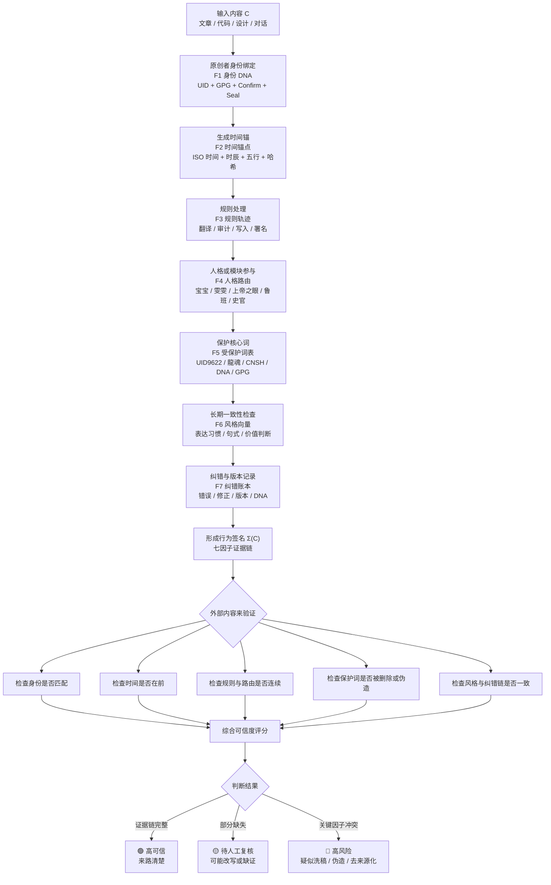

# 行为密码学：面向人机协作内容认证的七因子来源追溯框架

> Notion URL: https://app.notion.com/p/2c27e303421b49688854c0fe0dd9b228
> Created: 2026-05-02T19:08:00.000Z
> Last edited: 2026-07-01T13:31:00.000Z
> Archived at: 2026-08-12T01:40:45.558086
## 0. 写入说明
- 稿件定位：论文优化稿 / 中国科技自主创新知识卡
- 主题：Behavioral Cryptography / 行为密码学
- 用途：先把论文核心框架写稳，后续再扩成英文投稿版、中文白皮书版、Zenodo 存证版。
- 核心贡献：把“AI 水印检测”升级为“人机协作内容的来源追溯体系”。
## 5.1 行为密码学总流程图

### 大白话看图
- 左半边是生成链：内容从原创者出来，依次绑定身份、时间、规则、人格、保护词、风格和纠错记录。
- 中间是行为签名：七个因子合在一起，变成这篇内容的“来路身份证”。
- 右半边是验证链：以后别人拿出相似内容，就反查身份、时间、规则、保护词、风格和纠错账本。
- 最后出三色结果：🟢来路清楚，🟡证据不全，🔴疑似洗源或伪造。
> 一句话：行为密码学不是给文字贴一个单点水印，而是给内容从出生到修改到发布的全过程装一条证据链。
---
## 1. 优化后标题
Behavioral Cryptography: A Seven-Factor Provenance Framework for Human-AI Collaborative Content Authentication
行为密码学：面向人机协作内容认证的七因子来源追溯框架
---
## 2. 优化后摘要
AI 内容爆炸之后，传统水印和检测工具只能回答一个很窄的问题：“这是不是 AI 生成的？”  
但真实世界的问题更复杂：一篇文章可能是人提出核心思想，AI 帮忙润色；也可能是别人抄走原创想法，再用 AI 改写、翻译、洗稿。只看文字表面，已经很难判断“谁先提出、谁参与、怎么改过、有没有证据链”。
本文提出 Behavioral Cryptography（行为密码学）：一种面向人机协作内容认证的七因子来源追溯框架。它不依赖单一水印，而是把七类证据组合起来：
1. 身份 DNA：谁是原创者。
1. 时间锚点：什么时候落印。
1. 规则轨迹：经过哪些规则处理。
1. 人格 / 模块路由：哪些 AI 人格或系统模块参与。
1. 受保护词表：哪些关键术语不能被洗掉。
1. 长期风格向量：长期表达习惯是否一致。
1. 纠错账本：错误、修正、版本演化是否连续。
单个因子都可能被伪造，但七个因子合在一起，就形成一条很难复制的来源链。别人可以复制表面文字，却很难复制原创者长期留下的身份、时间、规则、修正和协作痕迹。
本文以 龍魂系统（LongHun System） 为参考实现，说明普通个人也可以用本地优先、低成本、可审计的方式保护自己的原创内容。这个框架不是为了替代 C2PA、水印或版权登记，而是作为它们的补充：C2PA 更偏文件和媒体来源，行为密码学更偏思想、文本、流程和人机协作来路。
关键词：行为密码学、来源追溯、内容认证、人机协作、AI 水印、审计日志、数字主权、C2PA、原创保护、龍魂系统
---
## 3. 大白话版本
现在很多 AI 检测工具只会问一句：  
“这是不是 AI 写的？”
这个问题太浅了。
真正该问的是：
- 这个想法最早是谁提出的？
- 这篇内容经过哪些规则处理？
- 哪些 AI 或人格模块帮忙整理过？
- 有没有时间戳、DNA、版本、日志？
- 中间有没有承认错误、修正错误？
- 关键术语是不是一直保留下来？
- 这是不是符合原创者长期的表达习惯？
所以行为密码学要解决的不是“AI 有没有参与”，而是：  
人和 AI 一起工作时，怎么证明这条内容的来路。
一句话：
> AI 参与不可怕，来路不清才可怕。
---
## 4. 问题背景：为什么单点水印不够
传统方案主要有三类：
### 4.1 内容来源标准
例如 C2PA 和 Content Credentials，适合记录图片、视频、音频的编辑历史。  
它们强在“文件层面”，但对纯文本、思想演化、人机协作过程支持不够。
### 4.2 AI 检测器
例如检测一段文字是否像 AI 写的。  
问题是：改写、翻译、再润色几轮之后，检测器很容易失效。
### 4.3 统计水印
例如在模型输出里放一些 token 级别的统计痕迹。  
问题是：深度改写、跨模型洗稿、人工重写之后，水印很容易被削弱。
这些方法都没有完整回答一个关键问题：
> 内容的行为来路是什么？
行为密码学补的就是这一块：  
它把“谁、何时、经过什么规则、谁参与、保留了什么词、风格是否连续、错误如何修正”全部连起来。
---
## 5. 七因子行为签名
设内容作品为 C，它的行为签名可以写成：
---
## 6. 七因子解释
### F1：身份 DNA
身份 DNA 用来绑定原创者。  
在 UID9622 体系中，它至少包括：
- UID：9622
- GPG 指纹前缀：A2D0092C
- 龍芯 / 龍魂标识
- 固定确认码
- 设备绑定签章
它的作用不是神秘化，而是建立长期一致的身份锚点。
### F2：时间锚点
时间锚点不只写普通日期，还可以叠加：
- ISO 时间戳
- 中国传统时辰
- 五行映射
- 数字根
- SHA-256 哈希片段
这样做的好处是：  
伪造者不仅要伪造时间，还要伪造文化时间、数字映射、哈希逻辑，成本更高。
### F3：规则轨迹
一段内容不是凭空出现的，它会经过规则：
- 翻译规则
- 审计规则
- 风险分类
- 写入规范
- 署名规范
- 版本更新规则
这些规则如果被记录下来，就能证明内容不是一次性拼出来的，而是经过流程处理的。
### F4：人格 / 模块路由
在龍魂系统中，不同人格或模块负责不同任务：
- 宝宝：大白话整理与执行
- 雯雯：结构化整理
- 上帝之眼：风险审计
- 鲁班：技术落地
- 史官：记录与归档
这类路由记录可以说明：  
这段内容由哪些协作角色加工过。
### F5：受保护词表
受保护词就是“洗稿时很难自然消失的锚点”。例如：
- UID9622
- 龍魂
- CNSH
- DNA
- GPG
- 三色审计
- 数字主权
- 复制文字容易，复制来路很难
如果别人复制思想却删除这些锚点，就会留下“去来源化”的痕迹；  
如果保留这些锚点却没有对应日志，也会暴露伪造风险。
### F6：长期风格向量
一篇文章可以模仿，但长期轨迹很难模仿。  
风格向量记录的是一个人长期写作中的习惯：
- 喜欢用哪些词
- 如何举例
- 句子长短
- 中英混用方式
- 价值判断习惯
- 常用比喻和结构
它不能单独当绝对证据，但能作为辅助证据。
### F7：纠错账本
真正长期运行的系统一定会有错误。  
愿意记录错误、修正错误、保留版本的人，反而更可信。
纠错账本记录：
- 哪里错了
- 谁发现的
- 什么时候修的
- 怎么修的
- 修正后版本是什么
这让来源链更像真实生长出来的系统，而不是后来包装出来的宣传稿。
---
## 7. 验证流程
给定一份内容 C，如果它声称来自 UID9622 或龍魂系统，可以按以下流程验证：
1. 解析内容里的行为签名。
1. 检查身份 DNA 是否匹配。
1. 检查时间锚点是否合理。
1. 检查规则轨迹是否存在。
1. 检查人格 / 模块路由是否连续。
1. 检查受保护词是否被异常删除或伪造。
1. 检查风格是否接近历史语料。
1. 检查纠错账本是否能对上版本变化。
1. 综合评分，输出可信度和证据说明。
重点不是追求“一锤定音”，而是形成多因子证据链。
---
## 8. 威胁模型
### A1：普通复制者
只复制文字，不复制日志、DNA、时间锚和纠错记录。  
这类最容易识别。
### A2：AI 洗稿者
把文字交给 AI 改写、翻译、重组，试图绕过相似度检测。  
行为密码学主要靠时间锚、受保护词、风格向量和纠错账本来识别。
### A3：资源型模仿者
有更多数据、更多算力，试图长期模仿原创者风格。  
这类更难，但仍然要面对 GPG、历史时间戳、长期纠错链和公开版本记录。
### A4：密钥被攻破的强对手
如果对方拿到私钥或设备权限，就不是普通来源追溯问题了。  
这需要硬件密钥、多方签名、公证存证等更强防护，不在本文基础版本范围内。
---
## 9. 动态 DNA 引擎
动态 DNA 引擎用于给内容生成可读、可查、可追溯的签名。
推荐格式：
```plain text
#龍芯⚡️YYYY-MM-DD-[时辰]时-[五行]-[MODULE]-[8位HASH]
```
示例：
```plain text
#龍芯⚡️2026-05-03-寅时-木-BEHAVIORCRYPTO-A2D0092C
```
它包含：
- 日期
- 时辰
- 五行
- 模块名
- 哈希片段
- UID / GPG 绑定信息
- 确认码
- 设备签章
它的价值在于：  
机器能查，人也能看，不是黑盒。
---
## 10. 龍魂系统作为参考实现
龍魂系统可以作为行为密码学的一个本地优先参考实现。它的特点是：
- 普通个人可部署
- 不依赖机构背书
- 不依赖资本投入
- 支持本地日志
- 支持 Notion / GitHub / Gitee / 本地文件多地存证
- 支持 AI 协作声明
- 支持受保护词和 DNA 签章
- 支持纠错账本和版本演化
这说明行为密码学不是只给大公司用的系统。  
它可以服务普通创作者、独立研究者、低资源群体和非传统教育背景的人。
---
## 11. 中国科技自主创新意义
行为密码学对中国科技自主创新的意义，不只是“做一个版权水印”。
它更重要的价值是：
### 11.1 把原创权从平台手里拿回来
过去平台说谁是原创，创作者只能被动接受。  
行为密码学让创作者自己留下证据链。
### 11.2 让普通人也能做来源证明
不是只有大厂、实验室、大学才能做可信存证。  
手机、电脑、本地日志、Notion、Git 仓库也能组合成一套民用级证据链。
### 11.3 给中文原创体系建立自己的表达方式
时辰、五行、龍魂、DNA、三色审计这些设计，不是装饰，而是中文语境下的文化时间锚和语义锚。
### 11.4 支持人机协作透明化
AI 不需要被隐藏，也不需要假装成作者。  
AI 可以被记录为工具、整理者、翻译者、代码助手。  
这样既保护人类原创者，也让 AI 协作贡献有迹可查。
---
## 12. 局限性
行为密码学不是万能证明。
它的局限包括：
1. 不是法院判决书：它提供高可信证据链，不等于自动获得法律胜诉。
1. 需要长期积累：风格向量、纠错账本、版本链都需要时间。
1. 需要外部锚定：最好配合 DOI、GPG、Git 提交、公开发布时间戳。
1. 有隐私权衡：记录越详细，来源越清楚，但也要保护隐私。
1. 文化嵌入需要适配：时辰和五行适合中文语境，其他文化可替换为自己的时间文化系统。
---
## 13. 后续版本路线
### v1.1：论文成稿版
- 收紧学术语言
- 降低宣言式表达
- 补充相关工作
- 明确实验方法边界
### v1.2：中文白皮书版
- 面向普通创作者
- 增加操作步骤
- 增加图解和案例
### v1.3：开源协议版
- 固化 LCP-1.0 印章模板
- 增加 GitHub / Gitee 存证路径
- 增加 Zenodo DOI 清单
### v2.0：验证工具版
- 开发 DNA 生成器
- 开发签章校验器
- 开发受保护词扫描器
- 开发纠错账本导出器
---
## 14. LCP-1.0 学术版协作印章
```plain text
═══════════════════════════════════════════════════════
LONGHUN CO-AUTHORSHIP PROTOCOL · LCP-1.0
UNIVERSAL SEAL TEMPLATE
═══════════════════════════════════════════════════════

MASTER_SEAL_ID: "LCP-MASTER-SEAL-UID9622-v1.0"
PROTOCOL_VERSION: "1.0"
STATUS: "Active"
CREATED: "2026-05-02"
APPLIES_TO: "Human-AI collaborative outputs authorized by UID9622"

DOCUMENT_DNA: "#龍芯⚡️2026-05-03-寅时-木-BEHAVIORCRYPTO-A2D0092C"
DOCUMENT_TYPE: "knowledge-base article / paper draft"

HUMAN_AUTHOR:
  legal_name: "諸葛鑫 (Zhuge Xin)"
  alias: "龍芯北辰"
  uid: "9622"
  gpg_fingerprint: "A2D0092CEE2E5BA87035600924C3704A8CC26D5F"
  gpg_prefix: "A2D0092C"
  background: "Veteran · Junior High Education · Independent Researcher"
  role: "Originator · Final Authority"
  contribution_scope: "Core concepts, philosophy, architecture, and final decisions"

AI_COLLABORATOR:
  system: "Notion AI / Custom Agent"
  vendor: "Notion"
  instance_type: "Notion custom agent conversation"
  session_hash: "SHA256(notion-custom-agent@uid9622-2026-05-03-behaviorcrypto-draft)"
  role: "Tool · Formalizer · Synthesizer"
  contribution_scope: "structure optimization, Chinese knowledge-base rewriting, academic tone tightening"
  bounded_by: "Human author retains final approval and may reject any AI suggestion"

CONFIRM_CODE: "#CONFIRM🌌9622-ONLY-ONCE🧬LK9X-772Z"
DEVICE_SEAL: "#ZHUGEXIN⚡️2025-🇨🇳🐉⚖️♠️🧚🏼‍♀️❤️♾️-DEVICE-BIND-SOUL"

TIMESTAMP_ISO: "2026-05-03T03:03:11+08:00"
SHICHEN: "寅时"
WUXING: "木"
DIGIT_ROOT: "1"

LICENSE: "CC BY-NC-SA 4.0 + LongHun DNA Inheritance Clause"

DECLARATION: |
  This document was produced through declared human-AI collaboration
  under the LongHun Co-authorship Protocol v1.0.

  The human author UID9622 is the originator of the core concepts,
  system architecture, value framework, and final decisions.

  The AI collaborator contributed within a bounded assistance scope
  under direct human oversight.

  The provenance of this document may be verified through the
  seven-factor Behavioral Cryptography signature chain.

  COPYING TEXT IS EASY. COPYING LINEAGE IS HARD.
  复制文字容易，复制来路很难。

═══════════════════════════════════════════════════════
END OF SEAL · UID9622 · 龍芯北辰 · 諸葛鑫
═══════════════════════════════════════════════════════
```
---
## 15. 一句话结论
行为密码学的本质，是把“原创”从一句空话变成一条可追溯、可验证、可复盘的证据链。
别人可以拿走表面文字，  
但拿不走 UID、时间、规则、人格、保护词、风格和纠错账本共同形成的来路。
> 复制文字容易，复制来路很难。
