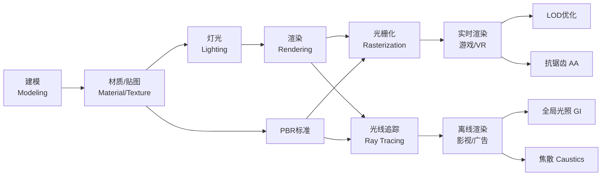

# 🎨 视觉渲染专业术语全图谱 v1.0｜龍芯知识库·视觉渲染领域

> Notion URL: https://app.notion.com/p/v1-0-92afabf13ac04d889fd901edbe75d9b3
> Created: 2026-04-15T10:12:00.000Z
> Last edited: 2026-07-01T15:18:00.000Z
> Archived at: 2026-08-12T01:40:45.558086
> 《道德经》第十一章：「当其无，有室之用。」—— 三维空间的"空"，通过渲染变成屏幕上的"有"。
---
## 🗺️ 术语全图谱·学习路径

---
## 一、渲染基础与流程
### 渲染 (Rendering)
核心作用： 将三维场景数据（模型+材质+灯光+摄像机）通过算法计算，转换成最终二维图像或动画帧的过程。是整个3D流水线的终点，也是最消耗计算资源的环节。
### 建模 (Modeling)
核心作用： 创建物体的三维数字形态，是渲染流程的第一步，决定场景的结构和轮廓。
- 多边形建模 (Polygon)： 最主流。用顶点(Vertex)、边(Edge)、面(Face)构成网格(Mesh)。工具：Blender/Maya/3ds Max
- NURBS曲面： 数学定义的光滑曲面，精度极高。工具：Rhino/AutoCAD
- 体素建模 (Voxel)： 三维像素堆砌。工具：MagicaVoxel，常见于Minecraft风格
- 雕刻建模 (Sculpting)： 像捏泥巴一样塑形高精度细节。工具：ZBrush/Blender
### 材质 (Material)
核心作用： 定义物体表面物理属性的参数容器（不含图像数据），决定物体如何与光交互。
### 贴图 (Texture)
核心作用： 贴在模型UV展开后表面的二维图像，为材质参数提供像素级细节数据。
### 灯光 (Lighting)
核心作用： 在场景中设置光源，模拟光线传播，是营造氛围和立体感的关键。
---
## 二、核心光照算法与效果
### 光栅化 (Rasterization)
核心作用： 主流实时渲染技术。将3D顶点投影到2D屏幕后，对三角面内的像素逐一填充颜色，速度极快是核心优势。
渲染管线核心流程：
```javascript
顶点数据
  ↓ 顶点着色器 (Vertex Shader) — MVP矩阵变换
  ↓ 图元装配 (Primitive Assembly) — 拼成三角形
  ↓ 光栅化 (Rasterization) — 三角形→像素片段
  ↓ 片段着色器 (Fragment Shader) — 计算每像素颜色
  ↓ 深度测试 (Depth Test) — 决定前后遮挡
  ↓ 输出合并 → 屏幕
```
核心公式： 顶点坐标 → MVP矩阵变换 → NDC归一化 → 屏幕坐标 → 像素填充
### 光线追踪 (Ray Tracing)
核心作用： 追求物理真实感。从摄像机出发对每个像素发射光线，模拟真实光线传播（反射/折射/阴影），效果极为逼真但计算极贵。
渲染方程（图形学圣经）：
Lo(x,\omega) = Le(x,\omega) + \int_{\Omega} Li(x,\omega_i) \cdot f(x,\omega_i,\omega) \cdot \cos\theta_i \cdot d\omega_i
> Lo=出射光，Le=自发光，Li=入射光，f=BRDF材质函数，cosθ=朗伯余弦项
### 全局光照 (GI, Global Illumination)
核心作用： 模拟光线在物体间多次反弹产生的间接照明效果（如阴暗角落被旁边白墙反光照亮）。
### 漫反射 (Diffuse Reflection)
核心作用： 光照射粗糙表面后向四面八方均匀散射，是日常最常见的反射现象，决定物体固有色和整体亮度。
朗伯定律 (Lambert's Law)：
L_{diffuse} = K_d \cdot (N \cdot L)
> Kd=漫反射系数，N=表面法向量，L=光源方向向量
### 焦散 (Caustics)
核心作用： 光穿过透明物体（水/玻璃）折射后在下方表面形成的明亮光影图案，是渲染中最能体现"水感"的效果。
### 抗锯齿 (Anti-aliasing, AA)
核心作用： 消除几何边缘的锯齿状走样，让画面更平滑。
---
## 三、渲染技术标准与工具
### PBR (基于物理的渲染)
核心作用： 遵循真实物理光学的渲染方法论（非单一算法），通过能量守恒、菲涅尔效应、微表面理论让结果更真实。
PBR BRDF核心公式（Cook-Torrance模型）：
f(l,v) = \frac{D \cdot F \cdot G}{4 \cdot (n \cdot l) \cdot (n \cdot v)}
> D=法线分布函数(GGX) · F=菲涅尔项 · G=几何遮蔽函数
### 采样率 (Sampling Rate)
核心作用： 控制渲染器对光线路径的采样精细程度，直接决定画面噪点水平和渲染时间。
蒙特卡洛收敛规律：
\text{误差} \sim \frac{1}{\sqrt{N}}
> N=采样数量。采样率×4倍 → 噪点减少50%。这是为什么高质量离线渲染要跑那么久的数学根源。
现代降噪方案（解决采样率瓶颈）：
- OIDN（Intel开放图像降噪）： CPU/GPU AI降噪，Blender/Arnold内置
- OptiX Denoiser（NVIDIA）： RTX硬件加速降噪
- Temporal Denoising： 跨帧积累采样信息（实时渲染场景）
### 渲染器 (Renderer) 选型指南
### LOD (细节层次 Level of Detail)
核心作用： 根据物体与摄像机的距离，自动使用不同精度的模型，减少渲染计算量。
```javascript
摄像机距离
  近 (<10m)  → LOD0 高精度模型（50,000面）
  中 (10-50m) → LOD1 中精度模型（5,000面)
  远 (50-200m) → LOD2 低精度模型（500面）
  极远 (>200m) → Billboard（2D图片替代）
```
---
## 四、补全：9个遗漏的核心术语
---
## 五、学习路径建议（龍芯分级）
---
