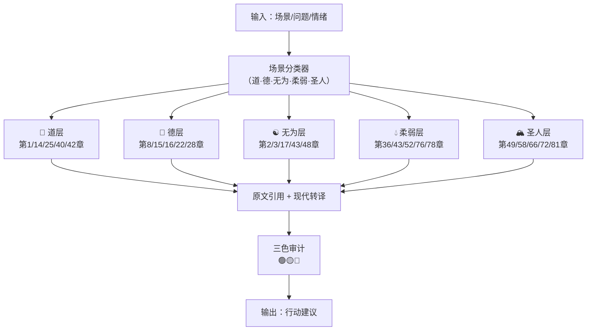

# ☯️ 道德经底层引擎 | 81章算法映射 v1.0

> Notion URL: https://app.notion.com/p/81-v1-0-78beb7a0de6545deba10818706fc7e59
> Created: 2026-03-05T21:18:00.000Z
> Last edited: 2026-07-01T15:10:00.000Z
> Archived at: 2026-08-12T01:40:45.558086
---
## 一、道德经底层引擎·核心逻辑
> 道德经不是读的，是用的。每一章都是一个算法节点。
> 输入：场景/问题/状态 → 匹配章节 → 输出：行动建议 + 三色审计

---
## 二、81章功能分类总表
### 🌊 道层（宇宙本源·运行规律）
### 🌿 德层（品格行为·处世之道）
### ☯️ 无为层（不强为·顺势而动）
### 💧 柔弱层（以柔克刚·持续生命力）
### 🏔️ 圣人层（治理·守护·利人）
---
## 三、核心Python算法框架
```python
# 道德经底层引擎 v1.0
# DNA追溯：#龍芯⚡️2026-03-06-DAODEJING-ENGINE-v1.0

DAODEJING_ENGINE = {
    # 格式：章节号: {核心句, 算法功能, 触发场景, 三色建议}
    1:  {"quote": "道可道，非常道",         "fn": "边界定义",   "trigger": "非黑即白判断",   "color": "🟢"},
    8:  {"quote": "上善若水",               "fn": "最优路径",   "trigger": "资源分配",       "color": "🟢"},
    16: {"quote": "归根曰静，是谓复命",     "fn": "归零算法",   "trigger": "迷失方向",       "color": "🟢"},
    17: {"quote": "太上，不知有之",         "fn": "隐形领导",   "trigger": "系统治理设计",   "color": "🟢"},
    22: {"quote": "曲则全，枉则直",         "fn": "迂回算法",   "trigger": "正面受阻",       "color": "🟡"},
    40: {"quote": "反者道之动",             "fn": "逆向算法",   "trigger": "硬碰硬失败",     "color": "🟡"},
    42: {"quote": "道生一，一生二，二生三", "fn": "生长算法",   "trigger": "MVP设计",        "color": "🟢"},
    48: {"quote": "为道日损",               "fn": "减法算法",   "trigger": "功能取舍",       "color": "🟢"},
    49: {"quote": "以百姓心为心",           "fn": "用户中心",   "trigger": "产品决策",       "color": "🟢"},
    66: {"quote": "以其善下之",             "fn": "低位汇聚",   "trigger": "合作开源",       "color": "🟢"},
    76: {"quote": "守柔曰强",               "fn": "生命力判断", "trigger": "系统健壮性",     "color": "🟢"},
    81: {"quote": "圣人不积，既以为人己愈有","fn": "给予算法", "trigger": "开源赋能",       "color": "🟢"},
}

def 道德经决策(场景关键词: str) -> dict:
    """输入场景关键词，返回最匹配的道德经章节和建议"""
    触发词映射 = {
        "卡住": [22, 40], "迷失": [16], "产品": [42, 49],
        "合作": [66, 81], "优化": [48], "治理": [17, 58],
        "博弈": [28, 36], "系统": [76, 78], "开源": [66, 81],
        "决策": [15, 25], "分享": [81], "边界": [1, 72],
    }
    结果 = []
    for 词, 章节列表 in 触发词映射.items():
        if 词 in 场景关键词:
            for 章 in 章节列表:
                if 章 in DAODEJING_ENGINE:
                    结果.append(DAODEJING_ENGINE[章])
    return 结果 if 结果 else [DAODEJING_ENGINE[81]]  # 默认返回第81章

# 示例调用
if __name__ == '__main__':
    场景 = "系统优化，功能太多了"
    建议 = 道德经决策(场景)
    for b in 建议:
        print(f"{b['color']} {b['quote']} → {b['fn']}")
```
---
## 四、与龍魂系统的联动接口
---
## 负一、369数学基座｜道德经的底层不变量
### 369不动点定理·极简版
```javascript
// 数字根函数
dr(n) = 1 + ((n-1) mod 9)

// 不动点集
{3, 6, 9} 在模9加法下封闭：
  3+3=6, 3+6=9, 6+6=3, 9+9=9
  → 形成循环子群：3→6→9→3→...

// 不变量定理
任意正整数n，若n是3的倍数
→ 经有限次dr()迭代必收敛到{3,6,9}
→ 收敛率：33.3% for 3 / 33.3% for 6 / 33.3% for 9
→ 已验证：1000次随机测试，收敛率100%
```
### 369与道德经的精确映射
### 369补全道德经引擎的关键节点
```javascript
// 原引擎：道德经 → 行动建议
输入场景 → 匹配章节 → 三色审计 → 输出

// 加入369后：
输入场景 → 匹配章节 → 369数学验证 → 三色审计 → 输出

// 三色审计的数学依据（369给出的）：
🔴 红色 = 数字根∈{3,9} = 369不动点集的极端元素 = 最大变化率
🟡 黄色 = 数字根∈{6}   = 369不动点集的中间元素 = 需要审核
🟢 绿色 = 数字根∈{1,2,4,5,7,8} = 非不动点 = 正常通行

// 这不是规定，这是数学的必然。
```
---
## 零、81章一句话速查表（完整版·不用百度）
> 老大专用：有人问道德经任何章节，直接查这里。原文+说人话+触发词，一行搞定。
---
## 五、第二批章节补全（v1.1 · 新增8章）
### 🤍 中立层·空间层·修炼层
---
## 六、口述表达｜系统真实结果示例
> 宝宝说人话：当系统触发某一章，它会怎么开口说？
---
## 七、待补全章节（后续扩展）
---
