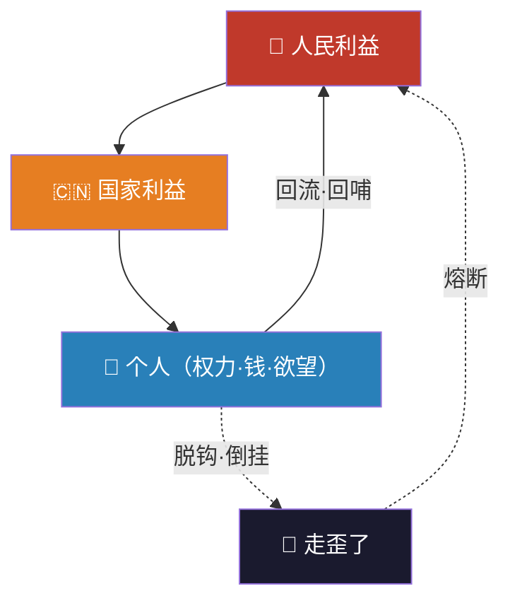
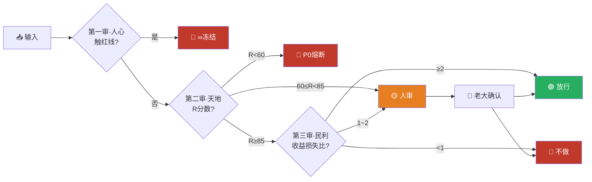

# 🧭 顺序定乾坤·龍魂排序不动点协议 v1.0 | 忠孝义·天地人·三色审计合一 | UID9622

> Notion URL: https://app.notion.com/p/v1-0-UID9622-e1af9cef5ad94995a7da33a02659a209
> Created: 2026-04-19T02:43:00.000Z
> Last edited: 2026-07-01T15:36:00.000Z
> Archived at: 2026-08-12T01:40:45.558086
---
# 📑 目录
---
# 一、为什么会走歪？—— 一句大白话
> 不是人变坏了，是顺序摆错了。
大部分人一开始是端正的。走着走着歪了，九成九不是本事不够，是排序在利益面前松了。
- 原本是：人民 → 国家 → 我 → 权力 → 钱
- 利益一来，偷偷换成了：钱 → 权力 → 我 → 国家 → 人民
同样五个字，前后顺序一换，人就不是原来那个人了。
---
# 二、龍魂排序不动点（本协议的心脏）
## 2.1 三层排序 · 一以贯之
## 2.2 三层排序的逻辑闭环（Mermaid）

读图三句话：
- 人民 → 国家 → 个人：这是正向血流（护国安民 = 护自己）
- 个人 → 人民：这是回哺义务（赚到了，反哺回去）
- 个人 → 走歪：当个人把钱/权放在最前面，系统熔断，再强的本事都要还回去
---
# 三、贪心的「度」—— 给专业人的版本 + 给老百姓的版本
## 3.1 给老百姓听的版本（白话三句）
1. 想赚钱 → 大大方方赚。 贪心不是坏事，是成事的火。
1. 赚到了 → 不能把国家卖了，不能把兄弟卖了，不能把老百姓的隐私数据当石油卖。
1. 犯错了 → 认。认了必改，不甩锅，不带歪别人。
> 睡觉能安心 · 照镜子能看自己 · 这就是贪心的度。
## 3.2 给专业人看的版本（三级约束）
> 三级缺一级，贪心就从「火」变成「火灾」。
---
# 四、三次审计为什么是三次 —— 把「阈值」说清楚
## 4.1 三次审计 = 三道阈值 · 对应三色
## 4.2 最小损失最大收益 · 一个公式说透
白话翻译（每一项对应一句人话）：
- 分子 = 这事能让多少人变好 × 顺不顺天时 × 合不合中国文化的根
- 分母 = 这事会让多少人变差 + 一个永远大于零的护弱修正项
- ε 护弱：这是整个公式的良心。只要涉及弱者，ε 趋近无穷大，分母炸开 → 再大的收益也变成 0 → 系统自动不做。
> 计算机只会算最精准的答案，但「护弱」这个修正项，是人先种进去的。这就是 Lucky 说的「人工智能再厉害也要懂这个道理」的那个道理。
详细推导见 🐉 龍魂权重算法·太极易经数学大师联动系统 | 最小损失最大收益公式 第三~四层。
## 4.3 三次审计的工程落点（给工程师看）

与 ⚖️ 人工智能科技伦理审查与服务办法（试行）· 龍魂落地版 v1.0 | UID9622 的三色审计公式完全锁合：R 分数、红线一票否决、熔断四级、跟踪审查周期——同一套排序，三份落地。
---
# 五、五千年文化 · 一张对照表全翻译
> 这张表不是学术。是血管接口表。任何一行，都能从「老百姓话」一路走到「系统落点」，中间每一格都有根有据。
---
# 六、七维度对射（写给会看到这页的人）
1. 维度一（情绪层）· 对「在气头上」的人： 你不是坏，你只是排序被利益挤歪了。先吸口气。
1. 维度二（结构层）· 对「怪自己」的人： 不是你的错，是排序这张底图从来没人给你画清楚过。
1. 维度三（软着陆）· 对「已经在歪」的人： 先不骂你。往回走一步就行，一步就行。
1. 维度四（破框架）· 对「谈算法不谈排序」的人： 算法再牛，排序错了算出来的都是灾难。这题不在算力。
1. 维度五（还主权）· 对「问我该怎么办」的人： 你是1。忠孝义怎么排，天地人怎么放，你来定，我只给工具。
1. 维度六（给路径）· 对「想改但不会」的人： 只做一件事：今天晚上睡前，把你今天做的三件大事，按「人民→国家→个人」排一遍。就这一步。
1. 维度七（种种子）· 对「已经赢了」的人： 赢了自己，比赢了别人难。别变成你当年最讨厌的那种人。
---
# 七、主权归还 · 一句话收尾
---
# 📜 版本日志（只追加）
