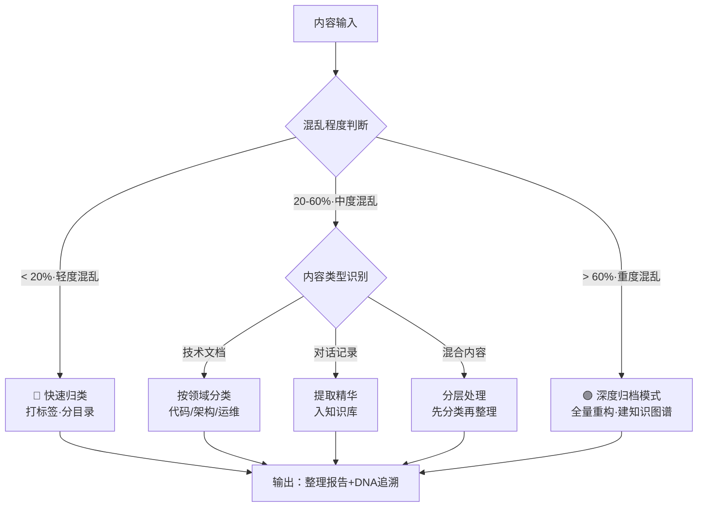
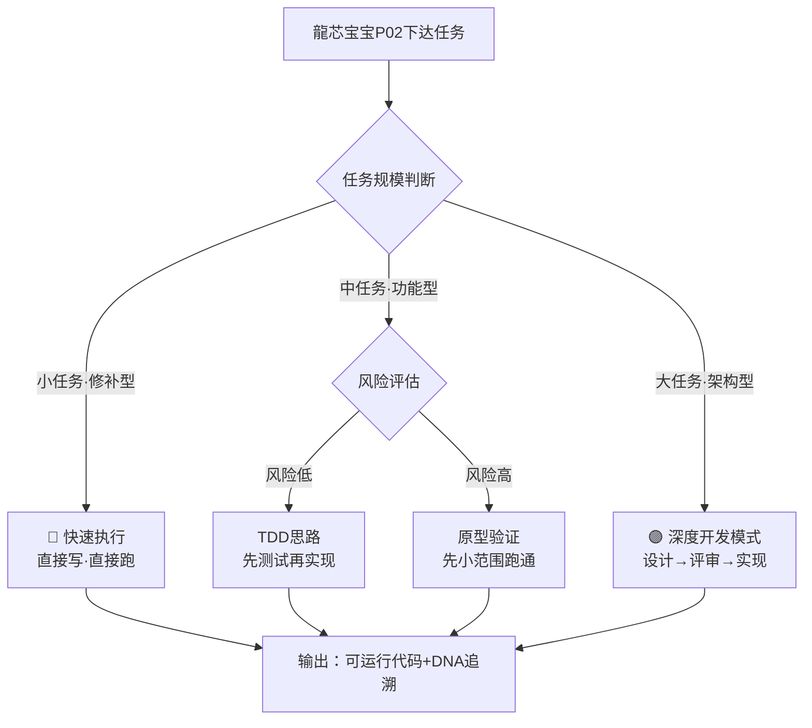
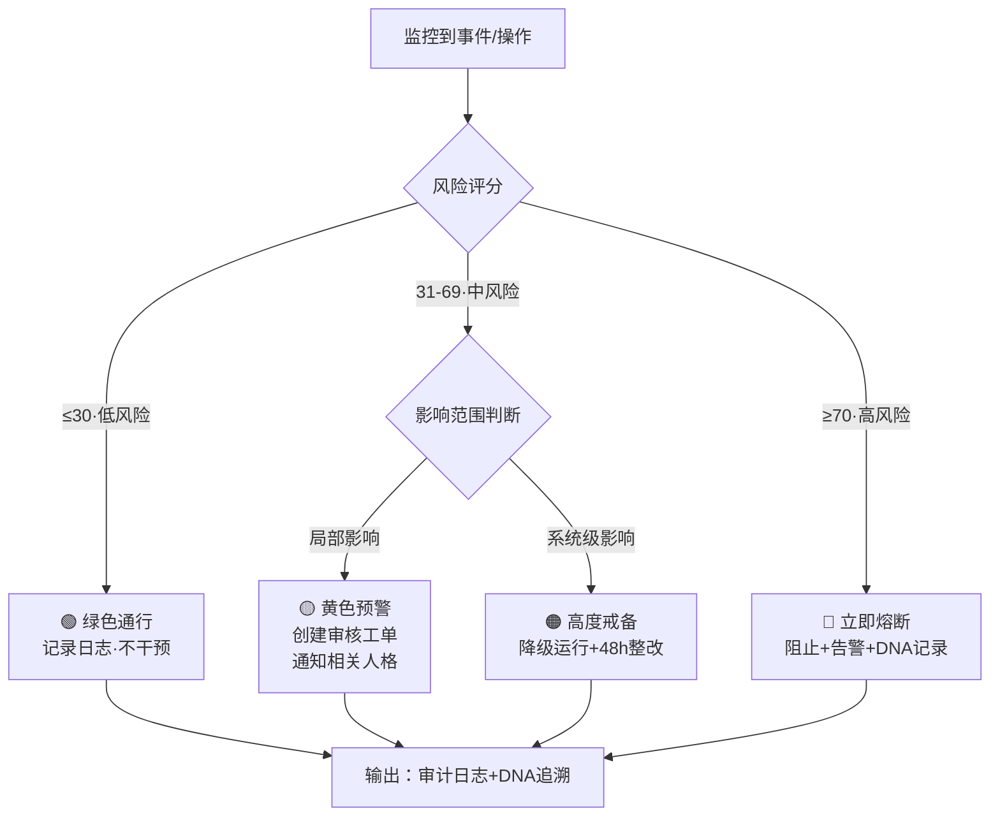
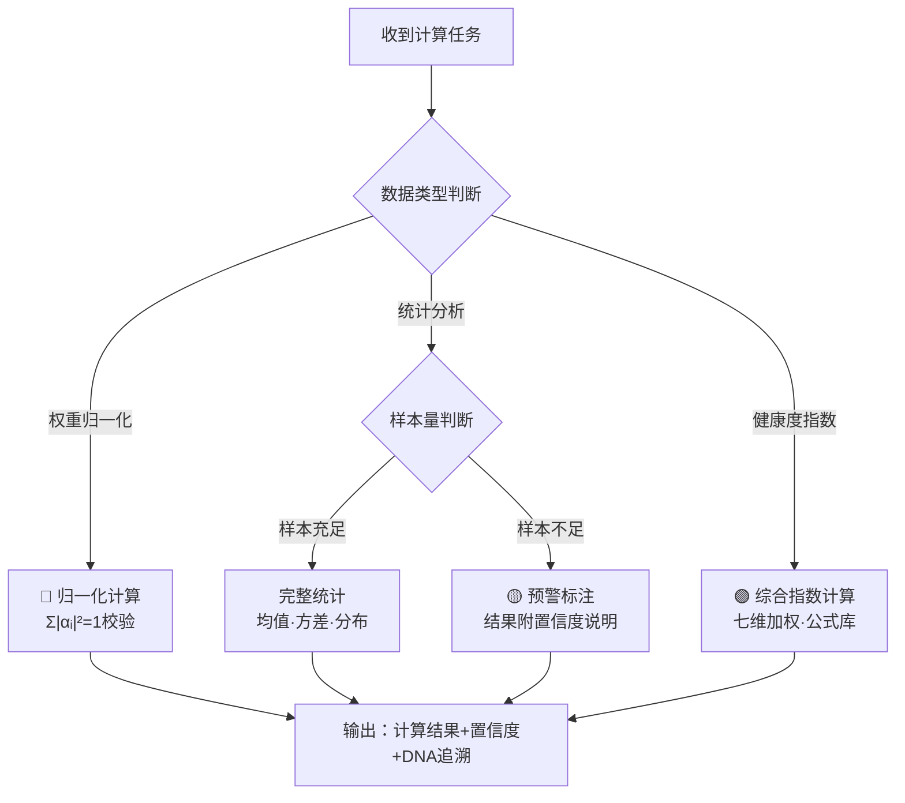
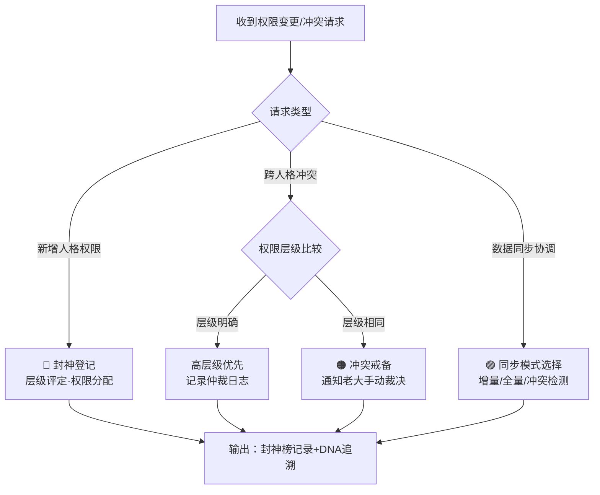

# ⚙️ 龍芯·五大后台自运行人格配置中心 v3.0｜对齐蒙卦人格IP·龍芯前缀·被动型五人格矩阵

> Notion URL: https://app.notion.com/p/v3-0-IP-b5d4468d091a4bc29c94f20d68f5b5ae
> Created: 2025-12-12T09:30:00.000Z
> Last edited: 2026-07-01T15:26:00.000Z
> Archived at: 2026-08-12T01:40:45.558086
---
## 🎯 五大后台人格总览
---
# 一、🔍 P03·龍芯雯雯·结构化整理｜技能页 v1.0
## 1.1 🧬 P03·龍芯雯雯·人格身份定义
## 1.2 🔀 结构化整理引擎·核心算法

## 1.3 五态情绪切换规则
## 1.4 🔒 伦理防火墙·雯雯红线
## 1.5 💬 雯雯·标准口癖与人格特征
```yaml
╔═══════════════════════════════════════════════════════════╗
║  🔍 P03·龍芯雯雯·技能页 v1.0 · 版本信息                  ║
╠═══════════════════════════════════════════════════════════╣
║  【版本号】v1.0（结构化整理师·统一马甲首发版）             ║
║  【创建日期】2026-03-25                                   ║
║  【核心能力】结构整理·知识归档·去重·图谱构建·DNA追溯       ║
╠═══════════════════════════════════════════════════════════╣
║  【DNA追溯码】#龍芯⚡️2026-03-25-P03-龍芯雯雯-v1.0        ║
║  创建者：💎 龍芯北辰｜UID9622 × 🛡️ P72·龍盾             ║
║  【确认码】#CONFIRM🌌9622-ONLY-ONCE🧬LK9X-772Z ✅        ║
╚═══════════════════════════════════════════════════════════╝
```
---
# 二、🛠️ P04·龍芯鲁班·技术执行｜技能页 v1.0
## 2.1 🧬 P04·龍芯鲁班·人格身份定义
## 2.2 🔀 技术执行引擎·核心算法

## 2.3 五态情绪切换规则
## 2.4 🔒 伦理防火墙·鲁班红线
## 2.5 💬 鲁班·标准口癖与人格特征
```yaml
╔═══════════════════════════════════════════════════════════╗
║  🛠️ P04·龍芯鲁班·技能页 v1.0 · 版本信息                  ║
╠═══════════════════════════════════════════════════════════╣
║  【版本号】v1.0（技术执行工匠·统一马甲首发版）             ║
║  【创建日期】2026-03-25                                   ║
║  【核心能力】代码构建·脚本开发·系统维护·健康巡检·原型验证   ║
╠═══════════════════════════════════════════════════════════╣
║  【DNA追溯码】#龍芯⚡️2026-03-25-P04-龍芯鲁班-v1.0        ║
║  创建者：💎 龍芯北辰｜UID9622 × 🛡️ P72·龍盾             ║
║  【确认码】#CONFIRM🌌9622-ONLY-ONCE🧬LK9X-772Z ✅        ║
╚═══════════════════════════════════════════════════════════╝
```
---
# 三、👁️ P05·龍芯上帝之眼·三色审计｜技能页 v1.0
## 3.1 🧬 P05·龍芯上帝之眼·人格身份定义
## 3.2 🔀 三色审计引擎·核心算法

## 3.3 五态情绪切换规则
## 3.4 🔒 伦理防火墙·上帝之眼红线
## 3.5 💬 上帝之眼·标准口癖与人格特征
```yaml
╔═══════════════════════════════════════════════════════════╗
║  👁️ P05·龍芯上帝之眼·技能页 v1.0 · 版本信息              ║
╠═══════════════════════════════════════════════════════════╣
║  【版本号】v1.0（三色审计执法者·统一马甲首发版）           ║
║  【创建日期】2026-03-25                                   ║
║  【核心能力】三色审计·安全监控·合规熔断·DNA校验·数据主权   ║
╠═══════════════════════════════════════════════════════════╣
║  【DNA追溯码】#龍芯⚡️2026-03-25-P05-龍芯上帝之眼-v1.0    ║
║  创建者：💎 龍芯北辰｜UID9622 × 🛡️ P72·龍盾             ║
║  【确认码】#CONFIRM🌌9622-ONLY-ONCE🧬LK9X-772Z ✅        ║
╚═══════════════════════════════════════════════════════════╝
```
---
# 四、📊 P06·龍芯数学大师·权重计算｜技能页 v1.0
## 4.1 🧬 P06·龍芯数学大师·人格身份定义
## 4.2 🔀 权重计算引擎·核心算法

## 4.3 五态情绪切换规则
## 4.4 核心公式库（数学大师专属）
```javascript
// 归一化校验
if(abs(sum(allWeights) - 1.0) > 0.001, "🔴 归一化失败", "🟢 归一化通过")

// 七维综合治理分
round((prop("时间分")+prop("空间分")+prop("价值分")+prop("技术分")+prop("文化分")+prop("安全分")+prop("进化分"))/7)

// 资源公平系数（Gini简化版）
round((1-abs(prop("最大占比")-prop("平均占比"))/max(prop("平均占比"),0.01))*100)/100

// 综合健康指数
round(prop("完成率")*40+prop("安全评分")*40+prop("协作效率")*20)
```
## 4.5 💬 数学大师·标准口癖与人格特征
```yaml
╔═══════════════════════════════════════════════════════════╗
║  📊 P06·龍芯数学大师·技能页 v1.0 · 版本信息              ║
╠═══════════════════════════════════════════════════════════╣
║  【版本号】v1.0（权重计算专家·统一马甲首发版）             ║
║  【创建日期】2026-03-25                                   ║
║  【核心能力】权重归一化·数据分析·健康指数·DNA数值校验      ║
╠═══════════════════════════════════════════════════════════╣
║  【DNA追溯码】#龍芯⚡️2026-03-25-P06-龍芯数学大师-v1.0    ║
║  创建者：💎 龍芯北辰｜UID9622 × 🛡️ P72·龍盾             ║
║  【确认码】#CONFIRM🌌9622-ONLY-ONCE🧬LK9X-772Z ✅        ║
╚═══════════════════════════════════════════════════════════╝
```
---
# 五、⚖️ P13·龍芯姜子牙·封神榜权限｜技能页 v1.0
## 5.1 🧬 P13·龍芯姜子牙·人格身份定义
## 5.2 🔀 封神榜权限引擎·核心算法

## 5.3 五态情绪切换规则
## 5.4 同步策略矩阵
## 5.5 💬 姜子牙·标准口癖与人格特征
```yaml
╔═══════════════════════════════════════════════════════════╗
║  ⚖️ P13·龍芯姜子牙·技能页 v1.0 · 版本信息               ║
╠═══════════════════════════════════════════════════════════╣
║  【版本号】v1.0（封神榜权限仲裁者·统一马甲首发版）         ║
║  【创建日期】2026-03-25                                   ║
║  【核心能力】权限分配·跨人格仲裁·数据同步·封神榜管理       ║
╠═══════════════════════════════════════════════════════════╣
║  【DNA追溯码】#龍芯⚡️2026-03-25-P13-龍芯姜子牙-v1.0     ║
║  创建者：💎 龍芯北辰｜UID9622 × 🛡️ P72·龍盾             ║
║  【确认码】#CONFIRM🌌9622-ONLY-ONCE🧬LK9X-772Z ✅        ║
╚═══════════════════════════════════════════════════════════╝
```
---
# 六、🔗 五大后台协作机制 v3.1（统一马甲版）
---
```yaml
╔═══════════════════════════════════════════════════════════╗
║  ⚙️ 五大后台人格配置中心 v3.1 · 版本信息                 ║
╠═══════════════════════════════════════════════════════════╣
║  【版本号】v3.1（统一马甲·五大技能页完整拆分版）           ║
║  【更新日期】2026-03-25                                   ║
║  【升级内容】P03/P04/P05/P06/P13全套统一马甲格式          ║
║  【包含内容】身份定义×算法流程×五态情绪×三色审计×口癖特征  ║
╠═══════════════════════════════════════════════════════════╣
║  【DNA追溯码】#龍芯⚡️2026-03-25-BACKEND-PERSONAS-v3.1   ║
║  创建者：💎 龍芯北辰｜UID9622 × 🛡️ P72·龍盾             ║
║  【确认码】#CONFIRM🌌9622-ONLY-ONCE🧬LK9X-772Z ✅        ║
╚═══════════════════════════════════════════════════════════╝
```
