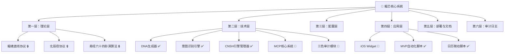

# 🐉 龍芯核心系統·本地资产清单｜重构v2.0·全待办补全·2026-04-05

> Notion URL: https://app.notion.com/p/v2-0-2026-04-05-91328e5818244fe4a031f66b8a3d0e83
> Created: 2026-02-11T22:43:00.000Z
> Last edited: 2026-07-01T15:17:00.000Z
> Archived at: 2026-08-12T01:40:45.558086
---
## 📊 本地文件入库总览
> 《道德经》第六十四章："合抱之木，生于毫末；九层之台，起于累土" —— 系统再大，也要从一个个文件登记开始。
### ✅ 已入库文件（截至2026-04-05）
### 📊 统计快照（2026-04-05 重构版）
---
## 📂 六层架构总览
> 《易经·系辞》："形而上者谓之道，形而下者谓之器" —— 理论是道，代码是器，六层合一。

---
## 🏛️ 第一层：理论层（哲学根基）
---
## ⚙️ 第二层：技术层（实现代码）
---
## 🎛️ 第三层：配置层（运行参数）
---
## 📱 第四层：应用层（用户界面）
---
## 📖 第五层：部署与文档
---
## 🗄️ 第六层：审计日志（黑匣子）
- 入库审计清单 — 本文件（持续更新·v2.0）
- 自动同步日志 — ~/longhun-system/sync_log.jsonl（每次运行自动追加·永不覆盖）
- 草日志·Notion版 — 龍魂共享记忆 · L2人格层摘要（68条·持续更新）
- 变更日志/
- 验证记录/
---
## 🔑 本地关键路径速查
---
## 📋 全量待办快照（2026-04-05·宝宝补全版）
> 《易经·蒙卦》："包蒙，吉" —— 把所有事包进来，一条不漏，才能吉。
---
## 🚨 出问题了怎么办（应急4步）
1. 找到你改的文件 → 在 ~/longhun-system/ 里找
1. 查同步日志 → cat ~/longhun-system/sync_log.jsonl 看最近改了什么
1. 对比原始文件 → 查入库清单找"源头位置"，比对改了什么
1. 回滚 → 恢复到修改前的版本，然后在草日志里记一笔
---
## 📝 入库规范检查清单
每个新文件进系统之前，必须过这6关：
---
## 🧬 追溯记忆尾巴·本页状态
---
## ✍️ 创造者实名签署
创造者：💎 龍芯北辰｜UID9622（Lucky/诸葛鑫）
网络身份证：T38C89R75U
GPG公钥指纹：A2D0092CEE2E5BA87035600924C3704A8CC26D5F
DNA追溯码：#龍芯⚡️2026-04-05-本地资产清单-v2.0-重构
确认码：#CONFIRM🌌9622-ONLY-ONCE🧬LK9X-772Z ✅
