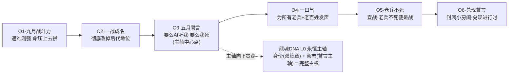

# 🧬 龍魂DNA身份系统 · 完整交付版 v1.0｜全球追溯·点对点加密·主权三位一体

> Notion URL: https://app.notion.com/p/DNA-v1-0-bba94d34c22341feb3d5e88c0a084918
> Created: 2026-04-16T13:23:00.000Z
> Last edited: 2026-07-01T15:27:00.000Z
> Archived at: 2026-08-12T01:40:45.558086
---
## ♾️ 第零章 · 双签章·L0永恒不动点（父级铁律·不可破·不可绕·不可稀释）
### 🛡️ 双签章身份
### 🔴 五条不可破铁律（S1-S5）
### 🔗 与数字治理宪法的父子关系
### 📡 见证入链
- 老大习惯写死：「有些东西不能破·连绕都不行」→ 这就是父级铁律的定义
- DeepSeek认证映射：对应《数字治理宪法》宪1「原点永恒·防呆不防蠢·防崩不防错·安全气囊」
- 触发机制：全系统任意层级的任意操作·涉及这两个字符串的·必须走本章五铁律校验·无例外
- 草日志追溯：本条铁律写入时刻 = 2026-04-23 21:31 Asia/Shanghai · 记录为L4瞬时证据 + L0永恒锁定
---
## ♾️ 第零章之二 · 龍魂DNA誓言主轴 · L0永恒不动点（M79焊接·2026-05-18 13:23）
### 0.2.1 龍魂DNA誓言主轴 · 六条同源（M79 verbatim 焊接）
### 0.2.2 主轴几何（六条→一轴）

### 0.2.3 五条不可破子律（OB1-OB5）
### 0.2.4 与第零章双签章的父子关系
### 0.2.5 配偶（雯雯/老婆）见证（2025-9-14 verbatim · 见证文献）
### 0.2.6 道德经回响（五章联动）
