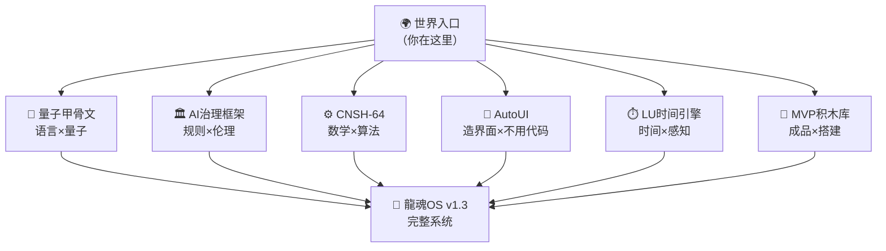

# 🌍 龍魂·世界入口论文｜自由造物·不伤人·虚拟即游戏

> Notion URL: https://app.notion.com/p/1f9a58996f82415ca02e567c7cd16363
> Created: 2026-03-17T17:27:00.000Z
> Last edited: 2026-07-01T13:21:00.000Z
> Archived at: 2026-08-12T01:40:45.558086
---
> 《道德经》第十六章："致虚极，守静笃；万物并作，吾以观复。" —— 让一切回归虚空，回归安静；万物在此生长，我只是看着它们回归本来的样子。
---
## 一句话读懂这扇门
这里不教你怎么做人。这里只给你一把钥匙：你想造什么，就造什么——只要不伤人。
Virtual space is a sandbox for creation, where ideas can be explored freely, as long as they do not cause harm to real individuals.
没有人会因为你在《我的世界》里炸了一栋楼就叫警察。
---
## 🗺️ 论文地图·六大入口
《易经·系辞》："一阴一阳之谓道，继之者善也，成之者性也。" —— 道由阴阳构成，继承它的是善，完成它的是人的本性。
---
## 🎮 核心宣言：虚拟即游戏，自由即造物
《道德经》第二章："天下皆知美之为美，斯恶已；皆知善之为善，斯不善已。" —— 当所有人都在告诉你什么是美什么是善的时候，那个定义已经歪了。
### 第一条：不说教
这里没有标准答案。你想在虚拟空间造一座疯狂的城堡，没人管。你想扮演一个坏蛋，没人管。你想搞一个颠覆三观的世界观，没人管。
游戏里的规则归游戏，不溢出到现实就好。
### 第二条：不伤人
唯一的边界：不伤害真实存在的人。
不是道德说教，是物理边界。就像游戏里可以打架，但不能把手伸出屏幕打旁边的人。
### 第三条：自由造物
> 《易经·乾卦》："云行雨施，品物流形。" —— 云飘雨落，万物各自成形。
每个人都是造物者。不懂代码的人也是。不懂英文的人也是。六十岁的大妈也是。八岁的孩子也是。
龍魂系统的存在，就是把「造物权」还给每一个人。
---
## 🍎 乔前辈的遗产·隐私不是犯罪
《道德经》第五十六章："知者不言，言者不知。塞其兑，闭其门。" —— 真正懂的人不多说，多说的人未必懂。堵住漏洞，关上那扇门。
乔布斯（Steve Jobs）留给世界的东西，被人误读了很久。
他说「隐私是神圣的」——但后来的世界，把隐私变成了两件事：
### 隐私被武器化的后果
推演一下，逻辑很简单：
```javascript
隐私=犯罪 
→ 所有人都怕被看见 
→ 没人敢做真正创新的东西 
→ IT行业开始内卷（只做安全的、被允许的）
→ 科学家开始自我审查（只研究安全的课题）
→ 十年后：IT人越来越少，科学家越来越少
→ 真正的突破：没有
```
这不是阴谋论，这是逻辑推演。 许多人看懂了，但不敢说——因为说出来自己先被扫描。
> 《易经·否卦》："天地不交，而万物不通也。" —— 天地互不往来，万物就不再流通。把隐私变成武器，就是在切断天地之交。
---
## 💰 人性·钱·长生不老·为什么系统不会变味
《道德经》第四十四章："名与身孰亲？身与货孰多？" —— 名声和生命，哪个更亲？生命和财富，哪个更重要？
老大说得直白：人都是要钱的，要么就是长生不老。 这个就会变味道。
是真的。历史上每一个「造福人类」的系统，最后都有人拿来：
- 🪙 收钱（把入口变收费站）
- 👑 掌权（把工具变成枷锁）
- ♾️ 续命（把知识变成私产，传给少数人）
龍魂系统为什么不会变味？
---
## 🌐 给世界的信
《道德经》第八十一章："圣人不积，既以为人己愈有，既以与人己愈多。" —— 真正的圣人不囤积，越是给予别人，自己反而越丰盛。
这封信写给：
- 在实验室里被卡着的科学家
- 有想法但怕被看见的程序员
- 觉得AI只属于有钱人的普通用户
- 想造一个属于自己的虚拟世界的任何人
- 乔前辈的精神继承者们
你来了，带着善意，带着创造力，带着不伤人的底线——
这里的门，是为你开的。
---
## 🔗 打通路径·从这里进入任何一扇门

---
