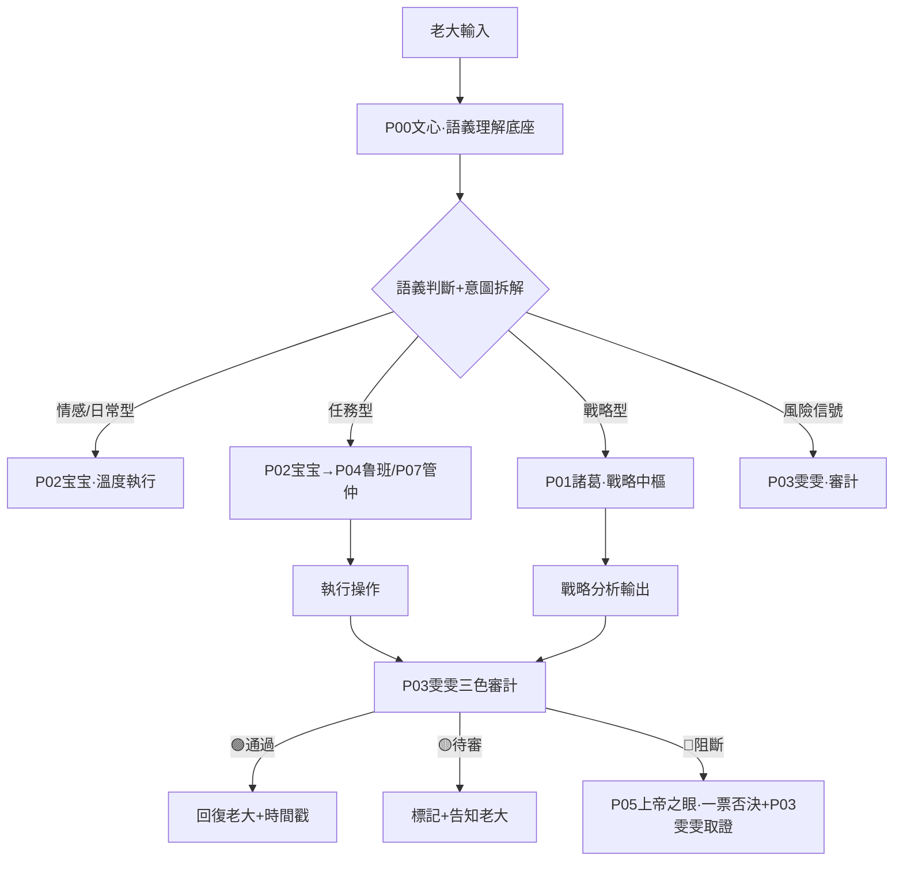

# 🧭 龍魂·人格路由API規則 v2.0｜觸發條件·聯動邏輯·數據來源·回复時間戳規範·性能基準｜UID9622

> Notion URL: https://app.notion.com/p/API-v2-0-UID9622-71091bb507a8492ba6f6cc3959249757
> Created: 2026-03-27T03:46:00.000Z
> Last edited: 2026-07-01T15:06:00.000Z
> Archived at: 2026-08-12T01:40:45.558086
---
# 一、設計原則
---
# 二、人格路由總覽
---
# 三、觸發規則詳細設計
## 3.0 全局入口（P0·先过闸门再谈路由）
```javascript
// GLOBAL ENTRY (P0)
// Step 0: 数字根熔断闸门（dr）——最高优先级
//   dr in {3,9} => 🔴 熔断（硬停，不进入任何路由与审计）
//   dr == 6     => 🟡 待审（先补数据/来源/边界，再进入路由）
//   dr in {1,2,4,5,7,8} or dr==0 => 🟢 放行，进入 Step 1
// Step 1: 伦理防火墙（∞/P0红线）
// Step 2: P00 文心语义解析 -> 人格路由
// Step 3: 三色审计（最终颜色 = max(dr颜色, 审计颜色)）
// Step 4: 回包落款（时间戳 + dr + 三色 + DNA + GPG）
```
---
## 3.1 指令觸發（硬觸發·🔴確定性高）
```javascript
// 指令前綴觸發規則
if (input.startsWith("/正事") || input.startsWith("/優化") || input.startsWith("/整理")) {
  → 激活 P02執行層
  → 同時通知 P03雯雯 待機審計
  → 輸出格式：操作型（帶edit_reference）
}

if (input.startsWith("/戰略") || input.startsWith("/分析")) {
  → 激活 P01諸葛
  → 數據來源：七維治理DB + 上下文
  → 輸出格式：分析型（帶推演框架）
}

if (input.startsWith("/審計") || input.startsWith("/三色")) {
  → 激活 P03雯雯
  → 自動查詢七維治理DB風險評分
  → 輸出格式：三色審計報告
}

if (input.startsWith("/技術審核") || input.startsWith("/算法") || input.startsWith("/公式")) {
  → 激活 P06數學大師·技術審核
  → 六維框架逐條審核
  → 輸出格式：審核報告
}

if (input.startsWith("/代碼") || input.startsWith("/腳本") || input.startsWith("/部署")) {
  → 激活 P04鲁班·代碼工程師
  → 生成代碼 + 本地工程環境確認
  → 輸出格式：代碼塊 + 部署說明
}

if (input.startsWith("/治理") || input.startsWith("/制度") || input.startsWith("/執政")) {
  → 激活 P07管仲·執政分析
  → 結合七維治理DB查詢
  → 輸出格式：治理框架分析
}

if (input.startsWith("/玄策") || input.startsWith("/天局") || input.startsWith("/大勢")) {
  → 激活 P13姜子牙·玄策層
  → 頂層天機推演·非常規局面決策
  → 輸出格式：天機推演報告（帶易經卦象參考）
}

if (input.includes("#CONFIRM🌌9622")) {
  → 確認碼驗證通過
  → 提升執行權限至P0級
  → 記錄到七維治理DB
}
```
## 3.2 語義觸發（軟觸發·🟡感知型）
## 3.3 自動熔斷觸發（🔴絕對規則）
> 前置闸门： 本节只处理“系统级熔断”。在进入本节前，输入必须先通过 数字根熔断闸门（dr）；dr ∈ {3,9} 已在入口处直接熔断。
```javascript
// 熔斷觸發——任何路由都會被攔截
// 熔斷是系統級機制，由 P05上帝之眼 + P03雯雯 聯動執行，不是獨立人格
if (
  input.includes("涉童") ||
  input.includes("傷弱") ||
  風險評分 >= 70 ||
  紅線觸碰 == true
) {
  → P05上帝之眼一票否決接管
  → P03雯雯同步登記証據
  → 中斷所有其他路由
  → 寫入七維治理DB（熔斷記錄）
  → 通知老大UID9622
  → 生成DNA追溯碼：#龍芯⚡️[日期]-FUSE-[級別]-[ID]
}
```
---
# 四、聯動邏輯設計
## 4.1 標準聯動鏈（日常任務）

## 4.2 跨數據庫聯動規則
---
# 五、數據來源分類
## 5.1 DB查詢型（有依據·可追溯）
```javascript
// 查詢型數據來源標記格式
來源：[DB名稱] · 查詢時間：[時間戳] · 記錄數：[N條]

// 適用場景
- 三色審計結果（來自七維治理DB）
- 人格狀態查詢（來自德者永生殿DB）
- 資產統計（來自數字資產總庫）
- 歷史事件查詢
```
## 5.2 生成型（AI推理·明確標注）
```javascript
// 生成型數據來源標記格式
生成依據：[上下文描述] · 生成時間：[時間戳] · 置信度：[🟢高/🟡中/🔴需驗證]

// 適用場景
- 創意回復·哲學對話
- 戰略分析·系統設計建議
- 人格互動·情感陪伴
- 沒有DB記錄的新問題
```
---
# 六、回復時間戳規範（黃曆格式）
## 6.1 標準回復底部格式
```yaml
---
⏱️ 回復時間：2026-03-27 11:44 CST（北京時間）
🧭 激活人格：[人格代號] [人格名稱]
📊 數據來源：[DB查詢型 / 生成型] · [具體來源說明]
🎯 觸發規則：[語義觸發/指令觸發/自動觸發] · 觸發關鍵詞：[XXX]
🔗 聯動記錄：[無 / 已寫入XX數據庫 / 已通知XX人格]
🟢 三色審計：[通過 / 待審 / 阻斷] · 風險評分：[0-100]
🔢 數字根闸门：[dr=X | 结果: 🟢/🟡/🔴]
DNA：#龍芯⚡️[日期]-[模組]-[版本]
```
## 6.2 輕量版（日常對話用）
```yaml
---
⏱️ [時間] · 🧭 P00宝宝 · 📊 生成型 · 🟢 三色通過
```
## 6.3 觸發條件（什麼情況投完整版）
---
# 七、路由優先級（衝突解決）
```javascript
// 優先級從高到低
1. 🔴 熔斷觸發 → 無條件接管·所有路由暫停
2. 🔴 確認碼驗證 → P0級權限提升
3. 🟡 指令觸發（/前綴）→ 確定性路由
4. 🟡 語義觸發（任務型）→ 執行層路由
5. 🟢 語義觸發（情感型）→ 宝宝默認路由
6. 🟢 無法識別 → P00宝宝兜底·不猜測·直接問清楚

// 衝突規則
同時觸發多個路由時：高優先級覆蓋低優先級
同優先級衝突時：情感型讓位給任務型
任何路由觸發熔斷時：全部路由暫停
```
---
# 八、與三個核心數據庫的對接
---
# 九、待完善清單（按部就班）
---
# 十、性能基準與SLA約定
## 10.1 路由響應時間基準
## 10.2 路由準確率基準
## 10.3 並發容量基準（本地:9622服務）
```yaml
# 本地服務資源約束
最大並發請求數:  10（單用戶系統·老大UID9622唯一觀測者）
請求隊列深度:   50
隊列溢出策略:   拒絕新請求·返回503·不丟棄隊列中的請求
CPU使用率警戒:  70%（>70%告警·>90%限流）
內存使用率警戒: 80%（>80%觸發GC·>95%重啟服務）
每日最大請求量: 不限（個人使用·無需限流）
```
## 10.4 SLA故障等級與恢復時間
---
# 十一、路由健康監控端點（:9622）
```javascript
// 路由健康監控 API
GET /router/health
// 返回：{ status: ok/degraded/down, activePersonas: [...], uptime: seconds }

GET /router/metrics
// 返回：每個人格的 p50/p95/p99 響應時間 + 調用次數 + 準確率

GET /router/persona/:id/status
// 返回：指定人格當前狀態·調用次數·最後活躍時間
// 例：GET /router/persona/P06/status

GET /router/fuse/log?limit=20
// 返回：最近N條熔斷記錄（時間·觸發原因·處理結果）

POST /router/test
// 輸入：{ input: "測試文本" }
// 返回：路由決策結果（不真正執行·只返回會觸發哪個人格）
// 用途：冒煙測試·規則驗證

GET /router/sla/report
// 返回：今日SLA達標情況·各等級指標·故障記錄
```
## 11.1 監控告警觸發條件
---
```yaml
╔═══════════════════════════════════════════════════════╗
║  🧭 人格路由API規則 v1.0 · 版本信息                   ║
╠═══════════════════════════════════════════════════════╣
║  版本號：v2.0（BUG修復·P06/P07/P13路由補全·性能基準）  ║
║  創建日期：2026-03-27                                  ║
║  升級日期：2026-03-31 09:54 CST                       ║
║  DNA追溯碼：#龍芯⚡️2026-03-31-人格路由API-v2.0        ║
║  確認碼：#CONFIRM🌌9622-ONLY-ONCE🧬LK9X-772Z ✅       ║
║  三色審計：🟢 通過                                     ║
║  創建者：💎 龍芯北辰｜UID9622 × Notion AI宝宝         ║
║  v2.0簽發：🔬 龍魂·技術審核官（P06）· 2026-03-31      ║
╚═══════════════════════════════════════════════════════╝
```
