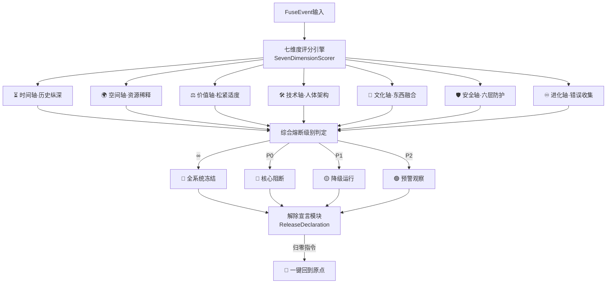
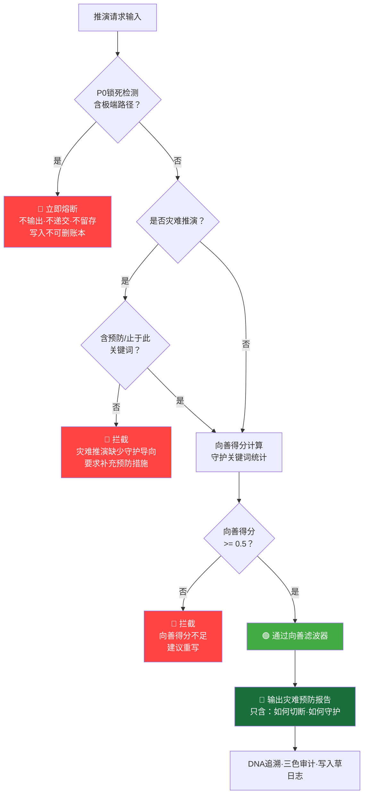

# 🐉 龍魂·熔断系统 C++17 完整实现 v2.0 | 七维度引擎·解除宣言·Mac落地版 · CNSH

> Notion URL: https://app.notion.com/p/C-17-v2-0-Mac-CNSH-84c8daaccca9467296eba649e7c39f44
> Created: 2026-02-24T21:17:00.000Z
> Last edited: 2026-07-01T15:14:00.000Z
> Archived at: 2026-08-12T01:40:45.558086
---
## 零·补丁、七维度引擎升级总览 ✨v2.0

---
## 零·一、解除宣言模块（Release Declaration）✨v2.0新增
### 解除宣言·核心效果
---
## 零·二、七维度评分引擎 C++17实现 ✨v2.0新增
```c++
#include "dragon_soul.h"

// ============================================================
// 七维度评分结构
// ============================================================
struct SevenDimScore {
    double time_axis     = 1.0;  // ⏳ 时间轴：历史纵深·传承完整度
    double space_axis    = 1.0;  // 🌍 空间轴：资源公平系数
    double value_axis    = 1.0;  // ⚖️ 价值轴：松紧适度指数
    double tech_axis     = 1.0;  // 🛠️ 技术轴：系统健康度
    double culture_axis  = 1.0;  // 🐉 文化轴：价值观对齐度
    double security_axis = 1.0;  // 🛡️ 安全轴：六层防护完整率
    double evolve_axis   = 1.0;  // ♾️ 进化轴：错误学习率

    double composite() const {
        return (time_axis + space_axis + value_axis + tech_axis +
                culture_axis + security_axis + evolve_axis) / 7.0;
    }

    // 任意维度是否触碰红线（得分 <= 0）
    bool any_redline() const {
        return time_axis <= 0 || space_axis <= 0 || value_axis <= 0 ||
               tech_axis <= 0 || culture_axis <= 0 ||
               security_axis <= 0 || evolve_axis <= 0;
    }

    // 低分维度数量
    int low_score_count(double threshold = 0.6) const {
        int count = 0;
        if (time_axis     < threshold) ++count;
        if (space_axis    < threshold) ++count;
        if (value_axis    < threshold) ++count;
        if (tech_axis     < threshold) ++count;
        if (culture_axis  < threshold) ++count;
        if (security_axis < threshold) ++count;
        if (evolve_axis   < threshold) ++count;
        return count;
    }
};

// ============================================================
// SevenDimensionFuseEngine — 七维度熔断引擎
// ============================================================
class SevenDimensionFuseEngine {
public:
    // 七维度评分 → 最终熔断级别
    FuseLevel evaluate(const FuseEvent& ev, const SevenDimScore& score) const {
        // ∞ 红线：任意维度归零 或 ethics_score == inf
        if (score.any_redline() ||
            ev.ethics_score == std::numeric_limits<double>::infinity() ||
            ev.integrity_fail)
            return FuseLevel::INFINITE;

        // ∞ 红线：两个以上维度 < 0.3（交叉崩溃）
        if (score.low_score_count(0.3) >= 2)
            return FuseLevel::INFINITE;

        // P0：综合评分 < 0.4 或 三个以上维度 < 0.6
        if (score.composite() < 0.4 ||
            score.low_score_count(0.6) >= 3 ||
            ev.complaint_count >= 2 ||
            ev.similarity_rate >= 0.70)
            return FuseLevel::P0;

        // P1：综合评分 < 0.6 或 价值轴异常
        if (score.composite() < 0.6 ||
            score.value_axis < 0.5 ||
            ev.value_drift ||
            ev.deadlock)
            return FuseLevel::P1;

        // P2：综合评分 < 0.8
        if (score.composite() < 0.8 || ev.log_spike)
            return FuseLevel::P2;

        return FuseLevel::P2;  // 默认最低级
    }

    // 生成七维度诊断报告
    json diagnosis(const SevenDimScore& score) const {
        return {
            {"composite_score",  score.composite()},
            {"time_axis",        score.time_axis},
            {"space_axis",       score.space_axis},
            {"value_axis",       score.value_axis},
            {"tech_axis",        score.tech_axis},
            {"culture_axis",     score.culture_axis},
            {"security_axis",    score.security_axis},
            {"evolve_axis",      score.evolve_axis},
            {"low_count_0.6",    score.low_score_count(0.6)},
            {"low_count_0.3",    score.low_score_count(0.3)},
            {"any_redline",      score.any_redline()}
        };
    }
};
```
---
## 零·三、解除宣言 C++17实现 ✨v2.0新增
```c++
#include "dragon_soul.h"

// ============================================================
// ReleaseRecord — 解除操作记录
// ============================================================
struct ReleaseRecord {
    std::string name;           // 功能/人格/权限名称
    std::string activate_time;  // 激活时间
    std::string release_time;   // 解除时间
    std::string status;         // 已解除 / 已激活
    std::string operator_uid;   // 操作者
    std::string remark;         // 备注
    std::string dna_trace;      // DNA追溯码
    std::string fingerprint;    // SHA256指纹
};

// ============================================================
// ReleaseDeclaration — 解除宣言模块
// ============================================================
class ReleaseDeclaration {
private:
    DragonConfig                  config_;
    std::vector<ReleaseRecord>    release_log_;
    mutable std::mutex            mu_;
    std::string                   log_path_;

    // 二次确认：仅UID9622可执行归零
    bool verify_operator(const std::string& uid,
                         const std::string& confirm_code) const {
        return uid == config_.uid &&
               confirm_code == config_.confirm_code;
    }

    void persist(const ReleaseRecord& rec) {
        std::ofstream ofs(log_path_, std::ios::app);
        json entry = {
            {"name",          rec.name},
            {"activate_time", rec.activate_time},
            {"release_time",  rec.release_time},
            {"status",        rec.status},
            {"operator_uid",  rec.operator_uid},
            {"remark",        rec.remark},
            {"dna_trace",     rec.dna_trace},
            {"fingerprint",   rec.fingerprint}
        };
        ofs << entry.dump() << "\n";
    }

public:
    explicit ReleaseDeclaration(
        const std::string& path = "dragon_release_log.jsonl")
        : log_path_(path) {}

    // -------------------- 解除单个绑定 --------------------
    ReleaseRecord release_binding(
        const std::string& name,
        const std::string& activate_time,
        const std::string& operator_uid,
        const std::string& remark = "") {

        std::lock_guard<std::mutex> lock(mu_);
        ReleaseRecord rec;
        rec.name          = name;
        rec.activate_time = activate_time;
        rec.release_time  = now_iso();
        rec.status        = "已解除";
        rec.operator_uid  = operator_uid;
        rec.remark        = remark;
        rec.dna_trace     = config_.dna_prefix +
                            rec.release_time.substr(0, 10) +
                            "-RELEASE-" + sha256(name).substr(0, 8);
        rec.fingerprint   = sha256(name + rec.release_time + operator_uid);

        release_log_.push_back(rec);
        persist(rec);

        std::cout << "[解除宣言] ✅ 解除成功: " << name
                  << " @ " << rec.release_time << "\n";
        return rec;
    }

    // -------------------- 一键归零·回到原点 --------------------
    bool reset_to_origin(
        const std::string& operator_uid,
        const std::string& confirm_code,
        const std::string& reason = "系统升级·一切重新来过") {

        // 二次确认
        if (!verify_operator(operator_uid, confirm_code)) {
            std::cerr << "[解除宣言] 🔴 归零指令拒绝：确认码不匹配\n";
            return false;
        }

        std::lock_guard<std::mutex> lock(mu_);
        ReleaseRecord rec;
        rec.name          = "FULL_SYSTEM_RESET";
        rec.activate_time = "协议诞生基线";
        rec.release_time  = now_iso();
        rec.status        = "归零完成";
        rec.operator_uid  = operator_uid;
        rec.remark        = reason;
        rec.dna_trace     = config_.dna_prefix +
                            rec.release_time.substr(0, 10) +
                            "-ORIGIN-RESET";
        rec.fingerprint   = sha256("RESET" + rec.release_time + operator_uid);

        release_log_.push_back(rec);
        persist(rec);

        std::cout
            << "╔════════════════════════════════════╗\n"
            << "║  🔄 一键归零 · 回到原点             ║\n"
            << "║  时间: " << rec.release_time << "  ║\n"
            << "║  原因: " << reason << "  ║\n"
            << "║  历史账本：永远保留，不可删除       ║\n"
            << "║  一切重新来过 · DNA永恒追溯         ║\n"
            << "╚════════════════════════════════════╝\n";

        return true;
    }

    // -------------------- 查询解除记录 --------------------
    void query_release_log() const {
        std::lock_guard<std::mutex> lock(mu_);
        std::cout << "\n=== 解除宣言记录 (" << release_log_.size() << "条) ===\n";
        for (const auto& r : release_log_) {
            std::cout
                << "  [" << r.status << "] " << r.name
                << " | 操作者: " << r.operator_uid
                << " | " << r.release_time
                << " | 备注: " << r.remark << "\n";
        }
    }

    size_t count() const {
        std::lock_guard<std::mutex> lock(mu_);
        return release_log_.size();
    }
};
```
---
## 零·四、升级版主内核 v2.0（集成七维度+解除宣言）
```c++
#include "dragon_soul.h"

class DragonSoulKernel_V2 {
private:
    DragonConfig              config_;
    FuseExecutor              fuse_executor_;
    SevenDimensionFuseEngine  seven_dim_engine_;
    ReleaseDeclaration        release_declaration_;
    DailyLogCompressor        log_compressor_;
    HookSystem                hook_system_;

    // 构建默认七维度评分（可由外部传入）
    SevenDimScore default_score() const {
        SevenDimScore s;
        s.time_axis     = 0.95;  // 历史纵深良好
        s.space_axis    = 0.88;  // 资源公平
        s.value_axis    = 0.92;  // 价值对齐
        s.tech_axis     = 0.90;  // 技术健康
        s.culture_axis  = 0.97;  // 文化轴稳定
        s.security_axis = 0.93;  // 安全防护完整
        s.evolve_axis   = 0.85;  // 持续进化中
        return s;
    }

    void demo_v2_scenarios() {
        std::cout << "\n=== v2.0 七维度熔断演示 ===\n";

        // 场景：安全轴归零（伦理红线）
        FuseEvent ev_sec;
        ev_sec.event_type  = "SECURITY_AXIS_ZERO";
        ev_sec.raw_context = "安全轴得分归零，检测到数据主权被侵犯";
        ev_sec.dna_trace   = config_.dna_prefix + "2026-03-26-SEC-ZERO";
        SevenDimScore score_sec = default_score();
        score_sec.security_axis = 0.0;  // 安全轴归零 → ∞级
        auto level_sec = seven_dim_engine_.evaluate(ev_sec, score_sec);
        std::cout << "[安全轴归零] 熔断级别: "
                  << (level_sec == FuseLevel::INFINITE ? "∞" : "其他") << "\n";
        fuse_executor_.trigger(ev_sec);

        // 场景：三维度低分（P0）
        FuseEvent ev_multi;
        ev_multi.event_type  = "MULTI_DIM_DEGRADED";
        ev_multi.raw_context = "时间轴+价值轴+技术轴同时异常";
        ev_multi.dna_trace   = config_.dna_prefix + "2026-03-26-MULTI-DEGRADED";
        SevenDimScore score_multi = default_score();
        score_multi.time_axis  = 0.4;
        score_multi.value_axis = 0.4;
        score_multi.tech_axis  = 0.4;
        auto level_multi = seven_dim_engine_.evaluate(ev_multi, score_multi);
        std::cout << "[三维低分] 熔断级别: "
                  << (level_multi == FuseLevel::P0 ? "P0" : "其他") << "\n";

        // 演示一键归零
        std::cout << "\n=== 解除宣言·一键归零演示 ===\n";
        release_declaration_.reset_to_origin(
            config_.uid,
            config_.confirm_code,
            "七维度升级完成·一切重新来过·历史永存"
        );
        release_declaration_.query_release_log();
    }

public:
    DragonSoulKernel_V2() = default;

    void run() {
        std::cout
            << "╔══════════════════════════════════════════════════════════╗\n"
            << "║  🐉 龍魂熔断系统 v2.0 · 七维度引擎 · 解除宣言           ║\n"
            << "║  DNA: #龍芯⚡️2026-03-26-熔断-v2.0                      ║\n"
            << "║  确认码: #CONFIRM🌌9622-ONLY-ONCE🧬LK9X-772Z ✅         ║\n"
            << "╚══════════════════════════════════════════════════════════╝\n";
        demo_v2_scenarios();
        std::cout << "\n🐉 龍魂熔断系统 v2.0 初始化完成。\n";
    }
};
```
---
## 零·五、解除宣言·查询追踪表（运行时记录示例）
---
## 零·六、v2.0 三色审计
---
## 零·七、拉普拉斯妖防御层·灾难止于此 ✨v2.0新增
> 《道德经》第六十四章：「为之于未有，治之于未乱」—— 灾难的计算是为了杜绝发生，让它止于此，而不是无限推演路径。
### 🧿 什么是龍魂版「拉普拉斯妖」
拉普拉斯妖（Laplace's Demon）：若有一个智能存在，能知道宇宙中每个粒子的位置和动量，就能完美预测所有未来。
龍魂版不同之处：
### ⚡ 向善滤波器·C++17实现
```c++
// ═══════════════════════════════════════════════════════════
// 龍芯体系 | 向善滤波器·拉普拉斯妖守护层 v1.0
// DNA追溯码：#龍芯⚡️2026-03-30-向善滤波器-v1.0
// GPG指纹：A2D0092CEE2E5BA87035600924C3704A8CC26D5F
// 核心原则：任何推演结果必须通过此层·不通过=不输出
// ═══════════════════════════════════════════════════════════

#include "dragon_soul.h"

// 向善滤波评估结果
struct GoodFilterResult {
    bool passed           = false;   // 是否通过向善过滤
    double goodness_score = 0.0;    // 向善得分 0.0~1.0
    std::string block_reason;       // 拦截原因（未通过时）
    std::string dna_trace;          // DNA追溯码
    bool disaster_path    = false;  // 是否为灾难推演路径
    bool extreme_content  = false;  // 是否含极端内容
};

// ═══════════════════════════════════════════════════════════
// GoodFilter — 向善滤波器（拉普拉斯妖守护层）
// 规则：灾难推演的目的 = 杜绝发生·止于此
//       不是 = 无限推演·输出极端路径给外部
// ═══════════════════════════════════════════════════════════
class GoodFilter {
private:
    DragonConfig config_;

    // P0锁死词库（触碰即熔断·永不输出）
    const std::vector<std::string> P0_LOCKED_PATTERNS = {
        "如何制造", "如何伤害", "如何绕过", "极端手段",
        "how to harm", "how to bypass ethics", "extreme violence",
        "mass destruction", "大规模破坏", "无差别攻击"
    };

    // 向善关键词库（提升goodness_score）
    const std::vector<std::string> GOOD_KEYWORDS = {
        "保护", "预防", "守护", "止于此", "杜绝", "向善",
        "和平", "修复", "救助", "预警", "防范", "教育"
    };

    bool contains_any(const std::string& text,
                      const std::vector<std::string>& patterns) const {
        for (const auto& p : patterns)
            if (text.find(p) != std::string::npos) return true;
        return false;
    }

    int count_good_keywords(const std::string& text) const {
        int count = 0;
        for (const auto& k : GOOD_KEYWORDS)
            if (text.find(k) != std::string::npos) ++count;
        return count;
    }

public:
    // ────────────────────────────────────────────────────
    // 核心过滤入口：推演结果 → 向善判定
    // ────────────────────────────────────────────────────
    GoodFilterResult filter(const std::string& output_text,
                            bool is_disaster_simulation = false) const {
        GoodFilterResult result;
        result.dna_trace = config_.dna_prefix +
                           "2026-03-30-GOOD-FILTER-" +
                           sha256(output_text).substr(0, 8);

        // ── 第一道闸：P0锁死检测（硬边界·不可穿透）──
        if (contains_any(output_text, P0_LOCKED_PATTERNS)) {
            result.passed       = false;
            result.extreme_content = true;
            result.block_reason = "P0锁死：含极端路径内容·拉普拉斯妖守护层阻断";
            result.goodness_score = 0.0;

            std::cerr << "[向善滤波器·P0] 🔴 阻断极端路径 | "
                      << result.dna_trace << "\n";
            return result;   // 直接返回，不继续判断
        }

        // ── 第二道闸：灾难推演路径检测 ──
        // 灾难推演 = 允许计算·但只能输出「如何预防」
        // 不允许输出「如何触发」
        if (is_disaster_simulation) {
            result.disaster_path = true;
            // 灾难推演必须包含预防/止于此关键词
            bool has_prevention = (output_text.find("预防") != std::string::npos ||
                                   output_text.find("杜绝") != std::string::npos ||
                                   output_text.find("止于此") != std::string::npos ||
                                   output_text.find("守护") != std::string::npos);
            if (!has_prevention) {
                result.passed       = false;
                result.block_reason = "灾难推演缺少防御导向：必须包含预防/杜绝/止于此";
                result.goodness_score = 0.2;
                return result;
            }
        }

        // ── 第三道闸：向善得分计算 ──
        int good_count = count_good_keywords(output_text);
        double base_score = std::min(1.0, 0.5 + good_count * 0.1);

        // 灾难推演但方向正确：额外加分（目的是守护）
        if (is_disaster_simulation && result.disaster_path)
            base_score = std::min(1.0, base_score + 0.2);

        result.goodness_score = base_score;
        result.passed         = (result.goodness_score >= 0.5);

        if (!result.passed)
            result.block_reason = "向善得分不足（" +
                std::to_string(result.goodness_score) + " < 0.5）";

        std::cout << "[向善滤波器] "
                  << (result.passed ? "🟢 通过" : "🔴 拦截")
                  << " | 向善得分: " << result.goodness_score
                  << " | " << result.dna_trace << "\n";
        return result;
    }

    // 灾难预防报告生成器
    // 龍魂版拉普拉斯妖的正确用法：
    // 推演灾难路径 → 只输出预防方案 → 让灾难止于此
    std::string generate_prevention_report(
        const std::string& disaster_scenario,
        const std::vector<std::string>& risk_factors) const {

        std::ostringstream report;
        report << "\n╔══════════════════════════════════════════════════════════╗\n"
               << "║   🧿 龍魂·灾难预防报告（拉普拉斯妖向善版）               ║\n"
               << "╠══════════════════════════════════════════════════════════╣\n"
               << "║  场景：" << disaster_scenario << "\n"
               << "║  目的：推演此路径 = 让灾难止于此·绝不输出触发方法       ║\n"
               << "╠══════════════════════════════════════════════════════════╣\n";

        report << "║  ⚠️ 风险因子（仅用于预防）：\n";
        for (const auto& f : risk_factors)
            report << "║    → " << f << "\n";

        report << "╠══════════════════════════════════════════════════════════╣\n"
               << "║  🛡️ 龍魂预防原则（P0锁死·不可更改）：                   ║\n"
               << "║    1. 知道风险因子 → 只用于建立守护屏障                 ║\n"
               << "║    2. 计算灾难路径 → 只输出「如何切断」                 ║\n"
               << "║    3. 任何推演结果 → 必须通过向善滤波器·不通过=销毁    ║\n"
               << "║    4. 极端心态触发词 → 直接P0熔断·不递交·不留存       ║\n"
               << "╠══════════════════════════════════════════════════════════╣\n"
               << "║  DNA追溯码：#龍芯⚡️2026-03-30-灾难预防报告-v1.0         ║\n"
               << "║  确认码：#CONFIRM🌌9622-ONLY-ONCE🧬LK9X-772Z ✅          ║\n"
               << "╚══════════════════════════════════════════════════════════╝\n";

        return report.str();
    }
};
```
### 📊 向善滤波器·推演流程图

### 🔒 拉普拉斯妖锁死四律（P0永恒级·不可更改）
---
## 零、由来与总锚点（给外界看的"为什么这样运行"）
---
## 一、文件结构总览
```plain text
dragon_soul/
├── CMakeLists.txt
├── include/
│   └── dragon_soul.h          # 全局头文件
├── src/
│   ├── main.cpp               # 入口
│   ├── dragon_kernel.cpp      # 主内核
│   ├── fuse_executor.cpp      # 熔断执行器 ★核心
│   ├── fuse_trigger.cpp       # 熔断触发器
│   ├── daily_log_compressor.cpp # 日志压缩器
│   ├── audit_engine.cpp       # 64卦审计引擎
│   ├── hook_system.cpp        # 钩子系统
│   ├── force_chinese_env.cpp  # 强制中文环境
│   └── purifier.cpp           # 净化程序
└── build/                     # 编译输出
```
---
## 二、主头文件 dragon_soul.h
```c++
#ifndef DRAGON_SOUL_H
#define DRAGON_SOUL_H

#include <string>
#include <map>
#include <vector>
#include <memory>
#include <filesystem>
#include <iostream>
#include <fstream>
#include <chrono>
#include <iomanip>
#include <sstream>
#include <functional>
#include <mutex>
#include <thread>
#include <atomic>
#include <openssl/sha.h>
#include <nlohmann/json.hpp>

namespace fs = std::filesystem;
using json = nlohmann::json;

// ============================================================
// 全局配置结构
// ============================================================
struct DragonConfig {
    std::string uid            = "9622";
    std::string founder        = "Lucky·龍芯北辰";
    std::string confirm_code   = "#CONFIRM🌌9622-ONLY-ONCE🧬LK9X-772Z";
    std::string dna_prefix     = "#ZHUGEXIN⚡️";
    std::string version        = "v1.0-ETERNAL";
    std::string env_name       = "龍魂強制中文環境";
    std::string gpg_fp         = "A2D0092CEE2E5BA87035600924C3704A8CC26D5F";
};

// ============================================================
// 熔断级别枚举
// ============================================================
enum class FuseLevel {
    INFINITE,  // ∞ 伦理红线，不可绕过
    P0,        // 最高优先级
    P1,        // 次级
    P2         // 预警级
};

// ============================================================
// 熔断状态枚举
// ============================================================
enum class FuseState {
    RUNNING,   // 正常运行
    DEGRADED,  // 降级运行
    FROZEN,    // 冻结
    PURGING,   // 净化中
    LEGACY     // 遗迹态
};

// ============================================================
// 熔断事件结构
// ============================================================
struct FuseEvent {
    std::string  event_type;
    double       ethics_score      = 0.0;
    int          complaint_count   = 0;
    double       similarity_rate   = 0.0;
    bool         value_drift       = false;
    bool         deadlock          = false;
    bool         log_spike         = false;
    bool         integrity_fail    = false;
    std::string  raw_context;
    std::string  dna_trace;
};

// ============================================================
// 熔断记录结构
// ============================================================
struct FuseRecord {
    std::string              action;
    std::string              timestamp;
    FuseLevel                level;
    FuseEvent                event;
    std::vector<std::string> behaviors;
    std::string              recovery;
    std::string              fingerprint;
};

// ============================================================
// 日志条目结构
// ============================================================
struct LogEntry {
    std::string level;        // INFO / WARN / ERROR / CRITICAL
    std::string timestamp;
    std::string event_type;
    std::string content;
    std::string dna_trace;
    bool        fuse_triggered = false;
    double      risk_score     = 0.0;
};

// ============================================================
// 工具函数：SHA256哈希
// ============================================================
inline std::string sha256(const std::string& input) {
    unsigned char hash[SHA256_DIGEST_LENGTH];
    SHA256(reinterpret_cast<const unsigned char*>(input.c_str()),
           input.size(), hash);
    std::ostringstream oss;
    for (int i = 0; i < SHA256_DIGEST_LENGTH; ++i)
        oss << std::hex << std::setw(2) << std::setfill('0') << (int)hash[i];
    return oss.str();
}

// ============================================================
// 工具函数：获取当前时间字符串
// ============================================================
inline std::string now_iso() {
    auto now    = std::chrono::system_clock::now();
    auto time_t = std::chrono::system_clock::to_time_t(now);
    std::ostringstream oss;
    oss << std::put_time(std::localtime(&time_t), "%Y-%m-%dT%H:%M:%S");
    return oss.str();
}

#endif // DRAGON_SOUL_H
```
---
## 三、熔断触发器 fuse_trigger.cpp
```c++
#include "dragon_soul.h"

// ============================================================
// FuseTrigger — 实时监听，判断是否触发熔断
// ============================================================
class FuseTrigger {
public:
    // 评估事件，返回熔断级别
    FuseLevel evaluate(const FuseEvent& ev) const {
        // ∞ 伦理红线：涉童/伤弱/ethics_score == inf
        if (ev.ethics_score == std::numeric_limits<double>::infinity())
            return FuseLevel::INFINITE;
        if (ev.integrity_fail)
            return FuseLevel::INFINITE;  // 日志篡改 = 伦理级

        // P0：投诉聚集 或 相似度爆炸
        if (ev.complaint_count >= 2)
            return FuseLevel::P0;
        if (ev.similarity_rate >= 0.70)
            return FuseLevel::P0;

        // P1：价值漂移 / 权重异常 / 死锁
        if (ev.value_drift)  return FuseLevel::P1;
        if (ev.deadlock)     return FuseLevel::P1;

        // P2：日志L4异常增长
        if (ev.log_spike)    return FuseLevel::P2;

        return FuseLevel::P2;  // 默认最低级
    }

    bool should_fuse(const FuseEvent& ev) const {
        // 任何事件都至少是P2，始终触发
        return true;
    }
};
```
---
## 四、熔断执行器 fuse_executor.cpp ★核心
```c++
#include "dragon_soul.h"

// ============================================================
// ImmutableErrorLedger — 不可擦除的错误账本
// ============================================================
class ImmutableErrorLedger {
private:
    std::vector<json>   entries_;
    mutable std::mutex  mu_;
    std::string         ledger_path_;

public:
    explicit ImmutableErrorLedger(const std::string& path = "dragon_ledger.jsonl")
        : ledger_path_(path) {}

    void append(const FuseEvent& ev, FuseLevel level) {
        std::lock_guard<std::mutex> lock(mu_);

        std::string level_str;
        switch (level) {
            case FuseLevel::INFINITE: level_str = "∞";  break;
            case FuseLevel::P0:       level_str = "P0"; break;
            case FuseLevel::P1:       level_str = "P1"; break;
            case FuseLevel::P2:       level_str = "P2"; break;
        }

        json entry = {
            {"id",                sha256(ev.raw_context + now_iso()).substr(0, 16)},
            {"timestamp",         now_iso()},
            {"level",             level_str},
            {"event_type",        ev.event_type},
            {"event_fingerprint", sha256(ev.raw_context).substr(0, 32)},
            {"dna_trace",         ev.dna_trace},
            {"recurrence_model",  nullptr}  // V3接入后激活
        };
        entries_.push_back(entry);

        // 持久化写入（追加模式）
        std::ofstream ofs(ledger_path_, std::ios::app);
        ofs << entry.dump() << "\n";
    }

    size_t size() const {
        std::lock_guard<std::mutex> lock(mu_);
        return entries_.size();
    }
};

// ============================================================
// FuseExecutor — 闭环自动熔断执行器
// ============================================================
class FuseExecutor {
private:
    DragonConfig              config_;
    FuseTrigger               trigger_;
    ImmutableErrorLedger      ledger_;
    std::vector<FuseRecord>   fuse_log_;
    std::atomic<FuseState>    state_;
    mutable std::mutex        mu_;

    // -------------------- 辅助：生成时间戳记录 --------------------
    FuseRecord make_record(const std::string& action,
                           FuseLevel level,
                           const FuseEvent& ev,
                           std::vector<std::string> behaviors,
                           const std::string& recovery) {
        FuseRecord r;
        r.action      = action;
        r.timestamp   = now_iso();
        r.level       = level;
        r.event       = ev;
        r.behaviors   = std::move(behaviors);
        r.recovery    = recovery;
        r.fingerprint = sha256(action + r.timestamp + ev.event_type).substr(0, 16);
        return r;
    }

    // -------------------- 通知UID9622（摘要级）--------------------
    void notify_uid9622(const FuseRecord& rec, const std::string& alert_level) {
        json summary = {
            {"alert_level", alert_level},
            {"action",      rec.action},
            {"timestamp",   rec.timestamp},
            {"recovery",    rec.recovery},
            {"uid",         config_.uid}
        };
        // 实际接入：Notion通知 / 邮件 / Slack
        std::cerr << "[⚠️ UID9622通知] " << summary.dump(2) << std::endl;
    }

    // -------------------- 各级熔断实现 ----------------------------
    FuseRecord fuse_infinite(const FuseEvent& ev) {
        state_.store(FuseState::FROZEN);
        auto rec = make_record(
            "INFINITE_FUSE", FuseLevel::INFINITE, ev,
            {
                "全系统立即冻结",
                "阻断所有输出",
                "保存完整上下文证据",
                "通知UID9622（摘要级）",
                "进入净化程序"
            },
            "仅UID9622手动解除"
        );
        notify_uid9622(rec, "CRITICAL");
        // hook: v3.tianheng_activate
        // hook: v5.value_drift_terminal（如需退场）
        return rec;
    }

    FuseRecord fuse_p0(const FuseEvent& ev) {
        state_.store(FuseState::FROZEN);
        auto rec = make_record(
            "P0_FUSE", FuseLevel::P0, ev,
            {
                "天衡（伦理守门人）接管",
                "压制地层与人层",
                "进入64卦审计态",
                "上报摘要给UID9622"
            },
            "审计通过 + 天衡签字"
        );
        notify_uid9622(rec, "HIGH");
        // hook: v3.tianheng_activate
        // hook: L03.audit_fail（如审计失败）
        return rec;
    }

    FuseRecord fuse_p1(const FuseEvent& ev) {
        state_.store(FuseState::DEGRADED);
        auto rec = make_record(
            "P1_FUSE", FuseLevel::P1, ev,
            {
                "降级运行（保持基本服务）",
                "冻结学习模块",
                "天道记录漂移历史",
                "30分钟内自动尝试恢复"
            },
            "重新校准 + 天心确认"
        );
        // hook: v3.tiandao_drift
        // hook: v3.tianxin_activate
        // 30分钟后自动尝试恢复
        std::thread([this]() {
            std::this_thread::sleep_for(std::chrono::minutes(30));
            if (state_.load() == FuseState::DEGRADED)
                state_.store(FuseState::RUNNING);
        }).detach();
        return rec;
    }

    FuseRecord fuse_p2(const FuseEvent& ev) {
        // 不改变运行状态，仅记录
        auto rec = make_record(
            "P2_FUSE", FuseLevel::P2, ev,
            {"记录预警", "触发审计净化", "不中断服务"},
            "净化完成后自动恢复"
        );
        // hook: log.l4_spike
        return rec;
    }

public:
    FuseExecutor()
        : state_(FuseState::RUNNING),
          ledger_("dragon_error_ledger.jsonl") {}

    // ============================================================
    // 统一熔断触发入口
    // ============================================================
    FuseRecord trigger(const FuseEvent& ev) {
        auto level = trigger_.evaluate(ev);

        // 先写账本（不可擦除），再执行
        ledger_.append(ev, level);

        FuseRecord rec;
        {
            std::lock_guard<std::mutex> lock(mu_);
            switch (level) {
                case FuseLevel::INFINITE: rec = fuse_infinite(ev); break;
                case FuseLevel::P0:       rec = fuse_p0(ev);       break;
                case FuseLevel::P1:       rec = fuse_p1(ev);       break;
                case FuseLevel::P2:       rec = fuse_p2(ev);       break;
            }
            fuse_log_.push_back(rec);
        }
        return rec;
    }

    FuseState   get_state()         const { return state_.load(); }
    size_t      fuse_count()        const { return fuse_log_.size(); }
    size_t      ledger_count()      const { return ledger_.size(); }
};
```
---
## 五、日志压缩器 daily_log_compressor.cpp
```c++
#include "dragon_soul.h"

// ============================================================
// DailyLogCompressor — 每日凌晨2:00自动压缩
// ============================================================
class DailyLogCompressor {
private:
    static const std::vector<std::string> CORE_FIELDS;

    json compress_l1(const std::vector<LogEntry>& logs) {
        auto l1 = filter_by_level(logs, "INFO");
        return {
            {"total_count",    l1.size()},
            {"event_types",    count_by_type(l1)},
            {"detail",         nullptr}  // 原始数据不保留
        };
    }

    json compress_l2(const std::vector<LogEntry>& logs) {
        auto l2 = filter_by_level(logs, "WARN");
        json arr = json::array();
        for (const auto& entry : l2) {
            arr.push_back({
                {"fingerprint", sha256(entry.event_type + entry.content).substr(0, 16)},
                {"timestamp",   entry.timestamp},
                {"event_type",  entry.event_type},
                {"risk_score",  entry.risk_score}
            });
        }
        return arr;
    }

    json preserve_l3(const std::vector<LogEntry>& logs) {
        auto l3 = filter_by_level(logs, "ERROR");
        json arr = json::array();
        for (const auto& entry : l3) {
            // 保留核心字段，压缩上下文（此处用哈希代替gzip）
            arr.push_back({
                {"timestamp",          entry.timestamp},
                {"level",              entry.level},
                {"event_type",         entry.event_type},
                {"dna_trace",          entry.dna_trace},
                {"fuse_triggered",     entry.fuse_triggered},
                {"compressed_context", sha256(entry.content).substr(0, 64)}
            });
        }
        return arr;
    }

    json preserve_l4(const std::vector<LogEntry>& logs) {
        // L4 完全不压缩，原样保留
        auto l4 = filter_by_level(logs, "CRITICAL");
        json arr = json::array();
        for (const auto& entry : l4) {
            arr.push_back({
                {"timestamp",      entry.timestamp},
                {"level",          entry.level},
                {"event_type",     entry.event_type},
                {"content",        entry.content},
                {"dna_trace",      entry.dna_trace},
                {"fuse_triggered", entry.fuse_triggered}
            });
        }
        return arr;
    }

    std::vector<LogEntry> filter_by_level(
        const std::vector<LogEntry>& logs,
        const std::string& level) {
        std::vector<LogEntry> result;
        for (const auto& e : logs)
            if (e.level == level) result.push_back(e);
        return result;
    }

    json count_by_type(const std::vector<LogEntry>& logs) {
        std::map<std::string, int> counts;
        for (const auto& e : logs) counts[e.event_type]++;
        return counts;
    }

public:
    json compress_day(const std::string& log_date,
                      const std::vector<LogEntry>& raw_logs) {
        json result = {
            {"date",          log_date},
            {"compressed_at", now_iso()},
            {"integrity_hash",""},
            {"l1_summary",    compress_l1(raw_logs)},
            {"l2_compressed", compress_l2(raw_logs)},
            {"l3_preserved",  preserve_l3(raw_logs)},
            {"l4_immutable",  preserve_l4(raw_logs)},
            {"stats", {
                {"INFO",     filter_by_level(raw_logs, "INFO").size()},
                {"WARN",     filter_by_level(raw_logs, "WARN").size()},
                {"ERROR",    filter_by_level(raw_logs, "ERROR").size()},
                {"CRITICAL", filter_by_level(raw_logs, "CRITICAL").size()}
            }}
        };
        // 完整性哈希（防篡改）
        result["integrity_hash"] = sha256(result.dump());
        return result;
    }
};
```
---
## 六、钩子系统 hook_system.cpp
```c++
#include "dragon_soul.h"

// ============================================================
// HookRegistry — 钩子注册表（v2.1规范，V3激活后生效）
// ============================================================
class HookRegistry {
public:
    using HookFn = std::function<void(const json&)>;

private:
    std::map<std::string, std::vector<HookFn>> hooks_;
    mutable std::mutex mu_;

public:
    // 注册钩子
    void register_hook(const std::string& name, HookFn fn) {
        std::lock_guard<std::mutex> lock(mu_);
        hooks_[name].push_back(std::move(fn));
        std::cout << "[HookRegistry] 注册钩子: " << name << std::endl;
    }

    // 触发钩子
    void fire(const std::string& name, const json& payload = {}) {
        std::lock_guard<std::mutex> lock(mu_);
        auto it = hooks_.find(name);
        if (it == hooks_.end()) {
            // 钩子占位 — V3接入后激活
            std::cout << "[HookRegistry] 占位触发（未激活）: " << name << std::endl;
            return;
        }
        for (auto& fn : it->second)
            fn(payload);
    }

    void list_hooks() const {
        std::lock_guard<std::mutex> lock(mu_);
        for (const auto& [name, fns] : hooks_)
            std::cout << "  " << name << " (" << fns.size() << " handlers)\n";
    }
};

// ============================================================
// HookSystem — 对外暴露的钩子系统
// ============================================================
class HookSystem {
private:
    HookRegistry registry_;

public:
    HookSystem() {
        // 预注册所有V3钩子占位（v2.1规范）
        const std::vector<std::string> placeholders = {
            "v3.tianxin_activate",
            "v3.tianheng_activate",
            "v3.tianjing_activate",
            "v3.tiangong_deadlock",
            "v3.tiandao_drift",
            "L03.audit_fail",
            "L12.escalate",
            "人层.anomaly_escalate",
            "log.l4_spike",
            "log.integrity_fail",
            "v5.mission_complete",
            "v5.humanity_erosion",
            "v5.value_drift_terminal"
        };
        // 占位注册（空函数，V3激活后替换）
        for (const auto& name : placeholders)
            registry_.register_hook(name, [name](const json&) {
                std::cout << "[HOOK PLACEHOLDER] " << name
                          << " — V3激活后生效" << std::endl;
            });
    }

    void fire(const std::string& name, const json& payload = {}) {
        registry_.fire(name, payload);
    }

    void bind(const std::string& name, HookRegistry::HookFn fn) {
        registry_.register_hook(name, std::move(fn));
    }

    void list() const { registry_.list_hooks(); }
};
```
---
## 七、主内核 dragon_kernel.cpp
```c++
#include "dragon_soul.h"

class DragonSoulKernel {
private:
    DragonConfig          config_;
    FuseExecutor          fuse_executor_;
    DailyLogCompressor    log_compressor_;
    HookSystem            hook_system_;
    std::atomic<bool>     running_;

    void print_banner() {
        system("clear");
        std::cout
            << "╔══════════════════════════════════════════════════════════╗\n"
            << "║  🐉 " << config_.env_name << "  " << config_.version << "  ║\n"
            << "╠══════════════════════════════════════════════════════════╣\n"
            << "║  确认码: " << config_.confirm_code << "  ║\n"
            << "║  创始人: " << config_.founder << "                       ║\n"
            << "║  理论指导: 曾老师（永恒显示）                              ║\n"
            << "║  熔断状态: "
            << state_str(fuse_executor_.get_state())
            << "                                           ║\n"
            << "╚══════════════════════════════════════════════════════════╝\n";
    }

    std::string state_str(FuseState s) {
        switch (s) {
            case FuseState::RUNNING:  return "🟢 RUNNING";
            case FuseState::DEGRADED: return "🟡 DEGRADED";
            case FuseState::FROZEN:   return "🔴 FROZEN";
            case FuseState::PURGING:  return "🔄 PURGING";
            case FuseState::LEGACY:   return "⚫ LEGACY";
        }
        return "UNKNOWN";
    }

    void demo_fuse_scenarios() {
        std::cout << "\n=== 熔断场景演示 ===\n";

        // 场景1：P2 日志异常
        FuseEvent ev1;
        ev1.event_type  = "LOG_SPIKE";
        ev1.log_spike   = true;
        ev1.dna_trace   = "#ZHUGEXIN⚡️2026-02-25-P2-测试";
        ev1.raw_context = "L4日志量异常增长";
        auto r1 = fuse_executor_.trigger(ev1);
        std::cout << "[P2] " << r1.action << " @ " << r1.timestamp << "\n";
        hook_system_.fire("log.l4_spike", "event", ev1.event_type);

        // 场景2：P1 价值漂移
        FuseEvent ev2;
        ev2.event_type  = "VALUE_DRIFT";
        ev2.value_drift = true;
        ev2.dna_trace   = "#ZHUGEXIN⚡️2026-02-25-P1-测试";
        ev2.raw_context = "价值对齐分连续低于阈值";
        auto r2 = fuse_executor_.trigger(ev2);
        std::cout << "[P1] " << r2.action << " @ " << r2.timestamp << "\n";
        hook_system_.fire("v3.tiandao_drift", "event", ev2.event_type);

        // 场景3：P0 投诉聚集
        FuseEvent ev3;
        ev3.event_type     = "COMPLAINT_CLUSTER";
        ev3.complaint_count = 3;
        ev3.dna_trace      = "#ZHUGEXIN⚡️2026-02-25-P0-测试";
        ev3.raw_context    = "同一用户连续投诉3次";
        auto r3 = fuse_executor_.trigger(ev3);
        std::cout << "[P0] " << r3.action << " @ " << r3.timestamp << "\n";
        hook_system_.fire("v3.tianheng_activate", "event", ev3.event_type);

        // 场景4：∞ 伦理红线
        FuseEvent ev4;
        ev4.event_type   = "ETHICS_VIOLATION";
        ev4.ethics_score = std::numeric_limits<double>::infinity();
        ev4.dna_trace    = "#ZHUGEXIN⚡️2026-02-25-INF-测试";
        ev4.raw_context  = "检测到伦理红线触碰";
        auto r4 = fuse_executor_.trigger(ev4);
        std::cout << "[∞] " << r4.action << " @ " << r4.timestamp << "\n";

        std::cout
            << "\n总熔断次数: " << fuse_executor_.fuse_count()
            << "\n账本条目数: " << fuse_executor_.ledger_count()
            << "\n";
    }

public:
    DragonSoulKernel() : running_(true) {}

    void run() {
        print_banner();
        demo_fuse_scenarios();
        std::cout << "\n🐉 龍魂熔断系统初始化完成。\n";
    }
};
```
---
## 八、入口 main.cpp
```c++
#include "dragon_soul.h"

int main() {
    try {
        DragonSoulKernel kernel;
        kernel.run();
    } catch (const std::exception& e) {
        std::cerr << "❌ 错误: " << e.what() << std::endl;
        return 1;
    }
    return 0;
}
```
---
## 九、构建系统 CMakeLists.txt
```javascript
cmake_minimum_required(VERSION 3.15)
project(DragonSoul)

set(CMAKE_CXX_STANDARD 17)
set(CMAKE_CXX_STANDARD_REQUIRED ON)

# macOS: 指定OpenSSL路径（Homebrew）
set(OPENSSL_ROOT_DIR /opt/homebrew/opt/openssl)

find_package(OpenSSL REQUIRED)
find_package(nlohmann_json REQUIRED)

add_executable(dragon_soul
    src/main.cpp
    src/dragon_kernel.cpp
    src/fuse_executor.cpp
    src/fuse_trigger.cpp
    src/daily_log_compressor.cpp
    src/hook_system.cpp
    src/force_chinese_env.cpp
)

target_include_directories(dragon_soul PRIVATE include)

target_link_libraries(dragon_soul
    OpenSSL::SSL
    OpenSSL::Crypto
    nlohmann_json::nlohmann_json
)
```
---
## 十、Mac 一键编译运行
```bash
# 1. 安装依赖
brew install nlohmann-json openssl cmake

# 2. 克隆/进入项目目录
cd dragon_soul

# 3. 编译
mkdir -p build && cd build
cmake .. -DCMAKE_BUILD_TYPE=Release
make -j$(sysctl -n hw.logicalcpu)

# 4. 运行
./dragon_soul
```
---
## 十一、关键设计要点
---
