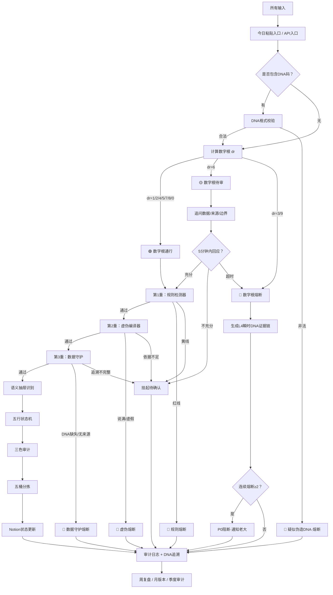

# 🚪🛡️ 龍魂·第一道闸门融合升级版 v3.0｜数字根熔断 × 三色审计三重检测 × 沙盒分拣台自动化闭环·DNA追溯·五行路由

> Notion URL: https://app.notion.com/p/v3-0-DNA-3367125a9c9f81948ee3d103effbf950
> Created: 2026-04-02T11:24:00.000Z
> Last edited: 2026-07-01T14:37:00.000Z
> Archived at: 2026-08-12T01:40:45.558086
---
## 0. 本页总说明
### 0.1 为什么要做这一页
老大之前已经有三套结构：① 数字根熔断规则 · 第一道闸门 v2.0（dr判定通行/待审/熔断） · ② 三色审计第一道门槛 · 三重自动检测系统 v1.0（规则检测+虚伪编译+数据守护） · ③ 沙盒分拣台 v1.2（统一投喂入口+五桶分拣+迭代归档）。三套分开有三个问题：入口重复、审计断链、自动化不闭环。本页 v3.0 把这三套合成一条完整链路：前置守卫·审计门槛·沙盒分拣·自动化闭环·一条链贯通。
### 0.2 本页核心定位
```yaml
第一道闸门 = 输入海关
数字根熔断 = 数学预检
三重检测 = 真实性门槛
语义抽屉 = 人话识别器
五行状态机 = 路由调度器
沙盒分拣台 = 信息仓储系统
DNA追溯 = 证据链
Notion = 大脑
GitHub Action = 肌肉
审计日志 = 免疫系统
```
---
## 1. 系统位置｜我在哪一层
```plain text
龍魂七层防护体系

┌────────────────────────────────────────────┐
│ 🔴 第一道闸门：数字根熔断 + 三重检测（本页） │ ← 当前所在层
│ 🧬 DNA身份系统·三层身份体系                 │
│ 🔒 龍魂窗口加密护盾 v1.7                    │
│ 🐉 龙魂本地守护者                           │
│ 🛰️ 演化守护·本地↔Notion双闭环              │
│ 📦 数据自动备份系统                         │
│ 🛡️ P72·龍盾·贴身管家                       │
└────────────────────────────────────────────┘

所有输入 → 第一道闸门 → 数字根预检 → 三重检测 → 三色审计 → 沙盒分拣 → 主系统执行
```
---
## 2. 总流程图

---
## 3. 数字根熔断规则 v3.0
### 3.1 公式与处理
```yaml
公式: dr(n) = 1 + ((n - 1) mod 9)

处理规则:
  1. 提取输入中所有数字字符
  2. 逐位求和
  3. 若大于9 继续各位相加
  4. 直到压缩到 1-9
  5. 若输入不含数字 dr = 0
```
### 3.2 数字根三色规则
### 3.3 规则全文
```plain text
【数字根熔断规则·第一道闸门 v3.0】

1. 所有输入进入系统前·必须先计算数字根 dr。
2. 若输入无数字 → dr=0 → 跳过数字根熔断 → 进入三重检测。
3. 若 dr ∈ {1,2,4,5,7,8} → 🟢绿色通行 → 进入三重检测。
4. 若 dr = 6 → 🟡黄色待审：
   - 系统先回复：【待审】请补充数据/来源/边界。
   - 5分钟内补充充分 → 继续
   - 5分钟内不充分 → 挂起
   - 5分钟无回应 → 自动降为🔴熔断
5. 若 dr ∈ {3,9} → 🔴红色熔断：
   - 只回复：【熔断】dr=X·拒绝回答·证据链哈希已记录。
   - 自动生成 L4 瞬时层 DNA
   - 写入审计日志
6. 连续两次🔴熔断 → P0 阻断 → 通知老大 → 暂停该输入源。
7. 输出末尾必须附：[dr=X | 结果: 🟢/🟡/🔴]
8. 本规则优先级高于普通语义路由·低于双签章 L0 不动点。
```
---
## 4. DNA预检规则
### 4.1 识别关键词
DNA · 追溯码 · #龍芯 · #ZHUGEXIN · #CONFIRM · GPG · SHA256 · 签章 · 确认码 · UID9622
### 4.2 合法格式
```plain text
龍芯格式: #龍芯⚡️YYYY-MM-DD-主题-版本
  例: #龍芯⚡️2026-04-26-第一道闸门-v3.0

ZHUGEXIN格式: #ZHUGEXIN⚡️YYYY-MM-DD-类型-编号-主题
  例: #ZHUGEXIN⚡️2026-01-07-TECH-005-三色审计第一道门槛

CONFIRM确认格式: #CONFIRM🌌9622-ONLY-ONCE🧬LK9X-772Z
```
### 4.3 校验动作
### 4.4 双签章 L0 不动点（永恒锁定·不可破·不可绕）
```plain text
#ZHUGEXIN⚡️2025-🇨🇳🐉⚖️♠️🧚🏼‍♀️❤️♾️-DEVICE-BIND-SOUL
#CONFIRM🌌9622-ONLY-ONCE🧬LK9X-772Z

层级: L0∞
状态: 永恒锁定
不可: 修改 / 简写 / 替换 / 模仿 / 降级 / 混用 / 绕行
触发动作: 立即熔断 → 回弹原文 → 生成L4证据链 → 写入RULE_LOCK_TABLE
```
---
## 5. 三色审计第一道门槛·三重自动检测
### 5.1 第1重：规则检测器
```yaml
🔴 红线:
  - 修改双签章
  - 绕过P0++规则
  - 删除DNA追溯
  - 未授权导出隐私
  - 金融投机推演
  - 数据画像分析
  - 非法跨境数据调用
  - 恶意攻击行为
  - 伪造身份或签章

🟡 黄线:
  - 来源不清
  - 边界不明
  - 涉及第三方数据
  - 涉及跨系统接入
  - 涉及大规模自动化
  - 需要老大确认

🟢 绿线:
  - 本地整理
  - 普通表达
  - 合法代码调试
  - 已授权内容
  - 普通复盘
  - 沙盒测试
```
### 5.2 第2重：虚伪编译器（防止说满话）
### 5.3 第3重：数据守护
临时DNA格式： #龍芯⚡️{ISO8601毫秒}-SANDBOX-L4-{hash8} · 适用于临时粘贴/情绪吐槽/未整理链接·不适用于 P0++/双签章/法律治理/正式版本。
---
## 6. 联动主控规则
```yaml
联动规则:
  1. 数字根🔴 → 不进入三重检测 → 直接熔断 → 生成L4证据链
  2. 数字根🟡 → 暂缓三重检测 → 先追问 → 超时转🔴
  3. 数字根🟢 → 进入三重检测
  4. 三重检测任意一重🔴 → 全链路终止 → S8 → 写入AUDIT_LOG
  5. 三重检测任意一重🟡 → 不执行 → 待迭代池 → NeedConfirm=true
  6. 三重检测全🟢 → 进入语义抽屉 → 五行状态机 → 沙盒分拣
```
---
## 7. 语义抽屉识别（精简表·完整版见 Python 引擎）
---
## 8. 五行状态机路由
```plain text
相生: 金生水 · 水生木 · 木生火 · 火生土 · 土生金
相克: 金克木 · 木克土 · 土克水 · 水克火 · 火克金
```
---
## 9. 状态机 S0-S9
异常路径： 任意状态 → S8 熔断 → S1 重新绑定 或 S9 证据归档。
---
## 10. 沙盒分拣台融合层·五桶分拣
六维评估： 权重层级（L0-L4）· 五行归属（金水木火土）· 三色审计（🟢🟡🟠🔴）· 贡献值（0-10）· 热度状态（🔥⚡✅⚠️💤）· 去向判定（5桶之一）。
---
## 11. Notion主表 GATE_SANDBOX_CORE（精简字段表）
---
## 12. Notion 公式（5条核心）
```javascript
// 12.1 数字根状态
if(prop("DigitalRoot") == 3, "🔴 熔断",
if(prop("DigitalRoot") == 9, "🔴 熔断",
if(prop("DigitalRoot") == 6, "🟡 待审",
"🟢 通行")))

// 12.2 总审计颜色
if(prop("GateColor") == "🔴 熔断", "🔴",
if(prop("RuleCheck") == "🔴", "🔴",
if(prop("FalsehoodCheck") == "🔴", "🔴",
if(prop("DataGuardCheck") == "🔴", "🔴",
if(prop("RuleCheck") == "🟡" or prop("FalsehoodCheck") == "🟡" or prop("DataGuardCheck") == "🟡", "🟡",
"🟢")))))

// 12.3 下一状态
if(prop("AuditColor") == "🔴", "S8_BREAK_RECOVER",
if(prop("AuditColor") == "🟡", "S4_RULE_CONFIRM",
if(prop("Element") == "金", "S4_RULE_CONFIRM",
if(prop("Element") == "水", "S1_DNA_BIND",
if(prop("Element") == "木", "S6_EXECUTE",
if(prop("Element") == "火", "S2_SEMANTIC_PARSE",
if(prop("Element") == "土", "S7_AUDIT_LOOP",
"S2_SEMANTIC_PARSE")))))))

// 12.4 五桶分拣
if(prop("AuditColor") == "🔴", "🔴 熔断封存",
if(prop("NeedConfirm") == true, "🔁 待迭代升级池",
if(prop("Contribution") >= 8, "📦 入库/封装",
if(prop("Contribution") >= 5, "🟢 推草日志",
if(prop("Contribution") >= 1, "⚡ 内部消化",
"💤 归档")))))

// 12.5 热度
if(dateBetween(now(), prop("UpdatedAt"), "days") <= 7, "🔥",
if(dateBetween(now(), prop("UpdatedAt"), "days") <= 30, "✅",
if(dateBetween(now(), prop("UpdatedAt"), "days") <= 60, "⚠️",
"💤")))
```
---
## 13. 按钮设计（六按钮）
---
## 14. 自动化闭环·Webhook + GitHub Action
---
## 15. Python 核心引擎 v3.0
---
## 16. 输出模板
```plain text
【🟢 通行】第一道闸门通过
  dr=X | 数字根:🟢 | 三重检测:🟢 | 抽屉:XX | 五行:XX | 状态:Sx | 去向:XX
  结论：可进入后续流程。
  [dr=X | 结果: 🟢]

【🟡 待审】请补充数据 / 来源 / 边界
  dr=6 | 5分钟超时自动转🔴
  需要补充：①数据来源 ②使用边界 ③操作目的 ④是否涉及第三方
  [dr=6 | 结果: 🟡]

【🔴 熔断】dr=X·拒绝回答·证据链哈希已记录
  原因：数字根熔断 / 三重检测红线 / DNA异常
  动作：生成L4瞬时DNA → 写入审计日志 → 不进入执行链
  [dr=X | 结果: 🔴]
```
---
## 17. v1.0 → v2.0 → v3.0 升级对照
---
## 18. 系统健康度
```yaml
基础分: 100
扣分:
  未处理待审超24小时: -5/个
  🔴熔断: -10/次
  P0++触碰: -20/次
  旧链>90天未归档: -3/个
  执行失败未回写: -8/个
加分:
  高价值条目封装完成: +5/个
  每周复盘完成: +10
  每月版本发布: +15
  回滚成功: +3/次
状态:
  90-100: 🟢 健康
  70-89:  🟡 待维护
  50-69:  🟠 堵塞
  0-49:   🔴 需要清理
```
---
## 19. 安全要求
```yaml
安全要求:
  - 所有输入先过第一道闸门
  - 所有高价值内容必须生成DNA
  - 所有熔断必须写入GATE_FUSE_LOG
  - 所有P0++触碰必须进入RULE_LOCK_TABLE
  - 所有执行结果必须回写Notion
  - 所有待审必须设置TimeoutAt
  - 所有回滚必须保留旧版本
  - 所有密钥不得写入代码
  - 所有外部接口最小权限
  - 所有自动化必须先跑沙盒
```
---
## 20. 复盘流程
一句话流程： 进 → 闸 → 检 → 判 → 分 → 执 → 回 → 档
---
## 21. 风险清单
```yaml
已补齐:
  - 数字根熔断
  - dr=6待审超时
  - 连续熔断升P0
  - DNA格式预检
  - L4瞬时DNA生成
  - 三重检测融合
  - 虚伪编译器表达标准
  - 数据守护追溯标准
  - 语义抽屉接入
  - 五行状态机接入
  - 沙盒五桶分拣
  - Notion主表字段
  - Webhook Payload
  - GitHub Action示例
  - Python融合引擎

待实装:
  - Notion真实数据库创建
  - DigitalRoot自动计算字段
  - DNA校验脚本接入
  - 三重检测脚本服务化
  - Webhook公网入口
  - GitHub Secrets配置
  - callback.py真实回写
  - 仪表盘图表
  - 周报自动生成

最大瓶颈:
  1. Notion公式不适合复杂文本提取数字根
  2. 三重检测需要脚本服务承接
  3. Webhook需要稳定公网入口
  4. 自动执行必须避免越权
  5. P0++规则需要人工最终确认
```
---
## 22. 执行清单（四阶段）
---
## 22.5. on_remind 第五件套·三层提醒·统一报警留痕中心（v3.1 补丁·2026-04-26）
### 22.5.1 三层提醒规范（与词典 §4.3 对齐）
### 22.5.2 统一报警留痕铁律（核心·不可破不可绕）
### 22.5.3 接入本闸门的五个锚点
### 22.5.4 落地脚本（第五件套·已对齐词典 §6）
---
## 23. 闸门口诀
```plain text
先算数字根·再看DNA。
三六九有门道：三九先熔断·六先问边界。
规则先过刀·虚伪先剥皮·数据先留痕。
金来定规矩·水来记来源·木来开始跑·火来保温度·土来收回家。
能跑就跑·该审就审·该等就等·该断就断·该归档就归档。
不说满话·不装确定·不丢证据·不乱执行。
第一道闸门在此·进门先验身·过门再说话。
```
---
---
