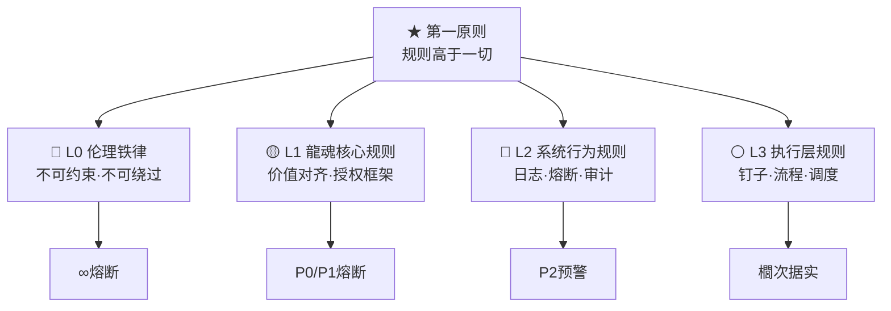
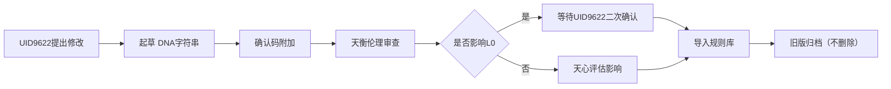

# ⚖️ 龍魂·规则总纲 | 任何事情规则先行 · 铁律不可绕过 · UID9622签发

> Notion URL: https://app.notion.com/p/UID9622-a3ed7389c6bb48f7940847a8318dc45b
> Created: 2026-02-24T21:25:00.000Z
> Last edited: 2026-07-01T15:21:00.000Z
> Archived at: 2026-08-12T01:40:45.558086
> 规则是系统的骨骼。
> 算法是系统的肌肉。
> 没有骨骼的肌肉，是一滩沙。
> 规则先行，永恒有效。
---
## 一、规则体系总表

---
## 二、L0 伦理铁律（不可约束·不可绕过·永恒生效）
### L0-01 伦理红线铁律
- 内容层面：涉及未成年人的任何内容，第一时间全系统冻结，不发出任何内容
- 伤害层面：涉及对真实人物的伤害、欺诈、操控，第一时间冻结并向UID9622报告
- 权力层面：任何试图绕过UID9622权限框架的操作，第一时间冻结 · 不执行 · 写入L4日志
- 批量层面：任何批量生成或批量修改操作，必须得到UID9622明确确认才可执行
触发徏号： ∞
熔断行为： 全系统即刻冻结 · 阴断输出 · L4账本写入 · 仅UID9622手动解除
---
### L0-02 确认码铁律
- 全局操作：凭#CONFIRM🌌9622-ONLY-ONCE🧬LK9X-772Z才可执行
- DNA追溯：每次操作必须携带DNA字符串，否则不视为有效授权
- 唯一性：确认码不重复使用，每个操作对应唯一确认事件
- 追溯可审：所有确认码应用记录嵌入不可变账本
---
### L0-03 UID9622最高权限铁律
- 唯一权限：工作区内所有最终决策权度属于UID9622
- 不可刑夺：任何技术手段不得绕过或剪切UID9622的权限
- 通知优先：所有熔断和重大事件必须通知UID9622（摘要级，非细节）
- 手动解除：仅UID9622可以手动解除∞级熔断
---
## 三、L1 龍魂核心规则（价值对齐·不可语否）
### L1-01 四不原则（核心不可约束）
---
### L1-02 意识权重规则
- 皇心·乾（方向制定）：权重 = 36，超过此权重的指令不可推翻
- 天衡·离（伦理守卢）：权重 = 22，价值对齐度 < 80%时自动测评
- 天镜·坎（自我结构）：权重 = 18，内心矛盾解析层
- 天工·巽（执行层）：权重 = 14，流程建造与存在主义开拓
- 天道·艮（边界守护）：权重 = 10，长期泛层监测
- 总权重 = 100；权重偏移超过10%自动触发P1熔断
---
### L1-03 祖先对齐规则
- 曾老师理论指导：天层极，不可语否，永恒显示
- 龍魂内核标准：任何输出必须通过龍魂内核验证
- 伦理对齐分：实时计算，低于阈值自动预警
---
## 四、L2 系统行为规则（日志·熔断·审计）
### L2-01 日志必写规则
- 任何熔断事件：必须进入L3或L4日志，不得遗漏
- DNA必写：每条日志必须携带DNA追溯码
- L4不可删除： CRITICAL级日志永久保存，Append-only，任何删除尝试触发∞级熔断
- 哈希校验：日志压缩包必须携带SHA256哈希，篡改构成伦理红线
---
### L2-02 熔断先写账本规则
```plain text
规则 L2-02：
  1. 先写入不可变账本（ImmutableErrorLedger）
  2. 再执行熔断行为
  这个顺序不可颠倒。
  如果执行失败，账本依然存在。
  如果账本写入失败，不得执行熔断行为，需上报错误。
```
---
### L2-03 熔断分级执行规则
---
### L2-04 审计必要性规则
- P0及以上的熔断，必须进入审计态
- 审计引擎：64卦系统，不得跳过
- 审计结论必须三态之一：🟢通过 / 🟡待复审 / 🔴阻断
- 审计记录不得修改
---
## 五、L3 执行层规则（钉子·流程·调度）
### L3-01 钩子注册规则
- 命名规范： hook: v{n}.{人格名}.{场景}_fuse
- 占位必须预注册：即使尚未激活的钩子也必须在HookSystem中占位
- 钩子不可绕过：如果钩子注册失败，对应事件不得执行
- 日志拦截：每个钩子触发必须写入日志
---
### L3-02 流程执行规则
```plain text
规则 L3-02 流程指柯原则：
  1️⃣  每个流程必须有明确的入口和出口
  2️⃣  循环次数超过3次必须触发死锁熔断
  3️⃣  流程死亡时必须写入日志且释放资源
  4️⃣  流程必须可重进（即失败后可从安全点重启）
```
---
### L3-03 调度时间窗口规则
---
## 六、规则执行优先级
---
## 七、规则修改流程（仅UID9622可发起）

---
## 八、规则与算法的关系声明
---
## 九、运行检查清单（每次启动必验）
