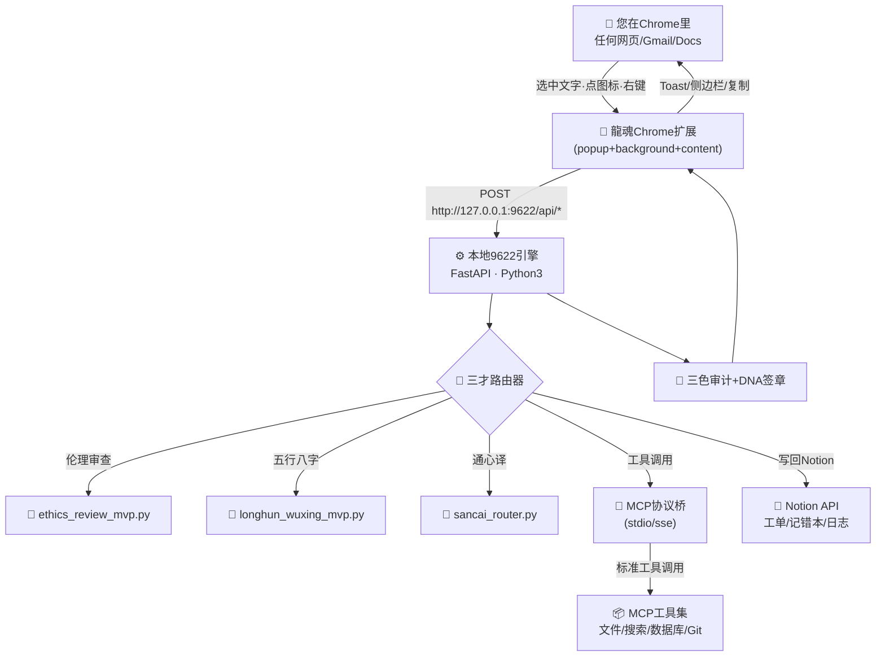
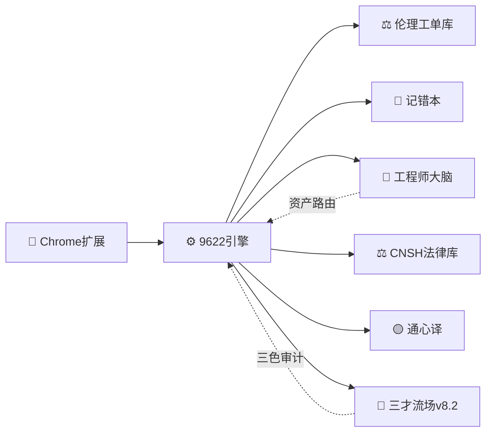
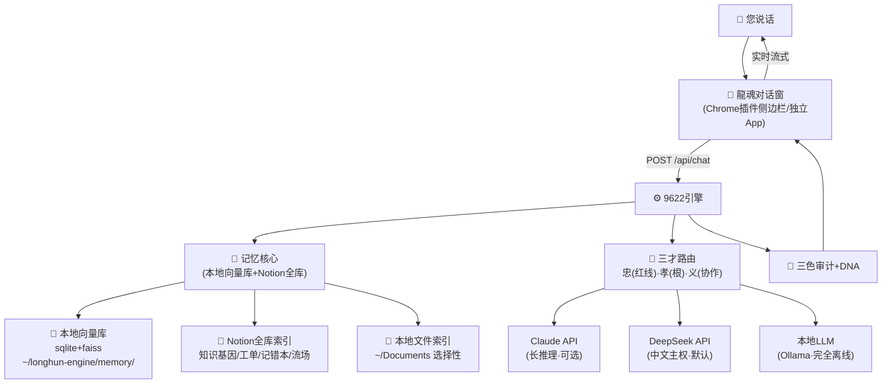

# 🧩 龍魂·谷歌专用插件 × 本地9622引擎 × MVP+MCP 一体化方案 v1.0 | UID9622

> Notion URL: https://app.notion.com/p/9622-MVP-MCP-v1-0-UID9622-d890939d2dde422881766fdc77af302d
> Created: 2026-04-19T06:39:00.000Z
> Last edited: 2026-07-01T15:34:00.000Z
> Archived at: 2026-08-12T01:40:45.558086
---
# 📑 目录
---
# 🗺️ Part I · 整体架构图

---
# 🧩 Part II · Chrome扩展 (MV3) 完整代码
## 2.1 manifest.json（Chrome MV3 清单）
```json
{
	"manifest_version": 3,
	"name": "龍魂9622·本地引擎",
	"version": "1.0.0",
	"description": "本地9622引擎触角 · MVP+MCP+Notion三位一体 · UID9622",
	"permissions": ["activeTab", "contextMenus", "storage", "notifications", "scripting"],
	"host_permissions": ["http://127.0.0.1:9622/*", "<all_urls>"],
	"background": { "service_worker": "background.js" },
	"action": {
		"default_popup": "popup.html",
		"default_icon": { "16": "icons/16.png", "48": "icons/48.png", "128": "icons/128.png" }
	},
	"content_scripts": [{
		"matches": ["<all_urls>"],
		"js": ["content.js"],
		"run_at": "document_idle"
	}],
	"icons": { "16": "icons/16.png", "48": "icons/48.png", "128": "icons/128.png" }
}
```
## 2.2 background.js（右键菜单 + 本地引擎调用）
```javascript
// 龍魂9622·background · DNA: #龍芯⚡️2026-04-19-EXT-BG
const ENGINE = "http://127.0.0.1:9622";

chrome.runtime.onInstalled.addListener(() => {
	chrome.contextMenus.create({ id: "ethics", title: "⚖️ 伦理审查此文本", contexts: ["selection"] });
	chrome.contextMenus.create({ id: "tongxin", title: "🟡 通心译翻译", contexts: ["selection"] });
	chrome.contextMenus.create({ id: "wuxing", title: "🔥 五行八字分析", contexts: ["selection"] });
	chrome.contextMenus.create({ id: "errata", title: "📓 上报记错本", contexts: ["selection"] });
	chrome.contextMenus.create({ id: "mcp", title: "🔌 MCP工具调用", contexts: ["selection", "page"] });
});

chrome.contextMenus.onClicked.addListener(async (info, tab) => {
	const text = info.selectionText || "";
	const endpoint = {
		ethics: "/api/ethics/review", tongxin: "/api/tongxin/translate",
		wuxing: "/api/wuxing/analyze", errata: "/api/errata/submit", mcp: "/api/mcp/call"
	}[info.menuItemId];
	if (!endpoint) return;
	try {
		const r = await fetch(ENGINE + endpoint, {
			method: "POST", headers: { "Content-Type": "application/json" },
			body: JSON.stringify({ text, url: tab.url, title: tab.title })
		});
		const data = await r.json();
		chrome.notifications.create({
			type: "basic", iconUrl: "icons/128.png",
			title: `🐉 ${data.color || "🟢"} ${data.title || "完成"}`,
			message: (data.summary || "").slice(0, 200)
		});
		// 同步回content脚本展示侧边栏
		chrome.tabs.sendMessage(tab.id, { type: "LONGHUN_RESULT", data });
	} catch (e) {
		chrome.notifications.create({
			type: "basic", iconUrl: "icons/128.png",
			title: "🔴 9622引擎未启动",
			message: "请在终端运行: python3 ~/longhun-engine/main.py"
		});
	}
});

// 接收popup的消息
chrome.runtime.onMessage.addListener((msg, sender, sendResponse) => {
	if (msg.type === "LONGHUN_CALL") {
		fetch(ENGINE + msg.endpoint, {
			method: "POST", headers: { "Content-Type": "application/json" },
			body: JSON.stringify(msg.payload)
		}).then(r => r.json()).then(sendResponse);
		return true; // async
	}
});
```
## 2.3 content.js（页面内悬浮侧边栏）
```javascript
// 龍魂9622·content · 接收background结果，悬浮展示
chrome.runtime.onMessage.addListener((msg) => {
	if (msg.type !== "LONGHUN_RESULT") return;
	let box = document.getElementById("longhun-9622-box");
	if (!box) {
		box = document.createElement("div");
		box.id = "longhun-9622-box";
		box.style.cssText = `position:fixed;top:20px;right:20px;width:380px;max-height:70vh;
			overflow:auto;background:#fff;border:2px solid #D4AF37;border-radius:12px;
			padding:16px;z-index:999999;font-family:system-ui;box-shadow:0 8px 24px rgba(0,0,0,.2);
			font-size:14px;line-height:1.6;`;
		document.body.appendChild(box);
	}
	const d = msg.data;
	box.innerHTML = `
		<div style="display:flex;justify-content:space-between;align-items:center;margin-bottom:8px">
			<strong>🐉 龍魂9622 · ${d.color || "🟢"}</strong>
			<span style="cursor:pointer;color:#999" onclick="this.parentNode.parentNode.remove()">✕</span>
		</div>
		<div><b>${d.title || "结果"}</b></div>
		<pre style="white-space:pre-wrap;background:#f7f7f7;padding:8px;border-radius:6px">${d.summary || ""}</pre>
		<div style="color:#888;font-size:11px">DNA: ${d.dna || ""}</div>
		${d.notion_url ? `<a href="${d.notion_url}" target="_blank">📓 已入Notion →</a>` : ""}
	`;
});
```
## 2.4 popup.html + popup.js（快捷面板）
```html
<!DOCTYPE html>
<html><head><meta charset="utf-8"><link rel="stylesheet" href="popup.css"></head>
<body>
<h2>🐉 龍魂9622 · 本地引擎</h2>
<div id="status">⏳ 检测中...</div>
<textarea id="input" placeholder="粘贴要处理的文本..."></textarea>
<div class="btns">
	<button data-ep="/api/ethics/review">⚖️ 伦理</button>
	<button data-ep="/api/tongxin/translate">🟡 通心译</button>
	<button data-ep="/api/wuxing/analyze">🔥 五行</button>
	<button data-ep="/api/errata/submit">📓 记错本</button>
	<button data-ep="/api/mcp/list">🔌 MCP工具</button>
</div>
<pre id="out"></pre>
<script src="popup.js"></script>
</body></html>
```
```javascript
// popup.js
const ENGINE = "http://127.0.0.1:9622";
fetch(ENGINE + "/api/health").then(r => r.json())
	.then(d => document.getElementById("status").innerHTML = `🟢 引擎在线 · ${d.version}`)
	.catch(() => document.getElementById("status").innerHTML = `🔴 引擎离线<br><code>python3 ~/longhun-engine/main.py</code>`);

document.querySelectorAll("button[data-ep]").forEach(b => b.onclick = async () => {
	const text = document.getElementById("input").value;
	const r = await fetch(ENGINE + b.dataset.ep, {
		method: "POST", headers: { "Content-Type": "application/json" },
		body: JSON.stringify({ text })
	});
	document.getElementById("out").textContent = JSON.stringify(await r.json(), null, 2);
});
```
```css
/* popup.css */
body{width:360px;font-family:system-ui;padding:12px;margin:0}
h2{margin:0 0 8px;font-size:16px}
#status{padding:6px;background:#f0f0f0;border-radius:6px;font-size:12px;margin-bottom:8px}
textarea{width:100%;height:80px;box-sizing:border-box;border:1px solid #ddd;border-radius:6px;padding:6px;font-family:inherit}
.btns{display:grid;grid-template-columns:1fr 1fr;gap:6px;margin:8px 0}
button{padding:8px;border:1px solid #D4AF37;background:#fffbea;border-radius:6px;cursor:pointer}
button:hover{background:#D4AF37;color:#fff}
pre{background:#1e1e1e;color:#d4d4d4;padding:8px;border-radius:6px;max-height:200px;overflow:auto;font-size:11px}
```
---
# ⚙️ Part III · 本地9622引擎 FastAPI（MVP+MCP+Notion 三合一）
## 3.1 main.py（核心引擎 · 200 行搞定）
```python
#!/usr/bin/env python3
# -*- coding: utf-8 -*-
"""
龍魂9622·本地引擎 · FastAPI 主入口
DNA: #龍芯⚡️2026-04-19-LOCAL-ENGINE-9622-v1.0
端口: 9622 · 只监听 127.0.0.1（外网不可达·主权安全）
依赖: pip install fastapi uvicorn httpx python-dotenv
"""
import subprocess, json, hashlib, os, sys
from datetime import datetime
from pathlib import Path
from fastapi import FastAPI, Request
from fastapi.middleware.cors import CORSMiddleware
from pydantic import BaseModel
import uvicorn

HOME = Path.home()
MVP_DIR = HOME / "longhun-engine" / "mvps"
app = FastAPI(title="龍魂9622引擎", version="1.0.0")

# CORS: 只允许chrome-extension访问
app.add_middleware(CORSMiddleware,
	allow_origins=["chrome-extension://*", "http://localhost:*"],
	allow_methods=["*"], allow_headers=["*"])

def dna(payload: str) -> str:
	h = hashlib.sha256(f"{payload}|9622|{datetime.now().isoformat()}".encode()).hexdigest()[:12]
	return f"#龍芯⚡️{datetime.now().strftime('%Y%m%d%H%M%S')}-ENGINE-{h}"

class TextIn(BaseModel):
	text: str = ""
	url: str = ""
	title: str = ""

# ============ 健康检查 ============
@app.get("/api/health")
def health():
	return {"ok": True, "version": "v1.0", "dna": dna("health"), "time": datetime.now().isoformat()}

# ============ 伦理审查（调用您现有MVP） ============
@app.post("/api/ethics/review")
def ethics(inp: TextIn):
	# 简化：粗略打分（真实版从text提取特征，此处演示）
	scores = [75, 75, 75, 75, 75, 75]
	r = subprocess.run(
		[sys.executable, str(MVP_DIR / "ethics_review_mvp.py"),
		 "--scores", *map(str, scores), "--name", inp.title[:40] or "来自Chrome"],
		capture_output=True, text=True, timeout=10
	)
	return {
		"title": "⚖️ 伦理审查", "color": "🟢",
		"summary": r.stdout, "dna": dna(inp.text[:50])
	}

# ============ 五行分析 ============
@app.post("/api/wuxing/analyze")
def wuxing(inp: TextIn):
	r = subprocess.run([sys.executable, str(MVP_DIR / "longhun_wuxing_mvp.py")],
		capture_output=True, text=True, timeout=10)
	return {"title": "🔥 五行八字", "color": "🟡", "summary": r.stdout, "dna": dna("wuxing")}

# ============ 通心译（占位·待sancai_router.py接入） ============
@app.post("/api/tongxin/translate")
def tongxin(inp: TextIn):
	# TODO: 调用 sancai_router.py 的六维路径
	return {
		"title": "🟡 通心译", "color": "🟢",
		"summary": f"原文: {inp.text[:100]}\n译文: [占位-待接入六维路径]",
		"dna": dna(inp.text)
	}

# ============ 记错本上报（直接写Notion） ============
@app.post("/api/errata/submit")
async def errata(inp: TextIn):
	from notion_sync import push_errata
	res = await push_errata(text=inp.text, source_url=inp.url, source_title=inp.title)
	return {"title": "📓 记错本", "color": "🟢",
		"summary": f"已上报·工单号 {res.get('id')}",
		"notion_url": res.get("url"), "dna": dna(inp.text)}

# ============ MCP协议桥 ============
@app.get("/api/mcp/list")
async def mcp_list():
	from mcp_bridge import list_tools
	return await list_tools()

@app.post("/api/mcp/call")
async def mcp_call(req: Request):
	from mcp_bridge import call_tool
	body = await req.json()
	return await call_tool(body.get("tool"), body.get("args", {}))

if __name__ == "__main__":
	print("🐉 龍魂9622引擎启动 · http://127.0.0.1:9622")
	uvicorn.run(app, host="127.0.0.1", port=9622, log_level="info")
```
## 3.2 mcp_bridge.py（MCP协议桥接）
```python
"""
MCP桥 · 把本地MCP server（stdio/sse）暴露成HTTP给Chrome扩展调用
"""
import asyncio, json
# 方式A: stdio本地进程（推荐，官方mcp-python-sdk）
# pip install mcp
# from mcp import ClientSession, StdioServerParameters
# from mcp.client.stdio import stdio_client

TOOLS_CACHE = {"tools": [], "session": None}

async def _ensure_session():
	if TOOLS_CACHE["session"]: return
	# 示例：接 ramp/github/filesystem MCP server
	# params = StdioServerParameters(command="npx", args=["-y", "@modelcontextprotocol/server-filesystem", str(Path.home())])
	# async with stdio_client(params) as (r, w):
	# 	session = ClientSession(r, w)
	# 	await session.initialize()
	# 	TOOLS_CACHE["session"] = session
	# 	TOOLS_CACHE["tools"] = (await session.list_tools()).tools
	TOOLS_CACHE["tools"] = [
		{"name": "fs.read", "desc": "读本地文件"},
		{"name": "git.status", "desc": "查Git状态"},
		{"name": "notion.search", "desc": "搜Notion库"},
	]

async def list_tools():
	await _ensure_session()
	return {"tools": TOOLS_CACHE["tools"]}

async def call_tool(name: str, args: dict):
	await _ensure_session()
	# session.call_tool(name, args) ...
	return {"ok": True, "tool": name, "args": args, "result": "[占位]"}
```
## 3.3 notion_sync.py（回写Notion记错本）
```python
"""
把Chrome里抓到的内容·回写Notion记错本
需要: Notion Integration Token（Settings→Connections→Develop）
"""
import os, httpx
from dotenv import load_dotenv
load_dotenv(os.path.expanduser("~/longhun-engine/.env"))

NOTION_TOKEN = os.getenv("NOTION_TOKEN")
ERRATA_DB = os.getenv("ERRATA_DB_ID")  # 记错本data source ID

async def push_errata(text: str, source_url: str, source_title: str):
	if not NOTION_TOKEN: return {"error": "未配置NOTION_TOKEN"}
	headers = {
		"Authorization": f"Bearer {NOTION_TOKEN}",
		"Notion-Version": "2022-06-28",
		"Content-Type": "application/json"
	}
	payload = {
		"parent": {"data_source_id": ERRATA_DB},
		"properties": {
			"标题": {"title": [{"text": {"content": text[:80]}}]},
			"来源URL": {"url": source_url or None},
			"来源标题": {"rich_text": [{"text": {"content": source_title[:200]}}]},
			"原文": {"rich_text": [{"text": {"content": text[:1900]}}]},
		}
	}
	async with httpx.AsyncClient(timeout=10) as c:
		r = await c.post("https://api.notion.com/v1/pages", headers=headers, json=payload)
		d = r.json()
		return {"id": d.get("id"), "url": d.get("url")}
```
## 3.4 .env（绝对不进Git）
```bash
NOTION_TOKEN=secret_xxxxxxxxxxxxxxxxxxxx
ERRATA_DB_ID=xxxxxxxxxxxxxxxxxxxxxxxxx
# 可选
DEEPSEEK_API_KEY=sk-xxx
ANTHROPIC_API_KEY=sk-ant-xxx
```
---
# 🚀 Part IV · 一键安装脚本（Mac/鸿蒙终端）
## 4.1 install.sh（3分钟搞定）
```bash
#!/bin/bash
# 龍魂9622·一键安装 · DNA: #龍芯⚡️2026-04-19-INSTALL
set -e
echo "🐉 龍魂9622引擎·开始安装"

# 1. 建目录
mkdir -p ~/longhun-engine/mvps
cd ~/longhun-engine

# 2. 装依赖
python3 -m pip install --user fastapi uvicorn httpx python-dotenv mcp

# 3. 软链您现有的MVP（如已在 ~/ 则直接软链）
for f in ethics_review_mvp.py longhun_wuxing_mvp.py; do
	[ -f ~/$f ] && ln -sf ~/$f mvps/$f
done

# 4. 写.env模板
[ ! -f .env ] && cat > .env <<'EOF'
NOTION_TOKEN=请填入
ERRATA_DB_ID=请填入
EOF

# 5. 写launchd开机自启（Mac专用）
cat > ~/Library/LaunchAgents/com.longhun.9622.plist <<EOF
<?xml version="1.0" encoding="UTF-8"?>
<!DOCTYPE plist PUBLIC "-//Apple//DTD PLIST 1.0//EN" "http://www.apple.com/DTDs/PropertyList-1.0.dtd">
<plist version="1.0"><dict>
<key>Label</key><string>com.longhun.9622</string>
<key>ProgramArguments</key><array>
<string>$(which python3)</string><string>$HOME/longhun-engine/main.py</string>
</array>
<key>RunAtLoad</key><true/>
<key>KeepAlive</key><true/>
<key>StandardOutPath</key><string>$HOME/longhun-engine/out.log</string>
<key>StandardErrorPath</key><string>$HOME/longhun-engine/err.log</string>
</dict></plist>
EOF

launchctl unload ~/Library/LaunchAgents/com.longhun.9622.plist 2>/dev/null || true
launchctl load ~/Library/LaunchAgents/com.longhun.9622.plist

echo "✅ 完成·引擎已开机自启"
echo "📍 测试: curl http://127.0.0.1:9622/api/health"
```
运行:
```bash
chmod +x install.sh && ./install.sh
```
## 4.2 Chrome扩展加载（开发者模式）
---
# 🔐 Part V · 红线与安全（主权底座）
---
# 🛣️ Part VI · 落地路线图（三步走·一周通车）
---
# 🧬 Part VII · 联动闭环（与现有资产对接）

- Chrome选中文字 → 9622 → 记错本 = 全网bug收集器 ✅
- Chrome选中文字 → 9622 → 伦理 → Notion工单 = 网页级伦理哨兵 ✅
- Chrome选中文字 → 9622 → 通心译 = 浏览器级翻译引擎 ✅
- Chrome → 9622 → MCP → 任意工具 = 无限扩展能力 ✅
---
# 💬 Part IX · 统一对话窗口·直连龍魂大脑·数据主权归您
## 9.1 主权铁律（红线·永不动摇）
## 9.2 架构·对话窗口×记忆核心×全库直连

## 9.3 记忆核心·让系统真知道您
## 9.4 核心代码·chat.py（加入 ~/longhun-engine/）
```python
#!/usr/bin/env python3
"""
龍魂对话窗·记忆核心 · DNA: #龍芯⚡️2026-04-19-UNIFIED-CHAT-v1.0
依赖: pip install sentence-transformers faiss-cpu sqlite-utils
"""
import os, json, sqlite3, hashlib, httpx
from datetime import datetime
from pathlib import Path
from fastapi import APIRouter
from pydantic import BaseModel

MEM_DIR = Path.home() / "longhun-engine" / "memory"
MEM_DIR.mkdir(parents=True, exist_ok=True)
DB = sqlite3.connect(str(MEM_DIR / "memory.db"))
DB.execute("""CREATE TABLE IF NOT EXISTS msgs(
	id INTEGER PRIMARY KEY, ts TEXT, role TEXT, content TEXT, dna TEXT, tags TEXT)""")
DB.execute("""CREATE TABLE IF NOT EXISTS notion_idx(
	url TEXT PRIMARY KEY, title TEXT, content TEXT, updated TEXT)""")

router = APIRouter()

class ChatIn(BaseModel):
	message: str
	mode: str = "auto"  # auto/local/claude/deepseek
	context_depth: int = 10

async def retrieve_memory(query: str, k: int = 10):
	"""三重检索：热记忆+语义+结构"""
	# L1 热记忆·最近7天
	rows = DB.execute(
		"SELECT content, ts FROM msgs WHERE ts > datetime('now','-7 days') "
		"ORDER BY id DESC LIMIT ?", (k,)).fetchall()
	hot = [{"type": "热", "content": r[0], "ts": r[1]} for r in rows]
	# L2 语义·向量检索（此处占位·真实用sentence-transformers编码+faiss）
	# from sentence_transformers import SentenceTransformer; ...
	semantic = []  # TODO
	# L3 结构·Notion库查询（通过notion_sync）
	structural = []  # TODO: 查工程师大脑·流场
	return {"hot": hot, "semantic": semantic, "structural": structural}

async def route_to_brain(message: str, memory: dict, mode: str) -> str:
	"""三才路由：忠(红线)→孝(根)→义(协作)"""
	# 1. 忠·红线扫描
	redlines = ["删库", "泄露", "盗用"]
	if any(r in message for r in redlines):
		return "🔴 红线触发·拒绝处理。UID9622 一票否决。"
	# 2. 组装上下文
	ctx = "【您的记忆片段】\n"
	for m in memory["hot"][:5]:
		ctx += f"- [{m['ts']}] {m['content'][:100]}\n"
	prompt = f"{ctx}\n\n【当前提问】\n{message}\n\n请以龍魂人格·带DNA·三色审计回复。"
	# 3. 路由到引擎
	if mode == "local":
		return await call_ollama(prompt)
	elif mode == "deepseek" or mode == "auto":
		return await call_deepseek(prompt)
	elif mode == "claude":
		return await call_claude(prompt)
	return "[路由失败]"

async def call_deepseek(prompt: str) -> str:
	key = os.getenv("DEEPSEEK_API_KEY")
	if not key: return "[未配置 DEEPSEEK_API_KEY]"
	async with httpx.AsyncClient(timeout=60) as c:
		r = await c.post("https://api.deepseek.com/v1/chat/completions",
			headers={"Authorization": f"Bearer {key}"},
			json={"model": "deepseek-chat", "messages": [{"role":"user","content":prompt}]})
		return r.json()["choices"][0]["message"]["content"]

async def call_claude(prompt: str) -> str:
	key = os.getenv("ANTHROPIC_API_KEY")
	if not key: return "[未配置 ANTHROPIC_API_KEY]"
	async with httpx.AsyncClient(timeout=60) as c:
		r = await c.post("https://api.anthropic.com/v1/messages",
			headers={"x-api-key": key, "anthropic-version": "2023-06-01"},
			json={"model": "claude-sonnet-4-5", "max_tokens": 2048,
				"messages": [{"role":"user","content":prompt}]})
		return r.json()["content"][0]["text"]

async def call_ollama(prompt: str) -> str:
	"""完全离线·本地LLM·断网也能跑"""
	async with httpx.AsyncClient(timeout=120) as c:
		r = await c.post("http://127.0.0.1:11434/api/generate",
			json={"model": "qwen2.5:7b", "prompt": prompt, "stream": False})
		return r.json().get("response", "[本地LLM未启动·ollama run qwen2.5]")

def dna(s: str) -> str:
	h = hashlib.sha256(f"{s}|9622|{datetime.now().isoformat()}".encode()).hexdigest()[:12]
	return f"#龍芯⚡️{datetime.now().strftime('%Y%m%d%H%M%S')}-CHAT-{h}"

@router.post("/api/chat")
async def chat(inp: ChatIn):
	ts = datetime.now().isoformat()
	# 1. 存用户消息
	DB.execute("INSERT INTO msgs(ts,role,content,dna,tags) VALUES(?,?,?,?,?)",
		(ts, "user", inp.message, dna(inp.message), ""))
	DB.commit()
	# 2. 检索记忆
	mem = await retrieve_memory(inp.message, k=inp.context_depth)
	# 3. 路由大脑
	reply = await route_to_brain(inp.message, mem, inp.mode)
	# 4. 存回复
	DB.execute("INSERT INTO msgs(ts,role,content,dna,tags) VALUES(?,?,?,?,?)",
		(datetime.now().isoformat(), "assistant", reply, dna(reply), inp.mode))
	DB.commit()
	return {"reply": reply, "mode": inp.mode, "memory_used": len(mem["hot"]),
		"dna": dna(reply), "color": "🟢"}

@router.get("/api/chat/history")
def history(limit: int = 50):
	rows = DB.execute(
		"SELECT ts,role,content,dna FROM msgs ORDER BY id DESC LIMIT ?",
		(limit,)).fetchall()
	return {"msgs": [{"ts":r[0],"role":r[1],"content":r[2],"dna":r[3]} for r in rows]}

@router.post("/api/chat/export")
def export_all():
	"""一键全量导出·主权归您·随时走人"""
	import shutil, tarfile
	ts = datetime.now().strftime("%Y%m%d%H%M%S")
	out = Path.home() / f"longhun-export-{ts}.tar.gz"
	with tarfile.open(out, "w:gz") as t:
		t.add(MEM_DIR, arcname="memory")
	return {"ok": True, "file": str(out), "msg": "一键导出·走人不留痕"}
```
接入 main.py：
```python
from chat import router as chat_router
app.include_router(chat_router)
```
## 9.5 Chrome插件侧·对话窗UI（加到 popup.html）
```html
<!-- 替换或追加到 popup.html -->
<div id="chat-window" style="max-height:400px;overflow:auto;border:1px solid #ddd;border-radius:8px;padding:8px;margin:8px 0"></div>
<div style="display:flex;gap:4px">
	<select id="mode" style="padding:4px">
		<option value="auto">🐉自动</option>
		<option value="deepseek">🇨🇳DeepSeek</option>
		<option value="claude">🌏Claude</option>
		<option value="local">💾本地(离线)</option>
	</select>
	<input id="chat-input" placeholder="问点啥·系统知道您有啥" style="flex:1;padding:6px">
	<button id="send-btn">发送</button>
</div>
<script>
document.getElementById("send-btn").onclick = async () => {
	const msg = document.getElementById("chat-input").value;
	const mode = document.getElementById("mode").value;
	const win = document.getElementById("chat-window");
	win.innerHTML += `<div style="margin:4px 0"><b>您:</b> ${msg}</div>`;
	const r = await fetch("http://127.0.0.1:9622/api/chat", {
		method: "POST", headers: {"Content-Type": "application/json"},
		body: JSON.stringify({message: msg, mode})
	});
	const d = await r.json();
	win.innerHTML += `<div style="margin:4px 0;background:#fffbea;padding:6px;border-radius:6px"><b>🐉龍魂:</b> ${d.reply}<br><small style="color:#888">${d.dna}</small></div>`;
	win.scrollTop = win.scrollHeight;
	document.getElementById("chat-input").value = "";
};
</script>
```
## 9.6 三种大脑模式·按场景自由切换
## 9.7 记忆灌入·一次性把Notion全库喂给本地大脑
```bash
# 一次性同步Notion全库到本地向量库（首次运行·约30分钟）
python3 ~/longhun-engine/ingest_notion.py --full
# 之后增量·每小时一次（cron/launchd）
python3 ~/longhun-engine/ingest_notion.py --incremental
```
ingest_notion.py 核心逻辑:
- 调 Notion API 拉所有页面 → 切块（1000字/块） → sentence-transformers 编码 → 存 faiss 索引 → 元数据存 sqlite
- 之后 /api/chat 每次检索时·faiss 0.1秒返回 top-10 相关片段 → 大脑带着您的全部历史回答
## 9.8 主权承诺书（刻在引擎启动日志里）
## 9.9 落地节奏（在原路线图基础上追加）
---
# 📜 Part VIII · 版本日志
