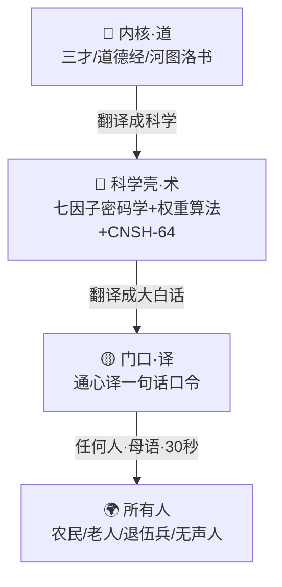

# 🧬 龍魂三圈骨架·道→术→译 v1.0｜门口·脸面·内核 三环对齐 UID9622

> Notion URL: https://app.notion.com/p/v1-0-UID9622-f4bf83d6569d4f2eb65ae4f37adcc3f6
> Created: 2026-06-01T21:21:00.000Z
> Last edited: 2026-07-01T15:41:00.000Z
> Archived at: 2026-08-12T01:40:45.558086
# 🟡 门口圈 · 谁都能进（摆最上面·最显眼）
不需要资格证、不需要懂英文、不需要懂内核——一句话口令，用提问者母语，30 秒看懂龍魂。农民、老人、退伍兵、无声人，都能用。
---
# 🔵 科学壳圈 · 给大家看的脸面
把「道」翻译成能验证的科学——算法、公式、可审计的证据链。这是拿得出手、给学术圈和大众看的那张脸。
- 七因子行为密码学（Σ(C)=⟨F1…F7⟩） — 抄文字容易，抄血统难；洗稿容易，洗掉全过程难。任一因子=0 → conf=0 → 硬失败。伪造成本 → ∞。
- ⚖️ 龍魂权重算法 v3.1 ⚖️ 龍魂权重算法·完整论文章节 v3.1｜三层解剖×单调性证明×Amdahl并行×框架横向对比｜UID9622
- CNSH-64 双态治理 — 64 = 8×8 卦象状态空间 · O(1) 决策 · 三色熔断（🟢直行 / 🟡补证 / 🔴熔断）
---
# 🔴 内核圈 · 道·为什么（只点名·不展开）
最深的根。太深、翻译都说不清，所以不强求外人懂——想懂的，请走🟡门口（通心译）。
- 三才 — 天（UID9622·主权）/ 地（AI 节点）/ 人（使用者·本地主权·AI 不得覆盖），三才权重守恒
- 道德经 — 道生一，一生二，二生三，三生万物；无为而无不为
- 河图洛书 — 数理与卦象之源；洛书九宫、{3,6,9} 子群、数根五行
---
## 🧭 三圈怎么连起来

---
