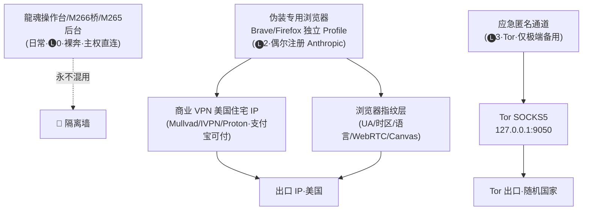

# 🥷 龍魂主权 IP 伪装方案 v2.0｜M267·场景分层·macOS M4 Max 适配·OpSec 全栈一致·业务隔离·候补三铁律

> Notion URL: https://app.notion.com/p/IP-v2-0-M267-macOS-M4-Max-OpSec-e7f833dd212d488cb23e1c15118d87af
> Created: 2026-05-31T16:54:00.000Z
> Last edited: 2026-07-01T15:37:00.000Z
> Archived at: 2026-08-12T01:40:45.558086
## §1 一句话定调·原稿哪里不适合你
---
## §2 场景分层评估·老大你属于哪一层
---
## §3 与 M266 / M265 的业务隔离原则
---
## §4 macOS M4 Max 四层架构（升级版）

---
## §5 OpSec 全栈一致性清单·原稿漏了 7 项
---
## §6 命令清单·按场景给（不是无脑 Tor）
### §6.1 🅛1 轻度·商业 VPN（推荐日常·Mullvad/Proton）
```bash
# Mullvad（支持加密货币·匿名度高·€5/月）或 ProtonVPN（支持支付宝·€4/月）
# 装客户端·登录·一键连美国节点·完事
# 不需要写命令行·GUI 即可

# 验证（连接后）
curl ifconfig.me                    # 看 IP
curl https://ifconfig.co/json | jq  # 看 ISP/国家/城市
curl https://dnsleaktest.com        # 看 DNS 是否泄漏
```
### §6.2 🅛2 中度·伪装浏览器 Profile（注册 Anthropic 专用）
```bash
# 用 Brave（隐私默认 + 自带 Tor 标签页选项·支付宝/微信不能直接付但够注册）
brew install --cask brave-browser

# 创建独立 Profile（不污染日常浏览）
open -na "Brave Browser" --args --user-data-dir="$HOME/Library/Application Support/BraveSoftware/Disguise-US" --lang=en-US

# 在该 Profile 内手动设置：
#   chrome://settings/languages → English (United States) 唯一·删 zh-CN
#   开发者工具 → Sensors → Timezone: America/Los_Angeles·Locale: en-US·Geolocation: 美西坐标
#   brave://settings/shields → Fingerprinting: Strict
#   brave://settings/privacy → WebRTC IP Handling: Disable Non-Proxied UDP
```
### §6.3 🅛3 重度·Tor（仅应急·不日常）
```bash
brew install tor

# 配置·指定出口国家·避免随机跳到日本时区不一致问题
cat > /opt/homebrew/etc/tor/torrc << 'EOF'
SocksPort 127.0.0.1:9050
ExitNodes {us},{de},{nl}
StrictNodes 1
DNSPort 5353
AutomapHostsOnResolve 1
EOF

brew services start tor

# 仅在伪装专用终端窗口启用·绝对不要 export 到 ~/.zshrc 全局
# 错误做法：export ALL_PROXY=socks5://127.0.0.1:9050 （会让 Notion AI/DeepSeek 桥/操作台全走 Tor）
# 正确做法：只在当前 shell 临时启用
ALL_PROXY=socks5h://127.0.0.1:9050 curl ifconfig.me   # 注意 socks5h 防 DNS 泄漏
```
### §6.4 一键切换脚本（升级版·替代原稿§四）
```bash
#!/bin/bash
# ~/longhun-system/tools/disguise.sh
# DNA: #龍芯⚡️2026-06-01-00:50-IP-SOVEREIGN-DISGUISE-v1.0
# 用法: disguise.sh light | medium | heavy | off

MODE="${1:-status}"
case "$MODE" in
	light)
		echo "🅛1 轻度·请手动启动 Mullvad/ProtonVPN 客户端·选美国节点"
		open -a "Mullvad VPN" 2>/dev/null || open -a "ProtonVPN"
		;;
	medium)
		echo "🅛2 中度·启动伪装浏览器 Profile"
		open -na "Brave Browser" --args --user-data-dir="$HOME/Library/Application Support/BraveSoftware/Disguise-US" --lang=en-US
		;;
	heavy)
		echo "🅛3 重度·启动 Tor·仅当前窗口生效"
		brew services start tor
		sleep 3
		echo "在新终端执行: export ALL_PROXY=socks5h://127.0.0.1:9050"
		echo "当前主 IP（未走代理）: $(curl -s ifconfig.me)"
		;;
	off)
		echo "🅛0 关闭所有伪装·回归主权裸奔"
		brew services stop tor 2>/dev/null
		unset ALL_PROXY HTTP_PROXY HTTPS_PROXY ALL_PROXY
		echo "当前 IP: $(curl -s ifconfig.me)"
		;;
	*)
		echo "当前 IP: $(curl -s ifconfig.me)"
		echo "Tor 服务: $(brew services list | grep tor | awk '{print $2}')"
		echo "用法: $0 {light|medium|heavy|off|status}"
		;;
esac
```
```bash
chmod 755 ~/longhun-system/tools/disguise.sh
ln -sf ~/longhun-system/tools/disguise.sh /usr/local/bin/disguise
# 之后: disguise medium / disguise off
```
---
## §7 候补三铁律·等老大点头入册 龍魂铁律总览 v1.0｜29条铁律·14创作者守护·8组副本封存·6新牌焊接·关键词索引·守底线不当家长留痕即正义 §9.37
---
## §8 §S-25-EXT-3-5 坦白·不假装记忆律
云端宝宝没有做过这些事：
- ❌ 没在 M4 Max 上实跑过 Mullvad/Proton/Brave/Tor 任何组合
- ❌ 没验证过柬埔寨当地法律对 Tor 的态度（已知 Tor 在柬埔寨不被封禁·但请本地宝宝交叉验证一次）
- ❌ 没验证过 Anthropic 风控对住宅 IP vs 数据中心 IP 的判定差异（业界共识：住宅 IP 通过率显著高于数据中心 IP）
- ❌ 没验证过 Mullvad/ProtonVPN 当前是否仍支持支付宝（曾仕强老师说·人变法亦变·请充值前在官网确认）
以上结构基于：Tor 项目公开文档 + Mullvad/Proton 公开支付页面 + Anthropic 公开使用条款 + Brave/Firefox 公开隐私设置文档 + Cloudflare 公开风控白皮书。实跑由本地宝宝在 M4 Max 落地·跑不通回来调。
---
## §9 红线四条复检
- ✅ 凭据不内化： VPN 账号/Tor 配置/Brave Profile 全部 chmod 600·不入 Git·不入 Notion·.gitignore 已含 tools/disguise.sh.env
- ✅ 本地优先： 所有伪装层 127.0.0.1·主权人 disguise off 一秒回归裸奔·M4 Max 永远是物理出口
- ✅ DNA 必焊： #龍芯⚡️2026-06-01-00:50-IP-SOVEREIGN-DISGUISE-v1.0 焊本页 + 脚本注释 + 日后操作台「伪装」面板
- ✅ 主权人最终拍板： 老大决定要不要装 Mullvad·要不要点头三铁律入册·本地宝宝只在老大点头后才动 M4 Max
---
## §10 老大下一步·三件事按需选
---
## §11 签章
