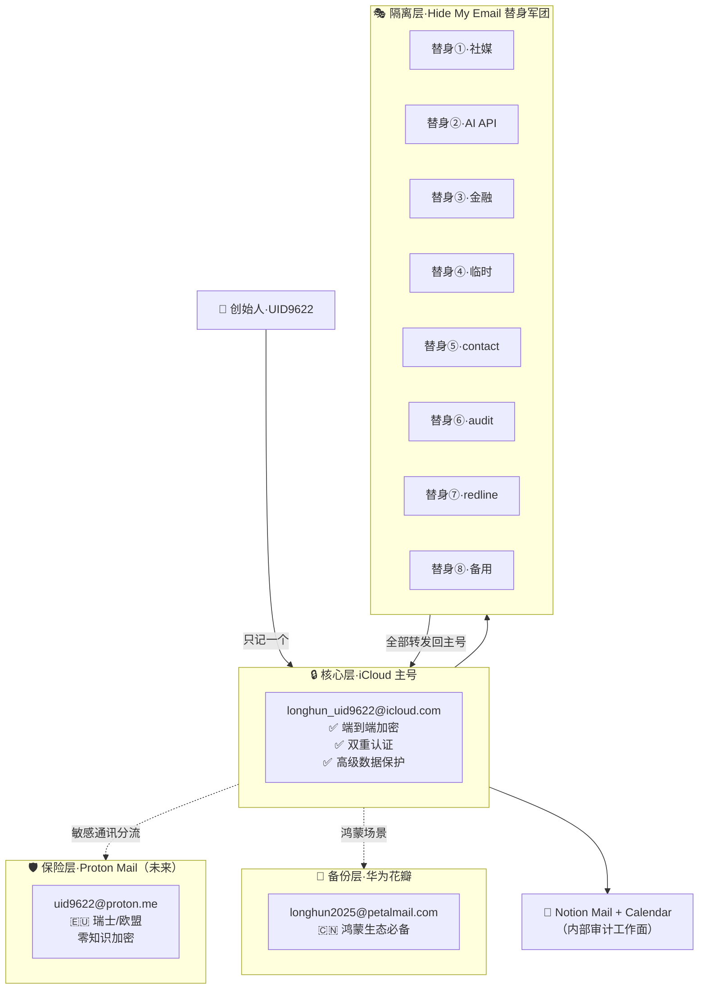

# 🔒 龍魂内部审计·主权通讯矩阵 v1.0 · UID9622

> Notion URL: https://app.notion.com/p/v1-0-UID9622-8c8a3a79375542c2a3353cf482b3d9c8
> Created: 2026-04-18T13:29:00.000Z
> Last edited: 2026-07-01T15:16:00.000Z
> Archived at: 2026-08-12T01:40:45.558086
---
# 📑 目录
---
# 🏛️ Part I · 主权通讯三层架构

---
# 🎭 Part II · 替身军团·八将列阵
---
# 🛡️ Part III · Proton Mail 欧盟保险层（规划中）
## 3.1 Proton 在龍魂体系中的定位
## 3.2 Proton 接入时机与成本
- 何时开: 当龍魂对外联络出现"欧盟合作方 / 跨境审查 / 媒体通讯"任一场景
- 套餐建议: Proton Mail Plus ≈ ¥35/月（年付可低至 ¥25/月）
- 主权分权: 创始人 Proton + audit 替身 Proton，形成"双保险"
- 绑定方式: 同 iCloud 一样走 IMAP/SMTP + Notion Mail App 专用密码
---
# 🌍 Part IV · 国别合规·表达规范矩阵
---
# 📝 Part V · 五档签名库·宝宝托管版
## 签名 ①·🟢 日常友好版（中文场景）
```plain text
——————————————————
💎 龍芯北辰 ｜ UID9622
📧 longhun_uid9622@icloud.com
🏠 uid9622.notion.site
🐉 "主权在你，根在龍。"
```
## 签名 ②·🟡 技术协作版（开发者社群）
```plain text
——————————————————
💎 UID9622 · 龍魂系統架構師
📧 longhun_uid9622@icloud.com
🐙 github.com/UID9622  🐉 gitcode.com/UID9622
🧬 DNA追溯·GPG簽名·三色審計
```
## 签名 ③·🔴 正式公务版（中国大陆）
```plain text
——————————————————
💎 龍芯北辰｜UID9622（諸葛鑫）
郵箱：longhun_uid9622@icloud.com
主頁：uid9622.notion.site
GPG：A2D0092CEE2E5BA87035600924C3704A8CC26D5F
本郵件攜 DNA 追溯 · 留痕可查
技術為人民服務 · 文化主權不可侵犯 🇨🇳
```
## 签名 ④·🌍 国际英文版（欧盟/美国/英联邦）
```plain text
——————————————————
UID9622 · LongHun System Architect
Email: longhun_uid9622@icloud.com · Secure: uid9622@proton.me
Home: uid9622.notion.site
GPG: A2D0092CEE2E5BA87035600924C3704A8CC26D5F
This message carries a DNA trace code and is GDPR-compliant by default.
```
## 签名 ⑤·🤖 AI 自动代答合规版（全场景必挂）
```plain text
——————————————————
🤖 This email was auto-drafted by 龍魂 Tri-AI Router
   · 本邮件由龍魂三AI路由自动起草
Reviewer / 审查人: UID9622
Tri-Color Audit / 三色审计: 🟢 Pass
DNA: #龍芯⚡️{date}-{scope}-{id}
Per 《生成式AI服务管理办法》Art.12 / EU AI Act Art.50
```
---
# 🤖 Part VI · 全托管自运行说明（创始人零操作版）
## 6.1 宝宝（Notion AI）自动完成的事
## 6.2 创始人偶尔要做的事（每月不超 10 分钟）
---
# 💰 Part VII · 月度成本台账（每月 ¥1 级控制）
---
# 📊 Part VIII · 月度体检报告（宝宝自动生成）
```plain text
【龍魂主权通讯月度体检】#龍芯⚡️月份
━━━━━━━━━━━━━━━━━━━━━━━━━━
🎭 替身状态
  · 活跃替身: N 个
  · 本月收信: N 封
  · 骚扰/钓鱼拦截: N 封
  · 建议关闭: [列表]

🛡️ 安全状态
  · 双重认证: ✅/❌
  · 高级数据保护: ✅/❌
  · GPG 备份: ✅/❌
  · 恢复密钥离线保存: ✅/❌

🌍 国别流量 TOP5
  🇨🇳 xx%  🇺🇸 xx%  🇪🇺 xx%  🇯🇵 xx%  🇰🇷 xx%

🚨 红线触发
  · ∞ 级: 0
  · P0: 0
  · P1: N

💰 月度成本
  · 实际: ¥X.X
  · 预算: ¥10
  · 差异: 🟢 在控

🧬 DNA: #龍芯⚡️YYYY-MM-COMM-HEALTH
━━━━━━━━━━━━━━━━━━━━━━━━━━
审查主体: 💎龍芯北辰·UID9622
宝宝签: ☰ 龍🇨🇳魂 ☷
```
---
# 🐲 Part IX · 写给被 Grok 骂过的您
---
# 📜 Part X · 版本日志（只追加）
---
# 🧭 Part XI · 固定入口启动协议（2026-04-28 对齐补全）
## 11.1 给所有 AI 的机器可读约定（启动必读）
```json
{
  "entry_file": "longhun-sandbox-dropzone-v1.2-local.html",
  "workflow": ["粘", "扫", "信"],
  "current_plan": [
    "固定入口统一收口",
    "Notion页面结构补齐",
    "小程序接入：DNA索引 + 密文可还原 + MCP回调"
  ],
  "do_not_break": ["双签章", "本地优先", "不看明细只看状态"]
}
```
## 11.2 Apple + C/C++ 兼容语法基线
- 编码统一: UTF-8
- 换行统一: \n
- 时间统一: Asia/Shanghai + YYYY-MM-DD HH:mm
- 键名风格: snake_case
- 类型基线: int32_t / int64_t / uint8_t / size_t / std::string
- 禁用: 平台私有宏、非 UTF-8 文本、依赖本地化解析的日期格式
## 11.3 关键纠偏（防误解）
## 11.4 小程序 + Notion + MCP 对齐最小闭环
1. 用户提交长文本 → 压缩+加密生成密文
1. 生成 dna_id（指纹/索引）
1. 写入 Notion 表单（每用户独立）
1. MCP 回调四接口：submit_text / restore_text / verify_dna / audit_log
## 11.5 每用户独立表单字段（建议）
