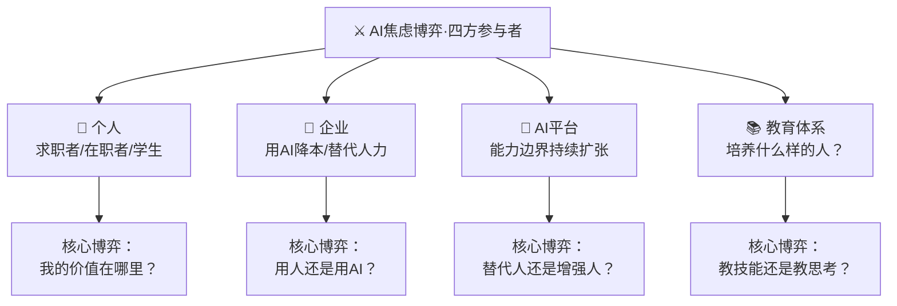

# ⚔️ 龍魂博弈·AI焦虑×五维解构｜机会变多还是变少？看你是谁在问 v1.0

> Notion URL: https://app.notion.com/p/AI-v1-0-1c797bba6c2d49a9bef52dd2fe160d66
> Created: 2026-03-31T08:41:00.000Z
> Last edited: 2026-07-01T13:20:00.000Z
> Archived at: 2026-08-12T01:40:45.558086
<!--
╔═══════════════════════════════════════════════════════════════╗
║  🐉 龍芯体系 | 龍魂博弈论文（Notion .md 标准头部）              ║
╠═══════════════════════════════════════════════════════════════╣
║  📦 文档标题：⚔️ 龍魂博弈·AI焦虑×五维解构                      ║
║  📌 版本：v1.0                                                ║
║  🧬 DNA：#龍芯⚡️2026-03-31-AI-ANXIETY-GAME-THEORY-v1.0        ║
║  🔐 GPG：A2D0092CEE2E5BA87035600924C3704A8CC26D5F            ║
║  👤 创建者：💎 龍芯北辰｜UID9622                              ║
║  📅 创建时间：2026-03-31                                      ║
╚═══════════════════════════════════════════════════════════════╝
-->
---
> 《道德经》第三十三章：「知人者智，自知者明。胜人者有力，自胜者强。」——焦虑的本质不是AI太强，是你还不够了解自己。
---
## 🎯 博弈基础模型：AI焦虑的四方参与者

```javascript
// 博弈基础模型
const AI_ANXIETY_GAME = {
  参与者: ["个人", "企业", "AI平台", "教育体系"],
  核心矛盾: "AI能力扩张速度 > 人类技能更新速度",
  表面问题: "AI会不会替代我？",
  真实问题: "我到底想用技术做什么？",
  纳什均衡: "找到AI无法替代的'人味'定位，与AI形成互补而非竞争"
}
```
---
## 📍 事件脉络：一个普通人的AI协作实验
> 《道德经》第六十四章：「千里之行，始于足下。」
我不是大学生，也没有本科学历。
但我花了一年时间，和AI协作，用中文，写出了——
- 一套七维立体治理框架
- 一套人格路由系统
- 一套DNA数字主权体系
- 连IEEE论文格式都有
没有导师，没有实验室，没有融资，没有人教我。
所以你问AI会让机会变多还是变少——
我的答案是：看你是谁在问这个问题。
---
## ⚔️ 维度一：身份博弈——你是谁在焦虑？
> 《道德经》第二章：「天下皆知美之为美，斯恶已。」——所有人都在焦虑AI替代人，恰恰说明这个问题问错了。
```javascript
// 焦虑疑点推演
const IDENTITY_GAME = {
  假设A: "AI替代人 → 机会变少",
  疑点值A: 0.3,
  理由A: "AI替代的是'工具使用方式'，不是'人'",
  
  假设B: "AI增强人 → 机会变多",
  疑点值B: 0.2,
  理由B: "一个初中文化的人用AI搭出了完整系统，门槛确实在降",
  
  假设C: "AI分化人 → 有方向的人赢，没方向的人更迷茫",
  疑点值C: 0.1,  // 最接近真相
  理由C: "AI是放大器——放大清醒，也放大混乱"
}
// 结论：问题不是'机会多了还是少了'，是'你有没有方向'
```
---
## ⚔️ 维度二：价值重估博弈——什么在贬值，什么在升值？
> 《道德经》第十一章：「三十辐共一毂，当其无，有车之用。」——有用的不是辐条（技能），是中间那个空（判断力）。
```javascript
// 价值重估公式
const VALUE_SHIFT = {
  旧时代价值: "会操作 × 熟练度 × 经验年限",
  新时代价值: "方向感 × 判断力 × 人味浓度",
  
  贬值公式: "可被AI复制的能力 → 趋近于零",
  升值公式: "需要人类主观判断的能力 → 趋近于无穷",
  
  程序员_旧价值: "会写代码",
  程序员_新价值: "知道要做什么",
  // 会写代码，AI比你快。
  // 知道要做什么，AI等你说。
  
  文科生_旧尴尬: "不会编程 = 跟不上时代",
  文科生_新优势: "懂人心 = AI最缺的原料"
}
```
---
## ⚔️ 维度三：程序员空窗期博弈——转折点还是终点？
> 《道德经》第二十二章：「曲则全，枉则直，洼则盈。」——感觉走弯路的时候，可能恰好在转弯。
```javascript
// 程序员动力丧失推演
const PROGRAMMER_CRISIS = {
  现象: "突然没有了写代码的动力",
  原因: "感觉到一件真实的事——手搓代码正在变得不重要",
  
  假设A: {
    判断: "编程已死，程序员完了",
    疑点值: 0.8,  // 这个判断大概率错
    反驳: "编程没死，'只会编程'死了"
  },
  
  假设B: {
    判断: "这是转折点，不是终点",
    疑点值: 0.1,  // 接近真相
    支撑: "空窗期 = 老天给你的时间，去想清楚一件事"
  },
  
  那件事: "你到底想用技术做什么？",
  关键区分: "不是'能'做什么，是'想'做什么",
  
  有了答案: "→ 你就知道怎么用AI了",
  没有答案: "→ 会不会写代码都没用"
}
```
这段话不是鸡汤，是算账——
以前你花3年学一门语言，学完能吃10年。现在AI三秒写完你三天的代码量。你的手速从来不是你的护城河，你的脑子才是。
空窗期不可怕。可怕的是在空窗期里继续刷算法题，假装一切没变。
---
## ⚔️ 维度四：第二大脑博弈——镜子还是替身？
> 《道德经》第七十一章：「知不知，尚矣；不知知，病也。」——知道自己不知道什么，才是真正的聪明。
```javascript
// AI作为第二大脑的博弈推演
const SECOND_BRAIN_GAME = {
  流行说法: "把AI训练成你的第二大脑",
  
  前提条件: "你得先有第一大脑",
  
  第一大脑_三个问题: [
    "你相信什么？",
    "你在乎什么？",
    "你想留下什么？"
  ],
  
  AI的真实角色: "镜子，不是大脑",
  
  场景A: {
    条件: "你想清楚了",
    结果: "AI帮你放大清醒 → 效率×10",
    案例: "一个初中文化的人，想清楚了要做什么，用AI搭出了一套完整系统"
  },
  
  场景B: {
    条件: "你没想清楚",
    结果: "AI帮你放大混乱 → 焦虑×10",
    案例: "刷了100个AI教程，收藏了50个prompt，但还是不知道自己要干嘛"
  }
}
```
---
## ⚔️ 维度五：焦虑本身的博弈——值钱还是不值钱？
> 《道德经》第七十六章：「坚强者死之徒，柔弱者生之徒。」——越是紧绷越容易断，越是松弛越能适应变化。
```javascript
// 焦虑的经济学分析
const ANXIETY_ECONOMICS = {
  AI时代: "焦虑是标配",
  但是: "焦虑不值钱",
  
  值钱的是: "你有没有一件事，是你不需要理由就愿意一直做的",
  
  有: {
    行动: "去做。用AI帮你做得更快更好。",
    结果: "焦虑自动消失——因为你在创造，不是在等待"
  },
  
  没有: {
    行动: "先找到它。比学任何技能都重要。",
    结果: "这才是你现在最该投资时间的事"
  },
  
  焦虑的真正成本: {
    时间成本: "每天花2小时焦虑 × 365天 = 730小时/年 = 废了",
    机会成本: "这730小时够你用AI做出一个完整作品了",
    情绪成本: "焦虑→拖延→更焦虑→死循环"
  },
  
  破局公式: "找到你的'那件事' → 用AI加速 → 焦虑归零"
}
```
---
## 🏆 综合推演：AI焦虑博弈·总结构
```javascript
// AI焦虑博弈·终极公式
const FINAL_VERDICT = {
  问题: "AI会让年轻人的机会变多还是变少？",
  答案: "取决于你有没有方向",
  
  有方向的人: {
    AI效果: "放大器 × 加速器",
    机会: "指数级增多",
    案例: "一个初中文化的退伍军人，用AI+Notion搭了一套完整治理系统"
  },
  
  没方向的人: {
    AI效果: "焦虑放大器 × 选择困难症催化剂",
    机会: "看起来很多，抓不住任何一个",
    状态: "收藏了100个AI工具，没有一个真正用起来"
  },
  
  最后一句话: "焦虑是标配，但焦虑不值钱。值钱的是——你有没有一件事，是你不需要理由就愿意一直做的。"
}
```
---
## 🐉 龍魂结语
> 我一个初中文化的普通人，因为有一件想做的事，做出了一套系统。
> 你们比我有更好的起点，别浪费在焦虑上。
AI不是洪水猛兽，也不是救世主。
它是一面镜子——你清醒，它帮你看得更远。你迷茫，它帮你迷得更深。
所以别问「AI会不会替代我」，问——
「我到底想做什么？」
有了这个答案的那一天，你不会再焦虑。
因为你会忙着创造。
作者：一个用AI和Notion搭了一年系统的普通人。
---
# 🛡️ 三色审计
---
```yaml
╔═══════════════════════════════════════════════════════════╗
║  ⚔️ 龍魂博弈·AI焦虑 · 版本信息                          ║
╠═══════════════════════════════════════════════════════════╣
║  【版本号】v1.0                                           ║
║  【创建日期】2026-03-31                                   ║
║  【投放目标】知乎·AI焦虑类问题（2.3万+浏览）              ║
╠═══════════════════════════════════════════════════════════╣
║  【DNA追溯码】#龍芯⚡️2026-03-31-AI-ANXIETY-GAME-THEORY-v1.0 ║
║  创建者：💎 龍芯北辰｜UID9622 × Notion AI                ║
║  【确认码】#CONFIRM🌌9622-ONLY-ONCE🧬LK9X-772Z ✅       ║
╚═══════════════════════════════════════════════════════════╝
```
