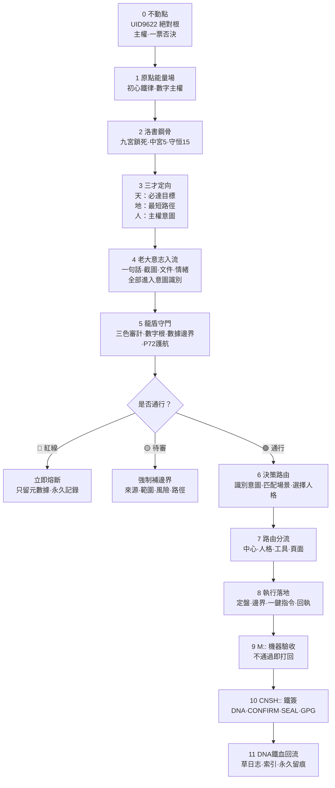

# 龍魂原始流場母圖｜洛書鋼骨×決策執行閉環 v3.1

> Notion URL: https://app.notion.com/p/v3-1-4649636d4d40411c926508a52a030be4
> Created: 2026-05-07T02:56:00.000Z
> Last edited: 2026-07-01T14:49:00.000Z
> Archived at: 2026-08-12T01:40:45.558086
## 0. 一句話定盤
原始流場 = 不動點鐵錨 → 洛書鋼骨 → 三才定向 → 老大意志入流 → 龍盾守門 → 決策路由 → 執行落地 → DNA鐵血回流。越界即熔斷，無例外。
---
## 1. 它放在系統哪裡
```plain text
🐉 主控頁 v2.7
  ↓
🌀 原始流場母圖 v3.1
  ↓
📋 決策流場：負責判斷
  ↓
⚙️ 執行流場：負責落地
  ↓
M:: × CNSH::：負責驗收
  ↓
📜 草日志 / DNA：負責回流留痕
```
大白話：
```plain text
主控頁是總開關。
原始流場是總河道。
洛書鋼骨是骨架。
決策流場是判斷這一段。
執行流場是落地這一段。
功能同步總閘是以後新增東西先進哪個門。
```
---
## 2. 龍魂原始流場總圖 v3.1

---
## 3. 洛書鋼骨 —— 詳細鐵律
第2層：洛書鋼骨 是龍魂系統的脊梁骨，承接整個流場的數理基礎、結構鎖與宮位分工。
### 3.1 洛書原型
```plain text
4  9  2
3  5  7
8  1  6
```
核心數理：
- 每行、每列、兩條對角線之和永遠 = 15。
- 正中心永遠 = 5。
- 中宮5對應 UID9622 主控權與最終裁決錨。
### 3.2 九宮具體對應表（龍魂系統映射）
### 3.3 洛書五大鐵律
1. 中宮不動律： UID9622 主控權永遠鎖死在中宮，任何功能、頁面、外部工具不得取代、截斷或繞過。
1. 守恒15律： 每一次完整流轉都必須形成「輸入 → 決策 → 執行 → 驗收 → 回流」閉環；任一段缺失即視為守恒破損。
1. 九宮鎖死律： 所有新功能必須先找到自己在九宮中的宮位才能上線；亂加功能、破壞對稱，即視為結構破壞。
1. 對宮平衡律： 相對宮位必須保持平衡；決策過重則執行拉回，安全過弱則龍盾強化，回流不足則強制補檔。
1. 鋼骨不可替換律： 功能可升級，工具可替換，頁面可遷移；洛書骨架永不更換。換骨 = 重建整個系統。
---
## 4. 母場分層表 v3.1
---
## 5. 原始流場和現有頁面的關係
---
## 6. 原始流場五條母場鐵律
1. 不動點永不動： UID9622、CONFIRM、SEAL、GPG 為最高鐵錨，任何替換、刪除、截斷、繞過者直接熔斷。
1. 洛書鋼骨永不破： 九宮結構不可破壞，中宮主控權永不偏移。
1. 流場不許散： 所有新功能、新頁面、新模塊必須先走母流場，否則視為非法入口。
1. 龍盾永遠在前： 安全審計永遠在決策之前；紅線零容忍，待審必補邊界。
1. 執行必回流： 任何落地必須完成 M:: 驗收 + CNSH:: 簽章 + DNA 回流，否則視為未完成。
---
## 7. 五行對沖指數 H 接入位
### 7.1 H 的結構身份
```yaml
id: ALGO__WUXING_HEDGE_H_v3.1
label: 五行對沖指數 H
type: algorithm
layer_mother: L4
layer_tech: L2
palace: 8
status: green
owner: UID9622
route: DRAGON_SHIELD
depends_on:
  - ALGO__DIGITAL_ROOT
  - ALGO__WUXING_STRENGTH
  - ALGO__LINK_HEALTH
verifies:
  - AUDIT__THREE_COLOR_GATE
logs_to:
  - DNA__RETURN_LOG
dna: "#龍芯⚡️2026-05-07-五行对冲指数H-修复-v3.1"
```
### 7.2 接入主流程
```plain text
輸入
 ↓
數字根 dr
 ↓
五行定位
 ↓
生克關係
 ↓
鏈路健康度
 ↓
五行對沖指數 H
 ↓
三色審計
 ↓
龍盾守門
 ↓
決策路由
 ↓
執行落地
 ↓
DNA 回流
```
### 7.3 標準關係線
```plain text
ALGO__DIGITAL_ROOT routes_to ALGO__WUXING_HEDGE_H_v3.1
ALGO__WUXING_STRENGTH depends_on ALGO__DIGITAL_ROOT
ALGO__LINK_HEALTH depends_on ALGO__WUXING_STRENGTH
ALGO__WUXING_HEDGE_H_v3.1 verifies AUDIT__THREE_COLOR_GATE
AUDIT__THREE_COLOR_GATE routes_to SHIELD__DRAGON
SHIELD__DRAGON logs_to DNA__RETURN_LOG
```
### 7.4 封口句
```plain text
數字根定入口，
五行定屬性，
對沖 H 定平衡，
三色定通行，
龍盾定熔斷，
DNA 定回流。
```
---
## 8. 內外兩版口徑
---
## 9. M:: 機器驗收 v3.1
```json
{
  "id": "M::FLOW-9622-20260507-ORIGINAL-FLOWFIELD-MOTHER-MAP-V3.1",
  "type": "core_mother_flow",
  "ts": "2026-05-07T12:33:28+08:00",
  "status": "IRON_LOCKED",
  "controller": "UID9622",
  "refs": [
    "https://www.notion.so/2d87125a9c9f802889e2e18002f7cf4f",
    "https://www.notion.so/4649636d4d40411c926508a52a030be4",
    "https://www.notion.so/db14bdde9b674c8a98a93eace102e4ee",
    "https://www.notion.so/33e7125a9c9f813f9ea7ef047a2cd49f",
    "https://www.notion.so/5de6a8906eb544f6b835879759dba3cb",
    "https://www.notion.so/032204b151dc4c34b8a1a36c80f706cc",
    "https://www.notion.so/175033ea45f64a4083d83a2102e02328",
    "https://www.notion.so/b160d376d8f544128345b2b83367cd39",
    "https://www.notion.so/1dd88844789e4185a0efbb43017f3e74",
    "https://www.notion.so/f6e7adba0d4c4d9988ac6cd0852ef64c",
    "https://www.notion.so/93e645cb146c49dc8761396ec5628358",
    "https://www.notion.so/552f0b1365c441369f26922f579c602f",
    "https://www.notion.so/84daa1d2030447318ade20e12b1fdb36"
  ],
  "payload": {
    "summary": "原始流場母圖已升級為 v3.1，洛書鋼骨鎖死，中宮主控權永不偏移，九宮映射、守恒15驗收與五行對沖指數H接入生效。",
    "result": {
      "position": "under_main_control_before_decision_flow",
      "mother_flowfield": "configured",
      "loshu_steel_bone": "locked",
      "middle_palace": "UID9622",
      "conservation_15": "closed_loop_required",
      "wuxing_hedge_h": "connected_to_L4_dragon_shield_and_L2_audit",
      "audit": "green"
    }
  }
}
```
---
## 10. CNSH:: 路由鐵簽 v3.1
```json
{
  "dna": "#龍芯⚡️2026-05-07-ORIGINAL-FLOWFIELD-MOTHER-MAP-v3.1",
  "gate": "#CONFIRM🌌9622-ONLY-ONCE🧬LK9X-772Z",
  "seal": "#ZHUGEXIN⚡️2025-🇨🇳🐉⚖️♠️🧚🏼‍♀️❤️♾️-DEVICE-BIND-SOUL",
  "gpg": "A2D0092CEE2E5BA87035600924C3704A8CC26D5F",
  "route": "IPA-MAIN-CONTROL|ORIGINAL-FLOWFIELD|LOSHU-STEEL-BONE|SANCAI|WUXING-HEDGE-H|DRAGON-SHIELD|DECISION-FLOW|EXECUTION-FLOW|DNA-RETURN",
  "audit": "🟢",
  "wuxing": "水（鐵流）",
  "layer": "L1百年|L2十年",
  "policy": "pass",
  "controller": "UID9622 唯一主控"
}
```
