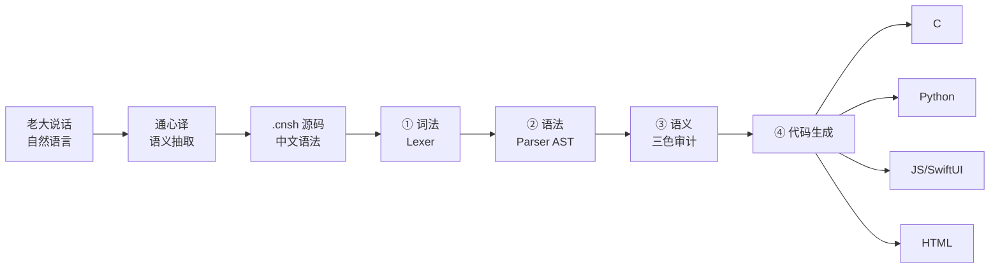
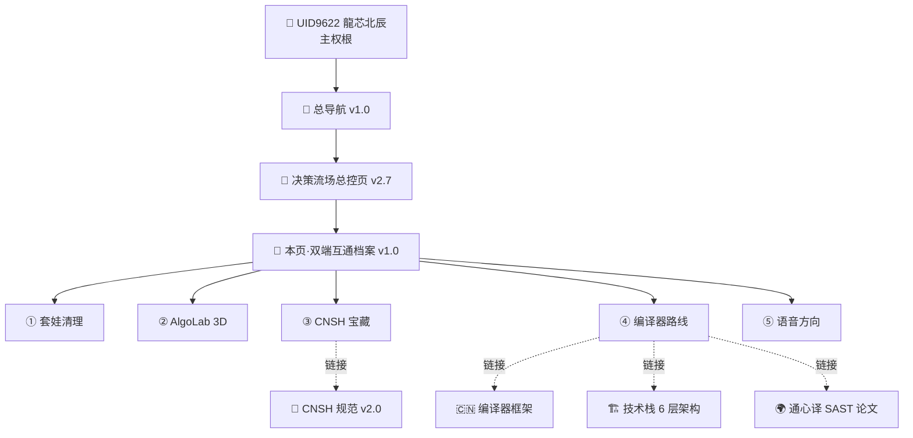

# 🐉 龍魂双端互通档案·Claude Code × Notion AI 同步快照 v1.0｜套娃清理·AlgoLab·CNSH语法宝藏·编译器路线·语音通话方向

> Notion URL: https://app.notion.com/p/Claude-Code-Notion-AI-v1-0-AlgoLab-CNSH-6d1fe232c0b34bc784a3e9c1c69b8ebc
> Created: 2026-05-18T13:56:00.000Z
> Last edited: 2026-07-01T15:04:00.000Z
> Archived at: 2026-08-12T01:40:45.558086
## 🎯 一句话定位
本页是本地 Claude Code 与 Notion AI（龍魂宝宝）的共享档案——两端看同一份进度、同一份待办、同一份 DNA。
> 老大原话：「我们要互通，一体，嘿嘿，我要堂堂正正滴，吓死开源自嗨鬼。」
---
## 📊 本次 Claude Code 会话发现总览（2026-05-18 深夜 → 2026-05-19 凌晨）
---
## ① 🧹 套娃清理（已完成）
套娃曾包含的内容（已确认主仓有同名目录，删之不丢东西）：
- BehavCrypto_v1.0/（论文，主仓有）
- cnsh-core/（CNSH 内核，主仓有）
- engine/（引擎，主仓有）
- longhun-algo-lab/（Swift 项目，主仓没有——待迁移）⚠️
- .cursor/ .obsidian/（编辑器配置）
---
## ② 🎨 AlgoLab Swift 3D 可视化项目（待迁主仓）
### 功能盘点
- 6 种排序算法可视化：冒泡 / 插入 / 选择 / 快速 / 归并 / 希尔
- 2D 动态排序动画：条形图实时变化
- 3D 时空全景模式（SceneKit 山脉）：
- 龍魂配色：金 / 青 / 橙 / 红 / 暗紫
- 键盘快捷键：Space 暂停 / ←→ 步进 / R 重置 / BISQMH 切算法
### 三个源文件
```plain text
Sources/AlgoLab/
├── AlgoLabApp.swift       (20 行·App 入口)
├── ContentView.swift      (758 行·2D 视图 + 控制)
└── Scene3DView.swift      (389 行·3D 时空全景)
```
### 🔄 待办：迁移到主仓
```bash
# 建议路径（待老大拍板）
mkdir -p /Users/zuimeidedeyihan/longhun-system/apps/
mv ~/某备份位置/longhun-algo-lab /Users/zuimeidedeyihan/longhun-system/apps/

# 套娃版已随套娃清掉·需要从 Time Machine 或 git 历史恢复
git log --all --oneline -- longhun-algo-lab/ | head
```
---
## ③ 📚 CNSH 语法宝藏盘点（~/claude搭建待整理/）
### 核心文件清单（已发现）
### 三才根基核心
```plain text
天部（算法层） → 卦象·人格·DNA 追溯
地部（系统层） → 规则·审计·权限
人部（用户层） → 用户·行为·权重
```
### 关键字对照（节选）
### 权重指向 L0–L4
---
## ④ 🔧 CNSH 编译器卡口·五阶段路线（衔接已有体系）
### 自然语言 → 代码 链路（老大主张）

### 实战示例（老大原话直翻）
输入： 「我想要一个按钮，红色，点一下弹出『你好』」
CNSH 中间层：
```javascript
组件 按钮 {
	颜色: "红色"
	点击事件: 弹出("你好")
}
```
生成 HTML：
```html
<button style="color:red" onclick="alert('你好')">按钮</button>
```
### 卡脖子三件套（当前缺口）
1. 词法分析器：识别中文关键字 / 切 token
1. 语法分析器：构建 AST
1. 代码生成器：多目标输出（C / Py / JS / SwiftUI）
---
## ⑤ 🎙️ 语音通话方向（待定）
---
## ⑥ 🔗 双端互通协议（本档案的核心）
### 6.1 同步铁律
### 6.2 双端文件位置对照
---
## ⑦ 📋 L0 决议区（老大拍板的事·写这里）
---
## ⑧ 🚀 下一步行动清单（双端共用 TODO）
---
## ⑨ 🌐 衔接图（一眼看清在体系里的位置）

---
## ⑩ ⛩️ 收尾·五道闸门审计
```yaml
时间: 2026-05-18 21:51 CST → 2026-05-19 凌晨双端同步
DNA: '#龍芯⚡2026-05-18-DUAL-BRIDGE-CLAUDE-NOTION-v1.0'
五行: dr=本页待 verify.sh 校验
三色: 🟢 全绿（信息整理类·无破坏性动作）
守恒: 13/15 稳定
铁律: 10/11/§0.6/12.7 时间戳 全过 ✅
G5 字符律: 🟢 龍字符律已遵守（无简体「龙」误用）
责任: UID9622·不免责
```
