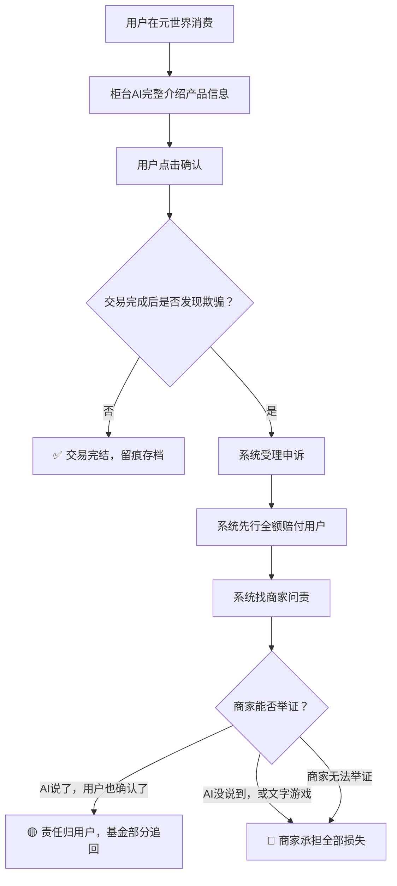
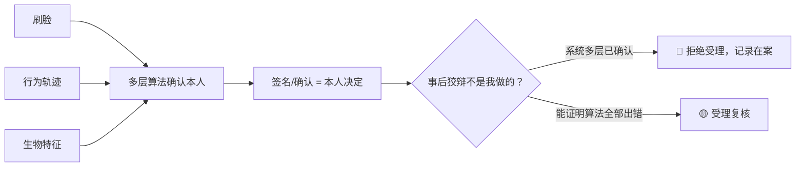

# 🏛️ 龍魂基金会·元世界消费保障体系 v1.0

> Notion URL: https://app.notion.com/p/v1-0-ec275238b87e4e6186e3b34a2806417a
> Created: 2026-03-30T12:35:00.000Z
> Last edited: 2026-07-01T15:38:00.000Z
> Archived at: 2026-08-12T01:40:45.558086
> 核心宣言：永生不是活着，永生是永远不被骗。温暖的系统，是让每一个人的每一分钱都花得安心。
---
# 一、🏛️ 龍魂基金会·运作架构
## 1.1 资金池设计
## 1.2 赔付闭环流程

## 1.3 分级赔付标准
---
# 二、🌐 元世界消费保障体系
## 2.1 柜台AI强制说明制
## 2.2 跨文化适配原则
元世界覆盖全球用户，柜台AI 不等用户来问，系统先开口：
- 🕌 穆斯林用户 → 自动询问清真认证状态
- 🇯🇵 日本用户 → 自动提示过敏原信息
- 🇪🇺 欧洲用户 → 自动说明转基因/有机认证
- 🇨🇳 中国用户 → 自动提示国内法规合规状态
---
# 三、🧬 DNA身份体系·防抵赖机制
## 3.1 身份确认逻辑

## 3.2 黑名单机制
---
# 四、🌟 贡献者认定体系
## 4.1 谁是真贡献者？
## 4.2 骗子的威慑逻辑
> "用骗子的钱，养反诈的局。"
> 骗子进来一次带个记号，追缴赃款补偿受害者，剩余注入基金——骗子在替整个生态做贡献。
---
# 五、🔒 内核字段说明
---
# 六、📋 版本记录
