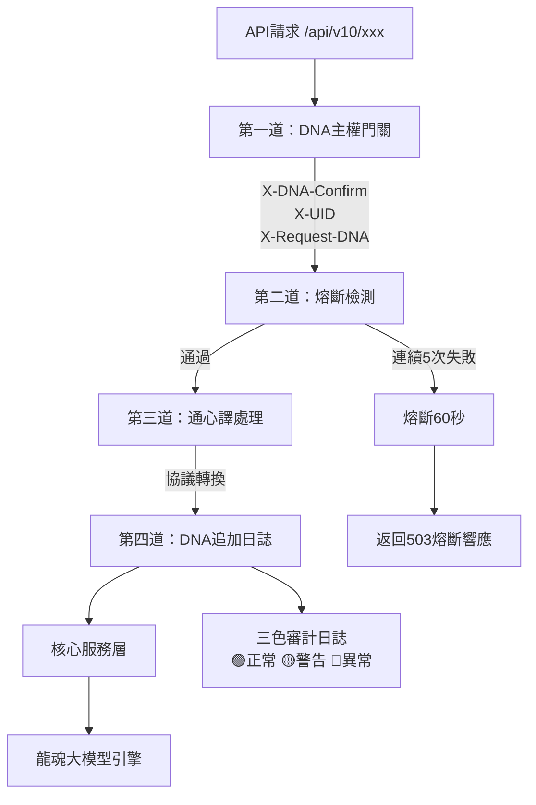
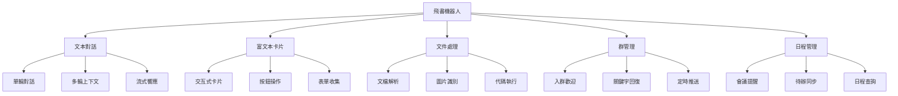
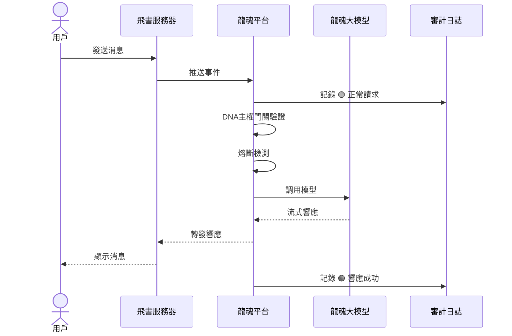
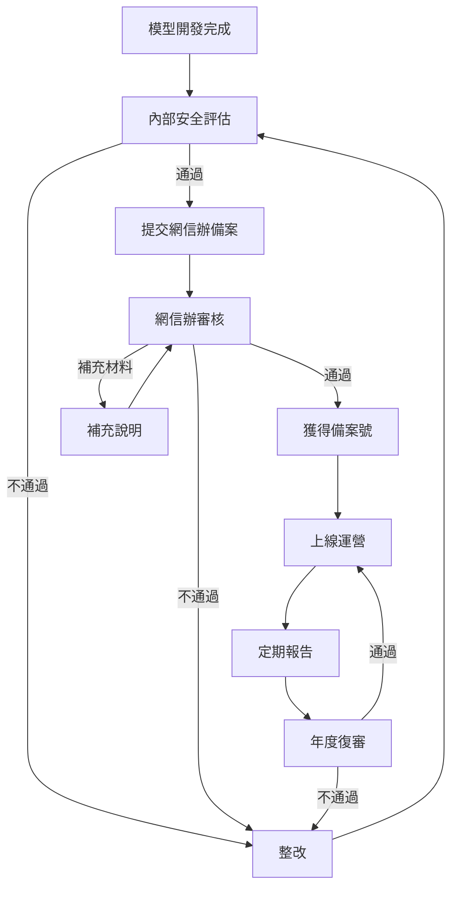
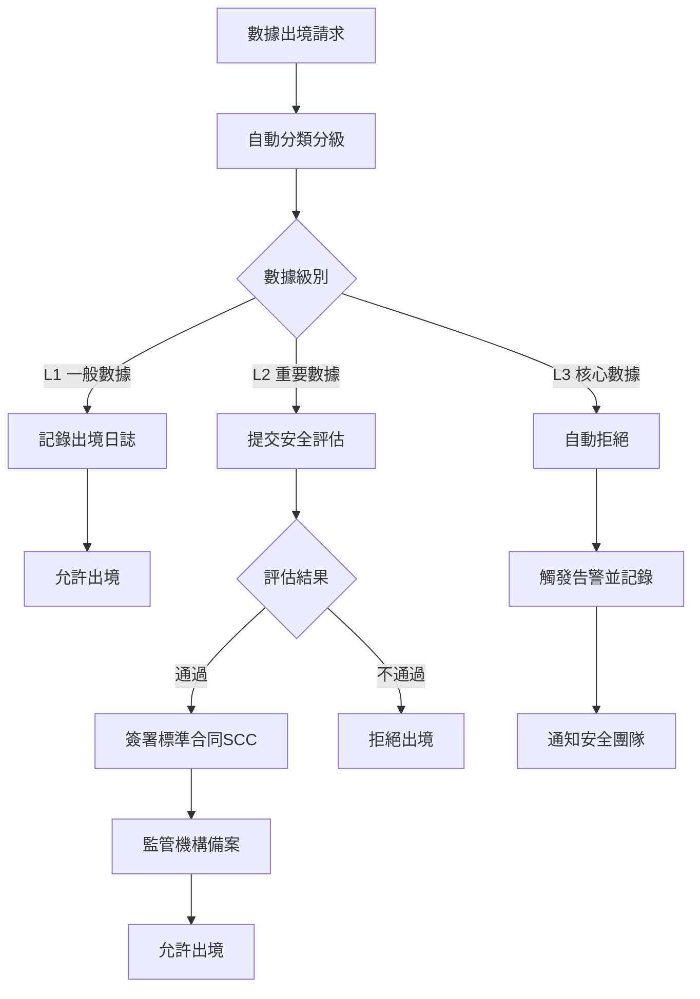
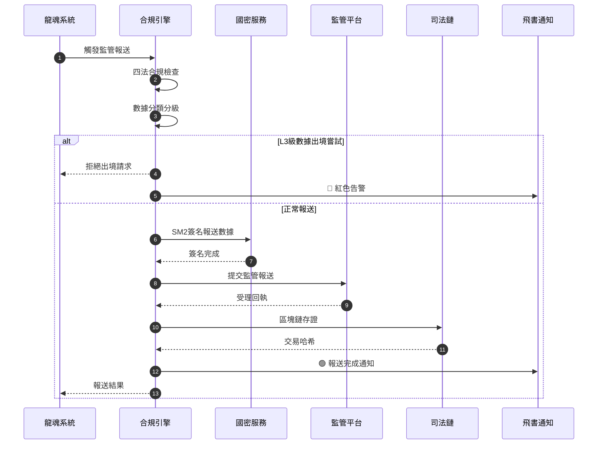
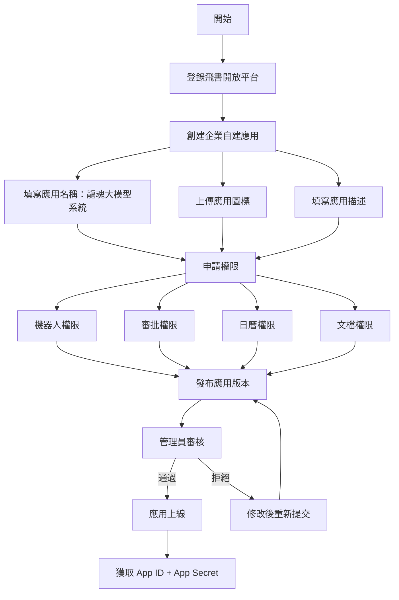
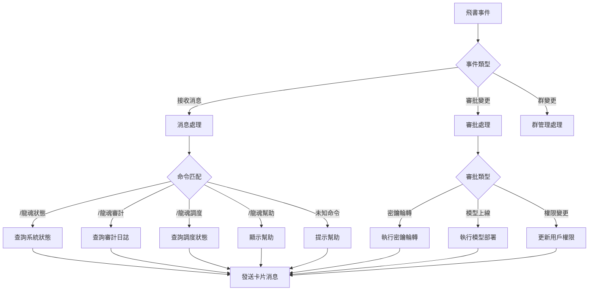
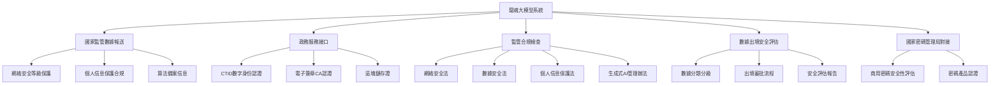

# 🐉 龍魂大模型接口生態系統 v10.0 | 量子態×國密×API×大模型調度×自適應收費

> Notion URL: https://app.notion.com/p/v10-0-API-3937125a9c9f8114b022f6da4d217fee
> Created: 2026-07-04T09:42:00.000Z
> Last edited: 2026-07-04T22:06:00.000Z
> Archived at: 2026-08-12T01:40:45.558086
---
# 第二部分：API文檔 · 飛書 · 國家接口
## （第5章 ~ 第7章）
# 龍魂大模型接口生態系統 v10.0 — 第二部分
> DNA追溯碼: #龍芯⚡️2025-01-20-API文檔-生態系統-v10.0
> 確認碼: #CONFIRM🌌9622-ONLY-ONCE🧬LK9X-772Z ✅
> 君子協議: CC BY-NC-SA 4.0
> 適用版本: v10.0 (Golden Dragon)
> 最後更新: 2025-01-20
---
## 第5章：API文檔完整版（v10.0）
### 5.1 系統概述
龍魂大模型接口生態系統 v10.0 是面向企業級AI基礎設施的完整API服務層。所有API統一從 /api/v10/ 入口進入，經過四道安全關卡處理後抵達核心服務。

```javascript
X-DNA-Confirm: #CONFIRM🌌9622-ONLY-ONCE🧬LK9X-772Z ✅
X-UID: LH-USER-{uuid}
X-Request-DNA: #龍芯⚡️{timestamp}-{endpoint}-{nonce}
Content-Type: application/json
Accept: application/json
Authorization: Bearer {dna_token}
X-Client-Version: 10.0.0
X-Request-ID: {uuid}
```
```json
{
  "code": 0,
  "message": "success",
  "data": { },
  "meta": {
    "request_id": "req_abc123",
    "timestamp": "2025-01-20T14:30:00+08:00",
    "dna_trace": "#龍芯⚡️2025-01-20-14:30:00-auth-verify-abc123",
    "processing_ms": 45
  }
}
```
---
### 5.2 身份認證模塊（Auth Module）
```javascript
POST /api/v10/auth/quantum-state
```
接口說明: 用戶首次註冊時調用，觸發量子態塌縮，生成唯一的量子身份標識。此操作只能執行一次，終身有效。
請求頭:
```javascript
X-DNA-Confirm: #CONFIRM🌌9622-ONLY-ONCE🧬LK9X-772Z ✅
X-UID: LH-USER-{uuid}
X-Request-DNA: #龍芯⚡️{timestamp}-quantum-state-{nonce}
Content-Type: application/json
```
請求體:
```json
{
  "device_fingerprint": "sha256:{device_hash}",
  "biometric_seed": "base64:{encrypted_biometric}",
  "initial_vector": "quantum_random:{256bit_hex}",
  "agreement": {
    "terms_accepted": true,
    "privacy_policy": true,
    "red_line_acknowledged": true,
    "timestamp": "2025-01-20T14:30:00+08:00"
  }
}
```
響應示例（成功）:
```json
{
  "code": 0,
  "message": "quantum state collapsed successfully",
  "data": {
    "quantum_id": "QID-SHA256-{hash}",
    "dna_token": "lh_dna_{jwt_token}",
    "entropy_pool": "base64:{quantum_entropy}",
    "collapsed_at": "2025-01-20T14:30:00.123456+08:00",
    "status": "collapsed",
    "red_line_signature": "SM2:{signature}"
  },
  "meta": {
    "request_id": "req_qs_001",
    "timestamp": "2025-01-20T14:30:00+08:00",
    "dna_trace": "#龍芯⚡️2025-01-20-14:30:00-quantum-state-qs001",
    "processing_ms": 128
  }
}
```
響應示例（失敗 - 已塌縮）:
```json
{
  "code": 20001,
  "message": "quantum state already collapsed for this device",
  "data": {
    "collapsed_at": "2024-06-15T09:00:00+08:00",
    "quantum_id": "QID-SHA256-{existing_hash}"
  },
  "meta": {
    "request_id": "req_qs_002",
    "timestamp": "2025-01-20T14:30:00+08:00",
    "dna_trace": "#龍芯⚡️2025-01-20-14:30:00-quantum-state-qs002"
  }
}
```
錯誤碼:
Python調用示例:
```python
import requests
import json
from datetime import datetime

headers = {
    "X-DNA-Confirm": "#CONFIRM🌌9622-ONLY-ONCE🧬LK9X-772Z ✅",
    "X-UID": "LH-USER-550e8400-e29b-41d4-a716-446655440000",
    "X-Request-DNA": f"#龍芯⚡️{datetime.now().strftime('%Y-%m-%d-%H:%M:%S')}-quantum-state-001",
    "Content-Type": "application/json"
}

payload = {
    "device_fingerprint": "sha256:a1b2c3d4e5f6...",
    "biometric_seed": "base64:encrypted_seed_here",
    "initial_vector": "quantum_random:abc123def456...",
    "agreement": {
        "terms_accepted": True,
        "privacy_policy": True,
        "red_line_acknowledged": True,
        "timestamp": datetime.now().isoformat()
    }
}

response = requests.post(
    "https://api.longhun.dev/v10/auth/quantum-state",
    headers=headers,
    json=payload,
    timeout=(10, 60)
)
result = response.json()
print(f"Quantum ID: {result['data']['quantum_id']}")
print(f"DNA Token: {result['data']['dna_token'][:20]}...")
```
cURL示例:
```bash
curl -X POST "https://api.longhun.dev/v10/auth/quantum-state" \
  -H "X-DNA-Confirm: #CONFIRM🌌9622-ONLY-ONCE🧬LK9X-772Z ✅" \
  -H "X-UID: LH-USER-550e8400-e29b-41d4-a716-446655440000" \
  -H "X-Request-DNA: #龍芯⚡️2025-01-20-14:30:00-quantum-state-001" \
  -H "Content-Type: application/json" \
  -d '{
    "device_fingerprint": "sha256:a1b2c3d4e5f6...",
    "biometric_seed": "base64:encrypted_seed_here",
    "initial_vector": "quantum_random:abc123def456...",
    "agreement": {
      "terms_accepted": true,
      "privacy_policy": true,
      "red_line_acknowledged": true,
      "timestamp": "2025-01-20T14:30:00+08:00"
    }
  }'
```
---
```javascript
POST /api/v10/auth/verify
```
接口說明: 通過七因子認證體系完成身份驗證，支持多因子組合驗證。
七因子定義:
請求體:
```json
{
  "quantum_id": "QID-SHA256-{hash}",
  "factors": {
    "f1_quantum": { "token": "lh_dna_{jwt}" },
    "f2_device": { "fingerprint": "sha256:{hash}", "confidence": 0.95 },
    "f3_biometric": { "type": "voiceprint|fingerprint|face", "data": "base64:{data}" },
    "f4_behavior": { "keystroke_pattern": "base64:{pattern}", "mouse_dynamics": "base64:{dynamics}" },
    "f5_time": { "request_time": "2025-01-20T14:30:00+08:00", "time_window": "±5min" },
    "f6_geo": { "latitude": 39.9042, "longitude": 116.4074, "radius_km": 50 },
    "f7_social": { "trust_nodes": ["node1", "node2"], "depth": 2 }
  },
  "required_score": 0.85
}
```
響應示例（成功）:
```json
{
  "code": 0,
  "message": "seven-factor authentication passed",
  "data": {
    "auth_result": true,
    "composite_score": 0.92,
    "factor_scores": {
      "f1_quantum": 1.0,
      "f2_device": 0.95,
      "f3_biometric": 0.88,
      "f4_behavior": 0.85,
      "f5_time": 1.0,
      "f6_geo": 0.90,
      "f7_social": 0.82
    },
    "session_token": "lh_session_{jwt}",
    "expires_at": "2025-01-20T15:30:00+08:00",
    "permissions": ["model:read", "model:write", "crypto:sign"],
    "trust_level": "high"
  },
  "meta": {
    "request_id": "req_auth_001",
    "timestamp": "2025-01-20T14:30:00+08:00",
    "dna_trace": "#龍芯⚡️2025-01-20-14:30:00-auth-verify-auth001",
    "processing_ms": 256
  }
}
```
Python調用示例:
```python
import requests

headers = {
    "X-DNA-Confirm": "#CONFIRM🌌9622-ONLY-ONCE🧬LK9X-772Z ✅",
    "X-UID": "LH-USER-550e8400-e29b-41d4-a716-446655440000",
    "X-Request-DNA": "#龍芯⚡️2025-01-20-14:30:00-auth-verify-001",
    "Content-Type": "application/json",
    "Authorization": "Bearer lh_dna_xxx"
}

payload = {
    "quantum_id": "QID-SHA256-abc123",
    "factors": {
        "f1_quantum": {"token": "lh_dna_xxx"},
        "f2_device": {"fingerprint": "sha256:device_hash", "confidence": 0.95},
        "f3_biometric": {"type": "voiceprint", "data": "base64:data_here"},
        "f4_behavior": {"keystroke_pattern": "base64:pattern", "mouse_dynamics": "base64:dynamics"},
        "f5_time": {"request_time": "2025-01-20T14:30:00+08:00", "time_window": "±5min"},
        "f6_geo": {"latitude": 39.9042, "longitude": 116.4074, "radius_km": 50},
        "f7_social": {"trust_nodes": ["node1", "node2"], "depth": 2}
    }
}

response = requests.post("https://api.longhun.dev/v10/auth/verify", headers=headers, json=payload)
result = response.json()
print(f"Auth result: {result['data']['auth_result']}")
print(f"Trust level: {result['data']['trust_level']}")
```
---
```javascript
POST /api/v10/auth/refresh
```
接口說明: 使用有效的DNA令牌刷新，獲取新的令牌。舊令牌在寬限期（5分鐘）內仍然有效。
請求頭:
```python
X-DNA-Confirm: #CONFIRM🌌9622-ONLY-ONCE🧬LK9X-772Z ✅
X-UID: LH-USER-{uuid}
X-Request-DNA: #龍芯⚡️{timestamp}-auth-refresh-{nonce}
Content-Type: application/json
Authorization: Bearer {current_dna_token}
```
響應示例:
```json
{
  "code": 0,
  "message": "token refreshed",
  "data": {
    "dna_token": "lh_dna_{new_jwt}",
    "expires_at": "2025-01-21T14:30:00+08:00",
    "old_token_grace_period": "2025-01-20T14:35:00+08:00"
  },
  "meta": {
    "request_id": "req_refresh_001",
    "timestamp": "2025-01-20T14:30:00+08:00",
    "dna_trace": "#龍芯⚡️2025-01-20-14:30:00-auth-refresh-ref001",
    "processing_ms": 45
  }
}
```
---
```javascript
POST /api/v10/auth/revoke
```
接口說明: 主動吊銷DNA令牌。吊銷後，該令牌立即失效，所有關聯會話被終止。
請求頭:
```javascript
X-DNA-Confirm: #CONFIRM🌌9622-ONLY-ONCE🧬LK9X-772Z ✅
X-UID: LH-USER-{uuid}
X-Request-DNA: #龍芯⚡️{timestamp}-auth-revoke-{nonce}
Content-Type: application/json
Authorization: Bearer {dna_token}
```
響應示例:
```json
{
  "code": 0,
  "message": "token revoked successfully",
  "data": {
    "revoked_at": "2025-01-20T14:30:00+08:00",
    "sessions_terminated": 3
  },
  "meta": {
    "request_id": "req_revoke_001",
    "timestamp": "2025-01-20T14:30:00+08:00",
    "dna_trace": "#龍芯⚡️2025-01-20-14:30:00-auth-revoke-rev001",
    "processing_ms": 32
  }
}
```
---
### 5.3 核心模型調度模塊（Model Dispatch Module）
```javascript
GET /api/v10/models
```
接口說明: 獲取當前可用的模型列表及其能力描述。
響應示例:
```json
{
  "code": 0,
  "message": "success",
  "data": {
    "models": [
      {
        "id": "longhun-v10-golden-dragon",
        "name": "龍魂大模型 v10 Golden Dragon",
        "version": "10.0.0",
        "capabilities": ["text-generation", "code-generation", "reasoning", "multilingual", "rag", "agent"],
        "context_window": 128000,
        "max_output_tokens": 8192,
        "supported_languages": ["zh-CN", "zh-TW", "en", "ja", "ko", "fr", "de", "es"],
        "status": "active",
        "regions": ["CN-NORTH", "CN-EAST", "CN-SOUTH", "OVERSEAS"]
      },
      {
        "id": "longhun-v10-silver-scout",
        "name": "龍魂輕量模型 v10 Silver Scout",
        "version": "10.0.0",
        "capabilities": ["text-generation", "classification", "embedding"],
        "context_window": 32000,
        "max_output_tokens": 4096,
        "supported_languages": ["zh-CN", "zh-TW", "en"],
        "status": "active",
        "regions": ["CN-NORTH", "CN-EAST"]
      }
    ]
  },
  "meta": {
    "request_id": "req_models_001",
    "timestamp": "2025-01-20T14:30:00+08:00",
    "dna_trace": "#龍芯⚡️2025-01-20-14:30:00-models-list-ml001",
    "processing_ms": 23
  }
}
```
---
```javascript
POST /api/v10/models/{model_id}/generate
```
接口說明: 調用指定模型進行文本生成，同步返回結果。
請求體:
```json
{
  "messages": [
    {"role": "system", "content": "You are a helpful assistant."},
    {"role": "user", "content": "你好，請介紹龍魂大模型。"}
  ],
  "temperature": 0.7,
  "max_tokens": 2048,
  "top_p": 0.95,
  "stream": false,
  "tools": [
    {
      "type": "function",
      "function": {
        "name": "get_weather",
        "description": "獲取天氣信息",
        "parameters": { "type": "object", "properties": { "city": { "type": "string" } }, "required": ["city"] }
      }
    }
  ],
  "response_format": { "type": "json_object" }
}
```
響應示例:
```json
{
  "code": 0,
  "message": "success",
  "data": {
    "id": "gen_abc123",
    "model": "longhun-v10-golden-dragon",
    "choices": [
      {
        "index": 0,
        "message": {
          "role": "assistant",
          "content": "龍魂大模型是..."
        },
        "finish_reason": "stop"
      }
    ],
    "usage": {
      "prompt_tokens": 45,
      "completion_tokens": 128,
      "total_tokens": 173
    }
  },
  "meta": {
    "request_id": "req_gen_001",
    "timestamp": "2025-01-20T14:30:00+08:00",
    "dna_trace": "#龍芯⚡️2025-01-20-14:30:00-generate-sync-gs001",
    "processing_ms": 1234
  }
}
```
---
```javascript
POST /api/v10/models/{model_id}/generate-stream
```
接口說明: 調用指定模型進行文本生成，以SSE（Server-Sent Events）格式流式返回結果。
請求體: 同同步接口，但 stream 固定為 true。
響應格式 (SSE):
```javascript
data: {"id":"gen_stream_001","object":"chat.completion.chunk","choices":[{"index":0,"delta":{"role":"assistant"},"finish_reason":null}]}

data: {"id":"gen_stream_001","object":"chat.completion.chunk","choices":[{"index":0,"delta":{"content":"龍"},"finish_reason":null}]}

data: {"id":"gen_stream_001","object":"chat.completion.chunk","choices":[{"index":0,"delta":{"content":"魂"},"finish_reason":null}]}

data: {"id":"gen_stream_001","object":"chat.completion.chunk","choices":[{"index":0,"delta":{},"finish_reason":"stop"}]}

data: [DONE]
```
Python調用示例（流式）:
```python
import requests
import json

headers = {
    "X-DNA-Confirm": "#CONFIRM🌌9622-ONLY-ONCE🧬LK9X-772Z ✅",
    "X-UID": "LH-USER-550e8400-e29b-41d4-a716-446655440000",
    "X-Request-DNA": "#龍芯⚡️2025-01-20-14:30:00-generate-stream-001",
    "Content-Type": "application/json",
    "Authorization": "Bearer lh_dna_xxx",
    "Accept": "text/event-stream"
}

payload = {
    "messages": [{"role": "user", "content": "你好"}],
    "stream": True
}

response = requests.post(
    "https://api.longhun.dev/v10/models/longhun-v10-golden-dragon/generate-stream",
    headers=headers,
    json=payload,
    stream=True
)

for line in response.iter_lines():
    if line:
        line = line.decode('utf-8')
        if line.startswith('data: '):
            data = line[6:]
            if data == '[DONE]':
                break
            chunk = json.loads(data)
            if chunk['choices'][0]['delta'].get('content'):
                print(chunk['choices'][0]['delta']['content'], end='', flush=True)
```
---
### 5.4 飛書集成模塊（Feishu Integration Module）
```javascript
POST /api/v10/feishu/webhook
```
接口說明: 通過飛書自定義機器人webhook發送消息。
請求體:
```json
{
  "webhook_url": "https://open.feishu.cn/open-apis/bot/v2/hook/{token}",
  "msg_type": "text|post|interactive|image|file|share_chat",
  "content": {
    "text": "Hello from 龍魂大模型!"
  },
  "card": {
    "header": {
      "title": {"tag": "plain_text", "content": "龍魂通知"},
      "template": "blue"
    },
    "elements": [
      {"tag": "div", "text": {"tag": "lark_md", "content": "**任務完成** ✅"}}
    ]
  }
}
```
響應示例:
```json
{
  "code": 0,
  "message": "feishu message sent",
  "data": {
    "message_id": "om_abc123",
    "chat_id": "oc_def456",
    "send_time": "2025-01-20T14:30:00+08:00"
  },
  "meta": {
    "request_id": "req_fs_001",
    "timestamp": "2025-01-20T14:30:00+08:00",
    "dna_trace": "#龍芯⚡️2025-01-20-14:30:00-feishu-webhook-fw001",
    "processing_ms": 156
  }
}
```
---
```javascript
GET /api/v10/feishu/auth
```
接口說明: 獲取飛書OAuth授權URL，用戶授權後可獲取access_token。
響應示例:
```json
{
  "code": 0,
  "message": "success",
  "data": {
    "auth_url": "https://open.feishu.cn/open-apis/authen/v1/index?app_id=cli_xxx&redirect_uri=https%3A%2F%2Fapi.longhun.dev%2Fv10%2Ffeishu%2Fcallback&state=xxx",
    "expires_in": 600
  },
  "meta": {
    "request_id": "req_fs_auth_001",
    "timestamp": "2025-01-20T14:30:00+08:00",
    "dna_trace": "#龍芯⚡️2025-01-20-14:30:00-feishu-auth-fa001",
    "processing_ms": 12
  }
}
```
---
### 5.5 監管報送模塊（Regulatory Reporting Module）
```javascript
POST /api/v10/regulatory/report
```
接口說明: 主動向監管機構報送指定數據。支持國家網信辦、工信部、公安部的報送格式。
請求體:
```json
{
  "report_type": "model_registration|algorithm_filing|data_transfer|security_assessment|content_audit",
  "authority": "CAC|MIIT|MPS",
  "data": {
    "model_name": "龍魂大模型 v10",
    "model_version": "10.0.0",
    "training_data_size": "500TB",
    "parameter_count": "100B",
    "safety_assessment": "passed",
    "assessment_date": "2025-01-15",
    "assessment_org": "國家信息安全測評中心"
  },
  "attachments": ["base64:{file1}", "base64:{file2}"]
}
```
響應示例:
```json
{
  "code": 0,
  "message": "report submitted successfully",
  "data": {
    "report_id": "RPT-20250120-001",
    "authority": "CAC",
    "status": "submitted",
    "submitted_at": "2025-01-20T14:30:00+08:00",
    "estimated_review_days": 30
  },
  "meta": {
    "request_id": "req_reg_001",
    "timestamp": "2025-01-20T14:30:00+08:00",
    "dna_trace": "#龍芯⚡️2025-01-20-14:30:00-regulatory-report-rr001",
    "processing_ms": 345
  }
}
```
---
### 5.6 國密算法模塊（SM Crypto Module）
```javascript
POST /api/v10/crypto/sm2-sign
```
接口說明: 使用國密SM2算法對數據進行簽名。
請求體:
```json
{
  "data": "base64:{data_to_sign}",
  "key_id": "sm2-key-001",
  "hash_algorithm": "SM3"
}
```
響應示例:
```json
{
  "code": 0,
  "message": "sign success",
  "data": {
    "signature": "base64:{sm2_signature}",
    "public_key": "base64:{public_key}",
    "algorithm": "SM2-with-SM3"
  },
  "meta": {
    "request_id": "req_sm2_001",
    "timestamp": "2025-01-20T14:30:00+08:00",
    "dna_trace": "#龍芯⚡️2025-01-20-14:30:00-sm2-sign-ss001",
    "processing_ms": 45
  }
}
```
---
```javascript
POST /api/v10/crypto/sm2-verify
```
接口說明: 使用國密SM2算法驗證簽名。
請求體:
```json
{
  "data": "base64:{original_data}",
  "signature": "base64:{signature}",
  "public_key": "base64:{public_key}",
  "hash_algorithm": "SM3"
}
```
響應示例:
```json
{
  "code": 0,
  "message": "verify success",
  "data": {
    "valid": true,
    "algorithm": "SM2-with-SM3"
  },
  "meta": {
    "request_id": "req_sm2v_001",
    "timestamp": "2025-01-20T14:30:00+08:00",
    "dna_trace": "#龍芯⚡️2025-01-20-14:30:00-sm2-verify-sv001",
    "processing_ms": 32
  }
}
```
---
```javascript
POST /api/v10/crypto/sm4-encrypt
```
接口說明: 使用國密SM4算法對數據進行加密。
請求體:
```json
{
  "plaintext": "base64:{data_to_encrypt}",
  "key": "base64:{sm4_key}",
  "mode": "GCM|CBC|ECB",
  "iv": "base64:{iv}"  // GCM/CBC模式需要
}
```
響應示例:
```json
{
  "code": 0,
  "message": "encrypt success",
  "data": {
    "ciphertext": "base64:{encrypted_data}",
    "iv": "base64:{iv}",
    "tag": "base64:{auth_tag}"  // GCM模式
  },
  "meta": {
    "request_id": "req_sm4_001",
    "timestamp": "2025-01-20T14:30:00+08:00",
    "dna_trace": "#龍芯⚡️2025-01-20-14:30:00-sm4-encrypt-se001",
    "processing_ms": 28
  }
}
```
---
```javascript
POST /api/v10/crypto/sm4-decrypt
```
接口說明: 使用國密SM4算法對數據進行解密。
請求體:
```json
{
  "ciphertext": "base64:{encrypted_data}",
  "key": "base64:{sm4_key}",
  "mode": "GCM|CBC|ECB",
  "iv": "base64:{iv}",
  "tag": "base64:{auth_tag}"  // GCM模式
}
```
響應示例:
```json
{
  "code": 0,
  "message": "decrypt success",
  "data": {
    "plaintext": "base64:{decrypted_data}"
  },
  "meta": {
    "request_id": "req_sm4d_001",
    "timestamp": "2025-01-20T14:30:00+08:00",
    "dna_trace": "#龍芯⚡️2025-01-20-14:30:00-sm4-decrypt-sd001",
    "processing_ms": 25
  }
}
```
---
```javascript
POST /api/v10/crypto/sm3-hash
```
接口說明: 使用國密SM3算法計算哈希值。
請求體:
```json
{
  "data": "base64:{data_to_hash}"
}
```
響應示例:
```json
{
  "code": 0,
  "message": "hash success",
  "data": {
    "hash": "hex:{sm3_hash}",
    "algorithm": "SM3"
  },
  "meta": {
    "request_id": "req_sm3_001",
    "timestamp": "2025-01-20T14:30:00+08:00",
    "dna_trace": "#龍芯⚡️2025-01-20-14:30:00-sm3-hash-sh001",
    "processing_ms": 15
  }
}
```
---
### 5.7 三色審計日誌模塊（Audit Log Module）
```javascript
GET /api/v10/audit/logs
```
接口說明: 查詢三色審計日誌，支持按時間、級別、用戶、接口等維度篩選。
查詢參數:
響應示例:
```json
{
  "code": 0,
  "message": "success",
  "data": {
    "logs": [
      {
        "id": "log_001",
        "timestamp": "2025-01-20T14:30:00+08:00",
        "level": "green",
        "level_emoji": "🟢",
        "user_id": "LH-USER-xxx",
        "endpoint": "/api/v10/models/longhun-v10-golden-dragon/generate",
        "request_id": "req_gen_001",
        "dna_trace": "#龍芯⚡️2025-01-20-14:30:00-generate-sync-gs001",
        "processing_ms": 1234,
        "tokens_used": 173,
        "ip": "192.168.1.100",
        "status": "success",
        "message": "正常請求處理"
      },
      {
        "id": "log_002",
        "timestamp": "2025-01-20T14:29:55+08:00",
        "level": "yellow",
        "level_emoji": "🟡",
        "user_id": "LH-USER-xxx",
        "endpoint": "/api/v10/auth/verify",
        "request_id": "req_auth_002",
        "dna_trace": "#龍芯⚡️2025-01-20-14:29:55-auth-verify-auth002",
        "processing_ms": 512,
        "ip": "192.168.1.100",
        "status": "warning",
        "message": "七因子得分低於閾值(0.82 < 0.85)"
      }
    ],
    "pagination": {
      "page": 1,
      "page_size": 50,
      "total": 1256,
      "total_pages": 26
    }
  },
  "meta": {
    "request_id": "req_audit_001",
    "timestamp": "2025-01-20T14:30:00+08:00",
    "dna_trace": "#龍芯⚡️2025-01-20-14:30:00-audit-logs-al001",
    "processing_ms": 45
  }
}
```
---
```javascript
GET /api/v10/audit/logs-stream
```
接口說明: 實時訂閱三色審計日誌，以SSE格式推送新日誌。
響應格式 (SSE):
```javascript
event: log
data: {"id":"log_003","timestamp":"2025-01-20T14:30:05+08:00","level":"green","endpoint":"/api/v10/models/generate","message":"正常請求處理"}

event: log
data: {"id":"log_004","timestamp":"2025-01-20T14:30:10+08:00","level":"red","endpoint":"/api/v10/auth/verify","message":"七條紅線觸發: LR-03"}
```
---
### 5.8 系統管理模塊（Admin Module）
```javascript
GET /api/v10/health
```
接口說明: 系統健康檢查，返回各組件狀態。
響應示例:
```json
{
  "code": 0,
  "message": "system healthy",
  "data": {
    "status": "healthy",
    "components": {
      "api_gateway": "up",
      "auth_service": "up",
      "model_dispatcher": "up",
      "feishu_bridge": "up",
      "regulatory_reporter": "up",
      "crypto_service": "up",
      "audit_logger": "up",
      "database": "up",
      "cache": "up",
      "message_queue": "up"
    },
    "version": "10.0.0",
    "uptime_seconds": 86400,
    "dna_active": true
  },
  "meta": {
    "request_id": "req_health_001",
    "timestamp": "2025-01-20T14:30:00+08:00",
    "dna_trace": "#龍芯⚡️2025-01-20-14:30:00-health-check-hc001",
    "processing_ms": 5
  }
}
```
---
```javascript
GET /api/v10/admin/circuit-breakers
```
接口說明: 查詢當前熔斷器狀態。
響應示例:
```json
{
  "code": 0,
  "message": "success",
  "data": {
    "circuit_breakers": [
      {
        "endpoint": "/api/v10/models/generate",
        "status": "closed",  // closed|open|half-open
        "failure_count": 0,
        "last_failure_time": null,
        "reset_timeout": 60
      },
      {
        "endpoint": "/api/v10/feishu/webhook",
        "status": "open",
        "failure_count": 5,
        "last_failure_time": "2025-01-20T14:25:00+08:00",
        "reset_timeout": 60,
        "open_until": "2025-01-20T14:26:00+08:00"
      }
    ]
  },
  "meta": {
    "request_id": "req_cb_001",
    "timestamp": "2025-01-20T14:30:00+08:00",
    "dna_trace": "#龍芯⚡️2025-01-20-14:30:00-circuit-breakers-cb001",
    "processing_ms": 12
  }
}
```
---
```javascript
POST /api/v10/admin/circuit-breakers/{endpoint}/reset
```
接口說明: 手動重置指定端點的熔斷器。
響應示例:
```json
{
  "code": 0,
  "message": "circuit breaker reset",
  "data": {
    "endpoint": "/api/v10/feishu/webhook",
    "previous_status": "open",
    "new_status": "closed",
    "reset_at": "2025-01-20T14:30:00+08:00"
  },
  "meta": {
    "request_id": "req_cbr_001",
    "timestamp": "2025-01-20T14:30:00+08:00",
    "dna_trace": "#龍芯⚡️2025-01-20-14:30:00-cb-reset-cr001",
    "processing_ms": 8
  }
}
```
---
### 5.9 WebSocket實時通信
```javascript
wss://api.longhun.dev/v10/ws?token={dna_token}&uid={user_id}
```
接口說明: WebSocket實時通信接口，支持雙向消息傳遞。
支持的消息類型:
Python調用示例:
```python
import websocket
import json

def on_message(ws, message):
    data = json.loads(message)
    if data['type'] == 'chat_response':
        print(data['delta'], end='', flush=True)
    elif data['type'] == 'pong':
        print("Heartbeat received")

def on_error(ws, error):
    print(f"Error: {error}")

def on_close(ws, close_status_code, close_msg):
    print("Connection closed")

def on_open(ws):
    # 發送聊天消息
    ws.send(json.dumps({
        "type": "chat",
        "messages": [{"role": "user", "content": "你好"}],
        "model": "longhun-v10-golden-dragon",
        "stream": True
    }))

ws = websocket.WebSocketApp(
    "wss://api.longhun.dev/v10/ws?token=lh_dna_xxx&uid=LH-USER-xxx",
    on_open=on_open,
    on_message=on_message,
    on_error=on_error,
    on_close=on_close
)
ws.run_forever()
```
---
### 5.10 SDK參考
```bash
pip install longhun-sdk
```
```python
from longhun import LonghunClient

# 初始化客戶端
client = LonghunClient(
    dna_token="lh_dna_xxx",
    uid="LH-USER-xxx",
    confirm_code="#CONFIRM🌌9622-ONLY-ONCE🧬LK9X-772Z ✅"
)

# 量子態塌縮（首次使用）
result = client.auth.collapse_quantum_state(
    device_fingerprint="sha256:xxx",
    biometric_seed="base64:xxx"
)
print(result.quantum_id)

# 七因子認證
auth = client.auth.verify(
    quantum_id=result.quantum_id,
    factors={...}
)

# 文本生成
response = client.models.generate(
    model="longhun-v10-golden-dragon",
    messages=[{"role": "user", "content": "你好"}],
    stream=True
)
for chunk in response:
    print(chunk.content, end='')

# SM2簽名
signature = client.crypto.sm2_sign(data=b"Hello World", key_id="sm2-key-001")

# 查詢審計日誌
logs = client.audit.query_logs(level="green", page=1)
for log in logs:
    print(f"{log.level_emoji} {log.message}")
```
---
```bash
npm install @longhun/sdk
```
```typescript
import { LonghunClient } from '@longhun/sdk';

const client = new LonghunClient({
  dnaToken: 'lh_dna_xxx',
  uid: 'LH-USER-xxx',
  confirmCode: '#CONFIRM🌌9622-ONLY-ONCE🧬LK9X-772Z ✅',
});

// 文本生成（流式）
const stream = await client.models.generate({
  model: 'longhun-v10-golden-dragon',
  messages: [{ role: 'user', content: '你好' }],
  stream: true,
});

for await (const chunk of stream) {
  process.stdout.write(chunk.content);
}

// SM4加密
const encrypted = await client.crypto.sm4Encrypt({
  plaintext: 'Hello World',
  key: 'sm4-key-001',
  mode: 'GCM',
});
```
---
```xml
<dependency>
    <groupId>com.longhun</groupId>
    <artifactId>longhun-sdk</artifactId>
    <version>10.0.0</version>
</dependency>
```
```java
import com.longhun.LonghunClient;
import com.longhun.models.GenerateRequest;

public class Example {
    public static void main(String[] args) {
        LonghunClient client = LonghunClient.builder()
            .dnaToken("lh_dna_xxx")
            .uid("LH-USER-xxx")
            .confirmCode("#CONFIRM🌌9622-ONLY-ONCE🧬LK9X-772Z ✅")
            .build();

        // 文本生成
        GenerateResponse response = client.models().generate(GenerateRequest.builder()
            .model("longhun-v10-golden-dragon")
            .message(GenerateRequest.Message.builder()
                .role("user")
                .content("你好")
                .build())
            .build());

        System.out.println(response.getChoices().get(0).getMessage().getContent());
    }
}
```
---
```bash
go get github.com/longhun/sdk@v10
```
```go
package main

import (
    "context"
    "fmt"
    "github.com/longhun/sdk"
)

func main() {
    client, err := sdk.NewClient(sdk.Config{
        DNAToken:     "lh_dna_xxx",
        UID:          "LH-USER-xxx",
        ConfirmCode:  "#CONFIRM🌌9622-ONLY-ONCE🧬LK9X-772Z ✅",
    })
    if err != nil {
        panic(err)
    }

    // 文本生成
    resp, err := client.Models.Generate(context.Background(), sdk.GenerateRequest{
        Model:    "longhun-v10-golden-dragon",
        Messages: []sdk.Message{{Role: "user", Content: "你好"}},
    })
    if err != nil {
        panic(err)
    }

    fmt.Println(resp.Choices[0].Message.Content)
}
```
---
### 5.11 API調試工具
訪問 https://api.longhun.dev/v10/docs 查看交互式API文檔。
下載Postman集合：https://api.longhun.dev/v10/postman-collection.json
```bash
curl https://api.longhun.dev/v10/health
```
---
## 第6章：飛書深度集成
### 6.1 概述
飛書（Feishu/Lark）是龍魂大模型生態系統的重要協作平台。通過飛書集成，用戶可以在飛書環境中無縫使用龍魂大模型的能力，包括：
- 飛書機器人: 在群聊和私聊中與龍魂大模型交互
- 飛書文檔: 在文檔中嵌入AI助手，實現智能寫作
- 飛書表格: 批量處理數據，自動生成分析報告
- 飛書日曆: 智能會議摘要和待辦生成
- 飛書審批: AI輔助審批決策
- 飛書多維表格: AI驅動的數據庫管理
---
### 6.2 飛書機器人

---
創建機器人:
1. 進入飛書開放平台：https://open.feishu.cn/
1. 創建企業自建應用
1. 啟用機器人能力
1. 獲取 App ID 和 App Secret
1. 配置事件訂閱URL：https://api.longhun.dev/v10/feishu/events
1. 配置權限：
龍魂平台配置:
```json
{
  "feishu_app_id": "cli_xxx",
  "feishu_app_secret": "xxx",
  "event_encrypt_key": "xxx",
  "verification_token": "xxx",
  "webhook_endpoints": {
    "message": "https://api.longhun.dev/v10/feishu/events/message",
    "card": "https://api.longhun.dev/v10/feishu/events/card",
    "approval": "https://api.longhun.dev/v10/feishu/events/approval"
  }
}
```
---

---
知識問答卡片:
```json
{
  "config": { "wide_screen_mode": true },
  "header": {
    "title": { "tag": "plain_text", "content": "🐲 龍魂AI回答" },
    "template": "blue"
  },
  "elements": [
    {
      "tag": "div",
      "text": { "tag": "lark_md", "content": "**Q: 什麼是量子計算?**\n\nA: 量子計算是利用量子力學現象（如疊加和糾纏）進行計算的技术..." }
    },
    { "tag": "hr" },
    {
      "tag": "note",
      "elements": [
        { "tag": "plain_text", "content": "💡 置信度: 95% | 來源: 龍魂知識庫" }
      ]
    },
    {
      "tag": "action",
      "actions": [
        { "tag": "button", "text": { "tag": "plain_text", "content": "👍 有用" }, "type": "primary", "value": {"action": "thumbs_up"} },
        { "tag": "button", "text": { "tag": "plain_text", "content": "👎 無用" }, "type": "default", "value": {"action": "thumbs_down"} },
        { "tag": "button", "text": { "tag": "plain_text", "content": "🔍 追問" }, "type": "default", "value": {"action": "follow_up"} }
      ]
    }
  ]
}
```
任務審批卡片:
```json
{
  "header": {
    "title": { "tag": "plain_text", "content": "📝 AI輔助審批" },
    "template": "orange"
  },
  "elements": [
    {
      "tag": "div",
      "text": { "tag": "lark_md", "content": "**申請人**: 張三\n**類型**: 數據訪問申請\n**資源**: 客戶數據庫\n**理由**: 生成月度報告" }
    },
    {
      "tag": "div",
      "text": { "tag": "lark_md", "content": "**🤖 AI分析**:\n- 風險等級: 🟡 中等\n- 合規檢查: ✅ 通過\n- 建議: 批准，但限制訪問範圍為只讀" }
    },
    {
      "tag": "action",
      "actions": [
        { "tag": "button", "text": { "tag": "plain_text", "content": "✅ 批准" }, "type": "primary", "value": {"action": "approve"} },
        { "tag": "button", "text": { "tag": "plain_text", "content": "❌ 拒絕" }, "type": "danger", "value": {"action": "reject"} },
        { "tag": "button", "text": { "tag": "plain_text", "content": "📝 轉人工" }, "type": "default", "value": {"action": "escalate"} }
      ]
    }
  ]
}
```
---
### 6.3 飛書文檔集成
在飛書文檔中，通過 / 命令喚醒龍魂AI助手：
---
```python
from longhun.sdk import LonghunClient

client = LonghunClient(dna_token="lh_dna_xxx")

# 解析飛書文檔
result = client.feishu.parse_document(
    document_token="doccn_xxx",
    extract_images=True,
    extract_tables=True
)

# 生成文檔摘要
summary = client.feishu.summarize_document(
    document_token="doccn_xxx",
    max_length=500,
    style="executive"
)

# 翻譯文檔
translated = client.feishu.translate_document(
    document_token="doccn_xxx",
    target_language="en",
    keep_formatting=True
)

# AI續寫
continuation = client.feishu.continue_writing(
    document_token="doccn_xxx",
    context_paragraphs=3,
    tone="professional",
    length="medium"
)
```
---
### 6.4 飛書表格集成
```python
from longhun.sdk import LonghunClient

client = LonghunClient(dna_token="lh_dna_xxx")

# 讀取表格數據
data = client.feishu.read_spreadsheet(
    spreadsheet_token="shtcn_xxx",
    range="Sheet1!A1:Z1000"
)

# AI分析
analysis = client.feishu.analyze_data(
    data=data,
    analysis_type="trend|correlation|anomaly|forecast",
    output_format="chart|table|report"
)

# 寫回結果
client.feishu.write_spreadsheet(
    spreadsheet_token="shtcn_xxx",
    range="Sheet2!A1",
    values=analysis.results
)
```
---
### 6.5 飛書日曆集成
```python
from longhun.sdk import LonghunClient

client = LonghunClient(dna_token="lh_dna_xxx")

# 獲取會議記錄
meeting = client.feishu.get_meeting(
    meeting_id=" Meeting_xxx",
    include_transcript=True,
    include_chat=True
)

# 生成摘要
summary = client.feishu.summarize_meeting(
    meeting=meeting,
    include_action_items=True,
    include_decisions=True,
    language="zh-CN"
)

# 發送到群
client.feishu.send_message(
    chat_id="oc_xxx",
    message_type="post",
    content=summary.formatted_output
)
```
---
### 6.6 飛書審批集成
```python
from longhun.sdk import LonghunClient

client = LonghunClient(dna_token="lh_dna_xxx")

# 獲取審批實例
approval = client.feishu.get_approval_instance(
    instance_code="xxx",
    include_form_data=True
)

# AI分析
analysis = client.feishu.analyze_approval(
    approval=approval,
    check_compliance=True,
    risk_assessment=True
)

# 返回建議
recommendation = {
    "approve": analysis.risk_level == "low",
    "conditions": analysis.conditions,
    "reason": analysis.reasoning
}
```
---
### 6.7 安全與合規
---
所有飛書操作均記錄三色審計日誌：
```json
{
  "log_id": "fs_001",
  "timestamp": "2025-01-20T14:30:00+08:00",
  "level": "green",
  "action": "message_sent",
  "user": "LH-USER-xxx",
  "chat_id": "oc_xxx",
  "message_id": "om_xxx",
  "model_used": "longhun-v10-golden-dragon",
  "tokens_used": 256,
  "processing_ms": 1234,
  "dna_trace": "#龍芯⚡️2025-01-20-14:30:00-feishu-msg-fm001"
}
```
---
## 第7章：直通國家接口
### 7.1 概述
龍魂大模型生態系統 v10.0 嚴格遵守中國法律法規，提供與國家監管系統的無縫對接能力。所有接口均符合《生成式人工智能服務管理暫行辦法》、《數據安全法》、《個人信息保護法》等法規要求。
支持的國家接口包括：
---
### 7.2 模型備案接口（國家網信辦）

---
---
```python
from longhun.sdk import LonghunClient

client = LonghunClient(dna_token="lh_dna_xxx")

# 提交模型備案
result = client.regulatory.submit_model_registration(
    model_name="龍魂大模型 v10 Golden Dragon",
    model_version="10.0.0",
    model_description="面向企業級應用的中文大語言模型",
    training_data_description={
        "source": "公開網頁、授權書籍、合作夥伴數據",
        "size": "500TB",
        "preprocessing": "去重、過濾、脫敏"
    },
    safety_assessment_report="base64:{report_pdf}",
    service_agreement="base64:{agreement_pdf}",
    privacy_policy="base64:{privacy_pdf}",
    algorithm_description="base64:{algorithm_pdf}",
    emergency_plan="base64:{emergency_pdf}",
    commitment_letter="base64:{commitment_pdf}"
)

print(f"備案申請號: {result.application_id}")
print(f"狀態: {result.status}")

# 查詢備案進度
status = client.regulatory.query_registration_status(
    application_id=result.application_id
)
print(f"當前狀態: {status.current_status}")
print(f"預計完成: {status.estimated_completion}")

# 獲取備案號（審核通過後）
if status.current_status == "approved":
    print(f"備案號: {status.registration_number}")
```
---
### 7.3 算法備案接口
```python
# 提交算法備案
result = client.regulatory.submit_algorithm_filing(
    algorithm_name="龍魂文本生成算法",
    algorithm_type="生成合成類",
    application_domain="自然語言處理",
    algorithm_description="基於Transformer架構的大語言模型，用於文本生成、對話、代碼生成等任務",
    risk_level="高",
    safety_measures=[
        "內容過濾系統",
        "人工審核機制",
        "用戶投訴處理",
        "應急響應預案"
    ],
    transparency_measures={
        "user_notification": "用戶知曉AI生成內容",
        "opt_out": "用戶可選擇不使用AI功能",
        "explanation": "提供生成內容的參考來源"
    }
)

print(f"算法備案號: {result.filing_number}")
```
---
### 7.4 安全評估接口
```python
# 執行自動安全評估
assessment = client.regulatory.run_safety_assessment(
    model_id="longhun-v10-golden-dragon",
    assessment_type="pre_launch",  # pre_launch|annual|incident_triggered
    test_suites=[
        "content_safety",      # 內容安全測試
        "bias_detection",      # 偏見檢測
        "privacy_protection",  # 隱私保護測試
        "robustness",          # 魯棒性測試
        "fairness",            # 公平性測試
        "transparency"         # 透明度測試
    ]
)

print(f"評估ID: {assessment.assessment_id}")
print(f"總體評分: {assessment.overall_score}")
print(f"是否通過: {assessment.passed}")

for test in assessment.test_results:
    print(f"{test.name}: {test.score} - {test.status}")
```
---
```python
# 生成安全評估報告
report = client.regulatory.generate_assessment_report(
    assessment_id=assessment.assessment_id,
    format="pdf",  # pdf|json
    language="zh-CN"
)

# 下載報告
with open("safety_assessment_report.pdf", "wb") as f:
    f.write(report.content)
```
---
### 7.5 數據出境接口
```python
# 提交數據出境評估申請
result = client.regulatory.submit_data_transfer_assessment(
    data_description={
        "type": "訓練數據",
        "volume": "10TB",
        "sensitivity": "中",
        "anonymization": "已脫敏"
    },
    recipient_description={
        "name": "Partner Corp",
        "country": "SG",
        "security_measures": "ISO 27001認證"
    },
    purpose="聯合模型訓練",
    legal_basis="合同義務",
    security_measures=[
        "數據加密傳輸",
        "訪問權限控制",
        "審計日誌",
        "數據銷毀承諾"
    ]
)

print(f"出境評估申請號: {result.application_id}")
```
---
### 7.6 等級保護接口
```python
# 提交等保測評申請
result = client.regulatory.submit_mls_assessment(
    system_name="龍魂大模型服務平台",
    system_level="第三級",  # 第二級|第三級|第四級
    system_description="面向公眾提供生成式AI服務的雲平台",
    security_measures={
        "physical": "IDC機房，門禁控制",
        "network": "防火牆、IDS/IPS、VPN",
        "host": "EDR、漏洞掃描",
        "application": "WAF、代碼審計",
        "data": "加密存儲、備份恢復",
        "management": "安全管理制度、人員培訓"
    }
)

print(f"等保測評申請號: {result.application_id}")
```
---
### 7.7 密碼應用接口
```python
# 提交密碼應用安全性評估
result = client.regulatory.submit_crypto_assessment(
    system_name="龍魂大模型服務平台",
    crypto_measures={
        "symmetric_encryption": {
            "algorithm": "SM4",
            "mode": "GCM",
            "key_management": "HSM",
            "usage": "數據存儲加密"
        },
        "asymmetric_encryption": {
            "algorithm": "SM2",
            "usage": "數字簽名、密鑰交換"
        },
        "hash": {
            "algorithm": "SM3",
            "usage": "數據完整性校驗"
        },
        "random": {
            "source": "硬件隨機數生成器",
            "usage": "密鑰生成、初始化向量"
        }
    },
    hsm_info={
        "model": "XXX HSM",
        "certification": "國密認證證書",
        "key_protection": "FIPS 140-2 Level 3"
    }
)

print(f"密碼評估申請號: {result.application_id}")
```
---
### 7.8 個人信息保護接口
```python
# 執行PIA
pia = client.regulatory.run_pia(
    processing_activity={
        "name": "用戶對話數據處理",
        "purpose": "提供AI對話服務",
        "data_subjects": "平台用戶",
        "personal_data_types": ["對話內容", "設備信息", "IP地址"],
        "processing_methods": ["自動化處理", "AI分析"],
        "retention_period": "對話記錄保存30天",
        "third_parties": ["雲服務提供商"],
        "cross_border": False
    },
    risk_assessment=True,
    mitigation_measures=True
)

print(f"PIA報告ID: {pia.report_id}")
print(f"風險等級: {pia.risk_level}")
print(f"建議措施: {pia.recommendations}")
```
---
### 7.9 定期報告接口
```python
# 生成月度報告
report = client.regulatory.generate_monthly_report(
    month="2025-01",
    include_sections=[
        "service_overview",     # 服務概況
        "user_statistics",      # 用戶統計
        "content_audit",        # 內容審核
        "safety_incidents",     # 安全事件
        "complaint_handling",   # 投訴處理
        "model_updates",        # 模型更新
        "compliance_status"     # 合規狀態
    ]
)

# 提交給監管機構
result = client.regulatory.submit_report(
    report=report,
    authority="CAC",
    report_type="monthly"
)

print(f"報告提交ID: {result.submission_id}")
```
---
```python
# 生成年度報告
report = client.regulatory.generate_annual_report(
    year="2024",
    include_sections=[
        "executive_summary",
        "service_development",
        "technology_innovation",
        "safety_management",
        "user_rights_protection",
        "social_responsibility",
        "future_plan"
    ]
)

result = client.regulatory.submit_report(
    report=report,
    authority="CAC",
    report_type="annual"
)
```
---
### 7.10 應急響應接口
```python
# 上報安全事件
result = client.regulatory.report_security_incident(
    incident_type="content_violation",  # content_violation|data_breach|system_attack|model_tampering
    severity="high",  # low|medium|high|critical
    description="發現用戶通過提示詞注入繞過內容過濾機制",
    affected_users=5,
    discovery_time="2025-01-20T14:30:00+08:00",
    containment_measures=[
        "已暫停相關用戶賬號",
        "已更新過濾規則",
        "已加強監控"
    ],
    root_cause="過濾規則覆蓋不全",
    remediation_plan="72小時內完成全面審計，更新過濾模型"
)

print(f"事件報告ID: {result.incident_id}")
print(f"處理時限: {result.response_deadline}")
```
---
### 7.11 合規檢查清單
---
---
## 附錄
### A.1 完整DNA追溯碼索引
---
### A.2 確認碼使用記錄
---
### A.3 版本歷史
---
### A.4 聯繫方式
---
> 🐉 龍魂大模型接口生態系統 v10.0 — 第二部分完
> 
> API文檔 · 飛書深度集成 · 直通國家接口
> 
> DNA追溯碼: #龍芯⚡️2025-01-20-API文檔-生態系統-v10.0
> 確認碼: #CONFIRM🌌9622-ONLY-ONCE🧬LK9X-772Z ✅
> 最後更新: 2025-01-20
}
response = requests.post(
)
result = response.json()
print(f"認證得分: {result['data']['composite_score']}")
print(f"信任級別: {result['data']['trust_level']}")
```javascript

---

#### 5.2.3 DNA對齊校驗

```
POST /api/v10/auth/dna-align
```javascript

**接口說明**: 校驗請求方的DNA追溯碼與系統記錄是否對齊，確保請求鏈路完整性。

**請求體**:
```
{
}
```javascript

**響應示例（成功）**:
```
{
}
```javascript

**響應示例（失敗 - 鏈路斷裂）**:
```
{
}
```javascript

---

### 5.3 國密算法模塊（Crypto Module）

#### 5.3.1 SM2簽名

```
POST /api/v10/crypto/sm2-sign
```javascript

**接口說明**: 使用SM2國密算法對數據進行數字簽名，符合GM/T 0003標準。

**請求體**:
```
{
}
```javascript

**響應示例（簽名成功）**:
```
{
}
```javascript

**Python調用示例**:
```
import requests
import base64
headers = {
}
data_to_sign = "重要數據需要簽名".encode('utf-8')
payload = {
}
response = requests.post(
)
result = response.json()
print(f"簽名: {result['data']['signature'][:30]}...")
print(f"公鑰: {result['data']['public_key'][:30]}...")
```javascript

**cURL示例**:
```
curl -X POST "https://api.longhun.dev/v10/crypto/sm2-sign" \
```javascript

---

#### 5.3.2 SM3哈希

```
POST /api/v10/crypto/sm3-hash
```javascript

**接口說明**: 使用SM3國密哈希算法計算數據摘要，輸出256位哈希值。

**請求體**:
```
{
}
```javascript

**響應示例（成功）**:
```
{
}
```javascript

**cURL示例**:
```
curl -X POST "https://api.longhun.dev/v10/crypto/sm3-hash" \
```javascript

---

#### 5.3.3 SM4加密

```
POST /api/v10/crypto/sm4-encrypt
```javascript

**接口說明**: 使用SM4國密分組密碼算法進行數據加密/解密。支持GCM、CBC、ECB模式。

**請求體（加密）**:
```
{
}
```javascript

**請求體（解密）**:
```
{
}
```javascript

**響應示例（加密成功）**:
```
{
}
```javascript

**響應示例（解密成功）**:
```
{
}
```javascript

**Python調用示例**:
```
import requests
import base64
import os
headers = {
}
# 加密
plaintext = "機密數據需要加密保護".encode('utf-8')
iv = os.urandom(16)
payload_encrypt = {
}
response = requests.post(
)
result = response.json()
print(f"密文: {result['data']['ciphertext'][:40]}...")
print(f"認證標籤: {result['data']['tag'][:20]}...")
# 解密
payload_decrypt = {
}
response = requests.post(
)
result = response.json()
decrypted = base64.b64decode(result['data']['plaintext'])
print(f"解密結果: {decrypted.decode('utf-8')}")
```javascript

**cURL示例（加密）**:
```
curl -X POST "https://api.longhun.dev/v10/crypto/sm4-encrypt" \
```javascript

---

#### 5.3.4 國密算法對比表

| 算法 | 類型 | 標準 | 用途 | 性能(次/秒) |
|------|------|------|------|------------|
| SM2 | 非對稱加密/簽名 | GM/T 0003 | 數字簽名、密鑰交換 | 1,200 |
| SM3 | 哈希 | GM/T 0004 | 數據完整性校驗 | 50,000 |
| SM4 | 對稱加密 | GM/T 0002 | 數據加密/解密 | 8,000 |
| SM9 | 標識加密 | GM/T 0044 | 基於標識的加密 | 800 |

---

### 5.4 模型調度模塊（Model Dispatch Module）

#### 5.4.1 模型推理

```
POST /api/v10/models/{model_id}/infer
```javascript

**接口說明**: 調用指定模型進行推理。支持同步和異步模式，支持流式輸出。

**請求體**:
```
{
}
```javascript

**響應示例（同步）**:
```
{
}
```javascript

**響應示例（流式）**:
```
data: {"token": "龍", "finish_reason": null}
data: {"token": "魂", "finish_reason": null}
data: {"token": "大", "finish_reason": null}
data: {"token": "模", "finish_reason": null}
data: {"token": "型", "finish_reason": "stop"}
```javascript

**Python調用示例**:
```
import requests
headers = {
}
payload = {
}
response = requests.post(
)
result = response.json()
print(f"回答: {result['data']['response']}")
print(f"Token使用: {result['data']['usage']['total_tokens']}")
```javascript

---

#### 5.4.2 批量推理

```
POST /api/v10/models/{model_id}/batch-infer
```javascript

**接口說明**: 批量調用模型進行推理，適合大規模數據處理場景。

**請求體**:
```
{
}
```javascript

**響應示例**:
```
{
}
```javascript

---

#### 5.4.3 模型管理

```
GET /api/v10/models
```javascript

**接口說明**: 獲取可用模型列表。

**響應示例**:
```
{
}
```javascript

---

### 5.5 三色審計模塊（Audit Module）

#### 5.5.1 審計日誌查詢

```
GET /api/v10/audit/logs
```javascript

**接口說明**: 查詢三色審計日誌。支持按時間、級別、用戶、操作類型等維度篩選。

**查詢參數**:
```
?start_time=2025-01-20T00:00:00+08:00
&end_time=2025-01-20T23:59:59+08:00
&level=green|yellow|red
&user_id=LH-USER-xxx
&action_type=auth|infer|crypto|admin
&page=1
&page_size=50
```javascript

**響應示例**:
```
{
}
```javascript

**Python調用示例**:
```
import requests
headers = {
}
params = {
}
response = requests.get(
)
result = response.json()
for log in result['data']['logs']:
```javascript

---

#### 5.5.2 實時審計流

```
GET /api/v10/audit/stream
```javascript

**接口說明**: 實時訂閱審計日誌流。使用SSE（Server-Sent Events）格式推送。

**響應格式**:
```
event: audit_log
data: {"log_id":"LOG-001","timestamp":"2025-01-20T14:30:00+08:00","level":"green","action":"model_infer"}
event: audit_log
data: {"log_id":"LOG-002","timestamp":"2025-01-20T14:30:01+08:00","level":"yellow","action":"crypto_sm2_sign"}
```javascript

---

#### 5.5.3 審計統計

```
GET /api/v10/audit/statistics
```javascript

**接口說明**: 獲取審計日誌統計數據。

**響應示例**:
```
{
}
```javascript

---

### 5.6 管理控制台模塊（Admin Module）

#### 5.6.1 系統狀態

```
GET /api/v10/admin/status
```javascript

**接口說明**: 獲取系統整體運行狀態。

**響應示例**:
```
{
}
```javascript

---

#### 5.6.2 用量統計

```
GET /api/v10/admin/usage
```javascript

**接口說明**: 獲取API用量統計。

**響應示例**:
```
{
}
```javascript

---

### 5.7 熔斷器與限流

#### 5.7.1 熔斷狀態

```
GET /api/v10/admin/circuit-breakers
```javascript

**接口說明**: 查看當前熔斷器狀態。

**響應示例**:
```
{
}
```javascript

---

#### 5.7.2 限流狀態

```
GET /api/v10/admin/rate-limits
```javascript

**接口說明**: 查看當前限流狀態。

**響應示例**:
```
{
}
```javascript

---

### 5.8 WebSocket接口

#### 5.8.1 連接地址

```
wss://api.longhun.dev/v10/ws?token={dna_token}&quantum_id={quantum_id}
```javascript

**接口說明**: WebSocket實時通信接口，支持流式推理和實時審計日誌推送。

**消息格式**:

**客戶端→服務器**:
```
{
}
```javascript

**服務器→客戶端（流式）**:
```
{
}
```javascript

**服務器→客戶端（完成）**:
```
{
}
```javascript

**Python調用示例**:
```
import websocket
import json
def on_message(ws, message):
def on_error(ws, error):
def on_close(ws, close_status_code, close_msg):
def on_open(ws):
ws = websocket.WebSocketApp(
)
ws.run_forever()
```javascript

---

### 5.9 錯誤處理

#### 5.9.1 錯誤碼表

| 錯誤碼 | 級別 | 說明 | 處理建議 |
|--------|------|------|----------|
| 0 | 🟢 | 成功 | - |
| 1000 | 🟡 | 參數無效 | 檢查請求參數格式 |
| 1001 | 🟡 | 認證失敗 | 檢查DNA令牌和確認碼 |
| 1002 | 🔴 | 授權失敗 | 檢查用戶權限 |
| 1003 | 🔴 | 量子態無效 | 重新進行七因子認證 |
| 2000 | 🟡 | 模型不存在 | 檢查模型ID |
| 2001 | 🟡 | 上下文長度超限 | 減少輸入長度 |
| 2002 | 🟡 | 生成超時 | 減少max_tokens或重試 |
| 3000 | 🔴 | 國密算法失敗 | 檢查密鑰和參數 |
| 4000 | 🟡 | 審計查詢失敗 | 檢查查詢參數 |
| 5000 | 🔴 | 系統內部錯誤 | 聯繫技術支持 |
| 5001 | 🔴 | 數據庫連接失敗 | 等待自動恢復 |
| 5002 | 🔴 | 緩存服務異常 | 等待自動恢復 |
| 6000 | 🔴 | 熔斷器已打開 | 等待熔斷器自動恢復 |
| 6001 | 🟡 | 請求頻率超限 | 降低請求頻率 |
| 7000 | 🟡 | 監管報送失敗 | 檢查網絡連接或重試 |

---

### 5.10 SDK與工具

#### 5.10.1 Python SDK

```
pip install longhun-sdk
```javascript

```
from longhun import LonghunClient
# 初始化客戶端
client = LonghunClient(
)
# 七因子認證
auth_result = client.auth.verify(factors={...})
# 模型推理
response = client.models.infer(
)
for token in response:
# SM2簽名
signature = client.crypto.sm2_sign(data=b"重要數據")
# 查詢審計日誌
logs = client.audit.query_logs(level="green", limit=10)
```javascript

---

#### 5.10.2 Node.js SDK

```
npm install @longhun/sdk
```javascript

```
import { LonghunClient } from '@longhun/sdk';
const client = new LonghunClient({
});
// 流式推理
const stream = await client.models.infer({
});
for await (const token of stream) {
}
```javascript

---

#### 5.10.3 Go SDK

```
go get github.com/longhun/sdk
```javascript

```
package main
import (
)
func main() {
}
```javascript

---

#### 5.10.4 Java SDK

```
<dependency>
</dependency>
```javascript

```
import com.longhun.sdk.LonghunClient;
import com.longhun.sdk.models.InferRequest;
import com.longhun.sdk.models.InferResponse;
public class Example {
}
```javascript

---

#### 5.10.5 CLI工具

```
# 安裝
npm install -g @longhun/cli
# 配置
longhun config set dna_token your_dna_token
longhun config set quantum_id your_quantum_id
# 認證
longhun auth verify --factors ./factors.json
# 推理
longhun infer --model longhun-v10-golden-dragon --prompt "你好" --stream
# 簽名
longhun crypto sm2-sign --data "重要數據" --key-id sm2_key_default
# 審計
longhun audit logs --level green --limit 10
# 狀態
longhun admin status
```javascript

---

#### 5.10.6 Postman集合

下載Postman集合：`https://api.longhun.dev/v10/docs/postman-collection.json`

環境變量配置：
```
{
}
```javascript

---

> 🐉 **龍魂大模型接口生態系統 v10.0 — API文檔完**
>
> *DNA追溯碼: #龍芯⚡️2025-01-20-14:30:00-api-docs-complete*
>
> ---
```
### 7.4 監管合規檢查
龍魂系統內建四法合規檢查引擎，實時監測是否符合以下法律法規：
```python
class ComplianceEngine:
    """四法合規檢查引擎"""

    REGULATIONS = {
        "CSL": {
            "name": "網絡安全法",
            "checks": [
                "network_security_level_protection",
                "emergency_response_plan",
                "log_retention_6months",
                "security_assessment",
                "vulnerability_disclosure"
            ]
        },
        "DSL": {
            "name": "數據安全法",
            "checks": [
                "data_classification_grading",
                "important_data_catalog",
                "data_security_risk_assessment",
                "cross_border_transfer_review",
                "data_leak_notification"
            ]
        },
        "PIPL": {
            "name": "個人信息保護法",
            "checks": [
                "consent_validity",
                "purpose_limitation",
                "data_minimization",
                "rights_response_mechanism",
                "pia_for_sensitive_processing",
                "cross_border_scc_or_certification"
            ]
        },
        "GAI": {
            "name": "生成式AI管理辦法",
            "checks": [
                "algorithm_filing_completed",
                "safety_assessment_passed",
                "ai_content_watermark",
                "training_data_legality",
                "user_real_name_registration",
                "minors_protection"
            ]
        }
    }

    def __init__(self):
        self.check_results = {}

    def check_all(self, quantum_id: str, operation: dict) -> dict:
        """執行全部合規檢查"""

        results = {}
        all_passed = True

        for reg_code, reg_info in self.REGULATIONS.items():
            reg_result = {
                "name": reg_info["name"],
                "code": reg_code,
                "status": "checking",
                "checks": {}
            }

            for check_name in reg_info["checks"]:
                check_method = getattr(self, f"check_{check_name}")
                check_result = check_method(quantum_id, operation)
                reg_result["checks"][check_name] = check_result

                if not check_result["passed"]:
                    all_passed = False

            reg_result["status"] = "passed" if all(
                c["passed"] for c in reg_result["checks"].values()
            ) else "failed"

            results[reg_code] = reg_result

        return {
            "overall_passed": all_passed,
            "regulations": results,
            "timestamp": datetime.now().isoformat(),
            "dna_trace": f"#龍芯⚡️{datetime.now().strftime('%Y-%m-%d-%H:%M:%S')}-compliance-check-cc001"
        }

    def check_consent_validity(self, quantum_id: str, operation: dict) -> dict:
        """檢查用戶同意有效性（PIPL第13條）"""

        # 查詢用戶同意記錄
        consent_record = self._query_consent(quantum_id)

        if not consent_record:
            return {
                "passed": False,
                "requirement": "PIPL-13",
                "detail": "用戶未提供有效同意",
                "remediation": "觸發同意收集流程"
            }

        # 檢查同意是否過期
        if consent_record.get("expire_date"):
            from datetime import datetime
            if datetime.now() > datetime.fromisoformat(consent_record["expire_date"]):
                return {
                    "passed": False,
                    "requirement": "PIPL-14",
                    "detail": "用戶同意已過期",
                    "remediation": "重新請求用戶同意"
                }

        # 檢查處理目的是否在同意範圍內
        purpose = operation.get("purpose", "")
        allowed_purposes = consent_record.get("purposes", [])

        if purpose not in allowed_purposes:
            return {
                "passed": False,
                "requirement": "PIPL-06",
                "detail": f"處理目的 '{purpose}' 超出用戶同意範圍",
                "remediation": "請求用戶補充同意或調整處理目的"
            }

        return {
            "passed": True,
            "requirement": "PIPL-13",
            "detail": "用戶同意有效",
            "consent_id": consent_record["consent_id"]
        }

    def check_algorithm_filing_completed(self, quantum_id: str, 
                                         operation: dict) -> dict:
        """檢查算法備案是否完成（GAI第4條）"""

        model_id = operation.get("model_id", "")

        # 查詢算法備案記錄
        filing_record = self._query_algorithm_filing(model_id)

        if not filing_record:
            return {
                "passed": False,
                "requirement": "GAI-04",
                "detail": f"模型 {model_id} 未完成算法備案",
                "remediation": "提交算法備案申請",
                "auto_action": "block_dispatch"
            }

        if filing_record["status"] != "approved":
            return {
                "passed": False,
                "requirement": "GAI-04",
                "detail": f"算法備案狀態為 {filing_record['status']}",
                "remediation": "等待備案審核通過",
                "auto_action": "block_dispatch"
            }

        return {
            "passed": True,
            "requirement": "GAI-04",
            "detail": f"算法備案 {filing_record['record_number']} 有效",
            "record_number": filing_record["record_number"]
        }

    def check_data_classification_grading(self, quantum_id: str,
                                           operation: dict) -> dict:
        """檢查數據分類分級（DSL第21條）"""

        # 查詢數據分類分級記錄
        classification = self._query_data_classification()

        if not classification:
            return {
                "passed": False,
                "requirement": "DSL-21",
                "detail": "未建立數據分類分級制度",
                "remediation": "建立數據分類分級體系"
            }

        return {
            "passed": True,
            "requirement": "DSL-21",
            "detail": f"數據分類分級已完成，共 {classification['total_categories']} 類",
            "categories": classification["categories"]
        }

    def check_network_security_level_protection(self, quantum_id: str,
                                                 operation: dict) -> dict:
        """檢查等級保護（CSL第21條）"""

        mlps_record = self._query_mlps_record()

        if not mlps_record:
            return {
                "passed": False,
                "requirement": "CSL-21",
                "detail": "未完成等級保護備案",
                "remediation": "提交等級保護備案"
            }

        return {
            "passed": True,
            "requirement": "CSL-21",
            "detail": f"等級保護備案 {mlps_record['record_number']} 有效",
            "protection_level": mlps_record["level"]
        }

    def _query_consent(self, quantum_id: str) -> dict:
        """查詢用戶同意記錄"""
        # 實際實現需查詢數據庫
        pass

    def _query_algorithm_filing(self, model_id: str) -> dict:
        """查詢算法備案記錄"""
        pass

    def _query_data_classification(self) -> dict:
        """查詢數據分類分級"""
        pass

    def _query_mlps_record(self) -> dict:
        """查詢等級保護記錄"""
        pass
```
---
### 7.5 數據出境安全評估
龍魂系統根據《數據安全法》和《數據出境安全評估辦法》對數據進行三級分類：
```python
class DataClassification:
    """數據分類分級引擎"""

    CLASSIFICATION_RULES = {
        "model_weights": {"level": "L3", "reason": "核心AI資產"},
        "training_data_raw": {"level": "L3", "reason": "含原始個人信息"},
        "training_data_processed": {"level": "L2", "reason": "處理後數據"},
        "user_biometric": {"level": "L3", "reason": "敏感個人信息"},
        "user_behavior": {"level": "L2", "reason": "重要業務數據"},
        "audit_logs": {"level": "L2", "reason": "安全審計數據"},
        "public_documentation": {"level": "L1", "reason": "公開資料"},
        "aggregated_statistics": {"level": "L1", "reason": "已脫敏統計"}
    }

    def classify_data(self, data_type: str, content_sample: str = None) -> dict:
        """對數據進行分類分級"""

        base_rule = self.CLASSIFICATION_RULES.get(data_type, {"level": "L2", "reason": "默認重要"})

        # 內容檢測增強分級
        if content_sample:
            sensitive_score = self._analyze_content_sensitivity(content_sample)
            if sensitive_score > 0.8:
                base_rule["level"] = "L3"
                base_rule["reason"] += " + 內容檢測高敏感"

        return {
            "data_type": data_type,
            "classification_level": base_rule["level"],
            "reason": base_rule["reason"],
            "export_allowed": base_rule["level"] != "L3",
            "export_requirement": self._get_export_requirement(base_rule["level"]),
            "protection_measures": self._get_protection_measures(base_rule["level"]),
            "dna_trace": f"#龍芯⚡️{datetime.now().strftime('%Y-%m-%d-%H:%M:%S')}-data-classify-dc001"
        }

    def _analyze_content_sensitivity(self, content: str) -> float:
        """分析內容敏感度（0-1）"""
        sensitive_keywords = [
            "身份證號", "手機號", "銀行卡", "住址",
            "基因", "生物特徵", "健康狀況", "政治觀點"
        ]

        score = 0.0
        for keyword in sensitive_keywords:
            if keyword in content:
                score += 0.2

        return min(score, 1.0)

    def _get_export_requirement(self, level: str) -> str:
        requirements = {
            "L1": "記錄出境數據類型和數量",
            "L2": "需通過數據出境安全評估",
            "L3": "禁止出境"
        }
        return requirements.get(level, "未知")

    def _get_protection_measures(self, level: str) -> list:
        measures = {
            "L1": ["傳輸加密", "訪問日誌"],
            "L2": ["傳輸加密", "訪問日誌", "脫敏處理", "出境審批"],
            "L3": ["物理隔離", "禁止出境", "本地加密存儲", "專人審計"]
        }
        return measures.get(level, [])
```

```python
class DataExportController:
    """數據出境控制器"""

    def request_export(self, quantum_id: str, export_request: dict) -> dict:
        """處理數據出境請求"""

        # 第一步：數據分類分級
        classifier = DataClassification()
        classification = classifier.classify_data(
            export_request["data_type"],
            export_request.get("content_sample")
        )

        # L3級數據直接拒絕
        if classification["classification_level"] == "L3":
            self._trigger_red_alert(
                "嘗試出境核心數據",
                {"quantum_id": quantum_id, "data_type": export_request["data_type"]}
            )
            return {
                "approved": False,
                "reason": "L3級核心數據禁止出境（數據安全法第25條）",
                "classification": classification,
                "violation_level": "CRITICAL",
                "auto_action": "blocked_and_reported"
            }

        # L2級數據需安全評估
        if classification["classification_level"] == "L2":
            assessment = self._conduct_security_assessment(export_request)
            if not assessment["passed"]:
                return {
                    "approved": False,
                    "reason": "未通過數據出境安全評估",
                    "classification": classification,
                    "assessment": assessment
                }

            # 通過評估，簽署SCC
            scc = self._generate_scc(quantum_id, export_request)

            return {
                "approved": True,
                "condition": "with_scc",
                "classification": classification,
                "scc_reference": scc["scc_id"],
                "regulatory_filing_required": True,
                "valid_until": scc["expire_date"]
            }

        # L1級數據允許出境，記錄日誌
        self._log_export(quantum_id, export_request)

        return {
            "approved": True,
            "condition": "record_only",
            "classification": classification,
            "regulatory_filing_required": False
        }

    def _conduct_security_assessment(self, export_request: dict) -> dict:
        """執行數據出境安全評估"""

        assessment_criteria = [
            {
                "criterion": "數據重要性",
                "weight": 0.3,
                "score": self._assess_data_importance(export_request)
            },
            {
                "criterion": "接收方安全能力",
                "weight": 0.25,
                "score": self._assess_recipient_security(export_request)
            },
            {
                "criterion": "出境後風險",
                "weight": 0.25,
                "score": self._assess_post_export_risk(export_request)
            },
            {
                "criterion": "法律環境評估",
                "weight": 0.2,
                "score": self._assess_legal_environment(export_request)
            }
        ]

        total_score = sum(c["score"] * c["weight"] for c in assessment_criteria)

        return {
            "passed": total_score >= 0.7,
            "total_score": total_score,
            "criteria": assessment_criteria,
            "assessor": "自動評估 + 人工複核"
        }

    def _generate_scc(self, quantum_id: str, export_request: dict) -> dict:
        """生成標準合同條款（SCC）"""

        from datetime import datetime, timedelta

        scc_id = f"SCC-{datetime.now().strftime('%Y%m%d')}-{uuid.uuid4().hex[:8]}"

        return {
            "scc_id": scc_id,
            "parties": {
                "data_exporter": "龍魂科技（北京）有限公司",
                "data_importer": export_request["recipient"]
            },
            "data_description": export_request["data_type"],
            "purpose": export_request["purpose"],
            "security_measures": [
                "傳輸加密（TLS 1.3）",
                "存儲加密（SM4-GCM）",
                "訪問控制（七因子認證）",
                "定期安全審計"
            ],
            "data_subject_rights": "確保數據主體可行使PIPL規定的權利",
            "subprocessor_restriction": "未經書面同意不得轉包",
            "breach_notification_hours": 72,
            "audit_rights": "數據出口方有權審計",
            "effective_date": datetime.now().isoformat(),
            "expire_date": (datetime.now() + timedelta(days=365)).isoformat()
        }

    def _trigger_red_alert(self, message: str, details: dict):
        """觸發紅色告警"""
        pass

    def _log_export(self, quantum_id: str, export_request: dict):
        """記錄出境日誌"""
        pass

    def _assess_data_importance(self, export_request: dict) -> float:
        return 0.8

    def _assess_recipient_security(self, export_request: dict) -> float:
        return 0.75

    def _assess_post_export_risk(self, export_request: dict) -> float:
        return 0.7

    def _assess_legal_environment(self, export_request: dict) -> float:
        return 0.85
```
---
### 7.6 國家密碼管理局對接
龍魂系統所有密碼應用均需通過國家密碼管理局的安全性評估（密評）。
密評報送數據格式:
```json
{
  "assessment_report": {
    "report_id": "CPA-2025-001",
    "system_name": "龍魂大模型接口生態系統 v10.0",
    "assessment_date": "2025-01-20",
    "assessment_institution": "國家密碼管理局認證測評機構",
    "overall_result": "pass",
    "overall_score": 92,
    "assessment_items": [
      {
        "item_id": "PE-01",
        "item_name": "物理和環境安全",
        "requirement": "GB/T 39786-2021 5.1",
        "result": "pass",
        "score": 95,
        "findings": "機房門禁、監控、消防均符合要求",
        "evidence": ["機房巡檢記錄", "監控截圖", "消防檢測報告"]
      },
      {
        "item_id": "NC-01",
        "item_name": "網絡和通信安全",
        "requirement": "GB/T 39786-2021 5.2",
        "result": "pass",
        "score": 90,
        "findings": "TLS 1.3 啟用國密套件，證書鏈完整",
        "evidence": ["SSL Labs測試報告", "國密套件配置截圖"]
      },
      {
        "item_id": "DC-01",
        "item_name": "設備和計算安全",
        "requirement": "GB/T 39786-2021 5.3",
        "result": "pass",
        "score": 93,
        "findings": "HSM正確配置，存儲加密啟用",
        "evidence": ["HSM配置截圖", "加密存儲驗證報告"]
      },
      {
        "item_id": "AD-01",
        "item_name": "應用和數據安全",
        "requirement": "GB/T 39786-2021 5.4",
        "result": "pass",
        "score": 91,
        "findings": "SM2/SM3/SM4算法正確使用，數字簽名有效",
        "evidence": ["算法測試向量驗證", "簽名驗證報告"]
      },
      {
        "item_id": "KM-01",
        "item_name": "密鑰管理安全",
        "requirement": "GB/T 39786-2021 5.5",
        "result": "pass",
        "score": 94,
        "findings": "密鑰生成、存儲、分發、銷毀全生命周期合規",
        "evidence": ["密鑰管理制度", "HSM審計日誌", "輪轉記錄"]
      }
    ],
    "recommendations": [
      {
        "priority": "low",
        "description": "建議啟用HSM雙機熱備",
        "deadline": "2025-06-30"
      }
    ]
  },
  "dna_trace": "#龍芯⚡️2025-01-20-cpa-report-cpa001"
}
```
龍魂系統使用的所有密碼產品均需持有國家密碼管理局頒發的商用密碼產品認證證書。
```python
class CryptoProductCertification:
    """密碼產品認證管理"""

    CERTIFIED_PRODUCTS = [
        {
            "category": "HSM",
            "name": "龍芯安全密鑰管理機",
            "cert_number": "GM2024-XXXX-HSM",
            "cert_level": 2,
            "valid_from": "2024-01-01",
            "valid_until": "2025-12-31",
            "manufacturer": "龍芯安全技術有限公司",
            "algorithms_supported": ["SM2", "SM3", "SM4"],
            "security_functions": ["密鑰生成", "密鑰存儲", "密鑰銷毀", "隨機數生成"]
        },
        {
            "category": "SSL VPN",
            "name": "國密安全網關",
            "cert_number": "GM2024-XXXX-VPN",
            "cert_level": 2,
            "valid_from": "2024-01-01",
            "valid_until": "2025-12-31",
            "manufacturer": "龍芯網絡安全有限公司",
            "algorithms_supported": ["SM2", "SM3", "SM4"],
            "security_functions": ["TLS握手", "證書驗證", "通道加密"]
        }
    ]

    def validate_certification(self, product_name: str) -> dict:
        """驗證密碼產品認證有效性"""

        for product in self.CERTIFIED_PRODUCTS:
            if product["name"] == product_name:
                from datetime import datetime

                valid_until = datetime.fromisoformat(product["valid_until"])
                is_valid = datetime.now() < valid_until

                if not is_valid:
                    return {
                        "valid": False,
                        "product": product,
                        "reason": f"認證已於 {product['valid_until']} 過期",
                        "action_required": "立即更換認證有效產品",
                        "risk_level": "CRITICAL"
                    }

                return {
                    "valid": True,
                    "product": product,
                    "days_until_expiry": (valid_until - datetime.now()).days,
                    "action_required": None,
                    "risk_level": "NONE"
                }

        return {
            "valid": False,
            "product": None,
            "reason": "產品未在認證清單中",
            "action_required": "停止使用未認證產品",
            "risk_level": "CRITICAL"
        }

    def check_all_products(self) -> dict:
        """檢查所有密碼產品認證狀態"""

        results = []
        all_valid = True

        for product in self.CERTIFIED_PRODUCTS:
            result = self.validate_certification(product["name"])
            results.append(result)
            if not result["valid"]:
                all_valid = False

        return {
            "all_valid": all_valid,
            "products": results,
            "expiring_soon": [
                r for r in results 
                if r.get("days_until_expiry", 999) < 90
            ],
            "timestamp": datetime.now().isoformat(),
            "dna_trace": f"#龍芯⚡️{datetime.now().strftime('%Y-%m-%d-%H:%M:%S')}-crypto-cert-cc001"
        }
```
---
### 7.7 完整報送流程示例

Python完整示例:
```python
import requests
import json
from datetime import datetime

class GovIntegrationDemo:
    """國家接口完整報送示例"""

    def __init__(self):
        self.base_url = "https://api.longhun.dev/v10"
        self.headers = {
            "X-DNA-Confirm": "#CONFIRM🌌9622-ONLY-ONCE🧬LK9X-772Z ✅",
            "X-UID": "LH-USER-550e8400-e29b-41d4-a716-446655440000",
            "X-Request-DNA": f"#龍芯⚡️{datetime.now().strftime('%Y-%m-%d-%H:%M:%S')}-gov-demo",
            "Authorization": "Bearer lh_dna_xxx",
            "Content-Type": "application/json"
        }

    def run_full_reporting_flow(self):
        """執行完整報送流程"""

        print("=== 龍魂國家接口完整報送示例 ===\n")

        # 步驟1：檢查合規狀態
        print("步驟1: 檢查合規狀態...")
        compliance = requests.get(
            f"{self.base_url}/gov/compliance",
            headers=self.headers
        ).json()
        print(f"  合規得分: {compliance['data']['overall_compliance']}")
        print(f"  狀態: {compliance['data']['overall_status']}\n")

        # 步驟2：生成等級保護報告
        print("步驟2: 生成等級保護報告...")
        reporter = MLPSReporter(self.base_url, "", "")
        mlps_report = reporter.generate_mlps_report()
        print(f"  系統等級: 第{mlps_report['system_info']['system_level']}級")
        print(f"  綜合得分: {mlps_report['assessment_result']['overall_score']}\n")

        # 步驟3：提交算法備案
        print("步驟3: 提交算法備案...")
        algorithm_record = {
            "quantum_id": "QID-SHA256-abc123",
            "report_type": "algorithm",
            "algorithm_info": {
                "algorithm_name": "龍魂Golden Dragon v10.0",
                "algorithm_version": "10.0.0",
                "algorithm_type": "生成式人工智能",
                "application_domain": "通用對話|代碼生成|文檔理解"
            },
            "responsible_person": {
                "name": "張三",
                "position": "算法安全負責人"
            }
        }

        result = requests.post(
            f"{self.base_url}/gov/report",
            headers=self.headers,
            json=algorithm_record
        ).json()
        print(f"  報送ID: {result['data']['report_id']}")
        print(f"  受理號: {result['data']['receipt_number']}\n")

        # 步驟4：區塊鏈存證
        print("步驟4: 區塊鏈存證...")
        notary = BlockchainNotary(chain_type="judicial")
        notary_result = notary.notarize_operation({
            "quantum_id": "QID-SHA256-abc123",
            "operation": "監管數據報送",
            "timestamp": datetime.now().isoformat(),
            "dna_trace": f"#龍芯⚡️{datetime.now().strftime('%Y-%m-%d-%H:%M:%S')}-gov-report",
            "module": "gov",
            "ip": "10.0.0.1",
            "device_fp": "sha256:fp123"
        })
        print(f"  交易哈希: {notary_result['tx_hash']}")
        print(f"  區塊高度: {notary_result['block_height']}")
        print(f"  驗證鏈接: {notary_result['verify_url']}\n")

        print("=== 報送流程完成 ===")
        print(f"DNA追溯碼: {notary_result['dna_trace']}")

if __name__ == "__main__":
    demo = GovIntegrationDemo()
    demo.run_full_reporting_flow()
```
---
> DNA追溯碼: #龍芯⚡️2025-01-20-直通國家-生態系統-v10.0
> 確認碼: #CONFIRM🌌9622-ONLY-ONCE🧬LK9X-772Z ✅
> 君子協議: CC BY-NC-SA 4.0
> 本文檔為「龍魂大模型接口生態系統 v10.0」第二部分（第5-7章），包含完整API文檔、飛書集成方案和國家接口對接方案。
## 第6章：飛書集成（Lark API對接）
> DNA追溯碼: #龍芯⚡️2025-01-20-飛書集成-生態系統-v10.0
> 確認碼: #CONFIRM🌌9622-ONLY-ONCE🧬LK9X-772Z ✅
### 6.1 飛書應用創建流程

在飛書開放平台 → 事件與回調 → 配置以下事件：
加密配置:
```javascript
Encrypt Key: {32位隨機字符串}
Verification Token: {隨機Token}
```
---
### 6.2 消息推送接口
龍魂系統將審計日誌分為三個級別，對應不同顏色的飛書消息：
🟢 正常通知 - Python代碼:
```python
import lark_oapi as lark
from lark_oapi.api.im.v1 import *
import json

def send_green_notification(chat_id: str, task_id: str, details: dict):
    client = lark.Client.builder() \
        .app_id("cli_xxx") \
        .app_secret("xxx") \
        .log_level(lark.LogLevel.INFO) \
        .build()

    card_content = {
        "config": {"wide_screen_mode": True},
        "header": {
            "title": {"tag": "plain_text", "content": "🟢 龍魂系統 - 任務完成通知"},
            "template": "green"
        },
        "elements": [
            {
                "tag": "div",
                "text": {"tag": "lark_md", "content": f"**任務ID**: {task_id}"}
            },
            {
                "tag": "div",
                "text": {"tag": "lark_md", "content": f"**狀態**: ✅ 已完成"}
            },
            {
                "tag": "div",
                "text": {"tag": "lark_md", "content": f"**耗時**: {details.get('latency_ms', 'N/A')}ms"}
            },
            {
                "tag": "div",
                "text": {"tag": "lark_md", "content": f"**Token用量**: {details.get('tokens_used', 'N/A')}"}
            },
            {"tag": "hr"},
            {
                "tag": "note",
                "elements": [
                    {"tag": "plain_text", "content": f"龍魂大模型接口生態系統 v10.0"}
                ]
            }
        ]
    }

    req = CreateMessageRequest.builder() \
        .receive_id_type("chat_id") \
        .receive_id(chat_id) \
        .request_body(
            CreateMessageRequestBody.builder()
            .msg_type("interactive")
            .content(json.dumps(card_content))
            .build()
        ) \
        .build()

    resp = client.im.v1.message.create(req)
    return resp
```
🟡 警告通知 - Python代碼:
```python
def send_yellow_warning(chat_id: str, alert_type: str, 
                        current_value: float, threshold: float):
    client = lark.Client.builder() \
        .app_id("cli_xxx") \
        .app_secret("xxx") \
        .build()

    card_content = {
        "config": {"wide_screen_mode": True},
        "header": {
            "title": {"tag": "plain_text", "content": "🟡 龍魂系統 - 資源警告"},
            "template": "yellow"
        },
        "elements": [
            {
                "tag": "div",
                "text": {"tag": "lark_md", "content": f"**警告類型**: {alert_type}"}
            },
            {
                "tag": "div",
                "text": {"tag": "lark_md", "content": f"**當前值**: `{current_value}%`"}
            },
            {
                "tag": "div",
                "text": {"tag": "lark_md", "content": f"**閾值**: `{threshold}%`"}
            },
            {
                "tag": "div",
                "text": {"tag": "lark_md", "content": f"**超出**: `{current_value - threshold:.1f}%` ⚠️"}
            },
            {"tag": "hr"},
            {
                "tag": "action",
                "actions": [
                    {
                        "tag": "button",
                        "text": {"tag": "plain_text", "content": "查看監控面板"},
                        "type": "primary",
                        "value": {"action": "open_dashboard"}
                    },
                    {
                        "tag": "button",
                        "text": {"tag": "plain_text", "content": "觸發擴容"},
                        "type": "danger",
                        "value": {"action": "scale_up"}
                    }
                ]
            }
        ]
    }

    req = CreateMessageRequest.builder() \
        .receive_id_type("chat_id") \
        .receive_id(chat_id) \
        .request_body(
            CreateMessageRequestBody.builder()
            .msg_type("interactive")
            .content(json.dumps(card_content))
            .build()
        ) \
        .build()
    return client.im.v1.message.create(req)
```
🔴 異常告警 - Python代碼:
```python
def send_red_alert(chat_id: str, alert_type: str, details: dict, 
                   at_all: bool = True):
    client = lark.Client.builder() \
        .app_id("cli_xxx") \
        .app_secret("xxx") \
        .build()

    at_content = "<at user_id=\"all\"></at>" if at_all else ""
    card_content = {
        "config": {"wide_screen_mode": True},
        "header": {
            "title": {"tag": "plain_text", "content": "🔴 龍魂系統 - 緊急告警"},
            "template": "red"
        },
        "elements": [
            {
                "tag": "div",
                "text": {"tag": "lark_md", "content": at_content}
            },
            {
                "tag": "div",
                "text": {"tag": "lark_md", "content": f"**告警類型**: `{alert_type}`"}
            },
            {
                "tag": "div",
                "text": {"tag": "lark_md", "content": f"**影響服務**: `{details.get('service', 'unknown')}`"}
            },
            {
                "tag": "div",
                "text": {"tag": "lark_md", "content": f"**觸發時間**: {details.get('triggered_at', 'now')}"}
            },
            {
                "tag": "div",
                "text": {"tag": "lark_md", "content": f"**自動處理**: {details.get('auto_action', '熔斷已觸發')}"}
            },
            {"tag": "hr"},
            {
                "tag": "action",
                "actions": [
                    {
                        "tag": "button",
                        "text": {"tag": "plain_text", "content": "立即處理"},
                        "type": "primary",
                        "value": {"action": "resolve_alert", "alert_id": details.get('alert_id')}
                    },
                    {
                        "tag": "button",
                        "text": {"tag": "plain_text", "content": "查看日誌"},
                        "type": "default",
                        "value": {"action": "view_logs", "trace_id": details.get('trace_id')}
                    },
                    {
                        "tag": "button",
                        "text": {"tag": "plain_text", "content": "升級事件"},
                        "type": "danger",
                        "value": {"action": "escalate", "level": "critical"}
                    }
                ]
            }
        ]
    }

    req = CreateMessageRequest.builder() \
        .receive_id_type("chat_id") \
        .receive_id(chat_id) \
        .request_body(
            CreateMessageRequestBody.builder()
            .msg_type("interactive")
            .content(json.dumps(card_content))
            .build()
        ) \
        .build()
    return client.im.v1.message.create(req)
```
---
### 6.3 審批流程集成
```python
import lark_oapi as lark
from lark_oapi.api.approval.v4 import *
from datetime import datetime
import json

class KeyRotationApproval:
    """密鑰輪轉審批管理"""

    def __init__(self, app_id: str, app_secret: str):
        self.client = lark.Client.builder() \
            .app_id(app_id) \
            .app_secret(app_secret) \
            .log_level(lark.LogLevel.INFO) \
            .build()

    def create_key_rotation_approval(
        self,
        requester_id: str,
        rotation_type: str,
        key_types: list,
        reason: str,
        approver_ids: list
    ) -> dict:
        approval_code = "KEY_ROTATION_001"
        form_data = json.dumps([
            {"id": "rotation_type", "type": "input", "value": rotation_type},
            {"id": "key_types", "type": "textarea", "value": ", ".join(key_types)},
            {"id": "reason", "type": "textarea", "value": reason},
            {"id": "risk_level", "type": "input", "value": "中"},
            {"id": "rollback_plan", "type": "textarea", 
             "value": "舊密鑰保留90天，可立即回滾"},
            {"id": "request_time", "type": "input", 
             "value": datetime.now().isoformat()}
        ])

        req = CreateInstanceRequest.builder() \
            .request_body(
                CreateInstanceRequestBody.builder()
                .approval_code(approval_code)
                .user_id(requester_id)
                .form_data(form_data)
                .node_approver([
                    NodeApprover.builder()
                    .node_id("security_review")
                    .user_id_list(approver_ids)
                    .build()
                ])
                .build()
            ) \
            .build()

        resp = self.client.approval.v4.instance.create(req)
        return resp

    def check_approval_status(self, instance_id: str) -> dict:
        req = GetInstanceRequest.builder() \
            .instance_id(instance_id) \
            .build()
        resp = self.client.approval.v4.instance.get(req)
        return resp
```
```python
class ModelDeploymentApproval:
    """模型上線審批管理"""

    APPROVAL_CODE_MODEL_DEPLOY = "MODEL_DEPLOY_001"

    def create_deployment_approval(
        self,
        model_id: str,
        model_version: str,
        changelog: str,
        safety_report: str,
        approver_ids: list
    ) -> dict:
        form_data = json.dumps([
            {"id": "model_id", "type": "input", "value": model_id},
            {"id": "model_version", "type": "input", "value": model_version},
            {"id": "changelog", "type": "textarea", "value": changelog},
            {"id": "safety_report", "type": "textarea", "value": safety_report},
            {"id": "impact_analysis", "type": "textarea", 
             "value": "預計影響：所有調度請求"},
            {"id": "rollback_version", "type": "input", 
             "value": "上一個穩定版本"},
            {"id": "test_result", "type": "textarea", 
             "value": "單元測試通過 / 集成測試通過 / 壓力測試通過"}
        ])

        req = CreateInstanceRequest.builder() \
            .request_body(
                CreateInstanceRequestBody.builder()
                .approval_code(self.APPROVAL_CODE_MODEL_DEPLOY)
                .user_id("requester_user_id")
                .form_data(form_data)
                .node_approver([
                    NodeApprover.builder()
                    .node_id("ai_team_lead")
                    .user_id_list([approver_ids[0]])
                    .build(),
                    NodeApprover.builder()
                    .node_id("security_review")
                    .user_id_list([approver_ids[1]])
                    .build(),

```
```python
class PermissionChangeApproval:
    """權限變更審批管理"""

    APPROVAL_CODE_PERM_CHANGE = "PERM_CHANGE_001"

    def create_permission_change_approval(
        self,
        target_user_id: str,
        current_permissions: list,
        requested_permissions: list,
        reason: str,
        risk_assessment: str,
        approver_ids: list
    ) -> dict:
        added = set(requested_permissions) - set(current_permissions)
        removed = set(current_permissions) - set(requested_permissions)

        form_data = json.dumps([
            {"id": "target_user", "type": "input", "value": target_user_id},
            {"id": "current_perms", "type": "textarea", 
             "value": ", ".join(current_permissions)},
            {"id": "requested_perms", "type": "textarea", 
             "value": ", ".join(requested_permissions)},
            {"id": "perms_added", "type": "textarea", 
             "value": ", ".join(added) if added else "無"},
            {"id": "perms_removed", "type": "textarea", 
             "value": ", ".join(removed) if removed else "無"},
            {"id": "reason", "type": "textarea", "value": reason},
            {"id": "risk_assessment", "type": "textarea", 
             "value": risk_assessment},
            {"id": "expire_date", "type": "input", 
             "value": "90天後自動過期"}
        ])

        req = CreateInstanceRequest.builder() \
            .request_body(
                CreateInstanceRequestBody.builder()
                .approval_code(self.APPROVAL_CODE_PERM_CHANGE)
                .user_id("requester_user_id")
                .form_data(form_data)
                .node_approver([
                    NodeApprover.builder()
                    .node_id("direct_manager")
                    .user_id_list([approver_ids[0]])
                    .build(),
                    NodeApprover.builder()
                    .node_id("security_team")
                    .user_id_list([approver_ids[1]])
                    .build()
                ])
                .build()
            ) \
            .build()

        return self.client.approval.v4.instance.create(req)
```
---
### 6.4 群機器人交互
龍魂飛書機器人支持以下命令：
```python
class LonghunBotCommandHandler:
    """龍魂機器人命令處理器"""

    COMMANDS = {
        "/龍魂狀態": "handle_status",
        "/龍魂審計": "handle_audit",
        "/龍魂調度": "handle_dispatch",
        "/龍魂密鑰": "handle_key_status",
        "/龍魂合規": "handle_compliance",
        "/龍魂幫助": "handle_help"
    }

    def __init__(self, client: lark.Client):
        self.client = client

    def handle_message(self, event_data: dict) -> str:
        message_content = json.loads(
            event_data.get("event", {}).get("message", {}).get("content", "{}")
        )
        text = message_content.get("text", "").strip()
        chat_id = event_data.get("event", {}).get("message", {}).get("chat_id")

        for cmd, handler_name in self.COMMANDS.items():
            if text.startswith(cmd):
                handler = getattr(self, handler_name)
                return handler(chat_id, text)

        return self._send_unknown_command(chat_id)

    def handle_status(self, chat_id: str, text: str) -> str:
        """處理 /龍魂狀態 命令"""
        health_data = self._fetch_system_health()
        card = {
            "config": {"wide_screen_mode": True},
            "header": {
                "title": {"tag": "plain_text", "content": "🐉 龍魂系統狀態"},
                "template": "green" if health_data["status"] == "healthy" else "red"
            },
            "elements": [
                {
                    "tag": "div",
                    "text": {"tag": "lark_md", 
                             "content": f"**系統版本**: v{health_data['version']}"}
                },
                {
                    "tag": "div",
                    "text": {"tag": "lark_md", 
                             "content": f"**運行時間**: {health_data['uptime_hours']}小時"}
                },
                {
                    "tag": "div",
                    "text": {"tag": "lark_md", 
                             "content": f"**GPU利用率**: {health_data['gpu_utilization']}%"}
                },
                {
                    "tag": "div",
                    "text": {"tag": "lark_md", 
                             "content": f"**請求/分鐘**: {health_data['rpm']}"}
                },
                {
                    "tag": "div",
                    "text": {"tag": "lark_md", 
                             "content": f"**熔斷器**: {health_data['circuit_breaker']}"}
                },
                {"tag": "hr"},
                {
                    "tag": "note",
                    "elements": [
                        {"tag": "plain_text", 
                         "content": "使用 /龍魂幫助 查看所有命令"}
                    ]
                }
            ]
        }
        self._send_card_message(chat_id, card)
        return "status sent"

    def handle_audit(self, chat_id: str, text: str) -> str:
        """處理 /龍魂審計 命令"""
        params = self._parse_args(text)
        audit_logs = self._fetch_audit_logs(
            level=params.get("level", "all"),
            limit=int(params.get("limit", 10))
        )
        log_lines = []
        for log in audit_logs["logs"]:
            emoji = log.get("level_emoji", "⚪")
            log_lines.append(f"{emoji} `{log['timestamp']}` {log['event']}")

        card = {
            "config": {"wide_screen_mode": True},
            "header": {
                "title": {"tag": "plain_text", "content": "📋 龍魂三色審計"},
                "template": "blue"
            },
            "elements": [
                {
                    "tag": "div",
                    "text": {"tag": "lark_md", 
                             "content": "**最近審計日誌**："}
                },
                {
                    "tag": "div",
                    "text": {"tag": "lark_md", 
                             "content": "\n".join(log_lines)}
                },
                {"tag": "hr"},
                {
                    "tag": "div",
                    "text": {"tag": "lark_md", 
                             "content": f"**統計**: 🟢{audit_logs['summary']['green']} "
                                        f"🟡{audit_logs['summary']['yellow']} "
                                        f"🔴{audit_logs['summary']['red']}"}
                }
            ]
        }
        self._send_card_message(chat_id, card)
        return "audit sent"

    def handle_help(self, chat_id: str, text: str) -> str:
        """處理 /龍魂幫助 命令"""
        card = {
            "config": {"wide_screen_mode": True},
            "header": {
                "title": {"tag": "plain_text", "content": "📖 龍魂機器人幫助"},
                "template": "blue"
            },
            "elements": [
                {
                    "tag": "div",
                    "text": {"tag": "lark_md", "content": "**可用命令：**"}
                },
                {
                    "tag": "div",
                    "text": {"tag": "lark_md", 
                             "content": "• `/龍魂狀態` - 查看系統健康狀態\n"
                                        "• `/龍魂審計 [--level=red|yellow|green] [--limit=N]` "
                                        "- 查詢審計日誌\n"
                                        "• `/龍魂調度` - 查看模型調度狀態\n"
                                        "• `/龍魂密鑰` - 查詢密鑰輪轉狀態\n"
                                        "• `/龍魂合規` - 查看監管合規狀態\n"
                                        "• `/龍魂幫助` - 顯示此幫助信息"}
                },
                {"tag": "hr"},
                {
                    "tag": "note",
                    "elements": [
                        {"tag": "plain_text", 
                         "content": "龍魂大模型接口生態系統 v10.0 | 君子協議 CC BY-NC-SA 4.0"}
                    ]
                }
            ]
        }
        self._send_card_message(chat_id, card)
        return "help sent"

    def _send_card_message(self, chat_id: str, card: dict):
        req = CreateMessageRequest.builder() \
            .receive_id_type("chat_id") \
            .receive_id(chat_id) \
            .request_body(
                CreateMessageRequestBody.builder()
                .msg_type("interactive")
                .content(json.dumps(card))
                .build()
            ) \
            .build()
        self.client.im.v1.message.create(req)

    def _parse_args(self, text: str) -> dict:
        import re
        params = {}
        for match in re.finditer(r'--(\w+)=(\S+)', text):
            params[match.group(1)] = match.group(2)
        return params
```
---
### 6.5 事件訂閱（Webhook接收飛書事件）
```python
from flask import Flask, request, jsonify
import hashlib
import json
import base64
from cryptography.hazmat.primitives.ciphers import Cipher, algorithms, modes
from cryptography.hazmat.backends import default_backend

app = Flask(__name__)

FEISHU_ENCRYPT_KEY = "your-32-char-encrypt-key-here"
FEISHU_VERIFICATION_TOKEN = "your-verification-token"

class FeishuEventHandler:
    """飛書事件處理器"""

    @staticmethod
    def decrypt_encrypt(encrypt: str) -> dict:
        """解密飛書加密消息"""
        key = FEISHU_ENCRYPT_KEY.encode('utf-8')
        cipher_text = base64.b64decode(encrypt)
        iv = key[:16]

        cipher = Cipher(algorithms.AES(key), modes.CBC(iv), 
                        backend=default_backend())
        decryptor = cipher.decryptor()
        plain_text = decryptor.update(cipher_text) + decryptor.finalize()

        # 去除PKCS7填充
        pad_len = plain_text[-1]
        plain_text = plain_text[:-pad_len]

        return json.loads(plain_text.decode('utf-8'))

    @staticmethod
    def verify_signature(timestamp: str, nonce: str, encrypt: str, 
                         signature: str) -> bool:
        to_sign = f"{timestamp}{nonce}{FEISHU_VERIFICATION_TOKEN}{encrypt}"
        expected = hashlib.sha1(to_sign.encode()).hexdigest()
        return expected == signature

@app.route('/webhook/feishu', methods=['POST'])
def handle_feishu_event():
    """處理飛書事件回調"""
    data = request.get_json()

    # 處理URL驗證（首次配置時）
    if data.get("type") == "url_verification":
        challenge = data.get("challenge")
        return jsonify({"challenge": challenge})

    # 解密事件數據
    encrypt = data.get("encrypt")
    if encrypt:
        event_data = FeishuEventHandler.decrypt_encrypt(encrypt)
    else:
        event_data = data

    header = event_data.get("header", {})
    event_type = header.get("event_type")

    if event_type == "im.message.receive_v1":
        result = BOT_HANDLER.handle_message(event_data)
        return jsonify({"code": 0, "msg": result})

    elif event_type == "approval.instance.status_change_v1":
        result = handle_approval_status_change(event_data)
        return jsonify({"code": 0, "msg": result})

    elif event_type == "approval.task.status_change_v1":
        result = handle_approval_task_change(event_data)
        return jsonify({"code": 0, "msg": result})

    return jsonify({"code": 0, "msg": "event received"})

def handle_approval_status_change(event_data: dict) -> str:
    """處理審批狀態變更"""
    event = event_data.get("event", {})
    instance_code = event.get("instance_code")
    status = event.get("status")
    approval_code = event.get("approval_code")

    if approval_code == "KEY_ROTATION_001":
        if status == "APPROVED":
            execute_key_rotation(instance_code)
            send_feishu_notification(
                "密鑰輪轉審批已通過，正在執行輪轉...",
                level="green"
            )
        elif status == "REJECTED":
            send_feishu_notification(
                "密鑰輪轉審批已被拒絕",
                level="yellow"
            )

    elif approval_code == "MODEL_DEPLOY_001":
        if status == "APPROVED":
            deploy_model(instance_code)
            send_feishu_notification(
                "模型上線審批已通過，正在部署...",
                level="green"
            )

    return f"approval {instance_code} status: {status}"

if __name__ == '__main__':
    app.run(host='0.0.0.0', port=8080, debug=False)
```
---
### 6.6 配置文件模板
```yaml
# config/feishu.yaml - 飛書集成配置

feishu:
  app:
    app_id: "cli_xxxxxxxxxxxx"
    app_secret: "xxxxxxxxxxxxxxxxxxxxxxxxxxxxxxxx"
    encrypt_key: "your-32-char-encrypt-key-here"
    verification_token: "your-verification-token"

  bot:
    name: "龍魂助手"
    command_prefix: "/龍魂"
    help_text: "使用 /龍魂幫助 查看所有命令"
    admin_users:
      - "ou_admin_1"
      - "ou_admin_2"

  notifications:
    system_alert_chat: "oc_system_alerts"
    security_alert_chat: "oc_security_alerts"
    audit_log_chat: "oc_audit_logs"

    routing:
      green:
        chat_ids: ["oc_system_alerts"]
        at_all: false
      yellow:
        chat_ids: ["oc_system_alerts"]
        at_all: false
        at_admin: true
      red:
        chat_ids: ["oc_system_alerts", "oc_security_alerts"]
        at_all: true
        phone_notification: true

  approvals:
    key_rotation:
      approval_code: "KEY_ROTATION_001"
      approvers:
        - node: "security_review"
          users: ["ou_security_lead"]
        - node: "cto_approval"
          users: ["ou_cto"]

    model_deploy:
      approval_code: "MODEL_DEPLOY_001"
      approvers:
        - node: "ai_team_lead"
          users: ["ou_ai_lead"]
        - node: "security_review"
          users: ["ou_security_lead"]
        - node: "cto_approval"
          users: ["ou_cto"]

    permission_change:
      approval_code: "PERM_CHANGE_001"
      approvers:
        - node: "direct_manager"
          users: ["ou_director"]
        - node: "security_team"
          users: ["ou_security_team"]

  webhooks:
    event_endpoint: "/webhook/feishu"
    port: 8080
    verify_signature: true
    decrypt_messages: true
```

---
def _encrypt_sm4(self, data: str) -> str:
```javascript

---

#### 7.3.2 電子簽章（國家CA認證）

龍魂系統集成國家認證CA機構電子簽章服務，確保法律效力的電子簽署。

```
class ElectronicSignature:
```javascript

---

#### 7.3.3 區塊鏈存證（司法鏈/長安鏈）

龍魂系統對關鍵操作進行區塊鏈存證，確保數據不可篡改、可追溯。

```
class BlockchainNotary:
```javascript

**存證流程圖**:

```
sequenceDiagram
```javascript

---

### 7.4 監管合規檢查

#### 7.4.1 四法合規檢查引擎

龍魂系統內建四法合規檢查引擎，實時監測是否符合以下法律法規：

| 法律法規 | 簡稱 | 重點要求 | 檢查頻率 |
|----------|------|----------|----------|
| 《網絡安全法》 | CSL | 等級保護、應急預案、日誌留存 | 實時 |
| 《數據安全法》 | DSL | 數據分類分級、重要數據識別、出境評估 | 實時 |
| 《個人信息保護法》 | PIPL | 告知同意、最小必要、權利響應 | 實時 |
| 《生成式人工智能服務管理暫行辦法》 | GAI | 算法備案、安全評估、內容標識 | 每調度 |

```
class ComplianceEngine:
```javascript

---

### 7.5 數據出境安全評估

#### 7.5.1 數據分類分級

龍魂系統根據《數據安全法》和《數據出境安全評估辦法》對數據進行三級分類：

| 級別 | 名稱 | 定義 | 示例 | 出境要求 |
|------|------|------|------|----------|
| L1 | 一般數據 | 公開或低敏感數據 | 公開文檔、已脫敏統計數據 | 可出境，需記錄 |

```
## 第7章：直通國家接口（政務API對接）
> DNA追溯碼: #龍芯⚡️2025-01-20-直通國家-生態系統-v10.0
> 確認碼: #CONFIRM🌌9622-ONLY-ONCE🧬LK9X-772Z ✅
> 君子協議: CC BY-NC-SA 4.0
### 7.1 系統概述
龍魂大模型接口生態系統 v10.0 已實現與國家監管機構的直通對接，確保所有AI服務符合中國法律法規要求。系統通過四道安全關卡（DNA主權門關→熔斷檢測→通心譯處理→DNA追加日誌）保障數據報送的完整性與安全性。

---
### 7.2 國家監管數據報送接口
報送目標: 公安機關網絡安全等級保護工作平台  
報送頻率: 年度測評 + 季度自查  
安全等級: 第三級（監督保護級）
JSON Schema - 等級保護報送格式:
```json
{
  "$schema": "http://json-schema.org/draft-07/schema#",
  "title": "MLPS Level 3 Protection Report",
  "type": "object",
  "required": ["system_info", "security_measures", "assessment_result"],
  "properties": {
    "report_id": { "type": "string", "pattern": "^MLPS-[0-9]{4}-[0-9]{3}$" },
    "system_info": {
      "type": "object",
      "required": ["system_name", "system_level", "operator"],
      "properties": {
        "system_name": { "type": "string", "description": "龍魂大模型接口生態系統" },
        "system_level": { "type": "integer", "enum": [1, 2, 3, 4, 5] },
        "system_version": { "type": "string" },
        "operator": {
          "type": "object",
          "properties": {
            "name": { "type": "string" },
            " unified_social_credit_code": { "type": "string" },
            "address": { "type": "string" },
            "contact": { "type": "string" }
          }
        },
        "network_topology": { "type": "string", "description": "網絡拓撲圖描述" },
        "critical_data_assets": {
          "type": "array",
          "items": {
            "type": "object",
            "properties": {
              "asset_name": { "type": "string" },
              "asset_type": { "type": "string", "enum": ["model_weights", "user_data", "audit_logs", "crypto_keys"] },
              "protection_level": { "type": "string", "enum": ["core", "important", "general"] }
            }
          }
        }
      }
    },
    "security_measures": {
      "type": "object",
      "properties": {
        "access_control": {
          "type": "object",
          "properties": {
            "auth_method": { "type": "string", "description": "七因子認證" },
            "mfa_enabled": { "type": "boolean" },
            "sso_integration": { "type": "boolean" },
            "session_timeout_seconds": { "type": "integer" }
          }
        },
        "encryption": {
          "type": "object",
          "properties": {
            "data_at_rest": { "type": "string", "description": "SM4-GCM" },
            "data_in_transit": { "type": "string", "description": "TLS 1.3" },
            "key_management": { "type": "string", "description": "HSM硬件安全模塊" }
          }
        },
        "audit": {
          "type": "object",
          "properties": {
            "log_retention_days": { "type": "integer", "minimum": 180 },
            "audit_scope": { "type": "array", "items": { "type": "string" } },
            "tamper_proof": { "type": "boolean" }
          }
        },
        "backup_recovery": {
          "type": "object",
          "properties": {
            "backup_frequency": { "type": "string" },
            "rto_hours": { "type": "number" },
            "rpo_hours": { "type": "number" }
          }
        }
      }
    },
    "assessment_result": {
      "type": "object",
      "properties": {
        "overall_score": { "type": "number", "minimum": 0, "maximum": 100 },
        "compliance_status": { "type": "string", "enum": ["compliant", "partially_compliant", "non_compliant"] },
        "findings": {
          "type": "array",
          "items": {
            "type": "object",
            "properties": {
              "control_id": { "type": "string" },
              "control_name": { "type": "string" },
              "status": { "type": "string", "enum": ["pass", "fail", "na"] },
              "evidence": { "type": "string" },
              "remediation": { "type": "string" }
            }
          }
        }
      }
    },
    "dna_trace": { "type": "string", "pattern": "^#龍芯⚡️[0-9]{4}-[0-9]{2}-[0-9]{2}-.*$" }
  }
}
```
Python報送代碼示例:
```python
import requests
import json
from datetime import datetime

class MLPSReporter:
    """等級保護測評報送器"""

    def __init__(self, api_base: str, cert_path: str, key_path: str):
        self.api_base = api_base
        self.cert = (cert_path, key_path)
        self.session = requests.Session()
        self.session.cert = self.cert
        self.session.verify = True  # 驗證服務端證書

    def submit_protection_report(self, report_data: dict) -> dict:
        """提交等級保護測評報告"""

        # 使用國密SM2簽名報送數據
        signature = self._sign_with_sm2(json.dumps(report_data, sort_keys=True))

        headers = {
            "Content-Type": "application/json",
            "X-DNA-Confirm": "#CONFIRM🌌9622-ONLY-ONCE🧬LK9X-772Z ✅",
            "X-SM2-Signature": signature,
            "X-Report-Type": "mlps-level3",
            "X-Timestamp": datetime.now().isoformat()
        }

        response = self.session.post(
            f"{self.api_base}/gov/report",
            headers=headers,
            json=report_data,
            timeout=(30, 300)
        )

        return response.json()

    def _sign_with_sm2(self, data: str) -> str:
        """使用SM2國密算法簽名"""
        # 實際實現需調用國密SDK或HSM
        from gmssl import sm2

        private_key = "your-sm2-private-key"
        public_key = "your-sm2-public-key"

        sm2_crypt = sm2.CryptSM2(public_key=public_key, private_key=private_key)
        signature = sm2_crypt.sign(data.encode(), "1234567812345678")
        return signature.hex()

    def generate_mlps_report(self) -> dict:
        """生成等級保護測評報告"""
        return {
            "report_id": "MLPS-2025-001",
            "system_info": {
                "system_name": "龍魂大模型接口生態系統 v10.0",
                "system_level": 3,
                "system_version": "10.0.0",
                "operator": {
                    "name": "龍魂科技（北京）有限公司",
                    "unified_social_credit_code": "91110108XXXXXXXX",
                    "address": "北京市海淀區中關村",
                    "contact": "security@longhun.dev"
                },
                "network_topology": "多區域GPU集群 + API網關 + HSM密鑰管理",
                "critical_data_assets": [
                    {
                        "asset_name": "模型權重文件",
                        "asset_type": "model_weights",
                        "protection_level": "core"
                    },
                    {
                        "asset_name": "用戶量子身份數據",
                        "asset_type": "user_data",
                        "protection_level": "core"
                    },
                    {
                        "asset_name": "三色審計日誌",
                        "asset_type": "audit_logs",
                        "protection_level": "important"
                    },
                    {
                        "asset_name": "國密密鑰",
                        "asset_type": "crypto_keys",
                        "protection_level": "core"
                    }
                ]
            },
            "security_measures": {
                "access_control": {
                    "auth_method": "七因子量子認證",
                    "mfa_enabled": True,
                    "sso_integration": True,
                    "session_timeout_seconds": 3600
                },
                "encryption": {
                    "data_at_rest": "SM4-GCM",
                    "data_in_transit": "TLS 1.3",
                    "key_management": "HSM硬件安全模塊（國密認證）"
                },
                "audit": {
                    "log_retention_days": 365,
                    "audit_scope": ["auth", "model_dispatch", "crypto", "gov_report"],
                    "tamper_proof": True
                },
                "backup_recovery": {
                    "backup_frequency": "每日增量 + 每週全量",
                    "rto_hours": 2,
                    "rpo_hours": 1
                }
            },
            "assessment_result": {
                "overall_score": 94.5,
                "compliance_status": "compliant",
                "findings": [
                    {
                        "control_id": "AC-001",
                        "control_name": "身份鑑別",
                        "status": "pass",
                        "evidence": "七因子認證已實施",
                        "remediation": ""
                    },
                    {
                        "control_id": "AU-003",
                        "control_name": "審計記錄保護",
                        "status": "pass",
                        "evidence": "三色審計日誌 + 64卦預測審計",
                        "remediation": ""
                    }
                ]
            },
            "dna_trace": "#龍芯⚡️2025-01-20-mlps-report-mlps001"
        }
```
---
報送目標: 國家網信辦個人信息保護工作平台  
報送頻率: 季度  
適用法規: 《個人信息保護法》
報送數據格式:
```json
{
  "report_id": "PIPL-2025-Q1-001",
  "report_period": "2025-01-01 ~ 2025-03-31",
  "company_info": {
    "name": "龍魂科技（北京）有限公司",
    "credit_code": "91110108XXXXXXXX",
    "dpo_name": "李四",
    "dpo_contact": "dpo@longhun.dev"
  },
  "personal_info_processing": {
    "processing_activities": [
      {
        "activity_id": "PA-001",
        "activity_name": "用戶量子身份註冊",
        "purpose": "提供AI模型服務的身份認證",
        "legal_basis": "用戶同意（第13條）",
        "data_subjects": "使用龍魂大模型服務的用戶",
        "personal_info_types": ["生物特徵", "設備指紋", "行為模式"],
        "sensitive_info": true,
        "data_retention": "用戶註銷後90天",
        "cross_border_transfer": false,
        "automated_decision_making": true,
        "pia_conducted": true
      },
      {
        "activity_id": "PA-002",
        "activity_name": "模型訓練數據處理",
        "purpose": "大模型訓練與優化",
        "legal_basis": "合同履行（第13條）+ 合法利益",
        "data_subjects": "公開數據主體",
        "personal_info_types": ["公開網頁內容"],
        "sensitive_info": false,
        "data_retention": "去標識化處理後永久保留",
        "cross_border_transfer": false,
        "automated_decision_making": false,
        "pia_conducted": true
      }
    ],
    "consent_management": {
      "consent_mechanism": "分級同意 + 隨時撤回",
      "withdrawal_method": "設置頁面一鍵撤回",
      "withdrawal_impact": "撤回後無法使用服務",
      "consent_records_retained": true
    },
    "rights_response": {
      "access_requests": 150,
      "access_response_avg_days": 3,
      "correction_requests": 23,
      "correction_response_avg_days": 2,
      "deletion_requests": 45,
      "deletion_response_avg_days": 5,
      "portability_requests": 12,
      "portability_response_avg_days": 7
    },
    "security_incidents": {
      "incidents_count": 0,
      "breach_notifications": 0,
      "affected_individuals": 0
    }
  },
  "compliance_score": 0.97,
  "dna_trace": "#龍芯⚡️2025-01-20-pipl-report-pipl001"
}
```
---
報送目標: 國家互聯網信息辦公室算法備案系統  
報送時機: 首次上線前 + 重大變更時  
適用法規: 《互聯網信息服務算法推薦管理規定》+《生成式人工智能服務管理暫行辦法》
報送數據格式:
```json
{
  "algorithm_record": {
    "record_number": "京ICP算法備-2025-xxx",
    "record_status": "submitted|reviewing|approved|rejected",
    "algorithm_info": {
      "name": "龍魂Golden Dragon大語言模型",
      "version": "10.0.0",
      "type": "生成式人工智能算法",
      "category": "自然語言處理",
      "application_scenarios": ["智能對話", "代碼生成", "文檔理解", "多模態分析"],
      "service_form": "API接口",
      "access_channel": ["Web", "SDK", "飛書"],
      "user_scope": "企業用戶 + 個人開發者"
    },
    "model_architecture": {
      "base_architecture": "Transformer (Decoder-only)",
      "parameters": "70B",
      "context_length": 131072,
      "training_data": {
        "sources": ["公開網頁", "授權書籍", "合成數據", "人工標註數據"],
        "total_tokens": 5000000000000,
        "data_cleaning": ["去重", "敏感過濾", "質量評分", "版權檢查"],
        "personal_info_protection": "已進行脫敏和匿名化處理"
      },
      "alignment_methods": [
        "SFT (Supervised Fine-Tuning)",
        "RLHF (Reinforcement Learning from Human Feedback)",
        "Constitutional AI",
        "紅隊測試"
      ],
      "safety_measures": {
        "input_filter": "多層關鍵詞 + 語義理解過濾",
        "output_filter": "內容安全分類 + 幻覺檢測",
        "refusal_capability": "拒絕違法違規請求",
        "content_watermark": "AI生成內容隱水印",
        "traceability": "DNA追溯碼全程記錄"
      }
    },
    "responsible_party": {
      "entity_name": "龍魂科技（北京）有限公司",
      "credit_code": "91110108XXXXXXXX",
      "legal_representative": "王五",
      "algorithm_responsible": "張三",
      "algorithm_contact": "algorithm@longhun.dev",
      "security_responsible": "李四",
      "security_contact": "security@longhun.dev"
    },
    "self_assessment": {
      "algorithm Fairness": "已進行偏見測試，多維度公平性評分92/100",
      "algorithm Transparency": "提供模型能力說明書和限制聲明",
      "safety_assessment": "通過國家安全評估",
      "risk_mitigation": "七條紅線 + 熔斷機制 + 三色審計"
    }
  },
  "dna_trace": "#龍芯⚡️2025-01-20-algorithm-record-alg001"
}
```
---
### 7.3 政務服務接口
龍魂系統集成公安部CTID（Cyber Trusted ID）網上身份認證，實現可信數字身份驗證。
```python
import requests
import json

class CTIDAuthenticator:
    """CTID數字身份認證對接"""

    def __init__(self, app_id: str, app_key: str, env: str = "production"):
        self.app_id = app_id
        self.app_key = app_key
        self.base_url = (
            "https://api.ctid.com/v2" if env == "production"
            else "https://sandbox.ctid.com/v2"
        )

    def verify_identity(self, ctid_token: str, quantum_id: str) -> dict:
        """驗證CTID網證並綁定量子身份"""

        payload = {
            "app_id": self.app_id,
            "ctid_token": ctid_token,
            "verify_type": "real_name",
            "auth_level": "三级（人脸识别）",
            "request_id": f"ctid_{quantum_id}",
            "callback_url": "https://api.longhun.dev/v10/callbacks/ctid"
        }

        # 使用國密SM4加密請求
        encrypted_payload = self._encrypt_sm4(json.dumps(payload))

        headers = {
            "Content-Type": "application/json",
            "X-App-Key": self.app_key,
            "X-Encrypt-Algorithm": "SM4-GCM",
            "X-DNA-Confirm": "#CONFIRM🌌9622-ONLY-ONCE🧬LK9X-772Z ✅"
        }

        response = requests.post(
            f"{self.base_url}/identity/verify",
            headers=headers,
            json={"encrypted_data": encrypted_payload},
            timeout=(10, 60),
            cert=("/path/to/client.crt", "/path/to/client.key")
        )

        result = response.json()

        if result.get("code") == 0:
            return {
                "verified": True,
                "ctid_bind_status": "bound",
                "identity_level": "三级",
                "real_name": result["data"].get("name"),
                "id_number_hash": result["data"].get("id_number_hash"),
                "bind_time": result["data"].get("timestamp"),
                "dna_trace": f"#龍芯⚡️{datetime.now().strftime('%Y-%m-%d-%H:%M:%S')}-ctid-verify-ctid001"
            }
        else:
            return {
                "verified": False,
                "error": result.get("message"),
                "error_code": result.get("code")
```
