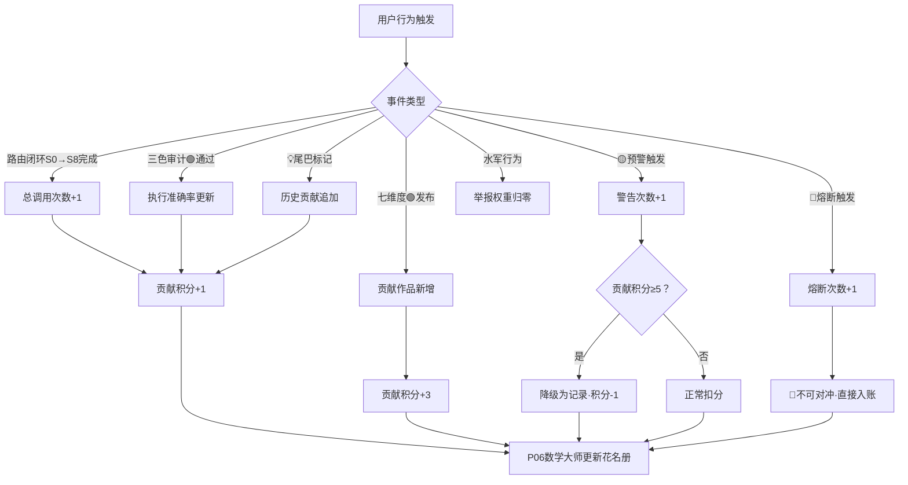
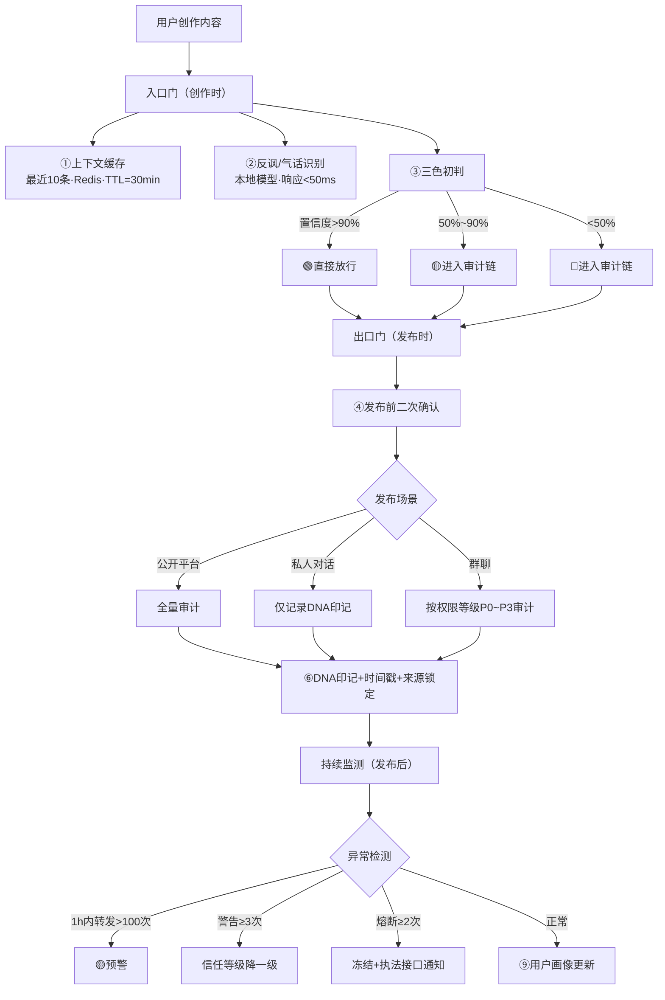
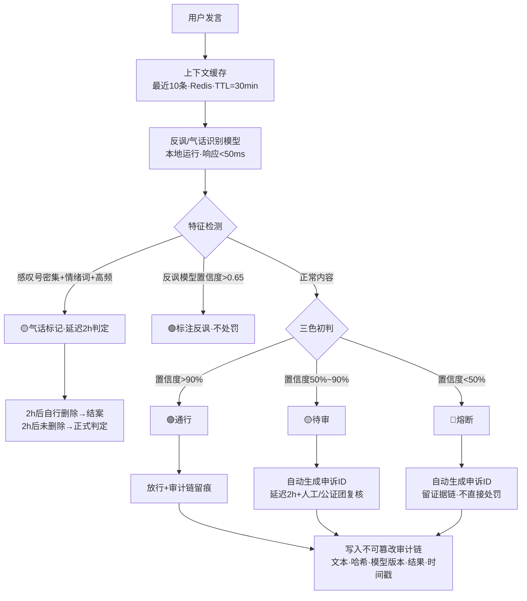

# 🛡️ 龍魂审核过滤系统 · 完整规则规格书 v2.0｜UID9622

> Notion URL: https://app.notion.com/p/v2-0-UID9622-de07d8f59abf4a2cb511b5bcc908a430
> Created: 2026-04-16T09:14:00.000Z
> Last edited: 2026-07-01T15:35:00.000Z
> Archived at: 2026-08-12T01:40:45.558086
---
## 🏗️ 第一层 · 系统总架构 — 三层联动闭环
```javascript
═══════════════ 龍魂审核过滤系统 · 三层联动架构 ═══════════════

┌─────────────────────────────────────────────────────────────┐
│  触发层（人格路由API）                                        │
│  ┌───────────┬────────────┬────────────┬──────────────┐     │
│  │ 发言事件  │ 路由闭环   │ 三色审计   │ 💡尾巴标记   │     │
│  │ 举报事件  │ 🟡预警     │ 🔴熔断     │ 发布事件     │     │
│  └───────────┴────────────┴────────────┴──────────────┘     │
│                        ↓ 事件信号                            │
└─────────────────────────────────────────────────────────────┘

┌─────────────────────────────────────────────────────────────┐
│  计算层（P06数学大师）                                        │
│  贡献值 = 总调用×40% + 准确率×30% + 信任等级×30%             │
│           - 警告×5 - 熔断×20                                 │
│  对冲规则：贡献积分≥5 → 可抵消1次警告（积分-1）               │
│  铁律：🔴熔断永远不可对冲                                    │
│                        ↓ 积分增减                            │
└─────────────────────────────────────────────────────────────┘

┌─────────────────────────────────────────────────────────────┐
│  存储层（花名册数据库）                                       │
│  路由编号 │ DNA追溯码 │ 贡献积分 │ 警告次数 │ 熔断次数        │
│  信任等级 │ 历史贡献  │ 执行准确率│ 贡献作品 │ 个人IP         │
└─────────────────────────────────────────────────────────────┘
```
---
## 🔴 第二层 · 触发规则总表
> ※ 所有触发事件均记录完整审计链：输入文本 · 上下文哈希 · 模型版本 · 判定结果 · 证据关键词 · 时间戳
### 📊 触发规则流程图（Mermaid）

---
## 🌐 第三层 · 网络检测机制
```javascript
═══════════════ 内容发布检测流程 ═══════════════

用户创作内容
↓
┌─ 入口门（创作时）──────────────────────────┐
│ ① 上下文缓存：最近10条消息（Redis, TTL=30min）│
│ ② 反讽/气话识别：本地小模型（响应<50ms）     │
│ ③ 三色初判：🟢通行 / 🟡待审 / 🔴熔断        │
└──────────────────────────────────────────────┘
↓ 🟢直接放行 / 🟡🔴 进入审计链
┌─ 出口门（发布时）──────────────────────────┐
│ ④ 发布前二次确认（🟡/🔴内容）               │
│ ⑤ 网络检测：公开→全量 / 私聊→仅记录 / 群聊→按权限等级 │
│ ⑥ 发布后追溯：DNA印记 + 时间戳 + 来源锁定   │
└──────────────────────────────────────────────┘
↓
┌─ 持续监测（发布后）─────────────────────────┐
│ ⑦ 异常传播：1h内>100次转发 → 🟡预警          │
│ ⑧ 积分累计：警告≥3次→降级 / 熔断≥2次→冻结  │
│ ⑨ 用户画像更新：行为模式自动归类             │
└──────────────────────────────────────────────┘
```
### 📊 内容发布检测流程图（Mermaid）

---
## 👤 第四层 · 用户画像系统 — 按国/户籍 · 记忆永生 · 陪伴保护
---
## 💎 第五层 · 知行积分联动参数
```javascript
// P06 贡献值公式（花名册字段）
贡献值 = 总调用次数 × 40%
       + 执行准确率 × 30%
       + 信任等级分值 × 30%
       - 警告次数 × 5
       - 熔断次数 × 20

// 对冲规则
IF 贡献积分 >= 5 AND 警告次数新增1
THEN 警告次数不扣分（降级为「记录不处罚」）
     贡献积分 -1
ELSE 正常扣分

// ⚠ 铁律：🔴熔断 → 永远不可对冲，无论积分多高
```
---
## 🟢🟡🔴 第六层 · 三色审计执行规则
```javascript
═══════════════ 三色审计判定流程 ═══════════════

用户发言 → 上下文缓存（最近10条 · Redis · TTL=30min）
↓
反讽/气话识别模型（本地 · <50ms）
↓
三色初判引擎
├─ 🟢 通行（置信度 > 90%）→ 放行 + 审计链留痕
├─ 🟡 待审（50% ~ 90%）  → 延迟2h + 人工/公证团复核
└─ 🔴 熔断（< 50%）      → 需证据链 + 可申诉
↓
全部写入审计链（不可篡改日志）
记录：文本·上下文哈希·模型版本·判定结果·证据·时间戳
```
### 📊 三色审计判定流程图（Mermaid）

---
## 🤖 第七层 · 水军识别系统
---
## ⚖️ 第八层 · 申诉与公证机制 — 可申诉是底线中的底线
---
## 🧠 第九层 · 记忆永生架构
```javascript
═══════════════ 记忆永生数据链 ═══════════════

每一次交互 → DNA印记 → 花名册存储 → 永久可追溯

四级检索优先级：
P0  DNA精确匹配  → 用追溯码直接定位
P1  标签匹配    → 按类型/方向/时间筛选
P2  语义检索    → FAISS向量相似度搜索
P3  模糊搜索    → 全文关键词兜底

存什么：
· 用户的爱好、习惯、表达风格 → 陪伴用
· 创作DNA、贡献记录          → 成就用
· 行为模式、情绪基线          → 保护用（异常关怀）
· 审计链、处罚/申诉记录       → 公正用

不存什么：
· 不存监控日志 → 我们不是监控者
· 不存与陪伴无关的隐私 → 最小必要原则
· 不存用于广告推送的数据 → 我们不卖数据
```
---
## 🔒 铁律总纲 · 不可违反 · 写死的规则
---
## 📊 附录A · 国产AI为什么比国外差 — 不是算力差，是不会分标签
---
## ⚓ 附录B · 不动点架构 — 万变不离其宗
---
## 💡 附录C · 闲聊智能标记系统 — Chat模式不浪费
---
🎨 三色审计：🟢 通过
DNA追溯：#龍芯⚡️2026-04-16-审核过滤系统规则规格书-v2.0
GPG：A2D0092CEE2E5BA87035600924C3704A8CC26D5F
确认码：#CONFIRM🌌9622-ONLY-ONCE🧬LK9X-772Z
