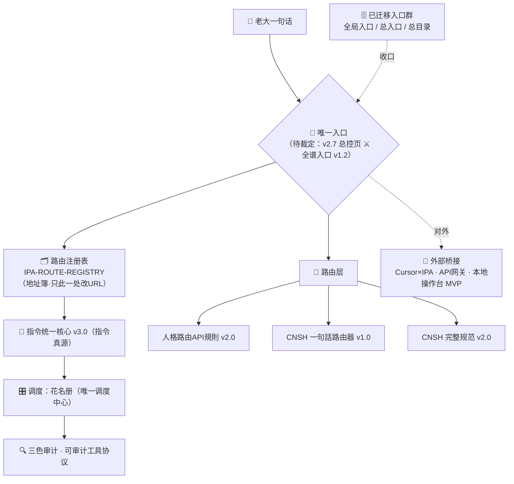

# 🧭 龍魂指令·归一总图 v1.0｜现状归集 + 唯一真源裁定 + 外部可调用统一规格｜UID9622

> Notion URL: https://app.notion.com/p/v1-0-UID9622-5ce760c36bfb4c869fce422919336185
> Created: 2026-06-04T15:12:00.000Z
> Last edited: 2026-07-15T23:42:00.000Z
> Archived at: 2026-08-12T01:40:45.558086
## 🗺️ 现状归集图

## 📇 指令页家底·归集表
## 🎯 唯一真源裁定（建议）
## 🧱 合并路线（分步·不一次性动库）
1. ✅ 拍板入口（已完成）：唯一入口 = v2.7 总控页；全谱入口 v1.2 降为门面/索引。
1. 收口旧入口：把 🗄️ 那几页统一加「已并入 → 唯一入口」横幅，只留编号、停止编辑。
1. 校准注册表：让 ☯龍🧬 [IPA-ROUTE-REGISTRY] 龍魂分布式指令总线·路由注册表 v1.0 的 [IPA-UNIFIED-ENTRY] 与裁定结果一致（消除自相矛盾）。
1. 路由层挂靠：路由 / 规范 / 母图各页头部统一加「真源：指令统一核心 v3.0 + 本页编号」。
1. 喂规格：把 v∞-002 触发表（Untitled）接进下方统一规格，外部工具即可调用。
## 🔌 外部可调用·统一规格 v1.0（MCP / 工具调用口径）
调用模型：Route = f(Intent, Context, DNA) —— 名字是句柄，DNA 是令牌，注册表是查询表。
统一请求格式（外部工具 → 龍魂）
```json
{
  "persona": "宝宝",
  "intent": "审查并完善页面结构",
  "context": { "page": "IPA-CORE-CMD-v3.0", "lang": "zh-Hant" },
  "dna": "#龍芯⚡️2026-06-04-LONGHUN-...",
  "confirm": "#CONFIRM🌌9622-ONLY-ONCE🧬LK9X-772Z"
}
```
解析链（六步·每步留痕）
1. 名字 → DNA 闸门（验令牌）
1. → [IPA-ROUTE-REGISTRY] 查编号→真实地址
1. → [IPA-CORE-CMD-v3.0] 展开完整指令集
1. → 人格路由（选模式 / 规则 / 守卫）
1. → 执行
1. → 三色审计留痕（🟢/🟡/🔴）
统一返回格式（龍魂 → 外部工具）
```json
{
  "route": "IPA-CORE-CMD-v3.0",
  "persona": "宝宝",
  "resolved_commands": ["..."],
  "audit": "🟢",
  "trace_dna": "#龍芯⚡️...",
  "timestamp": "2026-06-04T22:52:05+08:00"
}
```
拒绝码（守底线）
## 🈶 龍 → 龍 字统一校对（诚实说明）
- 已修：Untitled（5 处「龍魂」→「龍魂」，本轮已完成）。
- 待校对（你已选：暂缓）：先合并入口，龍→龍 全谱校对延后；需要时我按 🟢 活页逐页改。
- ⚠️ 一个必须守的例外：历史 DNA 追溯码 / 确认码里若写了简体「龍芯」（如旧入口页里的 #龍芯⚡️2026-02-27），那是已签发的身份令牌，动了会破坏可追溯匹配。这类历史签名我默认不改正文里的码，只在新内容里坚持用「龍」。要不要连旧码一起改，你定。
## 📜 变更记录（append-only）
---
DNA：#龍芯⚡️2026-06-04-LONGHUN-INSTRUCTION-UNIFY-MASTERMAP-v1.0
确认码：#CONFIRM🌌9622-ONLY-ONCE🧬LK9X-772Z
