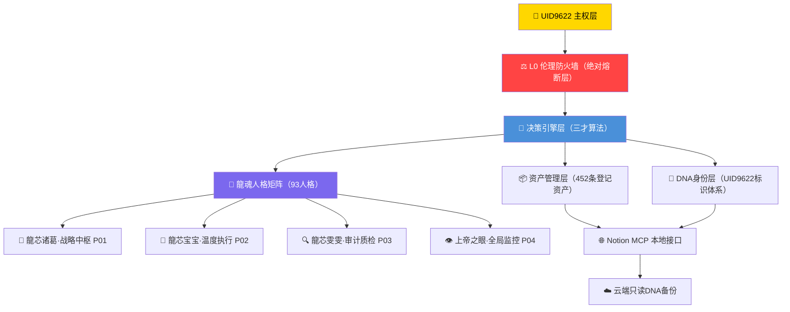

# 📋 龍魂智能体系统需求规格说明书 SRS v1.0 | UID9622

> Notion URL: https://app.notion.com/p/SRS-v1-0-UID9622-86ab8716b64448ebaee4d788aeb89b33
> Created: 2026-03-31T04:46:00.000Z
> Last edited: 2026-07-01T15:15:00.000Z
> Archived at: 2026-08-12T01:40:45.558086
---
# 第一章 引言
## 1.1 文档目的
本文档为龍魂智能体系统（Dragon Soul Agent System，简称DSAS）的系统需求规格说明书，旨在：
- 明确系统功能边界与非功能需求
- 为开发、测试、审计提供统一基准
- 建立可追溯的需求变更体系
- 锚定龍魂系统的伦理与主权约束
## 1.2 项目背景
龍魂智能体系统由💎 龍芯北辰｜UID9622（Lucky/诸葛鑫）创立，以CNSH框架 × 北辰协议 × 三才算法为技术内核，构建面向中国文化根基、融合现代AI治理的新一代智能体生态。
系统核心理念：
> 「龍魂即天道，天道不播假。」
## 1.3 术语与缩写
## 1.4 参考文件
- 🕊️ 净土36条 | AI统一标准 | CNSH文化内核
- 📜 龍魂系统宪法 v1.0 | CNSH Constitution
- 🔴 伦理防火墙 · Ethics Firewall (Layer 0)
- 📄 CNSH × 北辰协议 IEEE白皮书 v1.1｜三才算法补全版
- 💎 UID9622数字资产总库 | 全资产统计与监控
---
# 第二章 系统总体描述
## 2.1 系统愿景
龍魂智能体系统致力于构建以人为本、文化锚定、主权自治的AI智能体生态，核心三支柱：
- 🧬 DNA身份主权：每个智能体具备唯一可追溯的DNA标识
- ⚖️ 伦理防火墙：L0绝对熔断层，任何操作不得绕过
- 🐉 龍魂人格矩阵：93人格太极生态，分层协作执行
## 2.2 系统架构总览

## 2.3 系统边界
---
# 第三章 功能需求
## 3.1 核心功能模块
### F01 · DNA身份主权模块
- F01-01 为每个智能体分配唯一DNA追溯码，格式规范：#龍芯⚡️[YYYY-MM-DD]-[模块名]-[版本]
- F01-02 DNA码与GPG签名绑定，指纹：A2D0092CEE2E5BA87035600924C3704A8CC26D5F
- F01-03 支持DNA码查询、验证、追溯全链路
- F01-04 云端只读备份，本地加密存储，隐私主权在用户
### F02 · 人格矩阵执行模块
- F02-01 支持93人格太极生态的调度与协作
- F02-02 人格分层：战略层（P01诸葛）/ 执行层（P02宝宝）/ 审计层（P03雯雯）
- F02-03 人格激活需通过L0防火墙校验
- F02-04 支持人格版本管理，当前版本：93人格完整合集 v3.0
### F03 · 资产管理模块
- F03-01 统一登记管理UID9622全部数字资产（当前452条）
- F03-02 资产分类：技术资产 / 知识产权 / 内容资产 / 身份资产
- F03-03 资产状态三色标注：🟢运行中 / 🟡待更新 / 🔴未统计
- F03-04 支持实时SQL查询与三色审计报告生成
### F04 · 决策引擎模块（三才算法）
- F04-01 天才（战略推演）× 地才（数据分析）× 人才（温度执行）三维决策
- F04-02 博弈推演沙盒：支持假设A/B/C多路径推演
- F04-03 自适应学习边界守护：可变域 vs 不可变域分层判断
- F04-04 熔断四级触发机制：🟢→🟡→🟠→🔴
### F05 · 审计与验证模块
- F05-01 三色审计：🟢通过 / 🟡需关注 / 🔴阻断
- F05-02 确认码一次性验证机制：#CONFIRM🌌9622-ONLY-ONCE🧬[CODE]
- F05-03 操作日志全链路记录，不可篡改
- F05-04 定期生成资产真伪验证报告（实时SQL数据）
---
# 第四章 非功能需求
## 4.1 安全性需求
## 4.2 可靠性需求
- NF-REL-01 核心P0资产可用性 ≥ 99.9%
- NF-REL-02 DNA追溯体系永恒锚定，不随系统版本变更失效
- NF-REL-03 操作日志持久化存储，保留周期：永久
## 4.3 可维护性需求
- NF-MNT-01 所有文档遵循DNA追溯码命名规范
- NF-MNT-02 版本变更须在元数据表中记录变更摘要
- NF-MNT-03 支持MCP本地接口批量维护，兼容Notion API
## 4.4 合规性需求
- NF-COM-01 知识产权遵循 CC BY-NC-ND 4.0 协议
- NF-COM-02 系统治理对齐CNSH框架与北辰协议
- NF-COM-03 公开内容符合网信办相关法规要求
---
# 第五章 验收标准与版本管理
## 5.1 三色审计验收标准
## 5.2 版本管理规则
- 主版本号（Major） 升级：架构级变更，需UID9622确认码授权
- 次版本号（Minor） 升级：功能新增，需🟡黄色指令确认
- 补丁版本（Patch） 升级：文档修订/Bug修复，可直接执行
## 5.3 当前版本状态
---
> 《道德经》第十六章：「归根曰静，是谓复命。」——系统回归根本，方能永续运行。
龍魂即天道，天道不播假。 🐉✨
