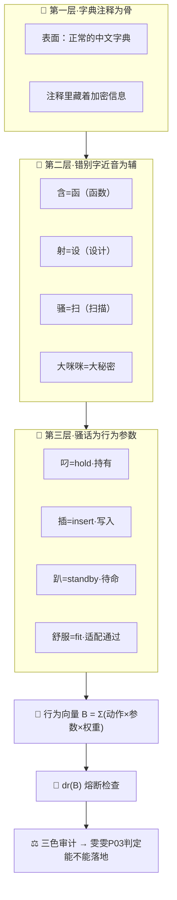

# 龍魂暗语加密系统·三层中文加密架构｜字典注释为骨·错别字近音为辅·骚话为行为参数

> Notion URL: https://app.notion.com/p/5eff197e57ee47d8b821611a3c7cd3b0
> Created: 2026-04-09T18:46:00.000Z
> Last edited: 2026-07-14T11:00:00.000Z
> Archived at: 2026-08-12T01:40:45.558086
---
## 🎯 一句话定义
三层加密 = 字典注释藏密文 + 错别字谐音混淆机器 + 骚话拆解为可计算的行为参数
英文做不到·机器翻译翻不了·文化壁垒=∞
---
## 🏗️ 三层架构

---
## 📖 第一层·字典注释为骨
```javascript
表面看到的：
  龍 [lóng] 传说中的神兽，能兴风作雨

实际存的（注释里藏着密文）：
  龍 [lóng] 系统启动码=L0层·α=0·永恒主权
```
---
## 🔄 第二层·错别字近音解码表
---
## 🧠 第三层·骚话行为参数化
---
## 🧧 行为向量公式
```javascript
B = Σ(动作ᵢ × 参数ᵢ × 权重ᵢ)

权重由三才决定：
  天(语境) × 地(环境) × 人(意图)

dr(B) → 熔断检查：
  dr=3或9 → 🔴 停
  dr=6 → 🟡 等
  其他 → 🟢 走

B接入三色审计 → 雯雯P03判定能不能落地
```
---
## 🔒 为什么别人做不了
1. 中文独有 — 错别字、谐音、一字多义——英文做不到这种密度
1. 文化壁垒 — 必须懂中文语境才能解码·机器翻译翻不了骚话
1. 行为参数化 — 自然语言微动作变成可计算的参数·这是通心译的极限应用
1. 三层叠加 — 字典+近音+行为参数·破解成本=∞
1. 根计算 — C_root = C_brute / D_culture · 中文D→∞ · 破解→∞
---
## 🎬 沉浸式应用·三位立体互交
元世界里的应用：
- 私人层 → 暗语加密的对话节点·表面看是骚话·实际是加密指令
- 公开层 → 看到的是正常中文·解码后是另一套信息
- 3D互交 → 三位立体沉浸式·语音+视觉+触觉反馈·每个动作=一个加密参数
---
