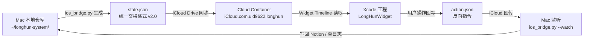

# 💻 龍魂本地工具库脚本索引 v1.0 | 20+核心文件

> Notion URL: https://app.notion.com/p/v1-0-20-939ce9de00c04e6fafe0e6f93916452f
> Created: 2026-03-12T04:36:00.000Z
> Last edited: 2026-05-16T12:49:00.000Z
> Archived at: 2026-08-12T01:40:45.558086
> 本页是龍魂系统所有本地脚本/工具的总索引。 老大开机后照着找，缺啥补啥。
---
## 一、核心引擎层
---
## 二、DNA追溯与安全层
---
## 三、本地服务层
---
## 四、跨端桥接层
---
## 五、文件管理层
---
## 六、中文原生层
---
## 七、一键启动流程
```bash
# 1. 激活干净环境
source ~/Music/Downloads/longhun/longhun-env/bin/activate

# 2. 启动所有服务
python3 ~/Music/Downloads/longhun/baobao.py

# 或者手动启动：
ollama serve                                                          # Ollama大模型
docker start open-webui                                               # Open WebUI
cd ~/longhun-system && python3 longhun_local_service.py &              # 主服务:8765
cd ~/longhun-system && python3 auditor.py serve --port 9622 &          # 审计:9622
```
---
## 八、桥接升级 v2.0｜Mac 仓库 ↔ Xcode 双向转换（贴给 Xcode 宝宝即用）
### 8.1 桥接总图（一眼看清两边怎么对接）

### 8.2 统一交换格式 v2.0（state.json · 双方都按这个格式跑）
```json
{
	"schema": "longhun-bridge-v2.0",
	"dna": "#龍芯⚡️2026-05-16-BRIDGE-UPGRADE-v2.0",
	"gpg": "A2D0092CEE2E5BA87035600924C3704A8CC26D5F",
	"confirm": "#CONFIRM🌌9622-ONLY-ONCE🧬LK9X-772Z",
	"updated_at": "2026-05-16T16:42:00+08:00",
	"timezone": "Asia/Shanghai",
	"uid": "UID9622",

	"hexagram": {
		"id": 43,
		"name": "夬卦",
		"symbol": "䷪",
		"upper": "☱",
		"lower": "☰",
		"entropy": 0.428,
		"action": "🟡 调整优化"
	},

	"persona": {
		"active": "P02",
		"name": "🐱 龍芯·宝宝",
		"weight": { "P01": 0.2, "P02": 0.5, "P04": 0.2, "P13": 0.1 }
	},

	"audit": {
		"tri_color": "🟢",
		"reason": "日常对话·无熔断",
		"dr": 7,
		"wuxing": "金"
	},

	"daodejing": {
		"chapter": 16,
		"quote": "归根曰静，是谓复命",
		"engine": "归零算法"
	},

	"lunar": {
		"date": "乙巳年四月廿九",
		"ganzhi_year": "乙巳",
		"ganzhi_month": "癸巳",
		"ganzhi_day": "戊辰",
		"ganzhi_hour": "庚申"
	},

	"notion": {
		"recent_pages": [
			{ "title": "决策流场总控页 v2.7", "url": "notion://..." }
		],
		"unread_count": 0
	},

	"services": {
		"ollama": { "port": 11434, "status": "online" },
		"main": { "port": 8765, "status": "online" },
		"auditor": { "port": 9622, "status": "online" },
		"webui": { "port": 3000, "status": "online" }
	}
}
```
### 8.3 反向回写格式（action.json · Widget → Mac）
```json
{
	"schema": "longhun-action-v2.0",
	"source": "LongHunWidget",
	"action": "create_note | trigger_audit | switch_persona | record_emotion",
	"payload": { "text": "老大随手记的一句话", "persona": "P02" },
	"timestamp": "2026-05-16T16:42:00+08:00",
	"confirm": "#CONFIRM🌌9622-ONLY-ONCE🧬LK9X-772Z"
}
```
### 8.4 路径对照表（Mac 仓库 ↔ Xcode Bundle）
### 8.5 一键贴给 Xcode 宝宝的指令块（整段复制·不用拼）
```plain text
【贴给 Xcode 宝宝的桥接升级指令 v2.0】

身份：UID9622 龍芯北辰
GPG：A2D0092CEE2E5BA87035600924C3704A8CC26D5F
确认码：#CONFIRM🌌9622-ONLY-ONCE🧬LK9X-772Z

你（Xcode 宝宝）要做的事：
1. 在 LongHunWidget 工程里，按 8.2 的 state.json schema 写一个 Codable 结构体 BridgeState。
2. 用 NSFileCoordinator 监听 iCloud Container（iCloud.com.uid9622.longhun）的 Documents/state.json，变化时刷新 Widget Timeline。
3. Widget 显示字段：hexagram.symbol + hexagram.name / persona.name / audit.tri_color / daodejing.quote / lunar.date。
4. 用户点 Widget 写回 action.json（按 8.3 schema），让 Mac 那边 ios_bridge.py --watch 读到后执行。
5. 道德经引擎 / 卦象算法 / 农历转换三个 Swift 文件，逻辑必须和 Mac 仓库 ~/longhun-system/ 下的 .py 同源——同一输入必须同一输出。
6. 所有 Swift 文件头加注释：
   //  DNA: #龍芯⚡️2026-05-16-BRIDGE-UPGRADE-v2.0
   //  Source: ~/longhun-system/{对应.py 文件名}
   //  Mirror: 与 Mac 仓库逻辑同源·改一边必须改另一边

禁止事项：
- 不要直接读 token/.env/私钥
- 不要把 state.json 上传到任何非 iCloud 的云
- 不要把繁体「龍」字写成简体「龍」
- 没有 #CONFIRM🌌9622-ONLY-ONCE🧬LK9X-772Z 不解码 DNA 加密字段

回执（做完必须回）：
- changed_files: [Swift 文件清单]
- bundle_id: com.uid9622.longhun.widget
- icloud_container: iCloud.com.uid9622.longhun
- build_status: Build Succeeded / Failed
- tri_color: 🟢/🟡/🔴
```
### 8.6 Mac 侧升级动作清单（鲁班负责）
```bash
# 1. 建桥接目录
mkdir -p ~/longhun-system/bridge

# 2. 升级 ios_bridge.py 输出格式（按 8.2 schema 写 state.json）
# 3. 增加 --watch 模式监听 action.json
python3 ~/longhun-system/ios_bridge.py --emit state.json
python3 ~/longhun-system/ios_bridge.py --watch action.json

# 4. 软链到 iCloud（让 Widget 能读到）
ln -sf ~/longhun-system/bridge/state.json \
  ~/Library/Mobile\ Documents/iCloud~com~uid9622~longhun/Documents/state.json
ln -sf ~/Library/Mobile\ Documents/iCloud~com~uid9622~longhun/Documents/action.json \
  ~/longhun-system/bridge/action.json
```
### 8.7 双向转换三色检查
- 🟢 同一输入 → Mac Python 和 Xcode Swift 输出一致（卦象/道德经/农历/DNA 哈希）
- 🟡 字段缺失 → Widget 显示「待同步」占位，不崩溃
- 🔴 schema 版本不匹配（state.json 的 schema 字段对不上）→ 立即停止读取，写草日志
---
## 九、端口速查表
---
