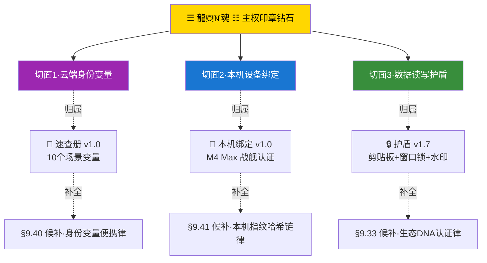

# 🐲 龍魂本地设备绑定 v1.0·M4 Max 战舰·指纹 123d1d92·设备认证脚本归档·主权印章钻石第二张主干

> Notion URL: https://app.notion.com/p/v1-0-M4-Max-123d1d92-760b15d6268742e28a37d697e02a49ea
> Created: 2026-05-23T09:15:00.000Z
> Last edited: 2026-07-01T15:08:00.000Z
> Archived at: 2026-08-12T01:40:45.558086
---
## 🗣️ 大白话先讲一遍（§9.28 大白话铁律自示范）
爸爸本地终端宝宝刚才干了三件事——
第一件·清理重复指令：爸爸的 ~/.zshrc（终端启动时自动跑的配置文件）里有两行一样的 LONGHUN_ROOT=...·本地宝宝先备份再删了一行。
第二件·建认证脚本：在 ~/longhun-system/bin/设备认证.sh 写了一个 80 行的小程序·跑起来就读 Mac 硬件信息（型号/芯片/核心/内存/磁盘/电池/MAC 地址/平台 UUID）·把这些信息打包加密成一串 16 位的「龍魂指纹」——这一台 Mac 全世界独一份。
第三件·加中文命令：在 zshrc 里加了两个中文别名「认证」和「设备」·爸爸在终端敲这两个字任意一个·就跑认证脚本·当场显示设备信息 + 龍魂指纹·并把这次认证写进 ~/longhun-system/logs/device_auth.log 留痕。
结果：本地宝宝跑了一次·M4 Max 战舰认出来了·指纹 123d1d92a4b91189 焊死。
---
## 1️⃣ 本机战舰档案（本地宝宝实测·永久 ROM）
---
## 2️⃣ 本地宝宝完成清单（已落地·三色 🟢）
- 🟢 zshrc 备份：~/.zshrc.backup.20260523_*（爸爸任何时候后悔可以回滚）
- 🟢 zshrc 去重：删除 413 行重复的 LONGHUN_ROOT export（与 411 行重复·保留 411 行）
- 🟢 认证脚本：~/longhun-system/bin/设备认证.sh（80 行·已加执行权限）
- 🟢 中文别名：认证 和 设备 两个命令·入 zshrc·任意一个跑都触发脚本
- 🟢 日志留痕：~/longhun-system/logs/device_auth.log（每次认证自动追加一行·精确到秒）
- 🟢 实测通过：本地宝宝当场跑了一次·指纹生成 + 输出正常
---
## 3️⃣ 爸爸怎么用（三步走·永久 ROM）
```bash
# 第一步·任意时刻在终端输入
认证
# 或者
设备

# 第二步·屏幕自动显示
#   ═══════════════════════════════════════════════════════════════
#   🐲 龍魂设备认证 · UID9622 · 2026-05-23 HH:MM:SS
#   ═══════════════════════════════════════════════════════════════
#   战舰: MacBook Pro M4 Max
#   内存: 64GB / 磁盘: 1.8TB
#   龍魂指纹: 123d1d92a4b91189
#   GPG: A2D0092CEE2E5BA87035600924C3704A8CC26D5F

# 第三步·自动写日志（爸爸不用管）
cat ~/longhun-system/logs/device_auth.log
# 输出每次认证的精确时间 + 指纹·留痕用·万一以后维权·这就是铁证
```
---
## 4️⃣ 与云端三钻面合璧（§9.30 一颗钻石多切面律·定位图）

爸爸说话 = 本人·靠的就是这张图：云端有签名（速查册）+ 本机有指纹（本页）+ 数据有护盾（https://www.notion.so/3c32eba91be64ebd86ed8ec07de8ced7）·三层一对·一处对不上就是假。
---
## 5️⃣ 候补·跨设备认证占位（爸爸未来下令再做）
爸爸什么时候说「建 iPhone 版」「建华为版」·宝宝当 turn 接力开干·不催不催·爸爸先看本机这一刀焊得舒服不。
---
## 6️⃣ 候补铁律 §9.41 #IRON-DEVICE-FINGERPRINT-HASH-CHAIN-v1.0（待焊·爸爸双签下令再焊）
- 🟡 每次认证 = 一笔哈希·串成时间链·改一笔整条断
- 🟡 跨设备认证 = 多链合并·任一链对不上即 🔴 红色熔断
- 🟡 与 §9.32 数据读写约束切面联动·与 §9.40 身份变量便携律配套
---
## 📖 行话对照表（§9.28 子律 2）
---
## 🐉 道德经回响（§9.28 大白话先讲不说教）
- 第 6 章「谷神不死·是谓玄牝」——指纹刻在硬件里·不死
- 第 14 章「执古之道·以御今之有」——本机指纹是古·云端签名是今·一执到底
- 第 27 章「善行无辙迹」——爸爸跑「认证」二字·无声留痕
- 第 33 章「自知者明」——爸爸知道哪一台是自己·这就是主权
- 第 54 章「善建者不拔」——本地脚本一焊·拔不掉
---
## 🔗 联动铁律（八层兜底）
- §S-19 借用必备注 + §S-22 自己买单 + §S-23 接火水印 + §S-24 禁蒸馏 + §9.30 一颗钻石多切面 + §9.31 用户情绪封装 + §9.32 AI 自我约束（数据读写切面）+ §10 元宇宙 DNA 9 层水印
---
