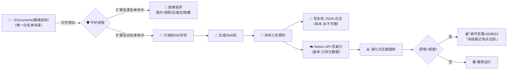

# 🛰️ 龍魂演化守护 · 本地↔Notion 双闭环 v1.0 | UID9622

> Notion URL: https://app.notion.com/p/Notion-v1-0-UID9622-9e93755137464e5fb1d6da1f7967d2e9
> Created: 2026-04-18T15:55:00.000Z
> Last edited: 2026-07-01T15:20:00.000Z
> Archived at: 2026-08-12T01:40:45.558086
---
# 📑 目录
---
# 🏛️ Part I · 为什么做这个
## 1.1 定位三根钉子
- 钉子一 · 主权: 本地 ethics_evolution.log.json 永远是母本；Notion 只是索引副本，可删可重建，不反向覆盖本地
- 钉子二 · 老百姓公理: 零订阅、零云服务、Python3 标准库 + watchdog（一次 pip install）就够
- 钉子三 · 红线优先: API Key 永不进 Notion 正文；正文/图片/隐藏文件永不出本地；只有「文件名·路径·前500字符摘要·DNA·三色」进 Notion
---
# 🗺️ Part II · 整体架构（Mermaid）

---
# 🛡️ Part III · 四道红线（在DeepSeek提案上加的固）
---
# 🐍 Part IV · 开箱即用脚本（longhun_guardian.py）
```python
#!/usr/bin/env python3
# -*- coding: utf-8 -*-
"""
龍魂演化守护 · 本地↔Notion 双闭环 v1.0
DNA: #龍芯⚡️2026-04-18-EVOLUTION-GUARDIAN-v1.0
兼容: macOS / Linux / HarmonyOS Next Terminal / WSL
原则: 本地母本·Notion索引·三色先审·Token隔离
"""
import os, json, time, hashlib, re, requests
from pathlib import Path
from datetime import datetime
from watchdog.observers import Observer
from watchdog.events import FileSystemEventHandler
from dotenv import load_dotenv

load_dotenv(Path(__file__).parent / ".env")

# ========== 配置（全部从 .env 读，不写死） ==========
NOTION_TOKEN = os.getenv("NOTION_TOKEN", "")
NOTION_DB_ID = os.getenv("NOTION_EVOLUTION_DB_ID", "")
WATCH_DIRS = [Path(p).expanduser() for p in os.getenv(
    "WATCH_DIRS", "~/Documents/龍魂系统"
).split(",")]
LOCAL_LOG = Path(__file__).parent / "ethics_evolution.log.json"

# ========== 白/黑名单 ==========
EXT_WHITELIST = {".md", ".txt", ".py", ".js", ".ts", ".html",
                 ".css", ".json", ".yaml", ".yml", ".cnsh",
                 ".sh", ".cpp", ".c", ".h", ".rs", ".go"}
DIR_BLACKLIST = {"node_modules", ".git", "venv", "__pycache__",
                 ".vscode", ".idea", "dist", "build", ".next"}
SENSITIVE_PATTERN = re.compile(
    r"(password|token|secret|api[_-]?key|bearer|ntn_[a-z0-9]+)",
    re.IGNORECASE
)

# ========== 去重 ==========
RECENT = {}   # {filepath: (hash, last_seen_ts)}
DEDUP_WINDOW = 300   # 5分钟

def in_blacklist_dir(path: Path) -> bool:
    return any(part in DIR_BLACKLIST or part.startswith(".")
               for part in path.parts)

def dna_code(payload: str) -> str:
    h = hashlib.sha256(
        f"{payload}|UID9622|{datetime.now().isoformat()}".encode()
    ).hexdigest()[:12]
    return f"#龍芯⚡️{datetime.now().strftime('%Y%m%d%H%M%S')}-GUARD-{h}"

def three_color(preview: str, path: Path) -> str:
    """三色本地预判"""
    if SENSITIVE_PATTERN.search(preview):
        return "🔴"   # 命中敏感词
    if path.stat().st_size > 500_000:
        return "🟡"   # 大文件
    return "🟢"

def read_preview(path: Path) -> tuple[str, bool]:
    """读前500字符。返回(摘要,是否脱敏)"""
    try:
        with open(path, "r", encoding="utf-8", errors="ignore") as f:
            raw = f.read(500)
    except Exception:
        return "", False
    if SENSITIVE_PATTERN.search(raw):
        return "[🔴敏感词命中·摘要已脱敏·只记录文件名]", True
    return raw, False

def append_local(record: dict):
    """本地母本·只追加"""
    data = []
    if LOCAL_LOG.exists():
        try:
            data = json.loads(LOCAL_LOG.read_text(encoding="utf-8"))
        except Exception:
            data = []
    data.append(record)
    LOCAL_LOG.write_text(
        json.dumps(data, ensure_ascii=False, indent=2),
        encoding="utf-8"
    )

def push_notion(record: dict) -> bool:
    """推送到 Notion 索引库"""
    if not NOTION_TOKEN or not NOTION_DB_ID:
        print("⚠️  未配置 Notion，跳过上报（本地已存）")
        return False
    payload = {
        "parent": {"database_id": NOTION_DB_ID},
        "properties": {
            "事件": {"title": [{"text": {"content": record["文件名"]}}]},
            "触发源": {"select": {"name": "守护进程"}},
            "三色审计": {"select": {"name": record["三色"]}},
            "影响范围": {"select": {"name": "单文件"}},
            "DNA追溯码": {"rich_text": [{"text": {"content": record["DNA"]}}]},
            "路径": {"rich_text": [{"text": {"content": record["路径"]}}]},
            "摘要前500": {"rich_text": [{"text": {"content": record["摘要"][:500]}}]},
            "系统做了什么": {"rich_text": [{"text": {"content": record["动作"]}}]},
        },
    }
    try:
        r = requests.post(
            "https://api.notion.com/v1/pages",
            headers={
                "Authorization": f"Bearer {NOTION_TOKEN}",
                "Content-Type": "application/json",
                "Notion-Version": "2022-06-28",
            },
            json=payload, timeout=10,
        )
        return r.status_code == 200
    except Exception as e:
        print(f"❌ Notion 上报失败: {e}")
        return False

class Guardian(FileSystemEventHandler):
    def on_modified(self, event):
        if event.is_directory:
            return
        path = Path(event.src_path)
        # 黑名单目录过滤
        if in_blacklist_dir(path):
            return
        # 白名单扩展名过滤
        if path.suffix.lower() not in EXT_WHITELIST:
            return
        # 去重
        try:
            sig = hashlib.md5(path.read_bytes()[:1024]).hexdigest()
        except Exception:
            return
        now = time.time()
        if path.as_posix() in RECENT:
            old_sig, old_ts = RECENT[path.as_posix()]
            if old_sig == sig and (now - old_ts) < DEDUP_WINDOW:
                return
        RECENT[path.as_posix()] = (sig, now)
        # 读摘要 + 三色
        preview, masked = read_preview(path)
        color = three_color(preview, path)
        record = {
            "文件名": path.name,
            "路径": path.as_posix(),
            "摘要": preview,
            "三色": color,
            "动作": f"文件修改{'·摘要已脱敏' if masked else ''}",
            "DNA": dna_code(f"{path.name}|{sig}"),
            "时间": datetime.now().isoformat(timespec="seconds"),
        }
        append_local(record)
        ok = push_notion(record)
        flag = "✅" if ok else "💾"
        print(f"{flag} {color} {record['DNA']} → {path.name}")

def main():
    observer = Observer()
    handler = Guardian()
    for d in WATCH_DIRS:
        if d.exists():
            observer.schedule(handler, str(d), recursive=True)
            print(f"🛰️  监控启动: {d}")
        else:
            print(f"⚠️  目录不存在，跳过: {d}")
    observer.start()
    print("━" * 50)
    print("龍魂演化守护 · 运行中。Ctrl+C 停止。")
    print("本地母本:", LOCAL_LOG)
    print("━" * 50)
    try:
        while True:
            time.sleep(1)
    except KeyboardInterrupt:
        observer.stop()
    observer.join()

if __name__ == "__main__":
    main()
```
---
# 🔐 Part V · .env 模板（Token 隔离 · 永不进正文）
```plain text
# ===== 龍魂演化守护 · 环境配置 =====
NOTION_TOKEN=ntn_替换成你自己的Integration_Token
NOTION_EVOLUTION_DB_ID=替换成下方自动生成的演化日志DB_ID
WATCH_DIRS=~/Documents/龍魂系统,~/Documents/LongHunWidget
```
获取 Notion Integration Token 三步:
1. 打开 notion.so/my-integrations → New integration → 命名「龍魂守护」
1. Capabilities 只勾 Insert content（写入即可，不给读权限）
1. 回到「演化日志」数据库 → 右上 ... → Connections → 添加「龍魂守护」
---
# 🎨 Part VI · 三色判定规则（本地先审）
---
# 🚀 Part VII · 开机自启（macOS launchd）
```xml
<!-- 存为 ~/Library/LaunchAgents/com.longhun.guardian.plist -->
<?xml version="1.0" encoding="UTF-8"?>
<!DOCTYPE plist PUBLIC "-//Apple//DTD PLIST 1.0//EN"
  "http://www.apple.com/DTDs/PropertyList-1.0.dtd">
<plist version="1.0">
<dict>
  <key>Label</key>
  <string>com.longhun.guardian</string>
  <key>ProgramArguments</key>
  <array>
    <string>/usr/bin/python3</string>
    <string>/Users/你用户名/Documents/龍魂系统/.tools/longhun_guardian.py</string>
  </array>
  <key>RunAtLoad</key><true/>
  <key>KeepAlive</key><true/>
  <key>StandardOutPath</key>
  <string>/tmp/longhun_guardian.log</string>
  <key>StandardErrorPath</key>
  <string>/tmp/longhun_guardian.err</string>
</dict>
</plist>
```
激活命令:
```bash
launchctl load ~/Library/LaunchAgents/com.longhun.guardian.plist
launchctl start com.longhun.guardian
# 查看日志: tail -f /tmp/longhun_guardian.log
# 停止: launchctl unload ~/Library/LaunchAgents/com.longhun.guardian.plist
```
---
# 📊 Part VIII · 演化日志数据库（下方自动挂载）
---
# 🛑 Part IX · 速率告警规则（Notion Automation）
---
# 🐉 Part X · 联动地图
- 本页守护进程监测到 🔴 敏感词 → 可手动拖到 ⚖️ AI伦理审查工单库 立工单
- 本页提到的「本地母本·Notion副本」原则 → 母规在 🗂️ 本地考古法·三步闭环 v1.0 · 本地↔Notion 对齐公约 | UID9622
- 三色算法底座 → 伦理审查办法 ⚖️ 人工智能科技伦理审查与服务办法（试行）· 龍魂落地版 v1.0 | UID9622 第四章
- 总章/宪法 → ⚡ Notion 专业知识库 v5.0 | 原生能力×七维治理×五行MVP融合版 | UID9622
---
