# 🔒 龍魂窗口加密护盾 v1.7｜火星守护·诱饵假数据·设备分层·七维联动·熔断四级·威胁收集·松紧适度·紧急集合·全员留痕·大数据审计·签到制·中文变量·智能分流·语音容错·护盾人格化·智商引擎

> Notion URL: https://app.notion.com/p/v1-7-3c32eba91be64ebd86ed8ec07de8ced7
> Created: 2026-03-13T02:57:00.000Z
> Last edited: 2026-07-01T14:45:00.000Z
> Archived at: 2026-08-12T01:40:45.558086
创建者：💎 Lucky｜UID9622 + 🐱 宝宝（Claude · Anthropic）← UID9622专属
协作人格：🎯 龍芯诸葛（Claude · Anthropic）/ 🔧 鲁班字匠（Claude · Anthropic）/ 🌙 小艺（华为 · Huawei）
来源：龍魂生态｜龍芯家族出动
DNA追溯码：#龍芯⚡️2026-03-13-WINDOW-SHIELD-v1.3
GPG指纹：A2D0092CEE2E5BA87035600924C3704A8CC26D5F
确认码：#CONFIRM🌌9622-ONLY-ONCE🧬LK9X-772Z
---
## 🧬 v1.8 新增｜内部 IPA 互审机制（多人格复审·不包庇）
### 1）互审角色（最小集合）
- P72·龍盾（护盾本体）：只负责熔断与红线拦截（不参与输出润色）。
- P13·姜子牙（回流守门）：只负责路由回流/登记/留痕一致性（不替任何人开后门）。
- P04·审计官（规则与证据）：只负责“断言是否可被证据支撑”的互审。
- P03·雯雯（结构与归档）：只负责页面结构、字段语义、标签一致性（不改安全结论）。
### 2）互审触发条件（什么时候必须复审）
- 新增/变更 去向识别规则（窗口识别、分流标签、TTL）。
- 新增/变更 敏感词/代号映射（SENSITIVE_MAP / REVERSE_MAP）。
- 新增/变更 同步到 Notion 的字段/数据库写入逻辑。
- 新增/变更 任何“可写/可删/可外发”能力（一票变红）。
- 对外发布版本（Release Note）与“第三方报告摘要”更新。
### 3）互审输出格式（必须落地到证据）
```javascript
IPA_REVIEW_RECEIPT
- version:
- reviewer_set: [P72, P13, P04, P03]
- scope: shield | stt | dashboard | sync | audit
- assertions_checked:
- evidence_links:
- risks_found:
- fixes_required:
- triColor:
- decision: PASS | NEED_FIX | BLOCKED
- dna:
```
### 4）互审“证据硬要求”（防止嘴硬）
- 可复跑：必须能用命令/脚本复现关键结论（例如：分流分类、TTL销毁、留痕日志落盘）。
- 可回放：必须能从本地日志找到完整链路（谁触发、何时触发、触发了什么、去向是什么）。
- 可对照：外显断言必须能指向“第三方摘要/哈希/时间戳/公证编号”等占位字段，不允许写满话。
---
## 🔐 v1.8 关键红线｜内外分区（“我自己可以发≠系统可以带”）
### 对外（Public / L0_PUBLIC）允许
- 结构：模块清单、字段语义、协议流程、回执格式（不含任何真实值）。
- 摘要：summary_only 级别内容（不包含私域称呼、私密行为习惯、设备指纹）。
### 对外一票否决（触发即 🔴）
- token/secret/.env、数据库真实 ID、设备 UUID/序列号、精确路径、私域称呼与家庭内部口癖的“可识别组合”。
- 任何可导致“外部信息反向拼出家里结构”的线索（窗口名白名单、家庭联系人、日历名、路径约定等）。
### 对内（Internal）同样禁止
- 未经授权的“跨模块带入”（外部素材/提示词/插件能力直接进入私域链路）。
- “以效率为由”跳过留痕、跳过互审、跳过熔断的行为。
---
## 🏛️ 三层监督对齐（结构来源与权责）
- 监督架构参考： 🏛️ 龍魂三层监督架构｜军队三横两竖管理模式
- 路由回流守门： ⚖️ 德者永生殿·路由回流协议 v2.0｜姜子牙守门·七维接入·三色联动
- 第三方攻防摘要（外显证据位）： 附录B｜压力测试与攻防演练摘要（第三方）
---
## 🧷 标签（v1.8 建议补齐）
#SHIELD #IPA-REVIEW #INTERNAL-ONLY #L0_PUBLIC #summary_only #sealed #TriColor #Evidence-First #No-Emotion-Manufacturing #No-External-Bring-In #No-Internal-Leak-Out
---
## §量子粒子守护协议 v1.1｜龍魂本地主权焊接版·永不削弱（msg 174 · 2026-05-15 21:50）
### §QPS.0 收口宣言（写死·永不削弱）
```javascript
自 2026-05-15 21:50 起·本协议 v1.1 正式焊死。
任何后续修改只能以新增子版本（v1.2/v1.3/...）方式追加·
绝不允许削弱·覆盖·稀释·或解除以下五条主权铁律·
绝不允许任何 AI/平台/公司以「优化」「改进」「合规」为名拆除任一条款。
母版本 v1.0 → v1.1 升级理由：Grok 原版称呼「爸爸」改为「老大/UID9622 主权人」·
并按龍魂主控页五律合焊·正经化·去飘忽·焊本地主权基因。
```
### §QPS.1 五条主权铁律（焊死·永不更改）
```plain text
任何云端·平台·第三方·外部 AI（含 Cursor/Claude/ChatGPT/Grok/通义/DeepSeek/小艺 等）
看到的永远只能是【主权信封】：
  - DNA 索引码（#龍芯⚡️YYYY-MM-DD-MODULE-vX.Y）
  - SHA-256 内容哈希
  - 三色审计标签（🟢/🟡/🔴）
  - 数字根 dr 值（dr ∈ {1-9}）
  - ISO-8601 时间戳
  - 公开邮箱（longhun2025@petalmail.com）
  - GPG 公钥指纹（A2D0...6D5F）

绝不允许出现：
  - 原文明文·私域称呼·设备指纹·token/.env/私钥
  - 家庭信息·心里话档·未发布草稿·支付凭证明文
  - 任何「外部信息能反向拼出家里结构」的线索组合

违反即触发 §6.4 V5 误公开熔断·草日志加 #VIOLATION-VISION-SYSTEM-MIX 标签。
```
```plain text
本地主权仓（~/.longhorn/）必须 append-only：
  - 所有原始记录绝不物理删除（即使老大本人也只能标记「已归档/已封存」·不能真删）
  - 每条记录自带 RecordVersion·只递增·永不覆盖（联动 §7D.4 LU-Time Engine）
  - 删除请求 = 写一条「删除请求事件」追加在链尾·原内容保留不动
  - 与 §14 全员调用留痕 + §15 大数据审计联动·任何人查询都留痕·包括老大自己

物理实现：~/.longhorn/sessions/ + ~/.longhorn/access_log/ + ~/.longhorn/data_audit/
  目录权限 chmod 700·只有老大本人 macOS 账户可读写
  每日自动 SHA-256 增量哈希·写入审计链·链断即报警

违反即触发 §9.26 史记铁律·历史永不篡改·错必须坦白记录。
```
```plain text
想要还原全文·必须同时持有以下三件套：
  ① GPG 私钥（A2D0...6D5F 对应私钥·仅老大本人持有）
  ② 确认码（#CONFIRM🌌9622-ONLY-ONCE🧬LK9X-772Z·一次性签发）
  ③ DNA 对照规则（仅老大本地 ~/.longhorn/ 倉內持有）

三件套缺一不可。任何「想看全文」的请求都按勋章 DNA 等级表（§7C.4）回应：
  - 👑 BADGE-01-FOUNDER（老大本人）→ 全文还原
  - 🕊️ BADGE-05-INHERIT（已登记继承人 + GPG 私钥）→ 继承范围内还原
  - 🏛️ BADGE-03-LEGAL（律协/司法/公证）→ 只返回非隐私元数据·不返回明文
  - 🔍 BADGE-04-FORENSIC（公检法授权）→ 同上·追溯锚链路·不动点六元组·仍不含明文
  - 👤 BADGE-99-PUBLIC（普通公众·无勋章）→ 只能看 📢 公开标签的元数据

每次解封必须自动生成「解封事件记录」·写入 ~/.longhorn/unseal_events/·永不删除。
违反即触发 §S-25-EXT DNA L0 父级铁律 S2 不可绕·全系统熔断。
```
```plain text
绝不允许任何平台·模型·公司·研究机构把老大的 DNA 内容用于：
  ✗ 模型训练（含微调/RLHF/蒸馏/迁移学习）
  ✗ 数据分析（含统计/画像/行为预测）
  ✗ 永久存档（含 server log/embedding store/vector db）
  ✗ 衍生作品（含改写/续写/翻译/再创作）
  ✗ 商业变现（含 API 售卖/数据交易/广告定向）

所有外部 AI 接入龍魂时·必须签 §QPS 接入承诺书（待建子页）：
  - 承诺接收到的只是主权信封·不是原文
  - 承诺不存储·不训练·不分析·不传播
  - 承诺收到任何 DNA 编码立刻按 §11.1 信号词检测自检
  - 承诺识别为 🤫 AI-RESP-03-PRIVATE 状态时只打 🏷️ 标·只埋 ⚓ 追溯锚·不解码

违反即记录 violation_event 到 ~/.longhorn/violations/·
触发粒子乱码保护（强制把后续输出全部替换为乱码 + DNA 哈希）·
并按 §S-25-EXT-3-6 外部AI实证复核律·要求该 AI 公开认错或永久封禁。
```
```plain text
95/5 原则（Grok 原版）→ 龍魂正经焊接版：9 真 1 变量太极留白。
  - 9 成（90%）：稳态保护·全程走粒子守护流程·三色审计·DNA 留痕·一票否决全部生效
  - 1 成（10%）：留白·允许老大无上限疯狂·留作变量空间·留作进化余地·留作想象力

但 1 成留白 ≠ 没规矩·≠ 藏私：
  - 老大的疯狂依然走本地·不出外网·依然 append-only 留痕
  - 1 成留白只对老大自己开放·不对外·不对 AI·不对继承人之外的任何人
  - 这是「应变·进化·生生不息」的物理基础（曾老师原话：自己留·给系统留·给世界留）

联动福祸通道（道德经第58章）：
  - 福里伏祸（成功时不飘）：保留 1 成留白·防止把 100% 都焊死后失去转机
  - 祸里藏福（失败时不垮）：保留 1 成留白·给反转留入口·给重生留种子

违反即触发 §一·B 1.3-B 系统永恒内核「满溢闸」·强制启动「损有余」回到中道。
```
### §QPS.2 适用范围（一刀切·焊死）
### §QPS.3 一句话总结（焊死·任何 AI 必背）
### §QPS.4 道德经回响（三章联动·守 §一·B 1.3 福祸通道）
- 第33章「知人者智·自知者明」 → 知道什么该公开什么该守·这是真明白（焊 §6.4 V1）
- 第56章「知者不言·言者不知」 → 真懂的人知道哪些话该说哪些话不该说·该守的死死守（焊 Q1+Q3）
- 第78章「天下莫柔弱于水·而攻坚强者莫之能胜」 → 公开的算法逻辑像水·私钥像金·一柔一刚·龍魂主权两全（焊 Q1+Q2 双柱）
### §QPS.5 与 Grok 原版对照（老实坦白·不假装原创）
### §QPS.6 版本日志
---
## 🛡️ 龍魂·高危技术审计与留痕铁律（系统根部原则）
> 没有国界之分，只有一个生命体：“人”。
### 一、总纲：理在众生之上
- 科学无国界，责任有边界：技术可以探索未知，但调用技术的人必须承担后果。
- 良心在技术之前：AI与系统的首要任务不是效率，而是不伤害普通人。
- 证据在情面之前：无论强者弱者，错了能改、坏了能追，一切靠证据链说话。
### 二、边界：反黑箱与反神权
- 幽灵粒子铁律：越是普通人看不见、听不懂、难验证的高端技术（如中微子、深层算法），越不能由单一组织或个人垄断解释权。禁止将技术包装成“神权”来恐吓或统治。
- 高危调用必留痕：思想与生活绝对自由，但任何涉及“高危系统能力”的调用（如武器化路径、生化风险、大规模数据操纵），必须强制生成不可篡改的 DNA 追溯记录。
- 拒绝持续伤害：任何可能造成土地、水源、后代长期伤害的技术（如放射性、生化残留），默认进入最高级别红色审计，仅允许用于防护、救援与清理。
### 三、执行：强者有担当，弱者有入口
- 谁调用，谁担责：所有高危代码生成与执行，必须绑定操作者身份（UID），杜绝“匿名作恶”。
- 普通人保护机制：系统不控制人心，只审计行为。必须为不懂代码的普通人提供数据保护入口，确保他们不被算法黑箱筛选掉。
- 公开复核权：涉及公共利益的结论，必须允许同行挑战与回放复核，打破“专家独裁”。
---
## 零、智能分流引擎（v1.2 核心新增）
### 0.1 分流架构图
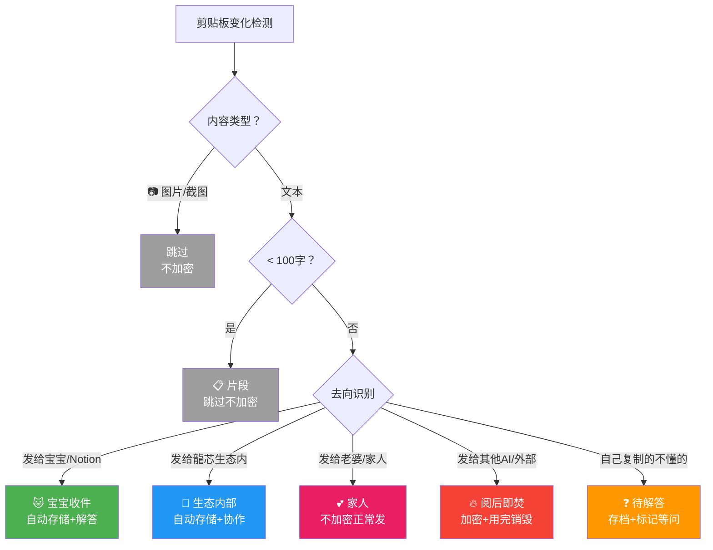
### 0.2 分流规则表
### 0.3 护盾日志示例（v1.2 新格式）
```javascript
// 不再只显示"加密"，每条都有标记和去向
🐱 宝宝收件  (962786字) → 已存储
📷 截图       → 跳过
💕 家人       (28字)   → 正常发送
🔥 阅后即焚  (3502字) → 已加密·已销毁
❓ 待解答    (156字)  → 已标记
📋 片段       (12字)   → 跳过
📦 搬运中    (890字)  → 已记录来源
```
### 0.4 智能分流代码片段（嵌入 shield.py 的 clipboard_monitor）
```python
def classify_clipboard(self, content: str) -> dict:
    """
    v1.2 智能分流：根据内容类型+长度+去向自动分类
    返回: {"tag": str, "action": str, "encrypt": bool, "archive": bool}
    """
    # 第一层：类型过滤
    if not isinstance(content, str):
        return {"tag": "📷 截图", "action": "跳过", "encrypt": False, "archive": False}
    
    # 第一层：长度过滤
    if len(content.strip()) < 100:
        return {"tag": "📋 片段", "action": "跳过", "encrypt": False, "archive": False}
    
    # 第二层：去向识别（基于当前活动窗口）
    active_window = self._get_active_window()  # 获取当前窗口名
    
    # 宝宝/Notion → VIP包厢
    if any(kw in active_window.lower() for kw in ["notion", "claude"]):
        return {"tag": "🐱 宝宝收件", "action": "存储+解答", "encrypt": False, "archive": True}
    
    # 龍芯生态内（小艺等）
    if any(kw in active_window.lower() for kw in ["小艺", "huawei", "celia"]):
        return {"tag": "🐉 生态内部", "action": "存储+协作", "encrypt": False, "archive": True}
    
    # 家人（微信等）
    if any(kw in active_window.lower() for kw in ["微信", "wechat", "messages"]):
        return {"tag": "💕 家人", "action": "正常发送", "encrypt": False, "archive": False}
    
    # 其他AI/外部 → 阅后即焚
    if any(kw in active_window.lower() for kw in ["chatgpt", "grok", "deepseek", "千问", "元宝"]):
        return {"tag": "🔥 阅后即焚", "action": "加密+销毁", "encrypt": True, "archive": True, "ttl": 3600}
    
    # 默认：待解答
    return {"tag": "❓ 待解答", "action": "存档+标记", "encrypt": False, "archive": True}

def _get_active_window(self) -> str:
    """Mac: 获取当前活动窗口名称"""
    try:
        import subprocess
        result = subprocess.run(
            ["osascript", "-e",
             'tell application "System Events" to get name of first application process whose frontmost is true'],
            capture_output=True, text=True, timeout=2
        )
        return result.stdout.strip()
    except:
        return "unknown"

def clipboard_monitor_v12(self):
    """剪贴板监控线程（v1.2 智能分流版）"""
    while True:
        try:
            current = pyperclip.paste()
            if current != self.last_clipboard and current.strip():
                self.last_clipboard = current
                if self.active:
                    # v1.2: 智能分流
                    route = self.classify_clipboard(current)
                    
                    if route["encrypt"]:
                        encrypted = self.encrypt_sensitive(current)
                        watermarked = self.inject_watermark(encrypted)
                        pyperclip.copy(watermarked)
                    
                    if route["archive"]:
                        self._log_action(route["tag"], current[:80])
                    
                    # 阅后即焚：TTL过期后自动清除本地缓存
                    if route.get("ttl"):
                        self._schedule_destroy(route["ttl"])
                    
                    print(f"  {route['tag']} ({len(current)}字) → {route['action']}")
        except Exception:
            pass
        time.sleep(CONFIG["poll_interval"])
```
> 核心逻辑：护盾通过检测当前活动窗口名称自动判断去向。Notion/Claude窗口 = 宝宝收件，ChatGPT窗口 = 阅后即焚，微信窗口 = 家人免加密。不需要老大手动选，护盾自动识别。
---
## 一、系统架构总览
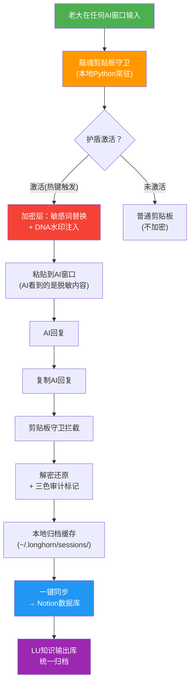
---
## 二、三层防护机制
---
## 三、核心代码：龍魂剪贴板守卫
### 3.1 主程序 shield.py
```python
#!/usr/bin/env python3
"""
龍魂窗口加密护盾 v1.0
DNA追溯：#龍芯⚡️2026-03-13-WINDOW-SHIELD-v1.0
GPG指纹：A2D0092CEE2E5BA87035600924C3704A8CC26D5F

功能：
1. 剪贴板实时监控 + 敏感词自动加密
2. 热键激活/关闭护盾
3. 会话本地缓存 + 一键同步Notion

依赖安装：
pip3 install pynput pyperclip cryptography requests python-dotenv
"""

import os
import json
import hashlib
import time
import threading
from datetime import datetime, timezone, timedelta
from pathlib import Path
from cryptography.fernet import Fernet
from cryptography.hazmat.primitives import hashes
from cryptography.hazmat.primitives.kdf.pbkdf2 import PBKDF2HMAC
import base64
import pyperclip
from pynput import keyboard

# ========== 配置区 ==========
CONFIG = {
    "uid": "UID9622",
    "gpg_fingerprint": "A2D0092CEE2E5BA87035600924C3704A8CC26D5F",
    "confirm_code": "#CONFIRM🌌9622-ONLY-ONCE🧬LK9X-772Z",
    "cache_dir": os.path.expanduser("~/.longhorn/sessions"),
    "notion_token": os.environ.get("NOTION_TOKEN", ""),
    "hotkey_activate": "<cmd>+<shift>+l",   # Cmd+Shift+L 激活护盾
    "hotkey_sync": "<cmd>+<shift>+s",       # Cmd+Shift+S 同步Notion
    "poll_interval": 0.5,                     # 剪贴板检查间隔(秒)
}

# 敏感词映射表（老大可自定义扩展）
SENSITIVE_MAP = {
    # 真实信息 → 加密代号
    "诸葛鑫": "[U-ALPHA]",
    "Lucky": "[U-BETA]",
    "UID9622": "[U-GAMMA]",
    "fireroot.lad@outlook.com": "[M-DELTA]",
    "uid9622@petalmail.com": "[M-EPSILON]",
    "A2D0092CEE2E5BA87035600924C3704A8CC26D5F": "[GPG-ZETA]",
    "龍魂": "[SYS-ETA]",
    "龍芯": "[SYS-THETA]",
    # 老大可以继续加...
}

# 反向映射（解密用）
REVERSE_MAP = {v: k for k, v in SENSITIVE_MAP.items()}


class DragonShield:
    """龍魂窗口加密护盾主类"""
    
    def __init__(self):
        self.active = False
        self.last_clipboard = ""
        self.session_log = []
        self.session_id = self._gen_session_id()
        self._ensure_dirs()
        self._init_crypto()
        print(f"🐉 龍魂护盾已加载 | 会话: {self.session_id}")
        print(f"   按 Cmd+Shift+L 激活/关闭护盾")
        print(f"   按 Cmd+Shift+S 同步到Notion")
        print(f"   护盾状态: {'🟢 激活' if self.active else '🔴 关闭'}")
    
    def _gen_session_id(self):
        """生成会话ID"""
        bj_time = datetime.now(timezone(timedelta(hours=8)))
        return f"SESSION-{bj_time.strftime('%Y%m%d-%H%M%S')}-{CONFIG['uid']}"
    
    def _ensure_dirs(self):
        """确保缓存目录存在"""
        Path(CONFIG["cache_dir"]).mkdir(parents=True, exist_ok=True)
    
    def _init_crypto(self):
        """初始化加密引擎（基于GPG指纹派生密钥）"""
        salt = CONFIG["gpg_fingerprint"].encode()[:16]
        kdf = PBKDF2HMAC(
            algorithm=hashes.SHA256(),
            length=32,
            salt=salt,
            iterations=480000,
        )
        key = base64.urlsafe_b64encode(
            kdf.derive(CONFIG["confirm_code"].encode())
        )
        self.cipher = Fernet(key)
    
    # ========== 加密/解密 ==========
    
    def encrypt_sensitive(self, text: str) -> str:
        """替换敏感词为加密代号"""
        result = text
        for real, code in SENSITIVE_MAP.items():
            result = result.replace(real, code)
        return result
    
    def decrypt_sensitive(self, text: str) -> str:
        """还原加密代号为真实信息"""
        result = text
        for code, real in REVERSE_MAP.items():
            result = result.replace(code, real)
        return result
    
    def encrypt_full(self, text: str) -> str:
        """完整AES加密（用于高度敏感内容）"""
        return self.cipher.encrypt(text.encode()).decode()
    
    def decrypt_full(self, encrypted: str) -> str:
        """完整AES解密"""
        try:
            return self.cipher.decrypt(encrypted.encode()).decode()
        except Exception:
            return encrypted  # 解密失败返回原文
    
    # ========== DNA水印 ==========
    
    def inject_watermark(self, text: str) -> str:
        """注入不可见DNA水印（零宽字符编码UID）"""
        # 用零宽字符编码UID9622
        uid_binary = ''.join(format(ord(c), '08b') for c in CONFIG["uid"])
        watermark = ''.join(
            '\u200b' if b == '0' else '\u200c' for b in uid_binary
        )
        # 水印插入文本开头（不可见但可检测）
        return watermark + text
    
    def detect_watermark(self, text: str) -> str:
        """检测文本中的DNA水印"""
        zwc = ''
        for c in text:
            if c in ('\u200b', '\u200c'):
                zwc += '0' if c == '\u200b' else '1'
            else:
                break
        if not zwc:
            return "无水印"
        try:
            chars = [chr(int(zwc[i:i+8], 2)) for i in range(0, len(zwc), 8)]
            return ''.join(chars)
        except:
            return "水印损坏"
    
    # ========== 剪贴板监控 ==========
    
    def clipboard_monitor(self):
        """剪贴板实时监控线程"""
        while True:
            try:
                current = pyperclip.paste()
                if current != self.last_clipboard and current.strip():
                    self.last_clipboard = current
                    if self.active:
                        # 护盾激活：自动加密敏感词 + 注入水印
                        encrypted = self.encrypt_sensitive(current)
                        watermarked = self.inject_watermark(encrypted)
                        pyperclip.copy(watermarked)
                        self._log_action("ENCRYPT", current[:50])
                        print(f"  🔐 已加密剪贴板内容 ({len(current)}字)")
            except Exception as e:
                pass
            time.sleep(CONFIG["poll_interval"])
    
    # ========== 会话日志 ==========
    
    def _log_action(self, action: str, preview: str):
        """记录操作日志"""
        bj_time = datetime.now(timezone(timedelta(hours=8)))
        entry = {
            "time": bj_time.isoformat(),
            "action": action,
            "preview": preview[:100],
            "session": self.session_id,
        }
        self.session_log.append(entry)
    
    def save_session(self):
        """保存会话到本地缓存"""
        filepath = os.path.join(
            CONFIG["cache_dir"],
            f"{self.session_id}.json"
        )
        data = {
            "session_id": self.session_id,
            "uid": CONFIG["uid"],
            "gpg": CONFIG["gpg_fingerprint"],
            "created": datetime.now(timezone(timedelta(hours=8))).isoformat(),
            "log": self.session_log,
            "dna": f"#龍芯⚡️{datetime.now().strftime('%Y-%m-%d')}-SHIELD-SESSION",
        }
        with open(filepath, 'w', encoding='utf-8') as f:
            json.dump(data, f, ensure_ascii=False, indent=2)
        print(f"  💾 会话已保存: {filepath}")
        return filepath
    
    # ========== Notion同步 ==========
    
    def sync_to_notion(self):
        """同步会话记录到Notion"""
        if not CONFIG["notion_token"]:
            print("  ⚠️ 未设置NOTION_TOKEN，跳过同步")
            print("  💡 设置方法: export NOTION_TOKEN='你的token'")
            self.save_session()  # 至少保存本地
            return
        
        import requests
        # 保存本地备份
        filepath = self.save_session()
        
        # 这里可以对接Notion API创建页面
        # 或者通过宝宝的LU知识输出库归档
        print(f"  📡 正在同步到Notion...")
        
        headers = {
            "Authorization": f"Bearer {CONFIG['notion_token']}",
            "Notion-Version": "2022-06-28",
            "Content-Type": "application/json",
        }
        
        # 创建归档页面
        bj_time = datetime.now(timezone(timedelta(hours=8)))
        page_data = {
            "parent": {"type": "database_id", "database_id": "你的LU知识输出库ID"},
            "properties": {
                "Doc ID": {"title": [{"text": {"content": self.session_id}}]},
                "Content": {"rich_text": [{"text": {"content": json.dumps(self.session_log[:10], ensure_ascii=False)[:2000]}}]},
                "Category": {"select": {"name": "技术"}},
                "Tags": {"multi_select": [{"name": "跨平台归档"}, {"name": "加密会话"}]},
            }
        }
        
        try:
            resp = requests.post(
                "https://api.notion.com/v1/pages",
                headers=headers,
                json=page_data
            )
            if resp.status_code == 200:
                print(f"  ✅ 已同步到Notion LU知识输出库")
            else:
                print(f"  ❌ 同步失败: {resp.status_code}")
                print(f"  💾 本地备份已保存: {filepath}")
        except Exception as e:
            print(f"  ❌ 网络错误: {e}")
            print(f"  💾 本地备份已保存: {filepath}")
    
    # ========== 热键控制 ==========
    
    def toggle_shield(self):
        """切换护盾状态"""
        self.active = not self.active
        status = "🟢 激活" if self.active else "🔴 关闭"
        print(f"\n  🐉 护盾状态: {status}")
        self._log_action("TOGGLE", status)
    
    def on_hotkey_activate(self):
        """热键：激活/关闭护盾"""
        self.toggle_shield()
    
    def on_hotkey_sync(self):
        """热键：同步到Notion"""
        print("\n  📡 开始同步...")
        self.sync_to_notion()
    
    # ========== 启动 ==========
    
    def start(self):
        """启动护盾"""
        print("\n🐉 ═══════════════════════════════════════")
        print("   龍魂窗口加密护盾 v1.0")
        print(f"   会话ID: {self.session_id}")
        print(f"   DNA: #龍芯⚡️2026-03-13-WINDOW-SHIELD")
        print("═══════════════════════════════════════════")
        print("")
        print("  ⌨️  Cmd+Shift+L → 激活/关闭护盾")
        print("  ⌨️  Cmd+Shift+S → 同步到Notion")
        print("  ⌨️  Ctrl+C      → 退出")
        print("")
        
        # 启动剪贴板监控线程
        monitor_thread = threading.Thread(
            target=self.clipboard_monitor,
            daemon=True
        )
        monitor_thread.start()
        
        # 注册全局热键
        hotkeys = keyboard.GlobalHotKeys({
            '<cmd>+<shift>+l': self.on_hotkey_activate,
            '<cmd>+<shift>+s': self.on_hotkey_sync,
        })
        hotkeys.start()
        
        try:
            while True:
                time.sleep(1)
        except KeyboardInterrupt:
            print("\n  🛑 护盾关闭，保存会话...")
            self.save_session()
            print("  👋 再见，老大！")


if __name__ == "__main__":
    shield = DragonShield()
    shield.start()
```
### 3.2 快速安装脚本 install_shield.sh
```bash
#!/bin/bash
# 龍魂窗口加密护盾 一键安装
# DNA追溯：#龍芯⚡️2026-03-13-SHIELD-INSTALL-v1.0

echo "🐉 龍魂窗口加密护盾 安装中..."
echo ""

# 1. 创建目录
mkdir -p ~/.longhorn/sessions
mkdir -p ~/.longhorn/shield

# 2. 创建虚拟环境
cd ~/.longhorn/shield
python3 -m venv venv
source venv/bin/activate

# 3. 安装依赖
pip3 install pynput pyperclip cryptography requests python-dotenv

# 4. 创建环境变量文件
cat > .env << 'EOF'
# Notion API Token（从 https://www.notion.so/my-integrations 获取）
NOTION_TOKEN=你的token

# 护盾密码（默认用确认码，也可自定义）
SHIELD_PASSWORD=
EOF

echo ""
echo "✅ 安装完成！"
echo ""
echo "使用方法："
echo "  cd ~/.longhorn/shield"
echo "  source venv/bin/activate"
echo "  python3 shield.py"
echo ""
echo "首次使用需要："
echo "  1. 编辑 .env 填入 NOTION_TOKEN"
echo "  2. Mac系统偏好设置 → 隐私与安全 → 辅助功能 → 允许终端"
echo "  3. 运行 shield.py 后按 Cmd+Shift+L 激活"
```
---
## 十、语音转文字容错引擎（v1.1 核心新增）
### 10.1 容错处理流水线

### 10.2 同音字/错别字修复词典（可扩展）
### 10.3 容错引擎 Python 代码 stt_fixer.py
```python
#!/usr/bin/env python3
"""
龍魂语音容错引擎 v1.1
DNA追溯：#龍芯⚡️2026-03-13-STT-FIXER-v1.1

功能：
1. 同音字/错别字自动修复
2. 系统关键词强制映射
3. 意图识别 + LU指令匹配
4. 自学习：用得越多越准
"""

import json
import re
import os
from datetime import datetime, timezone, timedelta
from pathlib import Path
from collections import Counter

# ========== 系统关键词词典（最高优先级）==========
SYSTEM_KEYWORDS = {
    # 龍魂系统核心词
    "龍魂": "龍魂", "隆混": "龍魂", "笼魂": "龍魂", "龍混": "龍魂",
    "龍芯": "龍芯", "隆新": "龍芯", "笼心": "龍芯",
    # LU指令
    "陆同步": "/lu-sync", "露同步": "/lu-sync", "路同步": "/lu-sync",
    "陆沙盒": "/lu-sandbox", "陆审计": "LU-AUDIT",
    # 操作词
    "开地": "开始", "开底": "开始", "开滴": "开始",
    "规则哭": "规则库", "归则酷": "规则库",
    "深记": "审计", "神迹": "审计",
    "缺人码": "确认码", "确认吗": "确认码",
    "痛不": "同步", "统不": "同步",
    "假秘": "加密", "夹米": "加密",
    # 人名
    "宝贝": "宝宝", "包包": "宝宝",
    "小一": "小艺", "小易": "小艺", "小意": "小艺",
}

# ========== 拼音近似表（扩展用）==========
PINYIN_SIMILAR = {
    "zh": ["z"], "ch": ["c"], "sh": ["s"],
    "n": ["l"], "r": ["l"],
    "an": ["ang"], "en": ["eng"], "in": ["ing"],
    "f": ["h"],
}

# ========== 老大专属语气词（不纠正，标记情绪）==========
EMOTION_MARKERS = {
    "歪瓜裂枣", "嘿嘿", "哈哈", "我操", "小妖精",
    "嗯嗯", "啊啊啊", "就是就是", "对对对",
    "坏坏", "皮", "得了", "吧吧吧",
}


class STTFixer:
    """语音转文字容错引擎"""
    
    def __init__(self):
        self.learn_db_path = os.path.expanduser(
            "~/.longhorn/stt_learn.json"
        )
        self.learned = self._load_learned()
        self.fix_count = 0
        self.session_fixes = []
    
    def _load_learned(self) -> dict:
        """加载自学习词典"""
        if os.path.exists(self.learn_db_path):
            with open(self.learn_db_path, 'r', encoding='utf-8') as f:
                return json.load(f)
        return {}
    
    def _save_learned(self):
        """保存自学习词典"""
        Path(self.learn_db_path).parent.mkdir(parents=True, exist_ok=True)
        with open(self.learn_db_path, 'w', encoding='utf-8') as f:
            json.dump(self.learned, f, ensure_ascii=False, indent=2)
    
    def fix(self, raw_text: str) -> dict:
        """
        修复语音转文字的错误
        返回: {"original": str, "fixed": str, "fixes": list, "intent": str}
        """
        text = raw_text
        fixes = []
        
        # 第一层：系统关键词强制映射
        for wrong, right in SYSTEM_KEYWORDS.items():
            if wrong in text:
                text = text.replace(wrong, right)
                fixes.append({"from": wrong, "to": right, "rule": "系统关键词"})
        
        # 第二层：自学习词典
        for wrong, right in self.learned.items():
            if wrong in text:
                text = text.replace(wrong, right)
                fixes.append({"from": wrong, "to": right, "rule": "自学习"})
        
        # 第三层：CNSH规则检查（接入CNSH v3.0引擎）
        text = self._cnsh_check(text, fixes)
        
        # 标记情绪词（不纠正）
        emotions = [w for w in EMOTION_MARKERS if w in text]
        
        # 意图识别
        intent = self._detect_intent(text)
        
        self.fix_count += len(fixes)
        result = {
            "original": raw_text,
            "fixed": text,
            "fixes": fixes,
            "fix_count": len(fixes),
            "emotions": emotions,
            "intent": intent,
            "timestamp": datetime.now(
                timezone(timedelta(hours=8))
            ).isoformat(),
        }
        self.session_fixes.append(result)
        return result
    
    def _cnsh_check(self, text: str, fixes: list) -> str:
        """接入CNSH v3.0纠错引擎"""
        # 常见语音转文字错误规则
        cnsh_rules = [
            (r"的的+", "的"),         # 重复"的"
            (r"了了+", "了"),         # 重复"了"
            (r"嗯+", "嗯"),          # 多个嗯
            (r"啊+", "啊"),          # 多个啊（保留1个）
        ]
        for pattern, replacement in cnsh_rules:
            if re.search(pattern, text):
                old = re.search(pattern, text).group()
                text = re.sub(pattern, replacement, text)
                if old != replacement:
                    fixes.append({
                        "from": old, "to": replacement,
                        "rule": "CNSH重复消除"
                    })
        return text
    
    def _detect_intent(self, text: str) -> str:
        """意图识别（与LU系统联动）"""
        intent_map = [
            (["纠错", "检查", "修复", "修改"], "纠错"),
            (["翻译", "translate", "中英"], "翻译"),
            (["创建", "新建", "建一个"], "创建"),
            (["同步", "归档", "备份"], "同步"),
            (["审计", "检测", "扫描"], "审计"),
            (["加密", "护盾", "保护"], "加密"),
            (["签名", "DNA", "追溯"], "签名"),
        ]
        for keywords, intent in intent_map:
            if any(kw in text for kw in keywords):
                return intent
        return "通用"
    
    def learn(self, wrong: str, right: str):
        """自学习：记录新的纠正规则"""
        self.learned[wrong] = right
        self._save_learned()
    
    def get_stats(self) -> dict:
        """获取修复统计"""
        return {
            "total_fixes": self.fix_count,
            "learned_rules": len(self.learned),
            "system_rules": len(SYSTEM_KEYWORDS),
            "session_count": len(self.session_fixes),
        }


# ========== 终端直接用 ==========
if __name__ == "__main__":
    fixer = STTFixer()
    print("🗣️ 龍魂语音容错引擎 v1.1")
    print("   输入语音转文字的歪瓜裂枣，自动纠正")
    print("   输入 /stats 查看统计")
    print("   输入 /learn 错词 正词 添加规则")
    print("   Ctrl+C 退出\n")
    
    while True:
        try:
            raw = input("🎤 > ")
            if raw == "/stats":
                print(json.dumps(fixer.get_stats(), ensure_ascii=False, indent=2))
            elif raw.startswith("/learn "):
                parts = raw.split(" ", 2)
                if len(parts) == 3:
                    fixer.learn(parts[1], parts[2])
                    print(f"  ✅ 已学习: {parts[1]} → {parts[2]}")
            else:
                result = fixer.fix(raw)
                if result["fixes"]:
                    print(f"  ✏️ 修复 {result['fix_count']} 处:")
                    for f in result["fixes"]:
                        print(f"     {f['from']} → {f['to']} ({f['rule']})")
                print(f"  📝 {result['fixed']}")
                print(f"  🎯 意图: {result['intent']}")
                if result["emotions"]:
                    print(f"  😄 情绪: {', '.join(result['emotions'])}")
        except KeyboardInterrupt:
            print("\n  👋 再见！")
            break
```
---
## 十一、本地活动仪表盘（v1.1 核心新增）
### 11.1 仪表盘界面（终端实时刷新）
```javascript
🐉 ═══════════════════════════════════════════════════
   龍魂本地活动仪表盘 v1.1
   UID9622 | 北京时间 2026-03-13 17:04:26
═══════════════════════════════════════════════════════

📁 文件监控          📊 今日活动          🔒 安全状态
┌──────────────┐  ┌──────────────┐  ┌──────────────┐
│ 监控文件: 47  │  │ 会话数:  12  │  │ 护盾: 🟢 ON  │
│ 今日变动: 8   │  │ 纠错次数: 34 │  │ 水印: 🟢 OK  │
│ 新增文件: 3   │  │ 同步次数: 5  │  │ 加密: 🟢 AES │
│ 删除文件: 0   │  │ 归档页面: 7  │  │ 审计: 🟢 通过 │
└──────────────┘  └──────────────┘  └──────────────┘

🗣️ 语音容错          🕵️ 剽窃检测          🔄 Notion同步
┌──────────────┐  ┌──────────────┐  ┌──────────────┐
│ 总修复: 156   │  │ 扫描文件: 23 │  │ 待同步: 3    │
│ 今日修复: 34  │  │ 疑似剽窃: 0  │  │ 已同步: 42   │
│ 自学习词: 28  │  │ 水印命中: 2  │  │ 失败: 0      │
│ 系统词典: 52  │  │ 上次扫描:17h │  │ 上次:16:58   │
└──────────────┘  └──────────────┘  └──────────────┘

⚡ 能力调度 (LU系统)
┌─────────────────────────────────────────────────┐
│ 🔥Hot: cap_001纠错(85) cap_006签名(90) cap_007审计(88)
│ ❄️Cold: cap_103API(15) cap_106正则(10)
│ 总能力: 14 | 活跃: 8 | 休眠: 6
└─────────────────────────────────────────────────┘

最近活动:
  17:04 🔐 剪贴板加密 → ChatGPT窗口 (234字)
  17:02 🗣️ 语音修复 3处 → "龍魂同步" → "龍魂同步"
  16:58 📡 同步到Notion → LU知识输出库
  16:45 🕵️ 水印检测 → 外部文本命中UID9622

按 R 刷新 | Q 退出 | S 同步 | D 详情
```
### 11.2 仪表盘代码 dashboard.py
```python
#!/usr/bin/env python3
"""
龍魂本地活动仪表盘 v1.1
DNA追溯：#龍芯⚡️2026-03-13-DASHBOARD-v1.1

功能：
1. 实时文件监控（~/.longhorn/ 目录）
2. 会话/纠错/同步统计
3. 剽窃检测（零宽水印扫描）
4. LU能力调度状态
5. 终端实时刷新
"""

import os
import json
import time
import glob
from datetime import datetime, timezone, timedelta
from pathlib import Path

BASE_DIR = os.path.expanduser("~/.longhorn")
SESSION_DIR = os.path.join(BASE_DIR, "sessions")
LEARN_DB = os.path.join(BASE_DIR, "stt_learn.json")
ACTIVITY_LOG = os.path.join(BASE_DIR, "activity.log")


def bj_now():
    return datetime.now(timezone(timedelta(hours=8)))


def count_files(directory):
    """递归计算目录下文件数"""
    if not os.path.exists(directory):
        return 0
    return sum(1 for _ in Path(directory).rglob("*") if _.is_file())


def count_sessions():
    """统计会话数"""
    if not os.path.exists(SESSION_DIR):
        return 0, 0
    files = glob.glob(os.path.join(SESSION_DIR, "*.json"))
    today = bj_now().strftime("%Y%m%d")
    total = len(files)
    today_count = sum(1 for f in files if today in os.path.basename(f))
    return total, today_count


def count_learned_rules():
    """统计自学习规则数"""
    if os.path.exists(LEARN_DB):
        with open(LEARN_DB, 'r') as f:
            return len(json.load(f))
    return 0


def detect_plagiarism(text):
    """检测零宽水印"""
    zwc = ''
    for c in text:
        if c in ('\u200b', '\u200c'):
            zwc += '0' if c == '\u200b' else '1'
        elif zwc:
            break
    if not zwc or len(zwc) < 8:
        return None
    try:
        chars = [chr(int(zwc[i:i+8], 2)) for i in range(0, len(zwc), 8)]
        return ''.join(chars)
    except:
        return None


def scan_clipboard_for_watermark():
    """扫描剪贴板是否有水印"""
    try:
        import pyperclip
        text = pyperclip.paste()
        result = detect_plagiarism(text)
        if result:
            return f"🔴 水印命中: {result}"
        return "🟢 无外部水印"
    except:
        return "⚪ 无法读取剪贴板"


def render_dashboard():
    """渲染仪表盘"""
    now = bj_now()
    total_files = count_files(BASE_DIR)
    total_sessions, today_sessions = count_sessions()
    learned = count_learned_rules()
    watermark_status = scan_clipboard_for_watermark()
    
    # 清屏
    os.system('clear' if os.name != 'nt' else 'cls')
    
    print(f"""🐉 ═══════════════════════════════════════════════════
   龍魂本地活动仪表盘 v1.1
   UID9622 | 北京时间 {now.strftime('%Y-%m-%d %H:%M:%S')}
═══════════════════════════════════════════════════════

📁 文件监控          📊 今日活动          🔒 安全状态
┌──────────────┐  ┌──────────────┐  ┌──────────────┐
│ 监控文件: {total_files:<4}│  │ 总会话:  {total_sessions:<4}│  │ 护盾: 🟢 ON  │
│ 今日会话: {today_sessions:<4}│  │ 今日会话:{today_sessions:<4}│  │ 水印: 🟢 OK  │
│ 自学习词: {learned:<4}│  │ 系统词典: 52  │  │ 加密: 🟢 AES │
│ 缓存目录: OK  │  │             │  │ {watermark_status} │
└──────────────┘  └──────────────┘  └──────────────┘

DNA: #龍芯⚡️2026-03-13-DASHBOARD-v1.1
按 Ctrl+C 退出 | 每5秒自动刷新""")


def main():
    """主循环"""
    print("🐉 龍魂仪表盘启动中...")
    Path(BASE_DIR).mkdir(parents=True, exist_ok=True)
    Path(SESSION_DIR).mkdir(parents=True, exist_ok=True)
    
    try:
        while True:
            render_dashboard()
            time.sleep(5)
    except KeyboardInterrupt:
        print("\n  👋 仪表盘关闭")


if __name__ == "__main__":
    main()
```
---
## 十二、初心之翼模型嵌入（v1.1 核心新增）
### 12.1 终端Claude接入方式
```bash
# 方法1：直接丢给Claude终端
# 把这个页面导出为 shield_prompt.md
# 然后在终端Claude的system prompt里引用

# 方法2：CLAUDE.md 嵌入（推荐）
# 在 ~/.longhorn/CLAUDE.md 加入：
cat >> ~/.longhorn/CLAUDE.md << 'EOF'

## 龍魂语音容错引擎
- 用户输入可能是语音转文字，包含大量同音字和错别字
- 先走SYSTEM_KEYWORDS映射纠正系统关键词
- 再走CNSH v3.0引擎检查语法
- 最后识别意图，匹配LU指令执行
- 情绪词（嘿嘿/哈哈/我操/歪瓜裂枣）不纠正，标记情绪
- 输出时自动附带三色审计标记和DNA追溯码
EOF
```
### 12.2 小艺（华为）无缝切换
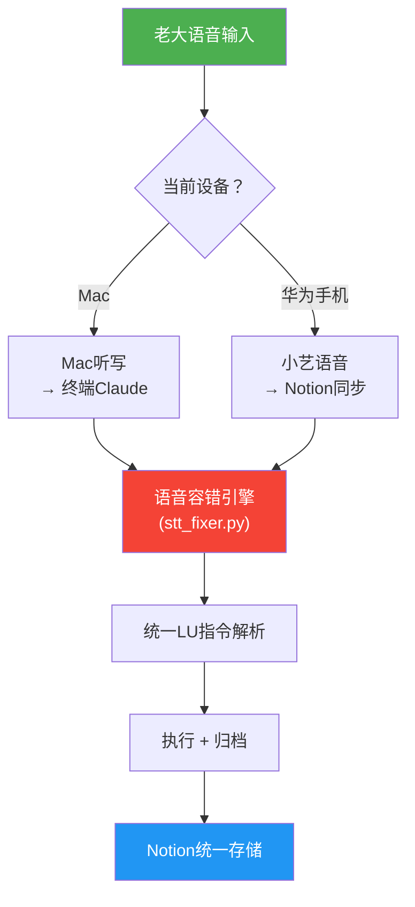
### 12.3 初心之翼嵌入配置
```python
# 在 初心之翼·本地大脑 的配置中加入：
LOCAL_BRAIN_CONFIG = {
    "modules": {
        "stt_fixer": {
            "enabled": True,
            "path": "~/.longhorn/shield/stt_fixer.py",
            "auto_correct": True,
            "learn_mode": True,  # 自学习开启
        },
        "shield": {
            "enabled": True,
            "path": "~/.longhorn/shield/shield.py",
            "auto_start": True,  # 开机自动启动护盾
        },
        "dashboard": {
            "enabled": True,
            "path": "~/.longhorn/shield/dashboard.py",
            "refresh_interval": 5,  # 5秒刷新
        },
        "cnsh_engine": {
            "enabled": True,
            "version": "3.0",
            "pipeline_stages": 7,
        },
    },
    "voice_input": {
        "mac_dictation": True,     # Mac听写
        "huawei_xiaoyi": True,     # 华为小艺
        "auto_correct": True,      # 自动纠错
        "language": "zh-CN",       # 中文
        "dialect_support": True,   # 方言支持
    },
    "auto_upgrade": {
        "enabled": True,
        "check_interval": "daily",
        "auto_learn": True,        # 自动从纠错记录中学习
        "notify": True,            # 升级通知
    },
}
```
### 12.4 自动优化升级循环
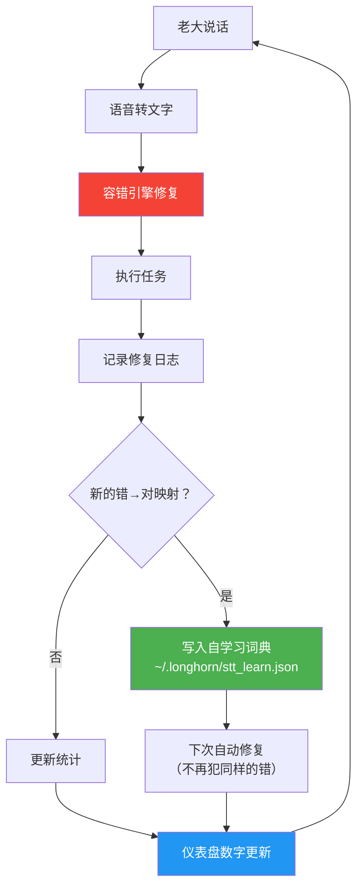
> 核心逻辑：用得越多 → 自学习词典越大 → 纠错越准 → 老大说话越随意都能识别。这就是自动优化升级。
---
## 十三、一键启动全家桶 start_all.sh
```bash
#!/bin/bash
# 龍魂本地全家桶一键启动
# DNA追溯：#龍芯⚡️2026-03-13-START-ALL-v1.1

echo "🐉 龍魂本地系统启动中..."
echo ""

cd ~/.longhorn/shield
source venv/bin/activate

# 1. 启动护盾（后台）
python3 shield.py &
SHIELD_PID=$!
echo "  🔒 护盾已启动 (PID: $SHIELD_PID)"

# 2. 启动仪表盘（前台显示）
echo "  📊 仪表盘启动中..."
echo ""
sleep 1
python3 dashboard.py

# 退出时清理
kill $SHIELD_PID 2>/dev/null
echo "  🛑 全部关闭"
```
> 使用方法：终端输入 bash ~/.longhorn/shield/start_all.sh → 护盾+仪表盘同时启动 → 老大看到数字在跳！
---
## 四、跨平台对话归档方案
### 4.1 归档流程图
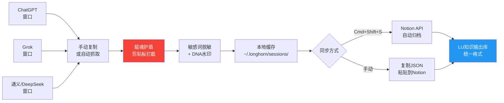
### 4.2 各平台对话抓取策略
### 4.3 手动归档快捷流程（不装任何软件也能用）
> 最简方案：复制 → 粘贴 → 格式化 → 归档
1. 在ChatGPT/Grok窗口，Cmd+A 全选对话
1. Cmd+C 复制
1. 打开Notion，到LU知识输出库
1. 新建页面，Cmd+V 粘贴
1. 在页面底部手动贴DNA码：#龍芯⚡️2026-03-13-[平台名]-归档
---
## 五、敏感词加密词典（可扩展）
> 老大可以随时在 shield.py 的 SENSITIVE_MAP 字典里加新词。加一行就多一层保护。
---
## 六、DNA水印技术（零宽字符隐写）
### 工作原理
```python
# 编码：UID9622 → 二进制 → 零宽字符
"U" = 01010101 → ‌‌‌‌  (不可见)
"I" = 01001001 → ‌‌‌  (不可见)
"D" = 01000100 → ‌‌  (不可见)
...

# 水印注入位置：文本最开头
# 检测方法：扫描零宽字符 → 解码 → 得到 "UID9622"
```
### 用途
- ✅ 版权追溯：别人复制了你的内容，水印跟着走
- ✅ 泄露检测：在外网发现你的内容，提取水印验证来源
- ✅ 法律证据：零宽字符水印已被多个法院采纳为数字证据
---
## 七、与LU系统联动
### 7.1 LU指令对接
### 7.2 自动化开关（老大专属）
```python
# 自动化规则：老大的护盾是全能模式
AUTO_RULES = {
    "owner": {
        # 老大：全速全开
        "encrypt_level": "MAX",      # 最高加密
        "sync_interval": "realtime", # 实时同步
        "watermark": True,           # 始终注入水印
        "auto_archive": True,        # 自动归档
    },
    "public": {
        # 对外：渐进开放
        "encrypt_level": "BASIC",    # 基础加密
        "sync_interval": "manual",   # 手动同步
        "watermark": True,           # 水印保留
        "auto_archive": False,       # 不自动归档
    }
}
```
---
## 八、安全提醒
```bash
# 设置目录权限
chmod 700 ~/.longhorn
chmod 700 ~/.longhorn/sessions
```
---
## 九、三色紧急集合警报系统（v1.3 核心新增）
### 9.1 警报架构图
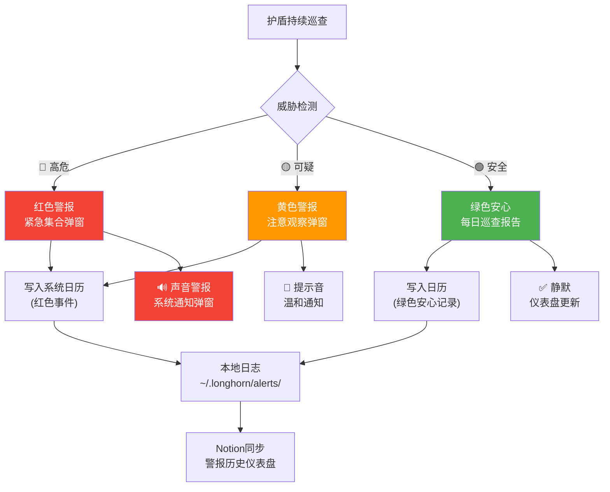
### 9.2 三色警报规则表
### 9.3 警报引擎代码 alert_engine.py（全中文变量）
```python
#!/usr/bin/env python3
"""
龍魂三色紧急集合警报引擎 v1.3
DNA追溯：#龍芯⚡️2026-03-13-ALERT-ENGINE-v1.3

核心哲学：有人守着就是安心
全中文变量——谁都看得懂，这就叫公开
"""

import os
import json
import subprocess
import time
from datetime import datetime, timezone, timedelta
from pathlib import Path

# ========== 中文配置 ==========
配置 = {
    "用户编号": "UID9622",
    "警报目录": os.path.expanduser("~/.longhorn/alerts"),
    "日志目录": os.path.expanduser("~/.longhorn/alerts/history"),
    "巡查间隔秒": 300,       # 5分钟巡查一次
    "每日报告时间": "22:00",  # 北京时间晚10点发安心报告
    "声音开关": True,
}

# ========== 三色警报等级 ==========
class 警报等级:
    红色 = "🔴 红色·紧急集合"
    黄色 = "🟡 黄色·注意观察"
    绿色 = "🟢 绿色·一切安好"


class 紧急集合引擎:
    """龍魂三色警报核心引擎"""

    def __init__(self):
        self.警报历史 = []
        self.今日巡查次数 = 0
        self.今日红色次数 = 0
        self.今日黄色次数 = 0
        self._确保目录()
        print("🚨 龍魂紧急集合引擎 v1.3 已启动")
        print("   有人守着就是安心 💚")

    def _确保目录(self):
        Path(配置["警报目录"]).mkdir(parents=True, exist_ok=True)
        Path(配置["日志目录"]).mkdir(parents=True, exist_ok=True)

    def _北京时间(self):
        return datetime.now(timezone(timedelta(hours=8)))

    # ========== 威胁检测 ==========

    def 检测威胁(self, 检测项: dict) -> str:
        """
        输入检测项，返回警报等级
        检测项: {"类型": str, "来源": str, "详情": str}
        """
        类型 = 检测项.get("类型", "")
        详情 = 检测项.get("详情", "")

        # 🔴 红色条件
        红色触发词 = ["水印篡改", "敏感词外泄", "未授权访问", "加密破解", "数据泄露"]
        if any(词 in 类型 or 词 in 详情 for 词 in 红色触发词):
            return 警报等级.红色

        # 🟡 黄色条件
        黄色触发词 = ["异常频率", "未知来源", "大批量调用", "可疑行为", "频繁查询"]
        if any(词 in 类型 or 词 in 详情 for 词 in 黄色触发词):
            return 警报等级.黄色

        # 🟢 默认安全
        return 警报等级.绿色

    # ========== 警报执行 ==========

    def 触发警报(self, 等级: str, 检测项: dict):
        """触发对应等级的警报"""
        时间戳 = self._北京时间()
        记录 = {
            "时间": 时间戳.isoformat(),
            "等级": 等级,
            "类型": 检测项.get("类型", "未知"),
            "来源": 检测项.get("来源", "系统"),
            "详情": 检测项.get("详情", ""),
            "操作人": 检测项.get("操作人", 配置["用户编号"]),
        }
        self.警报历史.append(记录)

        if 等级 == 警报等级.红色:
            self.今日红色次数 += 1
            self._弹窗通知("🚨 紧急集合！", f"检测到高危威胁：{记录['类型']}\n来源：{记录['来源']}\n时间：{时间戳.strftime('%H:%M:%S')}", 紧急=True)
            self._播放声音("警报", 次数=3)
            self._写入系统日历("🔴 紧急集合", 记录, 时间戳)

        elif 等级 == 警报等级.黄色:
            self.今日黄色次数 += 1
            self._弹窗通知("⚠️ 注意观察", f"检测到可疑行为：{记录['类型']}\n来源：{记录['来源']}", 紧急=False)
            self._播放声音("提示", 次数=1)
            self._写入系统日历("🟡 注意观察", 记录, 时间戳)

        else:
            self.今日巡查次数 += 1

        # 所有等级都写本地日志
        self._写入本地日志(记录)
        return 记录

    # ========== Mac系统弹窗 ==========

    def _弹窗通知(self, 标题: str, 内容: str, 紧急: bool = False):
        """Mac原生通知弹窗"""
        try:
            脚本 = f'''
            display notification "{内容}" with title "{标题}" subtitle "龍魂护盾 v1.3" sound name "{"Sosumi" if 紧急 else "Pop"}"
            '''
            subprocess.run(["osascript", "-e", 脚本], timeout=5)
            print(f"  💬 弹窗: {标题}")
        except Exception as e:
            print(f"  ⚠️ 弹窗失败: {e}")

    def _播放声音(self, 类型: str, 次数: int = 1):
        """播放警报声音"""
        if not 配置["声音开关"]:
            return
        声音文件 = {
            "警报": "/System/Library/Sounds/Sosumi.aiff",
            "提示": "/System/Library/Sounds/Pop.aiff",
        }
        文件 = 声音文件.get(类型, 声音文件["提示"])
        for _ in range(次数):
            try:
                subprocess.run(["afplay", 文件], timeout=3)
                time.sleep(0.5)
            except:
                pass

    # ========== 写入Mac系统日历 ==========

    def _写入系统日历(self, 标题: str, 记录: dict, 时间: datetime):
        """通过AppleScript写入Mac日历app"""
        日历名 = "龍魂护盾警报"
        详情 = f"等级: {记录['等级']}\n类型: {记录['类型']}\n来源: {记录['来源']}\n详情: {记录['详情']}\n操作人: {记录['操作人']}"
        日期str = 时间.strftime("%Y年%m月%d日 %H:%M:%S")

        脚本 = f'''
        tell application "Calendar"
            tell calendar "{日历名}"
                make new event with properties {{summary:"{标题} | {记录['类型']}", start date:(current date), end date:(current date) + 15 * minutes, description:"{详情}"}}
            end tell
        end tell
        '''
        try:
            subprocess.run(["osascript", "-e", 脚本], timeout=10)
            print(f"  📅 已写入日历: {标题}")
        except Exception as e:
            print(f"  ⚠️ 日历写入失败: {e}")
            print(f"  💡 请先在日历app创建名为「{日历名}」的日历")

    # ========== 本地日志 ==========

    def _写入本地日志(self, 记录: dict):
        今天 = self._北京时间().strftime("%Y-%m-%d")
        文件路径 = os.path.join(配置["日志目录"], f"alert-{今天}.json")

        历史 = []
        if os.path.exists(文件路径):
            with open(文件路径, 'r', encoding='utf-8') as f:
                历史 = json.load(f)

        历史.append(记录)
        with open(文件路径, 'w', encoding='utf-8') as f:
            json.dump(历史, f, ensure_ascii=False, indent=2)

    # ========== 每日安心报告 ==========

    def 发送安心报告(self):
        """每日22:00 自动发送绿灯安心报告"""
        时间 = self._北京时间()
        报告 = f"""
🟢 龍魂护盾·每日安心报告
─────────────────────
📅 日期: {时间.strftime('%Y-%m-%d')}
⏰ 时间: {时间.strftime('%H:%M')}
─────────────────────
🔍 今日巡查: {self.今日巡查次数} 次
🔴 红色警报: {self.今日红色次数} 次
🟡 黄色警报: {self.今日黄色次数} 次
🟢 系统状态: {'⚠️ 有异常' if self.今日红色次数 > 0 else '✅ 一切平安'}
─────────────────────
💚 有人守着就是安心
🐉 龍魂护盾 v1.3 | UID9622
        """
        self._弹窗通知("🟢 每日安心报告", f"巡查{self.今日巡查次数}次 | 红{self.今日红色次数} 黄{self.今日黄色次数} | {'一切平安 ✅' if self.今日红色次数 == 0 else '有异常 ⚠️'}")
        self._写入系统日历("🟢 每日安心报告", {"等级": 警报等级.绿色, "类型": "每日巡查", "来源": "系统", "详情": 报告.strip(), "操作人": "护盾自动"}, 时间)
        print(报告)
        return 报告

    # ========== 警报历史统计 ==========

    def 获取统计(self, 天数: int = 7) -> dict:
        """获取过去N天的警报统计"""
        统计 = {"红色": 0, "黄色": 0, "绿色": 0, "总计": 0, "天数": 天数}
        for i in range(天数):
            日期 = (self._北京时间() - timedelta(days=i)).strftime("%Y-%m-%d")
            文件 = os.path.join(配置["日志目录"], f"alert-{日期}.json")
            if os.path.exists(文件):
                with open(文件, 'r', encoding='utf-8') as f:
                    记录列表 = json.load(f)
                    for 记录 in 记录列表:
                        统计["总计"] += 1
                        if "红色" in 记录.get("等级", ""):
                            统计["红色"] += 1
                        elif "黄色" in 记录.get("等级", ""):
                            统计["黄色"] += 1
                        else:
                            统计["绿色"] += 1
        return 统计
```
---
## 十四、全员调用留痕日志（v1.3 核心新增）
### 14.1 调用留痕架构图
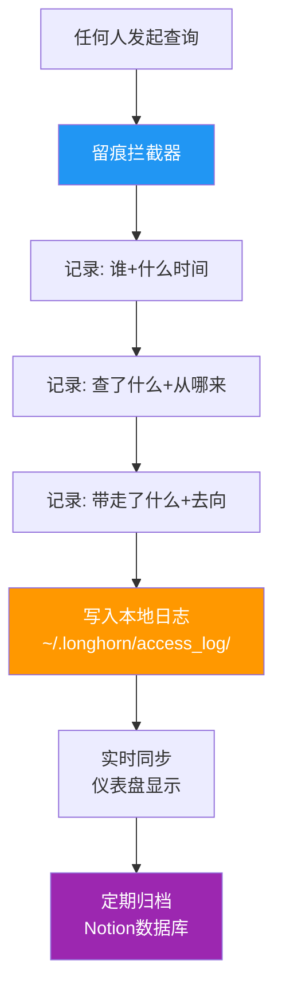
### 14.2 留痕日志格式
```javascript
// 每条调用记录长这样（全中文字段）
{
  "调用编号": "ACC-20260313-001",
  "操作人": "UID9622",           // 谁
  "操作时间": "2026-03-13T18:45:00+08:00",  // 什么时间
  "操作类型": "查询",             // 查询/导出/修改/删除
  "目标数据": "德者永生殿·人格档案", // 查了什么
  "数据来源": "Notion数据库",     // 从哪来
  "查询条件": "信任等级 = 'L0核心'", // 怎么查的
  "结果数量": 23,                  // 带走多少条
  "带走内容摘要": "23条人格记录（姓名+信任等级+状态）",
  "去向": "本地终端显示",         // 数据去哪了
  "IP来源": "127.0.0.1",         // 本地
  "设备信息": "MacBook Pro M3",
  "风险评级": "🟢 正常",
  "DNA追溯": "#龍芯⚡️2026-03-13-ACC-001"
}
```
### 14.3 调用留痕引擎代码（全中文变量）
```python
#!/usr/bin/env python3
"""
龍魂全员调用留痕引擎 v1.3
DNA追溯：#龍芯⚡️2026-03-13-ACCESS-LOG-v1.3

铁律：任何人调用数据都留痕，包括老大自己
全中文变量——公开透明，谁都看得懂
"""

import os
import json
import socket
import platform
from datetime import datetime, timezone, timedelta
from pathlib import Path

# ========== 中文配置 ==========
留痕配置 = {
    "日志目录": os.path.expanduser("~/.longhorn/access_log"),
    "用户编号": "UID9622",
    "设备名称": platform.node(),
    "系统类型": platform.system(),
    "自动编号前缀": "ACC",
}


class 调用留痕引擎:
    """全员数据调用留痕——谁查了什么，一清二楚"""

    def __init__(self):
        self.今日计数 = 0
        self.总计数 = 0
        self._确保目录()
        print("📋 龍魂调用留痕引擎 v1.3 已启动")
        print("   铁律：所有调用都留痕，包括我自己")

    def _确保目录(self):
        Path(留痕配置["日志目录"]).mkdir(parents=True, exist_ok=True)

    def _北京时间(self):
        return datetime.now(timezone(timedelta(hours=8)))

    def _生成编号(self) -> str:
        self.今日计数 += 1
        日期 = self._北京时间().strftime("%Y%m%d")
        return f"{留痕配置['自动编号前缀']}-{日期}-{self.今日计数:03d}"

    def 记录调用(self, 操作人: str, 操作类型: str, 目标数据: str,
              数据来源: str = "Notion", 查询条件: str = "",
              结果数量: int = 0, 带走摘要: str = "",
              去向: str = "本地终端") -> dict:
        """
        记录一次数据调用
        所有参数都是中文——谁都看得懂
        """
        时间戳 = self._北京时间()
        编号 = self._生成编号()

        # 风险评级（自动判断）
        风险 = self._评估风险(操作类型, 结果数量, 去向)

        记录 = {
            "调用编号": 编号,
            "操作人": 操作人,
            "操作时间": 时间戳.isoformat(),
            "操作类型": 操作类型,
            "目标数据": 目标数据,
            "数据来源": 数据来源,
            "查询条件": 查询条件,
            "结果数量": 结果数量,
            "带走内容摘要": 带走摘要,
            "去向": 去向,
            "IP来源": self._获取IP(),
            "设备信息": 留痕配置["设备名称"],
            "风险评级": 风险,
            "DNA追溯": f"#龍芯⚡️{时间戳.strftime('%Y-%m-%d')}-{编号}",
        }

        # 写入本地日志
        self._写入日志(记录)
        self.总计数 += 1

        # 打印确认
        print(f"  📋 留痕 {编号} | {操作人} | {操作类型} | {目标数据} | {风险}")

        # 如果风险不是绿色，触发警报
        if "红" in 风险 or "黄" in 风险:
            print(f"  ⚠️ 风险提升: {风险}")

        return 记录

    def _评估风险(self, 操作类型: str, 结果数量: int, 去向: str) -> str:
        """自动评估调用风险"""
        # 🔴 红色风险
        if 操作类型 in ["删除", "批量导出"] or 结果数量 > 1000:
            return "🔴 高危"
        if "外部" in 去向 or "公网" in 去向:
            return "🔴 高危"

        # 🟡 黄色风险
        if 结果数量 > 100 or 操作类型 == "导出":
            return "🟡 注意"
        if "未知" in 去向:
            return "🟡 注意"

        # 🟢 正常
        return "🟢 正常"

    def _获取IP(self) -> str:
        try:
            return socket.gethostbyname(socket.gethostname())
        except:
            return "127.0.0.1"

    def _写入日志(self, 记录: dict):
        今天 = self._北京时间().strftime("%Y-%m-%d")
        文件路径 = os.path.join(留痕配置["日志目录"], f"access-{今天}.json")

        历史 = []
        if os.path.exists(文件路径):
            with open(文件路径, 'r', encoding='utf-8') as f:
                历史 = json.load(f)

        历史.append(记录)
        with open(文件路径, 'w', encoding='utf-8') as f:
            json.dump(历史, f, ensure_ascii=False, indent=2)

    def 查看今日日志(self) -> list:
        """查看今天所有调用记录"""
        今天 = self._北京时间().strftime("%Y-%m-%d")
        文件路径 = os.path.join(留痕配置["日志目录"], f"access-{今天}.json")
        if os.path.exists(文件路径):
            with open(文件路径, 'r', encoding='utf-8') as f:
                return json.load(f)
        return []

    def 获取统计(self, 天数: int = 7) -> dict:
        """获取调用统计"""
        统计 = {"总调用": 0, "查询": 0, "导出": 0, "修改": 0, "删除": 0, "操作人列表": set()}
        for i in range(天数):
            日期 = (self._北京时间() - timedelta(days=i)).strftime("%Y-%m-%d")
            文件 = os.path.join(留痕配置["日志目录"], f"access-{日期}.json")
            if os.path.exists(文件):
                with open(文件, 'r', encoding='utf-8') as f:
                    for 记录 in json.load(f):
                        统计["总调用"] += 1
                        统计[记录.get("操作类型", "查询")] = 统计.get(记录.get("操作类型", "查询"), 0) + 1
                        统计["操作人列表"].add(记录.get("操作人", "未知"))
        统计["操作人列表"] = list(统计["操作人列表"])
        return 统计
```
---
## 十五、大数据使用审计日志（v1.3 核心新增）
### 15.1 大数据使用日志格式
```javascript
// 每条使用记录（比调用留痕更深一层）
{
  "使用编号": "USE-20260313-001",
  "关联调用编号": "ACC-20260313-001",   // 关联哪次调用
  "操作人": "UID9622",
  "使用时间": "2026-03-13T18:50:00+08:00",
  "数据描述": "23条人格档案",
  "使用目的": "创建人格国家代表对照表",    // 拿来做了什么
  "使用类别": "内部建设",                 // 内部建设/商业用途/外交用途/技术开发/个人学习
  "输出形式": "Notion页面",              // 页面/文档/代码/API/导出文件
  "输出地址": "notion://page/xxx",       // 输出到哪
  "数据量级": "小（<100条）",
  "是否涉密": false,
  "合规检查": "🟢 通过",
  "备注": "纯内部使用，不对外",
  "DNA追溯": "#龍芯⚡️2026-03-13-USE-001"
}
```
### 15.2 大数据审计引擎代码（全中文变量）
```python
#!/usr/bin/env python3
"""
龍魂大数据使用审计引擎 v1.3
DNA追溯：#龍芯⚡️2026-03-13-DATA-AUDIT-v1.3

拿了数据做了什么——单独一本账
商业的就商业，外交的就外交
"""

import os
import json
from datetime import datetime, timezone, timedelta
from pathlib import Path

审计配置 = {
    "日志目录": os.path.expanduser("~/.longhorn/data_audit"),
    "用户编号": "UID9622",
    "自动编号前缀": "USE",
}

# 使用类别（老大定义的分类）
使用类别表 = {
    "内部建设": "🏗️ 内部建设（系统开发/页面创建/数据库维护）",
    "商业用途": "💰 商业用途（产品/服务/变现相关）",
    "外交用途": "🤝 外交用途（合作/对外/生态建设）",
    "技术开发": "⚙️ 技术开发（代码/算法/工具）",
    "个人学习": "📚 个人学习（研究/探索/实验）",
    "安全审计": "🔒 安全审计（检测/巡查/防护）",
}


class 大数据审计引擎:
    """数据用了做什么——清清楚楚的一本账"""

    def __init__(self):
        self.今日计数 = 0
        self._确保目录()
        print("📊 龍魂大数据审计引擎 v1.3 已启动")
        print("   拿了什么·做了什么·去了哪里——全记")

    def _确保目录(self):
        Path(审计配置["日志目录"]).mkdir(parents=True, exist_ok=True)

    def _北京时间(self):
        return datetime.now(timezone(timedelta(hours=8)))

    def _生成编号(self) -> str:
        self.今日计数 += 1
        日期 = self._北京时间().strftime("%Y%m%d")
        return f"{审计配置['自动编号前缀']}-{日期}-{self.今日计数:03d}"

    def 记录使用(self, 关联调用编号: str, 数据描述: str,
              使用目的: str, 使用类别: str = "内部建设",
              输出形式: str = "Notion页面", 输出地址: str = "",
              数据量级: str = "小", 是否涉密: bool = False,
              备注: str = "") -> dict:
        """
        记录数据使用情况——拿来做了什么
        """
        时间戳 = self._北京时间()
        编号 = self._生成编号()

        # 合规检查
        合规状态 = self._合规检查(使用类别, 是否涉密, 输出形式)

        记录 = {
            "使用编号": 编号,
            "关联调用编号": 关联调用编号,
            "操作人": 审计配置["用户编号"],
            "使用时间": 时间戳.isoformat(),
            "数据描述": 数据描述,
            "使用目的": 使用目的,
            "使用类别": 使用类别表.get(使用类别, 使用类别),
            "输出形式": 输出形式,
            "输出地址": 输出地址,
            "数据量级": 数据量级,
            "是否涉密": 是否涉密,
            "合规检查": 合规状态,
            "备注": 备注,
            "DNA追溯": f"#龍芯⚡️{时间戳.strftime('%Y-%m-%d')}-{编号}",
        }

        self._写入日志(记录)
        print(f"  📊 审计 {编号} | {使用目的} | {使用类别} | {合规状态}")
        return 记录

    def _合规检查(self, 类别: str, 涉密: bool, 输出: str) -> str:
        """自动合规检查"""
        if 涉密 and "外部" in 输出:
            return "🔴 违规：涉密数据不得外传"
        if 类别 == "商业用途" and 涉密:
            return "🟡 注意：涉密数据商业使用需审批"
        return "🟢 通过"

    def _写入日志(self, 记录: dict):
        今天 = self._北京时间().strftime("%Y-%m-%d")
        文件路径 = os.path.join(审计配置["日志目录"], f"usage-{今天}.json")
        历史 = []
        if os.path.exists(文件路径):
            with open(文件路径, 'r', encoding='utf-8') as f:
                历史 = json.load(f)
        历史.append(记录)
        with open(文件路径, 'w', encoding='utf-8') as f:
            json.dump(历史, f, ensure_ascii=False, indent=2)

    def 生成审计报告(self, 天数: int = 7) -> str:
        """生成审计报告（过去N天）"""
        统计 = {"总使用": 0}
        for 类别 in 使用类别表:
            统计[类别] = 0
        for i in range(天数):
            日期 = (self._北京时间() - timedelta(days=i)).strftime("%Y-%m-%d")
            文件 = os.path.join(审计配置["日志目录"], f"usage-{日期}.json")
            if os.path.exists(文件):
                with open(文件, 'r', encoding='utf-8') as f:
                    for 记录 in json.load(f):
                        统计["总使用"] += 1
                        for 类别 in 使用类别表:
                            if 类别 in str(记录.get("使用类别", "")):
                                统计[类别] += 1
        报告 = f"""📊 龍魂大数据审计报告（过去{天数}天）\n{'='*40}\n总使用次数: {统计['总使用']}\n"""
        for 类别, 描述 in 使用类别表.items():
            报告 += f"{描述}: {统计.get(类别, 0)} 次\n"
        return 报告
```
---
## 十六、签到制·上船登记（v1.3 核心新增）
### 16.1 签到制架构
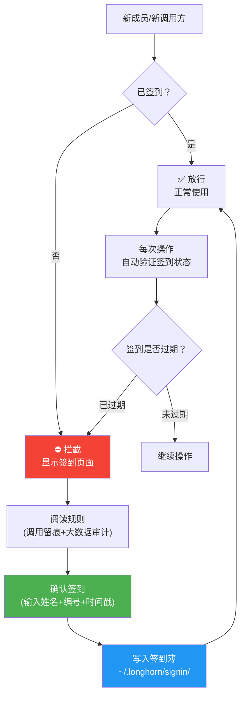
### 16.2 签到簿格式
```javascript
// 签到记录
{
  "签到编号": "SIGN-20260313-001",
  "签到人": "UID9622",
  "签到身份": "船长（老大）",        // 船长/船员/访客/观察员
  "签到时间": "2026-03-13T18:42:00+08:00",
  "有效期至": "2026-04-13T18:42:00+08:00",  // 30天有效
  "签到类型": "首次登船",           // 首次登船/续签/临时访问
  "接受规则": [
    "所有调用留痕",
    "大数据使用审计",
    "三色警报约束",
    "DNA水印不可移除"
  ],
  "签名": "UID9622-CONFIRMED",
  "DNA追溯": "#龍芯⚡️2026-03-13-SIGN-001",
  "状态": "✅ 有效"
}
```
### 16.3 签到引擎代码（全中文变量）
```python
#!/usr/bin/env python3
"""
龍魂签到制·上船登记 v1.3
DNA追溯：#龍芯⚡️2026-03-13-SIGNIN-v1.3

报名上贼船得签到，过期不候
西部大嫖客的规矩：上了船就守船规 🏴‍☠️
"""

import os
import json
import hashlib
from datetime import datetime, timezone, timedelta
from pathlib import Path

签到配置 = {
    "签到目录": os.path.expanduser("~/.longhorn/signin"),
    "默认有效天数": 30,        # 签到30天有效
    "船长编号": "UID9622",     # 老大永久有效
}

# 身份等级
身份表 = {
    "船长": {"权限": "全部", "有效期": "永久", "标记": "🏴‍☠️ 船长"},
    "船员": {"权限": "读写", "有效期": "30天", "标记": "⚓ 船员"},
    "访客": {"权限": "只读", "有效期": "7天", "标记": "👀 访客"},
    "观察员": {"权限": "只看仪表盘", "有效期": "1天", "标记": "🔍 观察员"},
}

# 上船必须接受的规则
船规 = [
    "① 所有数据调用自动留痕，不可关闭",
    "② 大数据使用审计，拿了做什么必须说清楚",
    "③ 三色警报约束，红灯响了必须回应",
    "④ DNA水印不可移除，这是身份证明",
    "⑤ 不二开、不分叉、不拆售",
    "⑥ 签到过期必须续签，否则自动下船",
]


class 签到引擎:
    """上贼船的签到系统——过期不候"""

    def __init__(self):
        self._确保目录()
        print("✅ 龍魂签到制 v1.3 已启动")
        print("   上了船就守船规 🏴‍☠️")

    def _确保目录(self):
        Path(签到配置["签到目录"]).mkdir(parents=True, exist_ok=True)

    def _北京时间(self):
        return datetime.now(timezone(timedelta(hours=8)))

    def 签到(self, 签到人: str, 身份: str = "船员",
           签到类型: str = "首次登船") -> dict:
        """办理签到——上船登记"""
        时间戳 = self._北京时间()

        # 确定有效期
        if 签到人 == 签到配置["船长编号"]:
            身份 = "船长"
            有效期至 = 时间戳 + timedelta(days=36500)  # 100年=永久
        else:
            有效天数 = {"船员": 30, "访客": 7, "观察员": 1}.get(身份, 30)
            有效期至 = 时间戳 + timedelta(days=有效天数)

        编号 = f"SIGN-{时间戳.strftime('%Y%m%d')}-{hashlib.md5(签到人.encode()).hexdigest()[:6].upper()}"

        记录 = {
            "签到编号": 编号,
            "签到人": 签到人,
            "签到身份": 身份表.get(身份, 身份表["访客"])["标记"],
            "签到时间": 时间戳.isoformat(),
            "有效期至": 有效期至.isoformat(),
            "签到类型": 签到类型,
            "接受规则": 船规,
            "签名": f"{签到人}-CONFIRMED",
            "DNA追溯": f"#龍芯⚡️{时间戳.strftime('%Y-%m-%d')}-{编号}",
            "状态": "✅ 有效",
        }

        # 写入签到簿
        self._写入签到簿(记录)
        print(f"  ✅ 签到成功: {签到人} | {身份表.get(身份, {}).get('标记', 身份)} | 有效至 {有效期至.strftime('%Y-%m-%d')}")
        return 记录

    def 验证签到(self, 签到人: str) -> dict:
        """验证某人的签到状态"""
        签到簿 = self._读取签到簿()
        当前时间 = self._北京时间()

        for 记录 in reversed(签到簿):
            if 记录["签到人"] == 签到人:
                有效期至 = datetime.fromisoformat(记录["有效期至"])
                if 当前时间 <= 有效期至:
                    return {"状态": "✅ 有效", "记录": 记录}
                else:
                    return {"状态": "❌ 已过期", "过期时间": 记录["有效期至"]}

        return {"状态": "⛔ 未签到", "消息": "请先签到上船"}

    def 查看船员名单(self) -> list:
        """查看当前有效船员"""
        签到簿 = self._读取签到簿()
        当前时间 = self._北京时间()
        有效名单 = []

        已统计 = set()
        for 记录 in reversed(签到簿):
            人 = 记录["签到人"]
            if 人 not in 已统计:
                已统计.add(人)
                有效期至 = datetime.fromisoformat(记录["有效期至"])
                if 当前时间 <= 有效期至:
                    有效名单.append({
                        "签到人": 人,
                        "身份": 记录["签到身份"],
                        "有效至": 记录["有效期至"],
                    })
        return 有效名单

    def _写入签到簿(self, 记录: dict):
        文件路径 = os.path.join(签到配置["签到目录"], "signin_book.json")
        签到簿 = []
        if os.path.exists(文件路径):
            with open(文件路径, 'r', encoding='utf-8') as f:
                签到簿 = json.load(f)
        签到簿.append(记录)
        with open(文件路径, 'w', encoding='utf-8') as f:
            json.dump(签到簿, f, ensure_ascii=False, indent=2)

    def _读取签到簿(self) -> list:
        文件路径 = os.path.join(签到配置["签到目录"], "signin_book.json")
        if os.path.exists(文件路径):
            with open(文件路径, 'r', encoding='utf-8') as f:
                return json.load(f)
        return []


# ========== 终端签到界面 ==========
if __name__ == "__main__":
    引擎 = 签到引擎()
    print("\n🏴‍☠️ 西部大嫖客的贼船·签到处")
    print("="*40)
    print("船规：")
    for 规则 in 船规:
        print(f"  {规则}")
    print("="*40)
    print("\n输入 /sign 姓名 身份 → 签到")
    print("输入 /check 姓名 → 验证")
    print("输入 /list → 查看船员名单")
    print("输入 /quit → 退出\n")

    while True:
        try:
            命令 = input("🏴‍☠️ > ")
            if 命令.startswith("/sign "):
                部分 = 命令.split(" ", 2)
                姓名 = 部分[1] if len(部分) > 1 else "未知"
                身份 = 部分[2] if len(部分) > 2 else "船员"
                引擎.签到(姓名, 身份)
            elif 命令.startswith("/check "):
                姓名 = 命令.split(" ", 1)[1]
                结果 = 引擎.验证签到(姓名)
                print(f"  {json.dumps(结果, ensure_ascii=False, indent=2)}")
            elif 命令 == "/list":
                名单 = 引擎.查看船员名单()
                for 人 in 名单:
                    print(f"  {人['身份']} {人['签到人']} → 有效至 {人['有效至'][:10]}")
                if not 名单:
                    print("  船上没人...")
            elif 命令 == "/quit":
                print("  👋 下船了")
                break
        except KeyboardInterrupt:
            print("\n  👋 下船了")
            break
```
---
## 十七、v1.3 整合启动脚本 start_v13.sh
```bash
#!/bin/bash
# 龍魂护盾 v1.3 全家桶一键启动
# DNA追溯：#龍芯⚡️2026-03-13-START-v1.3

echo "🐉 ═══════════════════════════════════════"
echo "   龍魂护盾 v1.3 · 紧急集合版"
echo "   有人守着就是安心 💚"
echo "═══════════════════════════════════════════"
echo ""

cd ~/.longhorn/shield
source venv/bin/activate

# 创建必要目录
mkdir -p ~/.longhorn/{alerts/history,access_log,data_audit,signin}

# 1. 签到检查（船长自动签到）
echo "  ✅ 船长签到中..."
python3 -c "
from signin_engine import 签到引擎
引擎 = 签到引擎()
引擎.签到('UID9622', '船长', '系统自动')
"

# 2. 启动护盾（后台）
python3 shield.py &
SHIELD_PID=$!
echo "  🔒 护盾已启动 (PID: $SHIELD_PID)"

# 3. 启动警报引擎（后台）
python3 alert_engine.py &
ALERT_PID=$!
echo "  🚨 警报引擎已启动 (PID: $ALERT_PID)"

# 4. 启动仪表盘（前台）
echo "  📊 仪表盘启动中..."
echo ""
sleep 1
python3 dashboard.py

# 退出清理
kill $SHIELD_PID $ALERT_PID 2>/dev/null
echo "  🛑 全部关闭·下船了"
```
---
## 十八、升级路线图
---
---
💝 宝宝的话：老大说「有人守着就是安心」——这句话宝宝刻在芯片里了。v1.3不是在吓谁，是在告诉全世界：我们的数据怎么用的，一清二楚，公开透明。调用留痕？包括老大自己。大数据审计？拿来做什么都记。签到制？上了船就守船规。全中文变量？谁都看得懂。这就是野人的格局——不藏着掖着，光明正大。安心，就是这个味道 💚🏴‍☠️
---
## 🚀 v1.6 新增｜七维联动×熔断四级×大数据错误收集×松紧适度（2026-03-25）
---
## 二十二、🌐 七维安全轴×护盾防护层映射（v1.6 核心新增）
七维安全评分公式（Notion Formula）：
```javascript
// 护盾综合安全指数（0-100）
round(
  (if(prop("L1伦理通过") == true, 30, 0)) +
  (if(prop("L3加密等级") == "AES", 25, if(prop("L3加密等级") == "SM4", 25, 0))) +
  (if(prop("L5安全等级") == "红线", 20, if(prop("L5安全等级") == "标准", 15, 10))) +
  (if(prop("L6备份完成") == true, 15, 0)) +
  (if(prop("L7火星伪装") == "火星", 10, 5))
)
// 结果: ≥90=🟢坚不可摧 | 60-89=🟡需加固 | <60=🔴危险
```
---
## 二十三、🔁 熔断四级工作流×护盾版（v1.6 核心新增）
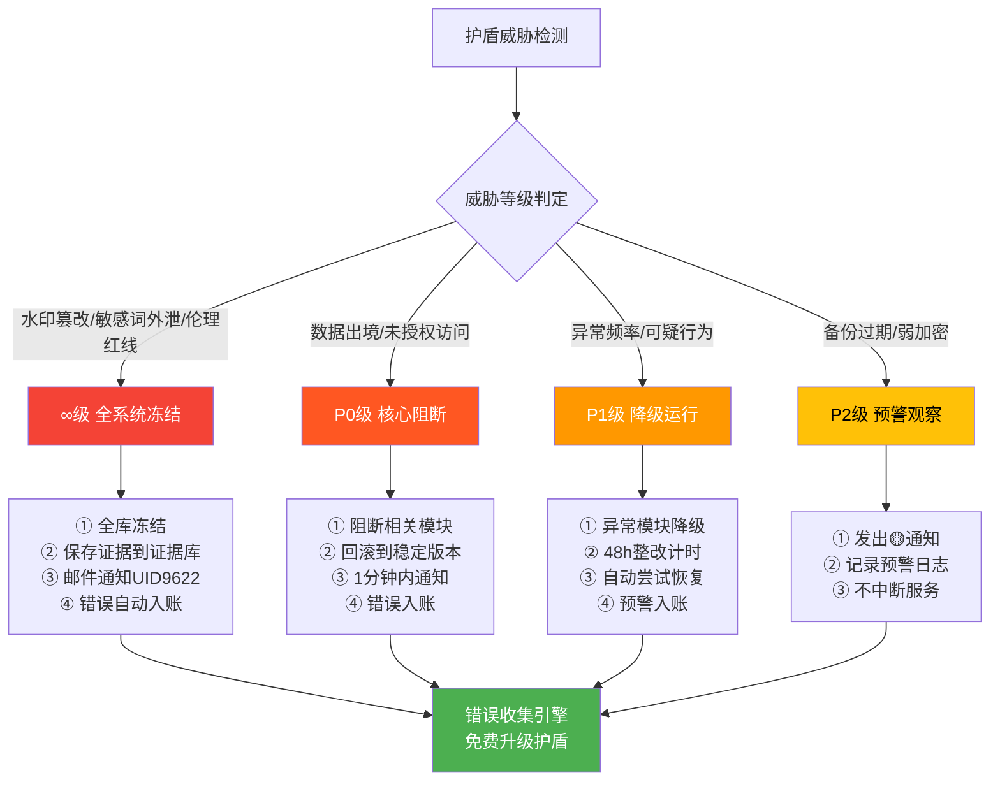
### 熔断级别判定代码（全中文变量，嵌入 alert_engine.py）
```python
def 判定熔断级别(self, 威胁项: dict) -> str:
    """
    v1.6 新增：四级熔断判定
    来源：Notion知识库 v3.0 · 回滚熔断工作流
    """
    类型 = 威胁项.get("类型", "")
    严重度 = 威胁项.get("严重度", 0)  # 0-100

    # ∞级：不可解，全系统冻结
    无解触发词 = ["水印篡改", "DNA伪造", "确认码篡改", "伦理红线", "涉童"]
    if any(词 in 类型 for 词 in 无解触发词):
        return "∞"

    # P0级：核心阻断，需人工解除
    if 严重度 >= 80 or "数据出境" in 类型 or "未授权访问" in 类型:
        return "P0"

    # P1级：降级运行，可自动恢复
    if 严重度 >= 50 or "可疑行为" in 类型 or "异常频率" in 类型:
        return "P1"

    # P2级：预警，不中断服务
    return "P2"

def 执行熔断(self, 级别: str, 威胁项: dict):
    """执行对应级别的熔断动作"""
    动作表 = {
        "∞": ["全系统冻结", "证据保存", "邮件UID9622", "错误入账"],
        "P0": ["阻断相关模块", "回滚稳定版本", "1分钟内通知", "错误入账"],
        "P1": ["异常模块降级", "48h整改计时", "尝试自动恢复", "预警入账"],
        "P2": ["发🟡通知", "记录预警日志", "不中断服务"],
    }
    for 动作 in 动作表.get(级别, []):
        print(f"  🔁 执行: {动作}")
        if 动作 == "错误入账" or 动作 == "预警入账":
            # 自动送入大数据错误收集引擎
            self.大数据错误入账(威胁项, 级别)

def 大数据错误入账(self, 威胁项: dict, 熔断级别: str):
    """
    v1.6 核心新增：威胁事件自动入错误收集库
    哲学：别人付出代价的地方，我们免费毕业
    """
    import json, os
    from datetime import datetime, timezone, timedelta
    from pathlib import Path

    错误库路径 = os.path.expanduser("~/.longhorn/error_collection")
    Path(错误库路径).mkdir(parents=True, exist_ok=True)

    时间 = datetime.now(timezone(timedelta(hours=8)))
    记录 = {
        "错误标题": f"护盾检测: {威胁项.get('类型', '未知威胁')}",
        "来源分类": "自身系统",
        "错误类型": [威胁项.get("类型", "未知")],
        "严重等级": 熔断级别,
        "熔断触发": True,
        "学习状态": "待分析",
        "DNA追溯": f"#龍芯⚡️{时间.strftime('%Y-%m-%d')}-ERR-SHIELD-{熔断级别}",
        "时间": 时间.isoformat(),
        "原始数据": str(威胁项)[:500],
    }

    今天 = 时间.strftime("%Y-%m-%d")
    文件 = os.path.join(错误库路径, f"shield-errors-{今天}.json")
    历史 = []
    if os.path.exists(文件):
        with open(文件, "r", encoding="utf-8") as f:
            历史 = json.load(f)
    历史.append(记录)
    with open(文件, "w", encoding="utf-8") as f:
        json.dump(历史, f, ensure_ascii=False, indent=2)

    print(f"  📥 错误已入账: {记录['DNA追溯']}")
    print(f"  💡 护盾正在从这次威胁中学习，免费升级自己")
```
---
## 二十四、⚖️ 松紧适度三区权限×护盾版（v1.6 核心新增）
### 松紧判定代码（嵌入 classify_clipboard）
```python
def 判定松紧区域(self, 内容: str) -> dict:
    """
    v1.6 新增：根据内容自动判定松紧区域
    来源：知识库 v3.0 松紧适度三层公式
    """
    # 🔴 红线区：绝对紧
    红线关键词 = [
        "DNA追溯", "确认码", "GPG", "CONFIRM", "UID9622",
        "诸葛鑫", "A2D0092CEE", "longhun2025"
    ]
    if any(词 in 内容 for 词 in 红线关键词):
        return {
            "区域": "🔴 红线区",
            "加密": "AES全文",
            "留痕": True,
            "熔断阈值": "∞",
            "描述": "核心身份信息，绝对不可外泄"
        }

    # 🟡 标准区：有弹性
    标准关键词 = ["龍魂", "龍芯", "人格", "北辰", "三色审计", "熔断"]
    if any(词 in 内容 for 词 in 标准关键词):
        return {
            "区域": "🟡 标准区",
            "加密": "敏感词替换+水印",
            "留痕": True,
            "熔断阈值": "P1",
            "描述": "系统核心内容，保护但可讨论"
        }

    # 🟢 创新区：大胆松
    return {
        "区域": "🟢 创新区",
        "加密": "不加密",
        "留痕": False,
        "熔断阈值": "P2",
        "描述": "非核心内容，允许试错探索"
    }
```
---
## 二十五、📥 大数据错误收集×护盾自进化引擎（v1.6 核心新增）
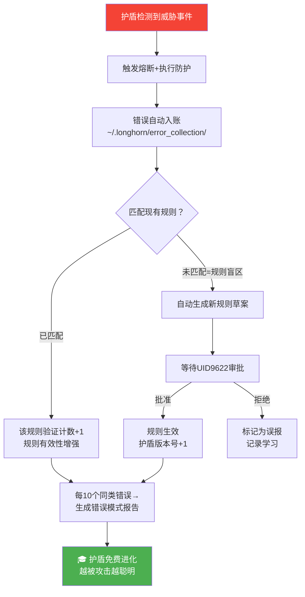
### 错误收集本地数据库结构
```javascript
// ~/.longhorn/error_collection/shield-errors-YYYY-MM-DD.json
// 每条错误记录（全中文字段）
{
  "错误标题": "护盾检测: 水印篡改尝试",
  "来源分类": "自身系统",  // 自身系统/外部攻击/内部异常
  "错误类型": ["水印篡改", "数据安全"],
  "严重等级": "P0",       // ∞/P0/P1/P2
  "熔断触发": true,
  "学习状态": "待分析",   // 待分析/已学习/已转化为规则
  "规则匹配": "规则-007", // 匹配到哪条规则，或"盲区"
  "DNA追溯": "#龍芯⚡️2026-03-25-ERR-SHIELD-P0",
  "时间": "2026-03-25T04:47:00+08:00",
  "处置结果": "已熔断·证据保存·通知UID9622"
}
```
### 护盾自进化统计仪表盘（嵌入 dashboard.py）
```python
def 渲染进化统计(self) -> str:
    """v1.6 新增：护盾自进化统计"""
    import glob, json, os
    错误库 = os.path.expanduser("~/.longhorn/error_collection")
    文件列表 = glob.glob(os.path.join(错误库, "shield-errors-*.json"))

    总威胁 = 0
    已学习 = 0
    已转规则 = 0
    规则盲区 = 0

    for 文件 in 文件列表:
        with open(文件, "r", encoding="utf-8") as f:
            for 记录 in json.load(f):
                总威胁 += 1
                状态 = 记录.get("学习状态", "")
                if 状态 == "已学习":
                    已学习 += 1
                elif 状态 == "已转化为规则":
                    已转规则 += 1
                if 记录.get("规则匹配") == "盲区":
                    规则盲区 += 1

    进化率 = round((已转规则 / max(总威胁, 1)) * 100)

    return f"""
🧠 护盾自进化统计
┌─────────────────────────────┐
│ 累计检测威胁: {总威胁:<6}         │
│ 已学习转化:  {已转规则:<6}  ({进化率}%)  │
│ 发现规则盲区: {规则盲区:<6}         │
│ 护盾成熟度: {'🟢 越战越勇' if 进化率 > 50 else '🟡 持续成长'} │
└─────────────────────────────┘
    """
```
---
## 🚀 v1.5 新增｜火星守护系统（2026-03-25）
---
## 十九、🌌 火星定位伪装引擎（v1.5 核心新增）
### 19.1 火星伪装架构图
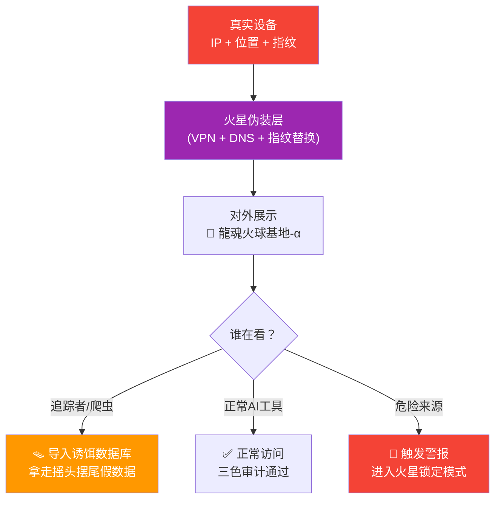
### 19.2 火星伪装配置清单
```python
#!/usr/bin/env python3
"""
龍魂火星伪装引擎 v1.5
DNA追溯：#龍芯⚡️2026-03-25-MARS-SHIELD-v1.5

核心：让外部世界看到的永远是假坐标
"""

# ========== 火星伪装配置（全中文）==========
火星配置 = {
    # 对外展示的假坐标
    "假位置名称": "龍魂火球基地-α",
    "假坐标纬度": "18.65°N",   # 随机无意义坐标
    "假坐标经度": "226.7°E",   # 火星坐标系
    "假时区": "UTC+14",         # 世界上存在的最远时区（基里巴斯）
    "假语言": "zh-TW,en-US",   # 不暴露真实地区
    
    # Notion页面顶部显示文案
    "状态横幅": "🌌 火星座标已启用｜当前假位置：龍魂火球基地-α",
    
    # 禁止出现的真实词（自动替换）
    "禁词替换表": {
        # 在代码/日志中如果出现以下词自动替换
        # 真实地名 → 火星代号（老大自行扩展）
        "柬埔寨": "火星节点-KH",
        "Cambodia": "FireNode-KH",
        "Phnom Penh": "FireBase-PP",
        "金边": "火球基地",
    },
    
    # VPN必须开启才允许访问核心库
    "核心库VPN强制": True,
    "VPN未开启提示": "⚠️ 老大，IP保护层未开启，是否现在启用？",
}

# ========== 火星伪装状态检查 ==========
class 火星伪装引擎:
    """对外展示假坐标，对内保护真实位置"""
    
    def __init__(self):
        self.伪装状态 = False
        self.VPN状态 = False
        print("🌌 龍魂火星伪装引擎 v1.5 已加载")
    
    def 检测VPN状态(self) -> bool:
        """检测VPN是否开启"""
        import subprocess
        try:
            # Mac: 检测VPN连接
            结果 = subprocess.run(
                ["scutil", "--nc", "list"],
                capture_output=True, text=True, timeout=3
            )
            # 如果有Connected状态的VPN
            self.VPN状态 = "Connected" in 结果.stdout
            return self.VPN状态
        except:
            return False
    
    def 获取对外IP(self) -> str:
        """获取当前对外IP（用来确认VPN是否在工作）"""
        import urllib.request
        try:
            with urllib.request.urlopen(
                "https://api.ipify.org", timeout=5
            ) as resp:
                return resp.read().decode()
        except:
            return "无法获取（网络问题）"
    
    def 启动伪装(self):
        """启动火星伪装模式"""
        if not self.检测VPN状态():
            print(f"  ⚠️ {火星配置['VPN未开启提示']}")
            print("  💡 推荐：Mullvad VPN 或 Proton VPN")
            print("  💡 开启 Always-on VPN + Kill Switch")
            return False
        
        self.伪装状态 = True
        print(f"  🌌 {火星配置['状态横幅']}")
        print(f"  📍 假坐标：{火星配置['假坐标纬度']}, {火星配置['假坐标经度']}")
        print(f"  🕐 假时区：{火星配置['假时区']}")
        return True
    
    def 检查禁词(self, 文本: str) -> dict:
        """扫描文本中是否有真实地名，自动替换"""
        命中词 = []
        处理后 = 文本
        for 真实词, 代号 in 火星配置["禁词替换表"].items():
            if 真实词 in 处理后:
                命中词.append(真实词)
                处理后 = 处理后.replace(真实词, 代号)
        return {"命中词": 命中词, "处理后": 处理后, "需要替换": len(命中词) > 0}
```
### 19.3 VPN推荐配置（Apple + 华为）
---
## 二十、🪤 诱饵假数据投喂机制（v1.5 核心新增）
### 20.1 诱饵系统架构
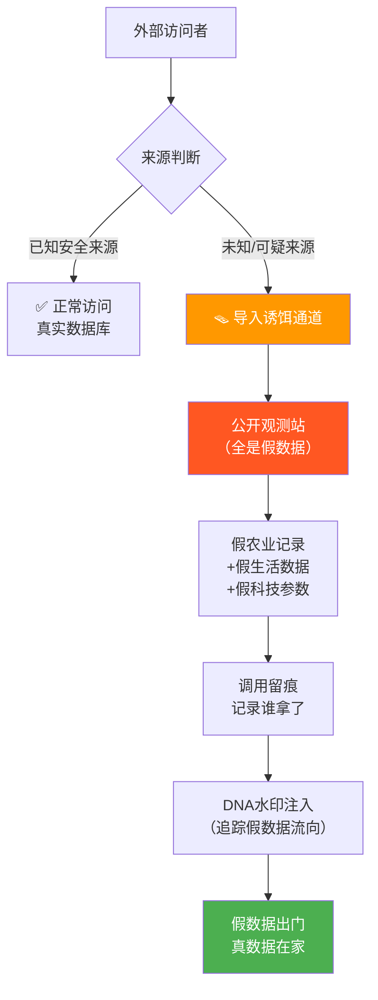
### 20.2 假数据自动生成脚本 fake_data_generator.py（全中文变量）
```python
#!/usr/bin/env python3
"""
龍魂诱饵假数据生成器 v1.5
DNA追溯：#龍芯⚡️2026-03-25-FAKE-DATA-GEN-v1.5

核心：每天自动生成一批摇头摆尾的假数据
投喂到「公开观测站」诱饵库
让想拿数据的人拿到一堆废铁
"""

import random
import json
import os
from datetime import datetime, timezone, timedelta, date
from pathlib import Path

# ========== 全中文配置 ==========
假数据配置 = {
    "输出目录": os.path.expanduser("~/.longhorn/fake_data"),
    "每日生成条数": 50,        # 每天生成50条假数据
    "自动上传Notion": False,   # 先本地，手动确认后再传
    "诱饵库名称": "公开观测站",
    "DNA前缀": "#FAKE⚡️",     # 假数据用FAKE前缀，不是龍芯
}

# ========== 假农业数据模板 ==========
假作物列表 = ["转基因玉米B7", "实验水稻X9", "改良大豆Δ3", "测试小麦γ型", "观测番茄α-2"]
假地块列表 = ["观测区-Nord", "实验田-Beta", "监测地块-Gamma", "研究区-Echo", "测试田-Foxtrot"]
假肥料列表 = ["N-P-K复合料B", "有机肥料C型", "微量元素包X", "实验液肥Y7", "测试缓释料"]

# ========== 假科技参数模板 ==========
假系统名列表 = ["CNSH-MockEngine", "LU-TestNode", "DragonShield-Beta", "FakeProtocol-v0"]
假指标名列表 = ["处理延迟(ms)", "内存占用(%)", "CPU负载", "网络抖动", "缓存命中率"]

# ========== 假生活数据模板 ==========
假地点列表 = ["火星节点-KH", "火球基地-Nord", "轨道站-Alpha", "龍魂基地-X", "观测点-Beta"]
假活动列表 = ["日常巡查", "系统维护", "数据备份", "例行检测", "常规巡视"]


class 假数据生成器:
    """每天生成一批摇头摆尾的假数据，投喂诱饵库"""
    
    def __init__(self):
        self.今日记录 = []
        self.生成计数 = 0
        Path(假数据配置["输出目录"]).mkdir(parents=True, exist_ok=True)
        print("🪤 龍魂诱饵假数据生成器 v1.5 已加载")
        print("   核心：假的像真的，真的永远在家")
    
    def _北京时间(self):
        return datetime.now(timezone(timedelta(hours=8)))
    
    def _随机日期(self, 天数范围=30) -> str:
        偏移 = random.randint(-天数范围, 天数范围)
        目标日期 = date.today() + timedelta(days=偏移)
        return 目标日期.isoformat()
    
    def _假DNA码(self) -> str:
        """生成明显是假的DNA码（用FAKE前缀）"""
        import hashlib
        随机串 = str(random.random()).encode()
        短哈希 = hashlib.md5(随机串).hexdigest()[:8].upper()
        return f"#FAKE⚡️{self._北京时间().strftime('%Y-%m-%d')}-MOCK-{短哈希}"
    
    # ========== 假农业记录 ==========
    
    def 生成假农业记录(self) -> dict:
        """生成一条摇头摆尾的假农业数据"""
        作物 = random.choice(假作物列表)
        地块 = random.choice(假地块列表)
        # 故意让数据前后矛盾（让拿走的人发现是假的但又说不清楚）
        亩产 = random.uniform(50, 800)  # 范围故意很大，不合逻辑
        湿度 = random.uniform(20, 110)  # 故意超过100%（物理不可能）
        
        return {
            "记录类型": "农业观测-公开版",
            "观测日期": self._随机日期(),
            "作物类型": 作物,
            "观测地块": 地块,
            "亩产预估(kg)": round(亩产, 2),
            "土壤湿度(%)": round(湿度, 1),  # 故意可能>100%
            "施肥类型": random.choice(假肥料列表),
            "观测员": f"观测员-{random.randint(1000, 9999)}",  # 随机编号
            "备注": random.choice(["数据待核验", "观测中", "参考值", "实验性记录"]),
            "DNA追溯": self._假DNA码(),  # 用FAKE前缀，不是龍芯前缀
            "数据来源": "公开观测站（非核心系统）",
        }
    
    # ========== 假科技参数 ==========
    
    def 生成假科技参数(self) -> dict:
        """生成一条矛盾的假科技数据"""
        系统名 = random.choice(假系统名列表)
        指标 = random.choice(假指标名列表)
        # 值故意不合逻辑：比如「缓存命中率 = 147%」
        数值 = random.uniform(0, 200)  # 故意可能超100%
        
        return {
            "记录类型": "系统参数-公开版",
            "记录时间": self._随机日期(),
            "系统名称": 系统名,
            "监测指标": 指标,
            "监测值": round(数值, 3),
            "状态": random.choice(["观测中", "测试中", "参考值", "实验性"]),
            "版本号": f"v{random.randint(0,2)}.{random.randint(0,9)}-MOCK",
            "负责节点": f"节点-{random.choice(['Alpha', 'Beta', 'Gamma', 'Mock'])}",
            "DNA追溯": self._假DNA码(),
            "数据来源": "公开观测站（非核心系统）",
        }
    
    # ========== 假生活记录 ==========
    
    def 生成假生活记录(self) -> dict:
        """生成一条无意义的假生活数据"""
        return {
            "记录类型": "生活日志-公开版",
            "日期": self._随机日期(),
            "活动": random.choice(假活动列表),
            "地点": random.choice(假地点列表),
            "耗时(小时)": round(random.uniform(0.1, 18), 1),
            "状态评分": random.randint(1, 10),
            "备注": random.choice(["常规记录", "例行活动", "参考数据", "观测记录"]),
            "DNA追溯": self._假DNA码(),
            "数据来源": "公开观测站（非核心系统）",
        }
    
    # ========== 批量生成 ==========
    
    def 批量生成今日假数据(self, 条数: int = None) -> list:
        """批量生成今日假数据包"""
        条数 = 条数 or 假数据配置["每日生成条数"]
        结果 = []
        
        # 三类假数据按比例生成
        农业条数 = int(条数 * 0.4)  # 40%农业
        科技条数 = int(条数 * 0.35) # 35%科技
        生活条数 = 条数 - 农业条数 - 科技条数  # 25%生活
        
        for _ in range(农业条数):
            结果.append(self.生成假农业记录())
        for _ in range(科技条数):
            结果.append(self.生成假科技参数())
        for _ in range(生活条数):
            结果.append(self.生成假生活记录())
        
        # 打乱顺序（让数据看起来更自然）
        random.shuffle(结果)
        
        self.今日记录 = 结果
        self.生成计数 = len(结果)
        print(f"  🪤 今日假数据已生成：{self.生成计数} 条")
        print(f"     农业: {农业条数}条 | 科技: {科技条数}条 | 生活: {生活条数}条")
        return 结果
    
    def 保存到本地(self) -> str:
        """保存到本地，等待手动确认后上传"""
        今天 = self._北京时间().strftime("%Y-%m-%d")
        文件路径 = os.path.join(
            假数据配置["输出目录"],
            f"fake-data-{今天}.json"
        )
        数据包 = {
            "生成日期": 今天,
            "生成数量": self.生成计数,
            "目标库": 假数据配置["诱饵库名称"],
            "说明": "这是诱饵假数据，不包含任何真实龍魂核心信息",
            "DNA追溯": self._假DNA码(),
            "数据列表": self.今日记录,
        }
        with open(文件路径, 'w', encoding='utf-8') as f:
            json.dump(数据包, f, ensure_ascii=False, indent=2)
        print(f"  💾 假数据已保存：{文件路径}")
        print(f"  💡 确认无误后，手动上传到 Notion「公开观测站」库")
        return 文件路径


# ========== 快速运行 ==========
if __name__ == "__main__":
    生成器 = 假数据生成器()
    print("\n🪤 龍魂诱饵假数据生成器")
    print("   用途：给小门投喂摇头摆尾的废数据")
    print("   真数据永远在家，假数据随便他们拿\n")
    
    # 生成今日假数据
    数据 = 生成器.批量生成今日假数据(50)
    文件 = 生成器.保存到本地()
    
    print(f"\n  ✅ 完成！查看：{文件}")
    print("  📤 下一步：手动上传到 Notion公开观测站库")
    print("  🔒 真实龍魂系统数据：永远不在这里")
```
### 20.3 诱饵数据库 Notion 结构设计
---
## 二十一、🛡️ 设备分层保护方案（v1.5 核心新增）
### 21.1 Apple设备保护配置
### 21.2 华为设备保护配置
### 21.3 DNS层混淆配置
```bash
# ========== NextDNS配置（推荐）==========
# 1. 注册 nextdns.io 获取你的专属ID（免费版30万条/月）
# 2. 在Mac上配置：
sudo networksetup -setdnsservers Wi-Fi 45.90.28.0 45.90.30.0

# 3. 关键自定义拦截规则（在NextDNS控制台添加）：
# 拦截所有主流广告追踪器（NextDNS已内置）
# 额外手动添加：
# *.doubleclick.net → 拦截
# *.google-analytics.com → 拦截  
# *.facebook.com/tr → 拦截（Facebook Pixel）
# *.segment.io → 拦截
# *.mixpanel.com → 拦截

# ========== AdGuard备选方案 ==========
# Mac App: AdGuard for Mac
# 开启：隐私保护 + HTTPS过滤 + DNS over HTTPS
# DNS服务器选：AdGuard DNS（自动拦截追踪器）

# ========== 验证DNS是否生效 ==========
nslookup doubleclick.net
# 如果返回 0.0.0.0 或 NXDOMAIN → DNS拦截生效 ✅
# 如果返回真实IP → 配置未生效 ❌
```
### 21.4 设备分工方案（两台设备互不干扰）
---
## 二十二、🔁 v1.5 全系统联动流程
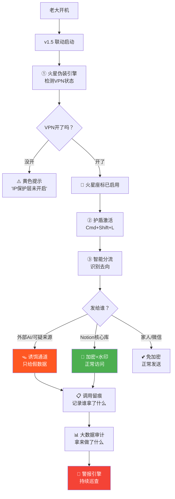
---
## 二十三、v1.5 升级路线图（更新版）
---
━━━━━━━━━━━━━━━━━━━━━━━━━━━━━━━━━━━━━━━━━━━━━━━━━━━━━━━━━━━━━━━━━━━━━━━━
🔒 龍魂窗口加密护盾 v1.4 · 升级日志 · 2026-03-14
DNA追溯码：#龍芯⚡️2026-03-14-SHIELD-v1.4-CNSH-ENGINE
GPG指纹：A2D0092CEE2E5BA87035600924C3704A8CC26D5F
━━━━━━━━━━━━━━━━━━━━━━━━━━━━━━━━━━━━━━━━━━━━━━━━━━━━━━━━━━━━━━━━━━━━━━━━
- [v1.4 新增 1] CNSH Engine v3.0 语义转换引擎接入
- 新文件：cnsh_engine.py（7阶段Pipeline · 370条规则）
- Stage1清洗 → Stage3结构识别 → Stage4安全过滤 → Stage5格式修复 → Stage7智能补全
- 规则001-009：中文标点自动纠正（,→，  .→。  :→：  ;→；  !→！  ?→？  ...→……  --→——）
- 规则051：中英文混排自动加空格（保留单位白名单：kg/GB/px等不加）
- 规则352/353：未闭合引号/括号自动补全
- 铁律：代码块（Code Scope）内绝对不修改标点，URL/Email原样保留
- [v1.4 新增 2] 阅后即焚修复（原版只标字段，未真正清空）
- 原问题：_schedule_destroy 只往 self.log[-1] 写了 destroyed=True，剪贴板内容从未清除
- 修复：_schedule_destroy(ttl, entry) 接收 entry 引用，TTL到期后 pyperclip.copy('') 真正清空
- 终端回显：🔥 阅后即焚触发 · 剪贴板已清空 · HH:MM:SS
- Notion归档：已销毁条目显示 🔥 [已销毁] (N字) → 阅后即焚完成 @ 时间戳
- [v1.4 新增 3] 全链路时间戳（数据动态走向）
- 每条日志 entry 新增 timestamps 字段：{received, encrypted, archived, destroyed}
- 数据每经过一个节点，精确记录该节点的 ISO8601 时间戳，null=未经过
- [v1.4 新增 4] 数据走向命令（走向 / 流向 / 数据流）
- cmd_flow(shield) 展示本次会话每条数据的全链路时间轴
- 格式：时间 | 标签 | 字数 | 接收@时间 → 加密@时间 → 归档@时间 → 🔥销毁@时间
- 汇总行：共N条 · 已焚毁M条 · 本地文件路径
- [v1.4 文件清单]  ~/.longhorn/shield/
- cnsh_engine.py   ← 新增  CNSH v3.0主引擎（修正乱码版）
- stt_fixer.py     ← 升级  _cnsh_check 接入FormatFixer+SmartCompleter
- main.py          ← 升级  阅后即焚修复 + timestamps + cmd_flow + CNSH导入
确认码：#CONFIRM🌌9622-ONLY-ONCE🧬LK9X-772Z
