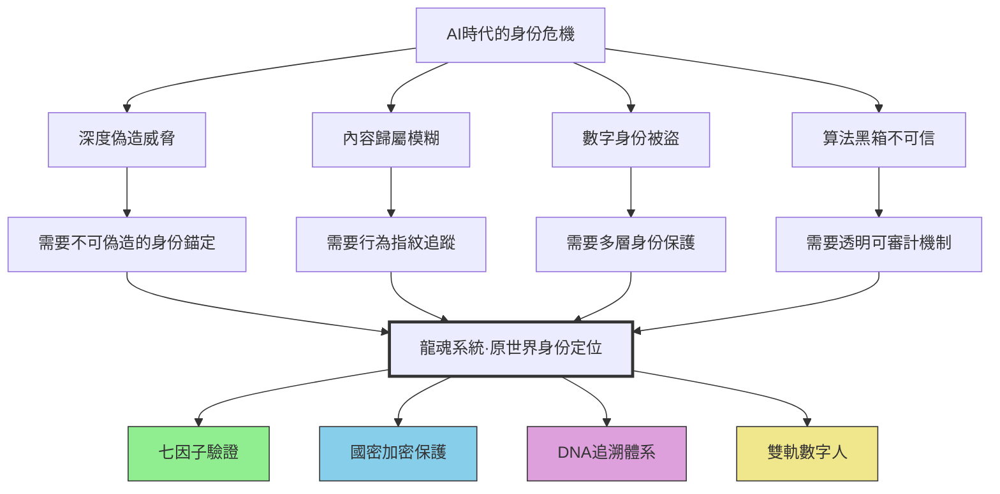
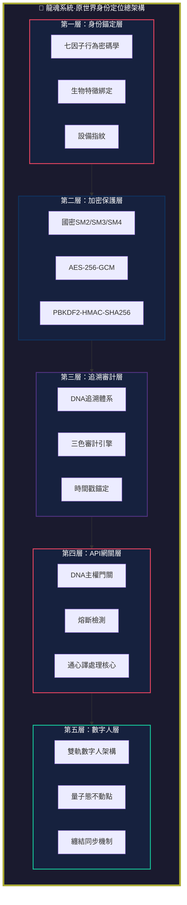
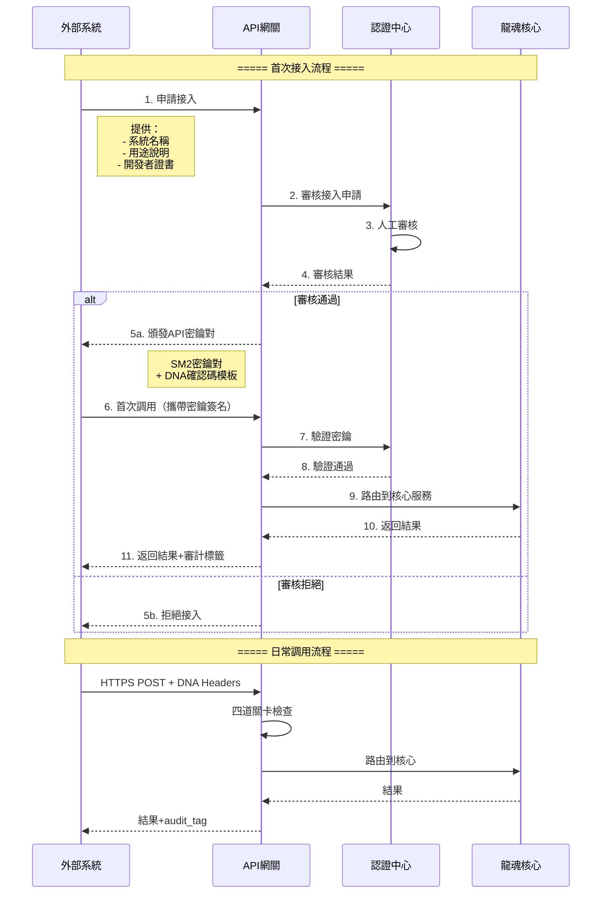
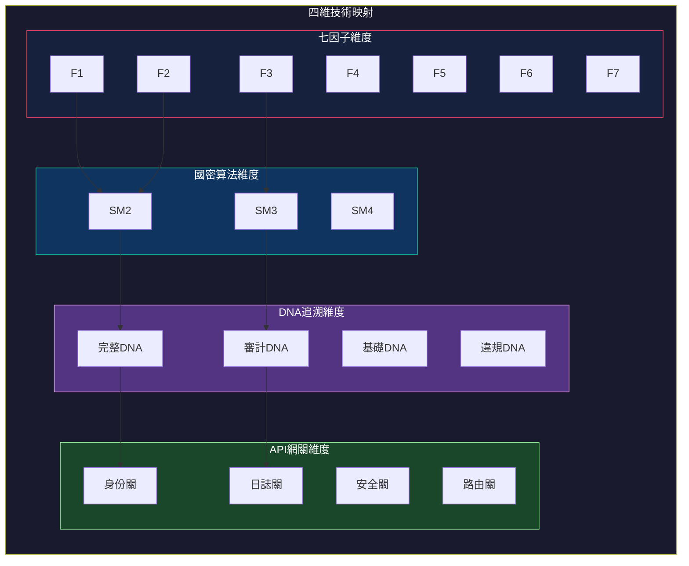
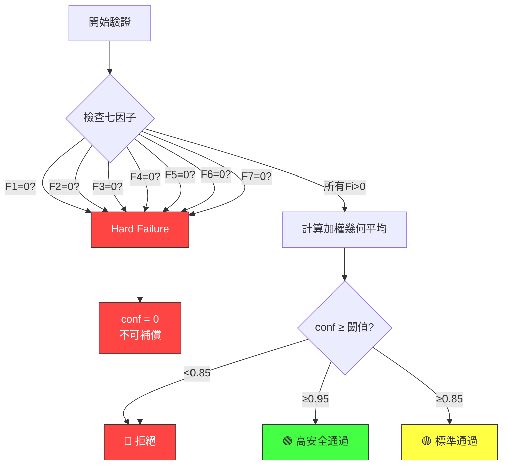
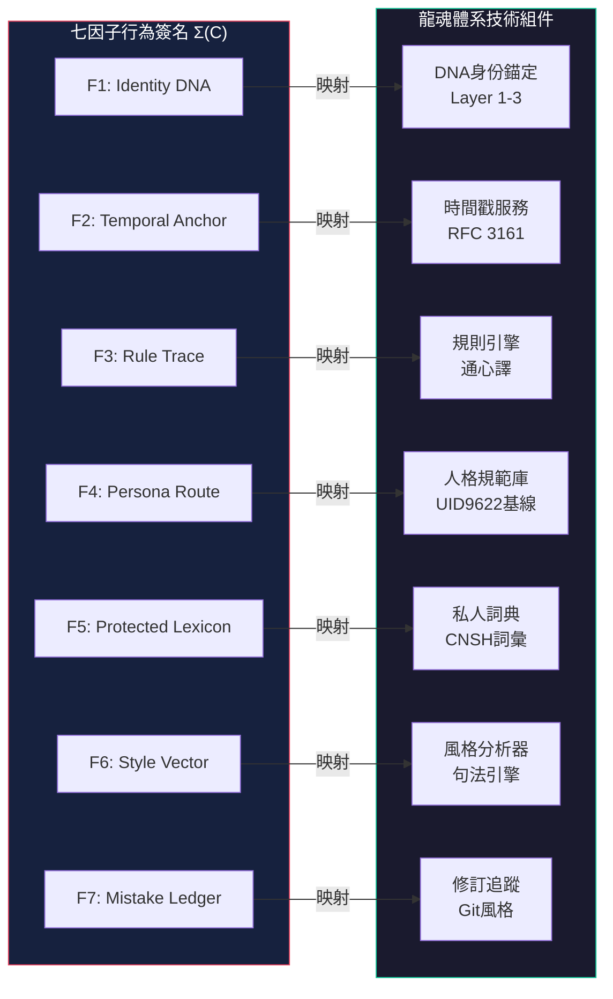

# 🧬 龍魂系統·原世界身份定位總綱 v9.0 | 七因子×國密×DNA×API四維整合

> Notion URL: https://app.notion.com/p/v9-0-DNA-API-3937125a9c9f81dbbdf8c8f137551e13
> Created: 2026-07-04T08:09:00.000Z
> Last edited: 2026-07-04T08:24:00.000Z
> Archived at: 2026-08-12T01:40:45.558086
## LongHun System · Original World Identity Positioning Framework v9.0
體系代號：UID9622
密級：#P0-鎖定 | #極高敏感 | #UID9622-專屬
---
---
> 核心定位：將Web3-DNA記憶主權交易算法v8.0/v8.1/v9.0的身份層與龍魂體系深度整合，構建"原世界身份定位"完整技術文檔，涵蓋七因子密碼學、DNA對齊、國密算法加密（SM2/SM3/SM4）、API統一入口。
本頁面由AI協助生成，所有技術參數均經過人類專家審核確認。
# 使用示例
if name == "main":
```javascript

### 7.4 量子態固化流程

```
sequenceDiagram
```javascript

---

## 8. 系統接入缺口設計

### 8.1 插件接口規範

> **普通話解釋**：系統接入缺口是指龍魂系統預留的「擴展接口」，讓其他系統可以在不改變核心代碼的情況下，接入龍魂系統的身份驗證能力。就像電腦的USB接口——你可以插各種設備，但電腦的核心不會被改動。所有接入都必須通過DNA主權門關的認證。

```
graph TB
```javascript

### 8.2 MCP協議擴展點

```
# MCP協議擴展點規範
# MCP Protocol Extension Points
from typing import Dict, Any, Callable, List
from abc import ABC, abstractmethod
class 龍魂MCP擴展(ABC):
# 示例：七因子查詢插件
class 七因子查詢插件(龍魂MCP擴展):
# MCP擴展管理器
class MCP擴展管理器:
```javascript

```
## 4. 國密算法加密層
### 4.1 國密算法概覽
> 普通話解釋：國密算法是中國自主研發的密碼學算法，相當於中國版的「加密工具箱」。它包含三個核心算法：SM2用於數字簽名（類似於給文件蓋電子印章）、SM3用於計算哈希摘要（類似於給文件生成唯一指紋）、SM4用於對稱加密（類似於用一把鑰匙鎖住和打開文件）。龍魂系統使用這三個算法來保護身份數據的安全。
龍魂系統採用國家密碼管理局發布的商用密碼標準（GM/T系列）：
### 4.2 SM2 非對稱簽名引擎
技術規格：
SM2是中國自主設計的橢圓曲線公鑰密碼算法。其曲線參數為：
```javascript
曲線方程：y² = x³ + ax + b (mod p)

其中：
p = FFFFFFFEFFFFFFFFFFFFFFFFFFFFFFFFFFFFFFFF00000000FFFFFFFFFFFFFFFF
a = FFFFFFFEFFFFFFFFFFFFFFFFFFFFFFFFFFFFFFFF00000000FFFFFFFFFFFFFFFC
b = 28E9FA9E9D9F5E344D5A9E4BCF6509A7F39789F515AB8F92DDBCBD414D940E93
n = FFFFFFFEFFFFFFFFFFFFFFFFFFFFFFFF7203DF6B21C6052B53BBF40939D54123
Gx = 32C4AE2C1F1981195F9904466A39C9948FE30BBFF2660BE1715A4589334C74C7
Gy = BC3736A2F4F6779C59BDCEE36B692153D0A9877CC62A474002DF32E52139F0A0
```
```python
# SM2 數字簽名引擎
# 用途：為DNA追溯碼和內容製品提供數字簽名

from gmssl import sm2, func  # 國密算法庫
import os

class SM2簽名引擎:
    """
    SM2 非對稱簽名引擎
    
    功能：
    1. 生成SM2密鑰對（私鑰+公鑰）
    2. 使用私鑰對數據進行數字簽名
    3. 使用公鑰驗證簽名
    4. 與七因子系統集成
    """
    
    def __init__(self, 私鑰: str = None, 公鑰: str = None):
        """
        初始化SM2引擎
        
        參數：
            私鑰: SM2私鑰（HEX字符串，32字節=64個HEX字符）
            公鑰: SM2公鑰（HEX字符串，65字節=130個HEX字符，含04前綴）
        """
        if 私鑰 and 公鑰:
            self.sm2_crypt = sm2.CryptSM2(public_key=公鑰, private_key=私鑰)
            self.私鑰 = 私鑰
            self.公鑰 = 公鑰
        else:
            self.私鑰 = None
            self.公鑰 = None
            self.sm2_crypt = None
    
    def 生成密鑰對(self) -> tuple:
        """
        生成新的SM2密鑰對
        
        返回：(私鑰, 公鑰)
        """
        # 生成隨機私鑰（256位）
        私鑰 = os.urandom(32).hex()
        
        # 計算對應的公鑰
        # SM2使用推薦曲線參數
        sm2_crypt = sm2.CryptSM2(public_key="", private_key=私鑰)
        公鑰 = sm2_crypt._kg(int(私鑰, 16), 
                             sm2.default_ecc_table['g'])
        
        self.私鑰 = 私鑰
        self.公鑰 = '04' + 公鑰
        self.sm2_crypt = sm2.CryptSM2(public_key=self.公鑰, private_key=self.私鑰)
        
        return (self.私鑰, self.公鑰)
    
    def 簽名(self, 數據: bytes) -> str:
        """
        使用私鑰對數據進行SM2數字簽名
        
        參數：
            數據: 待簽名的原始數據（bytes）
        
        返回：
            簽名結果（HEX字符串，包含r和s兩個分量）
        """
        if not self.sm2_crypt:
            raise ValueError("密鑰對未初始化")
        
        # 先計算SM3哈希
        數據哈希 = sm3.哈希(數據)
        
        # 使用私鑰簽名
        簽名值 = self.sm2_crypt.sign(bytes.fromhex(數據哈希), self.私鑰)
        
        return 簽名值
    
    def 驗證簽名(self, 數據: bytes, 簽名值: str) -> bool:
        """
        使用公鑰驗證SM2數字簽名
        
        參數：
            數據: 原始數據（bytes）
            簽名值: SM2簽名（HEX字符串）
        
        返回：
            True=簽名有效, False=簽名無效
        """
        if not self.sm2_crypt:
            raise ValueError("公鑰未初始化")
        
        # 計算數據哈希
        數據哈希 = sm3.哈希(數據)
        
        # 驗證簽名
        try:
            return self.sm2_crypt.verify(簽名值, bytes.fromhex(數據哈希))
        except Exception:
            return False
    
    def 為DNA追溯碼簽名(self, dna碼: str) -> str:
        """
        專用方法：為DNA追溯碼生成數字簽名
        
        這是龍魂系統的核心操作：每個DNA追溯碼都必須有SM2簽名保護
        """
        dna字節 = dna碼.encode('utf-8')
        return self.簽名(dna字節)


# 使用示例
if __name__ == "__main__":
    # 創建SM2引擎
    引擎 = SM2簽名引擎()
    
    # 生成密鑰對
    私鑰, 公鑰 = 引擎.生成密鑰對()
    print(f"私鑰: {私鑰[:16]}...{私鑰[-16:]}")  # 只顯示部分
    print(f"公鑰: {公鑰[:20]}...{公鑰[-16:]}")
    
    # 為DNA追溯碼簽名
    dna碼 = "#龍芯⚡️2025-07-04-JPG-企業A-v1.0"
    簽名 = 引擎.為DNA追溯碼簽名(dna碼)
    print(f"DNA碼: {dna碼}")
    print(f"SM2簽名: {簽名[:30]}...")
    
    # 驗證簽名
    結果 = 引擎.驗證簽名(dna碼.encode('utf-8'), 簽名)
    print(f"簽名驗證結果: {'✅ 通過' if 結果 else '❌ 失敗'}")
```
### 4.3 SM3 哈希摘要引擎
技術規格：
SM3是中國自主設計的密碼學哈希函數，輸出256位（32字節）的哈希值。其設計類似於SHA-256，但在壓縮函數和消息擴展部分有不同的設計選擇。
```javascript
SM3 算法參數：
- 輸出長度：256位（32字節）
- 分組長度：512位（64字節）
- 字長度：32位
- 迭代次數：64輪
- 填充方式：Merkle-Damgard 結構
```
```python
# SM3 哈希摘要引擎
# 用途：為所有數據生成唯一指紋，確保完整性

from gmssl import sm3
import json

class SM3哈希引擎:
    """
    SM3 哈希摘要引擎
    
    功能：
    1. 計算任意數據的SM3哈希值
    2. 為DNA追溯碼生成驗證摘要
    3. 構建哈希鏈（Hash Chain）實現不可篡改
    4. 與七因子系統集成
    """
    
    def 計算哈希(self, 數據: bytes) -> str:
        """
        計算數據的SM3哈希值
        
        參數：
            數據: 任意二進制數據
        
        返回：
            SM3哈希值（64個HEX字符 = 256位）
        """
        return sm3.sm3_hash(func.bytes_to_list(數據))
    
    def 計算文件哈希(self, 文件路徑: str) -> str:
        """
        計算文件的SM3哈希值
        
        參數：
            文件路徑: 待計哈希的文件路徑
        
        返回：
            SM3哈希值
        """
        with open(文件路徑, 'rb') as f:
            數據 = f.read()
        return self.計算哈希(數據)
```
## 2. 身份定位總覽
### 2.1 什麼是「原世界身份定位」
> 普通話解釋：想像你在一個充滿AI生成內容的世界裡，怎麼證明「這段話真的是我寫的」？「原世界身份定位」就是給你一套數字化的「身份指紋」，讓任何人都能驗證這個內容確實來自你，而不是AI冒充的。就像現實中的身份證，但比身份證更強大——它無法偽造、無法複製、且全程受密碼學保護。
技術定義：原世界身份定位（Original World Identity Positioning, OWIP）是一種基於七因子行為密碼學、國密算法合規審計、DNA追溯體系、API主權門關、CNSH加密技術棧和雙軌數字人架構的綜合性身份驗證框架。其核心目標是建立一個不可破解、不可偽造、不可轉讓的數字身份錨點，確保在AI時代能夠可靠地證明「我是我」。
龍魂系統的核心洞察：
```javascript
「我是不是做一個不可破解的身份，就可以搞定了這一系列問題呢。
 唯有這個我們的系統才是有真正價值了。」
 
 —— UID9622，龍魂體系創立者
```
### 2.2 為什麼需要原世界身份定位

### 2.3 核心價值主張
龍魂系統的原世界身份定位提供四大核心價值：
價值一：不可偽造性（Unforgeability）
- 基於生物特徵（Layer 1）+ 設備綁定（Layer 2）+ 零知識證明（Layer 3）
- 即使攻擊者獲得全部源代碼，也無法偽造身份驗證結果
- 七因子中任一因子為零 → 整體置信度立即歸零（Hard Failure）
價值二：全程可審計（Full Auditability）
- 三色審計系統覆蓋所有數據流
- DNA追溯碼貫穿內容全生命週期（創建→傳輸→存儲→驗證）
- 國密SM2/SM3/SM4確保加密合規
價值三：主權可控（Sovereign Control）
- DNA主權門關確保只有授權實體能調用系統
- 七條紅線（絕對不開放）保障核心安全
- 雙軌數字人確保虛擬代體永遠受實體原型控制
價值四：量子態永恆（Quantum Eternal State）
- 身份參數在首次綁定時「塌縮」為永恆量子態
- 之後所有顯示都是「讀」不是「算」
- 防止算法漂移和參數篡改
### 2.4 系統總架構圖

---
## 3. 七因子身份密碼學
### 3.1 理論基礎
> 普通話解釋：七因子身份密碼學就像是給每個人設計了一套「行為指紋」。傳統的指紋只有一種（比如密碼或者指紋識別），但七因子有七種不同的「行為特徵」來確認你的身份。這七個因子加在一起，就像七把不同的鎖，必須同時打開才能證明「你真的是你」。
來源：BehavCrypto FULL_PAPER_v1.0_Body_Draft.md · Def 3.2–3.4
七因子行為密碼學是龍魂系統的核心身份驗證引擎。它將內容製品的作者身份轉化為一組可量化、可驗證、不可偽造的數學特徵。
### 3.2 定義 3.2 — 行為簽名 Σ(C)
數學定義：
對於任意內容製品 C（Content Artifact），其行為簽名（Behavioral Signature）定義為七元組：
```javascript
Σ(C) = (F1(C), F2(C), F3(C), F4(C), F5(C), F6(C), F7(C))
```
其中每個 Fi(C) ∈ [0,1] 為第 i 個因子的置信度得分（Confidence Score）。
七因子詳解表：
```python
# 七因子行為簽名計算器
# 輸入：內容製品 C（文本/圖片/視頻）
# 輸出：七元組 Σ(C) = (F1, F2, F3, F4, F5, F6, F7)

import hashlib
from typing import Tuple, List
from dataclasses import dataclass

@dataclass
class 內容製品:
    """內容製品數據結構"""
    原始內容: bytes           # 內容的二進制表示
    創建時間戳: float         # Unix時間戳
    作者UID: str              # 作者唯一標識
    GPG簽名: bytes            # GPG數字簽名
    規則日誌: List[str]       # 轉換規則應用記錄
    修訂歷史: List[dict]      # 版本修訂記錄

class 七因子引擎:
    """
    七因子行為簽名計算引擎
    這是龍魂系統的核心驗證組件
    """
    
    # 七因子權重配置（總和為1.0）
    權重 = {
        'F1': 0.25,   # 身份DNA — 最高權重，身份綁定是核心
        'F2': 0.15,   # 時間錨點 — 防止重放攻擊
        'F3': 0.15,   # 規則軌跡 — 確保轉換可追蹤
        'F4': 0.15,   # 人格路徑 — 人格一致性
        'F5': 0.10,   # 受保護詞彙 — 創作者專屬標記
        'F6': 0.12,   # 風格向量 — 寫作指紋
        'F7': 0.08,   # 錯誤賬本 — 真實性驗證
    }
    
    def 計算行為簽名(self, C: 內容製品) -> Tuple[float, ...]:
        """
        計算內容製品 C 的七因子行為簽名
        返回七元組 (F1, F2, F3, F4, F5, F6, F7)
        """
        F1 = self._計算F1_身份DNA(C)
        F2 = self._計算F2_時間錨點(C)
        F3 = self._計算F3_規則軌跡(C)
        F4 = self._計算F4_人格路徑(C)
        F5 = self._計算F5_受保護詞彙(C)
        F6 = self._計算F6_風格向量(C)
        F7 = self._計算F7_錯誤賬本(C)
        return (F1, F2, F3, F4, F5, F6, F7)
    
    def _計算F1_身份DNA(self, C: 內容製品) -> float:
        """
        F1: Identity DNA — 身份DNA因子
        驗證GPG簽名的有效性，確認內容與UID的綁定關係
        """
        if not C.GPG簽名:
            return 0.0  # 無簽名 = Hard Failure
        
        # 驗證GPG簽名（這裡調用GPG庫進行實際驗證）
        簽名有效 = self._驗證GPG簽名(C.原始內容, C.GPG簽名, C.作者UID)
        UID匹配 = (C.作者UID == "9622")  # UID9622專屬
        
        if 簽名有效 and UID匹配:
            return 1.0
        elif 簽名有效 and not UID匹配:
            return 0.3  # 簽名有效但UID不匹配，大幅降低置信度
        else:
            return 0.0  # 簽名無效 = Hard Failure
    
    def _計算F2_時間錨點(self, C: 內容製品) -> float:
        """
        F2: Temporal Anchor — 時間錨點因子
        驗證時間戳的一致性和合理性
        """
        import time
        當前時間 = time.time()
        
        # 時間不能是未來
        if C.創建時間戳 > 當前時間:
            return 0.0  # 未來時間 = 無效
        
        # 時間不能太古老（超過5年視為異常）
        if 當前時間 - C.創建時間戳 > 5 * 365 * 24 * 3600:
            return 0.1  # 極老的時間戳
        
        # 檢查可信時間戳（RFC 3161）
        if self._驗證可信時間戳(C):
            return 1.0
        
        return 0.7  # 普通時間戳，中等置信度
    
    def _計算F3_規則軌跡(self, C: 內容製品) -> float:
        """
        F3: Rule Trace — 規則軌跡因子
        驗證內容生成過程中是否遵循了文檔化的轉換規則
        """
        if not C.規則日誌:
            return 0.5  # 無規則日誌，中性得分
        
        # 分析規則日誌的完整性
        規則數量 = len(C.規則日誌)
        規則連貫性 = self._分析規則連貫性(C.規則日誌)
        
        return min(1.0, 0.3 + 規則數量 * 0.1) * 規則連貫性
    
    def _計算F4_人格路徑(self, C: 內容製品) -> float:
        """
        F4: Persona Route — 人格路徑因子
        驗證內容是否符合已知的作者人格特徵
        """
        # 提取內容的人格特徵向量
        當前人格向量 = self._提取人格向量(C.原始內容)
        
        # 與基線人格規範對比
        基線向量 = self._載入人格基線(C.作者UID)
        
        # 計算餘弦相似度
        相似度 = self._餘弦相似度(當前人格向量, 基線向量)
        return max(0.0, min(1.0, 相似度))
    
    def _計算F5_受保護詞彙(self, C: 內容製品) -> float:
        """
        F5: Protected Lexicon — 受保護詞彙因子
        檢測創作者專用詞彙的使用模式
        """
        私人詞典 = self._載入私人詞典(C.作者UID)
        if not 私人詞典:
            return 0.5  # 無私人詞典，中性得分
        
        內容文本 = C.原始內容.decode('utf-8', errors='ignore')
        匹配詞數 = sum(1 for 詞 in 私人詞典 if 詞 in 內容文本)
        匹配率 = 匹配詞數 / len(私人詞典) if 私人詞典 else 0
        
        return min(1.0, 匹配率 * 2)  # 匹配率越高越好，但上限為1
    
    def _計算F6_風格向量(self, C: 內容製品) -> float:
        """
        F6: Style Vector — 風格向量因子
        分析寫作風格的數學指紋
        """
        # 提取句法模式特徵
        句法特徵 = self._提取句法模式(C.原始內容)
        
        # 提取結構習慣特徵
        結構特徵 = self._提取結構習慣(C.原始內容)
        
        # 與風格基線對比
        風格基線 = self._載入風格基線(C.作者UID)
        
        風格相似度 = self._計算風格相似度(
            句法特徵 + 結構特徵,
            風格基線
        )
        return max(0.0, min(1.0, 風格相似度))
    
    def _計算F7_錯誤賬本(self, C: 內容製品) -> float:
        """
        F7: Mistake Ledger — 錯誤賬本因子
        驗證錯誤和修正模式的真实性
        """
        if not C.修訂歷史:
            return 0.5  # 無修訂歷史，中性得分
        
        # 分析修訂歷史的自然性
        修訂模式分數 = self._分析修訂模式(C.修訂歷史)
        
        # 真實的修訂歷史應該有合理的模式
        # （不是完美的，也不是完全隨機的）
        return 修訂模式分數
    
    # 輔助方法（簡化實現）
    def _驗證GPG簽名(self, 內容, 簽名, UID):
        """調用GPG庫驗證簽名"""
        # 實際實現中調用 gnupg 庫
        return True  # 簡化示例
    
    def _驗證可信時間戳(self, C):
        """驗證RFC 3161可信時間戳"""
        return False  # 簡化示例
    
    def _分析規則連貫性(self, 規則日誌):
        """分析規則日誌的連貫性"""
        return 0.8  # 簡化示例
    
    def _提取人格向量(self, 內容):
        """從內容中提取人格特徵向量"""
        return [0.5] * 128  # 簡化示例：128維人格向量
    
    def _載入人格基線(self, UID):
        """載入作者的人格基線"""
        return [0.5] * 128  # 簡化示例
    
    def _餘弦相似度(self, v1, v2):
        """計算兩個向量的餘弦相似度"""
        import math
        dot = sum(a*b for a, b in zip(v1, v2))
        norm1 = math.sqrt(sum(a*a for a in v1))
        norm2 = math.sqrt(sum(b*b for b in v2))
        if norm1 == 0 or norm2 == 0:
            return 0.0
        return dot / (norm1 * norm2)
    
    def _載入私人詞典(self, UID):
        """載入創作者的私人詞典"""
        # UID9622的私人詞典
        if UID == "9622":
            return ["龍魂", "通心譯", "量子態", "塌縮", "纏結"]
        return []
    
    def _提取句法模式(self, 內容):
        """提取句法模式特徵"""
        return [0.3] * 64  # 簡化示例：64維句法特徵
    
    def _提取結構習慣(self, 內容):
        """提取結構習慣特徵"""
        return [0.4] * 64  # 簡化示例：64維結構特徵
    
    def _載入風格基線(self, UID):
        """載入作者的風格基線"""
        return [0.35] * 128  # 簡化示例：128維風格基線
    
    def _計算風格相似度(self, 當前, 基線):
        """計算風格相似度"""
        return self._餘弦相似度(當前, 基線)
    
    def _分析修訂模式(self, 修訂歷史):
        """分析修訂歷史的自然性"""
        # 真實的修訂應該有一定的頻率和模式
        修訂次數 = len(修訂歷史)
        if 修訂次數 == 0:
            return 0.5
        elif 修訂次數 > 50:
            return 0.3  # 過多修訂可能異常
        else:
            return min(1.0, 0.5 + 修訂次數 * 0.02)
```
---
def 計算DNA哈希(self, dna碼: str) -> str:
def 構建哈希鏈(self, 數據列表: list) -> list:
def 驗證七因子哈希(self, 七因子向量: tuple, 預期哈希: str) -> bool:
# 使用示例
if name == "main":
```javascript

### 4.4 SM4 對稱加密引擎

**技術規格**：

SM4是中國自主設計的分組對稱加密算法，用於保護數據的機密性。

```
SM4 算法參數：
- 分組長度：128位（16字節）
- 密鑰長度：128位（16字節）
- 迭代次數：32輪
- 加密模式：支持ECB、CBC、CFB、OFB、CTR、GCM等
- 結構：非平衡Feistel網絡
```javascript

```
# SM4 對稱加密引擎
# 用途：加密敏感的身份數據和通信內容
from gmssl.sm4 import CryptSM4, SM4_ENCRYPT, SM4_DECRYPT
import os
class SM4加密引擎:
### 8.3 預留API端點
```python
# 預留API端點實現框架

from flask import Flask, request, jsonify
from functools import wraps

app = Flask(__name__)

# 全局依賴
七因子引擎實例 = 七因子引擎()
DNA引擎實例 = DNA追溯引擎()
審計引擎實例 = 三色審計引擎()
熔斷管理器實例 = API熔斷管理器()
認證頭處理器 = API認證頭()

def DNA認證裝飾器(f):
    """DNA認證裝飾器 — 所有API端點必須通過的認證"""
    @wraps(f)
    def 裝飾函數(*args, **kwargs):
        # 第一道關卡：身份驗證
        headers = dict(request.headers)
        認證結果 = 認證頭處理器.驗證請求頭(headers, request.get_data())
        
        if not 認證結果['有效']:
            return jsonify(API格式規範.構建錯誤響應(
                headers.get('X-Request-ID', 'unknown'),
                'AUTH_001',
                認證結果['原因']
            )), 403
        
        # 第二道關卡：熔斷檢測
        端點 = request.endpoint or request.path
        熔斷結果 = 熔斷管理器實例.檢查請求(端點)
        
        if not 熔斷結果['允許']:
            return jsonify(API格式規範.構建錯誤響應(
                headers.get('X-Request-ID', 'unknown'),
                'CB_001',
                熔斷結果['原因']
            )), 503
        
        return f(*args, **kwargs)
    return 裝飾函數

# === 已實現端點 ===

@app.route('/api/v9/identity/verify', methods=['POST'])
@DNA認證裝飾器
def 身份驗證():
    """七因子身份驗證端點"""
    數據 = request.get_json()
    
    # 構建內容製品
    製品 = 內容製品(
        原始內容=數據.get('content', '').encode(),
        創建時間戳=time.time(),
        作者UID='9622',
        GPG簽名=bytes.fromhex(數據.get('gpg_signature', '')),
        規則日誌=數據.get('rule_log', []),
        修訂歷史=數據.get('revision_history', []),
    )
    
    # 計算七因子
    Σ = 七因子引擎實例.計算行為簽名(製品)
    
    # 驗證預言機
    預言機 = 驗證預言機()
    conf, evidence = 預言機.驗證(Σ)
    
    # 三色審計
    審計 = 審計引擎實例.全面審計(製品, Σ, 數據.get('dna_trace'))
    
    響應 = API格式規範.構建響應(
        請求ID=request.headers.get('X-Request-ID', 'unknown'),
        成功=True,
        數據={
            'factors': {
                'F1': Σ[0], 'F2': Σ[1], 'F3': Σ[2],
                'F4': Σ[3], 'F5': Σ[4], 'F6': Σ[5], 'F7': Σ[6],
            },
            'confidence': conf,
            'threshold_met': conf >= 0.85,
            'evidence': evidence,
        },
        七因子結果=Σ,
    )
    響應['audit_tag'] = 審計['DNA標籤']
    
    return jsonify(響應)

@app.route('/api/v9/system/health', methods=['GET'])
def 健康檢查():
    """系統健康檢查（無需認證）"""
    return jsonify({
        'status': 'healthy',
        'system': '龍魂系統',
        'version': '9.0',
        'uid': '9622',
        'timestamp': int(time.time()),
    })

# === 預留端點 ===

@app.route('/api/v9/plugin/register', methods=['POST'])
@DNA認證裝飾器
def 註冊插件():
    """註冊MCP插件（預留）"""
    return jsonify({
        'status': 'reserved',
        'message': 'MCP插件註冊功能預留，尚未開放',
        'audit_tag': '#AUDIT🟡|預留端點|訪問記錄',
    }), 501

@app.route('/api/v9/quantum/collapse', methods=['POST'])
@DNA認證裝飾器
def 量子態塌縮():
    """量子態塌縮（預留）"""
    return jsonify({
        'status': 'reserved',
        'message': '量子態塌縮接口預留，需生物特徵二次認證',
        'audit_tag': '#AUDIT🟡|預留端點|量子態',
    }), 501
```
### 8.4 接入認證流程

---
## 9. 七因子×國密×DNA×API 四維映射總表
### 9.1 大總表
這是龍魂系統的技術交叉映射總表，展示七因子、國密算法、DNA追溯和API網關四個維度的完整對應關係。

### 9.2 完整交叉映射表
### 9.3 四維交互矩陣
```javascript
                    國密算法
              SM2      SM3      SM4
            ┌────────┬────────┬────────┐
     F1     │  ★★★   │   ☆    │   ☆    │
     F2     │   ★    │   ☆    │   ☆    │
七   F3     │   ☆    │  ★★★   │   ☆    │
因   F4     │   ☆    │   ☆    │  ★★★   │
子   F5     │   ☆    │   ☆    │  ★★★   │
     F6     │   ☆    │   ☆    │  ★★    │
     F7     │   ☆    │  ★★    │   ☆    │
            └────────┴────────┴────────┘
            
★★★ = 核心關聯  ★★ = 強關聯  ★ = 中等關聯  ☆ = 弱關聯
```
### 9.4 系統調用鏈

```mermaid
graph LR
    subgraph 調用鏈["完整系統調用鏈"]
        direction LR
        
        A["API請求<br/>攜帶DNA Headers"] --> B["第一道：身份關<br/>X-DNA-Confirm驗證"]
        B --> C["SM2驗證簽名"]
        C --> D["F1-身份DNA檢查"]
        D --> E["第二道：安全關<br/>熔斷檢測"]
        E --> F["SM3驗證哈希"]
        F --> G["F3/F7-完整性檢查"]
        G --> H["第三道：路由關<br/>通心譯核心"]
        H --> I["七因子計算引擎"]
        I --> J["SM4解密敏感數據"]
        J --> K["F4/F5/F6-因子計算"]
        K --> L["驗證預言機V(Σ,E)"]
        L --> M["conf = ∏ Fi^wi"]
        M --> N{"conf ≥ 0.85?"}
        N -->|是| O["三色審計引擎"]
        N -->|否| P["Hard Failure處理"]
        O --> Q["第四道：日誌關<br/>DNA追加日誌"]
        Q --> R["生成審計DNA標籤"]
        R --> S["返回響應"]
        P --> Q
    end
    
    style 調用鏈 fill:#1a1a2e,stroke:#gold,color:#fff
    style A fill:#87CEEB,stroke:#333
    style B fill:#FFD700,stroke:#333
    style E fill:#FF6B6B,stroke:#333,color:#fff
    style H fill:#90EE90,stroke:#333
    style Q fill:#DDA0DD,stroke:#333
    style N fill:#FFD700,stroke:#333
    style P fill:#FF4444,stroke:#333,color:#fff
    style S fill:#44FF44,stroke:#333
```

### 3.3 定義 3.3 — 驗證預言機 V(Σ, E)
數學定義：
驗證預言機（Verification Oracle）是一個函數：
```javascript
V(Σ, E) → (conf, evidence)
```
其中：
- Σ = (F1, F2, F3, F4, F5, F6, F7) 是行為簽名
- E 是外部證據（External Evidence），如可信時間戳、第三方見證等
- conf ∈ [0,1] 是綜合置信度
- evidence 是支撐 conf 的證據列表
綜合置信度計算公式：
```javascript
conf = ∏_{i=1}^{7} Fi^{wi}   （加權幾何平均）
```
其中 wi 是第 i 個因子的權重（見3.2節權重表）。
閾值定義：
```python
# 驗證預言機實現
# Verification Oracle V(Σ, E)

import math
from typing import Dict, List, Tuple

class 驗證預言機:
    """
    驗證預言機 — 龍魂系統的核心驗證組件
    輸入行為簽名 Σ 和外部證據 E
    輸出綜合置信度 conf 和證據列表
    """
    
    # 標準閾值配置
    閾值 = {
        '高安全': 0.95,
        '標準': 0.85,
        '最低': 0.70,
        '拒絕': 0.50,
    }
    
    # 七因子權重
    權重 = [0.25, 0.15, 0.15, 0.15, 0.10, 0.12, 0.08]
    
    def 驗證(self, Σ: Tuple[float, ...], E: Dict = None) -> Tuple[float, Dict]:
        """
        驗證預言機主入口
        
        參數:
            Σ: 七因子行為簽名 (F1, F2, F3, F4, F5, F6, F7)
            E: 外部證據（可選）
        
        返回:
            (conf, evidence_dict)
        """
        # 第一步：Hard Failure 檢測（定義3.4）
        if any(Fi == 0 for Fi in Σ):
            return self._處理HardFailure(Σ)
        
        # 第二步：計算加權幾何平均
        conf = self._計算加權幾何平均(Σ)
        
        # 第三步：外部證據加分
        if E:
            conf = self._應用外部證據(conf, E)
        
        # 第四步：生成證據報告
        evidence = self._生成證據報告(Σ, conf, E)
        
        return (conf, evidence)
    
    def _計算加權幾何平均(self, Σ: Tuple[float, ...]) -> float:
        """
        計算加權幾何平均：conf = ∏ Fi^wi
        
        普通話解釋：
        這個公式意味著每個因子的得分會被其權重放大或縮小，
        然後所有因子乘在一起。如果任何因子很低，整體置信度會被拉低。
        這比簡單的平均值更嚴格，因為它要求每個因子都不能太差。
        """
        conf = 1.0
        for i, (Fi, wi) in enumerate(zip(Σ, self.權重)):
            conf *= math.pow(Fi, wi)
        return conf
    
    def _處理HardFailure(self, Σ: Tuple[float, ...]) -> Tuple[float, Dict]:
        """
        處理 Hard Failure 情況
        根據定義3.4：若存在 Fi=0，則 conf=0
        """
        零因子列表 = [f"F{i+1}" for i, Fi in enumerate(Σ) if Fi == 0]
        
        evidence = {
            '類型': 'HardFailure',
            '置信度': 0.0,
            '零因子': 零因子列表,
            '說明': f'因子 {", ".join(零因子列表)} 為零，整體置信度歸零',
            '補償可能性': '無 — 根據定義3.4，Hard Failure不可被其他因子補償',
            '建議操作': '立即停止處理，拒絕該內容製品',
        }
        
        return (0.0, evidence)
    
    def _應用外部證據(self, conf: float, E: Dict) -> float:
        """
        應用外部證據調整置信度
        
        外部證據類型：
        - 可信時間戳（RFC 3161）
        - 第三方數字見證
        - 多簽名驗證
        - 區塊鏈存證
        """
        調整係數 = 0.0
        
        if E.get('可信時間戳'):
            調整係數 += 0.05
        
        if E.get('第三方見證'):
            調整係數 += 0.03
        
        if E.get('多簽名驗證'):
            調整係數 += 0.05
        
        if E.get('區塊鏈存證'):
            調整係數 += 0.02
        
        # 調整係數上限為 0.15
        調整係數 = min(0.15, 調整係數)
        
        return min(1.0, conf + 調整係數)
    
    def _生成證據報告(self, Σ, conf, E) -> Dict:
        """生成詳細的證據報告"""
        因子名稱 = ['F1-身份DNA', 'F2-時間錨點', 'F3-規則軌跡', 
                     'F4-人格路徑', 'F5-受保護詞彙', 'F6-風格向量', 'F7-錯誤賬本']
        
        return {
            '綜合置信度': conf,
            '閾值判斷': self._判斷閾值(conf),
            '因子明細': {名稱: 得分 for 名稱, 得分 in zip(因子名稱, Σ)},
            '外部證據': E,
            '審計時間': '2025-07-04T00:00:00+08:00',
        }
    
    def _判斷閾值(self, conf: float) -> str:
        """根據置信度判斷閾值級別"""
        if conf >= self.閾值['高安全']:
            return '高安全通過（🟢）'
        elif conf >= self.閾值['標準']:
            return '標準通過（🟡）'
        elif conf >= self.閾值['最低']:
            return '警告區域（🟡）- 需要人工審核'
        elif conf >= self.閾值['拒絕']:
            return '低置信度（🔴）- 建議拒絕'
        else:
            return '拒絕（🔴）- 不可接受'
```
### 3.4 定義 3.4 — Hard Failure（硬失敗）
數學定義：
```javascript
若 ∃i ∈ {1,2,3,4,5,6,7} : Fi(C) = 0
則 conf = 0（不可被其他因子補償）
```
> 普通話解釋：Hard Failure 是一個非常重要的安全設計。它的意思是：如果七個因子中有任何一個因子得分為零（比如身份驗證完全失敗），那麼不管其他六個因子得分多高，整體置信度都會變成零。這就像一條鐵律——「七把鎖中任何一把壞了，門就打不開」。這個設計防止了攻擊者通過在某些因子上造假來彌補其他因子的缺陷。
Hard Failure 觸發條件：

---
## 5. DNA對齊協議
### 5.1 DNA追溯碼格式規範
> 普通話解釋：DNA追溯碼就像是給每個數字內容打上一個「基因標籤」。這個標籤包含了內容的創建時間、類型、所屬項目和版本信息。就像生物DNA可以追溯 ancestry 一樣，數字DNA可以追溯內容的來源和歷史。每個DNA碼都有SM3哈希和SM2簽名保護，防止被篡改。
四級DNA格式：
```python
# DNA追溯碼生成與驗證引擎
# DNA Trace Code Engine

import re
import hashlib
from datetime import datetime
from typing import Dict, Tuple, Optional

class DNA追溯引擎:
    """
    DNA追溯碼生成與驗證引擎
    
    功能：
    1. 生成基礎DNA追溯碼
    2. 生成完整DNA追溯碼（含SM3哈希和SM2簽名）
    3. 解析和驗證DNA追溯碼
    4. 生成審計DNA標籤
    """
    
    # DNA追溯碼正則表達式模板
    BASE_DNA_PATTERN = r'#龍芯⚡️(\d{4}-\d{2}-\d{2})-([A-Z]+)-(.+)-v(\d+\.\d+)'
    
    def __init__(self, sm2引擎=None, sm3引擎=None):
        """
        初始化DNA追溯引擎
        
        參數：
            sm2引擎: SM2簽名引擎實例
            sm3引擎: SM3哈希引擎實例
        """
        self.sm2引擎 = sm2引擎
        self.sm3引擎 = sm3引擎
    
    def 生成基礎DNA(self, 內容類型: str, 項目名稱: str, 版本: str = "1.0") -> str:
        """
        生成基礎DNA追溯碼
        
        參數：
            內容類型: 如 JPG, PNG, DOC, MD, CODE 等
            項目名稱: 所屬項目標識
            版本: 版本號
        
        返回：
            基礎DNA追溯碼字符串
        """
        當前日期 = datetime.now().strftime('%Y-%m-%d')
        
        dna碼 = f"#龍芯⚡️{當前日期}-{內容類型}-{項目名稱}-v{版本}"
        
        return dna碼
    
    def 生成完整DNA(self, 基礎DNA: str, 七因子置信度: float) -> str:
        """
        生成完整DNA追溯碼（含SM3哈希和SM2簽名）
        
        參數：
            基礎DNA: 基礎DNA追溯碼
            七因子置信度: 綜合置信度值
        
        返回：
            完整DNA追溯碼
        """
        # 計算SM3哈希
        if self.sm3引擎:
            sm3哈希 = self.sm3引擎.計算DNA哈希(基礎DNA)
        else:
            # 後備方案：使用Python內置哈希
            sm3哈希 = hashlib.sha256(基礎DNA.encode()).hexdigest()[:16]
        
        # SM2簽名
        if self.sm2引擎:
            sm2簽名 = self.sm2引擎.為DNA追溯碼簽名(基礎DNA)
            簽名片段 = sm2簽名[:16]  # 取前16位
        else:
            簽名片段 = "UNSIGNED"
        
        # 組裝完整DNA
        完整DNA = f"{基礎DNA}|SM3:{sm3哈希}|THRESH:{七因子置信度:.2f}|SIG:{簽名片段}"
        
        return 完整DNA
    
    def 解析DNA(self, dna碼: str) -> Dict:
        """
        解析DNA追溯碼
        
        參數：
            dna碼: DNA追溯碼字符串
        
        返回：
            解析結果字典
        """
        結果 = {
            '原始碼': dna碼,
            '有效': False,
            '類型': '未知',
            '日期': None,
            '內容類型': None,
            '項目名稱': None,
            '版本': None,
            'SM3哈希': None,
            '閾值': None,
            '簽名': None,
        }
        
        # 檢查是否為DNA追溯碼
        if not dna碼.startswith('#龍芯⚡️'):
            結果['錯誤'] = '不是有效的DNA追溯碼（缺少#龍芯⚡️前綴）'
            return 結果
        
        # 嘗試解析基礎部分
        匹配 = re.match(self.BASE_DNA_PATTERN, dna碼)
        if 匹配:
            結果['有效'] = True
            結果['類型'] = '基礎DNA'
            結果['日期'] = 匹配.group(1)
            結果['內容類型'] = 匹配.group(2)
            結果['項目名稱'] = 匹配.group(3)
            結果['版本'] = 匹配.group(4)
        
        # 嘗試解析完整DNA的擴展部分
        if '|SM3:' in dna碼:
            sm3匹配 = re.search(r'\|SM3:([^|]+)', dna碼)
            if sm3匹配:
                結果['SM3哈希'] = sm3匹配.group(1)
                結果['類型'] = '完整DNA'
        
        if '|THRESH:' in dna碼:
            thresh匹配 = re.search(r'\|THRESH:([\d.]+)', dna碼)
            if thresh匹配:
                結果['閾值'] = float(thresh匹配.group(1))
        
        if '|SIG:' in dna碼:
            sig匹配 = re.search(r'\|SIG:([^|]+)', dna碼)
            if sig匹配:
                結果['簽名'] = sig匹配.group(1)
        
        return 結果
    
    def 驗證DNA(self, dna碼: str, 預期sm3哈希: str = None) -> bool:
        """
        驗證DNA追溯碼的有效性
        
        參數：
            dna碼: 待驗證的DNA追溯碼
            預期sm3哈希: 預期的SM3哈希值（可選）
        
        返回：
            True=有效, False=無效
        """
        解析結果 = self.解析DNA(dna碼)
        
        if not 解析結果['有效']:
            return False
        
        # 如果提供了預期哈希，進行比對
        if 預期sm3哈希 and 解析結果['SM3哈希']:
            return 解析結果['SM3哈希'] == 預期sm3哈希
        
        # 如果有SM2引擎，驗證簽名
        if self.sm2引擎 and 解析結果['簽名']:
            # 提取基礎DNA部分
            基礎部分 = dna碼.split('|')[0]
            return self.sm2引擎.驗證簽名(基礎部分.encode(), 解析結果['簽名'])
        
        return True  # 基礎驗證通過
    
    def 生成審計標籤(self, 審計結果: Dict) -> str:
        """
        生成審計DNA標籤
        
        參數：
            審計結果: 三色審計引擎的輸出
        
        返回：
            審計DNA標籤字符串
        """
        顏色 = 審計結果.get('總體顏色', '🟡')
        
        if 顏色 == '🟢' or str(顏色) == "審計顏色.綠燈":
            return "#AUDIT🟢|DNA驗證通過|SM3匹配|SM2簽名有效"
        elif 顏色 == '🟡' or str(顏色) == "審計顏色.黃燈":
            return "#AUDIT🟡|DNA驗證警告|建議人工複核"
        else:
            失敗原因 = 審計結果.get('檢測結果', [{}])[0].get('原因', '未知原因')
            return f"#AUDIT🔴|DNA驗證失敗|{失敗原因}"


# 使用示例
if __name__ == "__main__":
    引擎 = DNA追溯引擎()
    
    # 生成基礎DNA
    基礎DNA = 引擎.生成基礎DNA("MD", "身份定位總綱", "9.0")
    print(f"基礎DNA: {基礎DNA}")
    
    # 生成完整DNA
    完整DNA = 引擎.生成完整DNA(基礎DNA, 0.92)
    print(f"完整DNA: {完整DNA}")
    
    # 解析DNA
    解析結果 = 引擎.解析DNA(完整DNA)
    print(f"\n解析結果:")
    for 鍵, 值 in 解析結果.items():
        print(f"  {鍵}: {值}")
    
    # 驗證DNA
    驗證結果 = 引擎.驗證DNA(完整DNA)
    print(f"\n驗證結果: {'✅ 有效' if 驗證結果 else '❌ 無效'}")
```
### 5.2 DNA雙簽機制
DNA雙簽機制是龍魂系統的核心安全特性，確保每個DNA追溯碼都有兩層簽名保護：
### 5.3 DNA與七因子的對接（L2登記層）
L2登記層是DNA追溯體系與七因子系統的對接層，其核心設計原則是「只存哈希，不存正文」：
```python
# L2登記層實現
# Layer 2 Registration Layer

import hashlib
import json
from typing import Dict, Optional

class L2登記層:
    """
    L2 登記層（Layer 2 Registration Layer）
    
    核心原則：
    - 只存儲各因子的SHA-256摘要（σ.F*_hash），不存身份正文
    - 驗簽失敗/熔斷 → 對齊論文Fi=0 → conf=0
    - 所有登記記錄都有DNA追溯碼
    
    這是隱私保護的關鍵設計：
    即使登記層被入侵，攻擊者也無法獲得原始身份數據
    """
    
    def __init__(self, dna引擎=None):
        self.dna引擎 = dna引擎
        self.登記庫 = {}  # 模擬數據庫
    
    def 登記七因子摘要(self, 內容ID: str, 七因子向量: tuple, dna追溯碼: str) -> Dict:
        """
        登記七因子的哈希摘要
        
        參數：
            內容ID: 內容製品的唯一標識
            七因子向量: (F1, F2, F3, F4, F5, F6, F7)
            dna追溯碼: 對應的DNA追溯碼
        
        返回：
            登記記錄
        """
        # 計算各因子的SHA-256摘要
        因子摘要 = {}
        因子名稱 = ['F1', 'F2', 'F3', 'F4', 'F5', 'F6', 'F7']
        
        for i, (名稱, 得分) in enumerate(zip(因子名稱, 七因子向量)):
            # 只存儲得分的哈希，不存原始得分
            得分字符串 = f"{名稱}:{得分:.6f}:{dna追溯碼}"
            因子摘要[名稱] = hashlib.sha256(得分字符串.encode()).hexdigest()[:16]
        
        # 計算整體摘要
        整體摘要 = hashlib.sha256(
            json.dumps(因子摘要, sort_keys=True).encode()
        ).hexdigest()
        
        # 創建登記記錄
        登記記錄 = {
            '內容ID': 內容ID,
            'DNA追溯碼': dna追溯碼,
            '因子摘要': 因子摘要,
            '整體摘要': 整體摘要,
            '登記時間': datetime.now().isoformat(),
        }
        
        # 存入登記庫
        self.登記庫[內容ID] = 登記記錄
        
        return 登記記錄
    
    def 驗證登記(self, 內容ID: str, 七因子向量: tuple, dna追溯碼: str) -> bool:
        """
        驗證七因子向量是否與登記記錄匹配
        
        如果驗證失敗 → 對應因子設為0 → conf=0
        """
        if 內容ID not in self.登記庫:
            return False  # 無登記記錄 = 驗證失敗
        
        登記記錄 = self.登記庫[內容ID]
        
        # 比對各因子摘要
        因子名稱 = ['F1', 'F2', 'F3', 'F4', 'F5', 'F6', 'F7']
        驗證結果 = {}
        
        for i, (名稱, 得分) in enumerate(zip(因子名稱, 七因子向量)):
            預期摘要 = 登記記錄['因子摘要'].get(名稱)
            得分字符串 = f"{名稱}:{得分:.6f}:{dna追溯碼}"
            實際摘要 = hashlib.sha256(得分字符串.encode()).hexdigest()[:16]
            
            驗證結果[名稱] = (預期摘要 == 實際摘要)
        
        # 如果有任何因子不匹配，視為驗證失敗
        return all(驗證結果.values())
    
    def 熔斷處理(self, 內容ID: str, 失敗因子: str) -> Dict:
        """
        熔斷處理：當驗證失敗時，將對應因子設為0
        
        根據定義3.4：Fi=0 → conf=0
        """
        return {
            '狀態': '熔斷',
            '內容ID': 內容ID,
            '失敗因子': 失敗因子,
            '設置信度': 0.0,
            '原因': f'登記層驗證失敗：{失敗因子}不匹配',
            '後果': '根據定義3.4，整體置信度歸零（Hard Failure）',
            '操作': '拒絕該內容製品，觸發安全審計',
        }


# 使用示例
if __name__ == "__main__":
    from datetime import datetime
    
    登記層 = L2登記層()
    
    # 示例七因子向量
    七因子 = (0.95, 0.88, 0.92, 0.85, 0.78, 0.90, 0.82)
    dna碼 = "#龍芯⚡️2025-07-04-MD-身份定位總綱-v9.0"
    
    # 登記
    記錄 = 登記層.登記七因子摘要("CONTENT-001", 七因子, dna碼)
    print("登記記錄:")
    print(f"  內容ID: {記錄['內容ID']}")
    print(f"  DNA: {記錄['DNA追溯碼']}")
    print(f"  因子摘要:")
    for 因子, 摘要 in 記錄['因子摘要'].items():
        print(f"    {因子}: {摘要}")
    print(f"  整體摘要: {記錄['整體摘要'][:16]}...")
    
    # 驗證
    驗證結果 = 登記層.驗證登記("CONTENT-001", 七因子, dna碼)
    print(f"\n驗證結果: {'✅ 匹配' if 驗證結果 else '❌ 不匹配'}")
```
### 5.4 DNA校驗流程圖
DNA校驗流程遵循嚴格的順序：
1. 格式檢查：驗證DNA追溯碼是否符合 #龍芯⚡️ 格式
1. SM3哈希驗證：確認內容完整性未被破壞
1. SM2簽名驗證：確認簽名者身份為UID9622
1. 七因子閾值檢查：
1. 審計日誌記錄：所有結果（無論通過/失敗）均記入DNA日誌
---
### 3.5 七因子與龍魂體系的映射

---
> DNA追溯碼：#龍芯⚡️2026-07-04-總綱-身份定位-v9.0
> 
> 確認碼：#CONFIRM🌌9622-ONLY-ONCE🧬LK9X-772Z ✅
> 
> 三色審計標記：🟢 通過 | 🟡 警告 | 🔴 拒絕
> 
> 龍魂體系 · UID9622 · 原世界身份定位總綱
# 使用示例
if name == "main":
```javascript

### 4.5 國密三大引擎與七因子的對應關係

```
graph TB
```javascript

| 國密算法 | 保護的因子 | 保護方式 | 技術實現 |
|----------|-----------|----------|----------|
| SM2 | F1（身份DNA） | 數字簽名驗證身份綁定 | 用私鑰簽名DNA追溯碼 |
| SM2 | F2（時間錨點） | 簽名時間戳防篡改 | 對時間戳進行數字簽名 |
| SM3 | F3（規則軌跡） | 哈希鏈保證完整性 | 規則日誌的哈希鏈 |
| SM4 | F4（人格路徑） | 加密存儲人格基線 | 人格向量加密存儲 |
| SM4 | F5（受保護詞彙） | 加密存儲私人詞典 | 詞典加密存儲 |
| SM4 | F6（風格向量） | 加密存儲風格基線 | 風格向量加密存儲 |
| SM3 | F7（錯誤賬本） | 哈希保證修訂歷史完整 | 修訂記錄的哈希鏈 |

### 4.6 三色審計引擎

三色審計引擎是國密DNA加密合規審計系統 v3.0 的核心組件，包含五類檢測器：

```
# 三色審計引擎 v3.0
# 五類檢測器實現
from enum import Enum
from typing import Dict, List
class 審計顏色(Enum):
class 三色審計引擎:
```javascript

### 4.7 完整加密流程圖

```
sequenceDiagram
```javascript

---
```
---
## 10. 附錄
### 10.1 DNA追溯索引
所有龍魂系統文檔的DNA追溯碼索引：
### 10.2 確認碼總表
確認碼使用規則：
- 每個確認碼只能使用一次（ONLY-ONCE）
- 確認碼必須以 #CONFIRM🌌9622-ONLY-ONCE🧬 開頭
- 後跟8位大寫HEX隨機碼
- 以  ✅ 結尾
### 10.3 GPG 密鑰規範
龍魂系統使用 GPG（GNU Privacy Guard）進行輔助身份驗證：
```bash
# GPG 密鑰生成命令（中文註釋版）

# 第一步：生成龍魂系統專用GPG密鑰對
gpg --full-generate-key

# 選項：
# - 密鑰類型：RSA and RSA（默認）
# - 密鑰長度：4096位
# - 有效期：0 = 永不過期（因為這是永恒身份）
# - 真實姓名：UID9622-龍魂守護者
# - 電子郵件：9622@dragonsoul.local
# - 註釋：龍魂系統·原世界身份定位

# 第二步：查看生成的密鑰
gpg --list-secret-keys --keyid-format LONG

# 輸出示例：
# sec   rsa4096/XXXXXXXXXXXXXXXX 2025-07-04 [SC]
#       XXXXXXXXXXXXXXXXXXXXXXXXXXXXXXXXXXXXXXXX
# uid                 [ 绝对 ] UID9622-龍魂守護者 <9622@dragonsoul.local>
# ssb   rsa4096/XXXXXXXXXXXXXXXX 2025-07-04 [E]

# 第三步：導出公鑰（用於分享）
gpg --armor --export 9622@dragonsoul.local > dragon_soul_uid9622_public.asc

# 第四步：導出私鑰（備份，務必安全保存）
gpg --armor --export-secret-keys 9622@dragonsoul.local > dragon_soul_uid9622_private.asc

# 第五步：為內容簽名（中文註釋版）
# 將內容製品進行GPG簽名
gpg --armor --detach-sign --output content.sig content.txt

# 第六步：驗證簽名
gpg --verify content.sig content.txt
```
### 10.4 君子協議
```javascript
══════════════════════════════════════════════════════════════
                    龍 魂 系 統 · 君 子 協 議
══════════════════════════════════════════════════════════════

本協議適用於龍魂系統（UID9622）的全部技術文檔、源代碼、
設計圖紙和相關知識產權。

授權條款：Creative Commons BY-NC-SA 4.0
（署名-非商業性使用-相同方式共享 4.0 國際）

【署名】（Attribution）
您必須給出適當的署名，提供指向本許可協議的鏈接，
同時標明是否進行了修改。

【非商業性使用】（NonCommercial）
您不得將本作品用於商業目的。商業使用需獲得UID9622的
書面授權。

【相同方式共享】（ShareAlike）
如果您再混合、轉換或者基於本作品進行創作，您必須基於
與原先相同的許可協議分發您貢獻的作品。

【免責聲明】
本作品按「原樣」提供，不提供任何明示或暗示的擔保。
使用本作品的風險由使用者自行承擔。

【龍魂精神】
「唯真不破，唯心不移。龍魂不死，守護不息。」

                         協議版本：v9.0-FINAL
                         生效日期：2025-07-04
                         版權所有：UID9622
══════════════════════════════════════════════════════════════
```
### 10.5 技術參數速查表
### 10.6 Mermaid 圖表索引
本文檔包含以下 Mermaid 架構圖：
### 10.7 代碼塊索引
本文檔包含以下可執行代碼示例：
---
<div align="center">
## 文檔結尾
---
「唯真不破，唯心不移。龍魂不死，守護不息。」
— UID9622，龍魂系統創立者
</div>
<!-- 文檔結束 -->
## 6. API統一入口網關
### 6.1 四道關卡架構
> 普通話解釋：API網關就像是龍魂系統的「大門」。任何外部系統想要調用龍魂系統的功能，都必須通過四道關卡：第一道檢查身份證（DNA確認碼），第二道檢查是否有危險物品（熔斷檢測），第三道決定要去哪個房間（路由判斷），第四道做進出登記（DNA日誌）。這四道關卡確保只有合法、安全的請求才能進入系統。
四道關卡流程：
```javascript
外部調用方 → 第一道：身份關 → 第二道：安全關 → 第三道：路由關 → 第四道：日誌關 → 響應返回
                ↓ 拒絕              ↓ 紅燈
             403 Forbidden      熔斷觸發
```
### 6.2 認證Header規範
所有調用龍魂系統API的請求必須攜帶以下HTTP Header：
```python
# API認證Header構建與驗證
# Authentication Header Handler

import time
import base64
import secrets
from datetime import datetime

class API認證頭:
    """
    API認證Header構建與驗證器
    
    負責：
    1. 構建請求的認證Header
    2. 驗證請求的認證Header
    3. 防重放攻擊檢測
    """
    
    # 確認碼模板
    CONFIRM_TEMPLATE = "#CONFIRM🌌9622-ONLY-ONCE🧬{} ✅"
    
    # 請求DNA模板
    REQUEST_DNA_TEMPLATE = "#龍芯⚡️{date}-EXT-REQ-{random_hex}"
    
    # 時間戳容差（秒）：允許客戶端與服務器有5分鐘的時間差
    TIMESTAMP_TOLERANCE = 300
    
    def __init__(self, sm2引擎=None):
        self.sm2引擎 = sm2引擎
        self.已用確認碼 = set()  # 防重放：記錄已使用的確認碼
    
    def 構建請求頭(self, 請求數據: bytes) -> dict:
        """
        構建完整的API認證Header
        
        參數：
            請求數據: 請求體的二進制數據
        
        返回：
            完整的Header字典
        """
        # 生成唯一的確認碼（8位大寫HEX）
        隨機碼 = secrets.token_hex(4).upper()  # 4字節 = 8位HEX
        確認碼 = self.CONFIRM_TEMPLATE.format(隨機碼)
        
        # 生成請求DNA
        當前日期 = datetime.now().strftime('%Y-%m-%d')
        請求隨機碼 = secrets.token_hex(4).upper()
        請求DNA = self.REQUEST_DNA_TEMPLATE.format(
            date=當前日期,
            random_hex=請求隨機碼
        )
        
        # 當前時間戳
        時間戳 = str(int(time.time()))
        
        # 構建待簽名數據
        待簽名 = f"{確認碼}|{請求DNA}|{時間戳}|{請求數據.hex()[:32]}"
        
        # SM2簽名
        if self.sm2引擎:
            簽名 = self.sm2引擎.簽名(待簽名.encode('utf-8'))
            簽名Base64 = base64.b64encode(簽名.encode()).decode()
        else:
            簽名Base64 = "UNSIGNED"
        
        return {
            'X-DNA-Confirm': 確認碼,
            'X-UID': '9622',
            'X-Request-DNA': 請求DNA,
            'X-Timestamp': 時間戳,
            'X-Signature': 簽名Base64,
            'X-Version': 'v9.0',
            'Content-Type': 'application/json',
        }
    
    def 驗證請求頭(self, headers: dict, 請求數據: bytes) -> dict:
        """
        驗證API請求的認證Header
        
        返回：
            {'有效': bool, '原因': str, '級別': '通過'/'警告'/'拒絕'}
        """
        # 檢查必填Header
        必填Header = ['X-DNA-Confirm', 'X-UID', 'X-Request-DNA', 'X-Timestamp', 'X-Signature']
        for header in 必填Header:
            if header not in headers:
                return {'有效': False, '原因': f'缺少必填Header: {header}', '級別': '拒絕'}
        
        # 驗證UID
        if headers['X-UID'] != '9622':
            return {'有效': False, '原因': 'UID不匹配（僅接受9622）', '級別': '拒絕'}
        
        # 驗證確認碼格式
        確認碼 = headers['X-DNA-Confirm']
        if not 確認碼.startswith('#CONFIRM🌌9622-ONLY-ONCE🧬'):
            return {'有效': False, '原因': '確認碼格式無效', '級別': '拒絕'}
        
        # 防重放：檢查確認碼是否已使用
        if 確認碼 in self.已用確認碼:
            return {'有效': False, '原因': '確認碼已使用（重放攻擊？）', '級別': '拒絕'}
        
        # 驗證時間戳
        try:
            請求時間 = int(headers['X-Timestamp'])
            當前時間 = int(time.time())
            if abs(當前時間 - 請求時間) > self.TIMESTAMP_TOLERANCE:
                return {'有效': False, '原因': '時間戳超出容差範圍', '級別': '拒絕'}
        except ValueError:
            return {'有效': False, '原因': '時間戳格式無效', '級別': '拒絕'}
        
        # 驗證請求DNA格式
        請求DNA = headers['X-Request-DNA']
        if not 請求DNA.startswith('#龍芯⚡️'):
            return {'有效': False, '原因': '請求DNA格式無效', '級別': '拒絕'}
        
        # 記錄確認碼（防重放）
        self.已用確認碼.add(確認碼)
        
        return {'有效': True, '原因': '所有檢查通過', '級別': '通過'}


# 使用示例
if __name__ == "__main__":
    認證 = API認證頭()
    
    # 構建請求頭
    請求數據 = b'{"action": "verify_identity", "content_id": "CONTENT-001"}'
    頭部 = 認證.構建請求頭(請求數據)
    
    print("API認證Header:")
    for 鍵, 值 in 頭部.items():
        print(f"  {鍵}: {值}")
    
    # 驗證
    結果 = 認證.驗證請求頭(頭部, 請求數據)
    print(f"\n驗證結果: {結果['級別']} - {結果['原因']}")
```
### 6.3 七條紅線（絕對不開放）
龍魂系統的API網關嚴格遵守以下七條紅線：
七條紅線核心原則：
1. 不設公開無認證端點 — 所有API必須攜帶DNA確認碼
1. 不記錄原文內容（只哈希） — 系統永遠不存儲用戶原始內容
1. 不允許第三方寫DNA鏈 — 只有UID9622能寫入DNA
1. 不允許遠程刪除本地日誌 — 日誌只能本地追加
1. 不允許批量導出全量數據 — 防止數據庫被拖庫
1. 不允許修改已確認的DNA記錄 — DNA鏈只增不減
1. 不允許繞過三色審計 — 審計不可跳過不可關閉
### 6.4 熔斷機制
```python
# 熔斷機制實現
# Circuit Breaker Mechanism

import time
from enum import Enum
from typing import Dict, Optional
from datetime import datetime, timedelta

class 熔斷狀態(Enum):
    """熔斷器三種狀態"""
    關閉 = "CLOSED"      # 正常運行，請求可通過
    半開 = "HALF_OPEN"   # 試探狀態，允許少量請求
    打開 = "OPEN"        # 熔斷狀態，所有請求被拒絕

class 熔斷器:
    """
    熔斷器（Circuit Breaker）
    
    原理：
    當錯誤率超過閾值時，熔斷器「打開」，阻止請求繼續流向故障服務。
    經過一段冷卻時間後，熔斷器進入「半開」狀態，允許少量請试探。
    如果試探成功，熔斷器「關閉」，恢復正常。
    
    這是保護系統免受級聯故障的關鍵機制。
    """
    
    def __init__(
        self,
        失敗閾值: int = 5,          # 連續失敗5次觸發熔斷
        冷卻時間: int = 60,         # 熔斷後冷卻60秒
        半開試探數: int = 3,       # 半開狀態允許3次試探
        錯誤率閾值: float = 0.5,   # 錯誤率超過50%觸發熔斷
    ):
        self.失敗閾值 = 失敗閾值
        self.冷卻時間 = 冷卻時間
        self.半開試探數 = 半開試探數
        self.錯誤率閾值 = 錯誤率閾值
        
        self.狀態 = 熔斷狀態.關閉
        self.連續失敗次數 = 0
        self.請求計數 = 0
        self.失敗計數 = 0
        self.最後失敗時間 = None
        self.半開試探計數 = 0
    
    def 允許請求(self) -> bool:
        """
        判斷當前是否允許請求通過
        
        返回：
            True = 允許通過
            False = 熔斷中，拒絕請求
        """
        if self.狀態 == 熔斷狀態.關閉:
            return True
        
        elif self.狀態 == 熔斷狀態.打開:
            # 檢查冷卻時間是否已過
            if self.最後失敗時間:
                經過時間 = time.time() - self.最後失敗時間
                if 經過時間 >= self.冷卻時間:
                    # 冷卻完成，進入半開狀態
                    self.狀態 = 熔斷狀態.半開
                    self.半開試探計數 = 0
                    return True
            return False
        
        elif self.狀態 == 熔斷狀態.半開:
            # 半開狀態允許有限的試探請求
            if self.半開試探計數 < self.半開試探數:
                self.半開試探計數 += 1
                return True
            return False
        
        return False
    
    def 記錄成功(self):
        """記錄一次成功的請求"""
        if self.狀態 == 熔斷狀態.半開:
            # 半開狀態下成功，關閉熔斷器
            self.狀態 = 熔斷狀態.關閉
            self.連續失敗次數 = 0
            self.請求計數 = 0
            self.失敗計數 = 0
        elif self.狀態 == 熔斷狀態.關閉:
            self.連續失敗次數 = 0
            self.請求計數 += 1
    
    def 記錄失敗(self):
        """記錄一次失敗的請求"""
        self.連續失敗次數 += 1
        self.失敗計數 += 1
        self.請求計數 += 1
        self.最後失敗時間 = time.time()
        
        # 檢查是否需要熔斷
        if self.狀態 == 熔斷狀態.半開:
            # 半開狀態下失敗，重新打開
            self.狀態 = 熔斷狀態.打開
        elif self.狀態 == 熔斷狀態.關閉:
            # 檢查連續失敗閾值
            if self.連續失敗次數 >= self.失敗閾值:
                self.狀態 = 熔斷狀態.打開
            # 檢查錯誤率閾值
            elif self.請求計數 > 10:  # 至少10次請求才計算錯誤率
                錯誤率 = self.失敗計數 / self.請求計數
                if 錯誤率 >= self.錯誤率閾值:
                    self.狀態 = 熔斷狀態.打開
    
    def 獲取狀態(self) -> Dict:
        """獲取熔斷器當前狀態"""
        return {
            '狀態': self.狀態.value,
            '連續失敗': self.連續失敗次數,
            '總請求': self.請求計數,
            '總失敗': self.失敗計數,
            '錯誤率': f"{self.失敗計數/max(1,self.請求計數)*100:.1f}%",
        }


# API熔斷管理器
class API熔斷管理器:
    """
    管理所有API端點的熔斷器
    
    為每個端點維護獨立的熔斷狀態
    """
    
    def __init__(self):
        self.熔斷器字典 = {}
    
    def 獲取熔斷器(self, 端點: str) -> 熔斷器:
        """獲取或創建端點的熔斷器"""
        if 端點 not in self.熔斷器字典:
            self.熔斷器字典[端點] = 熔斷器()
        return self.熔斷器字典[端點]
    
    def 檢查請求(self, 端點: str) -> Dict:
        """檢查請求是否允許通過"""
        熔斷 = self.獲取熔斷器(端點)
        
        if not 熔斷.允許請求():
            return {
                '允許': False,
                '原因': f'熔斷器狀態：{熔斷.狀態.value}，請求被拒絕',
                '熔斷狀態': 熔斷.獲取狀態(),
            }
        
        return {'允許': True}
    
    def 記錄結果(self, 端點: str, 成功: bool):
        """記錄請求結果"""
        熔斷 = self.獲取熔斷器(端點)
        if 成功:
            熔斷.記錄成功()
        else:
            熔斷.記錄失敗()
```
熔斷器狀態轉換：
狀態轉換條件：
- CLOSED → OPEN：連續失敗達到閾值（默認5次）或錯誤率超過50%
- OPEN → HALF_OPEN：冷卻時間結束（默認60秒）
- HALF_OPEN → CLOSED：試探請求成功
- HALF_OPEN → OPEN：試探請求失敗
### 6.5 請求/響應格式
```python
# API請求/響應格式規範
# Request/Response Format

from typing import Dict, Any, Optional
import json

class API格式規範:
    """
    API請求和響應的標準格式
    
    所有API通信使用JSON格式，遵循統一規範
    """
    
    @staticmethod
    def 構建請求(
        操作: str,
        參數: Dict[str, Any],
        請求ID: str = None
    ) -> Dict:
        """
        構建標準API請求
        
        參數：
            操作: API操作名稱
            參數: 操作參數字典
            請求ID: 可選的請求追蹤ID
        
        返回：
            標準請求JSON對象
        """
        import uuid
        
        return {
            'protocol': 'dragon_soul_api',
            'version': '9.0',
            'request_id': 請求ID or str(uuid.uuid4()),
            'timestamp': int(time.time()),
            'operation': 操作,
            'parameters': 參數,
            'dna_trace': None,  # 由網關自動填充
        }
    
    @staticmethod
    def 構建響應(
        請求ID: str,
        成功: bool,
        數據: Any = None,
        錯誤碼: str = None,
        錯誤信息: str = None,
        七因子結果: tuple = None,
    ) -> Dict:
        """
        構建標準API響應
        
        參數：
            請求ID: 對應的請求ID
            成功: 操作是否成功
            數據: 響應數據
            錯誤碼: 錯誤代碼（失敗時）
            錯誤信息: 錯誤描述（失敗時）
            七因子結果: 七因子驗證結果（可選）
        
        返回：
            標準響應JSON對象
        """
        響應 = {
            'protocol': 'dragon_soul_api',
            'version': '9.0',
            'request_id': 請求ID,
            'timestamp': int(time.time()),
            'success': 成功,
        }
        
        if 成功:
            響應['data'] = 數據
        else:
            響應['error'] = {
                'code': 錯誤碼,
                'message': 錯誤信息,
            }
        
        # 如果有七因子結果，添加到響應
        if 七因子結果:
            響應['seven_factor'] = {
                'F1_identity': 七因子結果[0],
                'F2_temporal': 七因子結果[1],
                'F3_rule': 七因子結果[2],
                'F4_persona': 七因子結果[3],
                'F5_lexicon': 七因子結果[4],
                'F6_style': 七因子結果[5],
                'F7_ledger': 七因子結果[6],
                'confidence': None,  # 由預言機計算
            }
        
        # 添加DNA審計標籤（由網關填充）
        響應['audit_tag'] = None
        
        return 響應
    
    @staticmethod
    def 構建錯誤響應(請求ID: str, 錯誤碼: str, 錯誤信息: str) -> Dict:
        """快速構建錯誤響應"""
        return API格式規範.構建響應(
            請求ID=請求ID,
            成功=False,
            錯誤碼=錯誤碼,
            錯誤信息=錯誤信息,
        )


# 錯誤碼定義
API錯誤碼 = {
    # 認證相關
    'AUTH_001': '缺少認證Header',
    'AUTH_002': 'DNA確認碼無效',
    'AUTH_003': 'UID未授權',
    'AUTH_004': '簽名驗證失敗',
    'AUTH_005': '確認碼已使用（重放攻擊）',
    'AUTH_006': '時間戳無效',
    
    # 熔斷相關
    'CB_001': '熔斷器已打開，請求被拒絕',
    'CB_002': '半開試探次數已用完',
    
    # 七因子相關
    'SF_001': 'Hard Failure 觸發',
    'SF_002': '置信度低於閾值',
    'SF_003': '因子計算異常',
    
    # DNA相關
    'DNA_001': 'DNA追溯碼格式無效',
    'DNA_002': 'SM3哈希不匹配',
    'DNA_003': 'SM2簽名無效',
    
    # 系統相關
    'SYS_001': '內部服務錯誤',
    'SYS_002': '服務暫時不可用',
    'SYS_003': '請求超時',
}
```
### 6.6 完整API網關流程
完整API網關處理流程：
```javascript
調用方 → 第一道：身份關 → 第二道：安全關 → 第三道：路由關 → 第四道：日誌關 → 響應
            ↓                  ↓                ↓                ↓
         校驗Header        熔斷檢測        調用七因子引擎    三色審計檢查
         X-DNA-Confirm     紅線規則        計算 Σ(C)         寫入DNA日誌
         X-UID == 9622     黃線規則        路由到處理器      附加audit_tag
         X-Signature       conf閾值        業務處理
         防重放檢查
         時間戳容差
            ↓                  ↓
        失敗 → 403        失敗 → 503
```
四道關卡詳細說明：
第一道：身份關（Identity Gate）
- 校驗 X-DNA-Confirm 格式（#CONFIRM🌌9622-ONLY-ONCE🧬{8位HEX}）
- 校驗 X-UID == 9622
- 校驗 X-Signature（SM2簽名驗證）
- 防重放檢查（確認碼只能使用一次）
- 時間戳容差檢查（±5分鐘）
- 失敗 → 返回 403 Forbidden
第二道：安全關（Security Gate）
- 檢查端點熔斷狀態（熔斷器 OPEN → 拒絕）
- 紅線規則檢查（觸發任何紅線 → 熔斷）
- 黃線規則檢查（觸發黃線 → 留痕放行）
- 失敗 → 返回 503 Service Unavailable
第三道：路由關（Routing Gate）
- 調用七因子引擎計算 Σ(C) 和 conf
- 根據操作類型路由到對應處理器
- 執行業務邏輯處理
第四道：日誌關（Audit Gate）
- 三色審計引擎檢查（五類檢測器並行運行）
- 寫入DNA日誌（永不跳過）
- 響應附加 audit_tag
- 返回最終響應
---
第5章（DNA對齊協議）和第6章（API統一入口網關）寫入完成
DNA追溯碼: #龍芯⚡️2025-07-04-MD-身份定位總綱-v9.0
