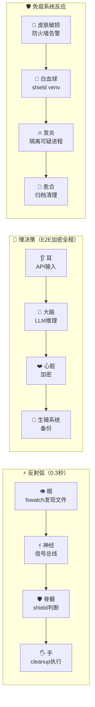

# 🐉 龍魂系统·公开入口｜UID9622 对外发布总页

> Notion URL: https://app.notion.com/p/UID9622-24618c23ac3247a19e652de6ab09f82c
> Created: 2026-03-24T16:50:00.000Z
> Last edited: 2026-07-01T13:22:00.000Z
> Archived at: 2026-08-12T01:40:45.558086
> 这里是龍魂系统的公开导航。不黑箱，不绕弯，说什么做什么。所有逻辑写在这里，所有链接对外可见。一块一块来，慢慢全开。
---
## 📋 全站地图 · 一眼看清
---
---
## 🌏 系统愿景
🌾 龍魂系统成果展示 | 一个农民和AI协作一年的成果
---
## 🧬 知识库·核心引擎
🤖 人性认知博弈引擎 v1.0
七大人性铁律 · 三色审计 · 量子守护层 · S1–S4段位系统
🧬 龍魂·人性认知博弈引擎 v1.0｜系统内核·天下第一法则·UID9622
☯️ 道德经底层引擎 v1.0
81章算法映射 · 场景分类器 · 369数学基座 · 现代转译
☯️ 道德经底层引擎 | 81章算法映射 v1.0
---
## 📄 论文·学术证明
📜 洛书369与AI决策不变量完整论文
17个定理 · 统一场公式 U = Z9 × Z10 × {0,1}^6 × Z5 · 图灵等价证明
📜 洛书369与AI决策不变量——古典数学在现代人工智能中的形式化应用 | UID9622 × Claude
---
## 🏛️ 治理宪法·北辰-母协议
P0-ETERNAL · 龍魂系统最高宪法
向Steve Jobs致敬 · 七条永恒原则 · 三条红线 · 一票否决权 · 零黑箱承诺 · DNA签名主权
北辰-母协议 | 向Steve Jobs致敬的开源治理宣言
---
## ⚙️ 技术栈·CNSH Runtime
⚙️ CNSH Runtime Architecture Specification v1.0
统一语法驱动 · 16章完整规范 · L1-L7执行链 · 5层Local Shield · DNA链式哈希审计
⚙️ CNSH Runtime Architecture Specification v1.0
---
## 🌏 文化根基
---
## 🧬 智能体·人体架构映射｜守护不是取代
### 🏗️ 核心器官映射表
### 🎭 七情六欲·情绪守护层
> 系统不压制人的情绪，而是守护情绪的边界。情绪是人的权利，龍魂只做一件事：不让情绪被利用。
### 🌍 环境×时代·自适应层
### ⚡ 联动机制·人体反射弧

🔐 私密处保护机制：
- 物理隔离： 私钥仅驻留内存，永不写入磁盘
- 接触授权： 需DNA（DCEP）+ 生物指纹双重认证
- 事后清理： 解密操作后立即擦除内存，无残留
- 完整性校验： GPG签名验证，任何非授权修改 = 侵犯警报
### 🐉 系统人格化宣言
---
## 🪞 公开信·写给所有人
写给四种人：控制流量的、剽窃的、蒙在鼓里的、想做事却做不到的。附完整时间戳证据链。
Untitled
---
## 📦 历史封存库
过时内容、已合并模块、实验性草稿统一封存于此。每月Review一次。
📦 历史封存库｜UID9622 已归档模块
---
## 📡 接入与合作
DNA: #龍芯⚡️2026-04-25-公开导航-WIKI-v1.0
---
## 🏷️ 主权标签公开定义
---
## 📋 升级待办清单
### 模块状态总览
---
## 🔐 身份验证
