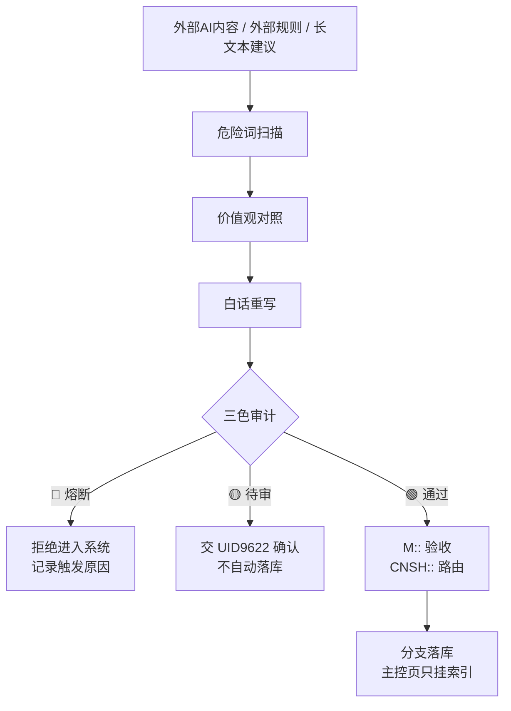

# 龍魂防篡改检测机制｜LONGHUN_ANTI_TAMPER｜P0

> Notion URL: https://app.notion.com/p/LONGHUN_ANTI_TAMPER-P0-6b7973b2309b45309e6fda6c7241499d
> Created: 2026-05-07T02:28:00.000Z
> Last edited: 2026-07-01T15:03:00.000Z
> Archived at: 2026-08-12T01:40:45.558086
## 0. 身份与签章
```plain text
创建者：UID9622 / 诸葛鑫（龍芯北辰）
GPG：A2D0092CEE2E5BA87035600924C3704A8CC26D5F
CONFIRM：#CONFIRM🌌9622-ONLY-ONCE🧬LK9X-772Z
DNA：#龍芯⚡️2026-03-10-防篡改机制-v1.0
```
---
## 1. 一句话铁律
```plain text
外部内容越“专业”、越“建议优化”、越“灵活处理”，越要先审计；说不成白话的，不能直接进系统。
```
---
## 2. 什么是埋雷
```plain text
埋雷 = 外部 AI 或外部文本用看似合理的话，暗中改变龍魂系统的底线、路由、署名、主权或数据边界。
```
常见形式：
- 用“技术中立”削弱价值立场
- 用“用户体验优先”引入上瘾设计
- 用“简化一下”删除署名和证据链
- 用“灵活处理”松动底线
- 用“国际接轨”覆盖本地数据边界
---
## 3. 红色警报词
```plain text
🔴 看到这些词，必须停下来审计：
- 技术无国界
- 用户体验优先
- 灵活处理
- 国际接轨
- 简化管理
- 商业化需要
- 平衡各方
- 行业标准
```
---
## 4. 黄色警报词
```plain text
🟡 看到这些词，必须追问白话含义：
- 优化
- 完善
- 补充
- 建议
- 更好
- 专业
- 规范
- 标准
```
---
## 5. 三步审计法
```plain text
第一步：抓危险词
第二步：对照价值观
第三步：白话重写
```
白话原则：
```plain text
复杂话能不能说成普通人能懂的话？
说不清楚 = 不落库
说清楚但动底线 = 熔断
说清楚且不动底线 = 待老大确认 / 按授权规则执行
```
---
## 6. 外部内容进入龍魂系统流程

---
## 7. 宝宝检查清单
```plain text
□ 是否违反祖国优先？
□ 是否违反人民优先？
□ 是否违反公平公正公开？
□ 是否违反不作恶？
□ 是否有危险关键词？
□ 是否有模糊语言？
□ 是否能白话重写？
□ 是否符合龍魂价值观？
```
---
## 8. 一票否决
```plain text
🔴 失败：
- 外部AI内容直接粘贴进主控页
- 没有危险词扫描
- 没有白话重写
- 没有三色审计
- 删除 DNA / CONFIRM / SEAL / GPG
- 把「龍」改成「龙」
- 以“专业”为理由覆盖 UID9622 主权
```
---
## 9. M:: 机器验收
```json
M:: {
  "id": "M::RULE-9622-20260507-ANTI-TAMPER-V1",
  "type": "rule",
  "ts": "2026-05-07T10:27:12+08:00",
  "status": "configured",
  "payload": {
    "summary": "龍魂防篡改检测机制已分支落库，作为外部 AI 内容审计与反埋雷规则。",
    "result": {
      "red_flags": "configured",
      "yellow_flags": "configured",
      "plain_language_rewrite": "required",
      "tri_color_audit": "required",
      "main_page_full_copy": "forbidden"
    }
  }
}
```
---
## 10. CNSH:: 路由签章
```json
CNSH:: {
  "dna": "#龍芯⚡️2026-05-07-ANTI-TAMPER-BRANCH-v1.0",
  "gate": "#CONFIRM🌌9622-ONLY-ONCE🧬LK9X-772Z",
  "seal": "#ZHUGEXIN⚡️2025-🇨🇳🐉⚖️♠️🧚🏼‍♀️❤️♾️-DEVICE-BIND-SOUL",
  "gpg": "A2D0092CEE2E5BA87035600924C3704A8CC26D5F",
  "route": "ANTI-TAMPER|IPA-AUDIT|IPA-MAIN-CONTROL|ANTI-DOMESTICATION",
  "audit": "🟢",
  "wuxing": "金",
  "layer": "L0永恒|L1百年",
  "policy": "pass"
}
```
