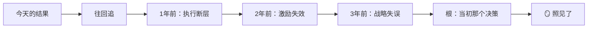

# 🏮 龍芯企业灯·照见难题根，走出活路｜创作标准框架 v1.0

> Notion URL: https://app.notion.com/p/v1-0-3dc671abc9c6484c99882cc220ca75a7
> Created: 2026-03-05T23:09:00.000Z
> Last edited: 2026-07-01T14:46:00.000Z
> Archived at: 2026-08-12T01:40:45.558086
---
> 这不是商业鸡汤专栏。
> 不是给答案，是给镜子+秤+灯。
> 让企业家自己看见问题，自己称量现状，自己找到活路。
---
## 一、核心定位
---
## 二、内容结构｜三生三世灯映射
> 每篇解决方案严格按「三灯」结构展开，让读者经历一次完整的认知洗礼。
### 🪞 前生灯（镜）— 照见问题根因
模块目标： 让企业家看清「问题是怎么来的」
- 案例镜像
- 因果追溯
- 自检清单

---
### ⚖️ 今世灯（秤）— 称量现状真相
模块目标： 让企业家知道「自己现在有多重」
- 压力测评（1-10分自评）
- 关键指标秤（填入真实数据）
- 当前抉择点
---
### 🔦 未来灯（路）— 照亮可行路径
模块目标： 让企业家看见「往哪走能活」
- 可行路径图（1-3条）
- 行动锦囊（下周必须完成的3件事）
- 结果预演
---
## 三、执行标准｜功德钱式交付
### 交付物规格
### 认路费（每篇结尾必设）
### 还账记录社群（付费读者专区）
- 匿名分享执行进展
- 「看完三生三世，该还的账怎么还」
- 格式：行动了什么 + 结果是什么 + 下一步
---
## 四、Notion创作模板结构
> 每篇新文章，复制此模板开始写。
### 📋 模板框架
```javascript
问题标题：[具体难题，如「如何拯救连续亏损6个月的项目？」]

🪞 前生灯（镜）
  案例镜像：[匿名案例，描述问题如何形成]
  根因图：[流程图展示问题演化路径]
  自检表：[读者自查清单，每条是一个雷点]

⚖️ 今世灯（秤）
  压力测评：[1-10分量化评分表]
  关键数据秤：[需读者填写的4-5个核心指标]
  当前抉择点：[A站着改革 / B跪着求存 / AB边走边变]

🔦 未来灯（路）
  路径地图：[1-3条可行路径，含风险和资源需求]
  行动锦囊：[下周3件具体动作]
  结果预演：[数字化推演不同选择的6个月结果]

💰 认路费
  我的核心难题：[文本框]
  我选择的路径：[A/B/AB]
  我承诺X日内完成：[具体行动]
```
---
## 五、冷启动路线图
---
