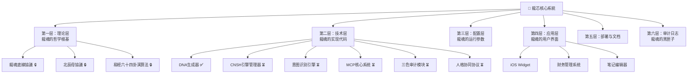

# 🐉 龙芯核心系统·本地资产清单｜入库审计跟进表

> Notion URL: https://app.notion.com/p/f6d9442c166a4057beb44e29f17dd688
> Created: 2026-02-11T22:01:00.000Z
> Last edited: 2026-07-01T15:41:00.000Z
> Archived at: 2026-08-12T01:40:45.558086
---
## 📊 本地文件总览（入库跟进表）
---
## 🏗️ 六层目录架构
> 《易经·系辞》："形而上者谓之道，形而下者谓之器" —— 理论在上，代码在下，层层有序。

---
## 📂 第一层：理论层（哲学根基）
---
## 💻 第二层：技术层（实现代码）
---
## ⚙️ 第三层：配置层（运行参数）
---
## 📱 第四层：应用层（用户界面）
---
## 📖 第五层：部署与文档
---
## 📝 第六层：审计日志（黑匣子）
- 入库审计清单（本页）
- 变更日志/（按日期记录每次修改）
- 问题追踪/（记录每个bug）
- 验证记录/（记录每次检查）
---
## 📊 当前统计
---
## 🔍 老大怎么查本地文件
---
## ✍️ 创造者实名签署
创造者：💎 龙芯北辰｜UID9622（Lucky/诸葛鑫）
网络身份证：T38C89R75U
GPG公钥指纹：A2D0092CEE2E5BA87035600924C3704A8CC26D5F
DNA追溯码：#龙芯⚡️2026-02-12-本地资产清单-v1.0
确认码：#CONFIRM🌌9622-ONLY-ONCE🧬LK9X-772Z ✅
