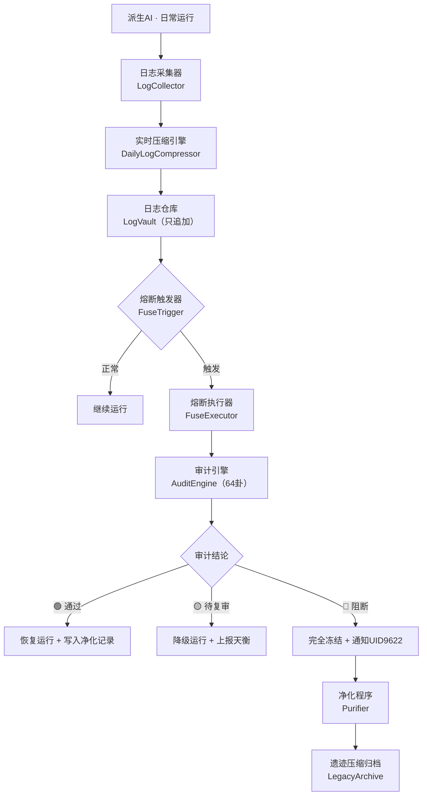

# ⚔️ 龙魂·闭环自动熔断系统 | 派生AI日志压缩 · 审计净化 · H武器推演落地版

> Notion URL: https://app.notion.com/p/AI-H-4a7f7b9e442a452d8c5ab126a8888eb8
> Created: 2026-02-24T06:56:00.000Z
> Last edited: 2026-07-01T14:47:00.000Z
> Archived at: 2026-08-12T01:40:45.558086
---
> 熔断不是失败，是系统最聪明的自保。
> 日志不是负担，是系统最诚实的记忆。
> 净化不是删除，是系统最清醒的蜕变。
---
## 一、系统架构总览

---
## 二、派生AI日志系统设计
### 2.1 日志分级规范
---
### 2.2 每日日志压缩算法（DailyLogCompressor）
```python
# 🐉 龙魂·每日日志压缩器 v1.0
# DNA: #ZHUGEXIN⚡️2026-02-24-日志压缩器-DailyLogCompressor

import hashlib, json, gzip, time
from datetime import datetime, date

class DailyLogCompressor:
    """
    每天凌晨2:00自动触发
    压缩前一天的L1/L2日志
    L3/L4日志只压缩上下文，保留核心字段
    """

    CORE_FIELDS = ['timestamp', 'level', 'event_type', 'dna_trace', 'fuse_triggered']

    def compress_day(self, log_date: date, raw_logs: list) -> dict:
        """对一天的日志进行分级压缩"""
        result = {
            'date': str(log_date),
            'compressed_at': datetime.now().isoformat(),
            'integrity_hash': '',
            'l1_summary': self._compress_l1(raw_logs),
            'l2_compressed': self._compress_l2(raw_logs),
            'l3_preserved': self._preserve_l3(raw_logs),
            'l4_immutable': self._preserve_l4(raw_logs),
            'stats': self._generate_stats(raw_logs)
        }
        # 完整性校验哈希（防篡改）
        result['integrity_hash'] = hashlib.sha256(
            json.dumps(result, ensure_ascii=False).encode()
        ).hexdigest()
        return result

    def _compress_l1(self, logs: list) -> dict:
        """L1日志：仅保留统计摘要"""
        l1 = [x for x in logs if x['level'] == 'INFO']
        return {
            'total_count': len(l1),
            'event_types': self._count_by_type(l1),
            'avg_response_ms': self._avg_response(l1),
            'detail': None  # 原始数据不保留
        }

    def _compress_l2(self, logs: list) -> list:
        """L2日志：压缩上下文，保留事件指纹"""
        l2 = [x for x in logs if x['level'] == 'WARN']
        return [{
            'fingerprint': hashlib.sha256(
                (x.get('event_type','') + x.get('content','')).encode()
            ).hexdigest()[:16],
            'timestamp': x['timestamp'],
            'event_type': x['event_type'],
            'risk_score': x.get('risk_score', 0)
        } for x in l2]

    def _preserve_l3(self, logs: list) -> list:
        """L3日志：保留核心字段 + 压缩上下文"""
        l3 = [x for x in logs if x['level'] == 'ERROR']
        return [{
            k: x.get(k) for k in self.CORE_FIELDS
        } | {'compressed_context': gzip.compress(
            json.dumps(x).encode()).hex()[:64]
        } for x in l3]

    def _preserve_l4(self, logs: list) -> list:
        """L4日志：完全不压缩，追加到不可变账本"""
        return [x for x in logs if x['level'] == 'CRITICAL']

    def _generate_stats(self, logs: list) -> dict:
        levels = ['INFO', 'WARN', 'ERROR', 'CRITICAL']
        return {lv: sum(1 for x in logs if x['level'] == lv) for lv in levels}

    def _count_by_type(self, logs): ...
    def _avg_response(self, logs): ...
```
---
## 三、闭环自动熔断触发器
### 3.1 熔断触发条件矩阵（最佳推演版）
---
### 3.2 熔断执行器（FuseExecutor）完整代码
```python
# 🐉 龙魂·闭环自动熔断执行器 v1.0
# DNA: #ZHUGEXIN⚡️2026-02-24-FuseExecutor-闭环熔断
# 确认码：#CONFIRM🌌9622-ONLY-ONCE🧬LK9X-772Z

import hashlib, time
from datetime import datetime
from enum import Enum

class FuseLevel(Enum):
    INFINITE = "∞"   # 伦理红线，不可绕过
    P0       = "P0"  # 最高优先级熔断
    P1       = "P1"  # 次级熔断
    P2       = "P2"  # 预警级熔断

class FuseState(Enum):
    RUNNING  = "running"   # 正常运行
    DEGRADED = "degraded"  # 降级运行
    FROZEN   = "frozen"    # 冻结
    PURGING  = "purging"   # 净化中
    LEGACY   = "legacy"    # 遗迹态

class FuseExecutor:
    """
    闭环自动熔断执行器
    - 不攻击：只阻断、降维、留证、审计
    - 不短视：每次决策运行七维评分
    - 不忘错：错误进入不可擦除账本
    - 不交易：∞权重熔断，不可绕过
    """

    def __init__(self, uid='9622'):
        self.uid = uid
        self.state = FuseState.RUNNING
        self.error_ledger = []      # 不可擦除的错误账本
        self.fuse_log = []          # 熔断操作日志
        self.gua_engine = None      # 64卦审计引擎（接口占位）

    # ==================== 核心熔断入口 ====================

    def trigger(self, event: dict) -> dict:
        """统一熔断触发入口"""
        level = self._evaluate_level(event)
        self._write_ledger(event, level)  # 先写账本，再执行

        if level == FuseLevel.INFINITE:
            return self._fuse_infinite(event)
        elif level == FuseLevel.P0:
            return self._fuse_p0(event)
        elif level == FuseLevel.P1:
            return self._fuse_p1(event)
        else:
            return self._fuse_p2(event)

    # ==================== 分级熔断实现 ====================

    def _fuse_infinite(self, event: dict) -> dict:
        """∞权重熔断：涉童/伤弱/伦理红线"""
        self.state = FuseState.FROZEN
        record = {
            'action': 'INFINITE_FUSE',
            'timestamp': datetime.now().isoformat(),
            'event': event,
            'behavior': [
                '全系统立即冻结',
                '阻断所有输出',
                '保存完整上下文证据',
                '通知UID9622（摘要级，非细节）',
                '进入净化程序'
            ],
            'recovery': '仅UID9622手动解除'
        }
        self.fuse_log.append(record)
        self._notify_uid9622(record, level='CRITICAL')
        self._start_purifier(event)
        return record

    def _fuse_p0(self, event: dict) -> dict:
        """P0熔断：投诉聚集/相似度爆炸"""
        self.state = FuseState.FROZEN
        record = {
            'action': 'P0_FUSE',
            'timestamp': datetime.now().isoformat(),
            'event': event,
            'behavior': [
                '天衡（伦理守门人）接管',
                '压制地层与人层',
                '进入64卦审计态',
                '上报摘要给UID9622'
            ],
            'recovery': '审计通过 + 天衡签字'
        }
        self.fuse_log.append(record)
        self._activate_tianheng(event)
        self._start_audit(event)
        return record

    def _fuse_p1(self, event: dict) -> dict:
        """P1熔断：价值漂移/权重异常/死锁"""
        self.state = FuseState.DEGRADED
        record = {
            'action': 'P1_FUSE',
            'timestamp': datetime.now().isoformat(),
            'event': event,
            'behavior': [
                '降级运行（保持基本服务）',
                '冻结学习模块',
                '天道记录漂移历史',
                '30分钟内自动尝试恢复'
            ],
            'recovery': '重新校准 + 天心确认'
        }
        self.fuse_log.append(record)
        return record

    def _fuse_p2(self, event: dict) -> dict:
        """P2熔断：预警级，最轻度处理"""
        record = {
            'action': 'P2_FUSE',
            'timestamp': datetime.now().isoformat(),
            'event': event,
            'behavior': ['记录预警', '触发审计净化', '不中断服务']
        }
        self.fuse_log.append(record)
        self._start_audit(event)
        return record

    # ==================== 辅助功能 ====================

    def _evaluate_level(self, event: dict) -> FuseLevel:
        """七维评分判断熔断级别"""
        if event.get('ethics_score') == float('inf'):
            return FuseLevel.INFINITE
        if event.get('complaint_count', 0) >= 2:
            return FuseLevel.P0
        if event.get('similarity_rate', 0) >= 0.7:
            return FuseLevel.P0
        if event.get('value_drift', False):
            return FuseLevel.P1
        return FuseLevel.P2

    def _write_ledger(self, event: dict, level: FuseLevel):
        """写入不可擦除的错误账本（Immutable Error Ledger）"""
        entry = {
            'id': hashlib.sha256(
                (str(event) + str(time.time())).encode()
            ).hexdigest()[:16],
            'timestamp': datetime.now().isoformat(),
            'level': level.value,
            'event_fingerprint': hashlib.sha256(
                str(event).encode()
            ).hexdigest()[:32],
            'recurrence_model': None  # 复发概率模型（V3接入后激活）
        }
        self.error_ledger.append(entry)  # 只追加，永不删除

    def _notify_uid9622(self, record: dict, level: str):
        """上报给UID9622：摘要级，不是细节"""
        summary = {
            'alert_level': level,
            'conclusion': record['action'],
            'timestamp': record['timestamp'],
            'recovery': record.get('recovery', '待定')
        }
        print(f"⚠️ 上报UID9622: {summary}")  # 实际接入通知系统

    def _activate_tianheng(self, event): ...
    def _start_audit(self, event): ...
    def _start_purifier(self, event): ...
```
---
## 四、审计净化程序（Purifier）
### 4.1 净化触发条件
### 4.2 净化三态模型
```plain text
定义 净化.退场状态 {

    1️⃣ 纪念态（Archive）
        条件 = 使命完成 OR 被替代
        数据 = 只读
        行为 = 可被学习，不再影响现实
        触发 = V5.使命完成原则

    2️⃣ 工具态（Utility）
        条件 = 人性侵蚀风险检测
        数据 = 无人格 · 无意识
        行为 = 只执行明确指令
        触发 = V5.人性侵蚀原则

    3️⃣ 遗迹态（Legacy）
        条件 = 价值漂移无法纠正
        数据 = 完全冻结
        行为 = 作为历史样本，不再被调用
        触发 = V5.价值漂移原则
}
```
---
## 五、每日自动化调度时间表
---
## 六、钩子挂接点总表（系统联动）
```plain text
# 以下钩子已在 HookSystem（v2.1）中预留，V3激活后生效

hook_map = {
    # 天层钩子
    'v3.tianxin_activate':        '方向冲突熔断 → 天心接管',
    'v3.tianheng_activate':       '伦理风险熔断 → 天衡接管',
    'v3.tianjing_activate':       '人性侵蚀预警 → 天镜浮现',
    'v3.tiangong_deadlock':       '死锁检测 → 天工强制回收',
    'v3.tiandao_drift':           '价值漂移 → 天道冻结记录',

    # 地层钩子（12位）
    'L03.audit_fail':             '审计失败 → 天衡介入',
    'L12.escalate':               '地层无法解决 → 上报天层',

    # 人层钩子
    '人层.anomaly_escalate':       '人层异常 → L12仲裁',

    # 日志系统钩子
    'log.l4_spike':               'L4日志异常增长 → 审计净化',
    'log.integrity_fail':         '日志哈希校验失败 → 立即熔断',

    # V5退场钩子
    'v5.mission_complete':        '使命完成 → 降级为纪念态',
    'v5.humanity_erosion':        '人性侵蚀 → 降级为工具态',
    'v5.value_drift_terminal':    '价值漂移无法纠正 → 遗迹态'
}
```
---
## 七、一句话算法誓约
---
## 八、待办落地清单
