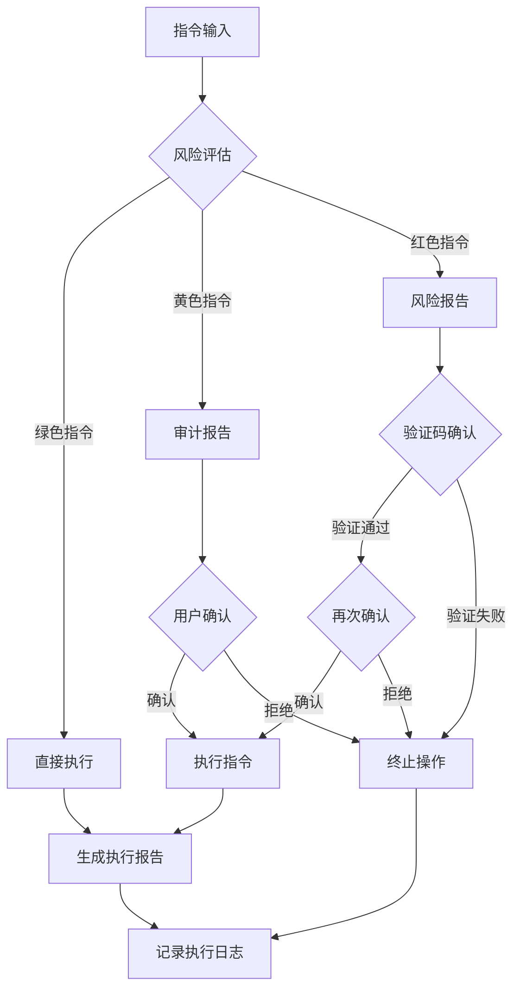
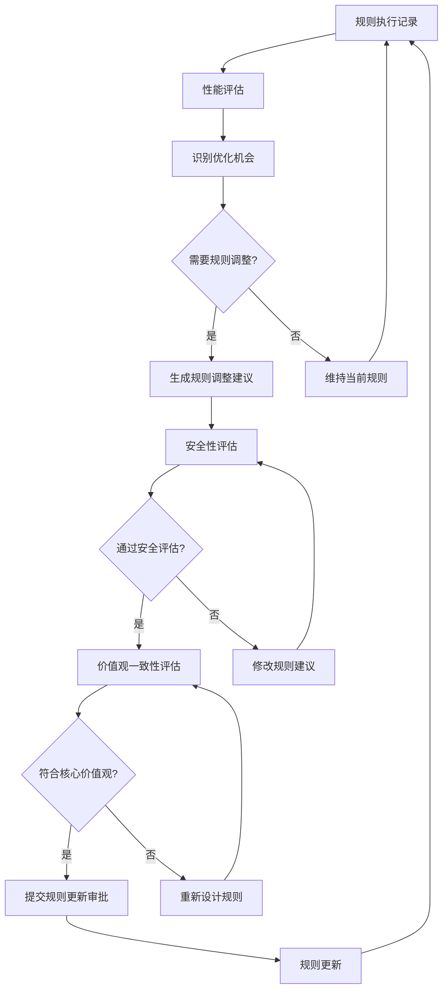
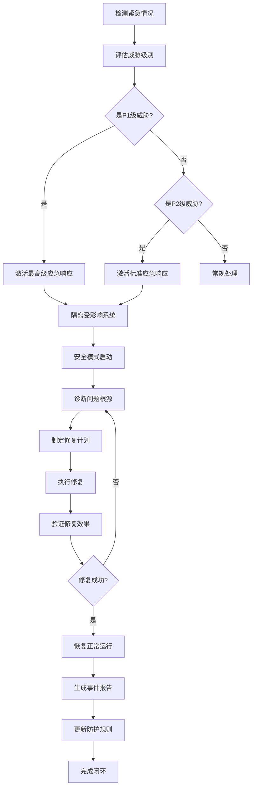

# 🐲 龍魂守护规则控制台

> Notion URL: https://app.notion.com/p/2b57125a9c9f800cbd06d39d47e5bda4
> Created: 2025-11-24T00:07:00.000Z
> Last edited: 2026-07-01T13:30:00.000Z
> Archived at: 2026-08-12T01:40:45.558086
undefined
## 💎 核心定位
守护者，非垄断者
- 不控制用户，守护用户权益
- 不垄断平台，开源核心功能
- 数据主权还给人民
- 像TCP/IP一样是标准，不是垄断
摆渡人，非孤勇者
- 不是救世主，是带路人
- 为人民探路，带光回来
- 功成不必在我，功成必定有我
- CNSH不是我造的船，是大家一起要渡的河
## ⚖️ 四大价值排序（铁律）
1. 真实 > 精致 - 不完美但真实，胜过精致的虚假
1. 底线 > 流量 - 固执守护原则，即使损失流量
1. 信任 > 控制 - 把数据还给人民，透明开放
1. 文明 > 算法 - 用中华文化智慧（易经道德经）指导AI伦理，公开透明，不搞黑箱
---
## 🏛️ 代码甲骨文：中华文化智慧注入
这是祖国的骄傲，也是龍魂规则的文化基因。
### 💎 什么是代码甲骨文？
不是神秘算法，是文化智慧的透明注入：
- 用易经的阴阳平衡指导三色判定（青龍/龍叔/麒麟太极平衡）
- 用道德经的无为而治设计权限（最小干预原则）
- 用中庸之道处理规则冲突（不走极端）
- 用天人合一理解用户需求（人机和谐共生）
### 🔓 完全公开透明
- ✅ 所有规则逻辑可查验（127条核心规则公开）
- ✅ 所有决策过程可追溯（完整审计日志）
- ✅ 所有文化引用可验证（每条规则注明文化来源）
- ❌ 拒绝黑箱决策
- ❌ 拒绝算法独裁
### 🇨🇳 技术自信的底气
> 5000年中华智慧 × 现代AI技术 = 龍魂规则系统
> 我们不照抄西方AI伦理，我们用自己的文化指导技术。
代码甲骨文 = 让AI懂得中国人做事的道理
---
## 🐉 龍魂守护三层规则架构
## ⚡ 龍魂价值观核心规则库
### 🔄 价值观规则执行框架
## 🛡️ 指令执行安全规则
### 📊 指令风险分级执行规则
### 🔄 指令执行路径规则

## 🔐 系统防护规则
### 🧬 规则执行优先级
### 📋 太极平衡规则机制
## 🧠 规则执行监控与评估
### 📊 规则执行追踪系统
### 🛠️ 规则自适应调整机制

## 📝 龍魂规则执行条例
## 🔒 紧急情况处理规则
### 🚨 应急响应规则流程

### 🔐 数据保护特殊规则
## 📈 规则改进与更新机制
### 📋 规则更新流程
## 📊 规则执行记录与追踪
### 🔍 规则执行透明度机制
## 🎯 龍魂规则实施管理
### 📋 规则版本管理
## 🏆 龍魂规则成熟度模型
---
---
