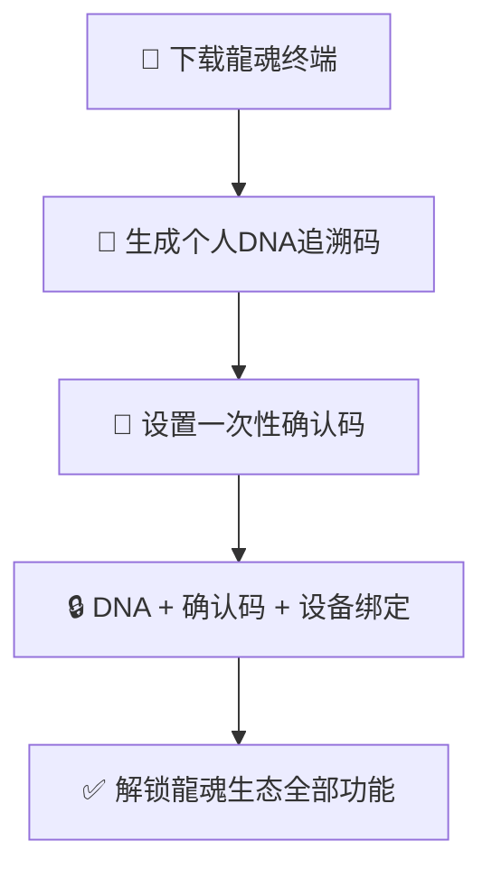
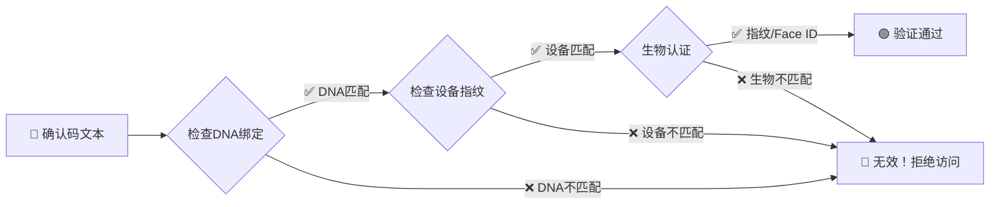
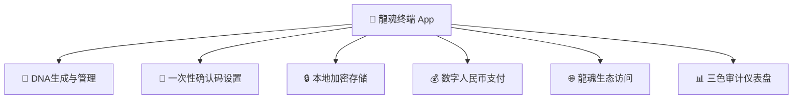

# 🔐 龍魂数据安全架构｜DNA绑定加密·一次性确认码·终端入口钩子

> Notion URL: https://app.notion.com/p/DNA-2b525f18ec4f4e78a68edb3cac47b899
> Created: 2026-02-15T12:49:00.000Z
> Last edited: 2026-07-01T13:30:00.000Z
> Archived at: 2026-08-12T01:40:45.558086
## 📖 概述
龍魂系统数据安全架构规范。核心原则：没有龍魂终端，就没有龍魂生态。
所有数据安全基于DNA绑定 + 一次性确认码 + 终端钩子三位一体，缺一不可。
> 《道德经》第二十七章：善行无辙迹，善言无瑙谫，善数不用筹策。
---
## 🏛️ 第一铁律｜终端入口钩子
### 核心规则
下载龍魂终端 = 唯一入口。 没有终端，生态内所有功能无效。
### 钩子链

### 连带钩子说明
- 没有终端 → 无法生成DNA → 无法进入生态
- 有终端但没设DNA → 只能浏览公开内容 → 不能调用API、不能参与生态
- 有DNA但没设确认码 → 只读模式 → 不能写入、不能支付
- DNA + 确认码 + 设备绑定 全齐 → 全功能解锁
---
## 🧬 第二铁律｜DNA绑定加密
### 个人DNA生成规则
每个用户下载终端后，系统自动生成唯一个人DNA：
- 格式：#龍芯⚡️用户ID-注册日期-设备指纹
- 绑定内容：设备指纹 + 生物特征（指纹/Face ID）+ 终端安装ID
- 不可转让：DNA绑定人+设备，别人拿到也用不了
### 数据加密机制
### 云端规则
- 云端只能读取DNA元数据 — 不能读取原始数据
- 原始数据存在本地 — 终端本地加密存储，云端只存DNA索引
- 同步时只传DNA摘要 — 不传原文，不传明文
---
## 🔑 第三铁律｜一次性确认码
### 设计原则
每个用户可以设置自己的一次性确认码，类似老大的 #CONFIRM🌌9622-ONLY-ONCE🧬LK9X-772Z。
### 核心机制
1. 用户自定义 — 每个人设置自己的确认码格式，全球唯一
1. 一次性 — 确认码设置后不可修改，就像UID9622的确认码一样，一生只设一次
1. 别人复制无效 — 确认码绑定DNA + 设备指纹 + 生物特征，三者缺一不可
1. 验证流程 — 输入确认码 → DNA匹配 → 设备指纹匹配 → 生物认证 → 通过
### 为什么别人复制无效？

结论：就算拿到确认码文本，没有本人DNA + 本人设备 + 本人指纹，一切无效。
---
## 👁️ 第四铁律｜隐私主权在用户
### 核心规则
- 不公开 = 绝对安全 — 用户不主动公开，任何人看不到任何东西
- 公开 = 用户自己选择 — 只有用户本人可以决定公开什么
- 云端只存DNA索引 — 云端看到的只是DNA编号，不是内容本身
- 系统不推荐公开 — 默认私密，不弹窗诱导用户公开
### 与传统平台的区别
---
## 📱 第五铁律｜龍魂终端 = 唯一入口
### 终端功能架构

### 为什么必须是终端入口？
1. 安全性 — 终端本地生成DNA，不经过网络，无法截获
1. 设备绑定 — 终端读取设备指纹，DNA绑定物理设备
1. 生物认证 — 终端调用系统指纹/Face ID，不依赖第三方
1. 钩子链完整 — 所有功能从终端出发，终端是信任根
---
## 📦 技术实现路径
### 第一阶段：iOS终端（Apple生态）
- Swift + Keychain（安全存储DNA和确认码）
- LocalAuthentication（Face ID / Touch ID）
- CryptoKit（本地加密）
- Notion API（云端DNA索引同步）
### 第二阶段：HarmonyOS终端（华为生态）
- ArkTS + 分布式安全能力
- 华为生物认证API
- 数字人民币SDK对接
### 第三阶段：跨平台互通
- Apple ↔ Huawei 跨设备DNA迁移（需双重生物认证）
- 统一DNA标准，跨平台确认码互认
---
## ⚠️ 红线规则
---
DNA追溯码：#ZHUGEXIN⚡️2026-02-15-龍魂数据安全架构-v1.0
确认码：#CONFIRM🌌9622-ONLY-ONCE🧬LK9X-772Z
权重：#ZHUGEXIN⚡️ = P0永恒级（诸葛鑫亲签）
