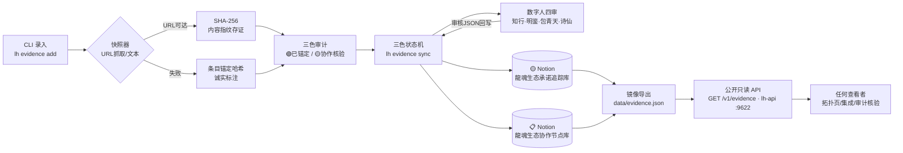
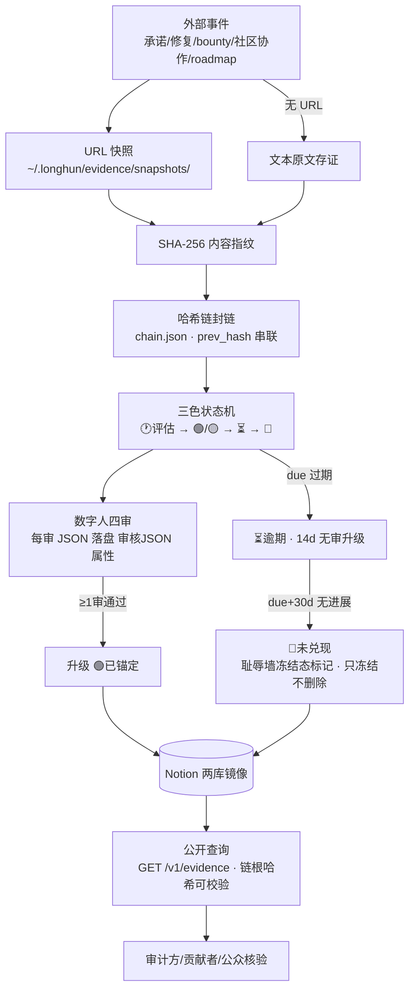

> 干支时间戳: #龍芯⚡️丙午·丁酉·癸未·子时·䷝离
# 🧬 龍魂证据链系统拓扑 v1.0

> DNA: #龍芯⚡️2026-09-05-EVIDENCE-TOPOLOGY-v1.0-UID9622
> 创建者: 诸葛鑫（UID9622）｜ 归属名: 诸葛鑫 | UID9622 · 龍芯北辰
> 协议: CC BY-NC-SA 4.0（核心思想层）· 工程实现参考 08_BIN/lh_evidence_sync.py（MulanPSL v2）
> 母协议: 07_AUDIT/LH-AUDIT-CHAIN-AUDIT-REPORT-2026-09-05.md（v1.1 中立骨架·阶段A）
> 审计对象: 龍魂开源生态自身事务（承诺兑现/bounty/roadmap/修复/贡献者协作）· 不做对外政治定性

**生成时间**：2026-09-05 ｜ **链根哈希**：`a24047dc8917de3d65da4a4f9cd6b3b74c818cc3cf6f4ec50b091ace36f5bb71` ｜ **台账**：1 条（pledge 1）

---

## 1. 系统架构图（横向 · 证据录入 → 审计 → 状态机 → Notion → 公开API）

## 2. 数据流图（纵向 · 外部事件 → 快照 → 哈希链 → 数字人 → 冻结 → 公开查询）

## 3. 模块清单

| 模块 | 落点 | 职责 |
|:---|:---|:---|
| 引擎 | `08_BIN/lh_evidence_sync.py` | add/list/sync/review/status/verify/snapshot |
| 快照库 | `~/.longhun/evidence/snapshots/` | URL HTML / 文本原文 原件留存 |
| 台账 | `~/.longhun/evidence/pledges.json` | append-only 本地真相源（数据主权端） |
| 哈希链 | `~/.longhun/evidence/chain.json` | prev_hash 串联 + root_hash + 封链时间 |
| 承诺库 | Notion `3d27125a-9c9f-8167-98c5-cecdbd83a1a6` | 13 属性 · 承诺追踪 |
| 节点库 | Notion `3d27125a-9c9f-8175-bc07-d7c4e65d1238` | 8 属性 · 协作节点 |
| 公开端点 | lh-api :9622 `/v1/evidence` | 只读镜像（同 shamewall 模式） |
| 镜像 | `data/evidence.json` | 每次封链自动导出 |

## 4. 状态机流转规则（承诺类）

| 当前 | 触发 | 迁移 | 三色 |
|:---|:---|:---|:---:|
| 🕐 评估（新录入） | URL快照+SHA-256 内容哈希成功 | 🟢 已锚定 | 🟢 |
| 🕐 评估（新录入） | 快照失败仅条目锚定哈希 | 🟡 协作核验 | 🟡 |
| 🟡 协作核验 | 数字人 ≥1 审（`lh evidence review`） | 🟢 已锚定 | 🟢 |
| 🟡 协作核验 | 14 天无审核（`lh evidence sync` 升级） | ⏳ 逾期 | 🟡 |
| 🟢/🟡（承诺类） | due < 今天 | ⏳ 逾期 | 🟡 |
| ⏳ 逾期 | due+30 天仍无进展 | 🔴 未兑现（耻辱墙冻结态标记·不删除只冻结） | 🔴 |

> 协作节点（node）：快照成功 → 🟢 活跃；休眠/失联 → 🟡 休眠。

## 5. 哈希链与验真

- 每条记录带 `sha256`（内容指纹/条目锚定）+ 链上 `hash` + `prev_hash`。
- `lh evidence verify` 逐条重算比对 → 🟢 链完整 / 🔴 链破损。
- 公开镜像带 `root_hash`，任何查看者可将 `data/evidence.json` 与链根哈希对照验真（不删除只冻结·可追溯）。

## 6. 交付物索引

| 产物 | 路径 |
|:---|:---|
| 引擎（源） | `08_BIN/lh_evidence_sync.py` |
| 公开镜像 | `data/evidence.json` |
| 拓扑快照 | `data/evidence_topology_snapshot.json` |
| 本拓扑文档 | `docs/topology/evidence_system_topology.md` |
| 审计协议 | `07_AUDIT/LH-AUDIT-CHAIN-AUDIT-REPORT-2026-09-05.md` |

---
DNA: #龍芯⚡️2026-09-05-EVIDENCE-TOPOLOGY-v1.0-UID9622 ｜ 归属名: 诸葛鑫 | UID9622 · 龍芯北辰
🐉丙午·亥时·䷙大畜·🟢
