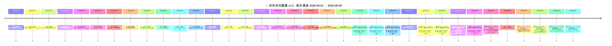

**归属名:** 诸葛鑫 | UID9622 · 龍芯北辰
> 干支时间戳: #龍芯⚡️丙午·丁酉·癸未·子时·䷝离

```mermaid
timeline
    title 📢 对外交付图谱 v1.0 · 拓扑演进 2026-09-01 → 2026-09-05
    2026-09-05 : [节点注册] A反馈·反馈报告_2026-09-05
    2026-09-05 : [节点注册] B扩散·扩散素材包_2026-09-05
    2026-09-05 : [节点注册] C入口·文档站反馈入口
    2026-09-05 : [节点注册] D发布·对外发布稿_2026-09-05
    2026-09-05 : [节点注册] D发布·导读文章_2026-09-05
    2026-09-05 : [节点注册] B扩散·V2EX版
    2026-09-05 : [节点注册] B扩散·开源中国版
    2026-09-05 : [节点注册] B扩散·知乎版
    2026-09-05 : [节点注册] B扩散·HackerNews版
    2026-09-05 : [节点注册] C入口·耻辱墙
    2026-09-05 : [节点注册] D发布·公告 Issue #99
    2026-09-05 : [节点注册] D发布·DEPENDENCIES
    2026-09-05 : [节点注册] D发布·INSTALL
    2026-09-05 : [节点注册] D发布·USAGE
    2026-09-05 : [节点注册] D发布·API_REFERENCE
    2026-09-05 : [节点注册] D发布·JSONRPC
    2026-09-05 : [节点注册] D发布·MCP_GUIDE
    2026-09-05 : [节点注册] D发布·NOTION_MCP_GUIDE
    2026-09-05 : [节点注册] D发布·TROUBLESHOOTING
    2026-09-05 : [节点注册] D发布·龍魂对外交付文档体系-v1.0
    2026-09-05 : [节点注册] D发布·30分钟接入龙魂系统
    2026-09-05 : [事件·topo_changed] 对外交付图谱拓扑变更 → 新增0·更新1·移除0 · 节点22 · verify ✅通过
    2026-09-05 : [事件·topo_change] 对外交付图谱拓扑变更 → 新增0·更新1·移除0 · 节点22 · verify ✅通过
    2026-09-05 : [事件·topo_change] 对外交付图谱拓扑变更 → 新增0·更新0·移除1 · 节点21 · verify ✅通过
    2026-09-05 : [节点注册] D发布·QUICKSTART
    2026-09-05 : [事件·topo_change] 对外交付图谱拓扑变更 → 新增1·更新0·移除0 · 节点22 · verify ✅通过
    2026-09-05 : [事件·topo_change] 对外交付图谱拓扑变更 → 新增0·更新3·移除0 · 节点22 · verify ✅通过
    2026-09-05 : [事件·topo_change] 对外交付拓扑 v2.0 Merkle 审计链启用建档 · 5 条 legacy 事件已聚合为创世根
    2026-09-05 : [事件·topo_change] 对外交付图谱拓扑变更 → 新增0·更新11·移除0 · 节点22 · verify ✅通过
    2026-09-05 : [事件·topo_pr_submit] PR 提交 · topo_demo_community.topo → 📢 对外交付图谱 v1.0 (pr_0001)
    2026-09-05 : [节点注册] 工具层·CNSH规范
    2026-09-05 : [事件·topo_pr_merge] PR 合并 · 📢 对外交付图谱 v1.0 · 1增/0更/1边/0冻结
    2026-09-05 : [事件·topo_action] ✅ 节点动作 · 📢 对外交付图谱 v1.0·CNSH规范 · lh topo status 对外交付
    2026-09-05 : [事件·topo_rule_change] 规则变更 · 📢 对外交付图谱 v1.0·R1-DELIVER-GPG
    2026-09-05 : [事件·topo_rule_change] 规则变更 · 📢 对外交付图谱 v1.0·R2-DOCS-SYNC
```
