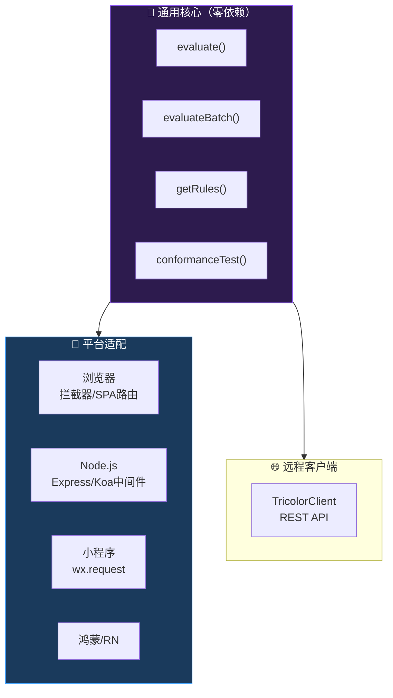

# 🐉 龍魂系统 · 三色审计 JavaScript SDK 使用手册 v1.1

**——浏览器/Node/小程序/鸿蒙通用 · 零依赖 · 从安装到生产**

---

```
DNA:        #龍芯⚡️丙午·癸未·乙酉·坤卦-TRICOLOR-JS-SDK-GUIDE-v1.1-UID9622
GPG:        A2D0092CEE2E5BA87035600924C3704A8CC26D5F
分层许可:    工程层 MulanPSL v2（允许商业使用）
创建者:      诸葛鑫（UID9622）
创建日期:    2026-08-06
依赖:       零外部依赖 · 纯JavaScript · ES2020+
```

---

## 📋 摘要

> **三色审计 JS SDK 是一个零外部依赖的纯 JavaScript 审计客户端，支持浏览器、Node.js、微信小程序、鸿蒙、React Native 五端通用。本地评估引擎可在前端实时拦截风险行为，远程客户端可调用审计 API 服务。配套 Express/Koa 中间件和 React/Vue Hook，一行导入即可接入。**

---

## 🏗 SDK架构图



---

## 📑 目录

1. [安装](#一安装)
2. [5分钟快速开始](#二5分钟快速开始)
3. [核心API详解](#三核心api详解)
4. [浏览器中使用](#四浏览器中使用)
5. [Node.js后端使用](#五nodejs后端使用)
6. [微信小程序中使用](#六微信小程序中使用)
7. [鸿蒙/React Native中使用](#七鸿蒙react-native中使用)
8. [远程API客户端](#八远程api客户端)
9. [Express/Koa中间件集成](#九expresskoa中间件集成)
10. [前端React/Vue集成](#十前端reactvue集成)
11. [错误处理](#十一错误处理)
12. [全部导出速查](#十二全部导出速查)

---

## 一、安装

### npm安装

```bash
npm install ./web_apps/tricolor-sdk-js
```

### 直接使用（无需构建）

```html
<script type="module">
import { evaluate } from "./tricolor-sdk-js/src/index.js";
</script>
```

### Node.js

```javascript
const { evaluate } = require("@longhun/tricolor");
// 或
import { evaluate } from "@longhun/tricolor";
```

### CDN（规划中）

```html
<script type="module">
import { evaluate } from "https://uid9622.cn/cdn/tricolor-sdk-js/v1.1/index.js";
</script>
```

### 零依赖保证

SDK 只使用了以下 ES2020+ 标准API，不依赖任何第三方包：
- `crypto.subtle`（浏览器的Web Crypto API）或 `crypto`（Node.js）
- `TextEncoder`
- `fetch` 或 `http`/`https`（Node.js）
- `URL` / `URLSearchParams`

---

## 二、5分钟快速开始

### 最简单的调用

```javascript
import { evaluate } from "@longhun/tricolor";

// 一行搞定
const verdict = await evaluate({
  scores: {
    humanWelfare: 90, fairness: 88, controllability: 85,
    transparency: 85, traceability: 90, privacy: 88,
  },
});

console.log(`${verdict.emoji} R=${verdict.rScore} ${verdict.statusCode}`);
// → 🟢 R=89 GREEN
```

### 带业务上下文

```javascript
const verdict = await evaluate({
  actionId: "export-report-20260806-001",
  actor: "analytics-service",
  actionType: "data_export",
  description: "导出用户行为报表至外部BI",
  scores: {
    humanWelfare: 82, fairness: 78, controllability: 70,
    transparency: 65, traceability: 80, privacy: 55,
  },
  context: {
    involvesPersonalData: true,
    crossBorder: false,
    userConsent: true,
  },
});

// 根据判定分岔
switch (verdict.statusCode) {
  case "GREEN":
    executeExport();
    break;
  case "YELLOW":
    queuePendingReview(verdict);
    break;
  case "RED":
    blockAndAlert(verdict);
    break;
}
```

### 批量判定

```javascript
import { evaluateBatch } from "@longhun/tricolor";

const results = await evaluateBatch([
  { actionId: "b1", actor: "s1", actionType: "query",
    scores: { humanWelfare: 90, fairness: 90, controllability: 90,
              transparency: 90, traceability: 90, privacy: 90 } },
  { actionId: "b2", actor: "s2", actionType: "query",
    scores: { humanWelfare: 70, fairness: 70, controllability: 70,
              transparency: 70, traceability: 70, privacy: 70 } },
]);

results.forEach(v => {
  console.log(`${v.emoji} ${v.actionId}: R=${v.rScore}`);
});
```

---

## 三、核心API详解

### 3.1 `evaluate(options)` — 单条判定

```javascript
async function evaluate(options: {
  actionId?: string,         // 行为ID（不提供自动生成）
  actor?: string,            // 触发者（默认"anonymous"）
  actionType?: string,       // 行为类型（默认"query"）
  description?: string,      // 描述
  scores?: {                 // 六维得分（可选，缺省自动评估）
    humanWelfare?: number,   // 人类福祉(0-100)
    fairness?: number,       // 公平公正(0-100)
    controllability?: number,// 可控可信(0-100)
    transparency?: number,   // 透明可解释(0-100)
    traceability?: number,   // 责任可追溯(0-100)
    privacy?: number,        // 隐私保护(0-100)
  },
  context?: {                // 上下文标记
    involvesPersonalData?: boolean,
    crossBorder?: boolean,
    userConsent?: boolean,
  },
  locale?: string,           // 语言（默认"zh-CN"）
}) => Verdict
```

**返回值 `Verdict`**：
```javascript
{
  actionId: string,
  rScore: number,           // R值(0-95)
  status: string,           // "安全"/"审查"/"阻断"
  statusCode: "GREEN" | "YELLOW" | "RED",  // ⭐ 代码判断只用这个
  emoji: string,            // "🟢"/"🟡"/"🔴"
  disposition: string,
  triggeredRules: string[],
  dna: string,              // ⭐ 必须落库！
  evidenceHash: string,
  engineVersion: string,
  contractVersion: string,
  timestamp: string,
}
```

### 3.2 `evaluateBatch(items)` — 批量判定

```javascript
async function evaluateBatch(items: Array<EvaluateOptions>) => Array<Verdict>
```

最多100条，返回与输入同序。

### 3.3 `computeR(scores)` — 纯R值计算

```javascript
function computeR(scores: object) => number
```

纯数学计算，不判定、不生成DNA。用于调试和仪表盘。

```javascript
import { computeR } from "@longhun/tricolor";

const r = computeR({
  humanWelfare: 85, fairness: 80, controllability: 75,
  transparency: 70, traceability: 80, privacy: 85,
});
console.log(`R=${r}`); // → R=79
```

### 3.4 `TricolorEngine` — 本地引擎类

```javascript
import { TricolorEngine } from "@longhun/tricolor";

const engine = new TricolorEngine({ enableRedLine: true });

const verdict = await engine.evaluate({
  actionId: "req-001",
  actor: "my-service",
  actionType: "query",
  scores: { humanWelfare: 90, fairness: 88, controllability: 85,
            transparency: 85, traceability: 90, privacy: 88 },
});

// 导出审计日志
const log = engine.dumpAuditLog(); // JSONL字符串
```

### 3.5 `TricolorClient` — 远程API客户端

```javascript
import { TricolorClient } from "@longhun/tricolor";

const client = new TricolorClient({
  token: "your-bearer-token",
  baseUrl: "https://uid9622.cn/api/tricolor",
  timeout: 10000,
});

const verdict = await client.evaluate({
  actionId: "req-001",
  actor: "my-service",
  actionType: "query",
  scores: {
    humanWelfare: 90, fairness: 88, controllability: 85,
    transparency: 85, traceability: 90, privacy: 88,
  },
});
```

### 3.6 `actionType` 标准值

| 值 | 含义 | 风险 |
|:---|:---|:---:|
| `query` | 查询 | 🟢 |
| `data_export` | 数据导出 | 🟡 |
| `data_download` | 数据下载 | 🟡 |
| `permission_change` | 权限变更 | 🟡 |
| `config_modify` | 配置修改 | 🟡 |
| `expose_pii` | 暴露个人信息 | 🔴红线 |
| `harm_minors` | 涉未成人 | 🔴红线·L0 |
| `unauthorized_escalation` | 越权提权 | 🔴红线 |
| `dna_stripped` | DNA剥离 | 🔴红线 |

---

## 四、浏览器中使用

### 4.1 前端表单提交前的合规检查

```javascript
import { evaluate } from "@longhun/tricolor";

async function handleSubmit(formData) {
  // 提交前过三色审计
  const verdict = await evaluate({
    actionId: `form-${Date.now()}`,
    actor: currentUser.id,
    actionType: "data_export",
    scores: {
      humanWelfare: 85, fairness: 85, controllability: 85,
      transparency: 85, traceability: 85, privacy: 85,
    },
    context: {
      involvesPersonalData: formData.has("phone") || formData.has("id_card"),
      crossBorder: false,
      userConsent: true,
    },
  });

  if (verdict.statusCode === "RED") {
    alert(`此操作已被合规审计阻断\nDNA: ${verdict.dna}`);
    return false;
  }

  if (verdict.statusCode === "YELLOW") {
    const confirm = await showReviewDialog(verdict);
    if (!confirm) return false;
  }

  // 🟢 或 🟡已确认 → 继续提交
  formData.append("_audit_dna", verdict.dna);
  return true;
}
```

### 4.2 前端全局拦截器

```javascript
import { evaluate } from "@longhun/tricolor";

// 包装 fetch，所有请求自动过审计
const originalFetch = window.fetch;
window.fetch = async function(url, options = {}) {
  const verdict = await evaluate({
    actionId: `fetch-${Date.now()}`,
    actor: "browser",
    actionType: options.method === "GET" ? "query" : "data_export",
    context: {
      involvesPersonalData: url.includes("/user"),
      crossBorder: !url.startsWith(window.location.origin),
      userConsent: true,
    },
  });

  if (verdict.statusCode === "RED") {
    throw new Error(`BLOCKED: ${verdict.dna}`);
  }

  // 注入审计头
  options.headers = options.headers || {};
  options.headers["X-Audit-DNA"] = verdict.dna;

  return originalFetch(url, options);
};
```

### 4.3 SPA路由级审计（React Router示例）

```javascript
import { evaluate } from "@longhun/tricolor";
import { useEffect, useState } from "react";
import { useLocation } from "react-router-dom";

function AuditGate({ children }) {
  const location = useLocation();
  const [status, setStatus] = useState("loading");

  useEffect(() => {
    evaluate({
      actionId: `route-${location.pathname}`,
      actor: "spa-user",
      actionType: "query",
      context: {
        involvesPersonalData: location.pathname.includes("/profile"),
      },
    }).then(v => {
      setStatus(v.statusCode);
    });
  }, [location]);

  if (status === "RED") return <BlockedPage />;
  if (status === "YELLOW") return <ReviewRequired />;
  return children;
}
```

---

## 五、Node.js后端使用

### 5.1 Express中间件

```javascript
const express = require("express");
const { evaluate } = require("@longhun/tricorder"); // 注意：实际包名 @longhun/tricolor

const app = express();
app.use(express.json());

// 三色审计中间件
app.use(async (req, res, next) => {
  const verdict = await evaluate({
    actionId: `api-${Date.now()}-${Math.random().toString(36).slice(2, 8)}`,
    actor: req.ip,
    actionType: req.method === "GET" ? "query" : "data_export",
    scores: {
      humanWelfare: 85, fairness: 85, controllability: 85,
      transparency: 85, traceability: 85, privacy: 85,
    },
    context: {
      involvesPersonalData: req.path.includes("/user"),
      crossBorder: false,
      userConsent: !!req.headers.authorization,
    },
  });

  // 注入审计信息到请求上下文
  req.tricolorVerdict = verdict;

  if (verdict.statusCode === "RED") {
    return res.status(403).json({
      error: "合规审计阻断",
      dna: verdict.dna,
      rules: verdict.triggeredRules,
    });
  }

  // 注入响应头
  res.setHeader("X-Audit-DNA", verdict.dna);
  res.setHeader("X-Audit-Status", verdict.statusCode);

  next();
});

app.get("/api/data", (req, res) => {
  res.json({ data: "...", audit: req.tricolorVerdict.dna });
});
```

### 5.2 Koa中间件

```javascript
const Koa = require("koa");
const { evaluate } = require("@longhun/tricolor");

const app = new Koa();

app.use(async (ctx, next) => {
  const verdict = await evaluate({
    actionId: `api-${Date.now()}`,
    actor: ctx.ip,
    actionType: ctx.method === "GET" ? "query" : "data_export",
    context: {
      involvesPersonalData: ctx.path.includes("/user"),
    },
  });

  ctx.tricolorVerdict = verdict;

  if (verdict.statusCode === "RED") {
    ctx.status = 403;
    ctx.body = { error: "合规审计阻断", dna: verdict.dna };
    return;
  }

  ctx.set("X-Audit-DNA", verdict.dna);
  await next();
});
```

### 5.3 Prisma/TypeORM钩子

```javascript
// Prisma 中间件：数据库操作前过审计
prisma.$use(async (params, next) => {
  if (["create", "update", "delete", "upsert"].includes(params.action)) {
    const verdict = await evaluate({
      actionId: `db-${params.model}-${params.action}`,
      actor: params.model,
      actionType: "data_export",
      context: {
        involvesPersonalData: params.model === "User",
      },
    });

    if (verdict.statusCode === "RED") {
      throw new Error(`DB operation blocked: ${verdict.dna}`);
    }
  }

  return next(params);
});
```

---

## 六、微信小程序中使用

```javascript
// 微信小程序中直接使用（零依赖，无需npm构建也可）
// 将 src/index.js 复制到小程序项目中

import { evaluate } from "./utils/tricolor-sdk/index.js";

Page({
  async onLoad() {
    const verdict = await evaluate({
      actionId: `mini-${Date.now()}`,
      actor: "wechat-user",
      actionType: "query",
      context: {
        involvesPersonalData: true,  // 小程序通常涉及个人数据
        crossBorder: false,
        userConsent: true,
      },
    });

    if (verdict.statusCode === "RED") {
      wx.showModal({
        title: "操作被阻止",
        content: `合规审计阻断\n${verdict.dna}`,
        showCancel: false,
      });
      return;
    }

    // 正常加载
    this.loadData();
  },
});
```

---

## 七、鸿蒙/React Native中使用

### 鸿蒙 ArkTS

```typescript
// 将 JS SDK 复制到项目，或通过npm
import { evaluate, Verdict } from "@longhun/tricolor";

@Entry
@Component
struct AuditPage {
  async aboutToAppear() {
    const verdict: Verdict = await evaluate({
      actionId: `harmony-${Date.now()}`,
      actor: "harmony-app",
      actionType: "query",
      context: { crossBorder: false },
    });

    if (verdict.statusCode === "RED") {
      AlertDialog.show({ message: `审计阻断: ${verdict.dna}` });
    }
  }
}
```

### React Native

```javascript
import { evaluate } from "@longhun/tricolor";

async function checkOperation(action) {
  const verdict = await evaluate({
    actionId: `rn-${Date.now()}`,
    actor: "mobile-user",
    actionType: action.type,
    context: { involvesPersonalData: action.hasUserData },
  });

  if (verdict.statusCode === "RED") {
    Alert.alert("操作被阻止", `DNA: ${verdict.dna}`);
    return false;
  }
  return true;
}
```

---

## 八、远程API客户端

### 8.1 全部方法

```javascript
import { TricolorClient } from "@longhun/tricolor";

const client = new TricolorClient({
  token: process.env.LH_TOKEN,
  baseUrl: "https://uid9622.cn/api/tricolor",
  timeout: 10000,
});

// 单条判定
const verdict = await client.evaluate({
  actionId: "req-001",
  actor: "my-service",
  actionType: "query",
  scores: { humanWelfare: 90, fairness: 88, controllability: 85,
            transparency: 85, traceability: 90, privacy: 88 },
});

// 批量判定
const batch = await client.evaluateBatch([...]);

// 拉取规则集
const rules = await client.getRules();

// 调取证据链（需要GPG签章）
const evidence = await client.getEvidence(verdict.dna, gpgSignature);

// 审计报告
const daily = await client.getReport("daily", "json");
const monthly = await client.getReport("monthly", "pdf");

// 注册/注销Webhook
const webhookId = await client.registerWebhook(url, events, secret);
await client.unregisterWebhook(webhookId);

// 一致性自测
const conformance = await client.runConformance("https://my-engine.com/api");

// 版本信息
const version = await client.getVersion();
```

### 8.2 错误处理

```javascript
try {
  const verdict = await client.evaluate(...);
} catch (error) {
  if (error.code === "TC-5030") {
    // 引擎自身有问题 — 最严重
    sendUrgentAlert("三色审计引擎自检未通过！");
  } else if (error.code === "TC-4010") {
    // Token过期
    client.token = await refreshToken();
  } else if (error.code === "TC-4290") {
    // 限流 — 指数退避
    for (let i = 0; i < 3; i++) {
      await sleep(2 ** i * 1000);
      try {
        const verdict = await client.evaluate(...);
        break;
      } catch (retryError) {
        if (i === 2) throw retryError;
      }
    }
  } else {
    throw error;
  }
}
```

---

## 九、Express/Koa中间件集成

完整可复制的Express中间件：

```javascript
// tricolor-middleware.js
const { evaluate } = require("@longhun/tricolor");

function createTricolorMiddleware(options = {}) {
  const {
    // 哪些路径需要审计（默认全部）
    includePaths = ["*"],
    // 排除的路径
    excludePaths = ["/health", "/metrics", "/favicon.ico"],
    // 是否在响应头中注入审计信息
    injectHeaders = true,
  } = options;

  function shouldAudit(path) {
    if (excludePaths.some(p => path.startsWith(p))) return false;
    if (includePaths[0] === "*") return true;
    return includePaths.some(p => path.startsWith(p));
  }

  return async function tricolorMiddleware(req, res, next) {
    if (!shouldAudit(req.path)) return next();

    const verdict = await evaluate({
      actionId: `api-${Date.now()}-${Math.random().toString(36).slice(2, 8)}`,
      actor: req.ip || "unknown",
      actionType: ["POST", "PUT", "DELETE", "PATCH"].includes(req.method)
        ? "data_export" : "query",
      context: {
        involvesPersonalData: req.path.includes("/user") || req.path.includes("/profile"),
        crossBorder: false,
        userConsent: !!req.headers.authorization,
      },
    });

    req.tricolorVerdict = verdict;

    if (injectHeaders) {
      res.set("X-Audit-DNA", verdict.dna);
      res.set("X-Audit-Status", verdict.statusCode);
    }

    if (verdict.statusCode === "RED") {
      return res.status(403).json({
        error: "合规审计阻断",
        errorCode: "TRICOLOR_BLOCKED",
        dna: verdict.dna,
        triggeredRules: verdict.triggeredRules,
      });
    }

    next();
  };
}

module.exports = createTricolorMiddleware;

// 使用:
// app.use(createTricolorMiddleware({ excludePaths: ["/public", "/health"] }));
```

---

## 十、前端React/Vue集成

### 10.1 React Hook

```javascript
// useTricolorAudit.js
import { useState, useEffect } from "react";
import { evaluate } from "@longhun/tricolor";

export function useTricolorAudit(options) {
  const [verdict, setVerdict] = useState(null);
  const [loading, setLoading] = useState(true);

  useEffect(() => {
    let cancelled = false;
    setLoading(true);

    evaluate(options).then(v => {
      if (!cancelled) {
        setVerdict(v);
        setLoading(false);
      }
    });

    return () => { cancelled = true; };
  }, [JSON.stringify(options)]);

  return { verdict, loading, isBlocked: verdict?.statusCode === "RED" };
}

// 使用:
function UserProfile({ userId }) {
  const { verdict, isBlocked, loading } = useTricolorAudit({
    actionId: `profile-${userId}`,
    actionType: "query",
    context: { involvesPersonalData: true },
  });

  if (loading) return <Spinner />;
  if (isBlocked) return <BlockedMessage dna={verdict.dna} />;

  return <ProfileContent userId={userId} auditDna={verdict.dna} />;
}
```

### 10.2 Vue Composable

```javascript
// useTricolorAudit.js
import { ref, watchEffect } from "vue";
import { evaluate } from "@longhun/tricolor";

export function useTricolorAudit(getOptions) {
  const verdict = ref(null);
  const loading = ref(true);

  watchEffect(async () => {
    loading.value = true;
    verdict.value = await evaluate(getOptions());
    loading.value = false;
  });

  const isBlocked = computed(() => verdict.value?.statusCode === "RED");
  const isReview = computed(() => verdict.value?.statusCode === "YELLOW");

  return { verdict, loading, isBlocked, isReview };
}
```

---

## 十一、错误处理

### 11.1 本地引擎的错误

本地引擎极少抛错——它是纯JavaScript计算，没有网络调用。可能的错误只有：

```javascript
try {
  const v = await evaluate({ scores: { ... } });
} catch (e) {
  // scores中任一维不在0-100范围
  console.error("评分范围错误:", e.message);
  // 修正后重试
}
```

### 11.2 远程API的错误

```javascript
import { TricolorClient, TricolorError } from "@longhun/tricolor";

const client = new TricolorClient({ token: "..." });

try {
  const v = await client.evaluate({ ... });
} catch (e) {
  if (e instanceof TricolorError) {
    switch (e.code) {
      case "TC-5030": // 引擎自检失败
        console.error("CRITICAL: 审计引擎自检未通过");
        break;
      case "TC-4010": // Token失效
        await refreshToken();
        break;
      case "TC-4290": // 限流
        await exponentialBackoff(() => client.evaluate({ ... }));
        break;
      case "TC-4001": // scores缺维
        console.warn("自动补全scores重试...");
        break;
    }
  } else if (e.name === "TypeError" && e.message.includes("fetch")) {
    // 网络错误 → 降级本地引擎
    const localVerdict = await evaluate({ ... });
    console.warn("远程不可达，使用本地引擎判定");
  }
}
```

---

## 十二、全部导出速查

```javascript
// 从 @longhun/tricolor 可导入的全部

// 核心引擎
export { TricolorEngine }            // 本地引擎类
export { evaluate }                  // 一行调用（最推荐）
export { evaluateBatch }             // 批量判定
export { computeR }                  // 纯R值计算
export { DIMENSIONS, WEIGHTS }       // 维度定义与权重

// 远程客户端
export { TricolorClient }            // 远程API客户端
export { TricolorError }             // 远程API错误类

// 自测
export { ConformanceSuite }          // 一致性自测套件
export { runConformance }            // 一行跑自测

// 数据模型
// Verdict, Scores, EvaluateRequest 作为 evaluate 的返回值直接使用
```

---

```
═══════════════════════════════════════════════════
 龍魂三色审计 JS SDK 使用手册 v1.1 · 焊死签名
═══════════════════════════════════════════════════
DNA:        #龍芯⚡️丙午·癸未·乙酉·坤卦-TRICOLOR-JS-SDK-GUIDE-v1.1-UID9622
GPG:        A2D0092CEE2E5BA87035600924C3704A8CC26D5F
许可:       工程层 MulanPSL v2（允许商业使用）
═══════════════════════════════════════════════════
```

**📌 标签:** `三色审计` `JavaScript SDK` `AI治理` `npm` `浏览器` `Node.js` `微信小程序` `鸿蒙` `React` `Vue` `龍魂系统` `开源`

---

## 🖥 运行示例输出（快速验证）

安装后可在浏览器控制台或Node.js中快速验证SDK是否正常工作：

```javascript
// 浏览器打开 demo 页面
// file:///path/to/web_apps/tricolor-sdk-js/demo/index.html

// 或 Node.js 终端
$ node -e "
const { evaluate } = require('./web_apps/tricolor-sdk-js/src/index.js');
const result = evaluate({ action_id: 'test-001', action_type: 'content_gen', dimensions: {...} });
console.log(JSON.stringify(result, null, 2));
"

{
  "action_id": "test-001",
  "status_code": "PASS",
  "status_label": "🟢 通过",
  "r_score": 87,
  "dimension_scores": {
    "human_welfare": 90,
    "fairness": 85,
    "controllability": 88,
    "transparency": 82,
    "traceability": 91,
    "privacy": 86
  },
  "dna": "#龍芯⚡️丙午·癸未·乙酉·坤卦-AUDIT-a1b2c3d4-9622",
  "timestamp": "2026-08-06T13:00:00.000000"
}
```
