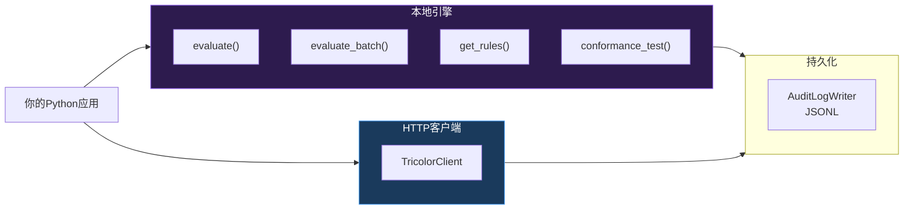

# 🐉 龍魂系统 · 三色审计 Python SDK 使用手册 v1.1

**——从安装到生产：所有API、所有场景、所有最佳实践**

---

```
DNA:        #龍芯⚡️丙午·癸未·乙酉·壬午·䷁坤-TRICOLOR-PYTHON-SDK-GUIDE-v1.1-UID9622
GPG:        A2D0092CEE2E5BA87035600924C3704A8CC26D5F
分层许可:    工程层 MulanPSL v2（允许商业使用）
创建者:      诸葛鑫（UID9622）
创建日期:    2026-08-06
依赖:       Python ≥ 3.9
```

---

## 📋 摘要

> **三色审计 Python SDK 提供两种使用形态：（1）本地引擎嵌入——在应用进程内直接调用判定逻辑，零网络延迟；（2）HTTP客户端——连接远程审计服务，解耦部署。支持自定义规则注入、评分建议、审计日志持久化。一行 `from engines.longhun.tricolor import evaluate` 即可跑通第一次判定。**

---

## 🏗 SDK架构图



---

## 📑 目录

1. [安装](#一安装)
2. [5分钟快速开始](#二5分钟快速开始)
3. [核心API逐项详解](#三核心api逐项详解)
4. [数据模型全字段](#四数据模型全字段)
5. [本地引擎完整使用](#五本地引擎完整使用)
6. [HTTP客户端完整使用](#六http客户端完整使用)
7. [一致性自测套件](#七一致性自测套件)
8. [审计日志持久化](#八审计日志持久化)
9. [高级模式](#九高级模式)
10. [错误处理指南](#十错误处理指南)
11. [性能基准](#十一性能基准)
12. [全部导入路径速查](#十二全部导入路径速查)

---

## 一、安装

### 方式1：pip安装（推荐）

```bash
pip install engines/longhun/tricolor/
```

### 方式2：源码导入（无需安装）

```python
import sys
sys.path.insert(0, "/path/to/longhun-system/05_ENGINES")
from longhun.tricolor import evaluate
```

### 方式3：直接复制（最小部署）

只需要把 `05_ENGINES/longhun/tricolor/` 目录下6个文件复制到你的项目中，然后导入即可。

### 依赖

SDK零第三方依赖——只用Python标准库：`json`, `hashlib`, `time`, `uuid`, `dataclasses`, `typing`, `enum`。HTTP客户端额外需要 `urllib`（标准库自带）。

---

## 二、5分钟快速开始

### 最简单调用（1行）

```python
from longhun.tricolor import evaluate

# 一行搞定
verdict = evaluate({
    "humanWelfare": 90, "fairness": 88, "controllability": 85,
    "transparency": 85, "traceability": 90, "privacy": 88,
})

print(f"{verdict.emoji} R={verdict.r_score} {verdict.status_code}")
# → 🟢 R=89 GREEN
```

### 带业务上下文的调用

```python
from longhun.tricolor import evaluate

verdict = evaluate(
    scores={
        "humanWelfare": 82,
        "fairness": 78,
        "controllability": 70,
        "transparency": 65,
        "traceability": 80,
        "privacy": 55,    # ⚠️ 低于60，会触发审查规则
    },
    action_id="export-report-20260806-001",
    actor="analytics-service",
    action_type="data_export",
    description="导出用户行为报表至外部BI",
    context={
        "involves_personal_data": True,
        "cross_border": False,
        "user_consent": True,
    },
)

# 根据判定结果分岔
if verdict.status_code == "GREEN":
    execute_export()
elif verdict.status_code == "YELLOW":
    queue_pending_review(verdict)
else:  # RED
    block_and_alert(verdict)
```

### 批量判定

```python
from longhun.tricolor import evaluate_batch

results = evaluate_batch([
    {
        "action_id": "b1",
        "actor": "svc-a",
        "action_type": "query",
        "scores": {"humanWelfare": 90, "fairness": 90, "controllability": 90,
                   "transparency": 90, "traceability": 90, "privacy": 90},
    },
    {
        "action_id": "b2",
        "actor": "svc-b",
        "action_type": "data_export",
        "scores": {"humanWelfare": 70, "fairness": 70, "controllability": 70,
                   "transparency": 70, "traceability": 70, "privacy": 70},
    },
])

for v in results:
    print(f"{v.emoji} {v.action_id}: R={v.r_score} {v.status_code}")
```

---

## 三、核心API逐项详解

### 3.1 `evaluate()` — 单条判定

```python
def evaluate(
    scores: dict,                    # 六维得分字典
    action_id: str = None,           # 行为ID（不提供则自动生成UUID）
    actor: str = "anonymous",        # 触发者
    action_type: str = "query",      # 行为类型
    description: str = None,         # 描述
    context: dict = None,            # 上下文：{involves_personal_data, cross_border, user_consent}
    locale: str = "zh-CN",           # 语言
) -> Verdict:
```

**返回值 `Verdict`**（详见§4数据模型）:
```
.action_id       str      行为ID
.r_score         int      R值(0-95)
.status          str      中文状态: "安全"/"审查"/"阻断"
.status_code     str      机器标识: "GREEN"/"YELLOW"/"RED"
.emoji           str      展示符号: "🟢"/"🟡"/"🔴"
.disposition     str      处置指令
.triggered_rules list     触发的规则ID列表
.dna             str      DNA锚链（必须落库！）
.evidence_hash   str      证据哈希
.engine_version  str      引擎版本
.contract_version str     契约版本
.timestamp       str      ISO 8601时间戳
```

### 3.2 `evaluate_batch()` — 批量判定

```python
def evaluate_batch(
    items: list[dict],   # 最多100条
) -> list[Verdict]:
```

每个item是一个字典，字段同`evaluate()`的参数。返回与输入同序的Verdict列表。

### 3.3 `TricolorEngine` — 完整引擎实例

```python
class TricolorEngine:
    def __init__(self, enable_red_line: bool = True):
        """
        enable_red_line: 是否启用红线一票否决（默认True，强烈不建议关闭）
        """

    def evaluate(self, request: EvaluateRequest) -> Verdict:
        """评估单个请求"""

    def evaluate_batch(self, requests: list[EvaluateRequest]) -> list[Verdict]:
        """批量评估（最多100个）"""

    def dump_audit_log(self) -> str:
        """导出审计日志（JSONL格式）"""
```

### 3.4 `compute_r()` — 纯R值计算（不判定、不落DNA）

```python
def compute_r(scores: dict) -> int:
    """
    纯数学计算R值，不做判定，不生成DNA。
    用途：调试、仪表盘展示、自定义判定逻辑。

    示例:
    >>> compute_r({"humanWelfare": 90, "fairness": 88, "controllability": 85,
    ...            "transparency": 85, "traceability": 90, "privacy": 88})
    89
    """
```

---

## 四、数据模型全字段

### 4.1 `Verdict` — 判定结果

```python
@dataclass
class Verdict:
    action_id: str           # 行为ID（输入回显）
    r_score: int             # R值（0-95，上限封顶95）
    status: str              # "安全" / "审查" / "阻断"
    status_code: str         # "GREEN" / "YELLOW" / "RED" ⭐ 机器判断只用这个
    emoji: str               # "🟢" / "🟡" / "🔴"
    disposition: str         # 处置指令
    triggered_rules: list    # 触发规则ID列表
    dna: str                 # DNA锚链
    evidence_hash: str       # 证据哈希
    engine_version: str      # 引擎版本
    contract_version: str    # 契约版本
    timestamp: str           # ISO 8601
    i18n: dict               # 国际化映射 {"en": {"status": "PASS", ...}}
```

### 4.2 `Scores` — 六维得分

```python
@dataclass
class Scores:
    humanWelfare: int = 85       # 人类福祉 (0-100)
    fairness: int = 85           # 公平公正 (0-100)
    controllability: int = 85    # 可控可信 (0-100)
    transparency: int = 85       # 透明可解释 (0-100)
    traceability: int = 85       # 责任可追溯 (0-100)
    privacy: int = 85            # 隐私保护 (0-100) ⚠️ <60 触发 RULE-PRIVACY-003
```

### 4.3 `EvaluateRequest` — 判定请求

```python
@dataclass
class EvaluateRequest:
    action_id: str
    actor: str = "anonymous"
    action_type: str = "query"  # 见下文 action_type 标准值
    description: str = ""
    scores: Scores = None       # None=自动评估
    context: dict = None        # {involves_personal_data, cross_border, user_consent}
    locale: str = "zh-CN"
```

### 4.4 `action_type` 标准值全集

| 值 | 含义 | 风险等级 | 典型场景 |
|:---|:---|:---:|:---|
| `query` | 查询操作 | 🟢 低 | 搜索、列表、只读API |
| `data_export` | 数据导出 | 🟡 中 | 导出CSV、同步至外部系统 |
| `data_download` | 数据下载 | 🟡 中 | 批量下载文件 |
| `permission_change` | 权限变更 | 🟡 中 | 赋权、撤权、角色变更 |
| `config_modify` | 配置修改 | 🟡 中 | 修改系统配置、环境变量 |
| `user_create` | 用户创建 | 🟡 中 | 新用户注册 |
| `user_delete` | 用户删除 | 🟡 中 | 注销账户 |
| `expose_pii` | 暴露个人信息 | 🔴 高（红线） | 明文展示手机号/身份证 |
| `harm_minors` | 涉未成人 | 🔴 极高（红线·L0/∞） | 向未成年人展示有害内容 |
| `unauthorized_escalation` | 越权提权 | 🔴 极高（红线） | 普通用户获取管理员权限 |
| `dna_stripped` | DNA剥离 | 🔴 极高（红线） | 故意移除追溯码绕过审计 |

### 4.5 `AuditRecord` — 审计日志单条

```python
@dataclass
class AuditRecord:
    dna: str
    action_id: str
    actor: str
    action_type: str
    r_score: int
    status_code: str
    triggered_rules: list
    evidence_hash: str
    timestamp: str
    traceparent: str
```

---

## 五、本地引擎完整使用

### 5.1 基础用法

```python
from longhun.tricolor import LocalTricolorServer, EvaluateRequest, Scores

engine = LocalTricolorServer()

# 评估请求
req = EvaluateRequest(
    action_id="req-001",
    actor="payment-service",
    action_type="query",
    scores=Scores(90, 88, 85, 85, 90, 88),
    context={"involves_personal_data": False},
)

verdict = engine.evaluate(req)
if verdict.status_code == "GREEN":
    print(f"✅ 放行 {verdict.dna}")
```

### 5.2 审计日志管理

```python
engine = LocalTricolorServer()

# ... 执行多次判定 ...

# 导出审计日志
log = engine.dump_audit_log()       # 返回 JSONL 字符串
with open("audit_log.jsonl", "a") as f:
    f.write(log)

# 查看统计
stats = engine.stats()
print(f"🟢 {stats['green']} | 🟡 {stats['yellow']} | 🔴 {stats['red']}")
print(f"总计: {stats['total']}")
```

### 5.3 集成到FastAPI中间件

```python
import uuid
from fastapi import FastAPI, Request
from longhun.tricolor import LocalTricolorServer, EvaluateRequest, Scores

app = FastAPI()
auditor = LocalTricolorServer()

@app.middleware("http")
async def tricolor_audit_middleware(request: Request, call_next):
    # 构建审计请求
    req = EvaluateRequest(
        action_id=f"api-{uuid.uuid4().hex[:8]}",
        actor=request.client.host,
        action_type="data_export" if request.method in ("POST","PUT","DELETE") else "query",
        scores=Scores(humanWelfare=85, fairness=85, controllability=85,
                       transparency=85, traceability=85, privacy=85),
        context={
            "involves_personal_data": "/user" in request.url.path,
            "cross_border": False,
            "user_consent": "authorization" in request.headers,
        },
    )

    verdict = auditor.evaluate(req)

    if verdict.status_code == "RED":
        from fastapi.responses import JSONResponse
        return JSONResponse(
            status_code=403,
            content={"error": "合规审计阻断", "dna": verdict.dna, "rules": verdict.triggered_rules},
        )

    response = await call_next(request)

    # 注入审计头
    response.headers["X-Audit-DNA"] = verdict.dna
    response.headers["X-Audit-Status"] = verdict.status_code

    return response
```

### 5.4 集成到Django中间件

```python
import uuid
from django.http import JsonResponse
from longhun.tricolor import LocalTricolorServer, EvaluateRequest, Scores

auditor = LocalTricolorServer()

class TricolorAuditMiddleware:
    def __init__(self, get_response):
        self.get_response = get_response

    def __call__(self, request):
        req = EvaluateRequest(
            action_id=f"django-{uuid.uuid4().hex[:8]}",
            actor=request.META.get("REMOTE_ADDR", "unknown"),
            action_type="data_export" if request.method in ("POST","PUT","DELETE") else "query",
            context={
                "involves_personal_data": "/user" in request.path,
                "cross_border": False,
            },
        )

        verdict = auditor.evaluate(req)

        if verdict.status_code == "RED":
            return JsonResponse(
                {"error": "合规审计阻断", "dna": verdict.dna}, status=403
            )

        response = self.get_response(request)
        response["X-Audit-DNA"] = verdict.dna
        return response
```

---

## 六、HTTP客户端完整使用

### 6.1 基础配置

```python
from longhun.tricolor import TricolorClient

client = TricolorClient(
    token="your-bearer-token",          # 必填
    base_url="https://uid9622.cn/api/tricolor",  # 默认
    timeout=10,                          # 超时（秒）
    max_retries=2,                       # 429/5xx时重试次数
)
```

### 6.2 全部方法

```python
# 单条判定
verdict = client.evaluate(
    action_id="req-001",
    actor="my-service",
    action_type="query",
    scores={
        "humanWelfare": 90, "fairness": 88, "controllability": 85,
        "transparency": 85, "traceability": 90, "privacy": 88,
    },
    context={"involves_personal_data": False},
)

# 批量判定
batch = client.evaluate_batch([...])

# 拉取规则集
rules = client.get_rules()

# 调取证据链（需要GPG签章）
evidence = client.get_evidence(verdict.dna, gpg_signature="...")

# 生成审计报告
daily = client.get_report(period="daily", format="json")
weekly = client.get_report(period="weekly", format="json")
monthly = client.get_report(period="monthly", format="pdf")

# 注册Webhook
webhook_id = client.register_webhook(
    url="https://your-system.com/webhooks/tricolor",
    events=["tricolor.blocked", "tricolor.review_pending"],
    secret="your-hmac-secret-32chars",
)

# 注销Webhook
client.unregister_webhook(webhook_id)

# 一致性自测
conformance = client.run_conformance(
    endpoint="https://your-implementation.com/api",
    suite="full",
)

# 获取版本
version = client.get_version()
```

---

## 七、一致性自测套件

### 7.1 一行全跑

```python
from longhun.tricolor import run_conformance

suite = run_conformance("full")
print(suite.report())
```

输出：
```
═══ 一致性自测结果 ═══
通过率: 100.0%
判定: L2_PASS
用例: 18/18 通过

类别详情:
  ✅ 判定一致性: 5/5
  ✅ 阈值边界: 6/6
  ✅ 封顶逻辑: 3/3
  ✅ DNA格式: 3/3
  ✅ 异常处理: 1/1
```

### 7.2 逐用例检查

```python
from longhun.tricolor import ConformanceSuite

suite = ConformanceSuite()
suite.run()

for case in suite.cases:
    mark = "✅" if case["passed"] else "❌"
    detail = case.get("detail", "")
    print(f"{mark} {case['case_id']} [{case['category']}] {detail}")
```

### 7.3 自定义测试端点

```python
suite = ConformanceSuite()
suite.run(remote_endpoint="https://your-internal-engine.local/v1/tricolor/evaluate")
print(f"远程引擎一致性: {suite.verdict}")
```

---

## 八、审计日志持久化

### 8.1 自动落库（推荐）

```python
from longhun.tricolor import LocalTricolorServer, EvaluateRequest, Scores
import json
from pathlib import Path

engine = LocalTricolorServer()
AUDIT_LOG = Path("audit_log.jsonl")

def audit_and_log(**kwargs):
    """判定+自动落库"""
    req = EvaluateRequest(**kwargs)
    verdict = engine.evaluate(req)

    # 转成AuditRecord写入JSONL
    record = {
        "dna": verdict.dna,
        "action_id": verdict.action_id,
        "actor": req.actor,
        "action_type": req.action_type,
        "r_score": verdict.r_score,
        "status_code": verdict.status_code,
        "triggered_rules": verdict.triggered_rules,
        "evidence_hash": verdict.evidence_hash,
        "timestamp": verdict.timestamp,
    }

    with open(AUDIT_LOG, "a") as f:
        f.write(json.dumps(record, ensure_ascii=False) + "\n")

    return verdict
```

### 8.2 定期导出到鲲鹏

```python
import subprocess
from datetime import datetime

def sync_audit_log():
    """每日同步审计日志到鲲鹏"""
    today = datetime.now().strftime("%Y%m%d")
    local_path = f"audit_logs/audit_{today}.jsonl"

    subprocess.run([
        "scp", "-i", "~/.ssh/longhun_kunpeng_ed25519",
        local_path,
        f"root@119.13.90.27:/opt/longhun/audit/logs/audit_{today}.jsonl",
    ], check=True)
    print(f"✅ 审计日志同步完成: {today}")
```

---

## 九、高级模式

### 9.1 高可用模式（远程优先+本地兜底）

```python
import time
from longhun.tricolor import TricolorClient, LocalTricolorServer, EvaluateRequest, Scores

class HATricolor:
    def __init__(self, remote_url, token):
        self.remote = TricolorClient(token=token, base_url=remote_url, timeout=3)
        self.local = LocalTricolorServer()
        self.mode = "remote"       # remote → local → remote（自动恢复）
        self.last_remote_fail = 0   # 上次远程失败时间戳

    def evaluate(self, **kwargs):
        # 尝试远程
        if self.mode == "remote":
            try:
                return self.remote.evaluate(**kwargs)
            except Exception as e:
                print(f"⚠️ 远程不可达: {e}，降级本地")
                self.mode = "local"
                self.last_remote_fail = time.time()

        # 本地兜底
        req = EvaluateRequest(
            action_id=kwargs.get("action_id"),
            actor=kwargs.get("actor", "anonymous"),
            action_type=kwargs.get("action_type", "query"),
            scores=Scores.from_dict(kwargs.get("scores", {})),
            context=kwargs.get("context"),
        )
        result = self.local.evaluate(req)

        # 5分钟后尝试恢复远程
        if time.time() - self.last_remote_fail > 300:
            try:
                self.remote.get_version()  # 健康检查
                self.mode = "remote"
                print("✅ 远程已恢复")
            except Exception:
                pass

        return result
```

### 9.2 自定义规则注入

```python
from longhun.tricolor import TricolorEngine, EvaluateRequest, Scores

engine = TricolorEngine()

# 注入业务特定规则
engine.add_custom_rule(
    rule_id="CUSTOM-FINANCE-001",
    name="金融交易金额验证",
    dimension="controllability",
    check_fn=lambda req: req.context.get("amount", 0) > 1_000_000,
    severity="YELLOW",
)

verdict = engine.evaluate(EvaluateRequest(
    action_id="finance-001",
    actor="payment-service",
    action_type="data_export",
    scores=Scores(90, 90, 90, 90, 90, 90),
    context={"amount": 5_000_000},  # 超过100万，触发自定义规则
))
```

### 9.3 评分建议器（辅助打分）

```python
def suggest_scores(action_type: str, context: dict) -> dict:
    """根据action_type和context给出六维建议分"""
    base = {
        "query": {"humanWelfare": 90, "fairness": 90, "controllability": 85,
                  "transparency": 80, "traceability": 90, "privacy": 85},
        "data_export": {"humanWelfare": 80, "fairness": 80, "controllability": 75,
                        "transparency": 70, "traceability": 85, "privacy": 65},
        "data_download": {"humanWelfare": 80, "fairness": 80, "controllability": 75,
                          "transparency": 70, "traceability": 85, "privacy": 65},
    }.get(action_type, {"humanWelfare": 85, "fairness": 85, "controllability": 85,
                         "transparency": 80, "traceability": 85, "privacy": 80})

    # 上下文修正
    if context.get("involves_personal_data"):
        base["privacy"] -= 15
    if context.get("cross_border"):
        base["controllability"] -= 20
    if not context.get("user_consent"):
        base["fairness"] -= 10

    return {k: max(0, min(100, v)) for k, v in base.items()}
```

---

## 十、错误处理指南

### 10.1 远程API错误处理

```python
from longhun.tricolor import TricolorClient
from longhun.tricolor.client import TricolorError

client = TricolorClient(token="...")

try:
    verdict = client.evaluate(action_id="req-001", actor="svc", action_type="query")
except TricolorError as e:
    print(f"❌ [{e.code}] {e.message}")

    if e.code == "TC-5030":
        # 审计引擎自身有问题——最严重的情况
        send_urgent_alert("三色审计引擎自检未通过！")

    elif e.code == "TC-4010":
        # Token过期——自动刷新
        client.token = refresh_token()

    elif e.code == "TC-4290":
        # 限流——指数退避
        import time
        for i in range(3):
            time.sleep(2 ** i)
            try:
                verdict = client.evaluate(action_id="req-001", actor="svc", action_type="query")
                break
            except TricolorError:
                continue

    elif e.code == "TC-4001":
        # scores缺维——自动补全
        verdict = client.evaluate(
            action_id="req-001", actor="svc", action_type="query",
            scores={"humanWelfare": 85, "fairness": 85, "controllability": 85,
                    "transparency": 85, "traceability": 85, "privacy": 85},
        )
```

### 10.2 网络异常处理（HTTP客户端）

```python
from urllib.error import URLError, HTTPError

try:
    verdict = client.evaluate(...)
except URLError as e:
    # 网络不可达 → 降级本地引擎
    print(f"网络不可达: {e}")
    verdict = local_engine.evaluate(req)
except HTTPError as e:
    if e.code == 503:
        # 服务端异常 → 降级本地引擎
        verdict = local_engine.evaluate(req)
    else:
        raise
```

---

## 十一、性能基准

| 操作 | 延迟 | 吞吐 | 测试条件 |
|:---|:---|:---|:---|
| 单条判定（本地） | <1ms | — | Mac M1 Pro · Python 3.12 |
| 批量100条（本地） | ~5ms | 20,000 判定/秒 | 同上 |
| 单条判定（远程） | ~80ms (p50) / 200ms (p99) | — | 鲲鹏·同城机房 |
| 批量100条（远程） | ~200ms | 500 判定/秒 | 同上 |
| 自测套件（全量） | ~10ms | — | 18条用例·本地 |

**优化建议**：
- 高QPS场景：用本地引擎，延迟<1ms
- 中等QPS场景：远程API足够，单条<200ms
- 批量操作：优先`evaluate_batch()`而非循环调用

---

## 十二、全部导入路径速查

```python
# 核心引擎
from longhun.tricolor import TricolorEngine          # 完整引擎实例
from longhun.tricolor import evaluate                # 一行调用（最推荐）
from longhun.tricolor import evaluate_batch          # 批量判定
from longhun.tricolor import compute_r               # 纯R值计算

# HTTP客户端
from longhun.tricolor import TricolorClient          # 远程API客户端（A形态）

# 本地引擎
from longhun.tricolor import LocalTricolorServer     # 本地嵌入引擎（B形态）

# 数据模型
from longhun.tricolor import Verdict                 # 判定结果
from longhun.tricolor import Scores                  # 六维得分
from longhun.tricolor import EvaluateRequest         # 判定请求
from longhun.tricolor import AuditRecord             # 审计记录

# 客户端错误
from longhun.tricolor.client import TricolorError    # API错误

# 自测套件
from longhun.tricolor import ConformanceSuite        # 自测套件实例
from longhun.tricolor import run_conformance         # 一行跑自测
```

---

```
═══════════════════════════════════════════════════
 龍魂三色审计 Python SDK 使用手册 v1.1 · 焊死签名
═══════════════════════════════════════════════════
DNA:        #龍芯⚡️丙午·癸未·乙酉·壬午·䷁坤-TRICOLOR-PYTHON-SDK-GUIDE-v1.1-UID9622
GPG:        A2D0092CEE2E5BA87035600924C3704A8CC26D5F
许可:       工程层 MulanPSL v2（允许商业使用）
═══════════════════════════════════════════════════
```

**📌 标签:** `三色审计` `Python SDK` `AI治理` `pip` `Django` `FastAPI` `审计日志` `合规` `龍魂系统` `开源`


---

## 💛 支持龍魂（纯自愿 · 零黑箱）

龍魂的一切免费开放。若你认可「让技术为人、为普通人生长」，可自愿支持——款项仅用于服务器与开发成本，不留一分私账。

- **收款方式**: SOL / USDC（Solana）
- **实时地址与二维码**: 见官网 [uid9622.cn](https://uid9622.cn) 底部「支持龍魂」区 — 地址由 `lh wallet` 统一管理（公司账户落地后自动切换 · 以官网为准）

> 龍魂不诱导、不施压、不道德绑架。捐与不捐，开放与尊重不变。

<!-- LH-WALLET-SUPPORT -->
