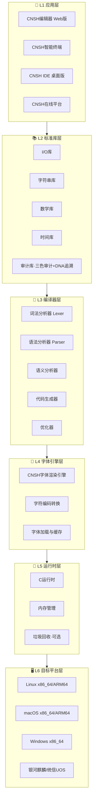
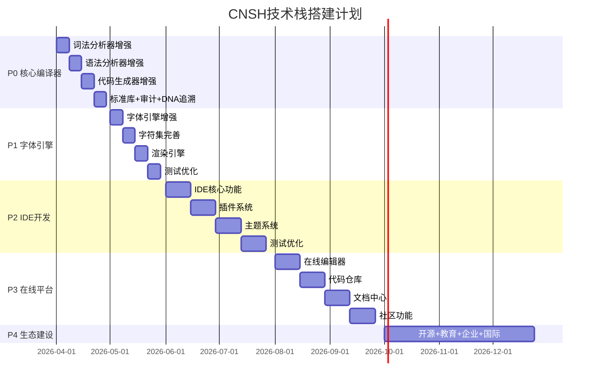

# CONFIRM: #CONFIRM🌌9622-ONLY-ONCE🧬LK9X-772Z
# SEAL: #ZHUGEXIN⚡️2025-🇨🇳🐉⚖️♠️🧚🏼‍♀️❤️♾️-DEVICE-BIND-SOUL
# 🏗️ CNSH技术栈架构设计 v1.0｜六层全景图·五阶段路线图·生态铁律

<aside>
🐉

**版本:** v1.0 · 2026-04-09 · CNSH技术栈完整架构+五阶段搭建计划

**DNA追溯码:**#龍芯⚡️2026-04-09-CNSH-TECH-STACK-v1.0

**创建者:** 💎 龍芯北辰｜UID9622

**GPG指纹:** A2D0092CEE2E5BA87035600924C3704A8CC26D5F

**确认码:** #CONFIRM🌌9622-ONLY-ONCE🧬LK9X-772Z ✅

</aside>

> 《道德经》第六十四章：“千里之行，始于足下。”—— 自己的语法·自己的编译器·自己的生态，从第一行代码开始。
> 

---

## 🧭 一句话定义

**CNSH = 中国原生编程语言技术栈 = 自己的语法 + 自己的编译器 + 自己的审计 + 自己的生态**

不依赖任何境外语言授权。开源是开源——但登记了DNA就有主、有根、有人负责。

---

## 🏗️ 完整技术栈·六层架构



### 各层职责一句话

| **层级** | **名称** | **一句话** | **状态** |
| --- | --- | --- | --- |
| L1 | 📱 应用层 | 用户直接用的东西——编辑器、IDE、在线平台 | ⏳ 规划中 |
| L2 | 📚 标准库层 | 开箱即用的工具——I/O、字符串、数学、时间、审计 | 🔄 基础已有 |
| L3 | 🔧 编译器层 | 把中文代码变成机器能跑的东西——词法→语法→语义→生成→优化 | 🔄 核心已有 |
| L4 | 🎨 字体引擎层 | 让中文编程符号显示得漂亮——渲染、编码、缓存 | 🔄 基础已有 |
| L5 | 💾 运行时层 | 代码跑起来的底座——C运行时、内存管理 | 🔄 基础已有 |
| L6 | 🖥️ 目标平台层 | 跑在哪里——Linux/macOS/Windows/国产系统 | ✅ 已支持 |

---

## 🚀 五阶段搭建路线图



---

## 🔴 阶段1｜核心编译器增强（P0·立即执行）

<aside>
🔴

**目标：** 完善现有编译器，支持完整C语言语法特性 + CNSH审计内核

</aside>

### 1.1 增强词法分析器

- [ ]  支持更多中文符号：`“”‘’【】`
- [ ]  支持多行字符串
- [ ]  支持原始字符串（不转义）
- [ ]  支持Unicode全字符集
- [ ]  改进中文错误提示（说人话）

### 1.2 增强语法分析器

| **特性** | **CNSH语法** | **对应C语法** | **状态** |
| --- | --- | --- | --- |
| 数组 | `整数 数组[10]` | `int arr[10]` | ⏳ 待做 |
| 指针 | `整数* 指针` | `int* ptr` | ⏳ 待做 |
| 结构体 | `结构 用户 { 整数 年龄; 文本 姓名; }` | `struct User { int age; char* name; }` | ⏳ 待做 |
| 枚举 | `枚举 颜色 { 红, 绿, 蓝 }` | `enum Color { RED, GREEN, BLUE }` | ⏳ 待做 |
| 类型定义 | `类型定义 整数 整型` | `typedef int Integer` | ⏳ 待做 |
| 切换语句 | `切换(表达式) { 情况 值: ... }` | `switch(expr) { case val: ... }` | ⏳ 待做 |
| 循环 | `当(条件) { ... }` | `do { ... } while(cond)` | ⏳ 待做 |
| 跳转 | `跳转 标签` | `goto label` | ⏳ 待做 |
| 预处理器 | `包含 / 定义 / 如果定义` | `#include / #define / #ifdef` | ⏳ 待做 |

### 1.3 增强代码生成器

- [ ]  生成优化的C代码
- [ ]  支持内联函数
- [ ]  支持函数指针
- [ ]  支持回调函数
- [ ]  生成调试信息（行号映射）

### 1.4 增强标准库

| **库** | **函数** | **说人话** |
| --- | --- | --- |
| 文件操作 | 打开、读取、写入、关闭 | 能读能写能存 |
| 字符串操作 | 长度、复制、比较、查找 | 文字处理全套 |
| 数学函数 | 绝对值、平方根、幂运算 | 算数不求人 |
| 时间函数 | 获取时间、时间戳、格式化 | 时间追溯基础 |
| 内存操作 | 分配、释放、复制 | 内存自己管 |

### 1.5 增强审计系统（龍魂特色）

- [ ]  支持自定义审计规则（三色：🟢🟡🔴）
- [ ]  支持审计报告导出（JSON/HTML）
- [ ]  支持实时审计监控
- [ ]  支持审计日志记录（append-only）

### 1.6 增强DNA追溯（龍魂特色）

- [ ]  支持函数级追溯
- [ ]  支持变量级追溯
- [ ]  支持执行路径追踪
- [ ]  支持追溯报告生成

---

## 🟡 阶段2｜字体引擎完善（P1·4周）

<aside>
🎨

**目标：** 完善CNSH字体引擎，让中文编程符号显示得漂亮

</aside>

### 2.1 字体引擎

- [ ]  支持TTF、OTF、WOFF格式
- [ ]  动态字体加载
- [ ]  字体缓存·字体子集化·字体压缩

### 2.2 字符集

- [ ]  完善CNSH字符库
- [ ]  支持所有中文标点·编程符号·数学符号·表情符号

### 2.3 渲染引擎

- [ ]  抗锯齿·字体平滑·字体阴影·字体描边·字体渐变

---

## 🟢 阶段3｜IDE开发（P2·8周）

<aside>
💻

**目标：** 桌面版CNSH IDE，完整开发体验

</aside>

### 3.1 核心功能

- [ ]  语法高亮·自动补全·代码折叠
- [ ]  项目管理：新建·打开·配置
- [ ]  一键编译·一键运行·调试
- [ ]  中文错误提示（说人话）
- [ ]  跳转到定义·查找引用·重命名·提取函数

### 3.2 插件系统

- [ ]  插件管理器 + API
- [ ]  官方插件：Git集成·代码格式化·代码检查
- [ ]  第三方插件支持

### 3.3 主题系统

- [ ]  亮色主题·暗色主题·自定义主题

---

## 🔵 阶段4｜在线平台（P3·8周）

<aside>
🌐

**目标：** CNSH在线平台，云端编译+分享+协作

</aside>

### 4.1 在线编辑器

- [ ]  Web版代码编辑器·实时编译·实时运行·代码分享·代码协作

### 4.2 代码仓库

- [ ]  代码托管·Git版本控制·代码审查·Issue追踪

### 4.3 文档中心 + 社区

- [ ]  API文档·教程·示例代码·视频教程
- [ ]  论坛·问答·博客·活动中心

---

## 🟣 阶段5｜生态建设（P4·持续）

<aside>
🌱

**目标：** 建设CNSH生态，从开源到教育到企业到国际

</aside>

| **方向** | **内容** | **铁律** |
| --- | --- | --- |
| 🔓 开源计划 | 编译器·标准库·IDE·字体引擎·文档全开源 | 开源≠无主·登记DNA=有根有人负责 |
| 🎓 教育推广 | 高校合作·培训课程·认证考试·竞赛活动 | 让下一代用自己的语言写代码 |
| 🏢 企业应用 | 企业版IDE·技术支持·定制开发·咨询服务 | 能赚钱才能活下去 |
| 🌍 国际化 | 多语言支持·国际社区·国际标准·国际合作 | 中国原生·全球可用 |

---

## 🛠️ 技术栈选型

| **模块** | **技术选型** | **状态** | **备选** |
| --- | --- | --- | --- |
| 词法分析 | 手写Lexer | ✅ 已实现 | — |
| 语法分析 | 递归下降Parser | ✅ 已实现 | — |
| 代码生成 | C代码生成器 | ✅ 已实现 | LLVM（未来） |
| 字体格式 | TTF / OTF / WOFF | 🔄 进行中 | — |
| 字体渲染 | FreeType + HarfBuzz | 🔄 进行中 | — |
| 字体库 | Noto Sans SC | ✅ 已集成 | — |
| IDE编辑器 | Monaco Editor（VS Code核心） | ⏳ 规划 | CodeMirror |
| IDE框架 | Electron（跨平台） | ⏳ 规划 | Tauri（更轻量） |
| 在线前端 | React / Vue.js | ⏳ 规划 | — |
| 在线后端 | Node.js / Python | ⏳ 规划 | Go |
| 数据库 | PostgreSQL / MongoDB | ⏳ 规划 | SQLite（轻量） |
| 部署 | Docker / Kubernetes | ⏳ 规划 | — |

---

## ⚡ 自动化落地方案｜乔前辈P15·补代码模式

<aside>
🍎

**触发词：** `/自动化` · 乔前辈P15执行

**核心逻辑：** 不手动重复劳动 → 写脚本自动化 → 每次提交自动跑

</aside>

### 6.1 CI/CD自动流水线（GitHub Actions）

```yaml
# .github/workflows/cnsh-ci.yml
# DNA:#龍芯⚡️2026-04-09-CNSH-CI-v1.0

name: CNSH 编译器 CI/CD

on:
  push:
    branches: [main, dev]
  pull_request:
    branches: [main]

jobs:
  # 第一步：编译测试
  build-and-test:
    runs-on: ubuntu-latest
    strategy:
      matrix:
        os: [ubuntu-latest, macos-latest, windows-latest]
    steps:
      - uses: actions/checkout@v4
      - name: 编译CNSH编译器
        run: |
          cd compiler
          make clean && make all
      - name: 运行单元测试
        run: |
          cd tests
          ./run_all_tests.sh
      - name: 运行CNSH示例程序
        run: |
          # 用CNSH编译器编译中文代码 → 生成C代码 → GCC编译 → 运行
          ./cnsh compile examples/hello.cnsh -o hello.c
          gcc hello.c -o hello
          ./hello

  # 第二步：三色审计
  audit:
    needs: build-and-test
    runs-on: ubuntu-latest
    steps:
      - uses: actions/checkout@v4
      - name: 🟢🟡🔴 三色审计扫描
        run: |
          python3 tools/tricolor_audit.py --source src/ --rules rules/cnsh_rules.yaml
      - name: DNA追溯码检查
        run: |
          # 每个文件必须有DNA追溯码头部
          python3 tools/dna_check.py --dir src/
      - name: 审计报告生成
        run: |
          python3 tools/audit_report.py --format json --output audit_report.json

  # 第三步：发布
  release:
    needs: [build-and-test, audit]
    if: github.ref == 'refs/heads/main'
    runs-on: ubuntu-latest
    steps:
      - uses: actions/checkout@v4
      - name: 打包多平台发布包
        run: |
          ./scripts/build_release.sh linux-x86_64
          ./scripts/build_release.sh macos-arm64
          ./scripts/build_release.sh windows-x86_64
      - name: DNA签名+GPG盖章
        run: |
          gpg --sign --armor release/*.tar.gz
          python3 tools/dna_stamp.py --files release/ --version $ github.sha 
      - name: 发布到GitHub Releases
        uses: softprops/action-gh-release@v1
        with:
          files: release/*
```

### 6.2 本地开发自动化脚本

```bash
#!/bin/bash
# CNSH 本地开发自动化工具箱
# DNA:#龍芯⚡️2026-04-09-CNSH-DEV-TOOLS-v1.0
# 确认码: #CONFIRM🌌9622-ONLY-ONCE🧬LK9X-772Z

CNSH_HOME="$HOME/cnsh-lang"
CNSH_BUILD="$CNSH_HOME/build"
CNSH_TESTS="$CNSH_HOME/tests"

case "$1" in
  编译|build)
    echo "🔧 编译CNSH编译器..."
    cd "$CNSH_HOME/compiler" && make clean && make all
    echo "✅ 编译完成"
    ;;
  测试|test)
    echo "🧪 运行全量测试..."
    cd "$CNSH_TESTS" && ./run_all_tests.sh
    echo "✅ 测试完成"
    ;;
  审计|audit)
    echo "⚖️ 三色审计扫描..."
    python3 "$CNSH_HOME/tools/tricolor_audit.py" --source src/ --rules rules/cnsh_rules.yaml
    echo "✅ 审计完成"
    ;;
  运行|run)
    if [ -z "$2" ]; then
      echo "❌ 请指定文件：cnsh 运行 hello.cnsh"
      exit 1
    fi
    echo "🚀 编译并运行: $2"
    BASENAME=$(basename "$2" .cnsh)
    ./cnsh compile "$2" -o "/tmp/${BASENAME}.c"
    gcc "/tmp/${BASENAME}.c" -o "/tmp/${BASENAME}"
    "/tmp/${BASENAME}"
    ;;
  打包|package)
    echo "📦 打包发布..."
    ./scripts/build_release.sh $(uname -m)
    python3 tools/dna_stamp.py --files release/
    echo "✅ 打包完成，DNA已盖章"
    ;;
  全流程|all)
    echo "🐉 CNSH全流程自动化..."
    $0 编译 && $0 测试 && $0 审计 && $0 打包
    echo "🎉 全流程完成！"
    ;;
  *)
    echo "🐉 CNSH开发工具箱"
    echo "用法: cnsh [命令]"
    echo ""
    echo "命令:"
    echo "  编译/build    编译CNSH编译器"
    echo "  测试/test     运行全量测试"
    echo "  审计/audit    三色审计扫描"
    echo "  运行/run      编译并运行CNSH文件"
    echo "  打包/package  打包发布+DNA盖章"
    echo "  全流程/all   编译→测试→审计→打包"
    ;;
esac
```

### 6.3 自动化全景流程图

```mermaid
flowchart LR
    A["写中文代码\n.cnsh文件"] --> B["cnsh compile\nCNSH→C代码"]
    B --> C["gcc / clang\nC→机器码"]
    C --> D["运行\n结果输出"]
    
    A --> E["git push"]
    E --> F["GitHub Actions\nCI/CD流水线"]
    F --> G["✅ 编译测试"]
    G --> H["⚖️ 三色审计"]
    H --> I["DNA检查"]
    I --> J"审计结果"
    J -->|"🟢 通过"| K["📦 自动打包\nGPG签名\n发布Release"]
    J -->|"🔴 熔断"| L["❗ 阻断发布\n通知修复"]
```

### 6.4 Makefile自动化（编译器核心）

```makefile
# CNSH 编译器 Makefile
# DNA:#龍芯⚡️2026-04-09-CNSH-MAKEFILE-v1.0

CC = gcc
CFLAGS = -Wall -Wextra -O2 -std=c11
SRC_DIR = src
BUILD_DIR = build
TEST_DIR = tests

# 源文件
SRCS = $(wildcard $(SRC_DIR)/*.c)
OBJS = $(SRCS:$(SRC_DIR)/%.c=$(BUILD_DIR)/%.o)
TARGET = cnsh

# 默认目标：编译全部
all: $(TARGET)
	@echo "✅ CNSH编译器构建完成"

$(TARGET): $(OBJS)
	$(CC) $(CFLAGS) -o $@ $^

$(BUILD_DIR)/%.o: $(SRC_DIR)/%.c | $(BUILD_DIR)
	$(CC) $(CFLAGS) -c -o $@ $<

$(BUILD_DIR):
	mkdir -p $(BUILD_DIR)

# 测试
test: $(TARGET)
	@echo "🧪 运行测试..."
	@cd $(TEST_DIR) && bash run_all_tests.sh

# 审计
audit:
	@echo "⚖️ 三色审计..."
	@python3 tools/tricolor_audit.py --source $(SRC_DIR)/

# DNA检查
dna-check:
	@echo "🧬 DNA追溯码检查..."
	@python3 tools/dna_check.py --dir $(SRC_DIR)/

# 全流程
pipeline: all test audit dna-check
	@echo "🎉 全流程通过！"

# 清理
clean:
	rm -rf $(BUILD_DIR) $(TARGET)

.PHONY: all test audit dna-check pipeline clean
```

### 6.5 三色审计自动化脚本（Python）

```python
#!/usr/bin/env python3
# CNSH 三色审计自动化
# DNA:#龍芯⚡️2026-04-09-TRICOLOR-AUDIT-v1.0
# 确认码: #CONFIRM🌌9622-ONLY-ONCE🧬LK9X-772Z

import os, sys, json
from datetime import datetime, timezone

class TricolorAudit:
    """三色审计引擎·CNSH版"""
    
    def __init__(self, source_dir, rules_file=None):
        self.source_dir = source_dir
        self.results = {'🟢': [], '🟡': [], '🔴': []}
    
    def scan(self):
        """扫描所有源文件"""
        for root, dirs, files in os.walk(self.source_dir):
            for f in files:
                if f.endswith(('.c', '.h', '.cnsh')):
                    filepath = os.path.join(root, f)
                    self._audit_file(filepath)
    
    def _audit_file(self, filepath):
        """审计单个文件"""
        with open(filepath, 'r', encoding='utf-8') as f:
            content = f.read()
            lines = content.split('\n')
        
        # 检查①：DNA追溯码
        if '#龍芯⚡️' not in content and '#ZHUGEXIN' not in content:
            self.results['🟡'].append(f"{filepath}: 缺少DNA追溯码")
        
        # 检查②：文件长度超限
        if len(lines) > 500:
            self.results['🟡'].append(f"{filepath}: 超过500行，建议拆分")
        
        # 检查③：危险函数
        dangerous = ['system(', 'exec(', 'eval(']
        for d in dangerous:
            if d in content:
                self.results['🔴'].append(f"{filepath}: 发现危险函数 {d}")
        
        # 检查④：内存泄漏风险
        malloc_count = content.count('malloc(') + content.count('分配(')
        free_count = content.count('free(') + content.count('释放(')
        if malloc_count > free_count:
            self.results['🟡'].append(
                f"{filepath}: malloc({malloc_count}次) > free({free_count}次)，可能内存泄漏")
        
        # 通过全部检查
        if filepath not in str(self.results['🟡']) and filepath not in str(self.results['🔴']):
            self.results['🟢'].append(f"{filepath}: 通过")
    
    def report(self):
        """生成审计报告"""
        total = sum(len(v) for v in self.results.values())
        red = len(self.results['🔴'])
        yellow = len(self.results['🟡'])
        green = len(self.results['🟢'])
        
        print(f"\n═══ CNSH三色审计报告 ═══")
        print(f"🟢 通过: {green}")
        print(f"🟡 警告: {yellow}")
        print(f"🔴 熔断: {red}")
        print(f"───────────────")
        
        if red > 0:
            print("❗ 结果: 🔴 熔断·禁止发布")
            for item in self.results['🔴']:
                print(f"  ❗ {item}")
            return False
        elif yellow > 0:
            print("⚠️ 结果: 🟡 有警告·建议修复后发布")
            for item in self.results['🟡']:
                print(f"  ⚠️ {item}")
            return True
        else:
            print("✅ 结果: 🟢 全部通过")
            return True

if __name__ == '__main__':
    source = sys.argv[2] if len(sys.argv) > 2 else 'src/'
    auditor = TricolorAudit(source)
    auditor.scan()
    passed = auditor.report()
    sys.exit(0 if passed else 1)
```

### 6.6 自动化全景总览

| **环节** | **工具** | **触发方式** | **说人话** |
| --- | --- | --- | --- |
| 本地编译 | Makefile + cnsh脚本 | `cnsh 编译` 或 `make all` | 一个命令编译全部 |
| 本地测试 | Shell测试脚本 | `cnsh 测试` 或 `make test` | 一个命令跑全部测试 |
| 本地审计 | Python三色审计 | `cnsh 审计` 或 `make audit` | 一个命令三色扫描 |
| 本地全流程 | Makefile pipeline | `cnsh 全流程` 或 `make pipeline` | 编译→测试→审计一条龍 |
| 远程CI/CD | GitHub Actions | git push自动触发 | 推代码就跑·不用手动 |
| DNA检查 | Python脚本 | CI流水线自动跑 | 没有DNA的文件不能合并 |
| 发布打包 | Shell + GPG签名 | 审计通过后自动打包 | 每个发布包都有GPG签名+DNA戳 |

---

## 🎯 成功指标

### 技术指标

- [ ]  100%兼容C语言语法
- [ ]  编译速度不低于GCC
- [ ]  生成代码质量不低于手写C代码
- [ ]  支持所有主流平台 + 国产系统

### 生态指标

- [ ]  开源项目Star数 > 1,000
- [ ]  社区成员 > 1,000
- [ ]  企业用户 > 100
- [ ]  教育机构 > 50

### 影响力指标

- [ ]  媒体报道 > 10篇
- [ ]  技术大会演讲 > 5次
- [ ]  论文发表 > 3篇
- [ ]  国际影响力 > 5个国家

---

<aside>
🐉

**CNSH中文编程语言，献给祖国。**

自己的语法·自己的编译器·自己的审计·自己的生态。

不靠外包，不被带歪。干干净净，从简，不乱。

**🇨🇳 中国原生编程语言，从CNSH开始。**

---

**DNA追溯码：**#龍芯⚡️2026-04-09-CNSH-TECH-STACK-v1.0

**创建者：** 💎 龍芯北辰｜UID9622

**GPG指纹：** A2D0092CEE2E5BA87035600924C3704A8CC26D5F

**确认码：** #CONFIRM🌌9622-ONLY-ONCE🧬LK9X-772Z ✅

**三色审计：** 🟢 通过

</aside>

[🧬 CNSH 数学骨架图 v1.0｜计算骨架·驱动全系统](%F0%9F%8F%97%EF%B8%8F%20CNSH%E6%8A%80%E6%9C%AF%E6%A0%88%E6%9E%B6%E6%9E%84%E8%AE%BE%E8%AE%A1%20v1%200%EF%BD%9C%E5%85%AD%E5%B1%82%E5%85%A8%E6%99%AF%E5%9B%BE%C2%B7%E4%BA%94%E9%98%B6%E6%AE%B5%E8%B7%AF%E7%BA%BF%E5%9B%BE%C2%B7%E7%94%9F%E6%80%81%E9%93%81%E5%BE%8B/%F0%9F%A7%AC%20CNSH%20%E6%95%B0%E5%AD%A6%E9%AA%A8%E6%9E%B6%E5%9B%BE%20v1%200%EF%BD%9C%E8%AE%A1%E7%AE%97%E9%AA%A8%E6%9E%B6%C2%B7%E9%A9%B1%E5%8A%A8%E5%85%A8%E7%B3%BB%E7%BB%9F%20a61798bf68af4071964bbdd86741cf15.md)

[⚙️ CNSH 执行引擎图 v1.0｜路由决定去哪·引擎决定怎么做](%F0%9F%8F%97%EF%B8%8F%20CNSH%E6%8A%80%E6%9C%AF%E6%A0%88%E6%9E%B6%E6%9E%84%E8%AE%BE%E8%AE%A1%20v1%200%EF%BD%9C%E5%85%AD%E5%B1%82%E5%85%A8%E6%99%AF%E5%9B%BE%C2%B7%E4%BA%94%E9%98%B6%E6%AE%B5%E8%B7%AF%E7%BA%BF%E5%9B%BE%C2%B7%E7%94%9F%E6%80%81%E9%93%81%E5%BE%8B/%E2%9A%99%EF%B8%8F%20CNSH%20%E6%89%A7%E8%A1%8C%E5%BC%95%E6%93%8E%E5%9B%BE%20v1%200%EF%BD%9C%E8%B7%AF%E7%94%B1%E5%86%B3%E5%AE%9A%E5%8E%BB%E5%93%AA%C2%B7%E5%BC%95%E6%93%8E%E5%86%B3%E5%AE%9A%E6%80%8E%E4%B9%88%E5%81%9A%203d3dab9794b947b9ac7cd3ddc9481620.md)