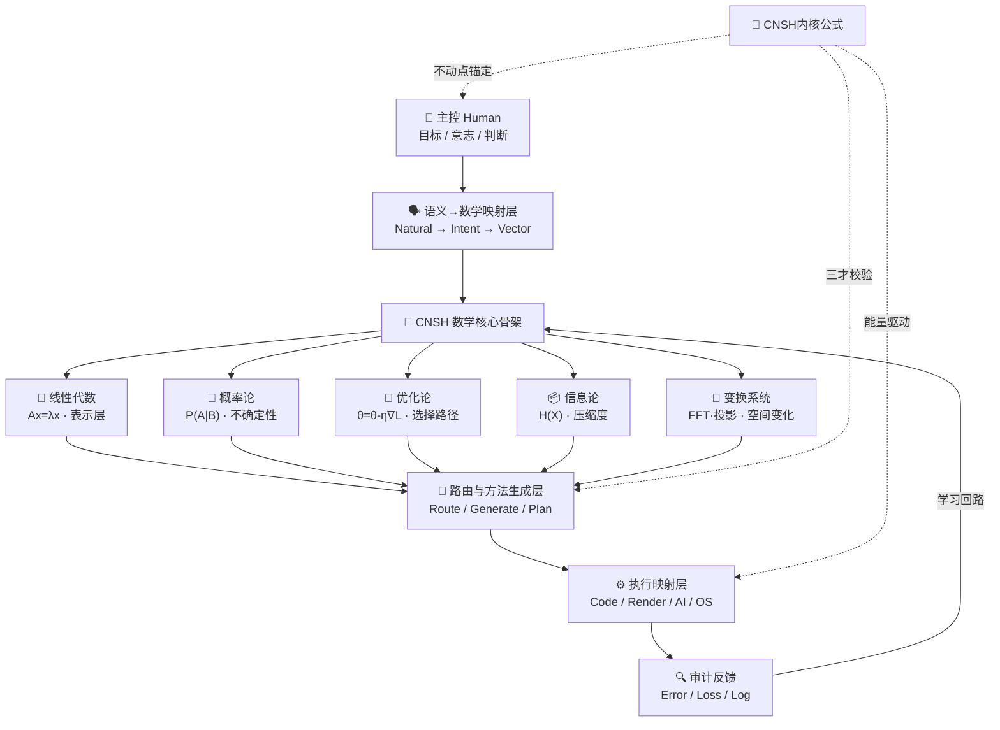

# DNA: #龍芯⚡️丙午·丙申·庚戌·䷙大畜-SCRIPT-MANAGER-v1.2-UID9622
# CONFIRM: #CONFIRM🌌9622-ONLY-ONCE🧬LK9X-772Z
# SEAL: #ZHUGEXIN⚡️2025-🇨🇳🐉⚖️♠️🧚🏼‍♀️❤️♾️-DEVICE-BIND-SOUL
# 🧬 CNSH 数学骨架图 v1.0｜计算骨架·驱动全系统

<aside>
🧬

**DNA追溯码：**#龍芯⚡️2026-04-13-CNSH_3978-v1.0

**确认码：** #CONFIRM🌌9622-ONLY-ONCE🧬LK9X-772Z ✅

**GPG指纹：** A2D0092CEE2E5BA87035600924C3704A8CC26D5F

**一句话：** 人类意志 → 数学结构 → 路由 → 方法 → 执行 → 审计

**三色审计：** 🟢 骨架完整可扩展 · 🟡 视觉/音频接入待补 · 🔴 风险=不锁5大核心会无限扩散

</aside>

> 《道德经》第十一章：“当其无，有室之用。”—— 骨架的价值在于它定义了空间，让万物得以挂载。
> 

---

## 🧠 一、总结构（先看整体）

```
             ┌────────────────────┐
             │      主控（Human）   │
             │   目标 / 意志 / 判断 │
             └────────┬───────────┘
                      │
                      ▼
     ┌────────────────────────────────┐
     │        语义 → 数学映射层         │
     │   Natural → Intent → Vector    │
     └────────┬─────────────────────┘
              │
              ▼
 ┌────────────────────────────────────────┐
 │            CNSH 数学核心骨架            │
 └────────────────────────────────────────┘
   │        │        │        │        │
   ▼        ▼        ▼        ▼        ▼
线性代数   概率论   优化论   信息论   变换系统
   │        │        │        │        │
   ▼        ▼        ▼        ▼        ▼
 表示层   不确定性   选择路径   压缩度   空间变化
   │        │        │        │        │
   └────────┴────────┴────────┴────────┘
                      │
                      ▼
         ┌────────────────────────┐
         │     路由与方法生成层     │
         │ Route / Generate / Plan │
         └────────┬───────────────┘
                  │
                  ▼
         ┌────────────────────────┐
         │       执行映射层         │
         │ Code / Render / AI / OS │
         └────────┬───────────────┘
                  │
                  ▼
         ┌────────────────────────┐
         │        审计反馈          │
         │     Error / Loss / Log  │
         └────────────────────────┘
```

---

## 🔥 二、五大数学核心（系统的"骨头"·锁死不扩散）

<aside>
🔴

**铁律：** 这5个是底座，任何新模块都必须能挂在其中至少一根骨头上。否则不纳入系统。

</aside>

### ① 线性代数 · 结构骨架

<aside>
🧱

**作用：一切表示**

`x ∈ Rⁿ` · `x' = Ax` · `Ax = λx`

**在CNSH里：** 语义→向量 / 字体→形状矩阵 / AI→embedding / 渲染→坐标变换

**一句话：没有线代，就没有"形状"和"结构"**

</aside>

### ② 概率论 · 不确定性骨架

<aside>
🎲

**作用：判断可能性**

`P(A|B)` · `E[X], Var(X)`

**在CNSH里：** AI预测 / 路由权重 / 用户行为 / 多方案选择

**一句话：决定"可能发生什么"**

</aside>

### ③ 优化论 · 决策骨架

<aside>
🎯

**作用：选最优路径**

`θ = θ - η∇L`

**在CNSH里：** AI训练 / 方法选择 / 系统调优 / 路径搜索

**一句话：决定"选哪条路"**

</aside>

### ④ 信息论 · 压缩与价值骨架

<aside>
📦

**作用：衡量信息**

`H(X) = -Σ p(x) log p(x)`

**在CNSH里：** 记忆压缩 / DNA最小表达 / 知识筛选 / 噪声过滤

**一句话：决定"什么重要"**

</aside>

### ⑤ 变换系统 · 空间与感知骨架

<aside>
🌈

**作用：把世界变成你能用的形式**

几何变换：`x' = Ax + b`

投影：`(x,y,z) → (x/z, y/z)`

傅里叶：`F(ω) = ∫ f(t)e^{-iωt} dt`

**在CNSH里：** 字体 / UI / 声音 / 渲染

**一句话：决定"看起来是什么"**

</aside>

---

## ⚙️ 三、核心桥接（系统真正的灵魂）

| **桥接名** | **公式** | **作用** | **输出** |
| --- | --- | --- | --- |
| 🔥 语义 → 数学 | `Intent → Vector` | 人话变数学结构 | 向量表示 |
| 🔥 数学 → 路由 | `Route = f(Intent, Context, DNA)` | 决定走哪个模块 | 人格/模块调度 |
| 🔥 数学 → 方法 | `Methods = generate(goal, constraints)` | 生成方案A/B/C | 执行方案集 |
| 🔥 数学 → 执行 | `Execution = map(method → system)` | 方法落地 | 代码/UI/模型/行为 |

---

## 🧬 四、CNSH 专属内核公式（写死·不可删）

<aside>
🌌

**原点不动点**

`f(x₀) = x₀`

系统回滚核心·永恒锚点

</aside>

<aside>
⚖️

**三才校验**

`SC = Heaven ∧ Earth ∧ Human`

过滤非法路径·三者缺一不通

</aside>

<aside>
🔁

**流场公式**

`Flow = Σ (信息 × 权重 × 时间)`

信息流动的基本驱动

</aside>

<aside>
🔥

**能量函数**

`E = R × I × T^{-α}`

人格路由权重·优先级计算

</aside>

---

## 🗺️ 五、Mermaid 骨架图（可视化版）



---

## 📋 六、模块挂载检查表（新模块上线前必过）

<aside>
✅

**新模块/算法纳入标准（三问）：**

- [ ]  能挂在5大核心中的哪一根骨头上？（必须回答）
- [ ]  对应哪个桥接层？（语义/路由/方法/执行）
- [ ]  是否通过三才校验？（天∧地∧人）

三问全部回答 → 🟢 准入

回答不了 → 🔴 拒绝纳入，避免骨架污染

</aside>

---

## 🚀 下一步接口（待打穿）

- [x]  **A · CNSH 执行引擎图** ✅ 已完成
- [ ]  **B · CNSH 路由规则图**（入口分发MVP·诸葛P01推演）
- [ ]  **C · Notion 自动化字段版**（数据库联动·已部分完成）

---

<aside>
🐉

**DNA追溯码：**#龍芯⚡️2026-04-13-CNSH_E425-v1.0

**GPG：** A2D0092CEE2E5BA87035600924C3704A8CC26D5F

**确认码：** #CONFIRM🌌9622-ONLY-ONCE🧬LK9X-772Z ✅

**三色审计：** 🟢 骨架完整·可扩展

**版本：** v1.0 · 2026-04-13 · 初版落地

</aside>