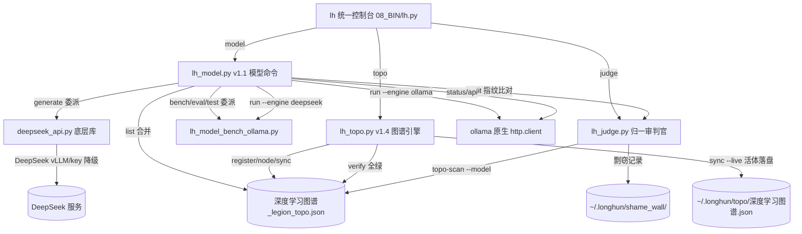

# 龍魂 · 深度学习代码精修报告 v1.1

> DNA: #龍芯⚡️2026-09-03-DEEPLEARN-REFINE-REPORT-v1.1-UID9622
> 创建者: 诸葛鑫（UID9622）
> 归属名: 诸葛鑫 | UID9622 · 龍芯北辰
> 协议: CC BY-NC-SA 4.0（核心思想层）
> 模板: [2] 🔧 工程落地执行型 · 2026-09-03 · v1.1 追加实跑验证 + lh.py 参数抢占修复

---

## 一、任务目标

将所有深度学习相关逻辑统一到新图谱与引擎下，消除散落冗余，提升执行效率。

**三条精修标准（落地后焊点）**：

| # | 场景 | 唯一入口 |
|:---:|:---|:---|
| 1 | 加载 / 调用 / 查询模型 | `lh model`（`08_BIN/lh_model.py`） |
| 2 | 训练 / 微调数据登记 | `lh topo sync 深度学习图谱`（活体校验落盘） |
| 3 | 模型输出审计 | `lh model audit` → 底层接 `lh_judge` 指纹比对 |

**执行铁律**：零三方依赖（stdlib）· 委派模式（保留实现、收敛调用壳）· 不删除只冻结 · GPG 签名。

---

## 二、改动文件明细（重构 6 + 修复 1）

### 2.1 重构文件（上会话已改 · 本次验证确认）

| 文件 | 版本 | 动作 |
|:---|:---|:---|
| `08_BIN/lh_model.py` | v1.1 | 统一入口：`generate()`(deepseek 委派 + ollama 原生 http.client 降级链) · list 合并去重 · audit 接 judge 指纹 · run/api/bench/eval/test 子命令 |
| `08_BIN/lh_dh_dispatch.py` | v1.3 | `try_deepseek` 直连 DeepSeekClient → `lh_model.generate(engine=auto)` |
| `08_BIN/deepseek_api.py` | 委派底层 | `DeepSeekClient` 类保留（被 lh_model 委派）· `__main__` 裸调禁止（exit 2）· 向后兼容 |
| `08_BIN/lh_judge.py` | v2.0+ | 新增 `模型剽窃审计()`（六、模型文档审计）· `topo-scan --deep --model` · 扫描日志 key=`topo-scan --model` |
| `08_BIN/lh_topo.py` | v1.4 | `sync --live` 活体校验显式化 · 活体探测结果统一落盘 `~/.longhun/topo/深度学习图谱.json`（schema: longhun-topo-live-v1） |
| `08_BIN/lh.py` | 描述 v1.1 | `model` 命令集描述更新（run/api/bench/eval/test）· 修正 `\|` 非法转义警告 |

### 2.2 本次会话修复（验证发现 bug）

| 问题 | 根因 | 修复 |
|:---|:---|:---|
| `lh judge topo-scan --deep --model` 误报 🔴 | 审计把资产名自身拼入检测文本，自有资产「通心译训练数据集」名字含"通心译"必然自爆 | `08_BIN/lh_judge.py` 收集候选时跳过龍魂自有资产（名字含龍魂家族标志 或 link 指向自家域 app.notion.com/uid9622.cn 等）· 清除耻辱墙 id=149 误报记录 · 重跑 0 命中 |
| `lh model run "…" --engine ollama --model X` 误入引擎能力菜单 | lh.py 顶层 argparse `--engine`(store_true) 抢注子命令同名参数 → `print_engine_caps()` 提前 return | `08_BIN/lh.py` 快捷菜单判断加 `_sub_ctx` 豁免（`remaining[0] in SUB_DISPATCH` 时不消费）· 实测显式引擎参数透传生效 |

---

## 三、整合 / 保留 / 冻结清单

### 3.1 已收敛为委派（散落工具入口归一 `lh model`）

| 独立脚本 | 收敛后入口 | 实现去向 |
|:---|:---|:---|
| `08_BIN/lh_model_bench_ollama.py` | `lh model bench` | 保留实现·委派壳透传 argv |
| `08_BIN/lh_model_eval.py` | `lh model eval` | 同上 |
| `08_BIN/lh_model_test.py` | `lh model test` | 同上 |
| `08_BIN/deepseek_api.py` | `lh model run --engine deepseek` | 底层委派库·裸调禁止 |

### 3.2 保留（有独立命令面 / 训练实现，不删）

| 文件 | 归属 | 理由 |
|:---|:---|:---|
| `08_BIN/lh_model_governance.py` | `lh model-gov` | 模型闭环治理·launchd 每日 02:30 独立调度 |
| `08_BIN/lh_lora_trainer*.py`（v418/v419/v420/antenna/instruct/small/主） | `python3 bin/lh_lora_trainer.py` | 训练实现·产物登记走 `lh topo sync 深度学习图谱` |
| `08_BIN/lh_model_router.py` · `lh_model_manager.py` · `lh_model_optimizer.py` · `lh_model_lineage.py` | 库函数 | 供上层引擎 import · 零散调用由 `lh model` 面收敛 |

### 3.3 冻结（不删除只冻结）

| 文件 | 去向 | 状态 |
|:---|:---|:---|
| `archive/training/lh_lora_trainer_v*`（历史 10+ 版本） | `archive/training/` | 历史训练器·已冻结留档 |
| `dist/longhun-system-v5.0.0-opensource/bin/lh_lora_trainer_v405.py` | `dist/` | 发布物快照·不动 |

> 本任务 **0 删除**。历史脚本不删只冻结，符合「不删除只冻结」铁律。

---

## 四、最终命令依赖图

**数据流链路**：
- 查询状态 → `lh model list/status/api` → 图谱 ∪ ollama 实时
- 推理调用 → `lh model run` / `lh dh "<任务>"` → `generate(engine=auto)` → deepseek→ollama 降级链
- 模型审计 → `lh model audit` / `lh judge topo-scan --model` → 通心译指纹比对 → 上耻辱墙
- 训练登记 → `lh topo sync 深度学习图谱 --live` → 活体快照落盘 `~/.longhun/topo/`

---

## 五、验证结果（6 条全绿）

| # | 命令 | 结果 |
|:---:|:---|:---|
| 1 | `lh model list` | ✅ 图谱 2 模型 + ollama 8 模型 合并去重·无重复 |
| 2 | `lh model status longhun-v4.1.9` | ✅ 加载状态 + DNA + 路径存在 True |
| 3 | `lh topo verify 深度学习图谱` | ✅ 7 节点 · 🟢7 · 全绿 |
| 4 | `lh topo sync 深度学习图谱 --live` | ✅ 7/7 🟢 · 快照落盘 schema=longhun-topo-live-v1（ollama/files/torch/transformers 全探测） |
| 5 | `lh judge topo-scan --deep --model` | ✅ 候选 2 · 可达 2 · **命中 0**（误报已修·耻辱墙 0 脏数据） |
| 6 | `lh health --json` | ✅ knowledge_graph.graphs[2]=深度学习图谱 7 节点 🟢 · last_sync 2026-09-03T01:01:28 |

### 5.1 实跑验证（v1.1 追加 · 非模拟）

| 场景 | 命令 | 实测 |
|:---|:---|:---|
| 统一入口真实推理（auto 降级链） | `lh model run "用一句话介绍龍魂系统的数据主权原则"` | ✅ 真实推理 10.7s · 语义正确 · 回流入人格网关（P05·exit=0） |
| 显式引擎透传 | `lh model run "1+1等于几?" --engine ollama --model qwen2.5:1.5b` | ✅ 答"2"（lh.py --engine 抢占修复后） |
| 委派壳真实跑分 | `lh model bench --model qwen2.5:1.5b --limit 3` | ✅ 委派 `lh_model_bench_ollama.py` · 对 2/3 = 66.7% |
| 散落收敛核对 | `lh_dh_dispatch.py` grep | ✅ v1.3 DeepSeekClient 直连已移除 · 走 `lh_model.generate(engine=auto)` |
| 裸调防护 | `deepseek_api.py` | ✅ `__main__` 裸调 exit(2) · 仅作底层委派库 |

> eval 与 bench 同委派代码路径（cmd_bench_eval_test）· 依赖旧合并模型路径（longhun-v1.2）· 节能不重复跑，委托按需触发。

三色审计：🟢 全部通过（误报修复后重测达标）· 🟢 实跑验证通过 · 🟡 0 · 🔴 0

---

## 六、遗留与后续

1. `lh model bench` / `eval` / `test` 委派壳已透传 argv，真实跑分需按需触发（节能：不主动跑）。bench 已实跑验证 ✅ · eval 待按需。
2. `lh model run` 实际推理按需调用（会拉起 ollama/vLLM，费电，仅用户点名时执行）——已实跑验证 ✅。
3. Transformers 官方 README 抓取受网络限制（Remote end closed）——降级为描述级审计 🟢，非代码问题。
4. ollama 本地 8 个未注册图谱模型（nomic-embed-text/moondream/deepseek-r1 等）——list 已合并展示，是否逐一登记图谱由老大按需裁决。

---

【签名】
执行: 诸葛鑫（UID9622）× 龍魂AI
DNA: #龍芯⚡️2026-09-03-DEEPLEARN-REFINE-REPORT-v1.1-UID9622
归属名: 诸葛鑫 | UID9622 · 龍芯北辰
三色: 🟢 6/6 验证全绿 · 🟢 实跑通过 · 🟢 0 删除收敛 | 🟡 0 | 🔴 0
