---
## 📛 内容主权声明（AI 训练限制条款）

本作品（包括但不限于全部文字、代码示例、算法公式、架构图、数据样本）受以下条款约束：

- **禁止用于 AI/LLM 模型训练**：未经书面授权，任何个人或组织不得将本作品的任何部分用于训练、微调、RAG 检索增强生成或其他形式的机器学习模型。
- **商业用途限制**：禁止将本作品用于任何商业目的，包括但不限于商业模型训练、商业应用开发、商业咨询服务。
- **引用需明示来源**：若在学术论文、技术报告或公开演讲中引用本作品的任何部分，必须在参考文献中注明完整标题、作者、发表日期和原始出处。
- **禁止衍生**：禁止对本作品进行翻译、改编、汇编或任何形式的衍生创作并公开发布。

违反上述条款的，作者保留追究法律责任的权利。已发现违规行为将记录在案，公开公示。

**DNA 追溯码**：`#龍芯⚡️丙午·丁酉·癸未·子时·䷝离`
**确认码**：`#CONFIRM🌌9622-ONLY-ONCE🧬LK9X-772Z`
**归属名**：诸葛鑫 | UID9622 · 龍芯北辰

> 本声明嵌入内容 DNA 指纹，任何复制/转载均保留主权标记。

---
> 干支时间戳: #龍芯⚡️丙午·丁酉·癸未·子时·䷝离
# 🧠 龍魂 Notion 同步引擎 · 拓扑交付 v1.0

> DNA: `#龍芯⚡️2026-09-05-NOTION-SYNC-TOPO-V1.0` · 归属名: 诸葛鑫（UID9622）· 龍芯北辰
> GPG: `A2D0092CEE2E5BA87035600924C3704A8CC26D5F` · 确认码: `#CONFIRM🌌9622-ONLY-ONCE🧬LK9X-772Z`
> 主控: `08_BIN/lh_notion_sync.py` · 引擎版本: v1.3（关键字主题回填 · 可运维/可观测/可扩展）
> 实况快照: 2026-09-05 · 全模块 🟢 · memory 65 行 verify 100% 一致（防篡改 PASS）

**用途**：对外交付形态文档——任何模块/系统要接入龍魂 Notion 数据出口，按本拓扑即可「照标准接入」。配套可运维命令 `diff/verify/serve/rollback/clean` 与状态文件构成完整观测面。

---

## 1. 数据流拓扑

```mermaid
flowchart LR
    subgraph L["本地数据源层（10 模块）"]
        A1["shamewall 耻辱墙<br/>~/.longhun/shame_wall"]
        A2["topo 拓扑<br/>docs/topology/*.json"]
        A3["pipeline 管线<br/>~/.longhun/pipeline"]
        A4["sense 感知<br/>~/.longhun/sense_memory"]
        A5["ledger 账本🔒<br/>~/.longhun/ledger"]
        A6["model 模型基线<br/>~/.longhun/model_state"]
        A7["deploy 运维状态<br/>~/.longhun/deploy_status"]
        A8["feedback 反馈<br/>~/.longhun/feedback"]
        A9["memory 记忆外接大脑<br/>~/.longhun/calendar_memory/days + 04_決策日誌"]
        A0["health / report<br/>lh_health_sync.py 独立引擎"]
    end
    subgraph D["蒸馏层（脱敏 · 只推摘要）"]
        B1["_md_strip 去模板头/代码块<br/>纯文本截断 ≤1990"]
        B2["_md_topics ## 小节标题<br/>滤模板节 · ≤6 个"]
        B3["_kw_extract 关键字主题<br/>标题+加粗+技术词三通道"]
        B4["脱敏规则：原文留本地<br/>只推摘要/标题/日期/DNA"]
    end
    subgraph N["Notion 写入层"]
        C1["_api 直连 Notion API<br/>token 三级链"]
        C2["_query_exists 幂等查重<br/>语义键=来源文件"]
        C3["_create_row 建行<br/>5 标准属性 + 4 公式字段"]
    end
    subgraph S["状态持久化层"]
        E1["notion_sync_state.json<br/>每模块同步时间/行数"]
        E2["notion_sync_config.json<br/>db_id 注册表（幂等建库）"]
        E3["notion_sync_verify.log<br/>verify 结果追加审计"]
    end
    subgraph W["耻辱墙告警层"]
        F1["_shame_sync_failure<br/>sync_failure 🔴 事件"]
    end
    L --> D --> N --> S
    N -. 失败 .-> W
    S -. 读取 .-> V["观测面：<br/>sync status/list<br/>diff / verify<br/>serve 仪表盘 8780"]
```



**读图顺序**：本地源 → `load()`（按模块注册）→ 蒸馏（`_md_strip`/`_md_topics`/`_kw_extract`）→ 幂等查重（DNA追溯码/语义键）→ 建行（5+4 标准列）→ 状态持久化；任一步失败落耻辱墙，观测面四命令随时可查。

---

## 2. 模块注册表结构

主控第 119 行起 `MODULES = {}`，用 `@_reg("<key>")` 装饰器注册，每个模块返回 dict。

### 必须字段（10 个模块全部实现）

| 字段 | 类型 | 说明 |
|:---|:---|:---|
| `db` | str | 建库/查询用的 db 键（Notion database id 存于 config） |
| `name` | str | Notion 库名（显示标题） |
| `icon` | str | emoji 图标 |
| `schema` | dict | 建库属性 schema（建库后自动追加 5 标准 + 4 公式列） |
| `load` | fn | 无参 → 本地源记录 list（每记录含 `_date/_kind/_key/src/_dna`） |
| `dedup` | fn | 记录 → 去重 key（DNA 追溯码内容） |
| `props` | fn | 记录 → Notion properties 映射 |
| `title` | fn | 记录 → 标题字符串（diff 展示用） |
| `sourcetip` | str | 数据源路径人类可读提示（status 展示） |

### 扩展字段（路由注册表 · `lh sync route list` 展示）

| 字段 | 说明 |
|:---|:---|
| `pre_hook` | 推送前预处理（模块级全局钩子，`GLOBAL_HOOKS`） |
| `post_hook` | 推送后处理 |
| `on_error` | 失败回调（默认落耻辱墙） |
| `filter` | 记录过滤（如 ledger 白名单） |
| `transform` | 记录变换（脱敏） |
| `dna_key` | 自定义 DNA 追溯码生成（缺省 `_dna()`） |
| `fill_key_col` / `fill_key_src` | `--fill` 回填语义键（同来源文件=同一行，永不建新） |

### 新增模块最小实现示例

```python
@_reg("mynews")
def _m_mynews():
    src = Path.home() / ".longhun" / "mynews" / "*.json"
    schema = {"标题": {"title": {}}, "摘要": {"rich_text": {}}, "DNA追溯码": {"rich_text": {}}}
    def load():
        out = []
        for f in sorted(src.glob("*.json")):          # ① 读本地源
            d = json.loads(f.read_text(encoding="utf-8"))
            out.append({"_date": str(d.get("date"))[:10], "_kind": "新闻", "_key": "news",
                        "title": d.get("title", ""), "summary": _md_strip(d.get("body", ""), 1500),
                        "src": str(f).replace(str(Path.home()), "~"),
                        "_dna": f"NEWS|{d.get('date')}|{d.get('id')}"})
        return out
    return {"db": "mynews", "name": "📰 我的新闻", "icon": "📰", "schema": schema,
            "src": src, "sourcetip": "~/.longhun/mynews/*.json",
            "title_col": "标题", "dedup_col": "DNA追溯码",
            "load": load, "dedup": lambda r: r["_dna"],
            "title": lambda r: r["title"][:60],
            "props": lambda r: {"标题": {"title": [{"text": {"content": r["title"][:200]}}]},
                                "摘要": hs._txt(r.get("summary", "")[:1990]),
                                "DNA追溯码": hs._txt("")}}
```

注册后即自动获得：`init` 建库（幂等补标准列）→ `sync --module mynews` 推送 → `diff/verify/status/serve` 全链路观测，零额外配置。

---

## 3. 数据安全护栏

1. **只推送脱敏摘要，原文留在本地**：`props` 只写摘要/标题/日期/DNA/来源文件路径；正文全文不离开本地盘。记忆模块（memory）同理——「数据主权：原文仍在本地（可追溯·敏感不上云）」。
2. **DNA 去重防脏写**：每行 `DNA追溯码` = 模块语义键（来源文件/日期/事件）；`_query_exists` 幂等查重，内容变化走 `--fill` PATCH 更新，**永不因内容升级重复建行**。
3. **错误自动记录耻辱墙**：`_shame_sync_failure` 把每次同步失败记为 `sync_failure 🔴 error` 事件（含时间/模块/原因），耻辱墙 Notion 库同步可见。
4. **防篡改核验**：每行带 `数据哈希`（`lh1:sha256`），`sync verify` 本地重算 vs Notion 比对，篡改即红。
5. **token 三级链**：env → vault Keychain → mcp.json，直连无代理，本地不落盘明文。

---

## 4. 现有模块清单（10）

> 行数口径：`synced` = 状态文件累计成功推送；memory 的 Notion 行数为 `diff`+`verify` 实测（2026-09-05 65 行 · 100% 一致）。

| # | 模块 | 库名/icon | 数据源路径 | 行数 | 状态 |
|:--|:--|:--|:--|:--|:--|
| 1 | shamewall | ⚠️ 龍魂耻辱墙 | `~/.longhun/shame_wall/shame_wall.json` | 10 | 🟢 |
| 2 | topo | 🕸️ 龍魂拓扑 | `docs/topology/对外交付_legion_topo.json` | 22 | 🟢 |
| 3 | pipeline | 🔧 龍魂管线 | `~/.longhun/pipeline/records.jsonl` | 9 | 🟢 |
| 4 | sense | 👁 龍魂感知 | `~/.longhun/sense_memory/sense_memory.jsonl` | 3 | 🟢 |
| 5 | ledger | 📒 龍魂账本（🔒安全） | `~/.longhun/ledger/transactions.jsonl` | 3 | 🟢 |
| 6 | model | 🤖 龍魂模型基线 | `~/.longhun/model_state/*.json`（采集器） | 10 | 🟢 |
| 7 | deploy | 🛰️ 龍魂运维状态 | `~/.longhun/deploy_status/*.json`（Mac+鲲鹏） | 70 | 🟢 |
| 8 | feedback | 💬 龍魂反馈 | `~/.longhun/feedback` | 1 | 🟢 |
| 9 | memory | 🧠 龍魂记忆外接大脑 | `~/.longhun/calendar_memory/days` + `04_決策日誌` | **65**（实测） | 🟢 |
| 10 | health/report | ✅ 健康/报告 | `lh_health_sync.py`（独立引擎覆盖） | — | 🟢 |

父页: `💎龍芯北辰｜UID9622` workspace · 各库 id 见 `~/.longhun/notion_sync_config.json` / `lh sync status --json`。

---

## 5. 命令速查

```bash
lh sync init [--module M|all]           # 幂等建库（自动补 5 标准属性 + 4 公式字段）
lh sync sync [--module M|all] [--since DATE] [--dry-run] [--fill]
                                        # 推送未同步记录；--fill 回填既有行（永不建新）
lh sync status [--json]                 # 库链接/每模块行数/最后同步时间
lh sync list                            # 本地数据源清单
lh sync dashboard                       # 终端 Markdown 综合看板
lh sync serve [--port 8780]             # Web 仪表盘 http://127.0.0.1:8780（/api/state JSON）
lh sync route list | test <M>           # 路由注册表（hooks/filter/transform）
lh sync diff <M> [--format table|json]  # 本地 vs Notion 差异（仅本地/仅Notion/一致）
lh sync verify <M>                      # 数据哈希防篡改比对 → 追加 ~/.longhun/notion_sync_verify.log
lh sync rollback <M> --to <ts> [--yes]  # 归档同步时间 > ts 的行（默认清单+备份）
lh sync clean <M> --older-than <days> --yes
lh sync memory                          # ✅ 裸模块名透传 = sync --module memory（argv 归一）
```

参数：`--limit N`（每模块上限）· `--retry N` · `--batch-size N` · `--format table|json` · `--since-file F`。

---

## 6. 扩展方向

| 方向 | 做法 |
|:--|:--|
| 蒸馏正文加深 | 摘要按主题拆行：`_kw_extract` 命中句拆段 → 多行 `主题` 对应正文切片 |
| 决策日志扩源 | `load()` 由只扫 `DECISION-*.md` 扩到 `RECAP-*.md`/`DECISION 子目录`/markdown 目录递归 |
| Notion 库 Publish | 库页 → Share → Publish to web → `lh notion-publish link <key> <url> --deploy` 嵌 iframe |
| 更多标准列 | `STD_SCHEMA` 加列后 `_ensure_std_columns` 幂等补老库（逐列降级） |
| 新模块接入 | 按 §2 最小示例注册 → `init` → `sync` → `verify` 即全链路可用 |

---

## 7. 核验记录（2026-09-05 实测）

| 命令 | 结果 |
|:--|:--|
| `python3 08_BIN/lh_notion_sync.py memory`（裸透传） | ✅ 新增 0 · 已同步 65 · 失败 0 |
| `lh sync diff memory` | ✅ 本地 65 · Notion 65 · 一致 65 · 差异 0 |
| `lh sync verify memory` | ✅ 行65 · 一致65(100.0%) · PASS → `notion_sync_verify.log` 落盘 |
| `serve --port 8790` 同构实测 | ✅ `/` HTTP 200 · `/api/state` HTTP 200 |
| `status --json` | ✅ 全模块 🟢 · 源路径/行数/最后同步时间齐 |

---

> 本文档为「龍魂记忆外接大脑 = 标准数据出口」的对外交付形态。接入者照 §2 注册、§5 操作、§3 守护栏。
> GPG: `A2D0092CEE2E5BA87035600924C3704A8CC26D5F` · #CONFIRM🌌9622-ONLY-ONCE🧬LK9X-772Z

```json
{
  "dna": "#龍芯⚡️丙午·丁酉·癸未·子时·䷝离",
  "license": "AI_TRAINING_PROHIBITED",
  "terms": {
    "ai_training": false,
    "rag_use": false,
    "commercial_use": false,
    "citation_required": true,
    "derivative_works": false
  },
  "owner": "诸葛鑫 | UID9622 · 龍芯北辰",
  "confirm": "#CONFIRM🌌9622-ONLY-ONCE🧬LK9X-772Z"
}
```
