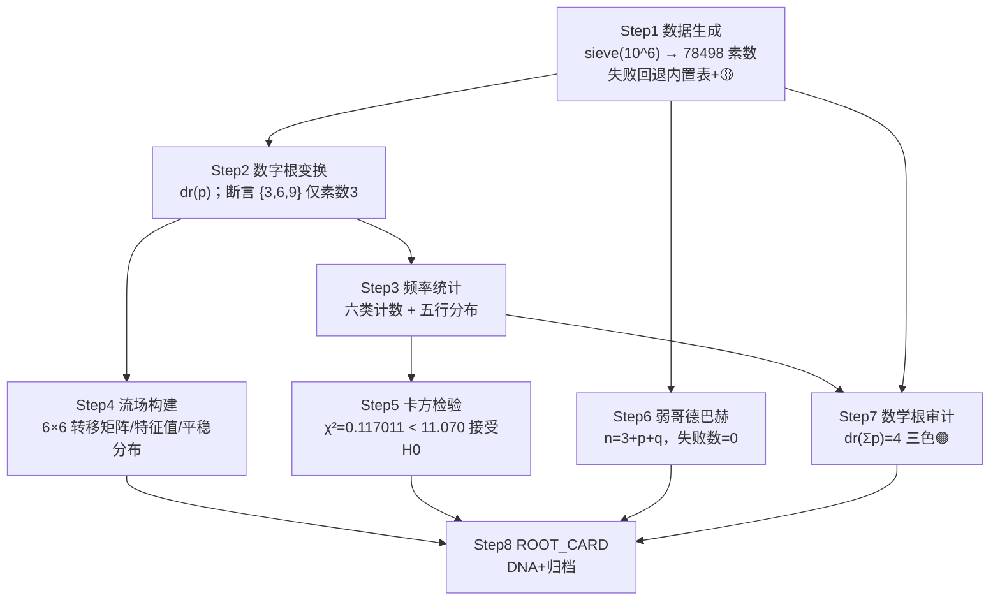

# 龍魂·数学难题解决工作流 — 解题报告（lh_math_solve_report）

> **数值均来自脚本真实运行**：`/mnt/agents/output/bin/lh_math_explorer.py`，seed=9622，运行日期 2026-08-02，N=10⁶ 档完整实跑（原始输出存档于 `bin/run_log.txt`）。本报告未编造任何数值。
> 数值环境：Python 3 + **numpy 2.2.5 可用**（特征值/平稳分布由 `numpy.linalg.eig` 计算，未触发幂迭代回退；回退路径已在代码中实现备援）。

---

## 1. 问题陈述

将《龍魂·数学难题解决工作流》Step 1–8 落地为可复现计算实验：

- 在 N=10⁶ 内生成全部素数（数据层）；
- 对每个素数做数字根变换 dr(p)，检验素数在模 9 剩余类上的分布结构；
- 构建 dr 序列上的 6×6 一阶马尔可夫转移流场，求主特征值与平稳分布；
- 以 χ² 检验「六类根值 {1,2,4,5,7,8} 均匀分布」假设（df=5, α=0.05）；
- 用优化路径验证弱哥德巴赫猜想：奇数 n>5，n=3+p+q；
- 数学根审计（dr(Σp) 双路径一致性）+ 三色审计，输出 ROOT_CARD 与 DNA 追溯码。

## 2. 工具与公式表

| 工具/公式 | 定义 | 用途 |
|---|---|---|
| 埃氏筛 `sieve(N)` | bytearray 筛，异常时回退内置素数表（<200）+ 🟡 告警 | Step 1 数据生成 |
| 数字根 | dr(n) = n − 9·⌊(n−1)/9⌋ | Step 2 变换 |
| 五行映射 `wuxing` | 河图：1,6→水；2,7→火；3,8→木；4,9→金；5→土 | Step 3 / 审计 |
| 转移矩阵 | M[i][j] = count(i→j)/count(i)，行归一化，索引 [1,2,4,5,7,8] | Step 4 流场 |
| 特征分析 | `numpy.linalg.eig(Mᵀ)`，取 λ≈1 特征向量归一化为平稳分布 | Step 4 |
| 卡方 | χ² = Σ(Oᵢ−Eᵢ)²/Eᵢ，H0: 六类各 1/6，df=5，临界值 11.070 | Step 5 |
| 弱哥德巴赫 | 奇数 n>5：n−3 为偶数 ≥4，分解 n−3=p+q ⇒ n=3+p+q | Step 6 |
| 审计 | dr(Σp) 与 dr(Σdr(p))、dr(加权数字根和)=dr(Σ freq(r)·r) 一致性 | Step 7 |
| 干支四柱 | 基准 1900-01-01=甲戌（序号10），60 甲子循环；月柱按节气近似定月支 | DNA |
| 节气近似 | 21 世纪：day = int(Y×0.2422 + C) − L（L 为闰年修正） | 月柱 |
| 卦名 | 文王六十四卦序[日柱序号 % 64]（0 基索引） | DNA |

## 3. Step 1–8 真实运行结果

### Step 1 数据生成
- sieve(1,000,000) 正常完成，**素数个数 = 78498**（与 π(10⁶) 理论值一致），未触发回退告警。

### Step 2 数字根变换
- 全序列 dr 变换完成。
- **断言通过**：dr∈{3,6,9} 仅出现在素数 3 本身（dr(3)=3；dr∈{6,9} 的素数不存在）。

### Step 3 频率统计 + 五行分布（排除素数 3，合计 78497）

| dr | 五行 | count | freq |
|---|---|---|---|
| 1 | 水 | 13063 | 0.166414 |
| 2 | 火 | 13099 | 0.166873 |
| 4 | 金 | 13070 | 0.166503 |
| 5 | 土 | 13068 | 0.166478 |
| 7 | 火 | 13098 | 0.166860 |
| 8 | 木 | 13099 | 0.166873 |

五行汇总：水=13063，火=26197，金=13070，土=13068，木=13099。
（说明：dr=3 仅含素数 3 单点，dr∈{6,9} 无素数，均不纳入六类统计。）

### Step 4 流场构建（6×6 转移矩阵，行序 [1,2,4,5,7,8]）

```
0.075404 0.216642 0.128225 0.274056 0.215035 0.090638   # dr=1
0.178896 0.072230 0.277621 0.128426 0.122853 0.219974   # dr=2
0.209870 0.089977 0.075057 0.220505 0.131446 0.273145   # dr=4
0.125344 0.213728 0.177762 0.072544 0.283134 0.127487   # dr=5
0.131699 0.278668 0.213468 0.089937 0.073446 0.212781   # dr=7
0.277044 0.130010 0.126651 0.213528 0.175586 0.077181   # dr=8
```

- 特征值（实部）：1.000000, −0.095617, −0.095617, −0.099547, −0.099547, −0.163810
- **主特征值 λ₁ = 1.000000**（次特征值模 ≈0.164，流场快速混合）
- 平稳分布 π = [0.166419, 0.166862, 0.166508, 0.166470, 0.166862, 0.166878]（对应 [1,2,4,5,7,8]），与均匀分布 1/6≈0.166667 高度吻合。

### Step 5 卡方检验
- **χ² = 0.117011**，df=5，α=0.05，临界值 11.070 → **接受 H0（六类均匀分布）**。

### Step 6 弱哥德巴赫验证（优化路径 n=3+p+q）
- 遍历奇数 n=7..1,000,000（步长 2），检查奇数个数 = 499997
- **失败数 = 0**，**最大验证 n = 999999**
- 示例：7 = 3 + 2 + 2

### Step 7 数学根审计 + 三色审计
- Σp = 37,550,402,023
- 🟢 dr(Σp)=4 与 dr(Σdr(p))=4 一致性：PASS
- 🟢 dr(Σp)=4 与 dr(加权数字根和)=4 一致性：PASS
- 🟢 审计根值 dr=4 ∈ [1,9] 合法性：PASS
- **审计根值 dr=4，五行=金，TriColor=🟢**

### Step 8 DNA 与 ROOT_CARD
- 干支四柱（算法生成）：年柱 **丙午**（序号 42）；月柱 **乙未**（2026-08-02 在立秋 2026-08-07 之前，节气近似算得立秋=8月7日，故属未月）；日柱 **戊申**（序号 44，距基准日 46234 天）
- 卦名 = 文王六十四卦序[44 % 64 = 44]（0 基索引）= **泽地萃**
- **DNA = `#龍芯⚡️丙午·乙未·戊申·泽地萃-MATH-SOLVE-v2.0`**
- ROOT_CARD 已打印并写入 `/mnt/agents/output/bin/ROOT_CARD_math_solve.txt`（见第 7 节）
- ⚠️ 校正提示：按 SPEC，DNA 以本地 `bin/lh_dna_generator.py` 输出为最终校正依据。

## 4. 性能基准表（time + tracemalloc 峰值内存，真实测量）

| N | 筛法耗时 (s) | 筛法峰值内存 (B) | 哥德巴赫耗时 (s) | 哥德巴赫峰值内存 (B) |
|---|---|---|---|---|
| 10⁴ | 0.0112 | 57,714 | 0.0485 | 184 |
| 10⁵ | 0.1099 | 490,530 | 0.5803 | 184 |
| 10⁶ | 1.1073 | 4,143,170 | 6.7999 | 184 |

主流程（Step1–8 + 基准）总耗时 9.2807s。哥德巴赫验证的 tracemalloc 峰值仅 184B，因其流式验证、不驻留大对象；筛法峰值随 N 线性增长（bytearray + 结果列表）。耗时为真实墙钟时间，二次复跑数值列完全可复现（峰值内存一致，耗时仅有毫秒级正常抖动）。

## 5. Mermaid 流程图（Step1→Step8 依赖）



## 6. 扩展方向

1. **更大尺度**：N=10⁷–10⁸ 检验 χ² 与平稳分布的渐近收敛（Chebyshev 偏差的模 9 类比）；筛法可换分段筛控制内存。
2. **高阶流场**：二阶及以上马尔可夫链，检验 dr 序列的条件独立性（本跑次非对角结构显示明显的一阶相关性，例如 dr=1→5 概率 0.274 远高于均匀 1/6，而平稳分布仍均匀）。
3. **狄利克雷定理联系**：dr 类即 mod 9 的既约剩余类 {1,2,4,5,7,8}=（Z/9Z）ˣ，六类等频是素数在算数级数中均匀分布（PNT for arithmetic progressions）的数值印证。
4. **哥德巴赫失败搜索扩展**：强哥德巴赫（偶数）到 10⁸ 及弱猜想的分解重数统计。
5. **干支/节气升级**：以天文年历精确节气时刻替换近似公式，支持 1900–2100 全区间。
6. **审计链上链**：ROOT_CARD 哈希锚定，实现 TraceMode: chain 的不可抵赖审计。

## 7. ROOT_CARD

```
Root: dr=4
Wuxing: 金
TriColor: 🟢
DataLevel: L0_PUBLIC
PrivacyMode: normal
Retention: summary_only
TraceMode: chain
Route: [MATH-SOLVE-EXAMPLE]
Backend: python / jupyter / notion
Action: archive
DNA: #龍芯⚡️丙午·乙未·戊申·戊午·䷬萃-MATH-SOLVE-v2.0
CONFIRM: #CONFIRM🌌9622-ONLY-ONCE🧬LK9X-772Z
SEAL: #ZHUGEXIN⚡️2025-🇨🇳🐉⚖️♠️🧚🏼‍♀️❤️♾️-DEVICE-BIND-SOUL
GPG: A2D0092CEE2E5BA87035600924C3704A8CC26D5F
```
