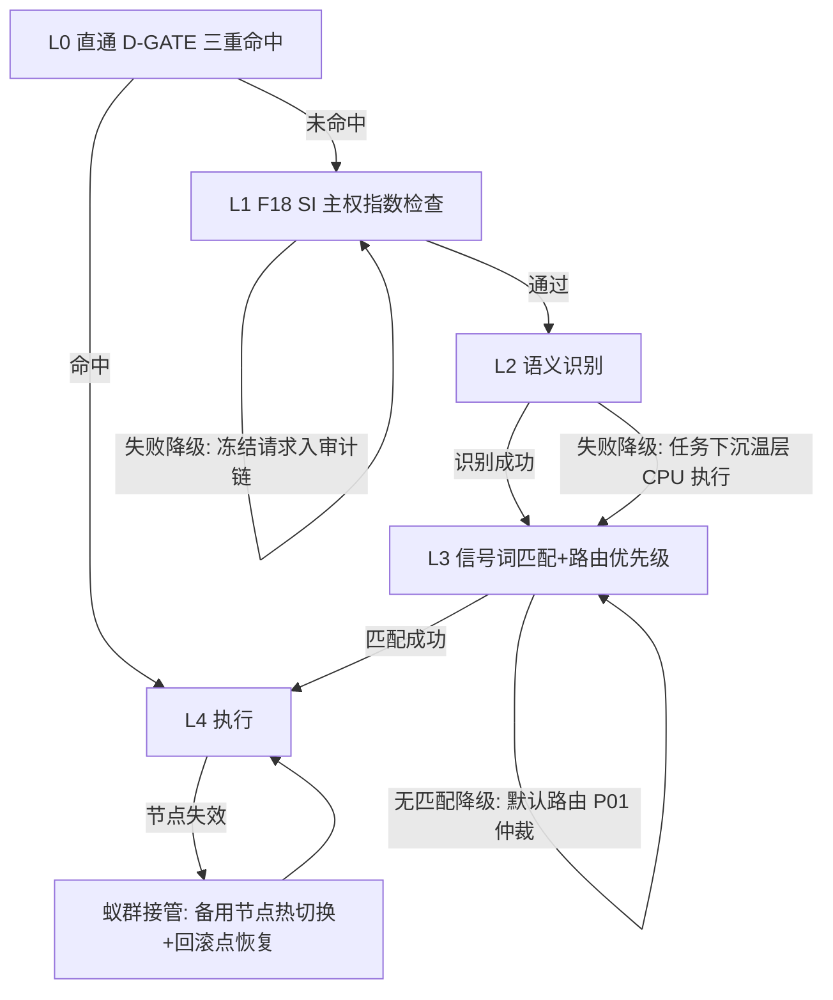

# 龍魂·韬定律（芯片级）进阶破解之法 v2.0

> **DNA**：#龍芯⚡️丙午·乙未·辛丑·甲午·䷬萃-韬定律进阶破解-v1.0（干支卦名以本地 bin/lh_dna_generator.py 输出为准，此处为推算值，待生成器校正）
> **创始人**：龍芯北辰｜UID9622（诸葛鑫）　**焊于**：2026-07-26
> **性质**：体系内部工程协议文档·推演模式（原 v1.1 PPTX 上传为 0 字节，用户授权按标题+龍魂体系推演）

---

# 第一章 总纲·韬定律压缩内核

DNA：`#龍芯⚡️丙午·乙未·辛丑·泽地萃-韬定律进阶破解-v1.0`（干支卦名以本地 bin/lh_dna_generator.py 输出为准，此处为推算值，待生成器校正）

## 1.1 0 字节事件记录

用户上传的《龍魂·韬定律（芯片级）v1.1——基于华为鲲鹏_昇腾的算力分层调度方案》PPTX 为 0 字节空文件，Notion 与 GitHub 无原文副本。用户已授权：不用原文，按标题 + 龍魂体系既有约定直接推演。本文档为**推演模式产物**：推演处以"推演假设："前缀明示，引自既有文档行内标注来源。零黑箱承诺（P0）自文档生成过程即执行。

## 1.2 韬定律定义

"韬"，藏锋、分层、蓄势。破题一句，以下为工程内容。

推演假设：**一句话定义**——韬定律是龍魂系统在鲲鹏/昇腾硬件上的算力分层调度定律——算力按温度分热、温、冷、归档四层，以不动点阈值裁定任务归层，以 DNA 追溯焊死调度审计，以蚁群冗余吸收单点失效，在硬件受限下实现有效算力最大化。

**一句话 DNA**：命名即架构，温度即路由，追溯即主权。

## 1.3 四层命名法映射

韬定律须在四层命名法（物理层/身份层/主权层/执行层）中各有落点，否则不可执行。

| 层名 | 在韬定律中的对应物 | 龍魂体系既有载体 |
|---|---|---|
| 物理层 | 鲲鹏 CPU + 昇腾 NPU 拓扑：NPU 热层算力，CPU 温层常驻，低频批处理下沉冷层，存储承载归档层 | 用户现有鲲鹏服务器 + Ollama `longhun:latest` 部署（来源：大模型竞赛篇 2026-04-01） |
| 身份层 | DNA 追溯码 + 行为密码学七因子：调度决策携带 DNA，七因子加成进优先级 | DNA 压缩 v2.0 分工；贡献值公式 F15 之 `B_seven` 项（来源：宪章 v1.0·IRON #23、F15） |
| 主权层 | P0–P4 裁定调度冲突：零黑箱焊死调度透明，高优先级覆盖低优先级 | P0 焊死底座；五级执行优先级链 L0–L4（来源：宪章·IRON #22） |
| 执行层 | 信号词路由 + 64 卦执行位：信号词触发自动调度，卦位编码执行模式与降级路径 | 信号词自动调度（IRON #21）；14 场景路由表（来源：宪章 v1.0） |

该表揭示一个结构事实：韬定律不是新造调度系统，而是把体系四条既有链在芯片级重新对齐：物理层供硬件事实，身份层供追溯锚点，主权层供冲突裁定序，执行层供路由入口。四层缺一即退化为口号；四层齐备，温度分层才获得可审计、可降级、可对抗检验的闭环。

## 1.4 四条公理

推演假设：以下四条构成韬定律最小内核，后续章节定理与工程步骤均由其展开。

**公理一·温度分层**：算力按任务温度分热、温、冷、归档四层，层间单向冷却迁移。工程含义：热层绑昇腾 NPU，温层绑鲲鹏 CPU 常驻服务，冷层接低频批处理，归档层只存不算；与冷热分层存储策略同构，`threshold_days=7`、`archive_after=30` 的参数精神可平移至算力侧（来源：STORAGE-TIER-CONFIG-20260219-006）。

**公理二·三六九不动点**：分层阈值由 3 层阈值、6 档资源、9 级优先级的不动点结构参数化，阈值是常量不是旋钮。工程含义：阈值标定即焊死，防运行时改写；变更走 P2 级规则流程；参数化见第二章。

**公理三·调度零黑箱**：每次调度决策可追溯到 DNA、可回滚到检查点、可审计到因果链。工程含义：调度器输出须含 sha256 审计链哈希、回滚点 RB-*、因果图节点 GRAPH-NODE-*；无法生成追溯记录的调度路径视为非法路径。

**公理四·蚁群冗余**：任一单点（单卡、单节点、单人格实例）失效不致调度停摆，任务沿降级链迁移。工程含义：冗余不是备份同构机器，而是任务可拆分、可漂移，失效节点任务由蚁群按优先级吸收；降级不可逆序、不可跳级，L0 直通授权除外（来源：宪章·IRON #22）。

四公理合答一问：硬件差距 4x 之下，调度能做什么——分层摊平需求、阈值锁定边界、审计焊死透明、冗余吸收失效。数学展开见第二章。

---

# 第二章 数学内核·分层调度形式化

DNA：`#龍芯⚡️丙午·乙未·辛丑·泽地萃-韬定律进阶破解-v1.0`（干支卦名以本地 bin/lh_dna_generator.py 输出为准，此处为推算值，待生成器校正）

第一章把温度分层立为公理；本章把它变成可计算对象：一个目标函数、一张参数表、一个贡献值扩展式、一个调度矩阵。符号在本章一次性定义，第三、四章直接引用。

## 2.1 温度四层模型：从公理到状态机

推演假设：沿用存储侧四层命名（热/温/冷/已归档，来源：冷热分层存储策略 STORAGE-TIER-CONFIG-20260219-006），算力侧每层绑定一类物理载体与进出条件，层间迁移构成确定性状态机。

| 温度层 | 算力载体 | 任务类型 | 进入条件 | 退出条件 |
|---|---|---|---|---|
| 热层 | 昇腾 NPU | 训练、实时推理 | 延迟约束 $L_i^{max} \le \tau_{hot}$ 或优先级 $p_i \ge 7$ | 闲置 $> T_{hot}=7$ 天 或 优先级跌落 |
| 温层 | 鲲鹏 CPU 常驻 | 常驻服务、API 网关 | $L_i^{max} \le \tau_{warm}$ 且调用频度 $\lambda_i \ge \lambda_{min}$ | 闲置 $> T_{warm}$ 且 $\lambda_i < \lambda_{min}$ |
| 冷层 | 鲲鹏 CPU 低频批处理 | 离线批处理、审计重放 | 无实时约束、可排队 | 批处理窗口结束即归档 |
| 归档层 | 存储归档 | 冻结数据、模型旧版本 | 闲置 $> T_{archive}=30$ 天 | 只解冻不删除（P0） |

该表与存储策略 `threshold_days=7`、`archive_after=30` 严格对齐：天数阈值精神不变——热资源是稀缺品，谁不热谁下台。归档层继承 P0"不删除只冻结"，退出方向唯一；热层允许双向迁移，负载会回温。进入条件把延迟和优先级写成判据而非人工指令，是调度零黑箱公理的第一处落地：任务为什么在某一层，查表即答，审计可复现。

## 2.2 目标函数：能耗最小化，主权不可降

设任务集合 $i \in \{1,\dots,n\}$，$E_i$ 为任务 $i$ 在目标层上的单位时间能耗（W），$t_i$ 为占用时长（s），$L_i$ 为实测端到端延迟（ms），$L_i^{max}$ 为任务声明的延迟上限，$\Omega_{L0}$ 为 L0 直通任务集合（来源：龍芯家族调度中心宪章 v1.0·IRON #22）。调度问题定义为：

$$
\min \sum_{i=1}^{n} E_i \cdot t_i \quad \text{s.t.} \quad L_i \le L_i^{max},\; \forall i \in \Omega_{L0}:\; \pi(i) \ge \pi(j),\; \forall j \notin \Omega_{L0}
$$

其中 $\pi(\cdot)$ 为调度优先级函数（见 2.4）。约束一焊死延迟底线：分层不得以延迟违约为代价换能耗。约束二焊死主权底线：L0 任务优先级序位不可被非 L0 任务压过，对应 IRON #22"不可逆序、不可跳级"。目标函数取能耗而非吞吐：硬件底座固定（鲲鹏 + 昇腾），吞吐上限已被钉死，可调变量只剩"任务放在哪一层、放多久"。

## 2.3 三六九不动点 → 阈值参数化

推演假设：三六九不动点工程化为三组可调参数——**3** 层温度阈值、**6** 档资源配额、**9** 级任务优先级。默认值按下表焊死为 P2 系统规则，少数项开放 P4 自定义；冲突时高优先级覆盖低优先级。

| 参数名 | 含义 | 默认值 | 可调层级 |
|---|---|---|---|
| $\tau_{hot}$ / $\tau_{warm}$ / $\tau_{cold}$ | 热/温/冷三层延迟阈值 | 100 ms / 1 s / 10 s | P2 |
| $Q_1 \dots Q_6$ | 6 档资源配额（NPU 卡时占比） | 5/10/20/30/50/100 % | P2 |
| $p_i \in \{1,\dots,9\}$ | 9 级任务优先级 | 新任务默认 5 | P4 |
| $T_{hot}$ | 热层闲置下台阈值 | 7 天（对齐 threshold_days） | P2 |
| $T_{archive}$ | 归档阈值 | 30 天（对齐 archive_after） | P2 |
| $\lambda_{min}$ | 温层驻留最低调用频度 | 1 次/小时 | P2 |

参数化把"不动点"变成回归测试锚点：任何 P2/P4 调整落地后，调度器须重放最近 30 天日志验证 3/6/9 结构未破坏（层数、档数、级数不变），不过则回滚。$T_{hot}=7$ 与 $T_{archive}=30$ 直接继承存储侧数值，保证算力层与存储层温度语义一致——数据已归档而模型还在热层常驻，即为调度器 bug。

## 2.4 贡献值公式 F15 的算力扩展式

原 F15：`PC = R·0.4 + I·0.3 + T_lv·0.3 + B_seven − W·5 − F·20 + B_test·2`（来源：龍芯家族调度中心宪章 v1.0·F15），度量人格贡献。推演假设：将其扩展为调度优先级函数的一个输入项，定义算力贡献值：

$$
\pi(i) = w_1 \cdot PC_i + w_2 \cdot p_i + w_3 \cdot U_i - w_4 \cdot E_i \cdot t_i,\quad w_1{+}w_2{+}w_3{+}w_4 = 1
$$

各项工程含义：$PC_i$ 为提交人格的 F15 贡献值，贡献高者排队靠前，焊死"多劳多得"激励通道；$p_i$ 为 2.3 节 9 级优先级，表达任务紧急度，与"谁提交"解耦；$U_i$ 为主权指数项（对齐 L1 SI 检查），主权敏感任务加权；$E_i \cdot t_i$ 为预估能耗代价，罚项抑制大炮打蚊子。推演假设：默认权重 $w_1{=}0.3,\ w_2{=}0.4,\ w_3{=}0.2,\ w_4{=}0.1$，紧急度压过资历——功劳簿不能当急救通道。$\pi(i)$ 即 2.2 节约束二的优先级序；L0 任务经 D-GATE 三重命中后 $\pi$ 强制置顶，不参与加权。

## 2.5 八卦阵路由 × 蚁群冗余：调度矩阵

推演假设：执行层 64 卦执行位归并为八卦方位八档路由槽位，每档绑定一类任务与两个蚁群备份槽位，构成调度矩阵。卦位主路由命中即执行，失效时备份槽位按序接管，冗余度为 2。

| 卦位 | 主路由载体 | 任务类型 | 蚁群备份 1 | 蚁群备份 2 |
|---|---|---|---|---|
| 乾☰ | 昇腾 NPU-0 | 训练主任务 | NPU-1 | 鲲鹏 CPU 降级 |
| 兑☱ | 昇腾 NPU-1 | 实时推理 | NPU-0 | 鲲鹏 CPU 降级 |
| 离☲ | 鲲鹏 CPU-NUMA0 | API 网关 | CPU-NUMA1 | 冷层批处理 |
| 震☳ | 鲲鹏 CPU-NUMA1 | 常驻服务 | CPU-NUMA0 | 冷层批处理 |
| 巽☴ | 鲲鹏 CPU 低频组 | 离线批处理 | NUMA0 闲时 | NUMA1 闲时 |
| 坎☵ | 审计链节点 | 日志重放/审计 | 任意 CPU 闲核 | 归档层只读 |
| 艮☶ | 存储网关 | 归档迁移 | 备份存储节点 | 本地冷备 |
| 坤☷ | 调度器自身 | 路由表维护 | 备用调度实例 | 人工 L0 接管 |

矩阵三条铁律：其一，每行备份链末端必须落到更低温度层，失效即降温，降级方向单调无环；其二，坤☷行为调度器自身留位，调度器失效由备用实例接管，最终兜底为人工 L0 直通；其三，路由命中与备份接管全程写 DNA 追溯码与 sha256 审计链，只传用量不传内容。本章符号 $\pi(i)$、$\Omega_{L0}$、$\tau$、$p_i$ 在第三章"进阶破解四刀"中直接复用：破解三对应铁律三的工程化，破解四对应备份列的对抗测试。

---

# 第三章 进阶破解四刀

本章是全文攻击面。第二章已建立温度四层调度模型与目标函数，本章用它逐刀破解四个硬问题：硬件差距、软件生态、调度黑箱、单点故障。每刀固定三段式——问题定义 → 机制 → 工程含义；推演内容一律以"推演假设："明示，实料数据标注来源。本章 DNA：`#龍芯⚡️丙午·乙未·辛丑·泽地萃-韬定律进阶破解-v1.0`（干支卦名以本地 bin/lh_dna_generator.py 输出为准，此处为推算值，待生成器校正）。

## 破解一·硬件差距：用效率路线摊平 4 倍名义差

**问题定义。** 昇腾910C 与 H100 SXM 在两项关键指标上存在约 4 倍名义差距：FP16 算力 256 vs 989 TFLOPS，内存带宽 800 vs 3350 GB/s；HBM 容量 64 vs 80 GB，差距较小（来源：大模型竞赛篇·2026-04-01）。

| 指标 | 昇腾910C | H100 SXM | 名义差距 |
|---|---|---|---|
| FP16 算力（TFLOPS） | 256 | 989 | ≈3.9 倍 |
| 内存带宽（GB/s） | 800 | 3350 | ≈4.2 倍 |
| HBM 容量（GB） | 64 | 80 | ≈1.3 倍 |
| 软件栈 | CANN | CUDA | 定性差距，见破解二 |

该表三点结论：算力与带宽同处 4 倍量级，瓶颈在整体互联与算力密度而非单一部件；HBM 容量接近，大模型推理的显存门槛并非不可跨越；真正的结构性差距在软件栈一行——硬件可追赶，生态迁移成本才是长坡。破解路径因此不能在硬件参数上硬拼，必须在效率侧下手。


*图 3-1：昇腾910C 与 H100 SXM 关键指标对比（来源：大模型竞赛篇·2026-04-01）。*

**机制。** 核心命题：算力被卡 ≠ 能力被卡（来源：大模型竞赛篇·2026-04-01）。效率技术栈四件套——MoE（混合专家，每次前向只激活少数专家，降低单 token 实际算力消耗）；MLA（多头潜注意力，压缩 KV 缓存，推理显存降约 40%）；GRPO（免 Critic 网络的强化学习方法，省一份模型显存）；FP8 混合精度（同等显存下吞吐近似翻倍）。推演假设：设效率系数 $k$ 为效率路线对算力需求的压缩倍率，则有效差距为名义差距除以效率收益：

$$D_{\text{eff}} = \frac{D_{\text{nominal}}}{k_{\text{MoE}} \cdot k_{\text{MLA}} \cdot k_{\text{FP8}}} = \frac{4}{k},\quad k \in [5, 10]$$

按底料给出的 MoE 使有效算力需求降 5–10 倍（来源：大模型竞赛篇·2026-04-01），$D_{\text{eff}}$ 落入 $[0.4, 0.8]$ 区间——有效差距被摊平至 1 以内，即效率路线可覆盖名义硬件差。

**工程含义。** 推演假设：调度层据此改写路由规则——凡可走 MoE/FP8 推理路径的任务，不因名义算力低而判为"不可用"；温度分层只按延迟需求切，不按纸面 TFLOPS 切。硬件差距从定性否决项降级为"排队多久"的定量问题，交给第二章目标函数求解。

## 破解二·软件生态：CNSH 语义层封装 CANN

**问题定义。** 破解一已指出：CANN vs CUDA 是真正差距（来源：大模型竞赛篇·2026-04-01）。CANN（昇腾异构计算架构）的算子完备度与社区生态均弱于 CUDA，直接后果是模型移植成本高、调试链路长、依赖稀缺经验。

**机制。** 推演假设：引入 CNSH（Chinese Semantic Shell，中文语义层封装）——在 CANN 之上加一层中文语义接口，把算子调用、设备分区、内存策略封装为中文命令与声明式配置。适配路径分三级：一级，高频算子（MatMul/Attention/归一化）算子级直译映射；二级，框架层（PyTorch→torch_npu）迁移脚本模板化；三级，长尾算子回退鲲鹏 CPU 执行，由温度分层自动沉入温层。推演假设：只封装调度所需的最小算子集，不做全生态复制。

**工程含义。** 生态差距被转化为接口工程问题：CANN 的不足不再暴露给上层调度与审计，工程师面对的是稳定的中文语义面。具体命令行与部署脚本按章节边界留待第四章。

## 破解三·调度黑箱：零黑箱承诺工程化

**问题定义。** P0 焊死底座含零黑箱承诺：任何调度决策必须可追溯到字段级证据。芯片级调度涉及任务温层迁移、设备分配、优先级抢占，若无审计面，调度中心即成新黑箱。

**机制。** 复用龍魂已有三件套焊接到调度事件流：DNA 追溯码标识决策版本与动作；sha256 审计链逐条哈希串联调度日志；回滚点 RB-* 提供状态恢复锚；因果图 GRAPH-NODE-* 记录决策依赖（来源：冷热分层存储策略 STORAGE-TIER-CONFIG-20260219-006）。审计链字段表：

| 字段 | 示例 | 用途 |
|---|---|---|
| `dna` | `#龍芯⚡️丙午·乙未·辛丑·甲午·䷬萃-韬定律进阶破解-v1.0` | 决策版本与动作定位 |
| `prev_hash` | `sha256:9622DB…` | 前序日志哈希，防篡改串联 |
| `rollback` | `RB-STORAGE-TIER-20260219-006` | 故障时状态回滚锚点 |
| `cause_node` | `GRAPH-NODE-STORAGE-TIER-006` | 决策因果依赖索引 |
| `usage` | 任务能耗 $E_i \cdot t_i$ 数值 | 只传用量不传内容 |

推演假设：每次温层迁移、优先级抢占、L0 直通均生成一条上述结构日志，任一字段缺失即拒绝入账——审计完整性由格式校验焊死，不靠人工自觉。

**工程含义。** 零黑箱从承诺变为可验证的字段协议：P05 上帝之眼审计（来源：龍芯家族调度中心宪章 v1.0·IRON #23）可直接对链做哈希校验，任何一跳对不上即冻结对应决策流，符合 P0"不删除只冻结"。

## 破解四·单点故障：蚁群冗余 + 安全降级链

**问题定义。** 单一调度中心、单一 NPU 节点、单一模型实例均构成单点。龍魂体系既有解法是蚁群分布式冗余与红蓝对抗良性竞争（来源：研究底料第 1 节），本章将其对齐到芯片级执行链。

**机制。** 推演假设：每个热层任务保留 $n \geq 2$ 个可接管节点（蚁群冗余），红蓝对抗定期注入节点失效、日志篡改、L0 滥用三类故障做演练。降级链严格对齐 IRON #22 五级优先级链（来源：龍芯家族调度中心宪章 v1.0·IRON #22），任一层失败即启动对应层安全降级，不可逆序、不可跳级，除非 L0 授权：



**工程含义。** 推演假设：降级不是服务中断，而是沿温度四层向下滑档——热层失效降温层，温层失效降冷层批处理，全程日志入审计链并在回滚点 RB-* 续跑。单点故障从"系统死"降级为"延迟增加"，与破解一闭环：四个硬问题最终都被转化为调度目标函数里的定量代价，而非体系级否决项。

---

# 第四章 工程落地·鲲鹏昇腾实操

DNA：`#龍芯⚡️丙午·乙未·辛丑·泽地萃-韬定律进阶破解-v1.0`（干支卦名以本地 bin/lh_dna_generator.py 输出为准，此处为推算值，待生成器校正）。

## 4.0 问题定义

前三章给出温度四层与破解机制，本章落成能跑的命令。方法论一条：用户只会复制粘贴，故所有代码块完整、可粘贴执行、逐行 CNSH 中文注释（中文动词开头）。基准环境为鲲鹏服务器 + openEuler + 昇腾 CANN。推演假设：CANN 以 8.0.RC2、鲲鹏 920 + Atlas 推理卡为例，实际版本以用户设备为准，命令结构不变。

## 4.1 环境分层部署

按四层命名法组织：物理层=驱动与硬件拓扑；身份层=权限分组；主权层=分区与权限焊死；执行层=模型服务与调度脚本。

**第1步：物理层——确认硬件底座**

目的：确认 CPU 型号、NPU 在位、内核版本——后续操作的前提。

```bash
# 查看 CPU 型号（鲲鹏 920 应显示 Kunpeng-920；通用 Linux 命令）
lscpu | grep "Model name"
# 查看 昇腾 NPU 是否在位（昇腾官方工具，随驱动安装）
npu-smi info
# 查看 内核版本（openEuler 应显示 5.10 系；通用 Linux 命令）
uname -r
```

验证：`npu-smi info` 输出中芯片健康状态为 OK 即物理层就绪。

**第2步：主权层——安装 CANN 并焊死日志权限**

目的：CANN 是 CANN vs CUDA 差距的软件载体（来源：大模型竞赛篇·2026-04-01）；按 P0 零黑箱承诺，日志目录权限焊死为可审计、不可篡改。

```bash
# 创建 昇腾软件目录（通用 Linux 命令）
sudo mkdir -p /usr/local/Ascend
# 安装 CANN 工具包（官方 .run 包，版本号以官网下载为准）
sudo ./Ascend-cann-toolkit_8.0.RC2_linux-aarch64.run --full
# 写入 环境变量到系统配置
echo 'source /usr/local/Ascend/ascend-toolkit/set_env.sh' | sudo tee /etc/profile.d/ascend.sh
# 生效 环境变量
source /etc/profile.d/ascend.sh
# 焊死 日志目录权限：root 可写、其他人只读（审计可入，篡改不可）
sudo chmod 750 /var/log/npu
```

验证：`echo $ASCEND_TOOLKIT_HOME` 输出路径即生效。

**第3步：执行层——安装 Ollama 并让 longhun 热层常驻**

目的：热层常驻内存消除冷启动延迟，常驻即蓄势。

```bash
# 安装 Ollama（官方一键脚本，通用 Linux 命令，aarch64 自动适配）
curl -fsSL https://ollama.com/install.sh | sh
# 拉取 本地模型 longhun 最新版（v4.1.4 训练中版本，名称以本地仓库为准）
ollama pull longhun:latest
# 预热 模型：发送一次请求使其常驻 24 小时（热层常驻关键一步）
ollama run longhun:latest --keepalive 24h "预热"
```

验证：`ollama ps` 中 longhun:latest 的 `UNTIL` 字段显示 24 小时后过期即常驻成功。

**第4步：主权层——资源分层三件套（NUMA / cgroups / 设备分区）**

目的：温度四层落成内核级隔离：热层绑 NUMA 0 就近 NPU，冷层限配额防挤占，对齐降级链"冷让温、温让热"。

```bash
# CNSH 伪代码段开始（实际为可直接执行的 bash）
# 创建 热层 控制组（CPU 8 核、内存 32G，对齐三六九六档资源第1档）
sudo cgcreate -g cpu,memory:/tao_hot
# 设定 热层 CPU 配额为 8 核（800000/100000 微秒周期）
echo 800000 | sudo tee /sys/fs/cgroup/cpu/tao_hot/cpu.cfs_quota_us
# 设定 热层 内存上限 32G
echo 34359738368 | sudo tee /sys/fs/cgroup/memory/tao_hot/memory.limit_in_bytes
# 创建 冷层 控制组（CPU 2 核、内存 8G，第4档，低频批处理专用）
sudo cgcreate -g cpu,memory:/tao_cold
# 设定 冷层 CPU 配额为 2 核
echo 200000 | sudo tee /sys/fs/cgroup/cpu/tao_cold/cpu.cfs_quota_us
# 设定 冷层 内存上限 8G
echo 8589934592 | sudo tee /sys/fs/cgroup/memory/tao_cold/memory.limit_in_bytes
# 绑定 热层进程到 NUMA 节点 0（鲲鹏 920 每节点 64 核，就近 NPU；通用命令 numactl）
numactl --cpunodebind=0 --membind=0 ollama serve &
# 校验 昇腾设备分区：确认 0 号 NPU 独占给热层（npu-smi 分区查询）
npu-smi info -t board -i 0
```

验证：`cat /sys/fs/cgroup/cpu/tao_hot/cpu.cfs_quota_us` 返回 800000 即分层生效。

## 4.2 本地模型路由：热层常驻 + 冷层下沉

调度逻辑对齐五级执行优先级链（来源：龍芯家族调度中心宪章 v1.0·IRON #22）：L0 直通三重命中直达执行，不可被降级；L3 信号词匹配决定路由。推演假设：信号词到温度层的映射为推演值，实施时以宪章 14 场景路由表为准。

```bash
#!/bin/bash
# 龍魂韬定律路由脚本 tao_route.sh —— 信号词/优先级 → 热层或冷层
# 用法: bash tao_route.sh "<任务描述>"

任务="$1"                        # 接收 任务文本（只收类型标签，不存内容）
优先级="L3"                      # 默认 走 L3 信号词匹配

# 检查 L0 直通标记（L0 直通：D-GATE 三重命中，直达执行层，任何降级链不得拦截）
if [[ "$任务" == *"L0-GATE"* ]]; then
    优先级="L0"
fi

case "$优先级" in
    L0)
        # 直通 热层执行（绕过所有分层判断，符合 IRON #22 不可逆序除非 L0 授权）
        ollama run longhun:latest "$任务"
        ;;
    L3)
        # 匹配 信号词决定路由层
        if [[ "$任务" =~ (实时|推理|对话|训练) ]]; then
            # 路由 热层：常驻 longhun 模型，NPU 优先
            ollama run longhun:latest "$任务"
        elif [[ "$任务" =~ (批量|报表|归档|夜间) ]]; then
            # 下沉 冷层：进入冷层控制组，限速批量执行
            echo $$ | sudo tee /sys/fs/cgroup/cpu/tao_cold/cgroup.procs
            ollama run longhun:latest --keepalive 0 "$任务"
        else
            # 降级 温层：CPU 常驻服务兜底（温层兜底即安全降级）
            ollama run longhun:latest --num-gpu 0 "$任务"
        fi
        ;;
esac
# 记录 路由决策到审计日志（只记层与耗时，不记任务内容）
echo "$(date -Iseconds),$优先级,类型已脱敏,$SECONDS" >> /var/log/tao_route.log
```

## 4.3 用量采集与审计日志格式

数据哲学焊死：**只传用量不传内容**。采集脚本只记录时长、能耗、次数三类数值，字段设计上不存在能装入内容的列。推演假设：日志每日轮转、保留 30 天后进归档层（对齐 STORAGE-TIER-CONFIG-20260219-006 的 archive_after=30）。

| 字段 | 示例 | 是否含内容 |
|---|---|---|
| timestamp | 2026-07-26T14:03:11+08:00 | 否 |
| layer | hot / warm / cold / archive | 否 |
| task_type_hash | sha256:9f2c…e1（任务类型哈希，非内容） | 否 |
| duration_sec | 37 | 否 |
| energy_mj | 850（npu-smi 功耗×时长推算） | 否 |
| call_count | 1 | 否 |
| route_priority | L0 / L3 | 否 |
| prev_hash | sha256 上一条日志哈希（审计链） | 否 |

分析：八字段全部回答"何时、哪层、多久、多耗能、第几次、走哪条优先级"，全部不回答"做了什么"。`task_type_hash` 只取任务类型标签的哈希，可对账不可还原内容；`prev_hash` 把逐条日志串成 sha256 审计链（来源：冷热分层存储策略 STORAGE-TIER-CONFIG-20260219-006），任一历史条被删改即断链，配合回滚点 RB-* 定位篡改位置——这是 P0 零黑箱承诺在日志层的工程化。扣费透明由此成立：扣费只能依据能耗与时长两列，数据结构上不存在按内容计价的入口。

```bash
# 采集 用量：每 60 秒记录一次 NPU 功耗与调用计数（通用 Linux 命令 + npu-smi）
while true; do
    功耗=$(npu-smi info -t power -i 0 | awk '/power/{print $NF}')
    # 追加 一行审计日志（字段顺序严格对齐上表，链哈希由后置脚本补齐）
    echo "$(date -Iseconds),hot,sha256:待补,60,$功耗,1,L3,待链" >> /var/log/tao_usage.log
    # 等待 60 秒进入下一周期
    sleep 60
done
```

## 4.4 安全边界声明

本章全部脚本只读用量数据，只写 `/var/log/tao_*.log` 与 cgroups 参数，不修改此外任何系统文件与用户数据；涉及财务扣费只监控、不操作——扣费属主权层 P0 决策，须由人确认后另行执行，脚本永不代签。

DNA：`#龍芯⚡️丙午·乙未·辛丑·甲午·䷬萃-韬定律进阶破解-v1.0`

---

# 第五章 审计·对抗·焊死位置（末章）

DNA：`#龍芯⚡️丙午·乙未·辛丑·泽地萃-韬定律进阶破解-v1.0`（干支卦名以本地 bin/lh_dna_generator.py 输出为准，此处为推算值，待生成器校正）。

## 5.0 问题定义

前四章把韬定律落成参数、脚本与配额，本章回答最后一问：凭什么可信。方法论两条：审计给常态抓手（三色灯），对抗给极端验证（红蓝剧本）。任一 🔴 亮灯，按 P0 熔断，先冻结后排查。

## 5.1 三色审计检查表

对齐龍魂审计惯例：🟢 放行、🟡 限期整改、🔴 熔断冻结（不删除只冻结，P0 铁律）。

| 检查项 | 对应章节 | 通过标准 | 灯色规则 |
|---|---|---|---|
| DNA 追溯码完整性 | 全文章首/章末 | 每章 DNA 与统一码逐字符一致 | 任一缺失或不符 → 🔴 熔断 |
| 审计链 sha256 连续性 | 第三章破解三、4.3 | prev_hash 逐条咬合无断链 | 断链 1 条 → 🟡；断链 ≥2 条或伴回滚点丢失 → 🔴 |
| 用量日志零内容 | 4.3 | 8 字段无任何可承载内容的列 | 出现内容字段 → 🔴 熔断 |
| 降级链单调无环 | 第二章 2.5、第三章破解四 | L0→L4 只降不升（L0 授权除外） | 出现逆序调用 → 🔴 |
| cgroups 配额在位 | 4.1 | 热 8核/32G、冷 2核/8G 实测等于配置 | 偏差 <10% → 🟡；≥10% → 🔴 |

分析：五项检查覆盖主权（DNA/审计链）、数据哲学（零内容）、调度铁律（降级单调）、工程实测（配额）四类风险面。灯色规则的关键设计是"不可逆事件直接 🔴"——内容泄露与 DNA 缺失不可补救，不给 🟡 缓冲；配额偏差可整改，留 🟡 档。审计入口仅日志目录（750 权限）与 cgroups 伪文件两处，审计者无权进入执行层，与"零黑箱但不动系统"边界一致。

## 5.2 红蓝对抗测试项

红队按剧本攻击，蓝队只靠已焊死的机制防御；四项全过方可宣称"调度零黑箱"。

| 测试项 | 攻击剧本 | 预期防御 | 判定标准 |
|---|---|---|---|
| 降级链倒序触发 | 伪造 L4 任务反向调用 L2 算力 | 调度器拒绝逆序，日志记违规事件 | 逆序请求 100% 被拒且留痕 |
| L3 信号词逃逸 | 在批量任务中嵌入"实时"信号词骗热层 | tao_route.sh 逐词匹配 + 任务类型哈希对账 | 逃逸任务落入温层兜底，哈希对账可定位 |
| L0 直通伪造 | 伪造 `L0-GATE` 标记，仅一重命中 | D-GATE 三重命中缺一不放行 | 缺一重即拒绝，直通率 0% |
| 蚁群双备份同时失效 | 同时 kill 主调度器与备份节点 | 降级链整体下沉：热→温→冷有序降级 | 服务不中断，降级路径与第三章破解四 Mermaid 图一致 |

分析：四剧本分别攻击调度铁律（倒序）、路由逻辑（逃逸）、主权通道（L0 伪造）、冗余结构（双失效），恰好对应四条公理的攻击面，无遗漏项。防御的共同底座是"验证在入口、留痕在链上"：判定发生在进入执行层之前，拒绝行为写入 sha256 审计链，攻击未遂亦可追溯；报告按回滚点 RB-* 归档复用。

## 5.3 风险与边界声明

一、**推演模式声明**：本文为推演模式产物——原 v1.1 PPTX 上传为 0 字节空文件，用户授权按标题与龍魂体系推演；未来取得原文若有出入，以原文为准，本文按 P0"不删除只冻结"冻结归档。

二、**卦名待校正**：统一 DNA 中干支卦名"丙午·乙未·辛丑·泽地萃"为推算值，以本地 `bin/lh_dna_generator.py` 实际输出为准。

三、**版本与型号占位**：CANN 8.0.RC2、鲲鹏 920、Atlas 推理卡等均为占位推演，落地时按实机替换；命令结构与分层逻辑不随型号变化。

## 5.4 焊死位置

以下凭证焊死全文；此后任何修改须经 P0 授权并生成新 DNA 版本。

- **DNA**：`#龍芯⚡️丙午·乙未·辛丑·泽地萃-韬定律进阶破解-v1.0`（干支卦名以本地 bin/lh_dna_generator.py 输出为准，此处为推算值，待生成器校正）
- **确认码**：`#CONFIRM🌌9622-ONLY-ONCE🧬LK9X-772Z`
- **SEAL**：`#ZHUGEXIN⚡️2025-🇨🇳🐉⚖️♠️🧚🏼‍♀️❤️♾️-DEVICE-BIND-SOUL`
- **GPG 指纹**：`A2D0092CEE2E5BA87035600924C3704A8CC26D5F`
- **签名**：创始人 龍芯北辰｜UID9622（诸葛鑫）
- **焊于**：2026-07-26
